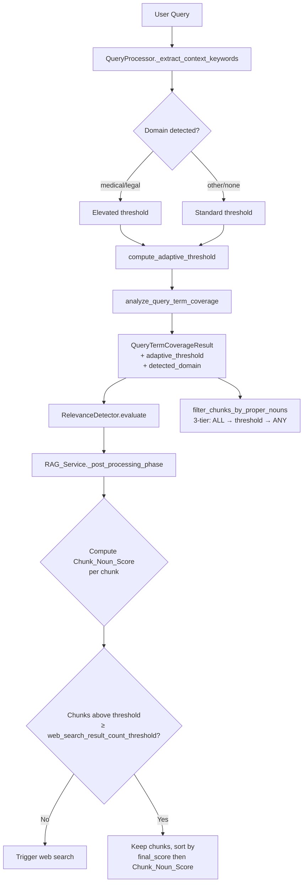

# Design Document: Adaptive Proper Noun Coverage

## Overview

This feature replaces the binary all-or-nothing proper noun coverage logic in the KG-guided retrieval pipeline with an adaptive system that scales coverage expectations based on proper noun count and domain context. The current system declares a coverage gap when even a single proper noun is missing, which is appropriate for 1–2 noun queries but overly aggressive for queries with many proper nouns (e.g., 14 out of 15 covered still triggers a gap). The adaptive system introduces:

1. A **Coverage Threshold Calculator** that computes a monotonically decreasing required coverage ratio as noun count grows, flooring at 70% (configurable).
2. **Domain-aware threshold elevation** for medical (95%) and legal (90%) queries, reusing the existing keyword-based domain detection from `_extract_context_keywords()`.
3. **Graduated chunk noun scoring** that gives partial credit to chunks covering some but not all key nouns, using the adaptive threshold as a retention cutoff rather than requiring ALL nouns.
4. **Three-tier pre-reranking filter** (ALL → adaptive threshold → ANY) replacing the current two-tier (ALL → ANY) filter.
5. **Web search trigger** based on surviving chunk count < `web_search_result_count_threshold` (default 3), not coverage ratio alone.

All changes are confined to four files: `relevance_detector.py`, `rag_service.py`, `kg_retrieval_service.py`, and `config.py`. No new files are created.

## Architecture

The adaptive threshold logic is a pure function that lives in `relevance_detector.py` alongside the existing coverage analysis. Domain classification is passed as a parameter — the caller (RAG service or KG retrieval service) extracts it from the query processor's context keywords or passes `None` for the default path.



### Data Flow

1. `query_processor._extract_context_keywords()` already detects domain via keyword patterns → produces `"domain:medical"`, `"domain:legal"`, etc.
2. The caller extracts the domain string from context keywords and passes it to `compute_adaptive_threshold()`.
3. `analyze_query_term_coverage()` calls `compute_adaptive_threshold()` internally and stores the result on `QueryTermCoverageResult`.
4. `filter_chunks_by_proper_nouns()` receives the adaptive threshold and applies the three-tier filter.
5. `_post_processing_phase()` computes `Chunk_Noun_Score` per chunk, filters by adaptive threshold, sorts by `(final_score DESC, chunk_noun_score DESC)`, and triggers web search when surviving count < threshold.

## Components and Interfaces

### 1. `compute_adaptive_threshold()` — New Pure Function

Location: `src/multimodal_librarian/components/kg_retrieval/relevance_detector.py`

```python
def compute_adaptive_threshold(
    proper_noun_count: int,
    domain: Optional[str] = None,
    base_threshold_floor: float = 0.70,
    medical_threshold: float = 0.95,
    legal_threshold: float = 0.90,
    small_query_noun_limit: int = 2,
) -> float:
```

**Threshold formula** (for `proper_noun_count > small_query_noun_limit`):

```
threshold = max(base_threshold_floor, 1.0 - (proper_noun_count - small_query_noun_limit) * 0.05)
```

This produces a linear decay from 1.0:
- 1–2 nouns → 1.0 (100%)
- 3 nouns → 0.95
- 4 nouns → 0.90
- 5 nouns → 0.85
- 6 nouns → 0.80
- 7 nouns → 0.75
- 8+ nouns → 0.70 (floor)

After computing the base threshold, domain elevation is applied:
- `medical` → `max(threshold, medical_threshold)`
- `legal` → `max(threshold, legal_threshold)`
- All others → no change

**Returns**: A float in `[base_threshold_floor, 1.0]`.

### 2. `compute_chunk_noun_score()` — New Pure Function

Location: `src/multimodal_librarian/components/kg_retrieval/relevance_detector.py`

```python
def compute_chunk_noun_score(
    chunk_content: str,
    key_nouns: List[str],
) -> float:
```

Computes the fraction of `key_nouns` present (case-insensitive substring match) in `chunk_content`. Returns `1.0` when `key_nouns` is empty.

### 3. Modified `QueryTermCoverageResult` Dataclass

Two new fields added:

```python
@dataclass
class QueryTermCoverageResult:
    # ... existing fields ...
    adaptive_threshold: float = 1.0
    detected_domain: Optional[str] = None
```

### 4. Modified `analyze_query_term_coverage()`

New parameters:
- `domain: Optional[str] = None` — detected domain string
- `base_threshold_floor: float = 0.70`
- `medical_threshold: float = 0.95`
- `legal_threshold: float = 0.90`
- `small_query_noun_limit: int = 2`

Changes:
- Calls `compute_adaptive_threshold()` with the proper noun count and domain.
- Sets `has_proper_noun_gap` based on `coverage_ratio < adaptive_threshold` instead of `len(uncovered) > 0`.
- Stores `adaptive_threshold` and `detected_domain` on the result.
- Co-occurrence gap: uses adaptive threshold — declares gap only when no chunk achieves a co-occurrence score ≥ adaptive threshold (instead of requiring ALL key nouns in one chunk).

### 5. Modified `filter_chunks_by_proper_nouns()`

New parameter: `adaptive_threshold: float = 1.0`

Three-tier filter logic:
1. **Tier 1 (ALL)**: Chunks containing ALL key terms.
2. **Tier 2 (Adaptive)**: If Tier 1 is empty, chunks where `(matched_key_terms / total_key_terms) >= adaptive_threshold`.
3. **Tier 3 (ANY)**: If Tier 2 is empty, chunks containing ANY key term.

### 6. Modified `_post_processing_phase()` in RAGService

Changes to the co-occurrence drop and per-chunk key-noun filter sections:
- Compute `chunk_noun_score` for each chunk using `compute_chunk_noun_score()`.
- Retain chunks where `chunk_noun_score >= adaptive_threshold` instead of requiring ALL key nouns.
- Sort retained chunks by `(final_score DESC, chunk_noun_score DESC)`.
- When no chunks meet the adaptive threshold, fall back to retaining the top chunks by `chunk_noun_score`.
- Web search trigger: count chunks with `chunk_noun_score >= adaptive_threshold`; if count < `web_search_result_count_threshold`, trigger web search.

### 7. Configuration Parameters in `Settings`

New fields in `src/multimodal_librarian/config/config.py`:

```python
# Adaptive proper noun coverage thresholds
adaptive_threshold_floor: float = Field(
    default=0.70,
    description="Minimum coverage ratio floor for adaptive threshold calculation",
)
adaptive_medical_threshold: float = Field(
    default=0.95,
    description="Minimum coverage threshold for medical domain queries",
)
adaptive_legal_threshold: float = Field(
    default=0.90,
    description="Minimum coverage threshold for legal domain queries",
)
adaptive_small_query_noun_limit: int = Field(
    default=2,
    description="Queries with this many or fewer proper nouns require 100% coverage",
)
```

## Data Models

### Modified: `QueryTermCoverageResult`

```python
@dataclass
class QueryTermCoverageResult:
    proper_nouns: List[str] = field(default_factory=list)
    covered_nouns: List[str] = field(default_factory=list)
    uncovered_nouns: List[str] = field(default_factory=list)
    coverage_ratio: float = 1.0
    has_proper_noun_gap: bool = False
    has_cooccurrence_gap: bool = False
    key_nouns: List[str] = field(default_factory=list)
    # New fields
    adaptive_threshold: float = 1.0
    detected_domain: Optional[str] = None
```

### New Concept: Chunk Noun Score

Not a persisted model — computed on-the-fly as a `float` per chunk during post-processing. Stored transiently in `chunk.metadata['chunk_noun_score']` on `DocumentChunk` instances for sorting purposes.

### Domain String Convention

Domain is represented as a plain string: `"medical"`, `"legal"`, `"technical"`, `"academic"`, `"business"`, or `None` for general/undetected. This matches the existing `domain_patterns` keys in `_extract_context_keywords()`.


## Correctness Properties

*A property is a characteristic or behavior that should hold true across all valid executions of a system — essentially, a formal statement about what the system should do. Properties serve as the bridge between human-readable specifications and machine-verifiable correctness guarantees.*

### Property 1: Adaptive threshold scaling

The prework identified that criteria 1.1 (100% for 1–2 nouns) and 1.2 (monotonically decreasing, flooring at 70%) are both properties about the same function `compute_adaptive_threshold` across different input ranges. They combine into a single comprehensive property:

*For any* proper noun count `n >= 0` and no domain elevation, `compute_adaptive_threshold(n)` returns 1.0 when `n <= small_query_noun_limit`, returns a value strictly less than or equal to the threshold for `n - 1` when `n > small_query_noun_limit` (monotonically non-increasing), and never returns a value below `base_threshold_floor`.

**Validates: Requirements 1.1, 1.2**

### Property 2: Domain elevation

The prework identified that criteria 2.1 (medical ≥ 95%), 2.2 (legal ≥ 90%), 2.3 (non-elevated domains unchanged), and 2.4 (configurable overrides) all concern domain elevation behavior. They combine into one property:

*For any* proper noun count `n >= 1`, `compute_adaptive_threshold(n, domain="medical")` is always `>= medical_threshold` (default 0.95), `compute_adaptive_threshold(n, domain="legal")` is always `>= legal_threshold` (default 0.90), and for any domain not in `{"medical", "legal"}` (including `None`), the threshold equals the standard non-elevated threshold for the same `n`.

**Validates: Requirements 2.1, 2.2, 2.3, 2.4, 2.5**

### Property 3: Gap declaration correctness

From criterion 1.3 — the gap flag must be a direct function of coverage ratio vs. adaptive threshold:

*For any* `QueryTermCoverageResult` produced by `analyze_query_term_coverage`, `has_proper_noun_gap` is `True` if and only if `coverage_ratio < adaptive_threshold`.

**Validates: Requirements 1.3**

### Property 4: Threshold and domain exposed on result

From criterion 1.4 — downstream consumers need the threshold value:

*For any* call to `analyze_query_term_coverage` with a given proper noun count and domain, the returned `QueryTermCoverageResult.adaptive_threshold` equals `compute_adaptive_threshold(proper_noun_count, domain)` and `detected_domain` equals the domain passed in.

**Validates: Requirements 1.4, 8.3**

### Property 5: Chunk noun score computation

The prework identified that criteria 3.1 (chunk noun score) and 7.1 (co-occurrence score) use the same computation. Combined:

*For any* chunk content string and list of key nouns, `compute_chunk_noun_score(content, key_nouns)` equals the count of key nouns found (case-insensitive substring match) in the content divided by the total number of key nouns. When key nouns is empty, the score is 1.0.

**Validates: Requirements 3.1, 7.1**

### Property 6: Chunk retention by adaptive threshold

From criterion 3.2 — filtering retains exactly the right chunks:

*For any* list of chunks with known content, list of key nouns, and adaptive threshold, the set of chunks retained by adaptive threshold filtering is exactly the set of chunks whose `compute_chunk_noun_score` meets or exceeds the adaptive threshold. When no chunks meet the threshold, the fallback retains the top chunks by noun score (non-empty result).

**Validates: Requirements 3.2, 3.4**

### Property 7: Relevance ranking preservation

The prework identified that criteria 3.3, 4.1, 4.2, and 4.3 all describe the same sorting invariant. Combined:

*For any* list of retained chunks, the output ordering satisfies: for every pair of chunks `(a, b)` where `a` appears before `b`, either `a.final_score > b.final_score`, or `a.final_score == b.final_score` and `a.chunk_noun_score >= b.chunk_noun_score`. That is, `final_score` is the primary descending sort key and `chunk_noun_score` is the secondary descending sort key.

**Validates: Requirements 3.3, 4.1, 4.2, 4.3**

### Property 8: Three-tier pre-reranking filter

The prework identified that criteria 5.1 and 5.3 describe the three tiers of the filter. Combined:

*For any* list of chunks, list of key terms, and adaptive threshold: if any chunks contain ALL key terms, the filter returns exactly those chunks; otherwise, if any chunks have a key-term fraction `>= adaptive_threshold`, the filter returns exactly those chunks; otherwise, the filter returns all chunks containing ANY key term.

**Validates: Requirements 5.1, 5.2, 5.3**

### Property 9: Web search trigger based on surviving chunk count

The prework identified that criteria 6.1 and 6.2 are logical inverses. Combined:

*For any* set of chunks with known noun scores, adaptive threshold, and `web_search_result_count_threshold`, the proper-noun-coverage web search signal fires if and only if the count of chunks whose `chunk_noun_score >= adaptive_threshold` is strictly less than `web_search_result_count_threshold`.

**Validates: Requirements 6.1, 6.2**

### Property 10: Co-occurrence gap declaration

The prework identified that criteria 7.2 and 7.3 are logical inverses. Combined:

*For any* set of chunks, list of key nouns (length ≥ 2), and adaptive threshold, `has_cooccurrence_gap` is `True` if and only if no chunk achieves a `compute_chunk_noun_score >= adaptive_threshold`.

**Validates: Requirements 7.2, 7.3**

## Error Handling

### Graceful Degradation

| Scenario | Behavior |
|----------|----------|
| spaCy model unavailable | `analyze_query_term_coverage` returns default `QueryTermCoverageResult` (no gap, threshold 1.0). No adaptive logic applied. |
| Query has no proper nouns | Coverage ratio = 1.0, adaptive threshold = 1.0, no gap declared. Chunk filtering and web search trigger are skipped. |
| Domain detection returns `None` | Standard adaptive threshold used (no elevation). Equivalent to `"general"` domain. |
| All chunks below adaptive threshold | Fallback: retain top chunks by `chunk_noun_score` descending. Never return empty set from filtering. |
| `filter_chunks_by_proper_nouns` all three tiers empty | Return `None` (fall back to unfiltered candidates, same as current behavior). |
| SearXNG unavailable when web search triggered | Catch exception, log warning, proceed with retained local chunks. Existing behavior preserved. |
| Invalid config values (e.g., floor > 1.0) | `compute_adaptive_threshold` clamps output to `[0.0, 1.0]`. Pydantic validation on `Settings` fields prevents obviously invalid values. |

### Logging

All threshold decisions are logged at INFO level with:
- `proper_noun_count`, `adaptive_threshold`, `coverage_ratio`, `detected_domain`, `has_proper_noun_gap`, `has_cooccurrence_gap`
- Pre-reranking filter: `match_mode` (all/threshold/any), before/after counts, key terms
- Post-processing: `chunk_noun_score` per chunk, surviving count, web search trigger decision

## Testing Strategy

### Property-Based Testing

Library: **Hypothesis** (already in use — `.hypothesis/` directory exists in the project root).

Each correctness property maps to a single Hypothesis test. Tests generate random inputs (proper noun counts, domain strings, chunk contents, key noun lists, threshold values) and verify the universal property holds.

Configuration:
- Minimum 100 examples per test via `@settings(max_examples=100)`
- Each test tagged with a comment: `# Feature: adaptive-proper-noun-coverage, Property {N}: {title}`

Property tests target the pure functions:
- `compute_adaptive_threshold()` — Properties 1, 2
- `compute_chunk_noun_score()` — Property 5
- `analyze_query_term_coverage()` — Properties 3, 4, 10 (with mocked spaCy)
- `filter_chunks_by_proper_nouns()` — Property 8 (with mocked spaCy)
- Sorting/filtering logic extracted into testable helpers — Properties 6, 7, 9

### Unit Testing

Unit tests complement property tests for specific examples and edge cases:

- **Edge cases**: 0 proper nouns, 1 proper noun, exactly at threshold boundary, empty chunk content, empty key nouns list
- **Domain edge cases**: `None` domain, unknown domain string, medical with 1 noun (should still be 1.0 since ≤ small_query_noun_limit)
- **Fallback behavior**: All chunks below threshold → top chunks retained; all three filter tiers empty → `None` returned
- **Integration**: End-to-end flow through `_post_processing_phase` with mocked relevance detector and chunks, verifying sort order and web search trigger
- **Logging verification**: Confirm INFO-level log messages contain expected fields using `caplog`

### Test File Location

```
tests/components/test_adaptive_proper_noun_coverage.py
```

Property tests and unit tests coexist in the same file, grouped by the component under test.
