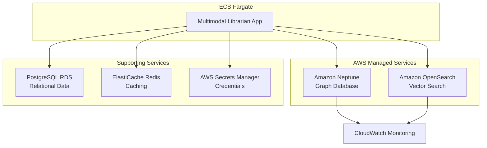

# AWS-Native Database Implementation Design

## Overview

This design document outlines the implementation of a fully managed AWS-Native database solution for the Multimodal Librarian system, replacing self-managed Neo4j and Milvus instances with Amazon Neptune and Amazon OpenSearch services.

The solution prioritizes reliability, cost-optimization, and ease of management while maintaining the same functionality as the previous self-managed approach.

## Architecture

### High-Level Architecture



### Service Configuration

#### Amazon Neptune Configuration
- **Instance Type**: db.t3.medium (cost-optimized)
- **Engine**: Neptune 1.2.x (latest stable)
- **Query Language**: Gremlin (Apache TinkerPop)
- **Deployment**: Single-AZ for cost optimization
- **Storage**: Cluster storage (auto-scaling)
- **Backup**: 7-day automated backups

#### Amazon OpenSearch Configuration
- **Instance Type**: t3.small.search (cost-optimized)
- **Version**: OpenSearch 2.x (latest stable)
- **Deployment**: Single-AZ, single node for cost optimization
- **Storage**: 20GB EBS gp3 (expandable)
- **Plugins**: k-NN plugin for vector similarity search

## Components and Interfaces

### Neptune Client Service

```python
class NeptuneClient:
    """AWS Neptune client with Gremlin query support."""
    
    def __init__(self, cluster_endpoint: str, region: str):
        self.cluster_endpoint = cluster_endpoint
        self.region = region
        self.connection = None
    
    async def connect(self) -> None:
        """Establish connection using IAM authentication."""
        pass
    
    async def execute_gremlin(self, query: str, bindings: dict = None) -> List[Dict]:
        """Execute Gremlin query and return results."""
        pass
    
    async def create_vertex(self, label: str, properties: dict) -> str:
        """Create vertex and return ID."""
        pass
    
    async def create_edge(self, from_id: str, to_id: str, label: str, properties: dict = None) -> str:
        """Create edge between vertices."""
        pass
    
    async def health_check(self) -> Dict[str, Any]:
        """Check Neptune cluster health."""
        pass
```

### OpenSearch Client Service

```python
class OpenSearchClient:
    """AWS OpenSearch client with vector search support."""
    
    def __init__(self, domain_endpoint: str, region: str):
        self.domain_endpoint = domain_endpoint
        self.region = region
        self.client = None
    
    async def connect(self) -> None:
        """Establish connection using IAM authentication."""
        pass
    
    async def create_index(self, index_name: str, mapping: dict) -> bool:
        """Create index with vector field mapping."""
        pass
    
    async def index_document(self, index_name: str, doc_id: str, document: dict) -> bool:
        """Index document with vector embeddings."""
        pass
    
    async def vector_search(self, index_name: str, query_vector: List[float], k: int = 10) -> List[Dict]:
        """Perform k-NN vector similarity search."""
        pass
    
    async def health_check(self) -> Dict[str, Any]:
        """Check OpenSearch cluster health."""
        pass
```

### Configuration Management

```python
class AWSNativeConfig:
    """Configuration for AWS-Native database services."""
    
    def __init__(self):
        self.neptune_endpoint = os.getenv('NEPTUNE_CLUSTER_ENDPOINT')
        self.opensearch_endpoint = os.getenv('OPENSEARCH_DOMAIN_ENDPOINT')
        self.region = os.getenv('AWS_DEFAULT_REGION', 'us-east-1')
        self.use_iam_auth = True
    
    def is_aws_native_enabled(self) -> bool:
        """Check if AWS-Native mode is enabled."""
        return bool(self.neptune_endpoint and self.opensearch_endpoint)
```

## Data Models

### Neptune Graph Schema

```gremlin
// Vertex Labels
- Document: Represents uploaded documents
- Concept: Represents extracted concepts/entities
- User: Represents system users
- Topic: Represents document topics/categories

// Edge Labels
- CONTAINS: Document -> Concept
- RELATES_TO: Concept -> Concept
- AUTHORED_BY: Document -> User
- BELONGS_TO: Document -> Topic
- SIMILAR_TO: Document -> Document

// Properties
Document: {id, title, content_hash, upload_date, file_type, size}
Concept: {id, name, type, confidence_score, extraction_method}
User: {id, username, email, created_date}
Topic: {id, name, description, parent_topic_id}
```

### OpenSearch Index Schema

```json
{
  "mappings": {
    "properties": {
      "document_id": {"type": "keyword"},
      "title": {"type": "text"},
      "content": {"type": "text"},
      "embedding": {
        "type": "knn_vector",
        "dimension": 384,
        "method": {
          "name": "hnsw",
          "space_type": "cosinesimil",
          "engine": "nmslib"
        }
      },
      "metadata": {
        "properties": {
          "file_type": {"type": "keyword"},
          "upload_date": {"type": "date"},
          "size": {"type": "long"},
          "tags": {"type": "keyword"}
        }
      }
    }
  }
}
```

## Infrastructure as Code

### Terraform Configuration

```hcl
# Neptune Cluster
resource "aws_neptune_cluster" "main" {
  cluster_identifier      = "multimodal-librarian-neptune"
  engine                 = "neptune"
  backup_retention_period = 7
  preferred_backup_window = "07:00-09:00"
  skip_final_snapshot    = true
  
  vpc_security_group_ids = [aws_security_group.neptune.id]
  db_subnet_group_name   = aws_neptune_subnet_group.main.name
  
  storage_encrypted = true
  
  tags = {
    Name = "multimodal-librarian-neptune"
    Environment = "learning"
  }
}

resource "aws_neptune_cluster_instance" "main" {
  count              = 1
  identifier         = "multimodal-librarian-neptune-${count.index}"
  cluster_identifier = aws_neptune_cluster.main.id
  instance_class     = "db.t3.medium"
  engine             = "neptune"
}

# OpenSearch Domain
resource "aws_opensearch_domain" "main" {
  domain_name    = "multimodal-librarian-search"
  engine_version = "OpenSearch_2.3"
  
  cluster_config {
    instance_type  = "t3.small.search"
    instance_count = 1
  }
  
  ebs_options {
    ebs_enabled = true
    volume_type = "gp3"
    volume_size = 20
  }
  
  vpc_options {
    security_group_ids = [aws_security_group.opensearch.id]
    subnet_ids         = [aws_subnet.private[0].id]
  }
  
  encrypt_at_rest {
    enabled = true
  }
  
  node_to_node_encryption {
    enabled = true
  }
  
  domain_endpoint_options {
    enforce_https = true
  }
  
  tags = {
    Name = "multimodal-librarian-search"
    Environment = "learning"
  }
}
```

## Error Handling

### Connection Management
- **Retry Logic**: Exponential backoff for connection failures
- **Circuit Breaker**: Prevent cascading failures when services are unavailable
- **Fallback Behavior**: Graceful degradation when services are unavailable
- **Health Monitoring**: Continuous health checks with alerting

### Error Categories
1. **Connection Errors**: Network issues, authentication failures
2. **Query Errors**: Invalid Gremlin/OpenSearch queries, syntax errors
3. **Resource Errors**: Insufficient capacity, throttling
4. **Data Errors**: Schema validation, data corruption

## Testing Strategy

### Unit Tests
- Mock AWS service clients for isolated testing
- Test query generation and result parsing
- Validate error handling and retry logic
- Test configuration management

### Integration Tests
- Test against local Neptune/OpenSearch instances
- Validate end-to-end data flow
- Test migration scripts and data integrity
- Performance testing with realistic data volumes

### Property-Based Tests

*A property is a characteristic or behavior that should hold true across all valid executions of a system-essentially, a formal statement about what the system should do. Properties serve as the bridge between human-readable specifications and machine-verifiable correctness guarantees.*

#### Property 1: Graph Data Consistency
*For any* valid graph operation (create vertex, create edge, query), the resulting graph state should maintain referential integrity and be queryable through Gremlin traversals.
**Validates: Requirements 1.4**

#### Property 2: Vector Search Accuracy
*For any* document with vector embeddings, indexing then searching with the same vector should return the document as the top result with similarity score ≥ 0.99.
**Validates: Requirements 2.4**

#### Property 3: Authentication Round-trip
*For any* valid IAM credentials, establishing a connection then performing a health check should succeed without authentication errors.
**Validates: Requirements 4.3**

#### Property 4: Cost Optimization Compliance
*For any* cluster configuration, the monthly cost calculation should not exceed the specified budget limits ($200-300 total).
**Validates: Requirements 3.4**

#### Property 5: Migration Data Integrity
*For any* data set migrated from self-managed to AWS-Native services, querying the same data should return identical results before and after migration.
**Validates: Requirements 6.3**

## Cost Analysis

### Monthly Cost Estimates (US East 1)

#### Amazon Neptune
- **db.t3.medium instance**: ~$150-200/month
- **Storage**: ~$10-20/month (first 10GB free)
- **I/O requests**: ~$5-10/month
- **Total Neptune**: ~$165-230/month

#### Amazon OpenSearch
- **t3.small.search instance**: ~$50-70/month
- **EBS storage (20GB)**: ~$2-3/month
- **Data transfer**: ~$5-10/month
- **Total OpenSearch**: ~$57-83/month

#### Combined Total
- **Total AWS-Native**: ~$222-313/month
- **Previous self-managed**: ~$50-80/month
- **Cost increase**: ~$172-233/month

### Cost Optimization Strategies
1. **Reserved Instances**: 30-50% savings with 1-year commitment
2. **Scheduled Scaling**: Scale down during off-hours (nights/weekends)
3. **Right-sizing**: Monitor usage and adjust instance types
4. **Data Lifecycle**: Implement data archival for older documents

## Migration Strategy

### Phase 1: Infrastructure Setup (Week 1)
1. Deploy Neptune and OpenSearch clusters
2. Configure security groups and IAM roles
3. Set up monitoring and alerting
4. Validate basic connectivity

### Phase 2: Application Integration (Week 2)
1. Implement Neptune and OpenSearch clients
2. Update application configuration
3. Add health check endpoints
4. Deploy with feature flags (disabled)

### Phase 3: Data Migration (Week 3)
1. Export existing Neo4j data (if any)
2. Export existing vector data (if any)
3. Import data to Neptune and OpenSearch
4. Validate data integrity

### Phase 4: Cutover and Validation (Week 4)
1. Enable AWS-Native features
2. Run comprehensive tests
3. Monitor performance and costs
4. Decommission old infrastructure

## Monitoring and Alerting

### CloudWatch Metrics
- **Neptune**: CPU utilization, connection count, query latency
- **OpenSearch**: CPU utilization, search latency, indexing rate
- **Application**: Connection health, query success rate, error rate

### Alerts
- Service unavailability (> 5 minutes)
- High error rate (> 5% for 10 minutes)
- Cost anomalies (> 20% increase)
- Performance degradation (> 2x normal latency)

### Dashboards
- Real-time service health overview
- Cost tracking and projections
- Query performance trends
- Resource utilization patterns