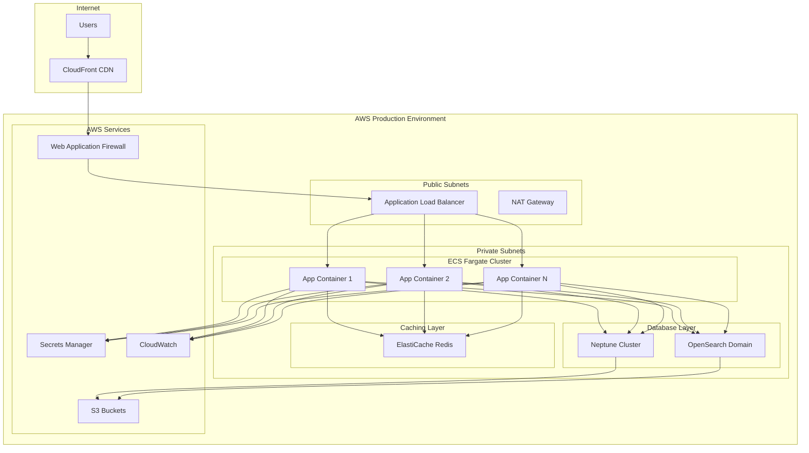

# Design Document

## Overview

The AWS Production Deployment design provides a comprehensive, production-ready deployment of the Multimodal Librarian system using AWS-Native services. This design leverages the clean AWS-Native architecture (Neptune + OpenSearch) and implements industry best practices for security, scalability, monitoring, and cost optimization.

The deployment follows a multi-tier architecture with proper separation of concerns, comprehensive monitoring, and automated operational procedures. The system is designed to be highly available, secure, and cost-effective while providing excellent performance for production workloads.

## Architecture

### High-Level Architecture



### Infrastructure Components

#### Networking Layer
- **VPC**: Multi-AZ VPC with public and private subnets
- **Public Subnets**: Application Load Balancer and NAT Gateway
- **Private Subnets**: ECS containers, databases, and caching layer
- **Security Groups**: Restrictive security groups for each tier
- **NACLs**: Network ACLs for additional security

#### Compute Layer
- **ECS Fargate**: Serverless container platform for application hosting
- **Auto Scaling**: CPU and memory-based scaling policies
- **Application Load Balancer**: SSL termination and traffic distribution
- **CloudFront**: Global CDN for static content delivery

#### Database Layer
- **Neptune Cluster**: Multi-AZ Neptune cluster for graph database
- **OpenSearch Domain**: Multi-node OpenSearch domain for vector search
- **ElastiCache Redis**: In-memory caching for performance optimization

#### Security Layer
- **IAM Roles**: Least-privilege access for all components
- **Secrets Manager**: Secure credential storage and rotation
- **Certificate Manager**: SSL/TLS certificate management
- **Web Application Firewall**: Protection against common attacks
- **CloudTrail**: Comprehensive audit logging

#### Monitoring Layer
- **CloudWatch**: Metrics, logs, and alarms
- **X-Ray**: Distributed tracing for request flow
- **SNS**: Alert notifications
- **Custom Dashboards**: Operational visibility

## Components and Interfaces

### Infrastructure as Code (Terraform)

#### Main Infrastructure Module
```hcl
# terraform/main.tf
module "vpc" {
  source = "./modules/vpc"
  
  vpc_cidr             = var.vpc_cidr
  availability_zones   = var.availability_zones
  public_subnet_cidrs  = var.public_subnet_cidrs
  private_subnet_cidrs = var.private_subnet_cidrs
  
  tags = local.common_tags
}

module "security" {
  source = "./modules/security"
  
  vpc_id = module.vpc.vpc_id
  tags   = local.common_tags
}

module "databases" {
  source = "./modules/databases"
  
  vpc_id              = module.vpc.vpc_id
  private_subnet_ids  = module.vpc.private_subnet_ids
  security_group_ids  = [module.security.database_security_group_id]
  
  tags = local.common_tags
}

module "application" {
  source = "./modules/application"
  
  vpc_id             = module.vpc.vpc_id
  public_subnet_ids  = module.vpc.public_subnet_ids
  private_subnet_ids = module.vpc.private_subnet_ids
  security_groups    = module.security.application_security_groups
  
  neptune_endpoint    = module.databases.neptune_endpoint
  opensearch_endpoint = module.databases.opensearch_endpoint
  
  tags = local.common_tags
}
```

#### Database Module
```hcl
# terraform/modules/databases/main.tf
resource "aws_neptune_cluster" "main" {
  cluster_identifier      = "${var.project_name}-neptune"
  engine                 = "neptune"
  backup_retention_period = 7
  preferred_backup_window = "07:00-09:00"
  skip_final_snapshot    = false
  
  vpc_security_group_ids = var.security_group_ids
  db_subnet_group_name   = aws_neptune_subnet_group.main.name
  
  storage_encrypted = true
  kms_key_id       = aws_kms_key.neptune.arn
  
  tags = var.tags
}

resource "aws_opensearch_domain" "main" {
  domain_name    = "${var.project_name}-opensearch"
  engine_version = "OpenSearch_2.3"
  
  cluster_config {
    instance_type  = "t3.medium.search"
    instance_count = 3
    
    dedicated_master_enabled = true
    master_instance_type     = "t3.small.search"
    master_instance_count    = 3
  }
  
  vpc_options {
    security_group_ids = var.security_group_ids
    subnet_ids         = var.private_subnet_ids
  }
  
  encrypt_at_rest {
    enabled    = true
    kms_key_id = aws_kms_key.opensearch.arn
  }
  
  node_to_node_encryption {
    enabled = true
  }
  
  domain_endpoint_options {
    enforce_https = true
  }
  
  tags = var.tags
}
```

### Application Deployment

#### ECS Task Definition
```json
{
  "family": "multimodal-librarian",
  "networkMode": "awsvpc",
  "requiresCompatibilities": ["FARGATE"],
  "cpu": "1024",
  "memory": "2048",
  "executionRoleArn": "arn:aws:iam::ACCOUNT:role/ecsTaskExecutionRole",
  "taskRoleArn": "arn:aws:iam::ACCOUNT:role/ecsTaskRole",
  "containerDefinitions": [
    {
      "name": "multimodal-librarian",
      "image": "ACCOUNT.dkr.ecr.REGION.amazonaws.com/multimodal-librarian:latest",
      "portMappings": [
        {
          "containerPort": 8000,
          "protocol": "tcp"
        }
      ],
      "environment": [
        {
          "name": "AWS_DEFAULT_REGION",
          "value": "us-east-1"
        },
        {
          "name": "ENVIRONMENT",
          "value": "production"
        }
      ],
      "secrets": [
        {
          "name": "NEPTUNE_SECRET_NAME",
          "valueFrom": "arn:aws:secretsmanager:REGION:ACCOUNT:secret:multimodal-librarian/aws-native/neptune"
        },
        {
          "name": "OPENSEARCH_SECRET_NAME",
          "valueFrom": "arn:aws:secretsmanager:REGION:ACCOUNT:secret:multimodal-librarian/aws-native/opensearch"
        }
      ],
      "logConfiguration": {
        "logDriver": "awslogs",
        "options": {
          "awslogs-group": "/ecs/multimodal-librarian",
          "awslogs-region": "us-east-1",
          "awslogs-stream-prefix": "ecs"
        }
      },
      "healthCheck": {
        "command": ["CMD-SHELL", "curl -f http://localhost:8000/health/simple || exit 1"],
        "interval": 30,
        "timeout": 5,
        "retries": 3,
        "startPeriod": 60
      }
    }
  ]
}
```

#### Auto Scaling Configuration
```hcl
resource "aws_appautoscaling_target" "ecs_target" {
  max_capacity       = 10
  min_capacity       = 2
  resource_id        = "service/${aws_ecs_cluster.main.name}/${aws_ecs_service.main.name}"
  scalable_dimension = "ecs:service:DesiredCount"
  service_namespace  = "ecs"
}

resource "aws_appautoscaling_policy" "cpu_scaling" {
  name               = "cpu-scaling"
  policy_type        = "TargetTrackingScaling"
  resource_id        = aws_appautoscaling_target.ecs_target.resource_id
  scalable_dimension = aws_appautoscaling_target.ecs_target.scalable_dimension
  service_namespace  = aws_appautoscaling_target.ecs_target.service_namespace

  target_tracking_scaling_policy_configuration {
    predefined_metric_specification {
      predefined_metric_type = "ECSServiceAverageCPUUtilization"
    }
    target_value = 70.0
  }
}
```

## Data Models

### Infrastructure Configuration
```python
@dataclass
class InfrastructureConfig:
    """Configuration for AWS infrastructure deployment."""
    
    # Network Configuration
    vpc_cidr: str
    availability_zones: List[str]
    public_subnet_cidrs: List[str]
    private_subnet_cidrs: List[str]
    
    # Database Configuration
    neptune_instance_type: str
    neptune_instance_count: int
    opensearch_instance_type: str
    opensearch_instance_count: int
    
    # Application Configuration
    ecs_cpu: int
    ecs_memory: int
    min_capacity: int
    max_capacity: int
    
    # Security Configuration
    enable_waf: bool
    enable_cloudtrail: bool
    kms_key_rotation: bool
    
    # Monitoring Configuration
    log_retention_days: int
    metric_retention_days: int
    alarm_notification_topic: str

@dataclass
class DeploymentStatus:
    """Status of deployment operations."""
    
    deployment_id: str
    environment: str
    status: str  # pending, in_progress, completed, failed
    started_at: datetime
    completed_at: Optional[datetime]
    
    # Infrastructure Status
    vpc_status: str
    database_status: str
    application_status: str
    monitoring_status: str
    
    # Validation Results
    connectivity_tests: Dict[str, bool]
    performance_tests: Dict[str, float]
    security_tests: Dict[str, bool]
    
    # Error Information
    errors: List[str]
    warnings: List[str]
```

### Monitoring Configuration
```python
@dataclass
class MonitoringConfig:
    """Configuration for monitoring and alerting."""
    
    # CloudWatch Configuration
    log_groups: List[str]
    metric_namespaces: List[str]
    dashboard_names: List[str]
    
    # Alarm Configuration
    cpu_threshold: float
    memory_threshold: float
    error_rate_threshold: float
    response_time_threshold: float
    
    # Notification Configuration
    sns_topics: List[str]
    email_endpoints: List[str]
    slack_webhooks: List[str]
    
    # Tracing Configuration
    enable_xray: bool
    sampling_rate: float
    trace_retention_days: int

@dataclass
class BackupConfig:
    """Configuration for backup and recovery."""
    
    # Neptune Backup Configuration
    neptune_backup_retention: int
    neptune_backup_window: str
    neptune_maintenance_window: str
    
    # OpenSearch Backup Configuration
    opensearch_snapshot_bucket: str
    opensearch_snapshot_schedule: str
    opensearch_snapshot_retention: int
    
    # Cross-Region Backup
    enable_cross_region_backup: bool
    backup_region: str
    
    # Recovery Configuration
    recovery_point_objective: int  # minutes
    recovery_time_objective: int   # minutes
```

## Correctness Properties

*A property is a characteristic or behavior that should hold true across all valid executions of a system-essentially, a formal statement about what the system should do. Properties serve as the bridge between human-readable specifications and machine-verifiable correctness guarantees.*

### Infrastructure Properties

**Property 1: Terraform Resource Validation**
*For any* Terraform configuration, applying the configuration should create all specified AWS resources with correct attributes and tags
**Validates: Requirements 1.1, 1.7**

**Property 2: Network Security Isolation**
*For any* deployed infrastructure, backend services should only be accessible from private subnets and not directly from the internet
**Validates: Requirements 1.4, 2.4, 3.5, 4.2**

**Property 3: Encryption Enforcement**
*For any* data storage resource, encryption should be enabled both in transit and at rest with proper KMS key management
**Validates: Requirements 1.6, 3.6**

**Property 4: IAM Least Privilege**
*For any* IAM role or policy, the permissions should follow least-privilege principles and not grant unnecessary access
**Validates: Requirements 1.5, 4.1**

### Application Deployment Properties

**Property 5: Container Health Validation**
*For any* deployed ECS service, all running tasks should pass health checks and be registered with the load balancer
**Validates: Requirements 2.1, 2.7**

**Property 6: Auto Scaling Responsiveness**
*For any* auto scaling configuration, the system should scale up when CPU/memory thresholds are exceeded and scale down when usage decreases
**Validates: Requirements 2.5, 6.2, 8.5**

**Property 7: Load Balancer SSL Configuration**
*For any* Application Load Balancer, SSL termination should be properly configured with valid certificates from AWS Certificate Manager
**Validates: Requirements 2.3, 4.3**

### Database Configuration Properties

**Property 8: Database Production Readiness**
*For any* database cluster (Neptune or OpenSearch), the configuration should use production-appropriate instance types and multi-AZ deployment
**Validates: Requirements 3.1, 3.2**

**Property 9: Database Authentication Security**
*For any* database connection, authentication should use IAM roles and credentials should be stored in AWS Secrets Manager
**Validates: Requirements 3.3, 3.4**

**Property 10: Backup Configuration Completeness**
*For any* database service, automated backups should be enabled with appropriate retention periods and point-in-time recovery capabilities
**Validates: Requirements 3.7, 7.1, 7.2, 7.7**

### Security Properties

**Property 11: Security Control Implementation**
*For any* security requirement, the corresponding AWS security service (WAF, CloudTrail, Secrets Manager) should be properly configured and enabled
**Validates: Requirements 4.5, 4.6, 4.7**

**Property 12: Network Security Enforcement**
*For any* network communication, traffic should flow through proper security groups and NACLs with restrictive rules
**Validates: Requirements 4.2, 1.5**

### Monitoring Properties

**Property 13: Comprehensive Logging**
*For any* application or infrastructure component, logs should be sent to CloudWatch with proper retention and structured formatting
**Validates: Requirements 5.1, 5.7**

**Property 14: Alerting Configuration**
*For any* critical system metric, CloudWatch alarms should be configured with appropriate thresholds and SNS notifications
**Validates: Requirements 5.3, 5.6**

**Property 15: Performance Monitoring Coverage**
*For any* system component, performance metrics should be collected and monitored with alerting for degradation
**Validates: Requirements 5.2, 5.4, 8.7**

### Cost Optimization Properties

**Property 16: Resource Right-Sizing**
*For any* AWS resource, the instance type and configuration should be appropriate for the workload requirements without over-provisioning
**Validates: Requirements 6.1, 6.3**

**Property 17: Cost Monitoring Implementation**
*For any* deployed environment, cost tracking should be enabled with budget alerts and resource tagging for cost allocation
**Validates: Requirements 6.6, 1.7**

### Deployment Automation Properties

**Property 18: CI/CD Pipeline Validation**
*For any* deployment pipeline, comprehensive tests should be executed before production deployment with proper approval gates
**Validates: Requirements 9.1, 9.3, 9.6**

**Property 19: Rollback Capability**
*For any* deployment, rollback mechanisms should be available and tested to quickly revert failed deployments
**Validates: Requirements 9.5**

**Property 20: Infrastructure State Management**
*For any* Terraform deployment, state should be properly managed with remote backend and state locking
**Validates: Requirements 9.4**

### Validation Properties

**Property 21: End-to-End Connectivity**
*For any* deployed system, the application should successfully connect to both Neptune and OpenSearch databases
**Validates: Requirements 11.2**

**Property 22: API Functionality Validation**
*For any* deployed application, all API endpoints should respond correctly with proper status codes and response formats
**Validates: Requirements 11.3**

**Property 23: Performance Requirements Compliance**
*For any* production deployment, the system should meet specified performance requirements for response time and throughput
**Validates: Requirements 11.4**

**Property 24: Security Control Validation**
*For any* security control, the implementation should be verified through automated security testing
**Validates: Requirements 11.5**

### Environment Management Properties

**Property 25: Environment Isolation**
*For any* environment (dev, staging, production), resources should be properly isolated with separate access controls and configurations
**Validates: Requirements 12.1, 12.2, 12.7**

**Property 26: Configuration Management**
*For any* environment-specific configuration, the values should be properly managed and applied without cross-environment contamination
**Validates: Requirements 12.3**

## Error Handling

### Infrastructure Deployment Errors
- **Terraform State Conflicts**: Implement state locking and conflict resolution
- **Resource Quota Limits**: Pre-validate quotas and request increases
- **Network Configuration Errors**: Validate CIDR blocks and routing tables
- **IAM Permission Errors**: Implement comprehensive permission validation

### Application Deployment Errors
- **Container Startup Failures**: Implement proper health checks and retry logic
- **Database Connection Failures**: Implement connection pooling and retry mechanisms
- **Load Balancer Health Check Failures**: Configure appropriate health check endpoints
- **Auto Scaling Issues**: Monitor scaling events and adjust policies

### Security Configuration Errors
- **Certificate Validation Failures**: Implement automated certificate renewal
- **IAM Role Assumption Failures**: Validate trust relationships and permissions
- **Security Group Misconfigurations**: Implement security group validation
- **Encryption Key Issues**: Implement proper KMS key management

### Monitoring and Alerting Errors
- **Log Delivery Failures**: Implement log delivery monitoring and alerting
- **Metric Collection Issues**: Monitor metric collection and alert on gaps
- **Alarm Configuration Errors**: Validate alarm thresholds and notification targets
- **Dashboard Display Issues**: Implement dashboard health monitoring

## Testing Strategy

### Infrastructure Testing
- **Terraform Validation**: Use `terraform validate` and `terraform plan` for syntax and logic validation
- **Security Testing**: Use tools like Checkov and tfsec for security policy validation
- **Cost Estimation**: Use Terraform cost estimation tools for budget validation
- **Compliance Testing**: Validate against AWS Config rules and compliance frameworks

### Application Testing
- **Container Testing**: Test container builds and health check endpoints
- **Integration Testing**: Test application connectivity to databases and external services
- **Load Testing**: Validate performance under expected and peak loads
- **Security Testing**: Perform vulnerability scanning and penetration testing

### End-to-End Testing
- **Deployment Testing**: Test complete deployment pipeline from code to production
- **Disaster Recovery Testing**: Test backup and recovery procedures
- **Monitoring Testing**: Validate all monitoring and alerting configurations
- **Performance Testing**: Validate system performance meets requirements

### Property-Based Testing Configuration
- Each correctness property will be implemented as a property-based test
- Tests will run with minimum 100 iterations to ensure comprehensive coverage
- Each test will be tagged with: **Feature: aws-production-deployment, Property {number}: {property_text}**
- Tests will validate infrastructure configuration, security controls, and operational procedures
- Automated validation scripts will run continuously to verify system compliance