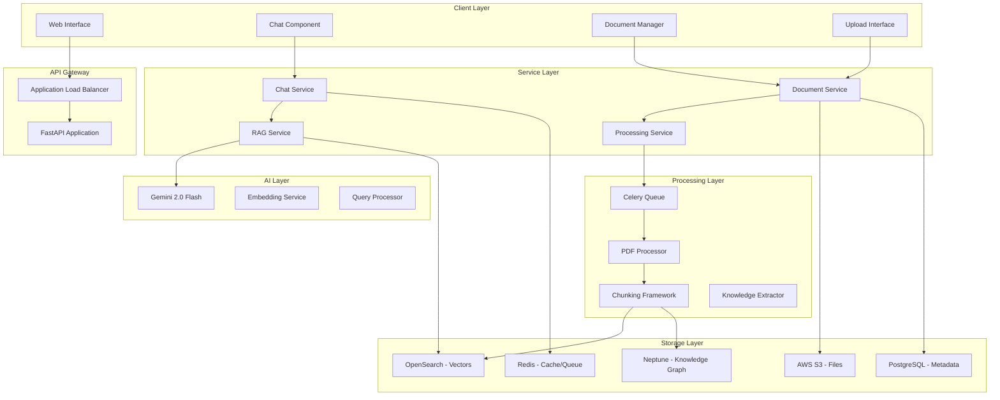
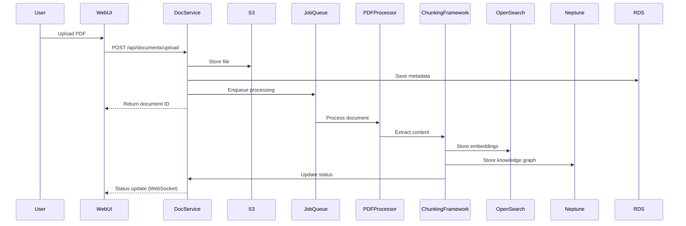
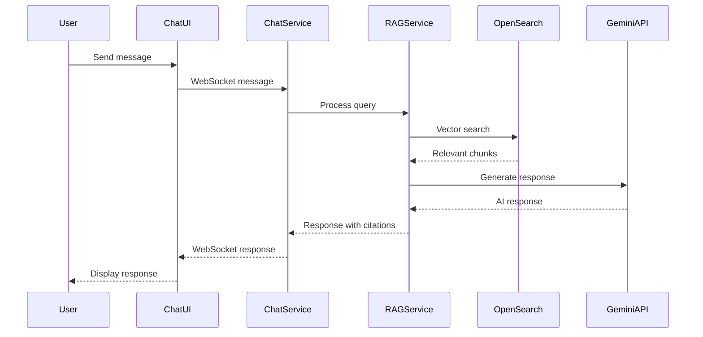

# Chat and Document Integration Design Document

## Overview

This design document outlines the technical architecture and implementation approach for integrating AI-powered chat functionality with PDF document upload and RAG (Retrieval-Augmented Generation) processing. The system will transform the current basic deployment into a fully functional knowledge management and conversation platform.

## Architecture

### System Architecture



### Data Flow Architecture

#### Document Processing Flow


#### Chat and RAG Flow


## Components and Interfaces

### 1. Chat Service

**Purpose**: Handle real-time chat communication and coordinate RAG responses

**Interface**:
```python
class ChatService:
    async def handle_websocket_connection(self, websocket: WebSocket, user_id: str)
    async def process_user_message(self, message: str, user_context: dict) -> dict
    async def get_conversation_history(self, user_id: str, limit: int = 50) -> List[dict]
    async def clear_conversation_history(self, user_id: str) -> bool
    
class ConversationManager:
    async def add_message(self, user_id: str, message: dict)
    async def get_context_window(self, user_id: str, max_tokens: int = 4000) -> str
    async def maintain_conversation_memory(self, user_id: str)
```

**Key Responsibilities**:
- WebSocket connection management
- Conversation history and context
- Real-time message routing
- User session management

### 2. RAG Service

**Purpose**: Implement Retrieval-Augmented Generation for document-aware responses

**Interface**:
```python
class RAGService:
    async def generate_response(
        self, 
        query: str, 
        user_id: str,
        conversation_context: str = None,
        document_filter: List[str] = None
    ) -> RAGResponse
    
    async def search_documents(
        self, 
        query: str, 
        user_id: str,
        limit: int = 10,
        similarity_threshold: float = 0.7
    ) -> List[DocumentChunk]
    
    async def prepare_context(
        self, 
        chunks: List[DocumentChunk],
        max_context_length: int = 8000
    ) -> str

class RAGResponse(BaseModel):
    response: str
    sources: List[CitationSource]
    confidence_score: float
    processing_time_ms: int
```

**Key Responsibilities**:
- Vector similarity search
- Context preparation and ranking
- AI prompt engineering
- Citation generation and formatting

### 3. Document Processing Service

**Purpose**: Orchestrate document upload, processing, and indexing pipeline

**Interface**:
```python
class DocumentProcessingService:
    async def upload_document(
        self, 
        file_data: bytes, 
        filename: str,
        user_id: str,
        metadata: dict = None
    ) -> DocumentUploadResponse
    
    async def process_document_pipeline(self, document_id: str) -> ProcessingResult
    async def get_processing_status(self, document_id: str) -> ProcessingStatus
    async def retry_failed_processing(self, document_id: str) -> bool
    
class ProcessingPipeline:
    async def extract_content(self, document_id: str) -> DocumentContent
    async def generate_chunks(self, content: DocumentContent) -> List[KnowledgeChunk]
    async def create_embeddings(self, chunks: List[KnowledgeChunk]) -> List[EmbeddedChunk]
    async def store_in_vector_db(self, embedded_chunks: List[EmbeddedChunk])
    async def extract_knowledge_graph(self, chunks: List[KnowledgeChunk])
```

**Key Responsibilities**:
- File upload and validation
- Processing pipeline orchestration
- Status tracking and updates
- Error handling and recovery

### 4. AI Integration Layer

**Purpose**: Abstract AI provider interactions and manage model configurations

**Interface**:
```python
class AIProvider:
    async def generate_chat_response(
        self, 
        messages: List[dict],
        context: str = None,
        temperature: float = 0.7
    ) -> str
    
    async def generate_embeddings(self, texts: List[str]) -> List[List[float]]
    async def extract_concepts(self, text: str) -> List[Concept]

class GeminiProvider(AIProvider):
    def __init__(self, api_key: str, model: str = "gemini-2.0-flash-exp")
    
class OpenAIProvider(AIProvider):
    def __init__(self, api_key: str, model: str = "gpt-4o-mini")
```

**Key Responsibilities**:
- Multi-provider AI integration
- Rate limiting and error handling
- Model configuration management
- Cost optimization and monitoring

## Data Models

### Core Models

```python
from pydantic import BaseModel, Field
from typing import List, Optional, Dict, Any
from datetime import datetime
from enum import Enum

class DocumentStatus(str, Enum):
    UPLOADED = "uploaded"
    PROCESSING = "processing"
    COMPLETED = "completed"
    FAILED = "failed"

class MessageType(str, Enum):
    USER = "user"
    ASSISTANT = "assistant"
    SYSTEM = "system"

class Document(BaseModel):
    id: str = Field(..., description="Unique document identifier")
    user_id: str = Field(..., description="Owner user ID")
    title: str = Field(..., description="Document title")
    filename: str = Field(..., description="Original filename")
    file_size: int = Field(..., description="File size in bytes")
    s3_key: str = Field(..., description="S3 storage key")
    status: DocumentStatus = Field(..., description="Processing status")
    upload_timestamp: datetime = Field(..., description="Upload time")
    processing_completed_at: Optional[datetime] = None
    page_count: Optional[int] = None
    chunk_count: Optional[int] = None
    processing_metadata: Dict[str, Any] = Field(default_factory=dict)

class DocumentChunk(BaseModel):
    id: str = Field(..., description="Unique chunk identifier")
    document_id: str = Field(..., description="Parent document ID")
    content: str = Field(..., description="Chunk text content")
    page_number: Optional[int] = Field(None, description="Source page number")
    section_title: Optional[str] = Field(None, description="Section title")
    chunk_type: str = Field("text", description="Type of content")
    embedding: List[float] = Field(..., description="Vector embedding")
    metadata: Dict[str, Any] = Field(default_factory=dict)

class ChatMessage(BaseModel):
    id: str = Field(..., description="Unique message identifier")
    user_id: str = Field(..., description="User identifier")
    content: str = Field(..., description="Message content")
    message_type: MessageType = Field(..., description="Message type")
    timestamp: datetime = Field(..., description="Message timestamp")
    sources: List[str] = Field(default_factory=list, description="Source document IDs")
    metadata: Dict[str, Any] = Field(default_factory=dict)

class CitationSource(BaseModel):
    document_id: str = Field(..., description="Source document ID")
    document_title: str = Field(..., description="Document title")
    page_number: Optional[int] = Field(None, description="Page number")
    chunk_id: str = Field(..., description="Source chunk ID")
    relevance_score: float = Field(..., description="Relevance score 0-1")
    excerpt: str = Field(..., description="Relevant text excerpt")

class RAGResponse(BaseModel):
    response: str = Field(..., description="Generated response")
    sources: List[CitationSource] = Field(..., description="Citation sources")
    confidence_score: float = Field(..., description="Response confidence 0-1")
    processing_time_ms: int = Field(..., description="Processing time")
    tokens_used: int = Field(..., description="AI tokens consumed")
```

### Database Schema

```sql
-- Enhanced documents table
CREATE TABLE documents (
    id UUID PRIMARY KEY DEFAULT gen_random_uuid(),
    user_id UUID NOT NULL,
    title VARCHAR(255) NOT NULL,
    filename VARCHAR(255) NOT NULL,
    file_size BIGINT NOT NULL,
    s3_key VARCHAR(500) NOT NULL UNIQUE,
    status VARCHAR(50) NOT NULL DEFAULT 'uploaded',
    upload_timestamp TIMESTAMP WITH TIME ZONE NOT NULL DEFAULT NOW(),
    processing_started_at TIMESTAMP WITH TIME ZONE,
    processing_completed_at TIMESTAMP WITH TIME ZONE,
    page_count INTEGER,
    chunk_count INTEGER,
    processing_metadata JSONB DEFAULT '{}',
    
    CONSTRAINT valid_status CHECK (status IN ('uploaded', 'processing', 'completed', 'failed'))
);

-- Chat messages table
CREATE TABLE chat_messages (
    id UUID PRIMARY KEY DEFAULT gen_random_uuid(),
    user_id UUID NOT NULL,
    content TEXT NOT NULL,
    message_type VARCHAR(20) NOT NULL DEFAULT 'user',
    timestamp TIMESTAMP WITH TIME ZONE NOT NULL DEFAULT NOW(),
    sources JSONB DEFAULT '[]',
    metadata JSONB DEFAULT '{}',
    
    CONSTRAINT valid_message_type CHECK (message_type IN ('user', 'assistant', 'system'))
);

-- Document chunks table (metadata only, vectors in OpenSearch)
CREATE TABLE document_chunks (
    id UUID PRIMARY KEY DEFAULT gen_random_uuid(),
    document_id UUID NOT NULL REFERENCES documents(id) ON DELETE CASCADE,
    chunk_index INTEGER NOT NULL,
    content TEXT NOT NULL,
    page_number INTEGER,
    section_title VARCHAR(255),
    chunk_type VARCHAR(50) NOT NULL DEFAULT 'text',
    metadata JSONB DEFAULT '{}',
    created_at TIMESTAMP WITH TIME ZONE NOT NULL DEFAULT NOW(),
    
    UNIQUE(document_id, chunk_index)
);

-- Processing jobs table
CREATE TABLE processing_jobs (
    id UUID PRIMARY KEY DEFAULT gen_random_uuid(),
    document_id UUID NOT NULL REFERENCES documents(id) ON DELETE CASCADE,
    status VARCHAR(50) NOT NULL DEFAULT 'pending',
    progress_percentage INTEGER DEFAULT 0,
    current_step VARCHAR(100),
    error_message TEXT,
    started_at TIMESTAMP WITH TIME ZONE,
    completed_at TIMESTAMP WITH TIME ZONE,
    retry_count INTEGER DEFAULT 0,
    job_metadata JSONB DEFAULT '{}',
    
    CONSTRAINT valid_job_status CHECK (status IN ('pending', 'running', 'completed', 'failed')),
    CONSTRAINT valid_progress CHECK (progress_percentage >= 0 AND progress_percentage <= 100)
);

-- Indexes for performance
CREATE INDEX idx_documents_user_id ON documents(user_id);
CREATE INDEX idx_documents_status ON documents(status);
CREATE INDEX idx_chat_messages_user_id ON chat_messages(user_id);
CREATE INDEX idx_chat_messages_timestamp ON chat_messages(timestamp DESC);
CREATE INDEX idx_document_chunks_document_id ON document_chunks(document_id);
CREATE INDEX idx_processing_jobs_document_id ON processing_jobs(document_id);
CREATE INDEX idx_processing_jobs_status ON processing_jobs(status);
```

### OpenSearch Schema

```json
{
  "mappings": {
    "properties": {
      "chunk_id": {"type": "keyword"},
      "document_id": {"type": "keyword"},
      "user_id": {"type": "keyword"},
      "content": {"type": "text"},
      "embedding": {
        "type": "dense_vector",
        "dims": 1536,
        "index": true,
        "similarity": "cosine"
      },
      "page_number": {"type": "integer"},
      "section_title": {"type": "text"},
      "chunk_type": {"type": "keyword"},
      "document_title": {"type": "text"},
      "created_at": {"type": "date"},
      "metadata": {"type": "object"}
    }
  },
  "settings": {
    "index": {
      "knn": true,
      "knn.algo_param.ef_search": 100
    }
  }
}
```

## AI Integration Architecture

### Gemini 2.0 Flash Integration

```python
class GeminiChatService:
    def __init__(self, api_key: str):
        self.client = genai.GenerativeModel('gemini-2.0-flash-exp')
        self.api_key = api_key
        
    async def generate_response(
        self, 
        query: str,
        context: str = None,
        conversation_history: List[dict] = None
    ) -> str:
        """Generate AI response with document context."""
        
        # Prepare system prompt
        system_prompt = self._build_system_prompt(context)
        
        # Build conversation messages
        messages = []
        if conversation_history:
            messages.extend(self._format_history(conversation_history))
        
        messages.append({
            "role": "user",
            "parts": [{"text": f"{system_prompt}\n\nUser Query: {query}"}]
        })
        
        # Generate response
        response = await self.client.generate_content_async(
            messages,
            generation_config={
                "temperature": 0.7,
                "top_p": 0.8,
                "top_k": 40,
                "max_output_tokens": 2048
            }
        )
        
        return response.text
    
    def _build_system_prompt(self, context: str = None) -> str:
        """Build system prompt with document context."""
        base_prompt = """You are a helpful AI assistant for the Multimodal Librarian system. 
        You help users understand and work with their uploaded documents."""
        
        if context:
            return f"""{base_prompt}

DOCUMENT CONTEXT:
{context}

Instructions:
- Use the provided document context to answer questions when relevant
- Always cite sources with document names and page numbers when using document information
- If the context doesn't contain relevant information, say so and provide general knowledge
- Be accurate and helpful in your responses
- Format citations as [Document Title, Page X]"""
        
        return base_prompt
```

### RAG Implementation

```python
class RAGProcessor:
    def __init__(
        self, 
        vector_store: OpenSearchClient,
        ai_provider: AIProvider,
        embedding_service: EmbeddingService
    ):
        self.vector_store = vector_store
        self.ai_provider = ai_provider
        self.embedding_service = embedding_service
    
    async def process_query(
        self, 
        query: str, 
        user_id: str,
        conversation_context: str = None
    ) -> RAGResponse:
        """Process user query with RAG pipeline."""
        
        start_time = time.time()
        
        # 1. Query preprocessing and expansion
        processed_query = await self._preprocess_query(query, conversation_context)
        
        # 2. Generate query embedding
        query_embedding = await self.embedding_service.embed_text(processed_query)
        
        # 3. Vector similarity search
        search_results = await self.vector_store.search(
            embedding=query_embedding,
            user_filter=user_id,
            limit=10,
            min_score=0.7
        )
        
        # 4. Prepare context from search results
        context = self._prepare_context(search_results)
        
        # 5. Generate AI response
        response = await self.ai_provider.generate_chat_response(
            messages=[{"role": "user", "content": query}],
            context=context,
            temperature=0.7
        )
        
        # 6. Extract and format citations
        citations = self._extract_citations(search_results, response)
        
        processing_time = int((time.time() - start_time) * 1000)
        
        return RAGResponse(
            response=response,
            sources=citations,
            confidence_score=self._calculate_confidence(search_results),
            processing_time_ms=processing_time,
            tokens_used=self._estimate_tokens(query, response, context)
        )
    
    def _prepare_context(self, search_results: List[dict]) -> str:
        """Prepare context string from search results."""
        context_parts = []
        
        for result in search_results:
            source_info = f"[{result['document_title']}, Page {result.get('page_number', 'N/A')}]"
            content = result['content']
            context_parts.append(f"{source_info}\n{content}\n")
        
        return "\n---\n".join(context_parts)
    
    def _extract_citations(self, search_results: List[dict], response: str) -> List[CitationSource]:
        """Extract citation sources from search results."""
        citations = []
        
        for result in search_results:
            # Check if content was likely used in response
            if self._content_likely_used(result['content'], response):
                citations.append(CitationSource(
                    document_id=result['document_id'],
                    document_title=result['document_title'],
                    page_number=result.get('page_number'),
                    chunk_id=result['chunk_id'],
                    relevance_score=result['score'],
                    excerpt=result['content'][:200] + "..."
                ))
        
        return citations
```

## Error Handling and Resilience

### Error Categories and Responses

```python
class ErrorHandler:
    async def handle_ai_api_error(self, error: Exception) -> str:
        """Handle AI API failures with fallbacks."""
        if isinstance(error, RateLimitError):
            return "I'm experiencing high demand. Please try again in a moment."
        elif isinstance(error, APIConnectionError):
            return "I'm having trouble connecting to my AI service. Please try again."
        else:
            return "I encountered an error processing your request. Please try rephrasing your question."
    
    async def handle_document_processing_error(self, error: Exception, document_id: str):
        """Handle document processing failures."""
        await self.update_document_status(document_id, "failed", str(error))
        await self.notify_user_of_failure(document_id, error)
        
        # Determine if retry is appropriate
        if isinstance(error, (PDFCorruptionError, UnsupportedFormatError)):
            # Don't retry for permanent failures
            return False
        else:
            # Schedule retry for transient failures
            await self.schedule_retry(document_id)
            return True
```

### Circuit Breaker Pattern

```python
class CircuitBreaker:
    def __init__(self, failure_threshold: int = 5, timeout: int = 60):
        self.failure_threshold = failure_threshold
        self.timeout = timeout
        self.failure_count = 0
        self.last_failure_time = None
        self.state = "closed"  # closed, open, half-open
    
    async def call(self, func, *args, **kwargs):
        """Execute function with circuit breaker protection."""
        if self.state == "open":
            if time.time() - self.last_failure_time > self.timeout:
                self.state = "half-open"
            else:
                raise CircuitBreakerOpenError("Service temporarily unavailable")
        
        try:
            result = await func(*args, **kwargs)
            if self.state == "half-open":
                self.state = "closed"
                self.failure_count = 0
            return result
        except Exception as e:
            self.failure_count += 1
            self.last_failure_time = time.time()
            
            if self.failure_count >= self.failure_threshold:
                self.state = "open"
            
            raise e
```

## Performance Optimization

### Caching Strategy

```python
class CacheManager:
    def __init__(self, redis_client: Redis):
        self.redis = redis_client
        
    async def cache_embeddings(self, text: str, embedding: List[float], ttl: int = 3600):
        """Cache embeddings to avoid recomputation."""
        key = f"embedding:{hashlib.md5(text.encode()).hexdigest()}"
        await self.redis.setex(key, ttl, json.dumps(embedding))
    
    async def get_cached_embedding(self, text: str) -> Optional[List[float]]:
        """Retrieve cached embedding."""
        key = f"embedding:{hashlib.md5(text.encode()).hexdigest()}"
        cached = await self.redis.get(key)
        return json.loads(cached) if cached else None
    
    async def cache_search_results(self, query_hash: str, results: List[dict], ttl: int = 300):
        """Cache search results for frequent queries."""
        key = f"search:{query_hash}"
        await self.redis.setex(key, ttl, json.dumps(results))
```

### Database Optimization

```python
class DatabaseOptimizer:
    async def batch_insert_chunks(self, chunks: List[DocumentChunk]):
        """Batch insert chunks for better performance."""
        async with self.db_pool.acquire() as conn:
            await conn.executemany(
                """INSERT INTO document_chunks 
                   (id, document_id, content, page_number, chunk_type, metadata)
                   VALUES ($1, $2, $3, $4, $5, $6)""",
                [(c.id, c.document_id, c.content, c.page_number, c.chunk_type, c.metadata) 
                 for c in chunks]
            )
    
    async def optimize_vector_search(self, query_embedding: List[float], user_id: str):
        """Optimize vector search with user-specific filtering."""
        # Use user-specific index partitioning
        index_name = f"chunks_user_{user_id}" if self.user_has_many_docs(user_id) else "chunks_global"
        
        return await self.opensearch.search(
            index=index_name,
            body={
                "query": {
                    "bool": {
                        "must": [
                            {"term": {"user_id": user_id}},
                            {
                                "knn": {
                                    "embedding": {
                                        "vector": query_embedding,
                                        "k": 10
                                    }
                                }
                            }
                        ]
                    }
                }
            }
        )
```

## Security Implementation

### Authentication and Authorization

```python
class SecurityManager:
    async def authenticate_user(self, token: str) -> Optional[User]:
        """Authenticate user from JWT token."""
        try:
            payload = jwt.decode(token, self.secret_key, algorithms=["HS256"])
            user_id = payload.get("user_id")
            return await self.get_user(user_id)
        except jwt.InvalidTokenError:
            return None
    
    async def authorize_document_access(self, user_id: str, document_id: str) -> bool:
        """Check if user can access document."""
        document = await self.get_document(document_id)
        return document and document.user_id == user_id
    
    async def sanitize_user_input(self, text: str) -> str:
        """Sanitize user input to prevent injection attacks."""
        # Remove potentially harmful content
        sanitized = re.sub(r'[<>"\']', '', text)
        # Limit length
        return sanitized[:10000]
```

### Data Privacy

```python
class PrivacyManager:
    async def encrypt_sensitive_data(self, data: str) -> str:
        """Encrypt sensitive data before storage."""
        cipher = Fernet(self.encryption_key)
        return cipher.encrypt(data.encode()).decode()
    
    async def anonymize_logs(self, log_data: dict) -> dict:
        """Remove PII from log data."""
        anonymized = log_data.copy()
        if 'user_id' in anonymized:
            anonymized['user_id'] = hashlib.sha256(anonymized['user_id'].encode()).hexdigest()[:8]
        if 'content' in anonymized:
            anonymized['content'] = "[REDACTED]"
        return anonymized
```

This comprehensive design provides a robust foundation for implementing both AI-powered chat and document processing capabilities while leveraging the existing AWS infrastructure and ensuring scalability, security, and performance.