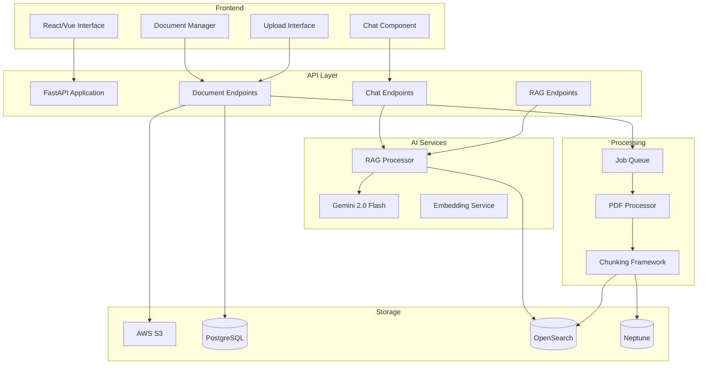

# Chat and Document Integration Requirements

## Overview

This specification defines the implementation of both functional AI-powered chat and PDF document upload with RAG (Retrieval-Augmented Generation) processing for "The Librarian" application. The system will provide users with an intelligent chat interface that can answer questions using uploaded documents as context, creating a complete knowledge management and conversation system.

## Current State Analysis

### What's Working
- **Basic Infrastructure**: AWS ECS deployment with PostgreSQL, Redis, Neptune, and OpenSearch
- **Health Monitoring**: System health checks and database connectivity tests
- **Basic Web Interface**: Simple HTML interface with WebSocket connection
- **Inline Chat**: Basic conversational responses without AI integration

### What's Missing
- **AI-Powered Chat**: No integration with language models (Gemini, OpenAI, etc.)
- **Document Upload**: No PDF upload functionality exposed to users
- **RAG Processing**: No document processing pipeline for knowledge extraction
- **Vector Search**: No semantic search across uploaded documents
- **Knowledge Integration**: No connection between chat and document knowledge

## User Experience Vision

### Complete Workflow
1. **Document Upload**: User uploads PDF documents through drag-and-drop interface
2. **Processing**: System extracts text, images, tables, and creates knowledge chunks
3. **Indexing**: Content is stored in vector database with semantic embeddings
4. **AI Chat**: User asks questions about uploaded documents or general topics
5. **RAG Responses**: AI provides answers using document context with citations
6. **Knowledge Management**: Users can manage their document library and search content

### Key User Stories
- **As a researcher**, I want to upload academic papers and ask questions about their content
- **As a student**, I want to upload textbooks and get explanations of complex concepts
- **As a professional**, I want to upload reports and get summaries and insights
- **As a knowledge worker**, I want to search across all my documents using natural language

## Implementation Requirements

### Requirement 1: AI-Powered Chat System

**User Story:** As a user, I want to have intelligent conversations with an AI assistant that can answer questions and provide helpful information.

#### Acceptance Criteria
1. WHEN I send a message, THE system SHALL provide intelligent AI-generated responses
2. WHEN I ask questions, THE AI SHALL maintain conversation context across multiple exchanges
3. WHEN I request information, THE AI SHALL provide accurate and helpful responses
4. WHEN documents are available, THE AI SHALL use document content to enhance responses
5. THE system SHALL support real-time WebSocket communication for responsive chat

#### Technical Specifications
```python
# AI Integration Options
SUPPORTED_AI_PROVIDERS = [
    "gemini-2.0-flash-exp",  # Primary: Google Gemini
    "gpt-4o-mini",           # Fallback: OpenAI
    "claude-3-haiku"         # Alternative: Anthropic
]

# Chat Features
CHAT_CAPABILITIES = {
    "conversation_memory": True,
    "document_context": True,
    "real_time_responses": True,
    "citation_support": True,
    "multimodal_input": True  # Text + images
}
```

### Requirement 2: Document Upload and Processing

**User Story:** As a user, I want to upload PDF documents so that I can ask questions about their content and build my knowledge base.

#### Acceptance Criteria
1. WHEN I upload a PDF file, THE system SHALL accept files up to 100MB in size
2. WHEN processing begins, THE system SHALL extract text, images, tables, and metadata
3. WHEN processing completes, THE system SHALL create searchable knowledge chunks
4. WHEN content is indexed, THE system SHALL make it available for AI chat queries
5. THE system SHALL provide real-time progress updates during processing

#### Processing Pipeline
```python
async def process_document_pipeline(document_id: str):
    """Complete document processing pipeline."""
    1. Extract content using PDF processor (text, images, tables, charts)
    2. Generate semantic chunks using chunking framework
    3. Create embeddings using AI model
    4. Store chunks in OpenSearch vector database
    5. Extract concepts and relationships for Neptune knowledge graph
    6. Update document status and notify user
    7. Make content available for RAG queries
```

### Requirement 3: RAG (Retrieval-Augmented Generation)

**User Story:** As a user, I want the AI to answer questions using information from my uploaded documents with proper citations.

#### Acceptance Criteria
1. WHEN I ask a question, THE system SHALL search relevant document chunks
2. WHEN providing answers, THE AI SHALL cite specific documents and page numbers
3. WHEN multiple documents are relevant, THE AI SHALL synthesize information across sources
4. WHEN no relevant documents exist, THE AI SHALL provide general knowledge responses
5. THE system SHALL maintain accuracy and provide source attribution

#### RAG Architecture
```python
class RAGProcessor:
    async def generate_response(self, query: str, user_context: dict) -> dict:
        # 1. Query understanding and expansion
        processed_query = await self.query_processor.process(query)
        
        # 2. Vector search across document chunks
        relevant_chunks = await self.vector_search.search(
            query=processed_query,
            limit=10,
            user_filter=user_context["user_id"]
        )
        
        # 3. Context preparation for AI
        context = self.prepare_context(relevant_chunks)
        
        # 4. AI response generation with citations
        response = await self.ai_client.generate_response(
            query=query,
            context=context,
            conversation_history=user_context["history"]
        )
        
        # 5. Citation formatting and response enhancement
        return self.format_response_with_citations(response, relevant_chunks)
```

### Requirement 4: Document Management Interface

**User Story:** As a user, I want to manage my uploaded documents, view processing status, and organize my knowledge base.

#### Acceptance Criteria
1. WHEN I access the document library, THE system SHALL show all my uploaded documents
2. WHEN documents are processing, THE system SHALL display real-time progress indicators
3. WHEN I want to delete documents, THE system SHALL remove all associated data
4. WHEN I search documents, THE system SHALL support filtering by title, status, and content
5. THE system SHALL provide document statistics and processing insights

#### Document Management Features
- **Upload Interface**: Drag-and-drop with progress tracking
- **Document Library**: Grid/list view with search and filtering
- **Processing Status**: Real-time updates with detailed progress
- **Content Preview**: Document summaries and extracted content
- **Batch Operations**: Multiple document selection and actions

### Requirement 5: Vector Search and Knowledge Graph

**User Story:** As a system, I want to efficiently store and retrieve document knowledge to provide accurate AI responses.

#### Acceptance Criteria
1. WHEN documents are processed, THE system SHALL create high-quality embeddings
2. WHEN users ask questions, THE system SHALL perform semantic similarity search
3. WHEN storing knowledge, THE system SHALL maintain relationships between concepts
4. WHEN retrieving information, THE system SHALL rank results by relevance and recency
5. THE system SHALL support both vector search and graph-based knowledge retrieval

#### Knowledge Storage Architecture
```python
# OpenSearch Vector Database
VECTOR_STORAGE = {
    "index_name": "document_chunks",
    "embedding_model": "text-embedding-3-small",  # OpenAI or equivalent
    "chunk_size": 1000,
    "overlap": 200,
    "metadata_fields": ["document_id", "page_number", "section", "chunk_type"]
}

# Neptune Knowledge Graph
KNOWLEDGE_GRAPH = {
    "node_types": ["Document", "Concept", "Entity", "Topic"],
    "relationship_types": ["CONTAINS", "RELATES_TO", "MENTIONS", "PART_OF"],
    "extraction_model": "gemini-2.0-flash-exp"
}
```

### Requirement 6: Integration and User Experience

**User Story:** As a user, I want a seamless experience where chat and document management work together intuitively.

#### Acceptance Criteria
1. WHEN I'm in chat, THE system SHALL provide easy access to document upload
2. WHEN I upload documents, THE system SHALL immediately make them available for chat
3. WHEN AI cites documents, THE system SHALL provide clickable links to source content
4. WHEN I ask about specific documents, THE system SHALL focus search on those documents
5. THE system SHALL maintain consistent UI/UX across all features

#### Integration Points
- **Unified Interface**: Single-page application with chat and document management
- **Cross-Feature Navigation**: Easy switching between chat and document library
- **Contextual Actions**: Document-specific chat, citation navigation
- **Real-time Updates**: Live status updates across all components
- **Mobile Responsive**: Works on desktop, tablet, and mobile devices

## Technical Architecture

### System Components


### Data Flow
1. **Document Upload**: User uploads PDF → S3 storage → Processing queue
2. **Content Extraction**: PDF processor extracts multimodal content
3. **Knowledge Creation**: Chunking framework creates semantic chunks
4. **Vector Storage**: Embeddings stored in OpenSearch for similarity search
5. **Graph Storage**: Concepts and relationships stored in Neptune
6. **Chat Query**: User question → Vector search → Context retrieval → AI response
7. **Response Delivery**: AI response with citations → User interface

## Success Metrics

### Functional Metrics
- **Upload Success Rate**: >95% of PDF uploads complete successfully
- **Processing Speed**: <2 minutes per MB average processing time
- **Chat Response Time**: <3 seconds for AI responses with document context
- **Search Accuracy**: >85% relevance score for document-based queries
- **User Engagement**: >70% of users upload documents and use chat together

### Performance Metrics
- **Concurrent Users**: Support 50+ simultaneous chat sessions
- **Document Throughput**: Process 100+ documents per hour
- **Vector Search Speed**: <500ms for semantic similarity queries
- **Storage Efficiency**: <2x storage overhead for processed content
- **System Uptime**: >99.5% availability for core features

### User Experience Metrics
- **Feature Adoption**: >80% of users try both chat and document upload
- **Session Duration**: >10 minutes average session with document interaction
- **User Satisfaction**: >4.0/5 rating for integrated experience
- **Error Recovery**: >90% success rate for retry operations
- **Mobile Usage**: >30% of interactions from mobile devices

## Implementation Phases

### Phase 1: Core AI Chat (Week 1)
- Integrate Gemini 2.0 Flash API
- Implement conversation memory and context
- Create responsive chat interface
- Add WebSocket real-time communication

### Phase 2: Document Upload and Processing (Week 2)
- Implement PDF upload with progress tracking
- Integrate existing PDF processor
- Set up processing queue with status updates
- Create document management interface

### Phase 3: Vector Search and RAG (Week 3)
- Configure OpenSearch for vector storage
- Implement embedding generation pipeline
- Create RAG processor for context-aware responses
- Add citation and source attribution

### Phase 4: Knowledge Graph Integration (Week 4)
- Set up Neptune for concept relationships
- Implement knowledge extraction pipeline
- Add graph-based query enhancement
- Create knowledge visualization features

### Phase 5: Integration and Polish (Week 5)
- Unify chat and document interfaces
- Implement cross-feature navigation
- Add advanced search and filtering
- Performance optimization and testing

## Risk Mitigation

### Technical Risks
- **AI API Limits**: Implement rate limiting and fallback providers
- **Processing Failures**: Robust error handling and retry mechanisms
- **Storage Costs**: Efficient chunking and compression strategies
- **Performance Issues**: Caching and optimization for high-load scenarios

### User Experience Risks
- **Complex Interface**: Progressive disclosure and intuitive design
- **Slow Processing**: Clear expectations and progress indicators
- **Poor Search Results**: Continuous improvement of embedding and ranking
- **Data Loss**: Comprehensive backup and recovery procedures

This comprehensive specification addresses both the missing AI chat functionality and document upload capabilities, creating a complete knowledge management and conversation system that leverages the existing AWS infrastructure.