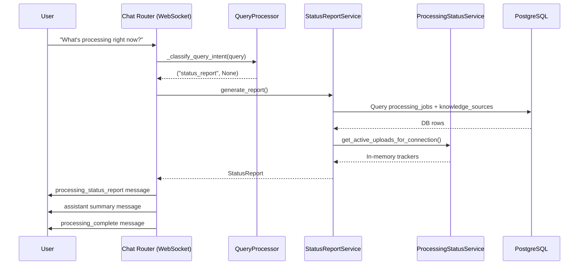

# Design Document: Chat Processing Status Report

## Overview

This feature adds a natural language-invocable processing status report to the existing WebSocket chat interface. When a user asks about processing status (e.g., "show me upload stats", "what's processing right now?"), the system detects the intent, queries PostgreSQL for live job data, merges in-memory tracking data from `ProcessingStatusService`, and delivers a structured report over the existing WebSocket connection.

The design extends the existing `QueryProcessor._classify_query_intent` LLM-based classifier to recognize a new `STATUS_REPORT` intent, introduces a `StatusReportService` that aggregates data from both PostgreSQL and in-memory sources, and adds a new WebSocket message type `processing_status_report` for structured delivery.

## Architecture



The feature integrates into the existing chat flow at the intent classification stage. When `status_report` is detected, the chat handler bypasses the RAG pipeline entirely and delegates to `StatusReportService`.

## Components and Interfaces

### 1. Intent Classification Extension

The `QueryProcessor._classify_query_intent` method in `rag_service.py` is extended to return a new `"status_report"` intent. The LLM prompt is updated to include a `STATUS_REPORT` classification option for messages that semantically request processing status information.

```python
# Updated prompt excerpt in QueryProcessor._classify_query_intent
"""
Reply with EXACTLY one line in one of these formats:
SEARCH: <rewritten query optimized for document search>
WEB_SEARCH: <rewritten query optimized for web search>
STATUS_REPORT
NO_SEARCH

Use STATUS_REPORT when the user is asking about document processing status,
upload progress, job status, or processing statistics. Examples: "show me
upload stats", "what's processing?", "any uploads running?", "how are my
documents doing?", "processing status".
...
"""
```

The method returns `("status_report", None)` when this intent is detected. When ambiguous between status report and search, the classifier defaults to `SEARCH` per Requirement 1.4.

### 2. StatusReportService

A new service at `src/multimodal_librarian/services/status_report_service.py` following the existing DI pattern.

```python
class StatusReportService:
    """Generates processing status reports from DB + in-memory data."""

    def __init__(
        self,
        db_client: RelationalStoreClient,
        processing_status_service: Optional[ProcessingStatusService] = None,
        recent_window_minutes: int = 30,
    ):
        self._db_client = db_client
        self._processing_status_service = processing_status_service
        self._recent_window_minutes = recent_window_minutes

    async def generate_report(self) -> StatusReport: ...
    async def _fetch_active_jobs(self) -> List[Dict]: ...
    async def _fetch_recent_jobs(self) -> List[Dict]: ...
    def _merge_in_memory_data(self, db_jobs: List[Dict]) -> List[Dict]: ...
    def _build_summary(self, jobs: List[JobDetail]) -> ReportSummary: ...
    def _format_human_summary(self, summary: ReportSummary) -> str: ...
```

Dependencies are injected via FastAPI DI. The service receives `RelationalStoreClient` for PostgreSQL queries and optionally `ProcessingStatusService` for in-memory augmentation.

### 3. Chat Router Integration

In `handle_chat_message` (chat.py), after intent classification returns `"status_report"`, the handler:

1. Instantiates/obtains `StatusReportService` via DI
2. Calls `generate_report()`
3. Sends the structured `processing_status_report` WebSocket message
4. Sends a human-readable `assistant` message summarizing the report
5. Adds the summary to conversation history
6. Sends `processing_complete` to dismiss the typing indicator

### 4. WebSocket Message Models

New Pydantic models in `chat_document_models.py`:

```python
class ReportSummary(BaseModel):
    total_active: int
    total_completed_recent: int
    total_failed_recent: int
    overall_progress: float  # 0.0-100.0 across all active jobs

class JobDetail(BaseModel):
    document_id: str
    document_title: str
    status: str  # "pending", "running", "completed", "failed"
    current_step: Optional[str]
    progress_percentage: int
    elapsed_seconds: Optional[float]
    retry_count: int
    # Completed jobs
    total_processing_seconds: Optional[float]
    chunk_count: Optional[int]
    # Failed jobs
    error_message: Optional[str]
    failed_step: Optional[str]
    retry_available: bool

class StatusReport(BaseModel):
    type: Literal["processing_status_report"] = "processing_status_report"
    summary: ReportSummary
    jobs: List[JobDetail]
    generated_at: datetime  # ISO 8601
```

### 5. Dependency Injection

A new provider in `services.py`:

```python
async def get_status_report_service(
    db_client: RelationalStoreClient = Depends(get_relational_client),
    processing_status_service: Optional[ProcessingStatusService] = Depends(
        get_processing_status_service_optional
    ),
) -> StatusReportService:
    ...
```

An optional variant `get_status_report_service_optional` returns `None` on failure for graceful degradation.

## Data Models

### PostgreSQL Query: Active Jobs

```sql
SELECT
    pj.id,
    pj.source_id,
    pj.status,
    pj.progress_percentage,
    pj.current_step,
    pj.started_at,
    pj.retry_count,
    pj.error_message,
    pj.job_metadata,
    ks.title AS document_title
FROM processing_jobs pj
JOIN knowledge_sources ks ON pj.source_id = ks.id
WHERE pj.status IN ('pending', 'running')
ORDER BY pj.started_at ASC;
```

### PostgreSQL Query: Recent Jobs

```sql
SELECT
    pj.id,
    pj.source_id,
    pj.status,
    pj.progress_percentage,
    pj.current_step,
    pj.started_at,
    pj.completed_at,
    pj.retry_count,
    pj.error_message,
    pj.job_metadata,
    ks.title AS document_title
FROM processing_jobs pj
JOIN knowledge_sources ks ON pj.source_id = ks.id
WHERE pj.status IN ('completed', 'failed')
  AND pj.completed_at >= NOW() - INTERVAL '30 minutes'
ORDER BY pj.completed_at DESC;
```

### In-Memory Merge Logic

For each active job from the database, if `ProcessingStatusService._tracking` has an entry for the same `document_id`:
- Use the in-memory `progress_percentage` and `current_stage` when `last_updated` is more recent than the DB row's implicit update time.
- For jobs tracked in-memory but not yet in the database (e.g., just-registered uploads), include them in the report with in-memory data only.

### Report Summary Computation

```python
summary = ReportSummary(
    total_active=len(active_jobs),
    total_completed_recent=len([j for j in recent_jobs if j.status == "completed"]),
    total_failed_recent=len([j for j in recent_jobs if j.status == "failed"]),
    overall_progress=mean([j.progress_percentage for j in active_jobs]) if active_jobs else 0.0,
)
```


## Correctness Properties

*A property is a characteristic or behavior that should hold true across all valid executions of a system — essentially, a formal statement about what the system should do. Properties serve as the bridge between human-readable specifications and machine-verifiable correctness guarantees.*

### Property 1: Status report intent bypasses RAG

*For any* chat message where the intent classifier returns `"status_report"`, the system shall invoke `StatusReportService.generate_report()` and shall not invoke the RAG pipeline.

**Validates: Requirements 1.1, 1.2**

### Property 2: Job filtering correctness

*For any* set of `processing_jobs` rows with varying statuses and timestamps, `generate_report()` shall return exactly those jobs where status is `pending` or `running` (active), plus those where status is `completed` or `failed` and `completed_at` is within the configured recent window (default 30 minutes). No other jobs shall appear.

**Validates: Requirements 2.1, 2.2**

### Property 3: Job detail field completeness by status

*For any* job in the report's `jobs` array:
- All jobs include: `document_title`, `current_step`, `progress_percentage`, `elapsed_seconds`, `status`, and `retry_count`.
- If `status == "completed"`: `total_processing_seconds` and `chunk_count` are also present.
- If `status == "failed"`: `error_message`, `failed_step`, and `retry_available` are also present.

**Validates: Requirements 2.3, 2.4, 2.5, 3.3**

### Property 4: Summary aggregation correctness

*For any* set of jobs returned by the report, the `summary.total_active` shall equal the count of jobs with status `pending` or `running`, `summary.total_completed_recent` shall equal the count of recent completed jobs, `summary.total_failed_recent` shall equal the count of recent failed jobs, and `summary.overall_progress` shall equal the mean of `progress_percentage` across all active jobs (or 0.0 if none).

**Validates: Requirements 3.2**

### Property 5: Report payload structure invariant

*For any* report produced by `StatusReportService`, the serialized WebSocket message shall have `type == "processing_status_report"`, contain a `summary` object, a `jobs` array, and a `generated_at` field that is a valid ISO 8601 timestamp.

**Validates: Requirements 3.1, 3.4**

### Property 6: Human-readable summary reflects report data

*For any* report with a non-empty summary, the generated human-readable assistant message shall contain the numeric values from `summary.total_active`, `summary.total_completed_recent`, and `summary.total_failed_recent` as substrings.

**Validates: Requirements 3.5**

### Property 7: In-memory merge correctness

*For any* combination of database job records and in-memory `ProcessingStatusTracker` entries:
- If a job exists in both DB and in-memory and the in-memory `last_updated` is more recent, the report shall use the in-memory `progress_percentage` and `current_stage`.
- If a job exists only in-memory (not yet in DB), it shall appear in the report with in-memory data.
- If a job exists only in DB (no in-memory tracker), it shall appear with DB data unchanged.

**Validates: Requirements 5.1, 5.2**

## Error Handling

| Scenario | Behavior |
|---|---|
| Database connection unavailable | `StatusReportService.generate_report()` catches the DB exception and returns an error message: "Status information is temporarily unavailable." The chat handler sends this as an assistant message. (Req 4.4) |
| `ProcessingStatusService` is `None` | `StatusReportService` skips in-memory merge and returns DB-only data. No error raised. (Req 5.3) |
| No active or recent jobs | Returns a valid `StatusReport` with `summary.total_active == 0`, empty `jobs` array, and a human-readable message like "No active processing jobs." (Req 2.6) |
| Intent classification fails (LLM error) | `QueryProcessor._classify_query_intent` already defaults to `"search"` on error, so status report is not triggered. Existing fallback behavior applies. |
| Ambiguous intent | Classifier defaults to `SEARCH` to avoid false positives. (Req 1.4) |
| WebSocket send failure during report delivery | Follows existing `ConnectionManager.send_personal_message` error handling — logs the error and disconnects the connection. |

## Testing Strategy

### Property-Based Testing

Use **Hypothesis** (already present in the project as evidenced by `.hypothesis/` directory) for property-based tests. Each property test runs a minimum of 100 iterations.

Property tests target the `StatusReportService` logic (pure functions that don't require DB or WebSocket connections):

- **Job filtering**: Generate random lists of job dicts with random statuses and timestamps. Call the filtering logic and verify only correct jobs are included.
  - Tag: `Feature: chat-processing-status-report, Property 2: Job filtering correctness`

- **Job detail field completeness**: Generate random job dicts with random statuses. Build `JobDetail` models and verify required fields per status.
  - Tag: `Feature: chat-processing-status-report, Property 3: Job detail field completeness by status`

- **Summary aggregation**: Generate random lists of `JobDetail` objects. Compute summary and verify counts and mean progress.
  - Tag: `Feature: chat-processing-status-report, Property 4: Summary aggregation correctness`

- **Report payload structure**: Generate random reports and verify serialization produces correct type, summary, jobs, and timestamp.
  - Tag: `Feature: chat-processing-status-report, Property 5: Report payload structure invariant`

- **Human-readable summary**: Generate random `ReportSummary` objects and verify the formatted string contains the numeric values.
  - Tag: `Feature: chat-processing-status-report, Property 6: Human-readable summary reflects report data`

- **In-memory merge**: Generate random DB job records and in-memory trackers with varying timestamps. Verify merge logic picks the correct values.
  - Tag: `Feature: chat-processing-status-report, Property 7: In-memory merge correctness`

### Unit Tests

Unit tests complement property tests for specific examples, edge cases, and integration points:

- **Intent routing**: Mock `_classify_query_intent` to return `"status_report"` and verify `StatusReportService` is called (not RAG). (Property 1)
- **Known phrases**: Test specific phrases from Req 1.3 against the classifier. (Req 1.3 examples)
- **Ambiguous queries**: Test that ambiguous phrases default to SEARCH. (Req 1.4 example)
- **Empty state**: No jobs in DB or in-memory → report with zero counts. (Req 2.6 edge case)
- **DB unavailable**: Mock DB failure → graceful error message. (Req 4.4 edge case)
- **ProcessingStatusService unavailable**: Pass `None` → DB-only report without error. (Req 5.3 edge case)
- **Conversation history**: Verify assistant message is added to conversation history after report. (Req 4.1)
- **Processing complete**: Verify `processing_complete` message is sent after report delivery. (Req 4.2)

### Test Configuration

- Property tests: minimum 100 iterations via `@settings(max_examples=100)`
- Each property test tagged with a comment referencing the design property
- Tests located at `tests/services/test_status_report_service.py` (property + unit)
- Integration test for WebSocket flow at `tests/integration/test_chat_status_report.py`
