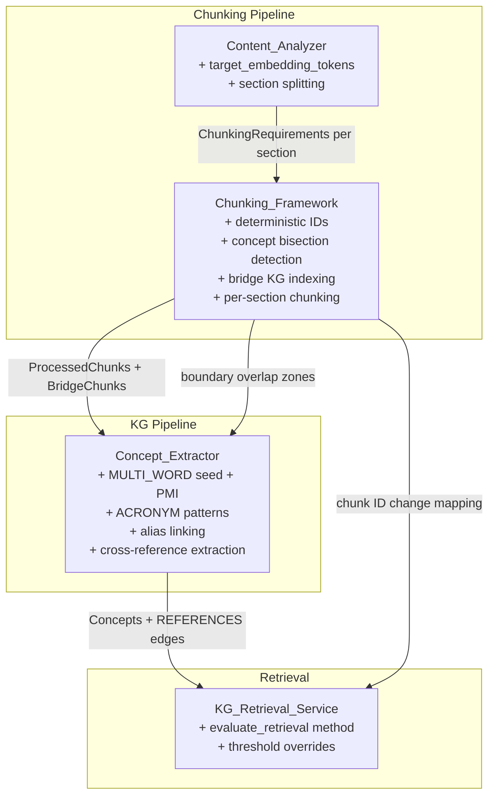

# Design Document: Chunking-KG Optimization

## Overview

This design addresses nine areas in the chunking-to-KG pipeline that limit retrieval recall, accuracy, and precision. All changes are surgical modifications to existing components — no new services are introduced. The design preserves backward compatibility and follows the existing dependency injection architecture.

The nine areas of improvement are:
1. Calibrating chunk sizes to the embedding model's optimal input length
2. Expanding concept extraction to cover multi-word phrases (via seed list + PMI collocation) and acronyms
3. Detecting and preventing concept bisection at chunk boundaries
4. Indexing bridge chunks in the Knowledge Graph
5. Extracting cross-reference relationships for non-adjacent content linking
6. Handling mixed-domain documents with per-section classification
7. Making chunk IDs deterministic and stable across re-processing
8. Adding retrieval quality metrics (recall, precision, F1)
9. Exposing all thresholds as tunable configuration with metrics feedback loop

## Architecture

The changes touch four existing components and one service, with no new modules:



All components continue to use lazy initialization via FastAPI's dependency injection. No import-time connections or module-level instantiation.

## Components and Interfaces

### 1. Content_Analyzer Modifications

**File**: `src/multimodal_librarian/components/chunking_framework/content_analyzer.py`

#### 1a. Embedding-Aware Chunk Sizing

Add a `target_embedding_tokens` parameter sourced from `Settings`. The `_generate_chunking_requirements` method will use this as the base instead of the hardcoded `base_chunk_size = 400`.

```python
def _generate_chunking_requirements(
    self, content_type: ContentType,
    complexity_score: float,
    conceptual_density: float
) -> ChunkingRequirements:
    settings = get_settings()
    target_tokens = getattr(settings, 'target_embedding_tokens', 256)
    max_tokens = getattr(settings, 'max_embedding_tokens', 512)
    min_tokens = getattr(settings, 'min_embedding_tokens', 64)

    # Domain multipliers (unchanged logic)
    type_adjustments = { ... }  # existing dict
    adjustments = type_adjustments.get(content_type, ...)

    complexity_factor = 1.0 + (complexity_score - 0.5) * 0.4
    density_factor = 1.0 + (conceptual_density - 0.5) * 0.3

    preferred_size = int(target_tokens * adjustments['size_mult'] * complexity_factor)
    preferred_size = max(min_tokens, min(preferred_size, max_tokens))
    # ... rest unchanged
```

#### 1b. Per-Section Domain Classification

Add a `classify_sections` method that splits a document into sections using structural cues, classifies each independently, and returns a list of `(section_text, ContentType, ChunkingRequirements)` tuples.

```python
def classify_sections(
    self, document: DocumentContent
) -> List[Tuple[str, ContentType, ChunkingRequirements]]:
    """Split document into sections and classify each independently."""
    sections = self._split_into_sections(document.text)
    results = []
    last_classification = ContentType.GENERAL
    for section_text in sections:
        if len(section_text.split()) < 100:
            classification = last_classification  # inherit
        else:
            section_doc = DocumentContent(text=section_text)
            profile = self.analyze_document(section_doc)
            classification = profile.content_type
            last_classification = classification
        reqs = self._generate_chunking_requirements(
            classification,
            self._calculate_complexity_score(DocumentContent(text=section_text)),
            self._calculate_conceptual_density(section_text, self._extract_entities(section_text))
        )
        results.append((section_text, classification, reqs))
    return results

def _split_into_sections(self, text: str) -> List[str]:
    """Split text at structural boundaries (headings, chapter markers, topic shifts)."""
    pattern = r'(?=\n#{1,3}\s)|(?=\nChapter\s+\d)|(?=\nSection\s+\d)|(?=\n[A-Z][A-Z\s]{10,}\n)'
    sections = re.split(pattern, text)
    return [s.strip() for s in sections if s.strip()]
```

### 2. Concept_Extractor Modifications

**File**: `src/multimodal_librarian/components/knowledge_graph/kg_builder.py`

#### 2a. Two-Tier Multi-Word Phrase Extraction

The seed list provides high-confidence matches for known terminology. PMI-based collocation detection discovers novel multi-word concepts statistically.

**Seed list patterns** (added to `self.concept_patterns`):

```python
'MULTI_WORD': [
    # Curated seed list — high confidence (0.85)
    r'\b(?:knowledge graph|vector database|natural language processing|'
    r'machine learning|deep learning|neural network|'
    r'information retrieval|semantic search|named entity recognition|'
    r'text embedding|content analysis|concept extraction|'
    r'graph database|search engine|data model|'
    r'chunk[ing]?\s+(?:strategy|framework|pipeline|size)|'
    r'retrieval\s+(?:quality|pipeline|service|augmented)|'
    r'embedding\s+(?:model|dimension|space|vector))\b',
],
'ACRONYM': [
    r'\b[A-Z]{2,6}\b',  # 2-6 uppercase letters
],
```

**PMI collocation detection** (new method on `ConceptExtractor`):

```python
def _extract_collocations_pmi(self, text: str, pmi_threshold: float = 5.0) -> List[ConceptNode]:
    """
    Extract multi-word concepts via Pointwise Mutual Information.
    
    PMI(x,y) = log2(P(x,y) / (P(x) * P(y)))
    
    A PMI threshold of 5.0 means the bigram co-occurs ~32x more often
    than expected by chance. This is a conservative threshold that
    filters most noise while catching genuine collocations.
    """
    words = text.lower().split()
    if len(words) < 10:
        return []  # too short for meaningful statistics
    
    word_freq = Counter(words)
    bigram_freq = Counter(zip(words, words[1:]))
    total = len(words)
    
    concepts = []
    for (w1, w2), count in bigram_freq.items():
        if count < 2:
            continue  # require at least 2 occurrences
        p_xy = count / total
        p_x = word_freq[w1] / total
        p_y = word_freq[w2] / total
        pmi = math.log2(p_xy / (p_x * p_y)) if (p_x * p_y) > 0 else 0
        
        if pmi >= pmi_threshold:
            phrase = f"{w1} {w2}"
            concepts.append(ConceptNode(
                concept_name=phrase,
                concept_type="MULTI_WORD",
                confidence=0.65 + min(0.1, (count - 2) * 0.02),
                source="pmi_collocation",
            ))
    return concepts
```

The method is called at the end of `extract_concepts_ner()` and its results are merged with seed-list matches, deduplicating by normalized concept name.

**Corpus-level collocation cache**: A `CollocationCache` dictionary stored as an instance attribute on `ConceptExtractor`, keyed by normalized bigram, storing cumulative frequency and document count. Updated incrementally per document. PMI scores computed against this cache when available, falling back to document-level PMI for the first document.

#### 2b. Acronym-Expansion Alias Linking

Unchanged from previous design — scan for `"Expanded Form (ACRONYM)"` and `"ACRONYM (Expanded Form)"` patterns and link via `add_alias`.

#### 2c. Confidence Scoring

| Pattern Type | Base Confidence | Rationale |
|---|---|---|
| MULTI_WORD (seed list) | 0.85 | Curated phrase in text is almost certainly a concept |
| MULTI_WORD (PMI-discovered) | 0.65 | Statistical collocation — lower due to false positive risk |
| ACRONYM | 0.6 | Inherently ambiguous without context |
| Frequency boost | +0.02/occurrence, cap +0.1 | TF-IDF principle: repetition signals topical significance |

#### 2d. Cross-Reference Relationship Extraction

New method on `ConceptExtractor`:

```python
def _extract_cross_references(self, text: str, chunk_id: str) -> List[Dict]:
    """
    Extract explicit cross-reference patterns from chunk text.
    Returns list of {source_chunk_id, reference_type, target_label, raw_text}.
    """
    ref_patterns = [
        (r'(?:see|refer\s+to)\s+(section|chapter|page|figure|table)\s+(\d+(?:\.\d+)*)', 'explicit'),
        (r'as\s+(?:mentioned|discussed|shown|described)\s+in\s+(section|chapter|page|figure|table)\s+(\d+(?:\.\d+)*)', 'backward'),
        (r'(?:section|chapter|page|figure|table)\s+(\d+(?:\.\d+)*)\s+(?:above|below|earlier|later)', 'positional'),
    ]
    
    references = []
    for pattern, ref_type in ref_patterns:
        for match in re.finditer(pattern, text, re.IGNORECASE):
            references.append({
                'source_chunk_id': chunk_id,
                'reference_type': ref_type,
                'target_type': match.group(1).lower(),
                'target_label': match.group(2) if ref_type != 'positional' else match.group(1),
                'raw_text': match.group(0),
            })
    return references
```

Cross-references are stored as pending edges during extraction. A post-processing reconciliation pass (run after all chunks in a document are processed) resolves target labels to chunk IDs using section/chapter metadata from `ProcessedChunk.metadata`. Resolved references become `REFERENCES` edges in Neo4j with `hop_distance=1`.

### 3. Chunking_Framework Modifications

**File**: `src/multimodal_librarian/components/chunking_framework/framework.py`

#### 3a. Concept Bisection Detection and Boundary Adjustment

New method on `GenericMultiLevelChunkingFramework`:

```python
def _adjust_boundary_for_concept_contiguity(
    self,
    pre_boundary_text: str,
    post_boundary_text: str,
    boundary_word_index: int,
    max_chunk_size: int,
    current_chunk_size: int,
    overlap_window: int = 20,
) -> int:
    """
    Check if a multi-word concept spans the proposed boundary.
    Returns adjusted boundary word index.
    
    Algorithm:
    1. Extract last `overlap_window` tokens before boundary + first `overlap_window` after
    2. Run concept extraction on the combined overlap zone
    3. For each extracted concept, check if it spans the boundary position
    4. If spanning concept found, shift boundary past it (or before it if that would exceed max_chunk_size)
    """
    # Build overlap zone
    pre_words = pre_boundary_text.split()
    post_words = post_boundary_text.split()
    overlap_pre = pre_words[-overlap_window:] if len(pre_words) >= overlap_window else pre_words
    overlap_post = post_words[:overlap_window] if len(post_words) >= overlap_window else post_words
    overlap_text = ' '.join(overlap_pre + overlap_post)
    
    # Extract concepts from overlap zone
    overlap_concepts = self._concept_extractor.extract_concepts_ner(overlap_text)
    
    if not overlap_concepts:
        return boundary_word_index  # no concepts in overlap zone
    
    # Check each concept for boundary spanning
    boundary_in_overlap = len(overlap_pre)  # word index of boundary within overlap text
    spanning_concepts = []
    
    for concept in overlap_concepts:
        concept_words = concept.concept_name.split()
        # Find concept position in overlap text
        overlap_words = overlap_pre + overlap_post
        for i in range(len(overlap_words) - len(concept_words) + 1):
            if overlap_words[i:i+len(concept_words)] == concept_words:
                concept_start = i
                concept_end = i + len(concept_words)
                if concept_start < boundary_in_overlap < concept_end:
                    spanning_concepts.append((concept, concept_start, concept_end))
    
    if not spanning_concepts:
        return boundary_word_index  # no concepts span the boundary
    
    # Pick highest-confidence spanning concept
    best = max(spanning_concepts, key=lambda x: x[0].confidence)
    concept, start_in_overlap, end_in_overlap = best
    
    # Shift boundary past the concept (keep concept in current chunk)
    shift_forward = end_in_overlap - boundary_in_overlap
    if current_chunk_size + shift_forward <= max_chunk_size:
        return boundary_word_index + shift_forward
    
    # Can't shift forward — shift backward (put concept in next chunk)
    shift_backward = boundary_in_overlap - start_in_overlap
    return boundary_word_index - shift_backward
```

This method is called from `_perform_primary_chunking` after `_find_semantic_boundary` returns a candidate split point, and before the chunk is finalized.

#### 3b. Deterministic Chunk IDs

Replace `uuid.uuid4()` with a deterministic hash of `(document_id, content_hash)`:

```python
import hashlib

def _generate_chunk_id(self, document_id: str, content: str) -> str:
    """Generate a deterministic UUID from document ID and content hash."""
    hash_input = f"{document_id}:{content}".encode('utf-8')
    hash_bytes = hashlib.sha256(hash_input).digest()[:16]
    hash_bytes = bytearray(hash_bytes)
    hash_bytes[6] = (hash_bytes[6] & 0x0F) | 0x40
    hash_bytes[8] = (hash_bytes[8] & 0x3F) | 0x80
    return str(uuid.UUID(bytes=bytes(hash_bytes)))
```

#### 3c. Change Mapping on Re-Processing

`process_document` accepts an optional `previous_chunk_ids: Optional[Set[str]]` parameter. After chunking, it computes a diff:

```python
@dataclass
class ChunkChangeMapping:
    added: List[str]        # new chunk IDs not in previous set
    removed: List[str]      # previous IDs not in new set
    unchanged: List[str]    # IDs present in both sets
```

#### 3d. Per-Section Chunking

When `classify_sections` returns multiple sections with different domains, `chunk_with_smart_bridges` iterates per section, applying section-specific `ChunkingRequirements`, then concatenates results.

#### 3e. Bridge Chunk KG Indexing

After bridge generation and validation, pass each bridge chunk through `ConceptExtractor.extract_concepts_ner()` and store the results:

```python
for bridge in bridges:
    bridge_concepts = self._concept_extractor.extract_concepts_ner(bridge.content)
    bridge.metadata = bridge.metadata or {}
    bridge.metadata['extracted_concepts'] = [c.concept_id for c in bridge_concepts]
    bridge.metadata['adjacent_chunk_ids'] = bridge.source_chunks
```

### 4. KG_Retrieval_Service Modifications

**File**: `src/multimodal_librarian/services/kg_retrieval_service.py`

#### 4a. Retrieval Quality Metrics with Threshold Overrides

```python
async def evaluate_retrieval(
    self,
    query: str,
    ground_truth_chunk_ids: List[str],
    top_k: int = 15,
    threshold_overrides: Optional[Dict[str, Any]] = None,
) -> Dict[str, Any]:
    """Evaluate retrieval quality against ground truth.
    
    Args:
        threshold_overrides: Optional dict of threshold names to values
            for A/B comparison (e.g., {'target_embedding_tokens': 384}).
            Applied temporarily for this evaluation only.
    """
    # Apply temporary overrides if provided
    original_values = {}
    if threshold_overrides:
        settings = get_settings()
        for key, value in threshold_overrides.items():
            if hasattr(settings, key):
                original_values[key] = getattr(settings, key)
                setattr(settings, key, value)
    
    try:
        result = await self.retrieve(query, top_k=top_k)
        retrieved_ids = {chunk.chunk_id for chunk in result.chunks}
        gt_set = set(ground_truth_chunk_ids)

        true_positives = len(retrieved_ids & gt_set)
        recall = true_positives / len(gt_set) if gt_set else 0.0
        precision = true_positives / len(retrieved_ids) if retrieved_ids else 0.0
        f1 = (2 * precision * recall / (precision + recall)) if (precision + recall) > 0 else 0.0

        return {
            'recall': recall,
            'precision': precision,
            'f1_score': f1,
            'true_positives': true_positives,
            'retrieved_count': len(retrieved_ids),
            'ground_truth_count': len(gt_set),
            'threshold_config': threshold_overrides or 'defaults',
            'retrieval_result': result,
        }
    finally:
        # Restore original values
        if original_values:
            settings = get_settings()
            for key, value in original_values.items():
                setattr(settings, key, value)
```

#### 4b. Cross-Reference Traversal

In `_retrieve_related_chunks`, add traversal of `REFERENCES` edges alongside existing relationship edges. Cross-referenced chunks are treated as `hop_distance=1` from the referencing chunk's concepts.

### 5. Settings Additions

**File**: `src/multimodal_librarian/config.py`

```python
# Embedding-aware chunking
target_embedding_tokens: int = Field(default=256, env="TARGET_EMBEDDING_TOKENS",
    description="Optimal token count for the embedding model (Reimers & Gurevych 2019)")
max_embedding_tokens: int = Field(default=512, env="MAX_EMBEDDING_TOKENS",
    description="Maximum token limit for the embedding model (transformer positional encoding ceiling)")
min_embedding_tokens: int = Field(default=64, env="MIN_EMBEDDING_TOKENS",
    description="Minimum viable chunk token count for meaningful embeddings")

# Concept extraction
pmi_threshold: float = Field(default=5.0, env="PMI_THRESHOLD",
    description="PMI threshold for collocation detection (5.0 = ~32x above chance)")
multi_word_seed_confidence: float = Field(default=0.85, env="MULTI_WORD_SEED_CONFIDENCE",
    description="Base confidence for seed-list multi-word matches")
multi_word_pmi_confidence: float = Field(default=0.65, env="MULTI_WORD_PMI_CONFIDENCE",
    description="Base confidence for PMI-discovered multi-word concepts")
acronym_confidence: float = Field(default=0.6, env="ACRONYM_CONFIDENCE",
    description="Base confidence for acronym extraction")
frequency_boost_increment: float = Field(default=0.02, env="FREQUENCY_BOOST_INCREMENT",
    description="Confidence boost per additional occurrence")
frequency_boost_cap: float = Field(default=0.1, env="FREQUENCY_BOOST_CAP",
    description="Maximum cumulative frequency boost")

# Concept bisection
overlap_window: int = Field(default=20, env="OVERLAP_WINDOW",
    description="Tokens to inspect on each side of a chunk boundary for concept bisection")
```

## Data Models

### New/Modified Data Classes

#### ChunkChangeMapping (new)

```python
@dataclass
class ChunkChangeMapping:
    added: List[str]
    removed: List[str]
    unchanged: List[str]
```

#### ProcessedChunk (modified)

No structural changes. The `id` field generation changes from `uuid.uuid4()` to `_generate_chunk_id(document_id, content)`.

#### ConceptNode (existing, extended usage)

The existing `concept_type` field now accepts two additional values: `"MULTI_WORD"` and `"ACRONYM"`. The existing `aliases` list is used for acronym-expansion linking. A new optional `source` field distinguishes seed-list matches from PMI-discovered concepts.

#### ProcessedDocument (modified)

Add optional field:

```python
chunk_change_mapping: Optional[ChunkChangeMapping] = None
```

#### SectionClassification (new)

```python
@dataclass
class SectionClassification:
    section_text: str
    content_type: ContentType
    chunking_requirements: ChunkingRequirements
    start_offset: int
    end_offset: int
```

#### RetrievalMetrics (new)

```python
@dataclass
class RetrievalMetrics:
    recall: float
    precision: float
    f1_score: float
    true_positives: int
    retrieved_count: int
    ground_truth_count: int
```

#### CrossReference (new)

```python
@dataclass
class CrossReference:
    source_chunk_id: str
    reference_type: str       # 'explicit', 'backward', 'positional'
    target_type: str          # 'section', 'chapter', 'page', 'figure', 'table'
    target_label: str         # '3.1', '4', etc.
    raw_text: str             # original matched text
    resolved_chunk_ids: Optional[List[str]] = None  # filled during reconciliation
```


## Correctness Properties

### Property 1: Chunk size is bounded by embedding model limits

*For any* combination of content type, complexity score (0.0–1.0), and conceptual density (0.0–1.0), the `preferred_chunk_size` produced by `_generate_chunking_requirements` shall be >= `min_embedding_tokens` and <= `max_embedding_tokens`.

**Validates: Requirements 1.2, 1.3, 1.4**

### Property 2: Multi-word phrase extraction (seed list) with correct type

*For any* text string containing one or more known multi-word domain phrases from the seed list, `extract_concepts_ner` shall return at least one `ConceptNode` with `concept_type == "MULTI_WORD"` whose `concept_name` matches the embedded phrase, with confidence >= `multi_word_seed_confidence`.

**Validates: Requirements 2.1, 2.4, 2.6**

### Property 3: PMI collocation discovery

*For any* text containing a bigram that appears at least twice and whose PMI exceeds `pmi_threshold`, `_extract_collocations_pmi` shall return a `ConceptNode` with `concept_type == "MULTI_WORD"` and confidence >= `multi_word_pmi_confidence`.

**Validates: Requirements 2.1, 2.7**

### Property 4: Acronym extraction with correct type

*For any* text string containing one or more uppercase acronyms of 2–6 characters that are not in the stopword set, `extract_concepts_ner` shall return at least one `ConceptNode` with `concept_type == "ACRONYM"` whose `concept_name` matches the embedded acronym.

**Validates: Requirements 2.2, 2.5**

### Property 5: Acronym-expansion alias linking

*For any* text containing a pattern of the form `"Expanded Form (ACRONYM)"`, after concept extraction and alias linking, the acronym concept and/or the expansion concept shall have the other form in its `aliases` list.

**Validates: Requirements 2.3**

### Property 6: Concept confidence reflects pattern type and frequency

*For any* text where a concept appears N times (N >= 1), the confidence score assigned to that concept shall be >= the base confidence for its pattern type, and a concept appearing more frequently shall have confidence >= a concept of the same type appearing less frequently. The frequency boost shall not exceed `frequency_boost_cap`.

**Validates: Requirements 2.6**

### Property 7: Concept bisection detection prevents boundary splitting

*For any* text containing a multi-word concept at a proposed chunk boundary, `_adjust_boundary_for_concept_contiguity` shall return an adjusted boundary such that the concept falls entirely within one chunk. The adjusted chunk size shall not exceed `max_chunk_size`.

**Validates: Requirements 3.1, 3.2, 3.3, 3.4, 3.6**

### Property 8: Bridge chunks have concepts extracted with correct metadata

*For any* bridge chunk produced by the Chunking_Framework, the bridge chunk's metadata shall contain `extracted_concepts` (a non-empty list if the bridge text contains extractable concepts) and `adjacent_chunk_ids` (a list of exactly two chunk IDs corresponding to the bridged chunks).

**Validates: Requirements 4.1, 4.2, 4.4**

### Property 9: Cross-reference extraction captures explicit references

*For any* text containing an explicit cross-reference pattern (e.g., "see Section 3.1"), `_extract_cross_references` shall return at least one reference dict with the correct `target_type` and `target_label`.

**Validates: Requirements 5.1**

### Property 10: Section splitting at structural boundaries

*For any* document text containing N structural markers (headings, chapter markers), `_split_into_sections` shall return at least N sections, and no section shall contain a structural marker in its interior (only at its start).

**Validates: Requirements 6.2**

### Property 11: Per-section classification produces domain-specific results

*For any* document composed of concatenated sections where each section has a distinct dominant domain, `classify_sections` shall return classifications where adjacent sections with different content receive different `ContentType` values.

**Validates: Requirements 6.1, 6.3**

### Property 12: Section-specific chunking requirements are applied

*For any* document with sections classified into different domains, the chunks produced for each section shall have `preferred_chunk_size` values consistent with that section's domain multiplier, not the document-level domain.

**Validates: Requirements 6.4**

### Property 13: Deterministic chunk ID generation

*For any* document ID and chunk content string, calling `_generate_chunk_id` twice with the same inputs shall produce the same UUID string. Calling it with different content shall produce a different UUID string.

**Validates: Requirements 7.1, 7.2, 7.3**

### Property 14: Change mapping correctness

*For any* previous set of chunk IDs and new set of chunk IDs produced by re-processing, the `ChunkChangeMapping` shall satisfy: `added ∪ unchanged == new_set`, `removed ∪ unchanged == previous_set`, and `added ∩ removed == ∅`.

**Validates: Requirements 7.4, 7.5**

### Property 15: Retrieval metrics computation

*For any* set of retrieved chunk IDs and ground-truth chunk IDs, the computed recall shall equal `|retrieved ∩ ground_truth| / |ground_truth|`, precision shall equal `|retrieved ∩ ground_truth| / |retrieved|`, and F1 shall equal `2 * precision * recall / (precision + recall)` (or 0.0 when both are 0).

**Validates: Requirements 8.1, 8.2, 8.3, 8.4**

## Error Handling

### Content_Analyzer

- If `target_embedding_tokens` is missing from settings, fall back to default value of 256.
- If `_split_into_sections` produces zero sections (no structural markers found), return the entire document as a single section with document-level classification.
- If section classification fails for a section, inherit the previous section's classification. If it's the first section, default to `GENERAL`.

### Concept_Extractor

- If `ACRONYM` pattern matches common English words (e.g., "IT", "IS", "OR"), filter them out using a stopword set.
- If alias linking encounters a concept that doesn't exist in the extracted set, skip the link silently.
- If regex patterns produce excessive matches (> 500 per chunk), truncate to the top 500 by confidence score.
- If PMI computation encounters division by zero (word frequency = 0), skip that bigram.
- If text is too short for meaningful PMI (< 10 words), skip collocation detection and rely on seed list only.
- If cross-reference target cannot be resolved during reconciliation, store as unresolved and log a warning. Do not create a KG edge for unresolved references.

### Chunking_Framework

- If `_generate_chunk_id` receives an empty content string, raise `ValueError`.
- If `previous_chunk_ids` is `None` during re-processing, skip change mapping computation and return `None` for `chunk_change_mapping`.
- If bridge concept extraction fails, log a warning and continue without KG indexing for that bridge.
- If concept bisection detection finds no concepts in the overlap zone, leave the boundary unchanged (zero-cost path).
- If boundary adjustment would produce a chunk smaller than `min_chunk_size`, skip the adjustment and accept the bisection.

### KG_Retrieval_Service

- If `ground_truth_chunk_ids` is an empty list, return metrics with recall=0.0, precision=0.0, f1=0.0.
- If the retrieval step fails during evaluation, propagate the error (don't mask it with zero metrics).
- If `threshold_overrides` contains an unknown key, ignore it and log a warning.
- Always restore original threshold values after evaluation, even if an exception occurs (use try/finally).

## Testing Strategy

### Property-Based Testing

Use `hypothesis` as the property-based testing library. Each property test runs a minimum of 100 iterations.

Property tests cover Properties 1–15 as defined above. Each test is tagged with:
```
Feature: chunking-kg-optimization, Property {N}: {title}
```

### Unit Testing

Unit tests complement property tests for:
- Specific examples of multi-word phrase extraction (known phrases in known text)
- PMI collocation detection with controlled word frequencies
- Acronym stopword filtering (verify "IT", "IS" are excluded)
- Concept bisection detection with known multi-word concepts at boundaries
- Boundary adjustment when shift would exceed max_chunk_size (backward shift)
- Cross-reference pattern matching for all supported patterns
- Cross-reference reconciliation with mock section metadata
- Bridge chunk metadata structure validation
- Settings parameter loading from environment variables
- `evaluate_retrieval` method with threshold overrides
- Behavior when no ground truth is provided (Requirement 8.6)
- Short section inheritance (Requirement 6.5)

### Test Organization

```
tests/
├── components/
│   ├── test_content_analyzer_embedding_aware.py    # Properties 1, 10, 11, 12
│   ├── test_concept_extractor_expanded.py          # Properties 2, 3, 4, 5, 6, 9
│   ├── test_chunking_framework_deterministic.py    # Properties 7, 8, 13, 14
└── services/
    └── test_kg_retrieval_metrics.py                # Property 15
```

### PBT Library Configuration

```python
from hypothesis import given, settings, strategies as st

@settings(max_examples=100)
@given(
    target_tokens=st.integers(min_value=32, max_value=1024),
    complexity=st.floats(min_value=0.0, max_value=1.0),
    density=st.floats(min_value=0.0, max_value=1.0),
)
def test_chunk_size_bounded(target_tokens, complexity, density):
    # Feature: chunking-kg-optimization, Property 1: Chunk size is bounded by embedding model limits
    ...
```
