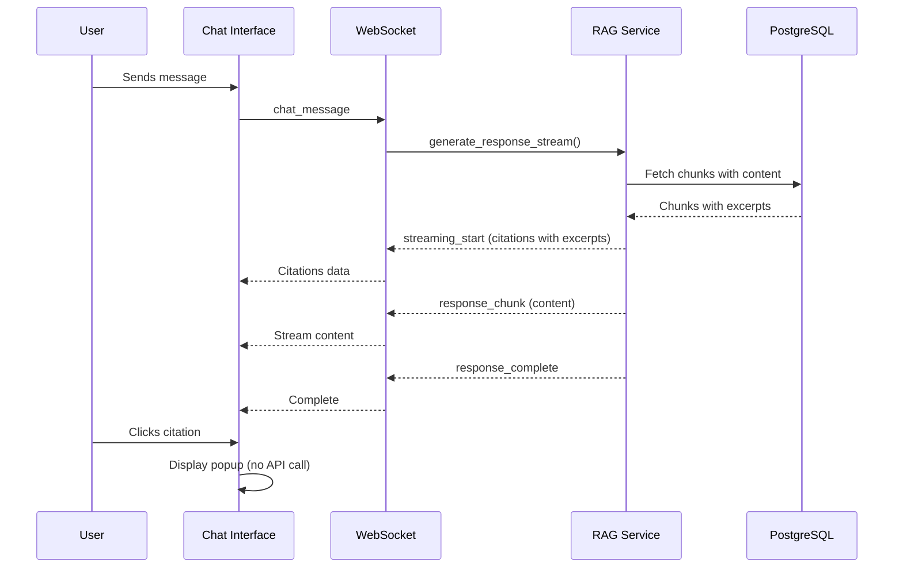
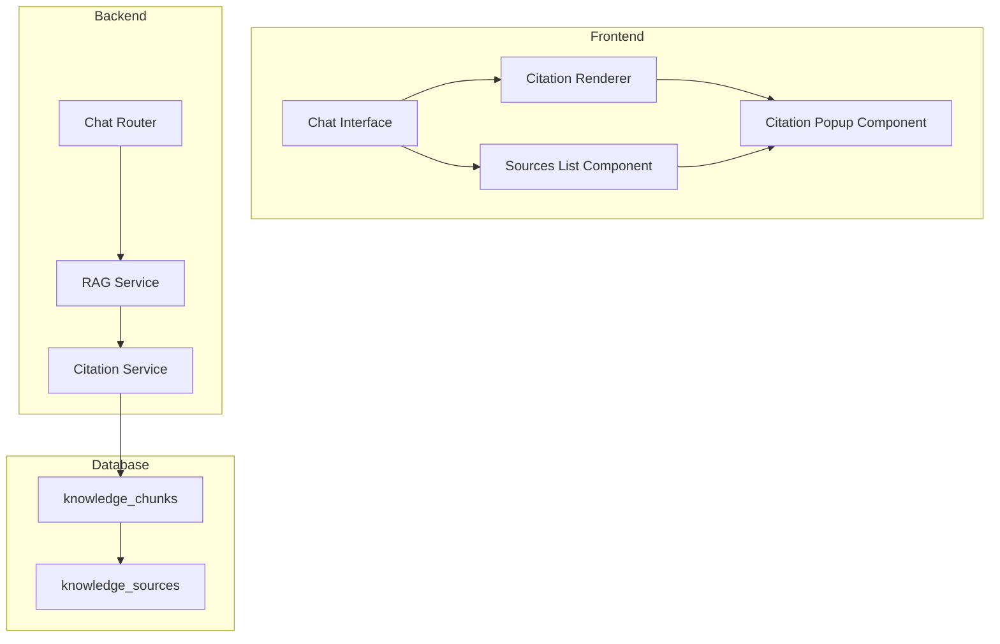

# Design Document: Clickable Source Citations with Popup Excerpts

## Overview

This feature enhances the Multimodal Librarian chat interface by making source citations interactive. When users receive RAG-powered responses, they can click on inline citations (e.g., "[Source 1]") or items in the sources list to view a popup containing the actual chunk excerpt that was used as context for generating the response.

The implementation follows a frontend-heavy approach where chunk content is included in the initial citation data sent via WebSocket, eliminating the need for additional API calls when displaying popups. This design prioritizes responsiveness and reduces server load.

## Architecture



### Component Architecture



## Components and Interfaces

### Frontend Components

#### 1. CitationPopup Class (JavaScript)

Manages the popup display for citation excerpts.

```javascript
class CitationPopup {
    constructor() {
        this.popupElement = null;
        this.triggerElement = null;
        this.isOpen = false;
    }
    
    // Show popup with citation data
    show(citationData, triggerElement) { }
    
    // Hide and cleanup popup
    hide() { }
    
    // Position popup relative to trigger, avoiding viewport overflow
    position(triggerElement) { }
    
    // Create popup DOM structure
    createPopupElement(citationData) { }
    
    // Handle keyboard events (Escape to close)
    handleKeydown(event) { }
    
    // Handle click outside to close
    handleClickOutside(event) { }
    
    // Trap focus within popup
    trapFocus() { }
    
    // Restore focus to trigger element
    restoreFocus() { }
}
```

#### 2. CitationRenderer Module (JavaScript)

Transforms citation references in response text into clickable elements.

```javascript
const CitationRenderer = {
    // Parse response text and wrap citations in clickable spans
    renderCitations(text, citations) { },
    
    // Create clickable citation element
    createCitationElement(sourceNumber, citationData) { },
    
    // Extract source number from citation text (e.g., "[Source 1]" -> 1)
    parseSourceNumber(citationText) { },
    
    // Match citation patterns in text
    findCitationMatches(text) { }
};
```

#### 3. Enhanced Sources List

Modifications to existing `addCitationsToElement` method in `chat.js`.

```javascript
// Enhanced citation rendering with click handlers
addCitationsToElement(messageElement, citations) {
    // Create clickable source items
    // Store citation data for popup display
    // Add hover states and click handlers
}
```

### Backend Components

#### 1. Citation Service

New service for retrieving chunk content. Located at `src/multimodal_librarian/services/citation_service.py`.

```python
from dataclasses import dataclass
from typing import Optional, List
from sqlalchemy.ext.asyncio import AsyncSession

@dataclass
class ChunkExcerpt:
    chunk_id: str
    content: str
    document_id: str
    document_title: str
    page_number: Optional[int]
    section_title: Optional[str]
    relevance_score: float

class CitationService:
    def __init__(self, db_session: AsyncSession):
        self.db_session = db_session
    
    async def get_chunk_excerpt(
        self, 
        chunk_id: str, 
        max_length: int = 1000
    ) -> Optional[ChunkExcerpt]:
        """Retrieve chunk content by ID with truncation."""
        pass
    
    async def get_chunk_excerpts_batch(
        self,
        chunk_ids: List[str],
        max_length: int = 1000
    ) -> List[ChunkExcerpt]:
        """Batch retrieve multiple chunk excerpts."""
        pass
    
    def truncate_content(
        self, 
        content: str, 
        max_length: int
    ) -> str:
        """Truncate content at word boundary with ellipsis."""
        pass
```

#### 2. Enhanced RAG Service Citation Data

Modifications to `CitationSource` dataclass in `rag_service.py`.

```python
@dataclass
class CitationSource:
    """Citation source information with excerpt."""
    document_id: str
    document_title: str
    page_number: Optional[int]
    chunk_id: str
    relevance_score: float
    excerpt: str  # Already exists, ensure populated
    section_title: Optional[str] = None
    content_truncated: bool = False  # New field
```

### API Changes

#### WebSocket Message Enhancement

The `streaming_start` message already includes citations. We ensure the `excerpt` field is populated:

```json
{
    "type": "streaming_start",
    "citations": [
        {
            "document_id": "uuid-string",
            "document_title": "Book Title",
            "page_number": 42,
            "relevance_score": 0.95,
            "excerpt": "The actual chunk text content that was used...",
            "section_title": "Chapter 3: Introduction",
            "chunk_id": "chunk-uuid"
        }
    ]
}
```

## Data Models

### Frontend Data Structures

```typescript
interface CitationData {
    documentId: string;
    documentTitle: string;
    pageNumber: number | null;
    relevanceScore: number;
    excerpt: string;
    sectionTitle: string | null;
    chunkId: string;
    contentTruncated: boolean;
}

interface PopupPosition {
    top: number;
    left: number;
    maxWidth: number;
    maxHeight: number;
}

interface PopupState {
    isOpen: boolean;
    citationData: CitationData | null;
    triggerElement: HTMLElement | null;
    position: PopupPosition;
}
```

### Backend Data Flow

```python
# Existing KnowledgeChunkDB model provides:
# - id (UUID)
# - chunk_id (String)
# - content (Text)
# - source_id (FK to KnowledgeSource)
# - location_reference (page number)
# - section (section title)

# Query to fetch chunk with source info:
SELECT 
    kc.chunk_id,
    kc.content,
    ks.id as document_id,
    ks.title as document_title,
    kc.location_reference as page_number,
    kc.section as section_title
FROM knowledge_chunks kc
JOIN knowledge_sources ks ON kc.source_id = ks.id
WHERE kc.chunk_id = :chunk_id
```

## Correctness Properties

*A property is a characteristic or behavior that should hold true across all valid executions of a system—essentially, a formal statement about what the system should do. Properties serve as the bridge between human-readable specifications and machine-verifiable correctness guarantees.*


### Property 1: Citation Pattern Parsing

*For any* response text containing citation patterns (e.g., "[Source N]"), the CitationRenderer SHALL correctly identify all citation patterns and transform them into clickable elements with the corresponding source number.

**Validates: Requirements 1.1, 2.1**

### Property 2: Popup Content Completeness

*For any* valid CitationData object, the Citation_Popup SHALL render all required fields (document title, relevance score as percentage, excerpt text) and conditionally render optional fields (page number, section title) only when present.

**Validates: Requirements 3.1, 3.2, 3.3, 3.4, 3.5**

### Property 3: Excerpt Truncation Consistency

*For any* chunk content string, the truncation function SHALL:
- Return the original string if length <= max_length
- Return a truncated string ending with "..." if length > max_length
- Never exceed max_length characters in output
- Truncate at word boundaries when possible

**Validates: Requirements 3.6, 5.4**

### Property 4: Focus Management Round-Trip

*For any* popup open/close cycle, the focus SHALL be restored to the exact element that triggered the popup opening, maintaining the user's navigation context.

**Validates: Requirements 4.4, 6.4**

### Property 5: Citation Data Completeness in API

*For any* RAG response with citations, the streaming_start WebSocket message SHALL include citation objects with non-empty excerpt fields for all citations where chunk content is available.

**Validates: Requirements 5.1, 5.2**

### Property 6: Accessibility Attributes Presence

*For any* rendered citation element (inline or in sources list), the element SHALL have:
- A valid aria-label describing the citation
- Appropriate role attribute
- Keyboard focusability (tabindex)

*For any* open Citation_Popup, the popup SHALL have:
- role="dialog"
- aria-modal="true"
- aria-labelledby pointing to the title element

**Validates: Requirements 6.1, 6.3**

### Property 7: Viewport Boundary Positioning

*For any* popup position calculation given a trigger element position and viewport dimensions, the resulting popup position SHALL ensure the popup is fully visible within the viewport (no overflow on any edge).

**Validates: Requirements 7.4**

### Property 8: Inline and Sources List Consistency

*For any* citation that appears both as an inline reference and in the sources list, clicking either SHALL produce a popup with identical content (same document title, excerpt, relevance score, etc.).

**Validates: Requirements 2.2**

## Error Handling

### Frontend Error Handling

| Error Scenario | Handling Strategy |
|----------------|-------------------|
| Citation data missing excerpt | Display "Excerpt not available" message in popup |
| Invalid source number in text | Skip rendering as clickable, leave as plain text |
| Popup positioning fails | Fall back to centered modal display |
| Focus restoration fails | Focus on message input as fallback |

### Backend Error Handling

| Error Scenario | Handling Strategy |
|----------------|-------------------|
| Chunk not found in database | Return citation with empty excerpt and error flag |
| Database connection failure | Log error, return citations without excerpts |
| Excerpt truncation error | Return full content (graceful degradation) |

### Error Response Format

```python
@dataclass
class CitationSource:
    # ... existing fields ...
    excerpt: str = ""
    excerpt_error: Optional[str] = None  # "not_found", "retrieval_failed"
```

## Testing Strategy

### Unit Tests

Unit tests focus on specific examples and edge cases:

1. **Citation Pattern Matching**
   - Test "[Source 1]", "[Source 10]", "[Source 99]" patterns
   - Test edge cases: "[Source]", "[Source 0]", "[Source -1]"
   - Test multiple citations in single text

2. **Truncation Edge Cases**
   - Empty string input
   - Exactly max_length characters
   - Single word exceeding max_length
   - Unicode characters and word boundaries

3. **Popup Positioning Edge Cases**
   - Trigger at viewport corners
   - Very small viewport
   - Trigger element larger than popup

4. **Error Handling**
   - Missing citation data
   - Malformed citation objects
   - Network failures during chunk retrieval

### Property-Based Tests

Property-based tests verify universal properties across many generated inputs. Each test runs minimum 100 iterations.

**Testing Framework**: Hypothesis (Python), fast-check (JavaScript)

1. **Feature: clickable-source-citations, Property 1: Citation Pattern Parsing**
   - Generate random text with embedded citation patterns
   - Verify all patterns are identified and transformed

2. **Feature: clickable-source-citations, Property 2: Popup Content Completeness**
   - Generate random CitationData objects
   - Verify popup contains all required fields

3. **Feature: clickable-source-citations, Property 3: Excerpt Truncation Consistency**
   - Generate random strings of varying lengths
   - Verify truncation invariants hold

4. **Feature: clickable-source-citations, Property 4: Focus Management Round-Trip**
   - Generate random trigger elements
   - Verify focus restoration after popup cycle

5. **Feature: clickable-source-citations, Property 5: Citation Data Completeness in API**
   - Generate random RAG responses
   - Verify excerpt presence in citations

6. **Feature: clickable-source-citations, Property 6: Accessibility Attributes Presence**
   - Generate random citation elements
   - Verify ARIA attributes present

7. **Feature: clickable-source-citations, Property 7: Viewport Boundary Positioning**
   - Generate random trigger positions and viewport sizes
   - Verify popup stays within bounds

8. **Feature: clickable-source-citations, Property 8: Inline and Sources List Consistency**
   - Generate random citations appearing in both locations
   - Verify popup content equality

### Integration Tests

1. **End-to-End Citation Flow**
   - Send chat message
   - Verify citations in streaming_start
   - Verify popup displays correct data

2. **WebSocket Message Format**
   - Verify citation structure in messages
   - Verify excerpt field population

### Test File Locations

```
tests/
├── static/
│   ├── test_citation_popup.js      # Frontend unit tests
│   └── test_citation_renderer.js   # Citation parsing tests
├── services/
│   └── test_citation_service.py    # Backend service tests
├── integration/
│   └── test_citation_flow.py       # End-to-end tests
└── property/
    ├── test_truncation_pbt.py      # Property tests for truncation
    └── test_positioning_pbt.py     # Property tests for positioning
```
