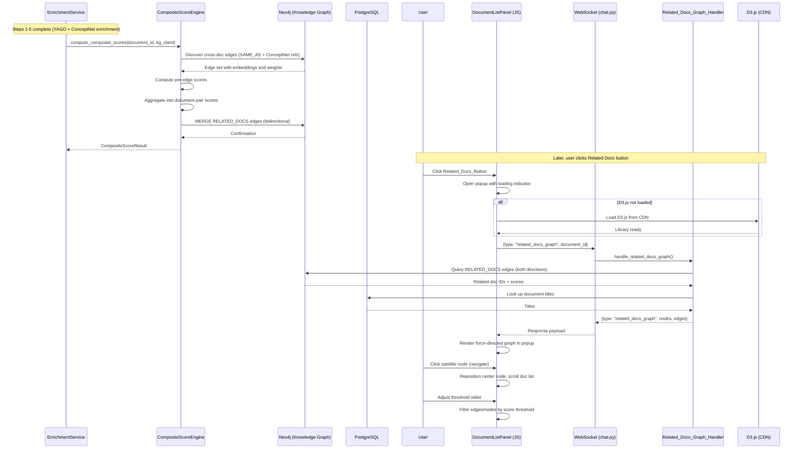

# Design Document: Composite Document Relationships

## Overview

This feature extends the existing cross-document linking system (which currently only uses identity-based `SAME_AS` edges via shared YAGO Q-numbers) to incorporate ConceptNet-derived semantic relationships (IsA, PartOf, RelatedTo, etc.) into a unified composite scoring system. A new `CompositeScoreEngine` computes per-edge scores from three signals (relationship type weight, embedding cosine similarity, ConceptNet edge weight) and aggregates them into document-pair scores. Pre-computed `RELATED_DOCS` edges are stored in Neo4j at ingestion time so that downstream consumers can retrieve document relatedness without runtime computation.

The pipeline integration point is the `EnrichmentService.enrich_concepts()` method. After the existing step 5 (batch ConceptNet persistence), a new step 6 invokes the `CompositeScoreEngine` to discover cross-document edges, score them, aggregate into document-pair scores, and upsert `RELATED_DOCS` edges. A dedicated WebSocket handler serves the graph data to the frontend, which renders an interactive force-directed graph popup using D3.js.

### Key Design Decisions

- **Ingestion-time computation, not query-time**: Scores are computed once when a document is ingested, stored as `RELATED_DOCS` edges, and read cheaply at display time. This avoids expensive graph traversals on every graph request.
- **Store all edges, threshold at display**: All `RELATED_DOCS` edges are persisted regardless of score. The Threshold_Slider in the popup applies filtering client-side (default 0.5), allowing users to adjust in real time without re-querying.
- **Two-stage scoring**: Per-edge scores capture individual concept-pair relatedness; document-pair aggregation combines average edge quality with neighborhood density for a holistic metric.
- **KG failure is fatal for scoring, graceful for display**: If Neo4j queries fail during composite score computation, the error propagates up and fails the enrichment pipeline. For the graph display handler, Neo4j failure returns an error response (consistent with the existing `document_relationship_graph` handler pattern).
- **Bidirectional RELATED_DOCS edges**: Stored in both directions so that queries from either document discover the relationship without needing to check both directions.
- **Single new module for scoring**: All scoring logic lives in `composite_score_engine.py`. The enrichment service calls it; the graph handler reads the results. Clean separation of concerns.
- **Dedicated WebSocket handler for graph data**: A separate `related_docs_graph` message type and handler (not piggybacked on document stats) keeps the graph data request/response independent and follows the same pattern as the existing `document_relationship_graph` handler.
- **Lazy D3.js loading**: D3 is ~260KB minified. Loading it only on first Related Docs button click avoids impacting initial page load. Same pattern as the document-relationship-graph spec.
- **Frontend-only graph rendering and navigation**: The force simulation, center-node navigation, and threshold filtering all run entirely in the browser. The backend only provides the data payload.

## Architecture



### Component Boundaries

| Layer | Component | Responsibility |
|-------|-----------|----------------|
| Service | `CompositeScoreEngine` | Edge discovery, per-edge scoring, doc-pair aggregation, RELATED_DOCS upsert |
| Service | `EnrichmentService` | Orchestrates enrichment pipeline; invokes CompositeScoreEngine as step 6 |
| Transport | WebSocket (`chat.py`) | Message routing for `related_docs_graph` type |
| Backend | `chat_document_handlers.py` | New `handle_related_docs_graph()` function |
| Data | Neo4j via `database_factory` | Cypher query execution for RELATED_DOCS retrieval |
| Data | PostgreSQL | Document title lookup from `knowledge_sources` table |
| Models | `chat_document_models.py` | `RelatedDocsGraph*` Pydantic models |
| Frontend | `DocumentListPanel` | Related_Docs_Button, popup lifecycle, D3 loading, graph rendering, navigation, threshold filtering |


## Components and Interfaces

### 1. CompositeScoreEngine (`services/composite_score_engine.py`)

New module. Stateless class that receives a Neo4j graph client and performs all scoring operations.

```python
from dataclasses import dataclass, field
from typing import List, Dict, Tuple, Optional
from datetime import datetime

@dataclass
class EdgeScore:
    """Score for a single cross-document concept pair."""
    source_concept_id: str
    target_concept_id: str
    source_document_id: str
    target_document_id: str
    relationship_type: str
    type_weight: float
    embedding_similarity: float
    cn_weight: float
    edge_score: float  # Clamped to [0.0, 1.0]

@dataclass
class DocumentPairScore:
    """Aggregate score for a pair of documents."""
    doc_id_a: str
    doc_id_b: str
    score: float           # Clamped to [0.0, 1.0]
    edge_count: int
    avg_edge_score: float
    neighborhood_density: float
    computed_at: str        # ISO 8601

@dataclass
class CompositeScoreResult:
    """Result of composite score computation for a single ingested document."""
    document_id: str
    edges_discovered: int
    edges_scored: int
    document_pairs: int
    related_docs_created: int
    duration_ms: float
    pair_scores: List[DocumentPairScore] = field(default_factory=list)

class CompositeScoreEngine:
    """Computes composite cross-document relationship scores."""

    # Relationship type weights (Requirement 2.2)
    TYPE_WEIGHTS: Dict[str, float] = {
        "SAME_AS": 1.0,
        "Synonym": 0.80,
        "SimilarTo": 0.70,
        "IsA": 0.65,
        "PartOf": 0.60,
        "UsedFor": 0.55,
        "CapableOf": 0.55,
        "Causes": 0.55,
        "HasProperty": 0.50,
        "AtLocation": 0.50,
        "HasPrerequisite": 0.50,
        "MotivatedByGoal": 0.45,
        "RelatedTo": 0.40,
    }

    # Scoring formula weights (Requirement 2.1)
    W_TYPE: float = 0.4
    W_EMBEDDING: float = 0.45
    W_CN: float = 0.15

    # Aggregation weights (Requirement 3.1)
    W_AVG_EDGE: float = 0.7
    W_DENSITY: float = 0.3

    def __init__(self, kg_client):
        """
        Args:
            kg_client: Neo4j graph client (from get_database_factory().get_graph_client())
        """
        self._kg = kg_client

    async def compute_composite_scores(self, document_id: str) -> CompositeScoreResult:
        """Main entry point. Discovers edges, scores them, aggregates, and persists RELATED_DOCS."""
        ...

    async def _discover_cross_doc_edges(self, document_id: str) -> List[dict]:
        """Query Neo4j for all cross-document concept pairs involving document_id."""
        ...

    def _compute_edge_score(self, edge: dict) -> EdgeScore:
        """Compute per-edge score using the three-signal formula."""
        ...

    def _aggregate_document_pairs(
        self, edge_scores: List[EdgeScore], concept_counts: Dict[str, int]
    ) -> List[DocumentPairScore]:
        """Group edge scores by document pair and compute aggregate scores."""
        ...

    async def _persist_related_docs(self, pair_scores: List[DocumentPairScore]) -> int:
        """Upsert RELATED_DOCS edges bidirectionally in Neo4j."""
        ...

    async def _get_concept_counts(self, document_ids: List[str]) -> Dict[str, int]:
        """Get concept count per document for neighborhood density calculation."""
        ...
```

### 2. EnrichmentService Integration (`services/enrichment_service.py`)

Add a call to `CompositeScoreEngine.compute_composite_scores()` after the batch ConceptNet persistence block in `enrich_concepts()`. The engine is instantiated with the existing `self.kg_service.client` reference.

```python
# In enrich_concepts(), after the _batch_persist_all_conceptnet block:

# --- Step 6: Compute composite cross-document scores ---
if self.kg_service and self.kg_service.client:
    from .composite_score_engine import CompositeScoreEngine
    engine = CompositeScoreEngine(self.kg_service.client)
    composite_result = await engine.compute_composite_scores(document_id)
    logger.info(
        f"Composite scoring: {composite_result.edges_discovered} edges, "
        f"{composite_result.document_pairs} doc pairs, "
        f"{composite_result.duration_ms:.0f}ms"
    )
```

Error handling: if `compute_composite_scores` raises, the exception propagates and fails the enrichment pipeline (Requirement 5.3).

### 3. Related Docs Graph Handler (`api/routers/chat_document_handlers.py`)

New async function `handle_related_docs_graph()` following the same pattern as the existing `handle_document_relationship_graph()` handler:

```python
async def handle_related_docs_graph(
    message_data: dict,
    connection_id: str,
    manager,
) -> None:
```

**Cypher Query Strategy:**

A single query that finds all RELATED_DOCS edges involving the origin document (both directions, since edges are stored bidirectionally):

```cypher
MATCH (c1:Concept {source_document: $doc_id})-[r:RELATED_DOCS]->(c2:Concept)
WHERE c2.source_document <> $doc_id
RETURN DISTINCT c2.source_document AS related_doc_id,
       r.score AS score,
       r.edge_count AS edge_count
```

After getting the Neo4j results, the handler looks up document titles from PostgreSQL (`multimodal_librarian.knowledge_sources` table) for all discovered document IDs, falling back to document_id as title if PostgreSQL is unavailable.

### 4. WebSocket Router (`chat.py`)

New `elif` branch in the message dispatch:

```python
elif message_type == 'related_docs_graph':
    await handle_related_docs_graph(
        message_data=message_data,
        connection_id=connection_id,
        manager=manager,
    )
```

### 5. Pydantic Models (`api/models/chat_document_models.py`)

```python
class RelatedDocsGraphRequest(BaseModel):
    type: Literal["related_docs_graph"] = "related_docs_graph"
    document_id: str = Field(..., description="Document ID to get related docs graph for")

class RelatedDocsGraphNode(BaseModel):
    document_id: str
    title: str
    is_origin: bool = False

class RelatedDocsGraphEdge(BaseModel):
    source: str  # source document_id
    target: str  # target document_id
    score: float = Field(..., ge=0.0, le=1.0)
    edge_count: int = Field(..., ge=0)

class RelatedDocsGraphResponse(BaseModel):
    type: Literal["related_docs_graph"] = "related_docs_graph"
    document_id: str
    nodes: List[RelatedDocsGraphNode]
    edges: List[RelatedDocsGraphEdge]

class RelatedDocsGraphError(BaseModel):
    type: Literal["related_docs_graph_error"] = "related_docs_graph_error"
    document_id: str
    message: str
```

### 6. Frontend: Related Docs Button (`document-list-panel.js`)

Modifications to `buildStatsHtml()` to inject a Related Docs button adjacent to the Stats toggle (same pattern as the existing Graph button from the document-relationship-graph spec):

```html
<div class="document-stats">
    <button class="document-stats-toggle" aria-label="Toggle document stats">
        <span class="stats-arrow">▸</span> Stats
    </button>
    <button class="document-related-docs-btn"
            data-document-id="{doc.document_id}"
            aria-label="Show related documents graph">
        📎 Related Docs
    </button>
    <div class="document-stats-details" style="display:none;">
        ...
    </div>
</div>
```

The button only renders when `doc.status === 'completed'` and `doc.concept_count > 0`.

### 7. Frontend: Related Docs Graph Popup

The popup is a DOM element appended to `document.body` (not inside the panel) to avoid overflow clipping. Structure:

```html
<div class="related-docs-popup-backdrop">
    <div class="related-docs-popup">
        <div class="related-docs-popup-header">
            <span class="related-docs-popup-title">Related Documents: {title}</span>
            <button class="related-docs-popup-close" aria-label="Close related docs popup">✕</button>
        </div>
        <div class="related-docs-popup-controls">
            <label>Threshold: <input type="range" class="related-docs-threshold-slider"
                   min="0" max="1" step="0.01" value="0.5">
            <span class="related-docs-threshold-value">50%</span></label>
        </div>
        <div class="related-docs-popup-body">
            <!-- SVG rendered by D3 here -->
            <div class="related-docs-popup-loading">Loading...</div>
            <div class="related-docs-popup-message" style="display:none;"></div>
        </div>
    </div>
</div>
```

**Popup lifecycle:**
- Open: Click Related Docs button → create popup DOM → show loading → send WS message
- Close: Click close button, click backdrop, press Escape, or click Related Docs button again
- Only one popup open at a time (opening a new one closes the previous)

### 8. Frontend: D3.js Lazy Loading

Same utility pattern as the document-relationship-graph spec — a `_loadD3()` method that returns a cached Promise:

```javascript
_loadD3() {
    if (window.d3) return Promise.resolve(window.d3);
    if (this._d3LoadPromise) return this._d3LoadPromise;
    this._d3LoadPromise = new Promise((resolve, reject) => {
        const script = document.createElement('script');
        script.src = 'https://d3js.org/d3.v7.min.js';
        script.onload = () => resolve(window.d3);
        script.onerror = () => reject(new Error('Failed to load D3.js'));
        document.head.appendChild(script);
    });
    return this._d3LoadPromise;
}
```

### 9. Frontend: Force-Directed Graph with Navigation

A `_renderRelatedDocsGraph(container, data)` method on `DocumentListPanel` that:
1. Creates an SVG element sized to the popup body
2. Creates a D3 force simulation with `forceLink`, `forceManyBody`, `forceCenter`
3. Renders edges as `<line>` elements with `<text>` labels showing score as percentage
4. Renders nodes as `<circle>` elements — Center_Node in a distinct color (e.g., `#4CAF50`), Satellite_Nodes in a secondary color (e.g., `#2196F3`)
5. Adds text labels (truncated to 30 chars) next to each node
6. Adds drag behavior via `d3.drag()`
7. Implements center-node navigation: clicking a Satellite_Node triggers a transition that moves it to center and displaces the previous Center_Node to a satellite orbit
8. On Satellite_Node click, scrolls the document list panel to the matching document item and applies a highlight CSS class
9. Listens to the Threshold_Slider `input` event to filter edges with score < threshold and hide orphaned Satellite_Nodes (Center_Node always visible)


## Data Models

### Neo4j Graph Schema (New)

#### RELATED_DOCS Relationship

Stored bidirectionally between representative Concept nodes from each document pair.

```
(:Concept {source_document: "doc-A"})-[:RELATED_DOCS {
    score: 0.72,              // Document_Pair_Score [0.0, 1.0]
    edge_count: 15,           // Number of cross-document edges
    avg_edge_score: 0.68,     // Mean of per-edge scores
    neighborhood_density: 0.81, // Coverage fraction
    computed_at: "2024-01-15T10:30:00Z"  // ISO 8601
}]->(:Concept {source_document: "doc-B"})
```

Both directions are stored:
- `(concept_from_A)-[:RELATED_DOCS]->(concept_from_B)`
- `(concept_from_B)-[:RELATED_DOCS]->(concept_from_A)`

This ensures queries from either document discover the relationship without needing `()-[r:RELATED_DOCS]-()` undirected patterns.

#### Representative Concept Selection

For each document pair, the engine picks one concept per document from the edge set (e.g., the concept with the highest individual edge score). This is purely a storage anchor — the `RELATED_DOCS` edge represents the entire document pair, not the specific concept pair.

### Cypher Queries

#### Edge Discovery Query (Requirement 1)

Discovers all cross-document concept pairs connected via ConceptNet relationships or SAME_AS, where one concept belongs to the newly ingested document:

```cypher
// Discover cross-doc edges involving the new document
MATCH (c1:Concept {source_document: $doc_id})-[r]->(c2:Concept)
WHERE c2.source_document <> $doc_id
  AND c2.source_document <> 'conceptnet'
  AND type(r) IN [
    'SAME_AS', 'IsA', 'PartOf', 'RelatedTo', 'UsedFor', 'CapableOf',
    'HasProperty', 'AtLocation', 'Causes', 'HasPrerequisite',
    'MotivatedByGoal', 'Synonym', 'SimilarTo'
  ]
RETURN c1.concept_id AS src_id,
       c1.source_document AS src_doc,
       c1.embedding AS src_emb,
       c2.concept_id AS tgt_id,
       c2.source_document AS tgt_doc,
       c2.embedding AS tgt_emb,
       type(r) AS rel_type,
       r.weight AS cn_weight
```

A second query captures the reverse direction (edges pointing into the new document's concepts):

```cypher
MATCH (c2:Concept)-[r]->(c1:Concept {source_document: $doc_id})
WHERE c2.source_document <> $doc_id
  AND c2.source_document <> 'conceptnet'
  AND type(r) IN [
    'SAME_AS', 'IsA', 'PartOf', 'RelatedTo', 'UsedFor', 'CapableOf',
    'HasProperty', 'AtLocation', 'Causes', 'HasPrerequisite',
    'MotivatedByGoal', 'Synonym', 'SimilarTo'
  ]
RETURN c2.concept_id AS src_id,
       c2.source_document AS src_doc,
       c2.embedding AS src_emb,
       c1.concept_id AS tgt_id,
       c1.source_document AS tgt_doc,
       c1.embedding AS tgt_emb,
       type(r) AS rel_type,
       r.weight AS cn_weight
```

#### Concept Count Query (Requirement 3.3)

```cypher
UNWIND $doc_ids AS did
MATCH (c:Concept {source_document: did})
RETURN did AS doc_id, count(c) AS concept_count
```

#### RELATED_DOCS Upsert Query (Requirement 4)

```cypher
UNWIND $rows AS row
MATCH (c1:Concept {concept_id: row.src_concept_id})
MATCH (c2:Concept {concept_id: row.tgt_concept_id})
MERGE (c1)-[r:RELATED_DOCS]->(c2)
SET r.score = row.score,
    r.edge_count = row.edge_count,
    r.avg_edge_score = row.avg_edge_score,
    r.neighborhood_density = row.neighborhood_density,
    r.computed_at = row.computed_at
RETURN count(r) AS cnt
```

Run twice — once for each direction (swap src/tgt concept IDs).

#### RELATED_DOCS Read Query (Requirement 6)

Used by the `handle_related_docs_graph()` handler to fetch all related documents for the graph popup:

```cypher
MATCH (c1:Concept {source_document: $doc_id})-[r:RELATED_DOCS]->(c2:Concept)
WHERE c2.source_document <> $doc_id
RETURN DISTINCT c2.source_document AS related_doc_id,
       r.score AS score,
       r.edge_count AS edge_count
```

### PostgreSQL Title Lookup (Requirement 6.4)

```sql
SELECT id::text, title, filename
FROM multimodal_librarian.knowledge_sources
WHERE id = ANY($1::uuid[])
```

### Pydantic Models

#### RelatedDocsGraphRequest (New)

```python
class RelatedDocsGraphRequest(BaseModel):
    """WebSocket request for related documents graph data.
    
    Requirements: 8.1
    """
    type: Literal["related_docs_graph"] = "related_docs_graph"
    document_id: str = Field(..., description="Document ID to get related docs graph for")
```

#### RelatedDocsGraphNode (New)

```python
class RelatedDocsGraphNode(BaseModel):
    """A document node in the related docs graph.
    
    Requirements: 8.2
    """
    document_id: str = Field(..., description="UUID of the document")
    title: str = Field(..., description="Document title for display")
    is_origin: bool = Field(False, description="Whether this is the origin document")
```

#### RelatedDocsGraphEdge (New)

```python
class RelatedDocsGraphEdge(BaseModel):
    """An edge in the related docs graph representing a RELATED_DOCS relationship.
    
    Requirements: 8.3
    """
    source: str = Field(..., description="Source document_id")
    target: str = Field(..., description="Target document_id")
    score: float = Field(..., ge=0.0, le=1.0, description="Composite relationship score")
    edge_count: int = Field(..., ge=0, description="Number of cross-document concept edges")
```

#### RelatedDocsGraphResponse (New)

```python
class RelatedDocsGraphResponse(BaseModel):
    """WebSocket response containing the related docs graph data.
    
    Requirements: 8.4
    """
    type: Literal["related_docs_graph"] = "related_docs_graph"
    document_id: str
    nodes: List[RelatedDocsGraphNode]
    edges: List[RelatedDocsGraphEdge]
```

#### RelatedDocsGraphError (New)

```python
class RelatedDocsGraphError(BaseModel):
    """WebSocket error response for related docs graph requests.
    
    Requirements: 8.5
    """
    type: Literal["related_docs_graph_error"] = "related_docs_graph_error"
    document_id: str
    message: str
```

### WebSocket Payload: Request

```json
{
    "type": "related_docs_graph",
    "document_id": "550e8400-e29b-41d4-a716-446655440000"
}
```

### WebSocket Payload: Success Response

```json
{
    "type": "related_docs_graph",
    "document_id": "550e8400-e29b-41d4-a716-446655440000",
    "nodes": [
        {"document_id": "550e8400-...", "title": "Origin Document", "is_origin": true},
        {"document_id": "660f9500-...", "title": "Related Document A", "is_origin": false},
        {"document_id": "770a6600-...", "title": "Related Document B", "is_origin": false}
    ],
    "edges": [
        {"source": "550e8400-...", "target": "660f9500-...", "score": 0.72, "edge_count": 15},
        {"source": "550e8400-...", "target": "770a6600-...", "score": 0.58, "edge_count": 8}
    ]
}
```

### WebSocket Payload: Error Response

```json
{
    "type": "related_docs_graph_error",
    "document_id": "550e8400-...",
    "message": "Knowledge graph service is unavailable"
}
```

### Per-Edge Score Formula (Requirement 2)

```
edge_score = clamp(type_weight × 0.4 + embedding_similarity × 0.45 + cn_weight × 0.15, 0.0, 1.0)
```

Where:
- `type_weight` — looked up from `TYPE_WEIGHTS` dict by relationship type
- `embedding_similarity` — cosine similarity of concept embedding vectors (default 0.0 if either is missing)
- `cn_weight` — the `weight` property from the ConceptNet edge, normalized to [0.0, 1.0]; defaults to 1.0 for SAME_AS edges

### Document-Pair Score Formula (Requirement 3)

```
doc_score = clamp(avg_edge_score × 0.7 + neighborhood_density × 0.3, 0.0, 1.0)
```

Where:
- `avg_edge_score` — arithmetic mean of all edge scores between the two documents
- `neighborhood_density` — `min(cross_doc_edge_count / min_concepts_in_smaller_doc, 1.0)`


## Correctness Properties

*A property is a characteristic or behavior that should hold true across all valid executions of a system — essentially, a formal statement about what the system should do. Properties serve as the bridge between human-readable specifications and machine-verifiable correctness guarantees.*

### Property 1: Edge discovery completeness

*For any* knowledge graph containing cross-document concept pairs connected by any of the qualifying relationship types (SAME_AS, IsA, PartOf, RelatedTo, UsedFor, CapableOf, HasProperty, AtLocation, Causes, HasPrerequisite, MotivatedByGoal, Synonym, SimilarTo) where one concept belongs to the target document and the other belongs to a different document, the discovery step should return all such edges.

**Validates: Requirements 1.2, 1.3**

### Property 2: Same-document exclusion

*For any* edge returned by the cross-document edge discovery step, the source concept's `source_document` and the target concept's `source_document` must be different.

**Validates: Requirements 1.4**

### Property 3: Per-edge score formula correctness

*For any* cross-document concept pair with a known relationship type, embedding similarity, and ConceptNet weight, the computed edge score must equal `clamp(TYPE_WEIGHTS[rel_type] × 0.4 + embedding_similarity × 0.45 + cn_weight × 0.15, 0.0, 1.0)`, where `TYPE_WEIGHTS` maps each relationship type to its specified weight, missing embeddings default similarity to 0.0, and SAME_AS edges default cn_weight to 1.0.

**Validates: Requirements 2.1, 2.2, 2.4, 2.6**

### Property 4: Cosine similarity correctness

*For any* two non-zero embedding vectors, the computed embedding similarity must equal the cosine similarity `dot(a, b) / (norm(a) × norm(b))`, and for any pair where either vector is missing or zero, the result must be 0.0.

**Validates: Requirements 2.3, 2.4**

### Property 5: CN weight normalization

*For any* ConceptNet edge weight value, the normalized cn_weight used in scoring must be clamped to the range [0.0, 1.0].

**Validates: Requirements 2.5**

### Property 6: Edge score output range

*For any* combination of type_weight in [0.0, 1.0], embedding_similarity in [-1.0, 1.0], and cn_weight in [0.0, 1.0], the computed edge score must be in the range [0.0, 1.0].

**Validates: Requirements 2.7**

### Property 7: Document-pair score formula correctness

*For any* set of edge scores between two documents and their respective concept counts, the computed document-pair score must equal `clamp(mean(edge_scores) × 0.7 + min(edge_count / min(concept_count_a, concept_count_b), 1.0) × 0.3, 0.0, 1.0)`, and the result must be in [0.0, 1.0].

**Validates: Requirements 3.1, 3.2, 3.3, 3.4**

### Property 8: RELATED_DOCS persistence completeness and bidirectionality

*For any* document pair with a computed score, after persistence, querying RELATED_DOCS from either document must find the other document, and the stored edge must contain all required properties (score, edge_count, avg_edge_score, neighborhood_density, computed_at).

**Validates: Requirements 4.2, 4.4**

### Property 9: Idempotent upsert

*For any* document pair, running the composite score computation twice with the same graph state should produce identical RELATED_DOCS edge properties — the second run overwrites with the same values.

**Validates: Requirements 4.3**

### Property 10: Scoped recomputation

*For any* set of existing RELATED_DOCS edges between documents that do not involve the newly ingested document, those edges must remain unchanged after computing composite scores for the new document.

**Validates: Requirements 5.4**

### Property 11: Graph response contains exactly one origin node

*For any* valid `related_docs_graph` response produced by the Related_Docs_Graph_Handler, exactly one node in the `nodes` list shall have `is_origin` set to `true`, and that node's `document_id` shall equal the requested `document_id`.

**Validates: Requirements 6.3**

### Property 12: Graph response nodes and edges are structurally consistent

*For any* valid `related_docs_graph` response, every `source` and `target` in the `edges` list shall reference a `document_id` that exists in the `nodes` list. There shall be no dangling edge references.

**Validates: Requirements 6.2, 8.6**

### Property 13: Edge label score percentage formatting

*For any* score value in [0.0, 1.0], the edge label displayed in the graph shall equal `Math.round(score × 100) + "%"`.

**Validates: Requirements 7.8**

### Property 14: Node label title truncation at 30 characters

*For any* string, the node label truncation function shall return the original string if its length is ≤ 30, or the first 30 characters followed by "…" if its length exceeds 30. The output length shall never exceed 31 characters (30 + ellipsis).

**Validates: Requirements 7.9**

### Property 15: Center-node navigation preserves graph data

*For any* graph with N nodes and E edges, clicking a Satellite_Node to make it the new Center_Node shall not change the total number of nodes or edges in the graph data. Only the visual positioning and `is_origin`-like center designation changes.

**Validates: Requirements 7.10**

### Property 16: Threshold slider filtering correctness

*For any* set of edges with scores and a threshold value T in [0.0, 1.0], the set of visible edges after applying the threshold shall equal exactly the edges with score >= T. The set of visible Satellite_Nodes shall equal exactly the nodes that are endpoints of at least one visible edge. The Center_Node shall always remain visible regardless of T.

**Validates: Requirements 7.12, 7.13, 7.14**

### Property 17: Document list focus shift targets correct document

*For any* Satellite_Node click in the graph, the document list panel shall scroll to and highlight the document item whose `document_id` matches the clicked node's `document_id`.

**Validates: Requirements 7.11**

### Property 18: Related_Docs_Button visibility is determined by status and concept count

*For any* document object, the Related_Docs_Button is present in the rendered HTML if and only if `status === "completed"` and `concept_count > 0`. Documents with any other status or zero concepts shall not have a Related_Docs_Button.

**Validates: Requirements 7.1**

### Property 19: Popup title format includes document title

*For any* document title string, the Related_Docs_Graph_Popup title bar text shall equal `"Related Documents: "` concatenated with the document title.

**Validates: Requirements 7.17**

### Property 20: RelatedDocsGraphEdge schema validation

*For any* valid combination of source (string), target (string), score (float in [0.0, 1.0]), and edge_count (non-negative integer), constructing a `RelatedDocsGraphEdge` must succeed, and for any score outside [0.0, 1.0] or negative edge_count, construction must fail with a validation error.

**Validates: Requirements 8.3**


## Error Handling

### Fatal Errors (Enrichment Pipeline Fails)

Per the design decision that KG failure is fatal (Requirement 5.3):

| Error | Source | Behavior |
|-------|--------|----------|
| Neo4j connection failure | Edge discovery query | Exception propagates to `enrich_concepts()`, enrichment fails |
| Neo4j query timeout | Any Cypher query | Exception propagates, enrichment fails |
| Neo4j write failure | RELATED_DOCS upsert | Exception propagates, enrichment fails |
| Unexpected exception in `CompositeScoreEngine` | Any method | Exception propagates, enrichment fails |

The `CompositeScoreEngine` does NOT catch and swallow exceptions. All errors bubble up to the `EnrichmentService.enrich_concepts()` caller, which is responsible for reporting the failure to the processing pipeline.

### Non-Fatal Conditions (Handled Gracefully)

| Condition | Behavior |
|-----------|----------|
| No cross-document edges found | Return `CompositeScoreResult` with zero counts; no RELATED_DOCS created |
| Missing embedding on one or both concepts | Use default embedding_similarity of 0.0 for that edge |
| Missing `weight` property on ConceptNet edge | Use default cn_weight of 0.0 |
| SAME_AS edge (no ConceptNet weight) | Use cn_weight of 1.0 |
| Unknown relationship type not in TYPE_WEIGHTS | Use default type_weight of 0.3 (lowest confidence) |
| Document with zero concepts | Neighborhood density denominator uses 1 to avoid division by zero |

### Related Docs Graph Handler Errors

The `handle_related_docs_graph()` function follows the same error handling pattern as the existing `handle_document_relationship_graph()` handler — return a `related_docs_graph_error` response instead of crashing:

| Scenario | Handler | Behavior |
|----------|---------|----------|
| Neo4j client unavailable | `handle_related_docs_graph` | Return `related_docs_graph_error` with message "Knowledge graph service is unavailable" |
| Neo4j query execution fails | `handle_related_docs_graph` | Catch exception, log error, return `related_docs_graph_error` with descriptive message |
| Document ID not found in PostgreSQL | `handle_related_docs_graph` | Use document_id as fallback title for the origin node |
| No RELATED_DOCS edges found | `handle_related_docs_graph` | Return valid response with only the origin node and empty edges list |
| Empty `document_id` in request | `handle_related_docs_graph` | Return `related_docs_graph_error` with validation message |
| PostgreSQL unavailable for title lookup | `handle_related_docs_graph` | Degrade gracefully: use document_id as title fallback, still return graph data from Neo4j |
| D3.js CDN fails to load | `_loadD3()` | Promise rejects; popup shows "Could not load visualization library. Please check your internet connection." |
| WebSocket disconnected when Related Docs button clicked | `DocumentListPanel` | Show error in popup: "Not connected to server" |

## Testing Strategy

### Property-Based Testing

Use `hypothesis` (Python property-based testing library) for all correctness properties. Each property test runs a minimum of 100 iterations.

Each test must be tagged with a comment referencing the design property:
```python
# Feature: composite-document-relationships, Property {N}: {property_text}
```

Property tests focus on the pure computation functions in `CompositeScoreEngine`:

| Property | Test Target | Strategy |
|----------|-------------|----------|
| P1: Edge discovery completeness | `_discover_cross_doc_edges` | Generate random graph fixtures with known cross-doc edges; verify all are returned |
| P2: Same-document exclusion | `_discover_cross_doc_edges` | Generate graphs with intra-doc and cross-doc edges; verify only cross-doc returned |
| P3: Per-edge score formula | `_compute_edge_score` | Generate random (type, similarity, weight) tuples; verify formula output |
| P4: Cosine similarity | Cosine similarity helper | Generate random vector pairs; compare against numpy reference |
| P5: CN weight normalization | CN weight normalization logic | Generate random floats; verify clamped to [0, 1] |
| P6: Edge score output range | `_compute_edge_score` | Generate extreme inputs; verify output in [0, 1] |
| P7: Doc-pair score formula | `_aggregate_document_pairs` | Generate random edge score lists and concept counts; verify formula |
| P8: Persistence completeness | `_persist_related_docs` | Mock Neo4j; verify both directions written with all properties |
| P9: Idempotent upsert | `compute_composite_scores` | Run twice on same mock graph; verify identical results |
| P10: Scoped recomputation | `compute_composite_scores` | Set up existing edges; verify untouched after new doc computation |
| P11: Graph response origin node | `handle_related_docs_graph` | Generate random Neo4j result sets; assert exactly one origin node with matching document_id |
| P12: Graph response structural consistency | `handle_related_docs_graph` | Generate random result sets; assert every edge source/target exists in nodes list |
| P13: Edge label score formatting | Frontend edge label logic | Generate random [0,1] floats; verify `round(x*100)+"%"` |
| P14: Node label title truncation | Frontend truncation function | Generate random strings 0–200 chars; verify ≤30 unchanged, >30 truncated with "…" |
| P15: Center-node navigation preserves data | Frontend graph navigation | Generate random graphs; simulate center-node switch; verify node/edge counts unchanged |
| P16: Threshold slider filtering | Frontend threshold filter | Generate random edge sets and threshold values; verify visible set matches score >= T, center always visible |
| P17: Document list focus shift | Frontend focus logic | Generate random node clicks; verify scroll target matches clicked node's document_id |
| P18: Related_Docs_Button visibility | Frontend button rendering | Generate random document objects; verify button presence iff completed + concept_count > 0 |
| P19: Popup title format | Frontend popup title | Generate random title strings; verify `"Related Documents: " + title` |
| P20: RelatedDocsGraphEdge schema | `RelatedDocsGraphEdge` | Generate valid/invalid field combinations; verify Pydantic accepts/rejects |

### Unit Tests

Unit tests cover specific examples, edge cases, and integration points:

- **Edge cases**: Missing embeddings, SAME_AS edges (no CN weight), zero concepts in a document, empty graph, single document in KG
- **Integration**: `EnrichmentService` calls `CompositeScoreEngine` after ConceptNet persistence; error propagation when engine raises
- **Graph handler**: Returns error response when Neo4j client is unavailable; returns valid response with only origin node when no RELATED_DOCS exist; resolves document titles from PostgreSQL; degrades gracefully when PostgreSQL is unavailable
- **Frontend popup**: Related_Docs_Button renders only on completed docs with concepts; popup opens/closes correctly (close button, backdrop, Escape, re-click); D3.js lazy loading and error handling; center-node navigation swaps center/satellite; threshold slider filters edges and nodes; document list scroll and highlight on node click
- **Pydantic models**: `RelatedDocsGraphRequest`, `RelatedDocsGraphNode`, `RelatedDocsGraphEdge`, `RelatedDocsGraphResponse`, `RelatedDocsGraphError` serialize/deserialize correctly

### Test File Organization

```
tests/
├── services/
│   ├── test_composite_score_engine.py          # Property + unit tests for the engine
│   └── test_enrichment_composite_integration.py # Integration: enrichment → engine call
├── api/
│   ├── test_related_docs_graph_handler.py      # Graph handler property + unit tests
│   └── test_related_docs_graph_models.py       # Pydantic model tests
└── frontend/
    └── test_related_docs_graph_popup.js        # Frontend property + unit tests (fast-check)
```

### Property-Based Testing Configuration

- Library: `hypothesis` (already in dev dependencies)
- Minimum iterations: 100 per property (`@settings(max_examples=100)`)
- Custom strategies for generating:
  - Random embedding vectors (`st.lists(st.floats(...), min_size=384, max_size=384)`)
  - Random relationship types (`st.sampled_from(list(CompositeScoreEngine.TYPE_WEIGHTS.keys()))`)
  - Random edge score inputs (`st.floats(min_value=0.0, max_value=1.0)`)
  - Random document ID pairs (`st.uuids()`)

