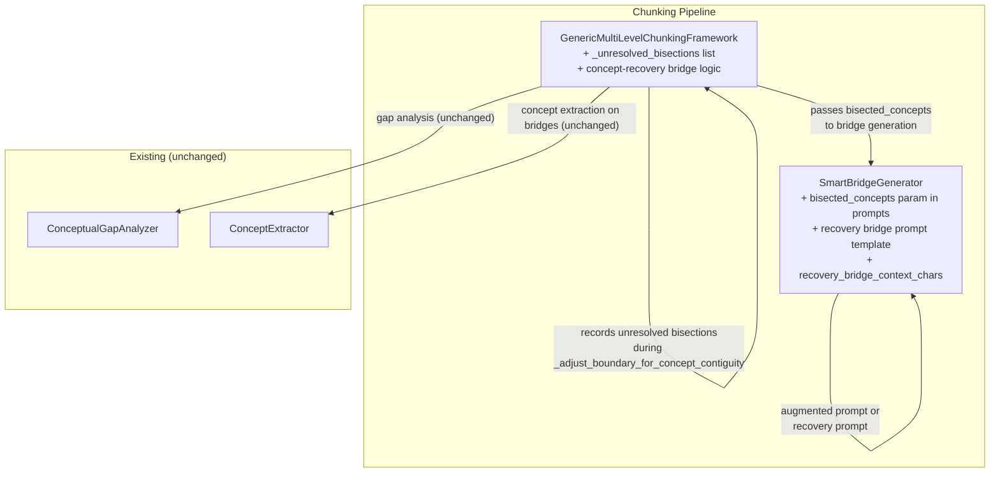
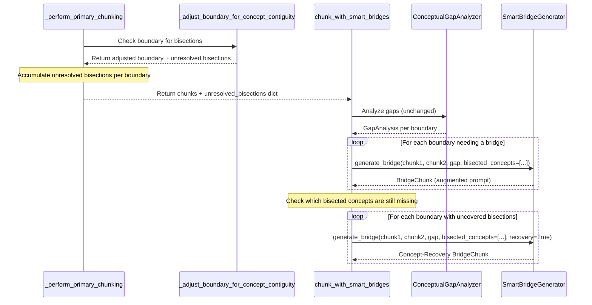

# Design Document: Concept-Aware Bridge Recovery

## Overview

This design adds concept-awareness to the bridge generation pipeline when `_adjust_boundary_for_concept_contiguity` cannot resolve a concept bisection via boundary shifting. Two mechanisms are introduced:

1. **Augmented standard bridges**: When a standard bridge is already being generated for a boundary (gap score exceeds threshold) and unresolved bisections exist at that boundary, the bridge prompt is augmented with explicit instructions to preserve the bisected concepts verbatim.

2. **Concept-recovery bridges**: When bisected concepts are not covered by the standard bridge pipeline — either because no bridge was generated (gap score below threshold) or because the bisected concepts don't appear in the generated bridge text — additional recovery bridges are generated using a concept-preserving prompt with a wider context window.

All changes are surgical modifications to existing components (`framework.py`, `bridge_generator.py`, `config.py`). No new services or DI providers are introduced. The feature is backward-compatible and gated behind an `enable_concept_recovery_bridges` setting.

## Architecture

The changes touch two existing files and the settings module:



### Data Flow



## Components and Interfaces

### 1. Unresolved Bisection Recording

**File**: `src/multimodal_librarian/components/chunking_framework/framework.py`

#### 1a. New Data Class

```python
@dataclass
class UnresolvedBisection:
    """Records a concept that could not be kept whole by boundary adjustment."""
    concept_name: str
    concept_confidence: float
    boundary_index: int  # word index of the boundary in the original text
    chunk_before_id: str  # ID of the chunk before the boundary
    chunk_after_id: str   # ID of the chunk after the boundary
```

#### 1b. Modified `_adjust_boundary_for_concept_contiguity`

The method signature gains an optional `unresolved_bisections` list parameter. When the method cannot resolve a bisection (fallback path), it appends an `UnresolvedBisection` to this list instead of silently dropping the information.

The three fallback paths that produce unresolved bisections:

1. **Forward shift exceeds max_chunk_size AND backward shift would produce zero-size chunk**: The highest-confidence spanning concept is unresolved.
2. **Multiple spanning concepts**: Only the highest-confidence concept is resolved; all others are recorded as unresolved.
3. **Exception during concept extraction**: No bisections are recorded (existing behavior preserved).

```python
def _adjust_boundary_for_concept_contiguity(
    self,
    pre_boundary_text: str,
    post_boundary_text: str,
    boundary_word_index: int,
    max_chunk_size: int,
    current_chunk_size: int,
    overlap_window: int = 20,
    unresolved_bisections: Optional[List[UnresolvedBisection]] = None,
) -> int:
    # ... existing logic up to spanning_concepts detection ...

    if not spanning_concepts:
        return boundary_word_index

    # Pick highest-confidence spanning concept
    best = max(spanning_concepts, key=lambda x: x[0].confidence)
    concept, start_in_overlap, end_in_overlap = best

    # Record all OTHER spanning concepts as unresolved
    if unresolved_bisections is not None:
        for other_concept, _, _ in spanning_concepts:
            if other_concept is not best[0]:
                unresolved_bisections.append(UnresolvedBisection(
                    concept_name=other_concept.concept_name,
                    concept_confidence=other_concept.confidence,
                    boundary_index=boundary_word_index,
                    chunk_before_id="",  # filled after chunk ID generation
                    chunk_after_id="",
                ))

    # Shift boundary past the concept (keep concept in current chunk)
    shift_forward = end_in_overlap - boundary_in_overlap
    new_boundary_forward = boundary_word_index + shift_forward
    if current_chunk_size + shift_forward <= max_chunk_size:
        return new_boundary_forward

    # Can't shift forward — shift backward
    shift_backward = boundary_in_overlap - start_in_overlap
    new_boundary_backward = boundary_word_index - shift_backward
    if new_boundary_backward > 0:
        return new_boundary_backward

    # Fallback: record the BEST concept as unresolved too
    if unresolved_bisections is not None:
        unresolved_bisections.append(UnresolvedBisection(
            concept_name=concept.concept_name,
            concept_confidence=concept.confidence,
            boundary_index=boundary_word_index,
            chunk_before_id="",
            chunk_after_id="",
        ))
    return boundary_word_index
```

#### 1c. Modified `_perform_primary_chunking`

Returns a tuple of `(chunks, unresolved_bisections_by_boundary)` where the second element is a `Dict[int, List[UnresolvedBisection]]` keyed by chunk boundary index (the index of the chunk pair, i.e., boundary between chunk `i` and chunk `i+1`).

After each chunk is created and its ID is known, the method back-fills the `chunk_before_id` and `chunk_after_id` fields on any `UnresolvedBisection` records for that boundary.

### 2. Bridge Generator Modifications

**File**: `src/multimodal_librarian/components/chunking_framework/bridge_generator.py`

#### 2a. Augmented `create_adaptive_prompt`

Add an optional `bisected_concepts: Optional[List[str]] = None` parameter. When non-empty, append a concept-preservation instruction block to the prompt:

```python
def create_adaptive_prompt(self, chunk1: str, chunk2: str, gap_analysis: GapAnalysis,
                         content_type: ContentType, domain_config: Optional[DomainConfig],
                         bisected_concepts: Optional[List[str]] = None) -> str:
    # ... existing prompt construction ...

    if bisected_concepts:
        concept_list = "\n".join(f"  - {c}" for c in bisected_concepts)
        prompt += (
            f"\n\nCRITICAL: The following concepts were split across the chunk boundary. "
            f"You MUST include each of these concepts VERBATIM in your bridge text:\n"
            f"{concept_list}\n"
            f"Weave them naturally into the bridge while preserving the exact terminology."
        )

    return prompt
```

#### 2b. Augmented `generate_bridge`

Add an optional `bisected_concepts: Optional[List[str]] = None` parameter, threaded through to `create_adaptive_prompt` via the `BridgeGenerationRequest`.

```python
def generate_bridge(self, chunk1: str, chunk2: str, gap_analysis: GapAnalysis,
                   content_type: ContentType = ContentType.GENERAL,
                   domain_config: Optional[DomainConfig] = None,
                   context: Optional[str] = None,
                   bisected_concepts: Optional[List[str]] = None) -> BridgeChunk:
```

The `BridgeGenerationRequest` dataclass gains an optional `bisected_concepts: Optional[List[str]] = None` field. The `_generate_single_bridge` method passes this through to `create_adaptive_prompt`.

#### 2c. Concept-Recovery Bridge Prompt

For concept-recovery bridges, the prompt uses a wider context window (`recovery_bridge_context_chars`, default 400) and a dedicated prompt template focused on concept preservation:

```python
def create_recovery_prompt(self, chunk1: str, chunk2: str,
                          bisected_concepts: List[str],
                          content_type: ContentType,
                          domain_config: Optional[DomainConfig]) -> str:
    """Create a prompt specifically for concept-recovery bridges."""
    settings = get_settings()
    context_chars = getattr(settings, 'recovery_bridge_context_chars', 400)

    chunk1_end = self._extract_chunk_end(chunk1, max_length=context_chars)
    chunk2_start = self._extract_chunk_start(chunk2, max_length=context_chars)

    concept_list = "\n".join(f"  - {c}" for c in bisected_concepts)

    return (
        f"You are creating a concept-recovery bridge between two content sections. "
        f"The following concepts were split across the chunk boundary and MUST be "
        f"preserved verbatim in your bridge text:\n\n"
        f"BISECTED CONCEPTS (include each EXACTLY as written):\n{concept_list}\n\n"
        f"CHUNK 1 (ending):\n{chunk1_end}\n\n"
        f"CHUNK 2 (beginning):\n{chunk2_start}\n\n"
        f"Create a bridge of 2-3 sentences that:\n"
        f"1. Includes each bisected concept verbatim\n"
        f"2. Provides enough context for each concept to be meaningful\n"
        f"3. Maintains natural readability\n\n"
        f"Bridge:"
    )
```

#### 2d. Modified `batch_generate_bridges`

Add an optional `bisected_concepts_per_boundary: Optional[Dict[int, List[str]]] = None` parameter. When provided, each `BridgeGenerationRequest` in the batch is augmented with the bisected concepts for its boundary index.

### 3. Concept-Recovery Logic in `chunk_with_smart_bridges`

**File**: `src/multimodal_librarian/components/chunking_framework/framework.py`

After standard bridge generation (Step 4-5 in the existing pipeline), add a new Step 6.5 before the existing Step 6 (concept extraction on bridges):

```python
# Step 6.5: Concept-recovery bridges
settings = get_settings()
enable_recovery = getattr(settings, 'enable_concept_recovery_bridges', True)

if enable_recovery and unresolved_bisections_by_boundary:
    recovery_bridges = []

    for boundary_idx, bisections in unresolved_bisections_by_boundary.items():
        if boundary_idx >= len(final_chunks) - 1:
            continue

        chunk1 = final_chunks[boundary_idx]
        chunk2 = final_chunks[boundary_idx + 1]
        bisected_names = [b.concept_name for b in bisections]

        # Check if a standard bridge already covers these concepts
        existing_bridge = None
        for bridge in bridges:
            if bridge.source_chunks == [chunk1.id, chunk2.id]:
                existing_bridge = bridge
                break

        if existing_bridge is not None:
            # Check which concepts are missing from the standard bridge
            missing = [
                name for name in bisected_names
                if name.lower() not in existing_bridge.content.lower()
            ]
            if not missing:
                continue  # all concepts covered
            bisected_names = missing

        # Generate concept-recovery bridge
        gap_analysis = None
        for idx, c1, c2, ga in gap_analyses:
            if idx == boundary_idx:
                gap_analysis = ga
                break

        if gap_analysis is None:
            # Create a minimal gap analysis for the recovery bridge
            gap_analysis = GapAnalysis(
                necessity_score=0.0,
                gap_type=GapType.CONCEPTUAL,
                bridge_strategy=BridgeStrategy.CONTEXTUAL,
            )

        recovery_bridge = self.bridge_generator.generate_bridge(
            chunk1.content, chunk2.content, gap_analysis,
            content_type=content_profile.content_type,
            domain_config=domain_config,
            bisected_concepts=bisected_names,
        )
        recovery_bridge.source_chunks = [chunk1.id, chunk2.id]
        recovery_bridge.metadata = recovery_bridge.metadata or {}
        recovery_bridge.metadata['is_recovery_bridge'] = True
        recovery_bridge.metadata['target_bisected_concepts'] = bisected_names
        recovery_bridges.append(recovery_bridge)

    bridges.extend(recovery_bridges)
```

### 4. Settings Additions

**File**: `src/multimodal_librarian/config.py`

```python
# Concept-aware bridge recovery
enable_concept_recovery_bridges: bool = Field(
    default=True,
    env="ENABLE_CONCEPT_RECOVERY_BRIDGES",
    description="Enable generation of concept-recovery bridges for unresolved bisections",
)
recovery_bridge_context_chars: int = Field(
    default=400,
    env="RECOVERY_BRIDGE_CONTEXT_CHARS",
    description=(
        "Context window size (characters) for concept-recovery bridge prompts. "
        "Double the standard 200-char window to give the LLM more context around bisection points."
    ),
)
```

## Data Models

### New Data Classes

#### UnresolvedBisection

```python
@dataclass
class UnresolvedBisection:
    concept_name: str
    concept_confidence: float
    boundary_index: int
    chunk_before_id: str
    chunk_after_id: str
```

Defined in `framework.py` alongside existing `ProcessedChunk` and `ChunkChangeMapping`.

### Modified Data Classes

#### BridgeGenerationRequest (modified)

Add optional field:

```python
bisected_concepts: Optional[List[str]] = None
```

#### BridgeChunk (unchanged)

No structural changes. Recovery bridges use the existing `metadata` dict to carry `is_recovery_bridge`, `target_bisected_concepts`, and `adjacent_chunk_ids` fields.


## Correctness Properties

*A property is a characteristic or behavior that should hold true across all valid executions of a system — essentially, a formal statement about what the system should do. Properties serve as the bridge between human-readable specifications and machine-verifiable correctness guarantees.*

### Property 1: Unresolved bisections are recorded for all concepts not resolved by boundary shifting

*For any* overlap zone containing N spanning multi-word concepts (N >= 1) at a proposed chunk boundary, after `_adjust_boundary_for_concept_contiguity` executes, the `unresolved_bisections` list shall contain an entry for every spanning concept that was not resolved by the boundary shift. If the boundary was shifted to resolve the highest-confidence concept, the list shall contain N-1 entries. If no shift was possible (both forward and backward shifts infeasible), the list shall contain N entries. Each entry shall have the correct `concept_name` and `concept_confidence`.

**Validates: Requirements 1.1, 1.2, 1.4**

### Property 2: Augmented bridge prompt contains all bisected concepts verbatim

*For any* non-empty list of bisected concept names passed to `create_adaptive_prompt`, the returned prompt string shall contain each concept name as a substring. When the list is empty or None, the prompt shall not contain the concept-preservation instruction block (the "CRITICAL" keyword).

**Validates: Requirements 2.1, 2.2, 2.3**

### Property 3: Recovery bridges are generated for all uncovered bisections

*For any* boundary with unresolved bisections, if no standard bridge exists for that boundary OR the standard bridge text does not contain all bisected concept names (case-insensitive), a concept-recovery bridge shall be generated targeting the missing concepts. If all bisected concepts appear in the standard bridge text, no recovery bridge shall be generated.

**Validates: Requirements 3.1, 3.2, 3.5**

### Property 4: Recovery bridge metadata is complete

*For any* concept-recovery bridge in the output, its `metadata` dict shall contain: `is_recovery_bridge` set to `True`, `target_bisected_concepts` as a non-empty list of strings, and `adjacent_chunk_ids` as a list of exactly two chunk IDs.

**Validates: Requirements 3.4, 5.2**

### Property 5: Recovery prompt uses wider context window and includes all target concepts

*For any* call to `create_recovery_prompt` with bisected concepts and chunks longer than `recovery_bridge_context_chars`, the chunk excerpts in the prompt shall be at least `recovery_bridge_context_chars` characters long (or the full chunk text if shorter). Every bisected concept name shall appear verbatim in the prompt.

**Validates: Requirements 4.1, 4.2, 4.4**

### Property 6: Feature toggle disables all recovery bridge generation

*For any* input with unresolved bisections, when `enable_concept_recovery_bridges` is `False`, the output `ChunkingResult.bridges` list shall contain zero bridges with `metadata['is_recovery_bridge'] == True`. The standard bridge pipeline shall be unaffected.

**Validates: Requirements 6.1, 6.2**

## Error Handling

### Chunking_Framework

- If concept extraction fails during `_adjust_boundary_for_concept_contiguity`, return the original boundary unchanged and do not record any unresolved bisections (existing behavior preserved).
- If `unresolved_bisections` parameter is `None` (backward-compatible call), skip all bisection recording silently.
- If a recovery bridge generation fails (LLM error, timeout), log a warning and continue without the recovery bridge. Do not fail the entire chunking pipeline.
- If `enable_concept_recovery_bridges` setting is missing from config, default to `True`.
- If `recovery_bridge_context_chars` setting is missing, default to `400`.

### Bridge_Generator

- If `bisected_concepts` is `None` or empty in `create_adaptive_prompt`, produce the standard prompt without modification (backward compatibility).
- If `bisected_concepts` is `None` or empty in `generate_bridge`, behave identically to the existing implementation.
- If `create_recovery_prompt` receives an empty `bisected_concepts` list, return a standard prompt (defensive guard).
- If chunk text is shorter than `recovery_bridge_context_chars`, use the full chunk text without error.

## Testing Strategy

### Property-Based Testing

Use `hypothesis` as the property-based testing library. Each property test runs a minimum of 100 iterations.

Property tests cover Properties 1–6 as defined above. Each test is tagged with:
```
Feature: concept-aware-bridge-recovery, Property {N}: {title}
```

### Unit Testing

Unit tests complement property tests for:
- Backward compatibility: calling `create_adaptive_prompt` and `generate_bridge` without `bisected_concepts` parameter
- Configuration: verifying `enable_concept_recovery_bridges` and `recovery_bridge_context_chars` exist in Settings with correct defaults and env overrides
- Integration: end-to-end `chunk_with_smart_bridges` with a document containing a known bisection point, verifying recovery bridge appears in output
- Recovery bridge concept extraction: verifying recovery bridges go through `ConceptExtractor` and have `extracted_concepts` in metadata
- Edge case: boundary with bisections where standard bridge already covers all concepts (no recovery bridge generated)

### Test Organization

```
tests/
├── components/
│   ├── test_concept_bisection_recording.py     # Property 1
│   ├── test_bridge_prompt_augmentation.py       # Properties 2, 5
│   └── test_concept_recovery_bridges.py         # Properties 3, 4, 6
```

### PBT Library Configuration

```python
from hypothesis import given, settings, strategies as st

@settings(max_examples=100)
@given(
    concept_names=st.lists(
        st.text(min_size=3, max_size=30, alphabet=st.characters(whitelist_categories=('L', 'Nd', 'Zs'))),
        min_size=1, max_size=5,
    ),
)
def test_augmented_prompt_contains_concepts(concept_names):
    # Feature: concept-aware-bridge-recovery, Property 2: Augmented bridge prompt contains all bisected concepts verbatim
    ...
```
