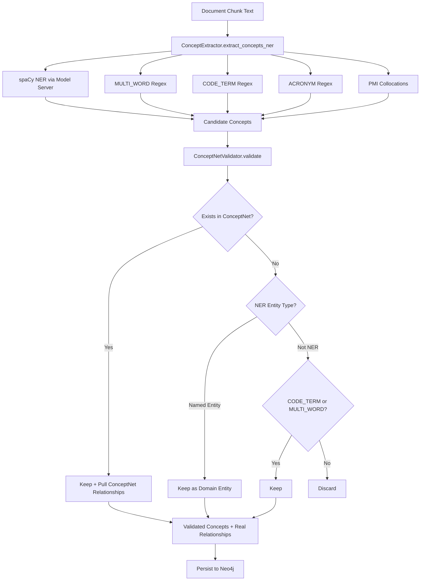

# Design Document: Concept Extraction Quality Overhaul

## Overview

This design replaces the low-quality regex-based concept extraction in `kg_builder.py` with a pipeline that combines spaCy NER (via the existing model server) with curated regex patterns (MULTI_WORD, CODE_TERM), and adds a local ConceptNet validation gate backed by ConceptNet 5.7 data imported into the existing Neo4j instance.

The current pipeline extracts ~27,753 concepts (of which ~18,485 are junk ENTITY matches like "However", "Fixed", "Generated") and creates ~1.4M co-occurrence RELATED_TO relationships. The new pipeline will produce far fewer, higher-quality concepts with real semantic relationships from ConceptNet.

Key design decisions:
- ConceptNet data lives in the same Neo4j instance under a separate label namespace (`:ConceptNetConcept`, `:ConceptNetRelation`) to avoid mixing with document concepts and to enable fast local lookups without external API calls.
- spaCy NER is already running in the model server container — we just need to wire `kg_builder.py` to call it via the existing `ModelServerClient`.
- The validation gate is a new class (`ConceptNetValidator`) that sits between extraction and persistence, filtering candidates and pulling real relationships.
- The ACRONYM pattern and PMI collocation extraction are retained alongside MULTI_WORD and CODE_TERM.

## Architecture



The Celery pipeline flow remains the same — `update_knowledge_graph_task` calls `KnowledgeGraphBuilder.process_knowledge_chunk_async()`, which now internally uses the new extraction + validation pipeline.

## Components and Interfaces

### 1. ConceptNet Import Script (`scripts/import_conceptnet.py`)

A standalone Python script that:
- Downloads ConceptNet 5.7 English assertions CSV from `https://s3.amazonaws.com/conceptnet/downloads/2019/edges/conceptnet-assertions-5.7.0.csv.gz`
- Filters to English-only triples (`/c/en/` URIs)
- Parses each line into (concept1, relation, concept2, weight)
- Batch-imports into Neo4j using `UNWIND` + `MERGE` Cypher queries
- Creates indexes on `:ConceptNetConcept(name)` and `:ConceptNetConcept(uri)`

```python
class ConceptNetImporter:
    def __init__(self, neo4j_uri: str, neo4j_user: str, neo4j_password: str):
        ...

    async def import_assertions(self, file_path: str, batch_size: int = 5000) -> ImportStats:
        """Parse CSV and batch-import into Neo4j."""
        ...

    async def create_indexes(self) -> None:
        """Create indexes for fast lookup."""
        ...

    def parse_conceptnet_uri(self, uri: str) -> str:
        """Convert /c/en/some_concept to 'some concept'."""
        ...
```

### 2. ConceptNetValidator (`src/multimodal_librarian/components/knowledge_graph/conceptnet_validator.py`)

New class that validates candidate concepts against the local ConceptNet data in Neo4j and retrieves real relationships.

```python
class ConceptNetValidator:
    def __init__(self, neo4j_client: Neo4jClient):
        ...

    async def validate_concepts(
        self,
        candidates: List[ConceptNode],
    ) -> ValidationResult:
        """
        Validate candidates against ConceptNet.
        Returns validated concepts and their ConceptNet relationships.
        """
        ...

    async def lookup_concept(self, name: str) -> Optional[Dict]:
        """Case-insensitive lookup in ConceptNet_Store."""
        ...

    async def get_relationships_for_concepts(
        self,
        concept_names: List[str],
    ) -> Dict[str, List[ConceptNetRelationship]]:
        """Batch-fetch ConceptNet relationships for validated concepts."""
        ...
```

`ValidationResult` is a dataclass:

```python
@dataclass
class ValidationResult:
    validated_concepts: List[ConceptNode]
    conceptnet_relationships: List[RelationshipEdge]
    discarded_count: int
    kept_by_ner: int
    kept_by_conceptnet: int
    kept_by_pattern: int
```

### 3. Updated ConceptExtractor (`kg_builder.py`)

The existing `ConceptExtractor.extract_concepts_ner()` method is refactored:

- Remove ENTITY, PROCESS, PROPERTY patterns from `self.concept_patterns`
- Add a new async method `extract_concepts_with_ner()` that calls `ModelServerClient.get_entities()`
- The sync `extract_concepts_ner()` method retains only MULTI_WORD, CODE_TERM, ACRONYM patterns + PMI collocations
- A new combined method `extract_all_concepts_async()` merges NER results with regex results

```python
# In ConceptExtractor:

async def extract_concepts_with_ner(self, text: str) -> List[ConceptNode]:
    """Extract concepts using spaCy NER via model server."""
    client = await self._get_model_server_client()
    if client is None:
        logger.warning("Model server unavailable, skipping NER extraction")
        return []
    entities = await client.get_entities([text])
    # Convert spaCy entities to ConceptNode objects
    ...

def extract_concepts_regex(self, text: str) -> List[ConceptNode]:
    """Extract concepts using curated regex patterns only (MULTI_WORD, CODE_TERM, ACRONYM + PMI)."""
    # This is the existing extract_concepts_ner() with ENTITY/PROCESS/PROPERTY removed
    ...

async def extract_all_concepts_async(self, text: str) -> List[ConceptNode]:
    """Combine NER + regex extraction, deduplicate."""
    ner_concepts = await self.extract_concepts_with_ner(text)
    regex_concepts = self.extract_concepts_regex(text)
    return self._merge_concepts(ner_concepts, regex_concepts)
```

### 4. Updated KnowledgeGraphBuilder

`process_knowledge_chunk_async()` is updated to:
1. Call `extract_all_concepts_async()` instead of `extract_concepts_ner()`
2. Pass candidates through `ConceptNetValidator.validate_concepts()`
3. Use validated relationships instead of co-occurrence RELATED_TO
4. Still run pattern-based relationship extraction for IS_A, PART_OF, CAUSES patterns

### 5. Celery Pipeline Integration

No structural changes to `celery_service.py`. The `_update_knowledge_graph()` async function already calls `kg_builder.process_knowledge_chunk_async()`, which will internally use the new pipeline. The only change is that `_update_knowledge_graph()` needs to:
- Initialize a `ConceptNetValidator` with the Neo4j client
- Pass it to the KG builder (or have the builder create it internally)

## Data Models

### ConceptNet Neo4j Schema

```
(:ConceptNetConcept {
    name: String,        -- normalized lowercase name, e.g. "machine learning"
    uri: String,         -- original ConceptNet URI, e.g. "/c/en/machine_learning"
    language: "en"
})

-[:ConceptNetRelation {
    relation_type: String,  -- e.g. "IsA", "PartOf", "UsedFor", "HasProperty"
    weight: Float,          -- ConceptNet edge weight
    source_uri: String      -- original assertion URI
}]->
```

Indexes:
- `CREATE INDEX conceptnet_name FOR (n:ConceptNetConcept) ON (n.name)`
- `CREATE INDEX conceptnet_uri FOR (n:ConceptNetConcept) ON (n.uri)`

### ValidationResult Dataclass

```python
@dataclass
class ValidationResult:
    validated_concepts: List[ConceptNode]       # Concepts that passed validation
    conceptnet_relationships: List[RelationshipEdge]  # Real relationships from ConceptNet
    discarded_count: int                        # Concepts filtered out
    kept_by_ner: int                            # Kept because NER named entity
    kept_by_conceptnet: int                     # Kept because found in ConceptNet
    kept_by_pattern: int                        # Kept because CODE_TERM/MULTI_WORD
```

### ConceptNode Changes

The existing `ConceptNode.concept_type` field will now store:
- spaCy NER labels: `"ORG"`, `"PERSON"`, `"GPE"`, `"PRODUCT"`, `"WORK_OF_ART"`, `"EVENT"`, `"LAW"`, `"NORP"`, `"FAC"`, `"LOC"`
- Retained regex types: `"MULTI_WORD"`, `"CODE_TERM"`, `"ACRONYM"`

The ENTITY, PROCESS, PROPERTY types are eliminated.

### ImportStats Dataclass

```python
@dataclass
class ImportStats:
    concepts_imported: int
    relationships_imported: int
    duplicates_skipped: int
    errors: int
    duration_seconds: float
```


## Correctness Properties

*A property is a characteristic or behavior that should hold true across all valid executions of a system — essentially, a formal statement about what the system should do. Properties serve as the bridge between human-readable specifications and machine-verifiable correctness guarantees.*

### Property 1: ConceptNet CSV Parsing Round-Trip

*For any* valid ConceptNet assertion line containing two `/c/en/` URIs and a `/r/` relation, parsing the line with `parse_conceptnet_uri()` and reconstructing the triple SHALL produce the original concept names and relation type.

**Validates: Requirements 1.1**

### Property 2: ConceptNet Name Normalization

*For any* string containing underscores or hyphens, the `parse_conceptnet_uri()` normalization SHALL produce a lowercase string with underscores and hyphens replaced by spaces, and leading/trailing whitespace removed.

**Validates: Requirements 1.4**

### Property 3: Import Idempotence

*For any* set of ConceptNet triples, importing them into Neo4j twice SHALL result in the same node and relationship counts as importing them once.

**Validates: Requirements 1.5**

### Property 4: No Junk Concept Types Produced

*For any* input text, the concept extraction pipeline SHALL never produce concepts with type `ENTITY`, `PROCESS`, or `PROPERTY`. All extracted concept types SHALL be one of: a spaCy NER label (ORG, PERSON, GPE, PRODUCT, WORK_OF_ART, EVENT, LAW, NORP, FAC, LOC, etc.), `MULTI_WORD`, `CODE_TERM`, or `ACRONYM`.

**Validates: Requirements 2.2**

### Property 5: Curated Regex Patterns Retained

*For any* text containing a substring that matches the MULTI_WORD seed list or CODE_TERM pattern (e.g. `snake_case` identifiers, `camelCase` identifiers, or known multi-word phrases like "knowledge graph"), the extraction pipeline SHALL include at least one concept of type `MULTI_WORD` or `CODE_TERM` respectively.

**Validates: Requirements 2.3**

### Property 6: NER Label Preserved as Concept Type

*For any* spaCy NER entity result with label L and text T, the resulting `ConceptNode` SHALL have `concept_type == L` and `concept_name == T`.

**Validates: Requirements 2.5**

### Property 7: Validation Gate Filtering

*For any* set of candidate concepts, the validation gate SHALL keep a concept if and only if at least one of the following holds: (a) the concept name exists in the ConceptNet_Store, (b) the concept was sourced from NER with a named entity label, or (c) the concept type is `CODE_TERM`, `MULTI_WORD`, or `ACRONYM`. All other concepts SHALL be discarded.

**Validates: Requirements 3.1, 3.2, 3.3**

### Property 8: Real Relationships Replace RELATED_TO

*For any* pair of validated concepts that both exist in the ConceptNet_Store and have a ConceptNet relationship between them, the output relationships SHALL use the ConceptNet relationship type (IsA, PartOf, UsedFor, HasProperty, etc.) instead of co-occurrence RELATED_TO.

**Validates: Requirements 3.4**

### Property 9: Case-Insensitive ConceptNet Lookup

*For any* concept name, looking it up in the ConceptNet_Store with any combination of upper/lower case characters SHALL return the same result as looking up the fully lowercase version.

**Validates: Requirements 3.5**

## Error Handling

| Scenario | Handling |
|---|---|
| Model server unavailable during NER extraction | Fall back to MULTI_WORD + CODE_TERM regex only. Log warning. Do not fail the chunk. |
| Neo4j unavailable during ConceptNet validation | Skip validation gate entirely. Keep all extracted concepts (NER + regex). Log warning. |
| ConceptNet import encounters malformed CSV line | Skip the line, increment error counter, continue processing. Log at debug level. |
| ConceptNet import Neo4j connection drops mid-batch | Retry the current batch up to 3 times with exponential backoff. If all retries fail, log error and report partial import stats. |
| ConceptNet lookup returns no results for a concept | Concept proceeds through the NER/pattern-type fallback logic in the validation gate. |
| Celery task fails during KG update with new pipeline | Existing retry logic in `update_knowledge_graph_task` applies. The task logs the error and returns `processed_document` so the chain continues. |

## Testing Strategy

### Unit Tests

- Test `parse_conceptnet_uri()` with specific examples: `/c/en/machine_learning` → `"machine learning"`, `/c/en/New_York` → `"new york"`
- Test that `ConceptExtractor.concept_patterns` no longer contains ENTITY, PROCESS, or PROPERTY keys
- Test `ConceptNetValidator` with mocked Neo4j responses for concepts that exist/don't exist in ConceptNet
- Test model server fallback by mocking `ModelServerClient` as unavailable
- Test `ValidationResult` counts are correct for known inputs

### Property-Based Tests

Use `pytest` with `hypothesis` for property-based testing. Each property test runs a minimum of 100 iterations.

- **Feature: concept-extraction-quality-overhaul, Property 1: ConceptNet CSV Parsing Round-Trip** — Generate random ConceptNet-style CSV lines and verify parsing produces correct triples.
- **Feature: concept-extraction-quality-overhaul, Property 2: ConceptNet Name Normalization** — Generate random strings with underscores/hyphens and verify normalization output.
- **Feature: concept-extraction-quality-overhaul, Property 3: Import Idempotence** — Import random triples twice into a test Neo4j instance and verify counts match. (Integration-level property test.)
- **Feature: concept-extraction-quality-overhaul, Property 4: No Junk Concept Types Produced** — Generate random text strings and verify no ENTITY/PROCESS/PROPERTY types appear in extraction output.
- **Feature: concept-extraction-quality-overhaul, Property 5: Curated Regex Patterns Retained** — Generate text containing known MULTI_WORD/CODE_TERM patterns and verify they appear in output.
- **Feature: concept-extraction-quality-overhaul, Property 6: NER Label Preserved as Concept Type** — Generate random spaCy entity dicts and verify ConceptNode mapping.
- **Feature: concept-extraction-quality-overhaul, Property 7: Validation Gate Filtering** — Generate random candidate concept sets with mixed sources and verify the gate keeps exactly the right ones.
- **Feature: concept-extraction-quality-overhaul, Property 8: Real Relationships Replace RELATED_TO** — Generate pairs of concepts with mock ConceptNet relationships and verify RELATED_TO is replaced.
- **Feature: concept-extraction-quality-overhaul, Property 9: Case-Insensitive ConceptNet Lookup** — Generate random concept names with mixed case and verify lookup equivalence.

### Testing Libraries

- `pytest` — test runner
- `hypothesis` — property-based testing (already in project dependencies)
- `unittest.mock` / `pytest-mock` — mocking Model Server and Neo4j clients
- `pytest-asyncio` — async test support
