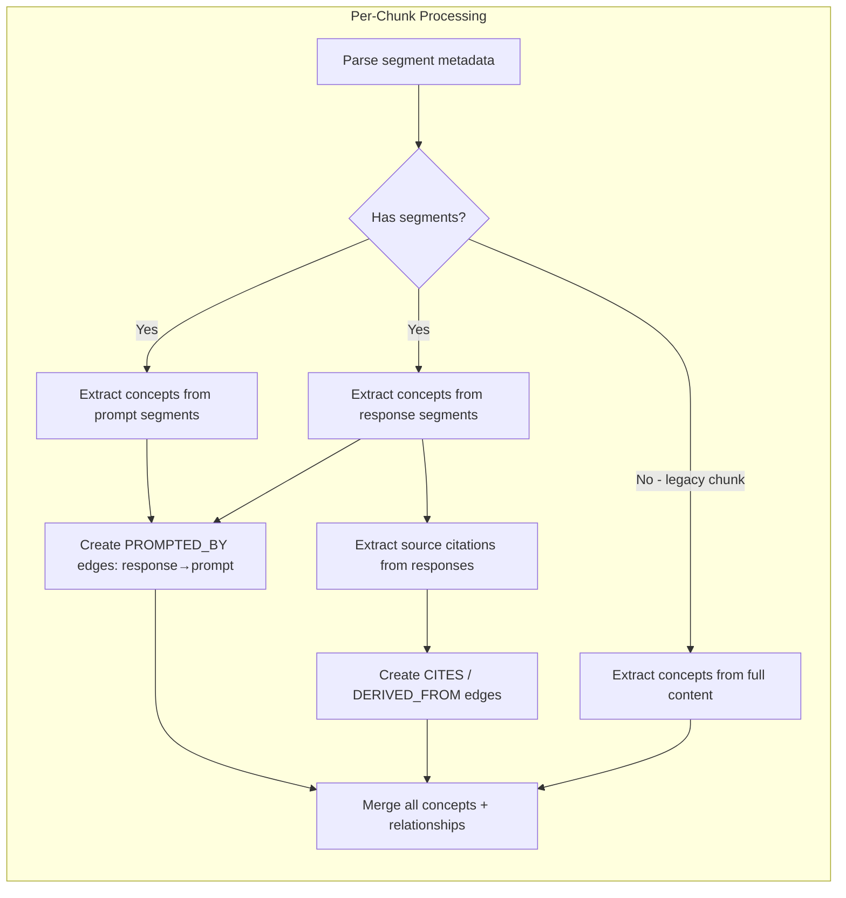

# Design Document: Conversation KG Quality

## Overview

The conversation-to-knowledge-graph pipeline (`ConversationKnowledgeService`) currently uses only pattern-based relationship extraction — the weakest of the three methods available in the document pipeline. This produces sparse, poorly-connected graphs from conversational text because regex patterns like "X is a Y" rarely match natural dialogue. Additionally, conversations are flattened into timestamped text blocks, losing the prompt→response→source structure.

This design brings the conversation pipeline to parity with the document pipeline (`KnowledgeGraphBuilder.process_knowledge_chunk_async`) by:

1. Adding embedding-based relationship extraction (SIMILAR_TO edges via cosine similarity > 0.6)
2. Adding ConceptNet validation gate (filter low-quality concepts, gain ConceptNet-sourced relationships)
3. Preserving conversation structure in chunking (prompt vs. response segments, PROMPTED_BY edges)
4. Extracting source citations from AI responses (CITES and DERIVED_FROM edges)
5. Matching the document pipeline's deduplication, evidence tracking, and confidence scoring

The changes are confined to three files: `ConversationKnowledgeService._extract_and_store_concepts`, `ConversationManager._combine_message_group` / `convert_to_knowledge_chunks`, and the KG Explorer query engine for new relationship type traversal.

## Architecture

### Current vs. Proposed Pipeline

```mermaid
graph TD
    subgraph "Current Conversation Pipeline"
        A1[KnowledgeChunk] --> B1[ConceptExtractor.extract_all_concepts_async]
        B1 --> C1[RelationshipExtractor.extract_relationships_pattern]
        C1 --> D1[Persist to Neo4j]
    end

    subgraph "Proposed Conversation Pipeline"
        A2[KnowledgeChunk with segment metadata] --> B2[ConceptExtractor.extract_all_concepts_async]
        B2 --> C2[ConceptNetValidator.validate_concepts]
        C2 -->|validated concepts| D2[extract_relationships_pattern]
        C2 -->|conceptnet_relationships| G2[Combine all relationships]
        D2 --> G2
        C2 -->|validated concepts| E2[extract_relationships_embedding_async]
        E2 --> G2
        A2 -->|response segments| F2[Extract source citations]
        F2 --> G2
        G2 --> H2[Deduplicate relationships]
        H2 --> I2[Calculate confidence score]
        I2 --> J2[Persist to Neo4j]
    end
```



### Segment-Aware Extraction Flow



### Design Decisions

1. **Reuse existing extractors**: The `RelationshipExtractor.extract_relationships_embedding_async` and `ConceptNetValidator.validate_concepts` methods already exist and are battle-tested in the document pipeline. The conversation pipeline will call them directly rather than duplicating logic.

2. **ConceptNetValidator injected via constructor**: The `ConversationKnowledgeService.__init__` will accept an optional `conceptnet_validator` parameter. The DI provider will construct it from the existing `neo4j_client`, matching how `KnowledgeGraphBuilder._get_conceptnet_validator()` works. This avoids import-time connections per the DI architecture rules.

3. **Segment metadata in KnowledgeChunk**: Rather than changing the `KnowledgeChunk` dataclass (which would affect the entire system), conversation structure is encoded in the existing `knowledge_metadata` field as a JSON-serializable `segments` list. Each segment has a `role` ("user" or "assistant") and `content` string.

4. **Backward-compatible chunking**: The `_combine_message_group` output remains a single string (for embedding and vector storage), but the `KnowledgeMetadata` now carries structured segment data that `_extract_and_store_concepts` can use for segment-aware extraction.

5. **Source citation extraction via regex**: Citations are extracted from response text using patterns for document titles, filenames, and "Source:" references. This is a lightweight approach that doesn't require LLM calls.

6. **KG Explorer traversal is already generic**: The `_get_ego_graph` Cypher query uses `(focus)-[]-(neighbor)` which traverses all relationship types. New types (PROMPTED_BY, CITES, DERIVED_FROM) are automatically traversable. The only change needed is exposing the relationship type in the `_infer_source_type` helper for color coding.

## Components and Interfaces

### Modified: `ConversationKnowledgeService`

**File**: `src/multimodal_librarian/services/conversation_knowledge_service.py`

```python
class ConversationKnowledgeService:
    def __init__(
        self,
        conversation_manager: ConversationManager,
        vector_store: VectorStore,
        model_server_client: ModelServerClient,
        neo4j_client: Any,
        conceptnet_validator: Optional[ConceptNetValidator] = None,
    ):
        # ... existing fields ...
        self._conceptnet_validator = conceptnet_validator

    async def _extract_and_store_concepts(
        self, chunks: List[KnowledgeChunk], source_id: str
    ) -> tuple:
        """Enhanced extraction matching document pipeline.
        
        For each chunk:
        1. Extract concepts (segment-aware if metadata present)
        2. Validate through ConceptNet gate (if available)
        3. Extract pattern relationships
        4. Extract embedding relationships (if model server available)
        5. Extract source citations from response segments
        6. Create PROMPTED_BY edges between prompt/response concepts
        7. Combine, deduplicate, add evidence, calculate confidence
        8. Persist to Neo4j
        """
```

**New private methods**:

```python
async def _extract_concepts_segment_aware(
    self, chunk: KnowledgeChunk
) -> tuple[List[ConceptNode], List[ConceptNode], List[RelationshipEdge]]:
    """Extract concepts separately from prompt and response segments.
    
    Returns:
        (prompt_concepts, response_concepts, prompted_by_edges)
    """

def _extract_source_citations(
    self, response_text: str, response_concepts: List[ConceptNode],
    chunk_id: str
) -> tuple[List[ConceptNode], List[RelationshipEdge]]:
    """Extract source citations from response text.
    
    Returns:
        (citation_concepts, citation_relationships)
    """

async def _match_citation_to_existing_source(
    self, citation_name: str
) -> Optional[str]:
    """Check if a citation matches an existing knowledge source.
    
    Returns the source_id if found, None otherwise.
    """

def _deduplicate_relationships(
    self, relationships: List[RelationshipEdge]
) -> List[RelationshipEdge]:
    """Deduplicate using same logic as KnowledgeGraphBuilder."""
```

### Modified: `ConversationManager._combine_message_group`

**File**: `src/multimodal_librarian/components/conversation/conversation_manager.py`

The method signature stays the same but now returns structured content and populates segment metadata.

```python
def _combine_message_group(
    self, messages: List[Message]
) -> tuple[str, List[dict]]:
    """Combine messages, returning (combined_text, segments).
    
    Each segment: {"role": "user"|"assistant", "content": "..."}
    """
```

The `convert_to_knowledge_chunks` method is updated to store segments in `KnowledgeMetadata` via a new optional field or by extending the metadata dict pattern.

### Modified: `KG Explorer`

**File**: `src/multimodal_librarian/api/routers/kg_explorer.py`

The `_infer_source_type` helper is extended to recognize `CITED_SOURCE` concept types for color coding. The `GraphNode` model gets an optional `concept_type` field. No new endpoints needed — existing traversal handles new relationship types.

### Modified: DI Provider

**File**: `src/multimodal_librarian/api/dependencies/services.py`

The `get_conversation_knowledge_service` provider is updated to construct and inject the `ConceptNetValidator` from the existing `neo4j_client`.

```python
async def get_conversation_knowledge_service(
    conversation_manager = Depends(get_conversation_manager),
    vector_store = Depends(get_vector_store),
    model_client = Depends(get_model_server_client),
    graph_client = Depends(get_graph_client),
) -> ConversationKnowledgeService:
    # ... existing code ...
    # Construct ConceptNetValidator from graph_client
    conceptnet_validator = None
    if graph_client is not None:
        try:
            from ...components.knowledge_graph.conceptnet_validator import (
                ConceptNetValidator,
            )
            conceptnet_validator = ConceptNetValidator(graph_client)
        except Exception as e:
            logger.warning(f"ConceptNetValidator init failed: {e}")
    
    _conversation_knowledge_service = ConversationKnowledgeService(
        conversation_manager=conversation_manager,
        vector_store=vector_store,
        model_server_client=model_client,
        neo4j_client=graph_client,
        conceptnet_validator=conceptnet_validator,
    )
```

## Data Models

### Segment Metadata (stored in KnowledgeMetadata)

Conversation structure is encoded in the `KnowledgeMetadata` by adding a `segments` field to the metadata dict. This avoids modifying the core `KnowledgeMetadata` dataclass.

```python
# Stored in chunk.knowledge_metadata as extended attributes
# Accessed via: chunk.knowledge_metadata.__dict__.get("segments", [])
# Or stored as part of a custom subclass / extra dict field

segments = [
    {"role": "user", "content": "What is photosynthesis?"},
    {"role": "assistant", "content": "Photosynthesis is the process by which plants convert light energy... Source: Biology Textbook Ch.3"},
    {"role": "user", "content": "How does chlorophyll work?"},
    {"role": "assistant", "content": "Chlorophyll absorbs light primarily in the blue and red wavelengths..."},
]
```

### New Relationship Types

| Predicate | Meaning | Created By |
|-----------|---------|------------|
| `SIMILAR_TO` | Cosine similarity > 0.6 between concept embeddings | Embedding extraction (already exists in doc pipeline) |
| `PROMPTED_BY` | Response concept was elicited by a prompt concept | Segment-aware extraction |
| `CITES` | Response concept references a cited source | Citation extraction |
| `DERIVED_FROM` | Citation concept links to existing source's concepts | Citation-to-source matching |

### New Concept Type

| Type | Meaning |
|------|---------|
| `CITED_SOURCE` | A source document cited in an AI response |

### Source Citation Patterns

```python
CITATION_PATTERNS = [
    r"Source:\s*(.+?)(?:\n|$)",           # "Source: Document Title"
    r"from\s+[\"'](.+?)[\"']",            # from "Document Title"
    r"according to\s+[\"'](.+?)[\"']",    # according to "Document Title"
    r"(?:cited|referenced) in\s+(.+?)(?:\.|,|\n|$)",  # cited in X
    r"\[Source:\s*(.+?)\]",               # [Source: X]
    r"📄\s*(.+?)(?:\n|$)",               # 📄 Document Title (UI pattern)
]
```

### Confidence Score Calculation

Matching the document pipeline:

```python
all_confidences = (
    [c.confidence for c in concepts]
    + [r.confidence for r in relationships]
)
overall_confidence = (
    sum(all_confidences) / len(all_confidences)
    if all_confidences else 0.0
)
```


## Correctness Properties

*A property is a characteristic or behavior that should hold true across all valid executions of a system — essentially, a formal statement about what the system should do. Properties serve as the bridge between human-readable specifications and machine-verifiable correctness guarantees.*

### Property 1: Embedding similarity threshold produces SIMILAR_TO edges

From the prework on 1.2: the cosine similarity threshold of 0.6 is a universal rule over all concept pairs. For any two concepts whose embeddings have cosine similarity > 0.6, a SIMILAR_TO edge must be created; for pairs at or below 0.6, no edge should exist. This is a metamorphic property — we control the embeddings and verify the output edges match the threshold.

*For any* list of concepts with known embedding vectors, the set of SIMILAR_TO relationship edges produced by the extraction should contain exactly those concept pairs whose cosine similarity exceeds 0.6, and no others.

**Validates: Requirements 1.2**

### Property 2: Relationship deduplication preserves unique edges with max confidence

From the prework on 1.4, 2.4, 5.2: the deduplication function combines relationships from three sources (ConceptNet, pattern, embedding) and keeps one edge per (subject, predicate, object) triple, taking the maximum confidence. This is a model-based property — the conversation pipeline's dedup should produce identical output to `KnowledgeGraphBuilder._deduplicate_relationships` for the same input.

*For any* list of relationship edges (possibly containing duplicates across subject/predicate/object), the deduplicated output should contain exactly one edge per unique (subject, predicate, object) triple, with confidence equal to the maximum confidence among duplicates, and evidence chunks merged from all duplicates.

**Validates: Requirements 1.4, 2.4, 5.2**

### Property 3: ConceptNet validation filters concepts before relationship extraction

From the prework on 2.1, 2.2: when the validator is available, only validated concepts should be used for relationship extraction. This is an invariant — the concepts passed to pattern/embedding extraction must be a subset of the validator's output.

*For any* set of candidate concepts extracted from a chunk, when a ConceptNet validator is available, the concepts used for relationship extraction should be exactly the set returned by `ConceptNetValidator.validate_concepts`, and any ConceptNet-sourced relationships should be included in the combined relationship set.

**Validates: Requirements 2.1, 2.2**

### Property 4: Chunk segments preserve message roles

From the prework on 3.1, 3.2: the chunking process must produce segment metadata that preserves which content came from user prompts vs. system responses. This is an invariant on the chunking output.

*For any* message group containing messages with known roles (user/assistant), the resulting KnowledgeChunk's segment metadata should contain one segment per message, each with the correct role and content, in the original message order.

**Validates: Requirements 3.1, 3.2**

### Property 5: Segment-aware extraction produces PROMPTED_BY edges

From the prework on 3.3, 3.4: when a chunk has both prompt and response segments, PROMPTED_BY edges should link response concepts back to prompt concepts. This is a property over all chunks with mixed segments.

*For any* KnowledgeChunk with at least one user prompt segment and one assistant response segment that each produce at least one concept, the extracted relationships should include PROMPTED_BY edges where every response concept has at least one PROMPTED_BY edge to a prompt concept.

**Validates: Requirements 3.3, 3.4**

### Property 6: Citation extraction produces CITED_SOURCE concepts with CITES edges

From the prework on 4.1, 4.2: for any response text containing citation patterns, the extraction should produce CITED_SOURCE concept nodes linked via CITES edges. This is a property over all response texts with embedded citations.

*For any* response text containing one or more source citation patterns (e.g., "Source: X", "from 'X'"), the extraction should produce a CITED_SOURCE concept node for each unique citation and a CITES relationship edge from each response concept to the corresponding citation concept.

**Validates: Requirements 4.1, 4.2**

### Property 7: Citation-to-source matching produces DERIVED_FROM edges

From the prework on 4.3: when a citation matches an existing knowledge source, a DERIVED_FROM edge should be created instead of a duplicate concept. This is a property over all citation-source pairs.

*For any* extracted source citation that matches an existing knowledge source title in the database, the pipeline should create a DERIVED_FROM relationship edge linking the citation concept to the existing source's identifier, rather than creating a duplicate source concept.

**Validates: Requirements 4.3**

### Property 8: All relationships have evidence chunk references

From the prework on 5.3: every relationship produced by the extraction pipeline must reference at least one evidence chunk. This is an invariant on all extraction output.

*For any* relationship edge produced by the conversation extraction pipeline, the `evidence_chunks` list should be non-empty and contain the chunk ID of the chunk from which the relationship was extracted.

**Validates: Requirements 5.3**

### Property 9: Confidence score equals average of concept and relationship confidences

From the prework on 5.4: the overall confidence score is a deterministic computation. This is a round-trip-style property — we can compute the expected value independently and compare.

*For any* set of extracted concepts and relationships with known confidence scores, the overall extraction confidence should equal the arithmetic mean of all concept confidences and relationship confidences combined.

**Validates: Requirements 5.4**

### Property 10: Chunks with 2+ concepts and model server produce non-zero relationships

From the prework on 5.5: this is a smoke-test invariant. With the full pipeline (embedding + pattern + ConceptNet), any chunk producing 2+ concepts should yield at least one relationship.

*For any* KnowledgeChunk that produces two or more concepts when processed with a functioning Model_Server_Client, the total relationship count (pattern + embedding + ConceptNet) should be greater than zero.

**Validates: Requirements 5.5**

## Error Handling

### Fatal Errors (raise immediately)

| Condition | Behavior | Rationale |
|-----------|----------|-----------|
| Neo4j client unavailable during KG persist | Raise exception, abort pipeline | Matches current fatal-failure behavior (Req 6.1) |
| Embedding generation fails for chunk content | Raise exception, abort pipeline | Chunks without embeddings can't be stored in vector DB |
| Vector store write fails | Raise exception, abort pipeline | Existing fail-fast behavior |

### Graceful Degradation (log warning, continue)

| Condition | Behavior | Fallback |
|-----------|----------|----------|
| Model_Server_Client unavailable | Skip embedding relationship extraction | Pattern + ConceptNet relationships only (Req 6.2) |
| ConceptNet_Validator unavailable | Skip concept validation | Use raw extracted concepts (Req 6.3) |
| ConceptNet_Validator.validate_concepts raises | Log warning, use raw concepts | Same as unavailable (Req 2.3) |
| Model server fails for concept name embeddings | Log warning, skip embedding rels | Pattern + ConceptNet only |
| Citation-to-source DB lookup fails | Log warning, create standalone citation concept | No DERIVED_FROM edge, but CITES edge still created |
| Concept embedding generation fails during persist | Log warning, persist without embeddings | Concepts stored but not searchable by embedding |

### Error Propagation

The pipeline remains fail-fast for core operations (Neo4j, vector store, chunk embeddings) and gracefully degrades for enrichment operations (ConceptNet validation, embedding relationships, citation matching). This matches the existing architecture where the document pipeline also degrades gracefully when ConceptNet or the model server is unavailable.

## Testing Strategy

### Property-Based Testing

**Library**: [Hypothesis](https://hypothesis.readthedocs.io/) for Python property-based testing.

**Configuration**: Each property test runs a minimum of 100 iterations (`@settings(max_examples=100)`).

**Tag format**: Each test is tagged with a comment: `# Feature: conversation-kg-quality, Property {N}: {title}`

Each correctness property (1–10) maps to a single Hypothesis property-based test. The tests use custom strategies to generate:

- Random concept lists with controlled embeddings (for Property 1)
- Random relationship lists with duplicates (for Property 2)
- Random message groups with mixed roles (for Properties 4, 5)
- Random response texts with embedded citation patterns (for Property 6)
- Random confidence score lists (for Property 9)

Dependencies (Neo4j, model server, ConceptNet) are mocked using `unittest.mock.AsyncMock` with FastAPI dependency overrides.

### Unit Tests

Unit tests complement property tests by covering specific examples and edge cases:

- **Edge case**: Model server unavailable → extraction still produces pattern relationships (Req 1.3, 6.2)
- **Edge case**: ConceptNet validator unavailable → raw concepts pass through (Req 2.3, 6.3)
- **Edge case**: Neo4j unavailable → raises error (Req 6.1)
- **Edge case**: Empty message group → no segments, no PROMPTED_BY edges
- **Edge case**: Response with no citations → no CITED_SOURCE concepts
- **Edge case**: Legacy chunk without segment metadata → falls back to full-content extraction
- **Example**: KG Explorer traverses PROMPTED_BY, CITES, DERIVED_FROM edges (Req 4.4)
- **Example**: Endpoint response model unchanged after enhancement (Req 6.5)
- **Integration**: Full pipeline with mocked services produces expected concept/relationship counts

### Test File Organization

```
tests/
├── components/
│   └── test_conversation_kg_quality.py      # Property tests + unit tests
├── integration/
│   └── test_conversation_kg_pipeline.py     # End-to-end pipeline tests with mocks
```
