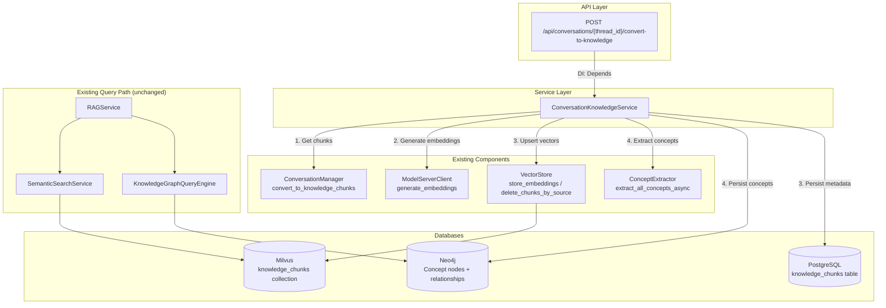
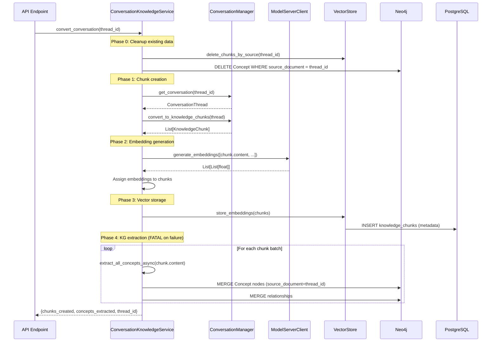

# Design Document: Conversation Knowledge Integration

## Overview

This design wires conversation-derived `KnowledgeChunk` objects through the same embedding → vector store → knowledge graph → unified search pipeline that document chunks already use. Today, `ConversationManager.convert_to_knowledge_chunks()` produces in-memory chunks with `source_type=SourceType.CONVERSATION`, but they are never persisted to Milvus, never extracted into Neo4j, and never surfaced by the RAG pipeline. This feature closes that gap.

The core addition is a new `ConversationKnowledgeService` that orchestrates the full pipeline:

1. Calls `ConversationManager.convert_to_knowledge_chunks()` to produce chunks
2. Generates embeddings via the model server (same model/dimensionality as documents)
3. Upserts chunks into the existing Milvus collection (same collection, `source_type=conversation`)
4. Extracts concepts and relationships into Neo4j (same `ConceptExtractor`, `source_document=thread_id`)
5. Cleans up existing data before re-ingestion to prevent duplicates

The pipeline is fail-fast: any stage failure aborts the entire operation and raises to the caller. No graceful degradation — KG failure is fatal per user convention.

A new FastAPI endpoint `POST /api/conversations/{thread_id}/convert-to-knowledge` triggers the pipeline, using the project's dependency injection patterns. The existing RAG pipeline, vector search, and KG query engine require no modifications — they already handle mixed source types.

## Architecture



### Pipeline Sequence



### Design Decisions

1. **Single service orchestrator**: `ConversationKnowledgeService` owns the full pipeline rather than distributing across existing services. This keeps the fail-fast semantics clean and avoids modifying `RAGService.process_document_for_knowledge_graph()` which has document-specific assumptions.

2. **Reuse VectorStore.store_embeddings()**: The existing method already handles `source_type` and `source_id` fields from `KnowledgeChunk`. No Milvus schema changes needed.

3. **Reuse ConceptExtractor**: The existing `extract_all_concepts_async()` (NER + regex + PMI) works on any text. We set `source_document=thread_id` on Concept nodes to enable per-conversation cleanup and cross-source relationship discovery.

4. **No Celery**: Unlike document processing which is triggered by file upload and runs in background, conversation conversion is a synchronous API call. The data volume per conversation is small (typically 5-50 chunks vs. hundreds for documents), so async task queuing adds complexity without benefit.

5. **Cleanup-before-reingest**: Rather than diffing old vs. new chunks, we delete all existing data for the thread_id and re-ingest from scratch. This is simpler and guarantees consistency.

6. **No RAG pipeline changes**: The existing `_retrieval_phase` in `RAGService` does not filter by `source_type` — Milvus returns all matching chunks regardless of source. The `KnowledgeGraphQueryEngine._find_related_concepts_neo4j` already returns `source_document` in results. No changes needed.

## Components and Interfaces

### ConversationKnowledgeService

New service at `src/multimodal_librarian/services/conversation_knowledge_service.py`.

```python
class ConversationKnowledgeService:
    """Orchestrates conversation → knowledge pipeline."""
    
    def __init__(
        self,
        conversation_manager: ConversationManager,
        vector_store: VectorStore,
        model_server_client: ModelServerClient,
        neo4j_client: Neo4jClient,
    ):
        self._conversation_manager = conversation_manager
        self._vector_store = vector_store
        self._model_client = model_server_client
        self._neo4j_client = neo4j_client
        self._concept_extractor = ConceptExtractor()

    async def convert_conversation(self, thread_id: str) -> ConversionResult:
        """Full pipeline: cleanup → chunk → embed → store → KG extract.
        
        Raises on any stage failure (fail-fast, no graceful degradation).
        """
        ...

    async def _cleanup_existing(self, thread_id: str) -> CleanupResult:
        """Remove existing vectors and KG nodes for thread_id."""
        ...

    async def _generate_embeddings(self, chunks: List[KnowledgeChunk]) -> List[KnowledgeChunk]:
        """Generate embeddings via model server, assign to chunks."""
        ...

    async def _store_vectors(self, chunks: List[KnowledgeChunk]) -> int:
        """Store chunks in Milvus via VectorStore.store_embeddings()."""
        ...

    async def _extract_and_store_concepts(
        self, chunks: List[KnowledgeChunk], thread_id: str
    ) -> int:
        """Extract concepts from chunks and persist to Neo4j."""
        ...

    async def _remove_kg_data(self, thread_id: str) -> int:
        """Delete Concept nodes and relationships for thread_id from Neo4j."""
        ...
```

### ConversionResult

```python
@dataclass
class ConversionResult:
    thread_id: str
    chunks_created: int
    concepts_extracted: int
    relationships_extracted: int
    chunks_cleaned: int  # from cleanup phase
    concepts_cleaned: int  # from cleanup phase
```

### CleanupResult

```python
@dataclass
class CleanupResult:
    vectors_deleted: int
    concepts_deleted: int
```

### API Endpoint

New router at `src/multimodal_librarian/api/routers/conversation_knowledge.py`.

```python
router = APIRouter(prefix="/api/conversations", tags=["conversation-knowledge"])

@router.post("/{thread_id}/convert-to-knowledge")
async def convert_conversation_to_knowledge(
    thread_id: str,
    service: ConversationKnowledgeService = Depends(get_conversation_knowledge_service),
) -> ConvertToKnowledgeResponse:
    ...
```

### Pydantic Response Model

```python
class ConvertToKnowledgeResponse(BaseModel):
    thread_id: str
    chunks_created: int
    concepts_extracted: int
    status: str = "success"
```

### DI Provider

New provider in `src/multimodal_librarian/api/dependencies/services.py`:

```python
async def get_conversation_knowledge_service(
    conversation_manager=Depends(get_conversation_manager),
    vector_store=Depends(get_vector_store),
    model_client=Depends(get_model_server_client),
    graph_client=Depends(get_graph_client),
) -> ConversationKnowledgeService:
    return ConversationKnowledgeService(
        conversation_manager=conversation_manager,
        vector_store=vector_store,
        model_server_client=model_client,
        neo4j_client=graph_client,
    )
```

### Citation Formatting

The existing `CitationTracker` already handles `SourceType.CONVERSATION` in `_format_inline_citations()` and `_format_bibliography_citations()`. The `location_reference` field on `KnowledgeChunk` is set to the first message timestamp by `convert_to_knowledge_chunks()`. For conversation citations, the `location_reference` will be formatted as `"{thread_title} | {start_timestamp} – {end_timestamp}"` to include both the thread title and the timestamp range of the cited message group.

This requires a small enhancement to `ConversationManager.convert_to_knowledge_chunks()` to include the timestamp range (first and last message in the group) in `location_reference`, and to populate `section` with the thread title (derived from the first user message or the DB `title` column).

## Data Models

### Existing Models (No Changes)

| Model | Location | Role |
|-------|----------|------|
| `KnowledgeChunk` | `models/core.py` | Chunk with `source_type`, `source_id`, `embedding`, `location_reference` |
| `SourceType` | `models/core.py` | Enum with `BOOK`, `CONVERSATION` |
| `KnowledgeCitation` | `models/core.py` | Citation with `source_type`, `source_title`, `location_reference` |
| `ConversationThread` | `models/core.py` | Thread with `thread_id`, `user_id`, `messages` |
| `ConceptNode` | `models/knowledge_graph.py` | KG concept with `source_document`, `source_chunks` |

### New Models

```python
# In services/conversation_knowledge_service.py

@dataclass
class ConversionResult:
    """Result of a conversation knowledge conversion pipeline run."""
    thread_id: str
    chunks_created: int
    concepts_extracted: int
    relationships_extracted: int
    chunks_cleaned: int
    concepts_cleaned: int

@dataclass
class CleanupResult:
    """Result of cleanup phase before re-ingestion."""
    vectors_deleted: int
    concepts_deleted: int
```

```python
# In api/routers/conversation_knowledge.py

class ConvertToKnowledgeResponse(BaseModel):
    """API response for conversation knowledge conversion."""
    thread_id: str
    chunks_created: int
    concepts_extracted: int
    status: str = "success"
```

### Database Interactions

**PostgreSQL** — `multimodal_librarian.knowledge_chunks` table already supports `source_type = 'conversation'` via the `source_type` enum. The `source_id` column references `conversation_threads.id`. No schema changes needed.

**Milvus** — Chunks are stored in the same collection as document chunks. The `source_type` metadata field distinguishes them. `VectorStore.store_embeddings()` and `VectorStore.delete_chunks_by_source()` already handle this.

**Neo4j** — Concept nodes use `source_document` property set to `thread_id` (UUID string). Cleanup query:
```cypher
MATCH (c:Concept {source_document: $thread_id})
DETACH DELETE c
RETURN count(c) AS deleted_count
```

### Embedding Specification

- Model: Same `sentence-transformers` model served by `librarian-model-server` container
- Dimensionality: Same as document embeddings (determined by model, typically 384 or 768)
- Input: `chunk.content` text only (multimedia metadata excluded per Requirement 2.3)
- Batch size: Up to 500 texts per model server request (matching existing pattern in `_update_knowledge_graph`)


## Correctness Properties

*A property is a characteristic or behavior that should hold true across all valid executions of a system — essentially, a formal statement about what the system should do. Properties serve as the bridge between human-readable specifications and machine-verifiable correctness guarantees.*

### Property 1: Pipeline produces embedded, stored chunks

*For any* valid `ConversationThread` with at least one message, calling `convert_conversation(thread_id)` should produce `KnowledgeChunk` objects where every chunk has a non-null embedding and all chunks are retrievable from the vector store by their chunk IDs.

**Validates: Requirements 1.1, 1.2, 1.3**

### Property 2: KG extraction produces concepts for all chunks

*For any* set of conversation chunks produced by the pipeline, the number of concept extraction calls should equal the number of chunks, and all persisted Concept nodes in Neo4j should have `source_document` equal to the conversation's `thread_id`.

**Validates: Requirements 1.4, 4.1, 4.2**

### Property 3: Embedding dimensionality matches document embeddings

*For any* conversation chunk embedding generated by the pipeline, its dimensionality (vector length) should be identical to the dimensionality of embeddings generated for document chunks by the same model server.

**Validates: Requirements 2.2**

### Property 4: Only text content is embedded

*For any* `KnowledgeChunk` with non-empty `associated_media`, the text passed to the embedding model should be exactly `chunk.content` and should not contain any serialized multimedia metadata.

**Validates: Requirements 2.3**

### Property 5: Stored chunks contain all required metadata fields

*For any* conversation chunk stored in the vector store, the stored record should contain: chunk ID, embedding vector, text content, `source_type` equal to `"conversation"`, `source_id` equal to the thread ID, and knowledge metadata.

**Validates: Requirements 3.2, 3.3**

### Property 6: Unified search returns both source types

*For any* semantic search query against the vector store, if both a document chunk and a conversation chunk are semantically relevant, both should appear in the search results without source-type filtering.

**Validates: Requirements 5.1**

### Property 7: KG traversal spans both source types

*For any* concept name query against the knowledge graph, the `KnowledgeGraphQueryEngine` should return related concepts from both document-sourced and conversation-sourced Concept nodes without filtering by `source_document`.

**Validates: Requirements 5.2**

### Property 8: Conversation citation location_reference format

*For any* `KnowledgeCitation` with `source_type=SourceType.CONVERSATION`, the `location_reference` field should contain both the conversation thread title and a timestamp range string.

**Validates: Requirements 6.2**

### Property 9: Citation filtering by source type

*For any* `CitationTracker` containing a mix of `BOOK` and `CONVERSATION` citations, calling `get_citations_by_source(SourceType.CONVERSATION)` should return exactly the citations with `source_type=SourceType.CONVERSATION`, and calling `get_citations_by_source(SourceType.BOOK)` should return exactly the citations with `source_type=SourceType.BOOK`.

**Validates: Requirements 6.1, 6.3**

### Property 10: API response contains required fields

*For any* successful call to `POST /api/conversations/{thread_id}/convert-to-knowledge`, the response body should contain `thread_id`, `chunks_created` (integer ≥ 0), `concepts_extracted` (integer ≥ 0), and `status` equal to `"success"`.

**Validates: Requirements 7.2**

### Property 11: Re-ingestion idempotence

*For any* conversation thread, calling `convert_conversation(thread_id)` twice should result in the same final state as calling it once: the vector store should contain exactly the chunks from the latest ingestion (no duplicates), and Neo4j should contain exactly the concepts from the latest extraction.

**Validates: Requirements 3.4, 8.1, 8.2**

## Error Handling

### Fail-Fast Pipeline

The pipeline is strictly fail-fast. Any stage failure aborts the entire operation:

| Stage | Failure Mode | Behavior |
|-------|-------------|----------|
| Chunk creation | `ConversationManager` raises | Propagate exception, return 500 |
| Embedding generation | Model server unreachable or returns wrong dimensions | Raise `EmbeddingError`, abort pipeline |
| Vector storage | Milvus insert fails | Raise `VectorStoreError`, abort pipeline |
| KG extraction | Neo4j unreachable or Cypher fails | Raise `KnowledgeGraphError`, abort pipeline |
| Cleanup (pre-reingest) | Delete fails | Raise error, abort before any new data is written |

### API Error Responses

| Condition | HTTP Status | Response Body |
|-----------|-------------|---------------|
| Thread not found | 404 | `{"detail": "Conversation thread {thread_id} not found"}` |
| Pipeline failure | 500 | `{"detail": "Ingestion failed at stage: {stage}", "error": "{message}"}` |
| Empty conversation (no messages) | 400 | `{"detail": "Conversation has no messages to convert"}` |

### Partial Failure Cleanup

If the pipeline fails after vector storage but before KG extraction completes, the already-stored vectors remain in Milvus. This is acceptable because:
1. Re-ingestion will clean them up on the next attempt (cleanup-before-reingest)
2. Orphaned vectors without KG concepts still participate in semantic search, which is useful
3. Adding rollback logic would significantly complicate the service for minimal benefit

## Testing Strategy

### Property-Based Testing

Library: **Hypothesis** (Python property-based testing framework)

Each correctness property maps to a single Hypothesis test with minimum 100 examples. Tests use `@given` decorators with custom strategies for generating:
- Random `ConversationThread` objects with varying message counts and content
- Random `KnowledgeChunk` lists with mixed source types
- Random `KnowledgeCitation` lists with mixed source types

Tag format: `# Feature: conversation-knowledge-integration, Property {N}: {title}`

Key property tests:
- **Property 1**: Generate random conversations → run pipeline with mocked dependencies → verify all chunks have embeddings and store_embeddings was called
- **Property 2**: Generate random chunk texts → run extraction → verify concept count > 0 and all concepts have correct source_document
- **Property 3**: Generate random texts → embed via model server → verify all vectors have same length
- **Property 4**: Generate chunks with random multimedia metadata → verify embedding input is text-only
- **Property 5**: Generate random chunks → store → verify all metadata fields present
- **Property 6**: Insert mixed-source chunks → search → verify both types returned
- **Property 9**: Generate mixed citations → filter → verify partition correctness
- **Property 11**: Run pipeline twice on same thread → verify no duplicates

### Unit Testing

Unit tests cover specific examples and edge cases:
- Empty conversation (0 messages) → 400 error
- Nonexistent thread_id → 404 error
- Single-message conversation → 1 chunk produced
- Embedding failure injection → pipeline aborts
- Vector store failure injection → pipeline aborts
- Neo4j failure injection → pipeline aborts
- Citation formatting for conversation source (specific format check)
- Cleanup deletes correct thread_id data only (not other threads)

### Integration Testing

- End-to-end test with Docker services (Milvus, Neo4j, PostgreSQL, model-server)
- Verify a conversation can be converted and then found via RAG search
- Verify re-ingestion produces clean state
- Verify conversation citations appear in RAG responses
