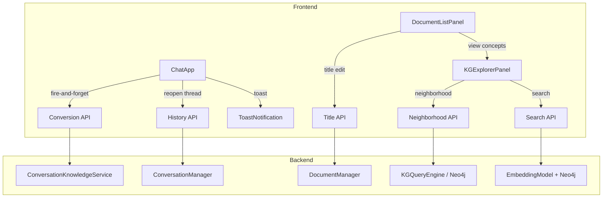
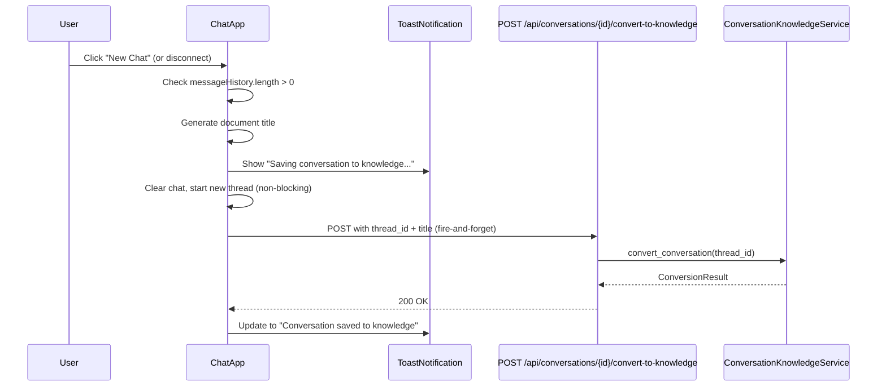
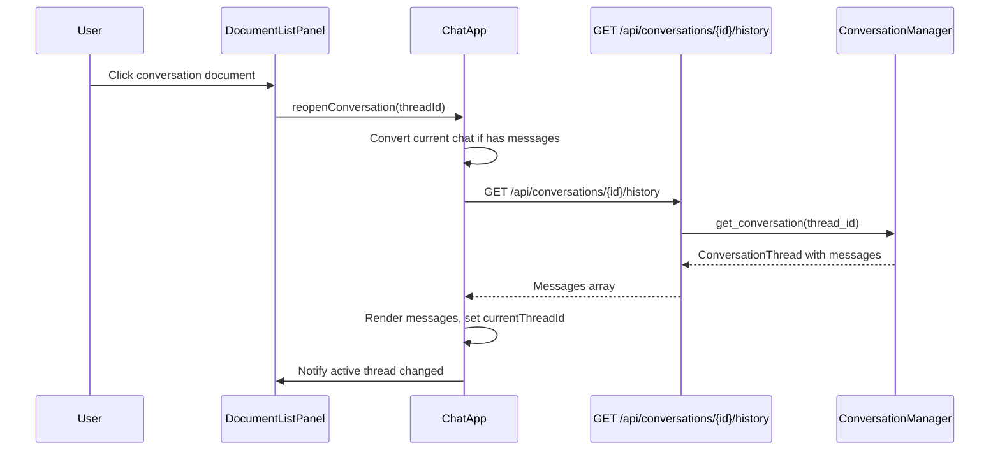
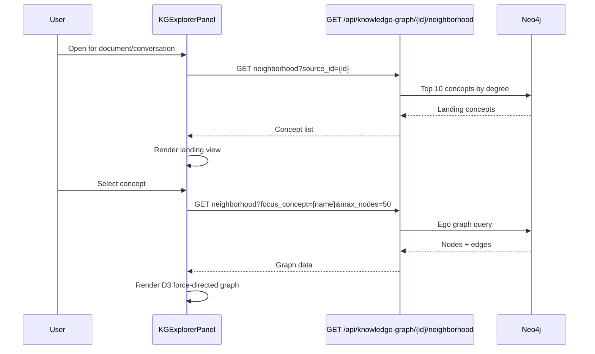

# Design Document: Conversation Knowledge UI

## Overview

This feature connects the existing `ConversationKnowledgeService` backend pipeline to the chat UI, adds lifecycle management for conversation knowledge documents, and introduces a Knowledge Graph (KG) Explorer for visual graph navigation. Today, the conversion endpoint exists but is never called from the frontend. `clearChat()` simply discards the thread. Knowledge Graph data extracted from documents and conversations is invisible to users.

The design covers three areas:

1. **Conversation Lifecycle** (Requirements 1–10): Modify `ChatApp.clearChat()` and the WebSocket disconnect handler to fire-and-forget the conversion API. Add toast notifications, document title generation, diary-style reopening, delete-state management, and inline title editing.

2. **Document List Integration** (Requirements 5, 7, 9): Extend `DocumentListPanel` to render conversation documents with a 💬 icon, disable delete for active conversations, support inline title editing, and add a "View Concepts" action.

3. **KG Explorer** (Requirements 11–15): A new `KGExplorerPanel` class using D3.js force-directed layout, rendering bounded ego-graphs (max 50 nodes), with neighborhood navigation, semantic search, cross-source color coding, and two new backend API endpoints.



## Architecture

### Component Interaction Flow

**Conversion on New Chat / Disconnect:**



**Conversation Reopening:**



**KG Explorer Navigation:**



### File Changes Summary

| File | Change Type | Description |
|------|-------------|-------------|
| `static/js/chat.js` | Modify | Add conversion triggers, toast system, reopen logic, active thread tracking |
| `static/js/document-list-panel.js` | Modify | Conversation doc rendering, delete state, title editing, "View Concepts" button |
| `static/js/kg-explorer-panel.js` | New | D3.js force-directed KG explorer with navigation, search, cross-source coloring |
| `static/js/toast-notification.js` | New | Lightweight toast notification system |
| `static/css/chat.css` | Modify | Styles for toast, KG explorer, conversation doc items, disabled delete |
| `api/routers/conversation_knowledge.py` | Modify | Add title parameter to convert endpoint |
| `api/routers/knowledge_graph.py` | New | Neighborhood and search endpoints |
| `api/routers/conversations.py` | New | History and title update endpoints |
| `components/knowledge_graph/kg_query_engine.py` | Modify | Add `get_neighborhood()` and `search_concepts()` methods |
| `api/dependencies/services.py` | Modify | Add DI providers for new endpoints |

## Components and Interfaces

### 1. ToastNotification (New — `static/js/toast-notification.js`)

A minimal, self-contained toast notification system. No external dependencies.

```javascript
class ToastNotification {
    constructor() {
        this.container = null;  // Lazily created DOM container
    }

    /**
     * Show a toast notification.
     * @param {Object} options
     * @param {string} options.id - Unique ID for updating this toast
     * @param {string} options.message - Display text
     * @param {'loading'|'success'|'error'} options.type - Visual style
     * @param {number|null} options.autoDismissMs - Auto-dismiss delay (null = manual)
     * @returns {string} Toast ID
     */
    show({ id, message, type = 'info', autoDismissMs = null }) { ... }

    /**
     * Update an existing toast by ID.
     * @param {string} id - Toast ID to update
     * @param {Object} updates - New message, type, autoDismissMs
     */
    update(id, { message, type, autoDismissMs }) { ... }

    /**
     * Dismiss a toast by ID.
     * @param {string} id - Toast ID
     */
    dismiss(id) { ... }
}
```

Toast DOM structure: fixed-position container at top-right, each toast is a `div.toast.toast--{type}` with a close button. Success auto-dismisses after 5 seconds. Errors persist until manually dismissed.

### 2. ChatApp Modifications (`static/js/chat.js`)

#### New Properties

```javascript
constructor() {
    // ... existing properties ...
    this.activeThreadId = null;       // Thread currently open (for delete-disable)
    this.toast = new ToastNotification();
}
```

#### Modified: `clearChat()`

```javascript
clearChat() {
    // Convert current conversation if it has messages
    if (this.messageHistory.length > 0 && this.currentThreadId) {
        this._convertCurrentConversation();
    }

    // Existing clear logic (unchanged)
    const messages = this.chatMessages.querySelectorAll('.message:not(.welcome-message .message)');
    messages.forEach(message => message.remove());
    this.messageHistory = [];
    this.currentThreadId = null;
    this.activeThreadId = null;
    this.updateSendButton();

    if (this.wsManager.isConnected()) {
        this.startNewConversation();
    }
    this.addSystemMessage('Started a new conversation');

    // Notify document list panel that active thread changed
    this._notifyActiveThreadChanged(null);
}
```

#### New: `_convertCurrentConversation()`

Fire-and-forget conversion with toast feedback.

```javascript
async _convertCurrentConversation() {
    const threadId = this.currentThreadId;
    const title = this._generateDocumentTitle();
    const toastId = `convert-${threadId}`;

    this.toast.show({
        id: toastId,
        message: `Saving conversation to knowledge... "${title}"`,
        type: 'loading'
    });

    try {
        const response = await fetch(
            `/api/conversations/${threadId}/convert-to-knowledge`,
            {
                method: 'POST',
                headers: { 'Content-Type': 'application/json' },
                body: JSON.stringify({ title })
            }
        );
        if (!response.ok) throw new Error(await response.text());

        this.toast.update(toastId, {
            message: `Conversation saved to knowledge: "${title}"`,
            type: 'success',
            autoDismissMs: 5000
        });
    } catch (err) {
        console.error('Conversion failed:', err);
        this.toast.update(toastId, {
            message: `Failed to save conversation: ${err.message}`,
            type: 'error',
            autoDismissMs: null  // Persist until dismissed
        });
    }
}
```

#### New: `_generateDocumentTitle()`

```javascript
_generateDocumentTitle() {
    const firstUserMsg = this.messageHistory.find(m => m.type === 'user');
    const date = new Date().toLocaleDateString('en-US', {
        month: 'short', day: 'numeric', year: 'numeric'
    });
    if (!firstUserMsg) return `Conversation: (untitled) (${date})`;

    let content = firstUserMsg.content;
    if (content.length > 80) content = content.substring(0, 80) + '…';
    return `Conversation: ${content} (${date})`;
}
```

#### Modified: WebSocket `disconnected` handler

```javascript
this.wsManager.on('disconnected', () => {
    console.log('Chat disconnected from server');
    if (this.messageHistory.length > 0 && this.currentThreadId) {
        this._convertCurrentConversation();
    }
});
```

#### New: `reopenConversation(threadId)`

```javascript
async reopenConversation(threadId) {
    // Save current conversation first if it has messages
    if (this.messageHistory.length > 0 && this.currentThreadId
        && this.currentThreadId !== threadId) {
        await this._convertCurrentConversation();
    }

    // Clear current chat UI
    const messages = this.chatMessages.querySelectorAll('.message:not(.welcome-message .message)');
    messages.forEach(msg => msg.remove());
    this.messageHistory = [];

    // Load conversation history from server
    try {
        const response = await fetch(`/api/conversations/${threadId}/history`);
        if (!response.ok) throw new Error('Failed to load conversation');
        const data = await response.json();

        // Render messages
        data.messages.forEach(msg => {
            if (msg.role === 'user') this.addUserMessage(msg.content);
            else this.addSystemMessage(msg.content);
        });

        // Set thread as active
        this.currentThreadId = threadId;
        this.activeThreadId = threadId;
        this._notifyActiveThreadChanged(threadId);

        // Tell server to resume this thread
        this.wsManager.send({
            type: 'resume_conversation',
            thread_id: threadId
        });
    } catch (err) {
        this.addSystemMessage(`Error loading conversation: ${err.message}`, 'error');
    }
}
```

#### New: `_notifyActiveThreadChanged(threadId)`

Dispatches a custom DOM event so `DocumentListPanel` can update delete button state.

```javascript
_notifyActiveThreadChanged(threadId) {
    document.dispatchEvent(new CustomEvent('active-thread-changed', {
        detail: { threadId }
    }));
}
```

### 3. DocumentListPanel Modifications (`static/js/document-list-panel.js`)

#### Modified: `createDocumentItem(doc)`

Detect conversation documents by `source_type === 'conversation'` and render with 💬 icon, editable title, and "View Concepts" button.

```javascript
createDocumentItem(doc) {
    const isConversation = doc.source_type === 'conversation';
    const icon = isConversation ? '💬' : '📄';
    // ... existing layout with icon replaced ...
    // Title: if conversation, render as editable span (no download link)
    // Add "View Concepts" button in action buttons if concept_count > 0
}
```

#### Modified: `getActionButtons(doc)`

Add "View Concepts" button and disable delete for active conversations.

```javascript
getActionButtons(doc) {
    let buttons = '';
    const isConversation = doc.source_type === 'conversation';

    // View Concepts button (for any completed doc with concepts)
    if (doc.status === 'completed' && doc.concept_count > 0) {
        buttons += `<button class="document-action-btn concepts-btn"
            data-action="view-concepts" data-document-id="${doc.document_id}"
            title="View Concepts">🔍</button>`;
    }

    // Retry button (unchanged)
    // ...

    // Delete button — disabled if this conversation is active
    const isActive = isConversation && this._activeThreadId === doc.thread_id;
    buttons += `<button class="document-action-btn delete-btn"
        data-action="delete" data-document-id="${doc.document_id}"
        ${isActive ? 'disabled' : ''}
        title="${isActive ? 'Cannot delete while conversation is active' : 'Delete document'}"
        >...</button>`;

    return buttons;
}
```

#### New: Active thread tracking

```javascript
constructor(wsManager) {
    // ... existing ...
    this._activeThreadId = null;

    document.addEventListener('active-thread-changed', (e) => {
        this._activeThreadId = e.detail.threadId;
        this._updateDeleteButtonStates();
    });
}

_updateDeleteButtonStates() {
    // Re-evaluate disabled state on all conversation doc delete buttons
}
```

#### New: Inline title editing

When user clicks a conversation document title, switch to an `<input>` element. On Enter or blur, send `PATCH /api/conversations/{thread_id}/title`. On Escape, revert.

```javascript
_startTitleEdit(titleElement, doc) {
    const input = document.createElement('input');
    input.type = 'text';
    input.className = 'document-title-edit';
    input.value = doc.title;
    // ... keydown (Enter → save, Escape → revert), blur → save ...
}

async _saveTitleEdit(threadId, newTitle, titleElement, originalTitle) {
    if (!newTitle.trim()) {
        // Revert and show validation message
        return;
    }
    const response = await fetch(`/api/conversations/${threadId}/title`, {
        method: 'PATCH',
        headers: { 'Content-Type': 'application/json' },
        body: JSON.stringify({ title: newTitle })
    });
    // Update DOM on success, revert on failure
}
```

### 4. KGExplorerPanel (New — `static/js/kg-explorer-panel.js`)

A panel that renders a D3.js force-directed graph for exploring the knowledge graph.

```javascript
class KGExplorerPanel {
    constructor() {
        this.panel = null;           // DOM element
        this.simulation = null;      // D3 force simulation
        this.focusNode = null;       // Current focus concept name
        this.sourceId = null;        // Source document/conversation ID
        this.navigationHistory = []; // Stack of previous focus nodes
        this.maxNodes = 50;          // Browser performance cap
    }

    /**
     * Open the explorer for a given knowledge source.
     * Fetches landing view (top 10 concepts by degree).
     */
    async open(sourceId) { ... }

    /**
     * Navigate to a concept's neighborhood.
     * Fetches ego graph from API, renders with D3.
     */
    async navigateTo(conceptName) { ... }

    /**
     * Go back to previous focus node.
     */
    navigateBack() { ... }

    /**
     * Search concepts by natural language query.
     */
    async search(query) { ... }

    /**
     * Render the D3 force-directed graph.
     * Nodes: labeled circles, color-coded by source_type.
     * Edges: labeled directed lines.
     */
    _renderGraph(nodes, edges) { ... }

    /**
     * Transition between graph states.
     * Retained nodes stay in place, exiting nodes fade out,
     * entering nodes fade in.
     */
    _transitionGraph(newNodes, newEdges) { ... }

    /**
     * Show concept detail panel on focus-node click.
     */
    _showConceptDetail(concept) { ... }

    /** Close the explorer panel. */
    close() { ... }
}
```

**Color Coding:**
- Document-sourced concepts: `#4A90D9` (blue)
- Conversation-sourced concepts: `#50C878` (green)
- Focus node: highlighted ring

**D3 Force Layout Configuration:**
- `forceLink`: distance 80, strength 0.5
- `forceManyBody`: strength -200 (repulsion)
- `forceCenter`: center of viewport
- `forceCollide`: radius 30 (prevent overlap)

**Landing View:** A simple list of top 10 concepts with degree counts. User clicks one to set it as focus and render the neighborhood.

**Search:** Input field at top of panel. On submit, calls `GET /api/knowledge-graph/search?query={text}&source_id={id}`. Results shown as a dropdown list. Selecting a result navigates to that concept.

### 5. Backend API Additions

#### 5a. Conversation History Endpoint (`api/routers/conversations.py` — New)

```python
router = APIRouter(prefix="/api/conversations", tags=["conversations"])

@router.get("/{thread_id}/history")
async def get_conversation_history(
    thread_id: str,
    conversation_manager=Depends(get_conversation_manager),
) -> ConversationHistoryResponse:
    """Load full conversation messages for reopening in chat UI."""
    ...
```

#### 5b. Title Update Endpoint (`api/routers/conversations.py`)

```python
@router.patch("/{thread_id}/title")
async def update_conversation_title(
    thread_id: str,
    body: TitleUpdateRequest,
    conversation_manager=Depends(get_conversation_manager),
) -> TitleUpdateResponse:
    """Update the title of a conversation knowledge document."""
    ...
```

#### 5c. Modify Convert Endpoint (`api/routers/conversation_knowledge.py`)

Add optional `title` field to the request body so the frontend can pass the auto-generated title.

```python
class ConvertToKnowledgeRequest(BaseModel):
    title: Optional[str] = None

@router.post("/{thread_id}/convert-to-knowledge")
async def convert_conversation_to_knowledge(
    thread_id: str,
    body: ConvertToKnowledgeRequest = ConvertToKnowledgeRequest(),
    service=Depends(get_conversation_knowledge_service),
) -> ConvertToKnowledgeResponse:
    ...
```

#### 5d. KG Neighborhood Endpoint (`api/routers/knowledge_graph.py` — New)

```python
router = APIRouter(prefix="/api/knowledge-graph", tags=["knowledge-graph"])

@router.get("/{source_id}/neighborhood")
async def get_neighborhood(
    source_id: str,
    focus_concept: Optional[str] = None,
    max_nodes: int = Query(default=50, le=100),
    kg_query_engine=Depends(get_kg_query_engine),
) -> NeighborhoodResponse:
    """
    If focus_concept is None, return top 10 concepts by degree (landing view).
    Otherwise, return the ego graph around focus_concept, capped at max_nodes.
    """
    ...
```

#### 5e. KG Search Endpoint (`api/routers/knowledge_graph.py`)

```python
@router.get("/search")
async def search_concepts(
    query: str,
    source_id: Optional[str] = None,
    kg_query_engine=Depends(get_kg_query_engine),
    model_server_client=Depends(get_model_server_client),
) -> ConceptSearchResponse:
    """
    Embed the query, compare against concept name embeddings in Neo4j,
    return top 10 matches with similarity scores.
    """
    ...
```

#### 5f. KGQueryEngine Additions (`components/knowledge_graph/kg_query_engine.py`)

Two new methods:

```python
async def get_neighborhood(
    self, source_id: str, focus_concept: Optional[str],
    max_nodes: int = 50
) -> Dict[str, Any]:
    """
    If focus_concept is None: return top 10 concepts by degree for source_id.
    Otherwise: return ego graph (nodes + edges) around focus_concept,
    including cross-source nodes, capped at max_nodes.
    """
    ...

async def search_concepts_by_embedding(
    self, query_embedding: List[float],
    source_id: Optional[str] = None, limit: int = 10
) -> List[Dict[str, Any]]:
    """
    Find concepts whose name embeddings are most similar to query_embedding.
    Optionally filter by source_id. Returns concept name, source_document,
    similarity score, and degree.
    """
    ...
```

**Cypher for landing view (top 10 by degree):**

```cypher
MATCH (c:Concept {source_document: $source_id})-[r]-()
WITH c, count(r) as degree
ORDER BY degree DESC
LIMIT 10
RETURN c.name as name, c.source_document as source_document, degree
```

**Cypher for ego graph:**

```cypher
MATCH (focus:Concept)
WHERE toLower(focus.name) = toLower($focus_concept)
  AND focus.source_document = $source_id
WITH focus LIMIT 1
CALL {
    WITH focus
    MATCH (focus)-[r]-(neighbor:Concept)
    RETURN neighbor, r
    ORDER BY neighbor.name
    LIMIT $max_nodes
}
WITH focus, collect(DISTINCT neighbor) as neighbors, collect(r) as rels
UNWIND neighbors as n
OPTIONAL MATCH (n)-[r2]-(other)
WHERE other = focus OR other IN neighbors
RETURN
    [focus] + neighbors as nodes,
    collect(DISTINCT r2) + rels as edges
```

## Data Models

### API Request/Response Models

```python
# --- Conversation History ---

class ConversationMessageResponse(BaseModel):
    role: str          # "user" or "assistant"
    content: str
    timestamp: str     # ISO 8601

class ConversationHistoryResponse(BaseModel):
    thread_id: str
    messages: List[ConversationMessageResponse]
    title: Optional[str] = None

# --- Title Update ---

class TitleUpdateRequest(BaseModel):
    title: str = Field(..., min_length=1, max_length=200)

class TitleUpdateResponse(BaseModel):
    thread_id: str
    title: str
    status: str = "updated"

# --- Convert Request (modified) ---

class ConvertToKnowledgeRequest(BaseModel):
    title: Optional[str] = None

# --- KG Neighborhood ---

class GraphNode(BaseModel):
    name: str
    source_document: str
    source_type: str       # "document" or "conversation"
    degree: int

class GraphEdge(BaseModel):
    source: str            # Source concept name
    target: str            # Target concept name
    relationship_type: str

class NeighborhoodResponse(BaseModel):
    focus_concept: Optional[str] = None
    nodes: List[GraphNode]
    edges: List[GraphEdge]
    is_landing: bool = False  # True when returning top-10 list

# --- KG Search ---

class ConceptMatch(BaseModel):
    name: str
    source_document: str
    similarity_score: float
    degree: int

class ConceptSearchResponse(BaseModel):
    query: str
    matches: List[ConceptMatch]
```

### Document List Item Extension

The existing document list response already includes `source_type` from the `knowledge_sources` table. Conversation documents will have `source_type = 'conversation'` and an additional `thread_id` field. The `DocumentListPanel` uses this to determine icon, editability, and click behavior.

```python
# Extended fields in document list response for conversation docs:
class DocumentListItem(BaseModel):
    document_id: str
    title: str
    filename: Optional[str] = None
    source_type: str           # "pdf", "conversation", etc.
    thread_id: Optional[str] = None  # Only for conversation docs
    status: str
    upload_timestamp: str
    chunk_count: Optional[int] = None
    concept_count: Optional[int] = None
    relationship_count: Optional[int] = None
    file_size: Optional[int] = None
```


## Correctness Properties

*A property is a characteristic or behavior that should hold true across all valid executions of a system — essentially, a formal statement about what the system should do. Properties serve as the bridge between human-readable specifications and machine-verifiable correctness guarantees.*

### Property 1: Conversion triggered if and only if conversation has messages

*For any* conversation state and any lifecycle trigger event (New Chat click, WebSocket disconnect, or reopen of a different conversation), the Conversion API is called if and only if the current conversation has one or more messages. If the conversation has zero messages, no conversion call is made.

**Validates: Requirements 1.1, 1.6, 2.1, 2.2, 6.4, 6.5**

### Property 2: Chat clears immediately without blocking on conversion

*For any* conversation with messages, when clearChat() is invoked, the chat message list is empty and a new thread is started before the conversion API response returns. The conversion runs asynchronously and does not block the UI thread.

**Validates: Requirements 1.2**

### Property 3: Title generation format

*For any* message history (including empty, single-message, and multi-message histories) and any date, `_generateDocumentTitle()` produces a string matching the pattern `"Conversation: {content} ({Mon D, YYYY})"` where: if no user messages exist, content is `(untitled)`; if the first user message is ≤ 80 characters, content is the full message; if > 80 characters, content is the first 80 characters followed by an ellipsis character `…`.

**Validates: Requirements 3.1, 3.2, 3.3**

### Property 4: Stable document identity across re-conversions

*For any* thread_id, converting the same conversation N times (N ≥ 1) always results in exactly one Conversation_Knowledge_Document with the same document_id. The document is updated in place, never duplicated.

**Validates: Requirements 4.1, 4.2, 4.3**

### Property 5: Conversation document rendering contains required information

*For any* document with `source_type === 'conversation'`, the rendered document item in DocumentListPanel contains the 💬 icon, the document title, the creation date, and the chunk count. Documents with `source_type !== 'conversation'` use the 📄 icon.

**Validates: Requirements 5.2, 5.3**

### Property 6: Reopened conversation restores all messages and sets correct thread ID

*For any* conversation with N messages, reopening it via `reopenConversation(threadId)` results in exactly N messages rendered in the chat view, and `currentThreadId` equals the reopened thread's ID.

**Validates: Requirements 6.1, 6.2**

### Property 7: Delete button disabled if and only if conversation is active

*For any* conversation document in the DocumentListPanel, the delete button is disabled if and only if that document's thread_id equals the currently active thread in ChatApp. When the active thread changes to null or a different thread, the button is re-enabled.

**Validates: Requirements 7.1, 7.4**

### Property 8: Deletion removes search data but preserves conversation messages

*For any* deleted Conversation_Knowledge_Document, after deletion: (a) querying Milvus for chunks with that document's source_id returns zero results, (b) querying Neo4j for concepts with that source_document returns zero results, and (c) querying PostgreSQL for conversation messages with that thread_id returns the original messages unchanged.

**Validates: Requirements 8.1, 8.2, 8.3**

### Property 9: Title edit round-trip persistence

*For any* valid (non-empty) title string, editing a conversation document's title via the PATCH endpoint and then reloading the document list returns the updated title. For any empty or whitespace-only title, the edit is rejected and the previous title is preserved.

**Validates: Requirements 9.2, 9.4**

### Property 10: Toast auto-dismiss timing

*For any* toast notification, success-type toasts auto-dismiss after 5 seconds, and error-type toasts remain visible until manually dismissed by the user.

**Validates: Requirements 10.4**

### Property 11: Landing view returns at most 10 concepts ordered by degree

*For any* source_id with concepts in Neo4j, the neighborhood endpoint with no focus_concept returns at most 10 concepts, and they are ordered by degree descending.

**Validates: Requirements 11.2**

### Property 12: Neighborhood response respects max node cap

*For any* neighborhood API call with max_nodes parameter M, the response contains at most M nodes. The default is 50.

**Validates: Requirements 11.4, 15.1**

### Property 13: Navigation history stack preserves traversal order

*For any* sequence of K navigations in the KG Explorer, the navigation history stack contains exactly K-1 entries (all previous focus nodes in order), and navigating back restores the previous focus node.

**Validates: Requirements 12.4**

### Property 14: Neighborhood transition retains shared nodes

*For any* two consecutive neighborhood renders (before and after a focus shift), nodes present in both neighborhoods are retained in the DOM (not removed and re-added). Nodes only in the old neighborhood are removed; nodes only in the new neighborhood are added.

**Validates: Requirements 12.1, 12.2, 14.4**

### Property 15: Search returns semantically ranked concepts

*For any* search query that produces results, the returned concepts are ordered by descending similarity score, the highest-scoring concept becomes the focus node, and the result count is at most 10.

**Validates: Requirements 13.2, 13.3, 15.4**

### Property 16: Cross-source neighborhood inclusion

*For any* focus concept that has relationships to concepts from other knowledge sources, the neighborhood response includes those cross-source concepts with their correct source_type and source_document fields.

**Validates: Requirements 14.1**

### Property 17: Node color coding by source type

*For any* rendered concept node, the color assigned is determined solely by its source_type field: document-sourced concepts get one color and conversation-sourced concepts get a different color. The source document name is displayed as a subtitle.

**Validates: Requirements 14.2, 14.3**

### Property 18: Neighborhood API response schema

*For any* valid call to `GET /api/knowledge-graph/{source_id}/neighborhood`, the response contains a `nodes` array (each with `name`, `source_document`, `source_type`, `degree`) and an `edges` array (each with `source`, `target`, `relationship_type`).

**Validates: Requirements 15.1, 15.3**

### Property 19: Search API scope respects source_id parameter

*For any* call to `GET /api/knowledge-graph/search`, if `source_id` is provided, all returned concepts have `source_document` matching that source_id. If `source_id` is omitted, results may come from any knowledge source.

**Validates: Requirements 15.2, 15.5**

### Property 20: View Concepts button presence

*For any* completed knowledge source (document or conversation) with `concept_count > 0`, the DocumentListPanel renders a "View Concepts" action button. Sources with zero concepts or non-completed status do not show this button.

**Validates: Requirements 11.1**

## Error Handling

### Conversion Errors

| Error Scenario | Handling |
|---|---|
| Conversion API returns 404 (thread not found) | Toast shows error "Failed to save conversation: thread not found". Logged to console. Chat continues normally. |
| Conversion API returns 400 (no messages) | No toast shown — this case is prevented by the `messageHistory.length > 0` guard in the frontend. |
| Conversion API returns 500 (pipeline failure) | Toast shows error with stage info. Error persists until dismissed. Logged to console. |
| Network error during conversion (fetch fails) | Toast shows "Failed to save conversation: network error". Logged. Chat continues. |
| Conversion on disconnect when server is unreachable | `fetch()` will fail. Error logged via `console.error()`. No toast (user may have navigated away). |

### Conversation Reopening Errors

| Error Scenario | Handling |
|---|---|
| History API returns 404 (thread not found) | System message "Error loading conversation: not found" displayed in chat. |
| History API returns 500 | System message with error details. Chat remains on current state. |
| Network error during history fetch | System message "Error loading conversation: network error". |

### Title Editing Errors

| Error Scenario | Handling |
|---|---|
| PATCH title returns 404 | Title reverts to previous value. Brief error shown near the title element. |
| PATCH title returns 400 (validation) | Title reverts. Validation message shown. |
| Empty title submitted | Prevented client-side — reverts immediately without API call. |

### KG Explorer Errors

| Error Scenario | Handling |
|---|---|
| Neighborhood API returns 404 (source not found) | Explorer shows "No concepts found for this source". |
| Neighborhood API returns 500 | Explorer shows "Error loading graph data" with retry button. |
| Search API returns no results | Message "No matching concepts found". Current view retained. |
| D3.js fails to load | Explorer shows "Graph visualization unavailable" fallback message. |
| Neo4j unavailable (graph_client is None) | API returns 503. Explorer shows "Knowledge graph service unavailable". |

### Graceful Degradation

All new API endpoints follow the project's DI pattern with optional dependencies:

```python
@router.get("/{source_id}/neighborhood")
async def get_neighborhood(
    source_id: str,
    focus_concept: Optional[str] = None,
    max_nodes: int = Query(default=50, le=100),
    graph_client=Depends(get_graph_client_optional),
):
    if graph_client is None:
        raise HTTPException(status_code=503, detail="Knowledge graph service unavailable")
    ...
```

The frontend handles all error responses with user-friendly messages and never leaves the UI in a broken state.

## Testing Strategy

### Property-Based Testing

Property-based tests use **Hypothesis** (Python) for backend properties and **fast-check** (JavaScript) for frontend properties. Each property test runs a minimum of 100 iterations.

#### Backend Property Tests

| Property | Test Description | Library |
|---|---|---|
| Property 3: Title generation | Generate random strings of varying lengths (0–500 chars), random dates. Verify format, truncation at 80 chars, ellipsis, untitled fallback. | Hypothesis |
| Property 4: Stable document identity | Generate random thread_ids, convert N times (N=1..5). Assert document_id is constant. | Hypothesis |
| Property 8: Deletion semantics | Generate random conversation data, convert, delete. Assert Milvus empty, Neo4j empty, PostgreSQL preserved. | Hypothesis |
| Property 9: Title edit round-trip | Generate random valid titles (non-empty strings). PATCH then GET. Assert equality. Generate empty/whitespace titles. Assert rejection. | Hypothesis |
| Property 11: Landing view ordering | Generate random concept sets with varying degrees. Assert top 10 by degree, descending order. | Hypothesis |
| Property 12: Max node cap | Generate random graphs of varying sizes (1–200 nodes). Query with max_nodes=50. Assert response ≤ 50 nodes. | Hypothesis |
| Property 15: Search ranking | Generate random concept embeddings and query embeddings. Assert results ordered by descending similarity, count ≤ 10. | Hypothesis |
| Property 18: Response schema | Generate random neighborhood responses. Validate against Pydantic model. Assert all required fields present. | Hypothesis |
| Property 19: Search scope | Generate random concepts across multiple sources. Search with and without source_id. Assert filtering correctness. | Hypothesis |

#### Frontend Property Tests

| Property | Test Description | Library |
|---|---|---|
| Property 1: Conversion trigger | Generate random messageHistory arrays (empty and non-empty). Assert conversion called iff non-empty. | fast-check |
| Property 3: Title generation | Generate random strings and dates. Verify _generateDocumentTitle() output format. | fast-check |
| Property 5: Icon rendering | Generate random doc objects with varying source_type. Assert correct icon. | fast-check |
| Property 7: Delete button state | Generate random activeThreadId and document thread_id pairs. Assert disabled iff equal. | fast-check |
| Property 10: Toast timing | Generate random toast types. Assert autoDismissMs=5000 for success, null for error. | fast-check |
| Property 13: Navigation history | Generate random sequences of navigateTo() calls. Assert history stack length and order. | fast-check |

### Unit Tests

Unit tests cover specific examples, edge cases, and integration points:

- **Toast notification lifecycle**: Show → update → dismiss sequence
- **Title editing**: Click to edit, Enter to save, Escape to cancel, empty rejection
- **Conversation reopening**: Load history, render messages, set thread ID
- **Delete button tooltip**: Verify tooltip text when disabled
- **KG Explorer landing view**: Open with source_id, verify top-10 list rendered
- **KG Explorer detail panel**: Click focus node, verify detail panel content
- **Search empty results**: Submit query with no matches, verify "No matching concepts found"
- **Cross-source color coding**: Verify document=blue, conversation=green
- **API error responses**: 404, 400, 500 for each endpoint
- **Conversion on disconnect**: Verify fetch called, error logged on failure

### Integration Tests

- **End-to-end conversion flow**: New Chat → conversion API → document appears in list → reopen → extend → convert again → same document_id
- **Delete flow**: Convert → delete → verify Milvus/Neo4j empty, PostgreSQL preserved
- **KG Explorer navigation**: Open → landing → select concept → navigate → back → verify state
- **Search → navigate flow**: Search query → select result → neighborhood renders

### Test Configuration

```python
# Backend: pytest + hypothesis
# conftest.py
from hypothesis import settings

settings.register_profile("ci", max_examples=200)
settings.register_profile("dev", max_examples=100)
settings.load_profile("dev")
```

```javascript
// Frontend: vitest + fast-check
// Each property test tagged with design reference
// Example:
// Feature: conversation-knowledge-ui, Property 1: Conversion triggered iff conversation has messages
```

Each property-based test MUST be tagged with a comment referencing the design property:
- Format: `Feature: conversation-knowledge-ui, Property {number}: {property_text}`
- Each correctness property is implemented by a single property-based test
- Minimum 100 iterations per property test
