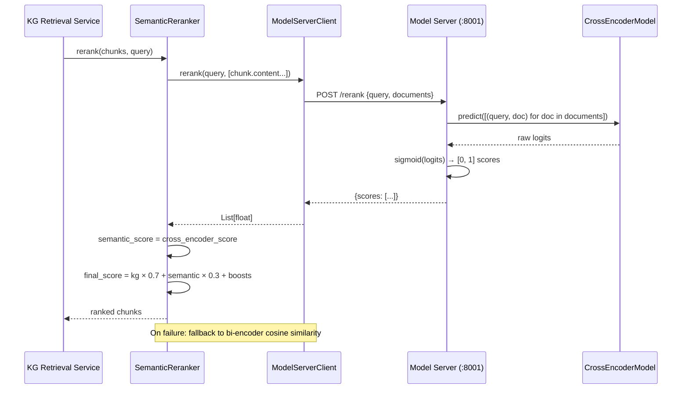
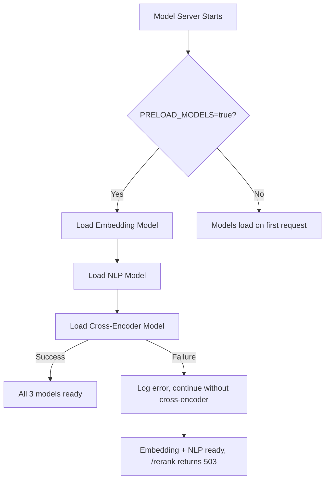

# Design Document: Cross-Encoder Reranking

## Overview

This feature replaces the bi-encoder cosine similarity score in the `SemanticReranker` with a cross-encoder relevance score from `cross-encoder/ms-marco-MiniLM-L-6-v2`. The cross-encoder model is hosted on the existing model-server container and exposed via a new `/rerank` POST endpoint. The app container's `ModelServerClient` gains a `rerank()` method, and the `SemanticReranker` uses it to compute `semantic_score` per chunk. When the cross-encoder is unavailable, the reranker falls back to the existing bi-encoder cosine similarity path.

The cross-encoder processes query-document pairs jointly through a single transformer forward pass, enabling cross-attention between query and document tokens. This directly addresses the weakness of bi-encoder cosine similarity, where independent embeddings miss token-level interactions — causing proper nouns like "Chelsea" to rank below generic concept matches.

### Key Design Decisions

1. **Sigmoid normalization on the server side**: Raw cross-encoder logits are normalized to [0, 1] via sigmoid on the model server, keeping the client and reranker simple.
2. **Single batch call per reranking invocation**: All query-document pairs are sent in one HTTP request to minimize round-trip overhead. With 6–50 chunks typical, this stays well within reasonable payload sizes.
3. **No circuit breaker**: Each reranking invocation independently attempts the cross-encoder path. This avoids complexity and ensures recovery is immediate when the model server comes back.
4. **Bi-encoder fallback preserves existing behavior**: On cross-encoder failure, the reranker falls through to the existing cosine similarity code path with identical weights, so search quality degrades gracefully rather than failing.

## Architecture



### Model Server Startup Flow



## Components and Interfaces

### 1. CrossEncoderModel (`src/model_server/models/cross_encoder.py`)

New model wrapper following the same pattern as `EmbeddingModel`. Manages loading and inference for the cross-encoder.

```python
class CrossEncoderModel:
    def __init__(self, model_name: str, device: str, cache_dir: Optional[str])
    def load(self) -> bool
    def predict(self, query: str, documents: List[str]) -> List[float]
    # Returns sigmoid-normalized scores in [0, 1]
    def get_status(self) -> dict
    @property
    def is_loaded(self) -> bool
```

- Uses `sentence_transformers.CrossEncoder` under the hood
- `predict()` constructs `[(query, doc)]` pairs, calls `model.predict()`, applies `scipy.special.expit` (sigmoid) to raw logits
- Thread-safe: `CrossEncoder.predict()` is stateless inference

### 2. Rerank API Endpoint (`src/model_server/api/rerank.py`)

New FastAPI router following the `embeddings.py` pattern.

```python
# Request
class RerankRequest(BaseModel):
    query: str          # Non-empty query string
    documents: List[str]  # Document texts to score

# Response
class RerankResponse(BaseModel):
    scores: List[float]         # Sigmoid-normalized scores [0, 1], same order as documents
    model: str                  # Model name used
    count: int                  # Number of scores
    processing_time_ms: float   # Inference time
```

- `POST /rerank` — validates query is non-empty (422 on empty), returns 503 if model not loaded
- Empty documents list returns empty scores list (not an error)

### 3. ModelServerClient.rerank() (`src/multimodal_librarian/clients/model_server_client.py`)

New async method on the existing client class.

```python
async def rerank(self, query: str, documents: List[str]) -> List[float]:
    """Score query-document pairs via cross-encoder.
    
    Raises ModelServerError/ModelServerUnavailable on failure.
    """
```

- Uses the existing `_request()` method with its retry logic and connection pooling
- Returns just the `scores` list from the response

### 4. SemanticReranker Changes (`semantic_reranker.py`)

The `rerank()` method gains a cross-encoder path inserted before the existing bi-encoder scoring:

1. Attempt cross-encoder scoring via `model_client.rerank(query, [c.content for c in chunks])`
2. On success: assign returned scores directly as `chunk.semantic_score`
3. On failure: log warning, fall through to existing bi-encoder cosine similarity path
4. Rest of the method (final score calculation, entity/action boosts, sorting) is unchanged

The pre-filter step changes slightly: when cross-encoder is used, pre-filtering uses stored embeddings for coarse ranking (unchanged), but the semantic scoring step calls the cross-encoder instead of computing cosine similarities.

### 5. Configuration Changes

**`src/model_server/config.py`** — new fields:
```python
cross_encoder_model: str = Field(
    default="cross-encoder/ms-marco-MiniLM-L-6-v2",
    env="CROSS_ENCODER_MODEL"
)
cross_encoder_device: str = Field(
    default="cpu",
    env="CROSS_ENCODER_DEVICE"
)
```

**`docker-compose.yml`** — new env var on model-server service:
```yaml
- CROSS_ENCODER_MODEL=cross-encoder/ms-marco-MiniLM-L-6-v2
```

**`Dockerfile.model-server`** — new pre-download step:
```dockerfile
RUN python -c "from sentence_transformers import CrossEncoder; CrossEncoder('cross-encoder/ms-marco-MiniLM-L-6-v2')"
```

### 6. Health Endpoint Updates (`src/model_server/api/health.py`)

The `/health` and `/health/ready` endpoints include cross-encoder status. The readiness check does NOT require the cross-encoder to be loaded — only embedding and NLP are required for readiness (cross-encoder is optional/degraded capability).

## Data Models

### RerankRequest (Pydantic)
| Field | Type | Constraints | Description |
|-------|------|-------------|-------------|
| `query` | `str` | `min_length=1` | Query text for cross-attention |
| `documents` | `List[str]` | `max_length=200` | Document texts to score against query |

### RerankResponse (Pydantic)
| Field | Type | Description |
|-------|------|-------------|
| `scores` | `List[float]` | Sigmoid-normalized relevance scores [0, 1] |
| `model` | `str` | Cross-encoder model name |
| `count` | `int` | Number of scores returned |
| `processing_time_ms` | `float` | Server-side inference time |

### Existing Models (unchanged)
- `RetrievedChunk.semantic_score` — now populated from cross-encoder instead of cosine similarity
- `RetrievedChunk.final_score` — formula unchanged
- Scoring weights in `scoring_weights.py` — unchanged


## Correctness Properties

*A property is a characteristic or behavior that should hold true across all valid executions of a system — essentially, a formal statement about what the system should do. Properties serve as the bridge between human-readable specifications and machine-verifiable correctness guarantees.*

### Property 1: Rerank endpoint output invariants

*For any* non-empty query string and *for any* list of document strings (including empty), the `/rerank` endpoint SHALL return exactly `len(documents)` scores, and every score SHALL be in the range [0.0, 1.0].

**Validates: Requirements 2.2, 2.3, 2.5**

### Property 2: Cross-encoder score assignment

*For any* set of chunks and *for any* query, when the cross-encoder endpoint is available, the `semantic_score` assigned to each chunk SHALL equal the corresponding score returned by the cross-encoder endpoint (in document-order).

**Validates: Requirements 4.1, 4.3**

### Property 3: Final score formula correctness

*For any* `kg_relevance_score` in [0, 1] and *for any* `semantic_score` in [0, 1], `_calculate_final_score(kg, semantic)` SHALL return `kg × KG_WEIGHT + semantic × SEMANTIC_WEIGHT`.

**Validates: Requirements 4.4, 5.3**

### Property 4: Graceful fallback to bi-encoder on cross-encoder failure

*For any* set of chunks (with stored embeddings) and *for any* query, when the cross-encoder call raises an exception, the `SemanticReranker.rerank()` SHALL still return a non-empty ranked list with `semantic_score` values computed via bi-encoder cosine similarity (i.e., the same results as if no cross-encoder existed).

**Validates: Requirements 5.1, 5.3**

## Error Handling

| Scenario | Component | Behavior |
|----------|-----------|----------|
| Cross-encoder model fails to load at startup | `CrossEncoderModel.load()` | Logs error, sets `is_loaded=False`. Embedding and NLP models remain available. |
| `/rerank` called when model not loaded | Rerank endpoint | Returns HTTP 503 with `{"detail": "Cross-encoder model not loaded"}` |
| `/rerank` called with empty query | Rerank endpoint | Returns HTTP 422 (Pydantic validation) |
| `/rerank` called with empty documents | Rerank endpoint | Returns `{"scores": [], ...}` (200 OK) |
| Model server unreachable from app | `ModelServerClient.rerank()` | Retries up to `max_retries` times with exponential backoff, then raises `ModelServerUnavailable` |
| Model server returns 503 | `ModelServerClient.rerank()` | Retries, then raises `ModelServerUnavailable` |
| `ModelServerClient.rerank()` raises any exception | `SemanticReranker.rerank()` | Logs warning with reason, falls back to bi-encoder cosine similarity path |
| Cross-encoder returns unexpected score count | `SemanticReranker.rerank()` | Logs warning, falls back to bi-encoder |

## Testing Strategy

### Property-Based Tests (Hypothesis)

The project already uses Hypothesis (`.hypothesis/` directory present). Each property test runs a minimum of 100 iterations.

| Property | Test Description | Generator Strategy |
|----------|------------------|--------------------|
| Property 1 | Rerank endpoint output invariants | Random query strings (min_length=1), random lists of document strings (0–50 items) |
| Property 2 | Cross-encoder score assignment | Random chunks with content, random query, mock `rerank()` returning known scores |
| Property 3 | Final score formula | Random floats in [0, 1] for kg_score and semantic_score |
| Property 4 | Fallback to bi-encoder | Random chunks with embeddings, random query, mock `rerank()` raising `ModelServerUnavailable` |

Each test is tagged: `# Feature: cross-encoder-reranking, Property {N}: {title}`

### Unit Tests (pytest)

- `CrossEncoderModel`: load success/failure, predict with known inputs, sigmoid normalization spot-check
- Rerank endpoint: valid request, empty query (422), model not loaded (503), empty documents
- `ModelServerClient.rerank()`: success path, connection error, timeout, 503 response
- `SemanticReranker`: cross-encoder path used when available, fallback on error, no circuit breaker (fail then succeed), single batch call verification
- Health endpoint: cross-encoder status included in response
- Configuration: `CROSS_ENCODER_MODEL` env var read correctly

### Integration Tests

- Full flow: model server loads all 3 models → app calls `/rerank` → scores returned
- Memory usage: all 3 models loaded within 4GB container limit
