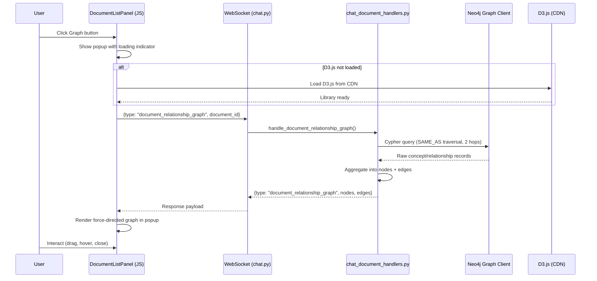

# Design Document: Document Relationship Graph

## Overview

This feature adds an interactive force-directed graph visualization to the document list panel, allowing users to explore how their documents are connected through shared concepts linked by `SAME_AS` relationships in the Neo4j knowledge graph.

The system works as follows:
1. A "Graph" button appears next to the Stats toggle on each completed document that has concepts.
2. Clicking the button opens a popup overlay and sends a `document_relationship_graph` WebSocket message to the backend.
3. The backend queries Neo4j for all documents connected to the origin document through `SAME_AS` relationships (up to 2 hops), aggregates shared concepts per document pair, and returns a nodes-and-edges payload.
4. The frontend lazily loads D3.js from a CDN (if not already loaded), then renders a force-directed graph inside the popup with drag, tooltips, and zoom-to-fit.

### Key Design Decisions

- **WebSocket over REST**: Consistent with all other document operations in the app (list, delete, retry). No new HTTP endpoints needed.
- **Lazy D3.js loading**: D3 is ~260KB minified. Loading it only on first Graph button click avoids impacting initial page load.
- **Single Cypher query with aggregation**: Instead of querying per-concept, a single query finds all documents connected via `SAME_AS` paths from the origin document's concepts, then aggregates by document pair. This minimizes round trips to Neo4j.
- **Frontend-only graph rendering**: The force simulation runs entirely in the browser. The backend only provides the data payload (nodes + edges). No server-side layout computation.

## Architecture



### Component Boundaries

| Layer | Component | Responsibility |
|-------|-----------|----------------|
| Frontend | `DocumentListPanel` | Graph button rendering, popup lifecycle, D3 loading, graph rendering |
| Transport | WebSocket (`chat.py`) | Message routing for `document_relationship_graph` type |
| Backend | `chat_document_handlers.py` | New `handle_document_relationship_graph()` function |
| Data | Neo4j via `database_factory` | Cypher query execution for SAME_AS traversal |
| Models | `chat_document_models.py` | Pydantic models for request/response messages |

## Components and Interfaces

### 1. WebSocket Message Models (`chat_document_models.py`)

New Pydantic models added to the existing models file:

```python
class DocumentRelationshipGraphRequest(BaseModel):
    type: Literal["document_relationship_graph"] = "document_relationship_graph"
    document_id: str = Field(..., description="Document ID to get relationships for")

class GraphNode(BaseModel):
    document_id: str
    title: str
    is_origin: bool = False

class GraphEdge(BaseModel):
    source: str  # source document_id
    target: str  # target document_id
    shared_count: int  # number of shared concepts
    sample_concepts: List[str] = Field(
        default_factory=list,
        max_length=5,
        description="Up to 5 sample shared concept names"
    )

class DocumentRelationshipGraphResponse(BaseModel):
    type: Literal["document_relationship_graph"] = "document_relationship_graph"
    document_id: str
    nodes: List[GraphNode]
    edges: List[GraphEdge]

class DocumentRelationshipGraphError(BaseModel):
    type: Literal["document_relationship_graph_error"] = "document_relationship_graph_error"
    document_id: str
    message: str
```

### 2. Backend Handler (`chat_document_handlers.py`)

New async function `handle_document_relationship_graph()` following the same pattern as existing handlers:

```python
async def handle_document_relationship_graph(
    message_data: dict,
    connection_id: str,
    manager,
) -> None:
```

**Cypher Query Strategy:**

A single query that:
1. Starts from all `Concept` nodes belonging to the origin document
2. Traverses `SAME_AS` relationships up to 2 hops
3. Finds concepts in other documents
4. Groups by target document, counting shared concepts and collecting sample names

```cypher
MATCH (c:Concept {source_document: $doc_id})-[:SAME_AS*1..2]-(related:Concept)
WHERE related.source_document <> $doc_id
WITH related.source_document AS target_doc_id,
     collect(DISTINCT related.name) AS concept_names,
     count(DISTINCT related.name) AS shared_count
RETURN target_doc_id, shared_count, concept_names[0..5] AS sample_concepts
ORDER BY shared_count DESC
```

After getting the Neo4j results, the handler looks up document titles from PostgreSQL (`knowledge_sources` table) for all discovered document IDs.

### 3. WebSocket Router (`chat.py`)

New `elif` branch in the message dispatch:

```python
elif message_type == 'document_relationship_graph':
    await handle_document_relationship_graph(
        message_data=message_data,
        connection_id=connection_id,
        manager=manager,
    )
```

### 4. Frontend: Graph Button (`document-list-panel.js`)

Modifications to `buildStatsHtml()` to inject a Graph button adjacent to the Stats toggle:

```html
<div class="document-stats">
    <button class="document-stats-toggle" aria-label="Toggle document stats">
        <span class="stats-arrow">▸</span> Stats
    </button>
    <button class="document-graph-btn" 
            data-document-id="{doc.document_id}"
            aria-label="Show relationship graph">
        🔗 Graph
    </button>
    <div class="document-stats-details" style="display:none;">
        ...
    </div>
</div>
```

The button only renders when `doc.status === 'completed'` and `doc.concept_count > 0`.

### 5. Frontend: Graph Popup

The popup is a DOM element appended to `document.body` (not inside the panel) to avoid overflow clipping. Structure:

```html
<div class="graph-popup-backdrop">
    <div class="graph-popup">
        <div class="graph-popup-header">
            <span class="graph-popup-title">Document Relationships: {title}</span>
            <button class="graph-popup-close" aria-label="Close graph popup">✕</button>
        </div>
        <div class="graph-popup-body">
            <!-- SVG rendered by D3 here -->
            <div class="graph-popup-loading">Loading...</div>
            <div class="graph-popup-message" style="display:none;"></div>
        </div>
    </div>
</div>
```

**Popup lifecycle:**
- Open: Click Graph button → create popup DOM → show loading → send WS message
- Close: Click close button, click backdrop, press Escape, or click Graph button again
- Only one popup open at a time (opening a new one closes the previous)

### 6. Frontend: D3.js Lazy Loading

A utility function that returns a Promise, resolved when D3 is available:

```javascript
_loadD3() {
    if (window.d3) return Promise.resolve(window.d3);
    if (this._d3LoadPromise) return this._d3LoadPromise;
    this._d3LoadPromise = new Promise((resolve, reject) => {
        const script = document.createElement('script');
        script.src = 'https://d3js.org/d3.v7.min.js';
        script.onload = () => resolve(window.d3);
        script.onerror = () => reject(new Error('Failed to load D3.js'));
        document.head.appendChild(script);
    });
    return this._d3LoadPromise;
}
```

Cached so multiple clicks don't create duplicate `<script>` tags.

### 7. Frontend: Force-Directed Graph Rendering

A `_renderGraph(container, data)` method on `DocumentListPanel` that:
1. Creates an SVG element sized to the popup body
2. Creates a D3 force simulation with `forceLink`, `forceManyBody`, `forceCenter`
3. Renders edges as `<line>` elements with stroke-width proportional to `shared_count`
4. Renders nodes as `<circle>` elements, origin node in a distinct color
5. Adds text labels (truncated to 30 chars) next to each node
6. Adds drag behavior via `d3.drag()`
7. Adds tooltip `<div>` for hover on nodes (full title) and edges (concept names)
8. Applies zoom-to-fit by computing the bounding box after simulation stabilizes

## Data Models

### Neo4j Graph Schema (existing)

```
(:Concept {
    concept_id: string,
    name: string,
    source_document: string (UUID),
    yago_qid: string (optional)
})-[:SAME_AS {
    q_number: string,
    created_at: string
}]->(:Concept)
```

### PostgreSQL (existing, read-only)

```sql
-- Used to look up document titles
SELECT id::text, title, filename
FROM multimodal_librarian.knowledge_sources
WHERE id = ANY($1::uuid[])
```

### WebSocket Payload: Request

```json
{
    "type": "document_relationship_graph",
    "document_id": "550e8400-e29b-41d4-a716-446655440000"
}
```

### WebSocket Payload: Success Response

```json
{
    "type": "document_relationship_graph",
    "document_id": "550e8400-e29b-41d4-a716-446655440000",
    "nodes": [
        {"document_id": "550e8400-...", "title": "Origin Document", "is_origin": true},
        {"document_id": "660f9500-...", "title": "Related Document A", "is_origin": false}
    ],
    "edges": [
        {
            "source": "550e8400-...",
            "target": "660f9500-...",
            "shared_count": 12,
            "sample_concepts": ["Aspirin", "Ibuprofen", "Acetaminophen", "Naproxen", "Celecoxib"]
        }
    ]
}
```

### WebSocket Payload: Error Response

```json
{
    "type": "document_relationship_graph_error",
    "document_id": "550e8400-...",
    "message": "Knowledge graph service is unavailable"
}
```


## Correctness Properties

*A property is a characteristic or behavior that should hold true across all valid executions of a system — essentially, a formal statement about what the system should do. Properties serve as the bridge between human-readable specifications and machine-verifiable correctness guarantees.*

### Property 1: Graph button visibility is determined by status and concept count

*For any* document object, the Graph button is present in the rendered HTML if and only if `status === "completed"` and `concept_count > 0`. Documents with any other status or zero concepts must not have a Graph button.

**Validates: Requirements 1.1, 1.2**

### Property 2: Response structure contains origin node with is_origin flag

*For any* valid `document_relationship_graph` response produced by the backend handler, exactly one node in the `nodes` list shall have `is_origin` set to `true`, and that node's `document_id` shall equal the requested `document_id`.

**Validates: Requirements 3.3**

### Property 3: Sample concepts per edge are capped at 5

*For any* edge in any `document_relationship_graph` response, the `sample_concepts` list shall contain at most 5 items, regardless of how many shared concepts actually exist between the two documents.

**Validates: Requirements 3.5**

### Property 4: Response nodes and edges are structurally consistent

*For any* `document_relationship_graph` response, every `source` and `target` in the `edges` list shall reference a `document_id` that exists in the `nodes` list. There shall be no dangling edge references.

**Validates: Requirements 3.2**

### Property 5: Title truncation at 30 characters

*For any* string, the truncation function shall return the original string if its length is ≤ 30, or the first 30 characters followed by "…" if its length exceeds 30. The output length shall never exceed 31 characters (30 + ellipsis).

**Validates: Requirements 4.2**

### Property 6: Edge thickness is monotonically proportional to shared count

*For any* two edges where edge A has `shared_count` > edge B's `shared_count`, the computed stroke-width for edge A shall be ≥ the computed stroke-width for edge B. Equal shared counts shall produce equal stroke-widths.

**Validates: Requirements 4.4**

### Property 7: Popup title format includes document title

*For any* document title string, the popup title bar text shall equal `"Document Relationships: "` concatenated with the document title.

**Validates: Requirements 6.4**

## Error Handling

| Scenario | Handler | Behavior |
|----------|---------|----------|
| Neo4j client unavailable | `handle_document_relationship_graph` | Return `document_relationship_graph_error` with message "Knowledge graph service is unavailable" |
| Neo4j query execution fails | `handle_document_relationship_graph` | Catch exception, log error, return `document_relationship_graph_error` with descriptive message |
| Document ID not found in PostgreSQL | `handle_document_relationship_graph` | Use filename or "Unknown Document" as fallback title for the origin node |
| No cross-document relationships found | `handle_document_relationship_graph` | Return valid response with only the origin node and empty edges list |
| D3.js CDN fails to load | `_loadD3()` | Promise rejects; popup shows "Could not load visualization library. Please check your internet connection." |
| D3.js CDN timeout | `_loadD3()` | Script `onerror` fires after browser timeout; same error message as above |
| WebSocket disconnected when Graph button clicked | `DocumentListPanel` | Show error in popup: "Not connected to server" |
| Empty `document_id` in request | `handle_document_relationship_graph` | Return `document_relationship_graph_error` with validation message |
| PostgreSQL unavailable for title lookup | `handle_document_relationship_graph` | Degrade gracefully: use document_id as title fallback, still return graph data from Neo4j |

## Testing Strategy

### Property-Based Testing

**Library**: [Hypothesis](https://hypothesis.readthedocs.io/) for Python backend tests, [fast-check](https://fast-check.dev/) for JavaScript frontend tests.

Each correctness property maps to a single property-based test with a minimum of 100 iterations. Tests are tagged with the property they validate.

**Backend property tests** (`tests/components/test_document_relationship_graph_properties.py`):

- **Property 2**: Generate random Neo4j result sets (varying numbers of related documents, concept names). Run the aggregation logic. Assert exactly one origin node with `is_origin=True` matching the input `document_id`.
  - Tag: `Feature: document-relationship-graph, Property 2: Response structure contains origin node with is_origin flag`

- **Property 3**: Generate random Neo4j result sets with edges having 0–100 shared concepts. Assert every edge's `sample_concepts` has length ≤ 5.
  - Tag: `Feature: document-relationship-graph, Property 3: Sample concepts per edge are capped at 5`

- **Property 4**: Generate random Neo4j result sets. Assert every edge's `source` and `target` appear in the nodes list.
  - Tag: `Feature: document-relationship-graph, Property 4: Response nodes and edges are structurally consistent`

**Frontend property tests** (`tests/js/test_document_graph_properties.js`):

- **Property 1**: Generate random document objects with varying `status` and `concept_count`. Assert Graph button presence matches the condition `status === "completed" && concept_count > 0`.
  - Tag: `Feature: document-relationship-graph, Property 1: Graph button visibility is determined by status and concept count`

- **Property 5**: Generate random strings of length 0–200. Assert truncation output matches the spec (≤30 unchanged, >30 truncated with ellipsis).
  - Tag: `Feature: document-relationship-graph, Property 5: Title truncation at 30 characters`

- **Property 6**: Generate pairs of edges with random `shared_count` values. Assert the scaling function produces monotonically non-decreasing stroke-widths.
  - Tag: `Feature: document-relationship-graph, Property 6: Edge thickness is monotonically proportional to shared count`

- **Property 7**: Generate random title strings. Assert popup title equals `"Document Relationships: " + title`.
  - Tag: `Feature: document-relationship-graph, Property 7: Popup title format includes document title`

### Unit Tests

Unit tests complement property tests by covering specific examples, integration points, and error conditions:

**Backend unit tests** (`tests/components/test_document_relationship_graph.py`):

- Handler returns error response when Neo4j client is unavailable (Req 3.4)
- Handler returns error response when document_id is empty
- Handler returns valid response with only origin node when no SAME_AS relationships exist (Req 2.7)
- Handler correctly queries with 2-hop SAME_AS traversal (Req 3.6)
- Handler looks up document titles from PostgreSQL
- Handler degrades gracefully when PostgreSQL is unavailable (uses document_id as title)

**Frontend unit tests** (`tests/js/test_document_graph.js`):

- Graph button renders with "🔗 Graph" text (Req 1.3)
- Graph button click opens popup (Req 2.1)
- Second click on Graph button closes popup (Req 2.2)
- Clicking backdrop closes popup (Req 2.3)
- Escape key closes popup (Req 2.4)
- Close button (✕) closes popup (Req 2.5)
- Error/empty data shows descriptive message in popup (Req 2.7)
- D3.js is loaded lazily on first click (Req 5.1)
- D3.js load failure shows error message (Req 5.2)
- Hover on node shows full title tooltip (Req 4.6)
- Hover on edge shows concept names tooltip (Req 4.5)
