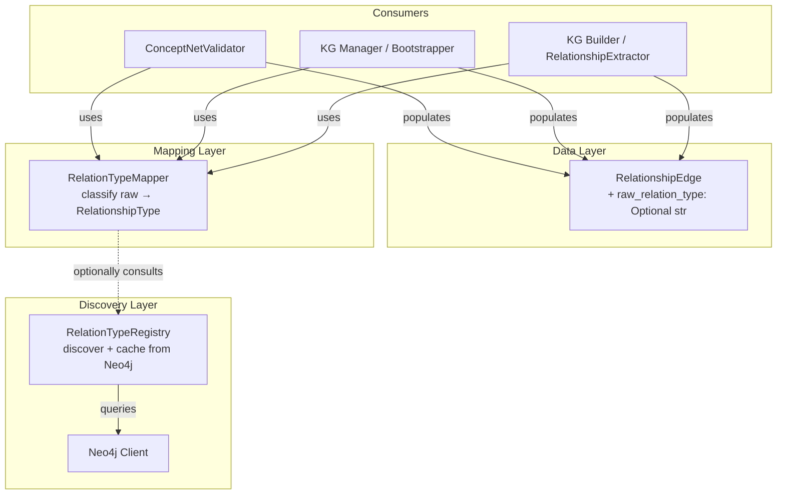

# Design Document: Dynamic Relation Type Handling

## Overview

This feature introduces a centralized, dynamic approach to handling ConceptNet relation types in the Multimodal Librarian's knowledge graph pipeline. The current system has three problems:

1. The `ConceptNetValidator` hardcodes `RelationshipType.ASSOCIATIVE` for every edge, discarding the actual ConceptNet relation type.
2. Three separate files (`conceptnet_validator.py`, `kg_manager.py`, `kg_builder.py`) each maintain their own incomplete mapping dictionaries from ConceptNet predicates to `RelationshipType`.
3. The system cannot adapt when ConceptNet introduces new relation types — it requires code changes.

The design introduces:
- A `raw_relation_type` field on `RelationshipEdge` to preserve the original ConceptNet string.
- A `RelationTypeMapper` class as the single source of truth for classifying ConceptNet relation types into the internal taxonomy.
- A `RelationTypeRegistry` that discovers and caches the set of relation types present in Neo4j at startup, following the project's DI patterns.

## Architecture



The `RelationTypeMapper` is a pure, stateless utility — no database connections, no async. It holds the classification dictionary and a `classify()` method. The `RelationTypeRegistry` is a separate async-capable class that handles Neo4j discovery and caching, following the project's lazy-init DI pattern.

## Components and Interfaces

### RelationTypeMapper

Location: `src/multimodal_librarian/components/knowledge_graph/relation_type_mapper.py`

A stateless utility class. No constructor dependencies. Can be imported and used anywhere without DI concerns.

```python
from multimodal_librarian.models.core import RelationshipType

class RelationTypeMapper:
    """Centralized mapping from ConceptNet relation types to internal taxonomy."""

    # Class-level mapping dictionary
    _CAUSAL: frozenset  # {"causes", "hasprerequisite", "motivatedbygoal", ...}
    _HIERARCHICAL: frozenset  # {"isa", "partof", "hasa", "instanceof", ...}
    # Everything else → ASSOCIATIVE

    @classmethod
    def classify(cls, raw_relation_type: str) -> RelationshipType:
        """Classify a ConceptNet relation type into the internal taxonomy.
        
        Case-insensitive. Unknown types default to ASSOCIATIVE.
        """
        ...

    @classmethod
    def get_known_types(cls) -> Dict[str, RelationshipType]:
        """Return the full mapping dictionary for inspection/testing."""
        ...
```

### RelationTypeRegistry

Location: `src/multimodal_librarian/components/knowledge_graph/relation_type_registry.py`

An async-capable class that discovers relation types from Neo4j. Follows the project's DI pattern: no import-time connections, lazy initialization, singleton caching.

```python
class RelationTypeRegistry:
    """Discovers and caches ConceptNet relation types from Neo4j."""

    def __init__(self, neo4j_client: Any) -> None:
        self._neo4j = neo4j_client
        self._discovered_types: Optional[Set[str]] = None
        self._initialized: bool = False

    async def initialize(self) -> None:
        """Query Neo4j for distinct relation types. Safe to call multiple times."""
        ...

    async def refresh(self) -> None:
        """Re-query Neo4j and update the cached set."""
        ...

    def get_discovered_types(self) -> Set[str]:
        """Return the set of discovered relation type strings."""
        ...

    def is_known_type(self, relation_type: str) -> bool:
        """Check if a relation type was discovered in Neo4j."""
        ...
```

DI provider (in `src/multimodal_librarian/api/dependencies/services.py`):

```python
_relation_type_registry: Optional[RelationTypeRegistry] = None

async def get_relation_type_registry() -> Optional[RelationTypeRegistry]:
    """Lazy-init RelationTypeRegistry. Returns None if Neo4j unavailable."""
    global _relation_type_registry
    if _relation_type_registry is None:
        neo4j_client = await get_neo4j_client_optional()
        if neo4j_client is None:
            return None
        _relation_type_registry = RelationTypeRegistry(neo4j_client)
        try:
            await _relation_type_registry.initialize()
        except Exception:
            logger.warning("Failed to initialize RelationTypeRegistry", exc_info=True)
    return _relation_type_registry
```

### Updated RelationshipEdge

The `RelationshipEdge` dataclass in `models/knowledge_graph.py` gains one new field:

```python
@dataclass
class RelationshipEdge:
    subject_concept: str
    predicate: str
    object_concept: str
    confidence: float = 0.0
    evidence_chunks: List[str] = field(default_factory=list)
    relationship_type: RelationshipType = RelationshipType.ASSOCIATIVE
    raw_relation_type: Optional[str] = None  # NEW: original ConceptNet type
    bidirectional: bool = False
```

### Updated ConceptNetValidator

The `get_relationships_for_concepts` method changes from:

```python
relationship_type=RelationshipType.ASSOCIATIVE,
```

to:

```python
relationship_type=RelationTypeMapper.classify(rec["rel_type"]),
raw_relation_type=rec["rel_type"],
```

### Updated KG Manager (ExternalKnowledgeBootstrapper)

The `_map_conceptnet_relation_type` method body is replaced with a delegation:

```python
def _map_conceptnet_relation_type(self, predicate: str) -> RelationshipType:
    return RelationTypeMapper.classify(predicate)
```

### Updated KG Builder (RelationshipExtractor)

The `_get_relationship_type` method body is replaced with a delegation:

```python
def _get_relationship_type(self, predicate: str) -> RelationshipType:
    return RelationTypeMapper.classify(predicate)
```

## Data Models

### RelationshipEdge Changes

| Field | Type | Default | Change |
|-------|------|---------|--------|
| `raw_relation_type` | `Optional[str]` | `None` | NEW |

Serialization (`to_dict`):
```python
'raw_relation_type': self.raw_relation_type
```

Deserialization (`from_dict`):
```python
raw_relation_type=data.get('raw_relation_type')  # defaults to None if absent
```

This ensures backward compatibility — existing serialized data without `raw_relation_type` will deserialize cleanly with `None`.

### RelationTypeMapper Internal Data

The mapper uses two `frozenset` constants for O(1) lookup:

```python
_CAUSAL = frozenset({
    "causes", "hasprerequisite", "motivatedbygoal", "causesdesire",
    "entails", "hassubevent", "hasfirstsubevent", "haslastsubevent",
})

_HIERARCHICAL = frozenset({
    "isa", "partof", "hasa", "instanceof", "mannerof",
    "madeof", "definedas", "formof",
})
```

All values are stored lowercased. Input is lowercased before lookup. Anything not in `_CAUSAL` or `_HIERARCHICAL` maps to `ASSOCIATIVE`.

### RelationTypeRegistry Internal Data

```python
_discovered_types: Optional[Set[str]]  # None before init, set of lowercased strings after
_initialized: bool  # tracks whether initialize() has been called
```

Discovery query:
```cypher
MATCH ()-[r:ConceptNetRelation]->()
RETURN DISTINCT r.relation_type AS rel_type
```


## Correctness Properties

*A property is a characteristic or behavior that should hold true across all valid executions of a system — essentially, a formal statement about what the system should do. Properties serve as the bridge between human-readable specifications and machine-verifiable correctness guarantees.*

### Property 1: RelationshipEdge serialization round-trip

*For any* `RelationshipEdge` instance (with any combination of `relationship_type` and `raw_relation_type`, including `None`), calling `to_dict()` then `from_dict()` on the result should produce a `RelationshipEdge` with identical field values. Additionally, for any dictionary that lacks the `raw_relation_type` key, `from_dict` should produce an edge with `raw_relation_type` equal to `None`.

**Validates: Requirements 1.2, 1.3, 6.1, 6.2**

### Property 2: Classification correctness

*For any* relation type string, `RelationTypeMapper.classify()` should return:
- `RelationshipType.CAUSAL` if the lowercased string is in the known causal set
- `RelationshipType.HIERARCHICAL` if the lowercased string is in the known hierarchical set
- `RelationshipType.ASSOCIATIVE` for all other strings (including empty strings, random strings, and known associative types)

The causal and hierarchical sets must be disjoint, and their union must not cover all possible strings.

**Validates: Requirements 2.2, 2.3, 2.4, 2.5**

### Property 3: Case-insensitive classification

*For any* known relation type string and *for any* case permutation of that string (e.g., "IsA", "ISA", "isa", "isA"), `RelationTypeMapper.classify()` should return the same `RelationshipType` value.

**Validates: Requirements 2.6**

### Property 4: ConceptNetValidator edge creation correctness

*For any* mock ConceptNet query result record containing a `rel_type` string, when `ConceptNetValidator.get_relationships_for_concepts()` creates a `RelationshipEdge`, the edge's `relationship_type` should equal `RelationTypeMapper.classify(rel_type)` and the edge's `raw_relation_type` should equal the original `rel_type` string.

**Validates: Requirements 1.4, 3.1, 3.2**

### Property 5: Delegation equivalence

*For any* predicate string, `ExternalKnowledgeBootstrapper._map_conceptnet_relation_type(predicate)` and `RelationshipExtractor._get_relationship_type(predicate)` should both return the same value as `RelationTypeMapper.classify(predicate)`.

**Validates: Requirements 4.1, 4.2**

### Property 6: Registry membership check

*For any* set of relation type strings returned by a mock Neo4j query, after `RelationTypeRegistry.initialize()`, `is_known_type(t)` should return `True` for every string `t` in that set and `False` for any string not in that set.

**Validates: Requirements 5.4**

## Error Handling

| Scenario | Behavior |
|----------|----------|
| `RelationTypeMapper.classify()` receives `None` or empty string | Returns `RelationshipType.ASSOCIATIVE` (default) |
| `RelationTypeMapper.classify()` receives unknown relation type | Returns `RelationshipType.ASSOCIATIVE` (default) |
| `RelationTypeRegistry.initialize()` fails (Neo4j unavailable) | Logs warning, sets `_discovered_types` to empty set, does not raise |
| `RelationTypeRegistry.refresh()` fails | Logs warning, retains previously cached set, does not raise |
| `RelationTypeRegistry.is_known_type()` called before `initialize()` | Returns `False` (empty set) |
| `RelationshipEdge.from_dict()` receives data without `raw_relation_type` | Defaults to `None` — backward compatible |
| `RelationshipEdge.from_dict()` receives data with unknown `relationship_type` string | Existing behavior — `RelationshipType(value)` raises `ValueError` |

## Testing Strategy

### Unit Tests

- `RelationTypeMapper.classify()` with specific known causal, hierarchical, and associative types
- `RelationTypeMapper.classify()` with empty string and `None`-like inputs
- `RelationshipEdge.to_dict()` / `from_dict()` with and without `raw_relation_type`
- `RelationTypeRegistry` with mock Neo4j client returning known types
- `RelationTypeRegistry` with mock Neo4j client that raises exceptions
- `ConceptNetValidator.get_relationships_for_concepts()` with mock Neo4j returning edges

### Property-Based Tests

Property-based tests use the `hypothesis` library. Each test runs a minimum of 100 iterations.

- **Feature: dynamic-relation-type-handling, Property 1: RelationshipEdge serialization round-trip** — Generate random `RelationshipEdge` instances, verify `from_dict(to_dict(edge))` produces equivalent fields.
- **Feature: dynamic-relation-type-handling, Property 2: Classification correctness** — Generate random strings (from known sets and arbitrary), verify `classify()` returns the correct category.
- **Feature: dynamic-relation-type-handling, Property 3: Case-insensitive classification** — Generate known relation types with random case permutations, verify consistent output.
- **Feature: dynamic-relation-type-handling, Property 4: ConceptNetValidator edge creation correctness** — Generate mock query records with random rel_type strings, verify edge fields.
- **Feature: dynamic-relation-type-handling, Property 5: Delegation equivalence** — Generate random predicate strings, verify all three mapping paths return the same result.
- **Feature: dynamic-relation-type-handling, Property 6: Registry membership check** — Generate random sets of relation type strings, mock Neo4j to return them, verify `is_known_type` correctness.

### Testing Library

- `pytest` for test execution
- `hypothesis` for property-based testing (Python PBT library)
- `unittest.mock` / `AsyncMock` for mocking Neo4j client
- Minimum 100 examples per property test via `@settings(max_examples=100)`
