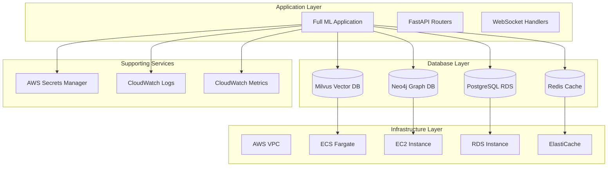

# Full ML Database Implementation Design

## Overview

This design document outlines the implementation of a complete Full ML deployment with all database infrastructure components. The system will transition from the current fallback-mode standalone deployment to a production-ready multi-database architecture using AWS managed services and containerized solutions.

## Architecture

### High-Level Architecture



### Database Architecture

#### PostgreSQL (Primary Database)
- **Purpose**: Relational data storage for users, conversations, documents, analytics
- **Configuration**: RDS t3.micro, 20GB storage, single AZ (cost-optimized)
- **Features**: Connection pooling, automated backups, encryption at rest
- **Schema**: User management, document metadata, conversation history, analytics tables

#### Milvus (Vector Database)
- **Purpose**: Vector embeddings storage and semantic search
- **Configuration**: ECS Fargate with etcd metadata store and MinIO object storage
- **Features**: HNSW indexing, cosine similarity search, collection management
- **Schema**: Document embeddings, conversation embeddings, bridge chunks

#### Neo4j (Knowledge Graph)
- **Purpose**: Entity relationships and graph-based queries
- **Configuration**: EC2 t3.small with APOC plugin
- **Features**: Graph traversal, relationship extraction, concept mapping
- **Schema**: Entities, relationships, knowledge triples

#### Redis (Cache Layer)
- **Purpose**: Session management, query caching, performance optimization
- **Configuration**: ElastiCache t3.micro single node
- **Features**: Key-value caching, session storage, rate limiting

## Components and Interfaces

### Infrastructure Components

#### AWS CDK Stack (`MultimodalLibrarianLearningStack`)
```typescript
interface StackComponents {
  vpc: VpcConstruct;
  database: DatabaseConstruct;
  milvus: MilvusBasic;
  neo4j: Neo4jBasic;
  secrets: SecretsBasic;
  monitoring: MonitoringBasic;
}
```

#### Database Connection Manager
```python
class DatabaseManager:
    def __init__(self):
        self.postgres_manager: PostgreSQLManager
        self.milvus_manager: MilvusManager
        self.neo4j_manager: Neo4jManager
        self.redis_manager: RedisManager
    
    async def initialize_all(self) -> None
    async def health_check_all(self) -> Dict[str, bool]
    async def migrate_all(self) -> None
```

### Application Components

#### Configuration Manager
```python
class DatabaseConfig:
    postgres_url: str
    milvus_host: str
    milvus_port: int
    neo4j_uri: str
    redis_host: str
    
    @classmethod
    def from_secrets_manager(cls) -> 'DatabaseConfig'
```

#### Migration Engine
```python
class MigrationEngine:
    def run_postgres_migrations(self) -> None
    def initialize_milvus_collections(self) -> None
    def setup_neo4j_constraints(self) -> None
    def configure_redis_policies(self) -> None
```

## Data Models

### PostgreSQL Schema
```sql
-- Users and authentication
CREATE TABLE users (
    id UUID PRIMARY KEY,
    username VARCHAR(255) UNIQUE NOT NULL,
    email VARCHAR(255) UNIQUE NOT NULL,
    created_at TIMESTAMP DEFAULT NOW()
);

-- Documents and metadata
CREATE TABLE documents (
    id UUID PRIMARY KEY,
    filename VARCHAR(255) NOT NULL,
    content_type VARCHAR(100),
    file_size BIGINT,
    upload_date TIMESTAMP DEFAULT NOW(),
    user_id UUID REFERENCES users(id)
);

-- Conversations
CREATE TABLE conversations (
    id UUID PRIMARY KEY,
    user_id UUID REFERENCES users(id),
    title VARCHAR(255),
    created_at TIMESTAMP DEFAULT NOW(),
    updated_at TIMESTAMP DEFAULT NOW()
);

-- Analytics tables
CREATE TABLE search_analytics (
    id UUID PRIMARY KEY,
    query_text TEXT,
    result_count INTEGER,
    response_time_ms INTEGER,
    timestamp TIMESTAMP DEFAULT NOW()
);
```

### Milvus Collections
```python
# Knowledge chunks collection
KNOWLEDGE_CHUNKS_SCHEMA = {
    "fields": [
        {"name": "chunk_id", "type": "VARCHAR", "is_primary": True},
        {"name": "embedding", "type": "FLOAT_VECTOR", "dim": 384},
        {"name": "source_type", "type": "VARCHAR"},
        {"name": "source_id", "type": "VARCHAR"},
        {"name": "content", "type": "VARCHAR"},
        {"name": "created_at", "type": "INT64"}
    ]
}
```

### Neo4j Schema
```cypher
// Create constraints
CREATE CONSTRAINT concept_id IF NOT EXISTS FOR (c:Concept) REQUIRE c.id IS UNIQUE;
CREATE CONSTRAINT relationship_id IF NOT EXISTS FOR (r:Relationship) REQUIRE r.id IS UNIQUE;

// Create indexes
CREATE INDEX concept_name IF NOT EXISTS FOR (c:Concept) ON (c.name);
CREATE INDEX relationship_type IF NOT EXISTS FOR (r:Relationship) ON (r.type);
```

## Correctness Properties

*A property is a characteristic or behavior that should hold true across all valid executions of a system-essentially, a formal statement about what the system should do. Properties serve as the bridge between human-readable specifications and machine-verifiable correctness guarantees.*

### Property 1: Database Connection Consistency
*For any* database connection request, the system should successfully connect to all four databases (PostgreSQL, Milvus, Neo4j, Redis) or fail gracefully with clear error messages.
**Validates: Requirements 1.1, 1.2, 1.3, 1.4**

### Property 2: Migration Idempotency
*For any* database migration operation, running the migration multiple times should produce the same final state without errors or data corruption.
**Validates: Requirements 2.1, 2.2, 2.3, 2.4**

### Property 3: Data Persistence Round Trip
*For any* data stored in the system, retrieving the data should return the exact same content that was originally stored, across all database types.
**Validates: Requirements 3.3, 4.4**

### Property 4: Health Check Completeness
*For any* health check execution, the system should verify connectivity and basic operations for all four database components and return accurate status information.
**Validates: Requirements 5.1, 5.2, 5.3, 5.4, 5.5**

### Property 5: Configuration Consistency
*For any* application startup, the system should load database configuration from AWS Secrets Manager and establish connections using the retrieved credentials.
**Validates: Requirements 3.1, 8.1**

### Property 6: Fallback Mode Disabling
*For any* successful database connection establishment, the system should disable fallback mode and enable full database-dependent features.
**Validates: Requirements 3.2, 3.5**

### Property 7: Security Credential Management
*For any* database access, the system should use credentials from AWS Secrets Manager and never expose plaintext passwords in logs or configuration files.
**Validates: Requirements 8.1, 8.2**

## Error Handling

### Database Connection Failures
- **PostgreSQL Failure**: Log error, attempt reconnection with exponential backoff, provide fallback read-only mode
- **Milvus Failure**: Log error, disable vector search features, provide text-based search fallback
- **Neo4j Failure**: Log error, disable knowledge graph features, provide simple keyword matching
- **Redis Failure**: Log error, disable caching, use in-memory session storage

### Migration Failures
- **Schema Conflicts**: Detect existing schema, provide migration path or rollback options
- **Data Corruption**: Validate data integrity before and after migrations, provide backup restoration
- **Timeout Issues**: Implement migration timeouts, provide progress tracking and resumption

### Infrastructure Failures
- **AWS Service Limits**: Detect service limits, provide clear error messages with resolution steps
- **Network Connectivity**: Implement retry logic with circuit breakers
- **Resource Constraints**: Monitor resource usage, provide scaling recommendations

## Testing Strategy

### Unit Testing
- Database connection managers with mock databases
- Migration scripts with test databases
- Configuration loading with mock AWS services
- Health check implementations with simulated failures

### Integration Testing
- End-to-end database operations across all four databases
- Migration workflows with real database instances
- AWS infrastructure deployment and teardown
- Cross-database data consistency validation

### Property-Based Testing
- Database connection reliability across various network conditions
- Migration idempotency with random data sets
- Data persistence verification with generated test data
- Health check accuracy with simulated database states
- Configuration loading with various AWS credential scenarios
- Security validation with credential rotation scenarios

Each property test should run a minimum of 100 iterations and be tagged with:
**Feature: full-ml-database-implementation, Property {number}: {property_text}**

### Performance Testing
- Database query performance under load
- Vector search latency with large embedding collections
- Graph traversal performance with complex relationship networks
- Cache hit rates and memory usage optimization

### Security Testing
- Credential management and rotation
- Network access control validation
- Encryption verification for data at rest and in transit
- IAM policy compliance testing