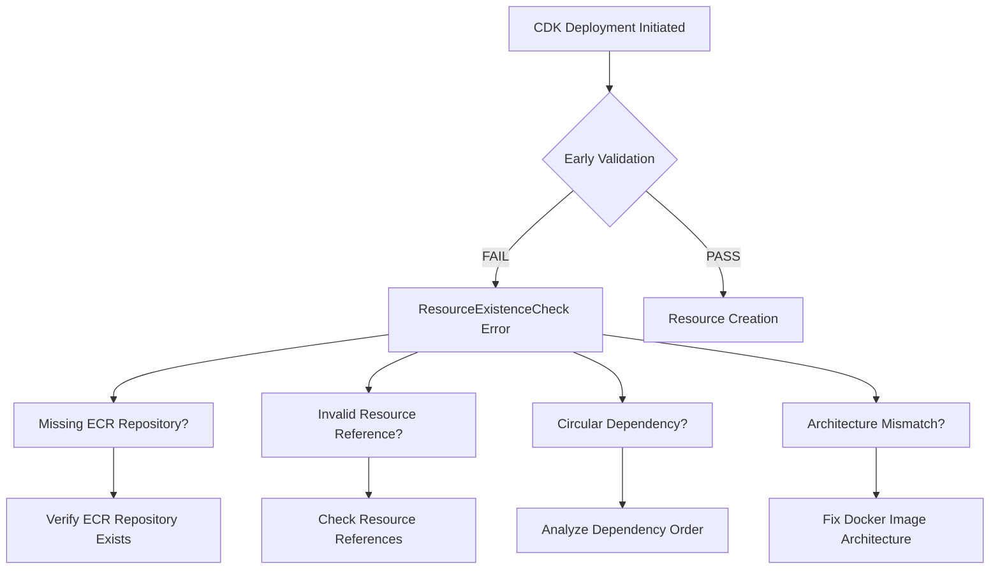
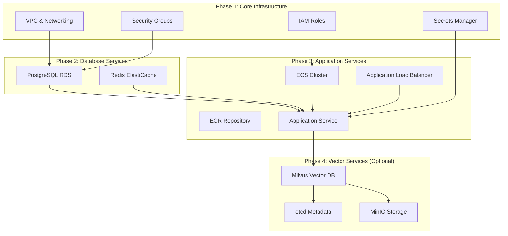

# Full ML Deployment Architecture Fix Design

## Overview

This design document outlines the solution for fixing the current Full ML deployment architecture issues. The approach focuses on resolving immediate CDK deployment failures while establishing a foundation for the complete multi-database system.

## Problem Analysis

### Current Issues

1. **CDK Early Validation Failure**: `AWS::EarlyValidation::ResourceExistenceCheck` error preventing deployment
2. **Architecture Mismatch**: Docker images built for ARM64 but AWS Fargate running x86_64
3. **Complex Dependencies**: Milvus services (etcd, MinIO) adding complexity to initial deployment
4. **Resource Reference Issues**: Potential circular dependencies or missing resource references

### Root Cause Analysis



## Solution Architecture

### Incremental Deployment Strategy



### Architecture Fix Components

#### 1. Docker Image Architecture Compatibility

```typescript
// Task Definition with explicit x86_64 architecture
const taskDefinition = new ecs.FargateTaskDefinition(this, 'WebTaskDefinition', {
  family: `${projectName}-${environment}-web`,
  cpu: 1024,
  memoryLimitMiB: 2048,
  
  // Explicit x86_64 architecture specification
  runtimePlatform: {
    cpuArchitecture: ecs.CpuArchitecture.X86_64,
    operatingSystemFamily: ecs.OperatingSystemFamily.LINUX,
  },
  
  taskRole: ecsTaskRole,
  executionRole: ecsExecutionRole,
});

// Container with AMD64 image
const container = taskDefinition.addContainer('WebContainer', {
  image: ecs.ContainerImage.fromRegistry(`${repositoryUri}:full-ml-amd64`),
  // ... other configuration
});
```

#### 2. Resource Dependency Validation

```typescript
// Dependency validation construct
export class DeploymentValidationConstruct extends Construct {
  constructor(scope: Construct, id: string, props: ValidationProps) {
    super(scope, id);
    
    // Validate ECR repository exists
    this.validateEcrRepository(props.repositoryUri);
    
    // Validate resource references
    this.validateResourceReferences(props.dependencies);
    
    // Check for circular dependencies
    this.validateDependencyOrder(props.resources);
  }
  
  private validateEcrRepository(repositoryUri: string): void {
    // Custom resource to check ECR repository existence
    new cr.AwsCustomResource(this, 'EcrValidation', {
      onUpdate: {
        service: 'ECR',
        action: 'describeRepositories',
        parameters: {
          repositoryNames: [this.extractRepositoryName(repositoryUri)]
        },
        physicalResourceId: cr.PhysicalResourceId.of('ecr-validation')
      },
      policy: cr.AwsCustomResourcePolicy.fromSdkCalls({
        resources: cr.AwsCustomResourcePolicy.ANY_RESOURCE
      })
    });
  }
}
```

#### 3. Incremental Stack Deployment

```typescript
// Core infrastructure stack
export class CoreInfrastructureStack extends cdk.Stack {
  public readonly vpc: VpcConstruct;
  public readonly security: SecurityConstruct;
  public readonly iam: IamConstruct;
  public readonly secrets: SecretsBasicConstruct;
  
  constructor(scope: Construct, id: string, props: StackProps) {
    super(scope, id, props);
    
    // Deploy only core components
    this.vpc = new VpcConstruct(this, 'Vpc', props.vpcConfig);
    this.security = new SecurityConstruct(this, 'Security', props.securityConfig);
    this.iam = new IamConstruct(this, 'Iam', props.iamConfig);
    this.secrets = new SecretsBasicConstruct(this, 'Secrets', props.secretsConfig);
  }
}

// Database services stack
export class DatabaseServicesStack extends cdk.Stack {
  constructor(scope: Construct, id: string, props: DatabaseStackProps) {
    super(scope, id, props);
    
    // Import core infrastructure
    const vpc = ec2.Vpc.fromLookup(this, 'ImportedVpc', {
      vpcId: props.coreStack.vpc.vpcId
    });
    
    // Deploy database services
    this.database = new DatabaseConstruct(this, 'Database', {
      vpc,
      // ... other props from core stack
    });
  }
}
```

#### 4. Vector Services Isolation

```typescript
// Optional vector services stack
export class VectorServicesStack extends cdk.Stack {
  public readonly milvus?: MilvusBasic;
  
  constructor(scope: Construct, id: string, props: VectorStackProps) {
    super(scope, id, props);
    
    // Only deploy if explicitly enabled
    if (props.enableVectorServices) {
      this.milvus = new MilvusBasic(this, 'Milvus', {
        vpc: props.vpc,
        cluster: props.cluster,
        securityGroup: props.securityGroup,
      });
    }
  }
}

// Main stack with conditional vector services
export class MultimodalLibrarianStack extends cdk.Stack {
  constructor(scope: Construct, id: string, props: MultimodalLibrarianStackProps) {
    super(scope, id, props);
    
    // Core infrastructure (always deployed)
    this.deployCore();
    
    // Database services (always deployed)
    this.deployDatabases();
    
    // Application services (always deployed)
    this.deployApplication();
    
    // Vector services (optional)
    if (props.enableVectorServices !== false) {
      this.deployVectorServices();
    }
  }
}
```

## Implementation Strategy

### Phase 1: Immediate Fixes

1. **Fix Docker Image Architecture**
   - Update task definitions to specify x86_64 architecture
   - Ensure all container images use AMD64 tags
   - Validate image compatibility before deployment

2. **Identify Early Validation Issue**
   - Add resource existence validation
   - Check ECR repository availability
   - Verify all resource references are valid

3. **Simplify Initial Deployment**
   - Comment out Milvus services temporarily
   - Deploy basic infrastructure first
   - Validate core functionality

### Phase 2: Incremental Deployment

1. **Deploy Core Infrastructure**
   - VPC, security groups, IAM roles
   - Secrets Manager configuration
   - Basic monitoring setup

2. **Deploy Database Services**
   - PostgreSQL RDS instance
   - Redis ElastiCache cluster
   - Database security configuration

3. **Deploy Application Services**
   - ECS cluster and task definitions
   - Application Load Balancer
   - ECS service with health checks

### Phase 3: Vector Services Integration

1. **Enable Vector Services**
   - Deploy Milvus, etcd, MinIO services
   - Configure service discovery
   - Integrate with application

2. **Validate Complete System**
   - Test all database connections
   - Verify ML functionality
   - Run end-to-end tests

## Error Handling and Recovery

### Deployment Failure Recovery

```typescript
// Deployment safety construct
export class DeploymentSafetyConstruct extends Construct {
  constructor(scope: Construct, id: string, props: SafetyProps) {
    super(scope, id);
    
    // Pre-deployment validation
    this.addPreDeploymentChecks();
    
    // Rollback procedures
    this.addRollbackProcedures();
    
    // Health monitoring
    this.addHealthMonitoring();
  }
  
  private addPreDeploymentChecks(): void {
    // Check AWS service limits
    // Validate resource quotas
    // Verify prerequisites
  }
  
  private addRollbackProcedures(): void {
    // Automated rollback triggers
    // Manual rollback procedures
    // Resource cleanup validation
  }
}
```

### Stack Deletion Issues

```bash
#!/bin/bash
# Force stack deletion script
STACK_NAME="MultimodalLibrarianFullML"

echo "Attempting graceful stack deletion..."
aws cloudformation delete-stack --stack-name $STACK_NAME

# Wait for deletion or timeout
aws cloudformation wait stack-delete-complete --stack-name $STACK_NAME --cli-read-timeout 1800

if [ $? -ne 0 ]; then
    echo "Graceful deletion failed, checking for stuck resources..."
    
    # Identify stuck resources
    aws cloudformation describe-stack-events --stack-name $STACK_NAME \
        --query 'StackEvents[?ResourceStatus==`DELETE_FAILED`]'
    
    # Manual cleanup procedures
    echo "Manual cleanup may be required for:"
    echo "- ElastiCache clusters (can take 10-15 minutes)"
    echo "- EFS mount targets"
    echo "- Security group dependencies"
fi
```

## Testing Strategy

### Deployment Validation Tests

```python
# Deployment validation script
class DeploymentValidator:
    def __init__(self, stack_name: str):
        self.stack_name = stack_name
        self.cloudformation = boto3.client('cloudformation')
        self.ecs = boto3.client('ecs')
        self.rds = boto3.client('rds')
    
    def validate_stack_deployment(self) -> bool:
        """Validate complete stack deployment"""
        try:
            # Check stack status
            stack_status = self.get_stack_status()
            if stack_status != 'CREATE_COMPLETE':
                return False
            
            # Validate ECS services
            if not self.validate_ecs_services():
                return False
            
            # Validate database connectivity
            if not self.validate_database_connectivity():
                return False
            
            # Validate application health
            if not self.validate_application_health():
                return False
            
            return True
            
        except Exception as e:
            print(f"Validation failed: {e}")
            return False
    
    def validate_ecs_services(self) -> bool:
        """Validate ECS services are running"""
        # Implementation for ECS service validation
        pass
    
    def validate_database_connectivity(self) -> bool:
        """Validate database connections"""
        # Implementation for database connectivity tests
        pass
```

### Architecture Compatibility Tests

```python
# Architecture compatibility validation
def test_docker_image_architecture():
    """Test that Docker images are compatible with x86_64"""
    import docker
    
    client = docker.from_env()
    
    # Pull and inspect image
    image = client.images.pull('591222106065.dkr.ecr.us-east-1.amazonaws.com/multimodal-librarian-full-ml:full-ml-amd64')
    
    # Check architecture
    architecture = image.attrs['Architecture']
    assert architecture == 'amd64', f"Expected amd64, got {architecture}"
    
    # Check platform
    platform = image.attrs.get('Os', '') + '/' + image.attrs.get('Architecture', '')
    assert platform == 'linux/amd64', f"Expected linux/amd64, got {platform}"
```

## Monitoring and Observability

### Deployment Monitoring

```typescript
// CloudWatch dashboard for deployment monitoring
const deploymentDashboard = new cloudwatch.Dashboard(this, 'DeploymentDashboard', {
  dashboardName: 'MultimodalLibrarian-Deployment',
  widgets: [
    [
      new cloudwatch.GraphWidget({
        title: 'ECS Service Health',
        left: [ecsService.metricCpuUtilization()],
        right: [ecsService.metricMemoryUtilization()],
      }),
    ],
    [
      new cloudwatch.GraphWidget({
        title: 'Database Connections',
        left: [rdsInstance.metricDatabaseConnections()],
        right: [redisCluster.metricCacheHits()],
      }),
    ],
  ],
});
```

### Health Check Implementation

```python
# Comprehensive health check endpoint
@router.get("/health/deployment")
async def deployment_health_check():
    """Check deployment health across all components"""
    health_status = {
        "overall_healthy": True,
        "components": {}
    }
    
    # Check ECS service
    health_status["components"]["ecs"] = await check_ecs_health()
    
    # Check databases
    health_status["components"]["postgresql"] = await check_postgresql_health()
    health_status["components"]["redis"] = await check_redis_health()
    
    # Check vector services (if enabled)
    if vector_services_enabled():
        health_status["components"]["milvus"] = await check_milvus_health()
    
    # Update overall health
    health_status["overall_healthy"] = all(
        component["healthy"] for component in health_status["components"].values()
    )
    
    return health_status
```

## Success Criteria

### Immediate Success (Phase 1)
- [ ] CDK deployment completes without early validation errors
- [ ] ECS service starts successfully with correct architecture
- [ ] Application responds to health checks
- [ ] Basic functionality works without vector services

### Incremental Success (Phase 2)
- [ ] All core infrastructure components deploy successfully
- [ ] Database services are accessible from application
- [ ] Application can perform CRUD operations
- [ ] Load balancer routes traffic correctly

### Complete Success (Phase 3)
- [ ] Vector services deploy and integrate successfully
- [ ] Full ML functionality is available
- [ ] All health checks pass
- [ ] System performs under expected load

This design provides a systematic approach to fixing the deployment architecture issues while maintaining the long-term vision of a complete Full ML system.