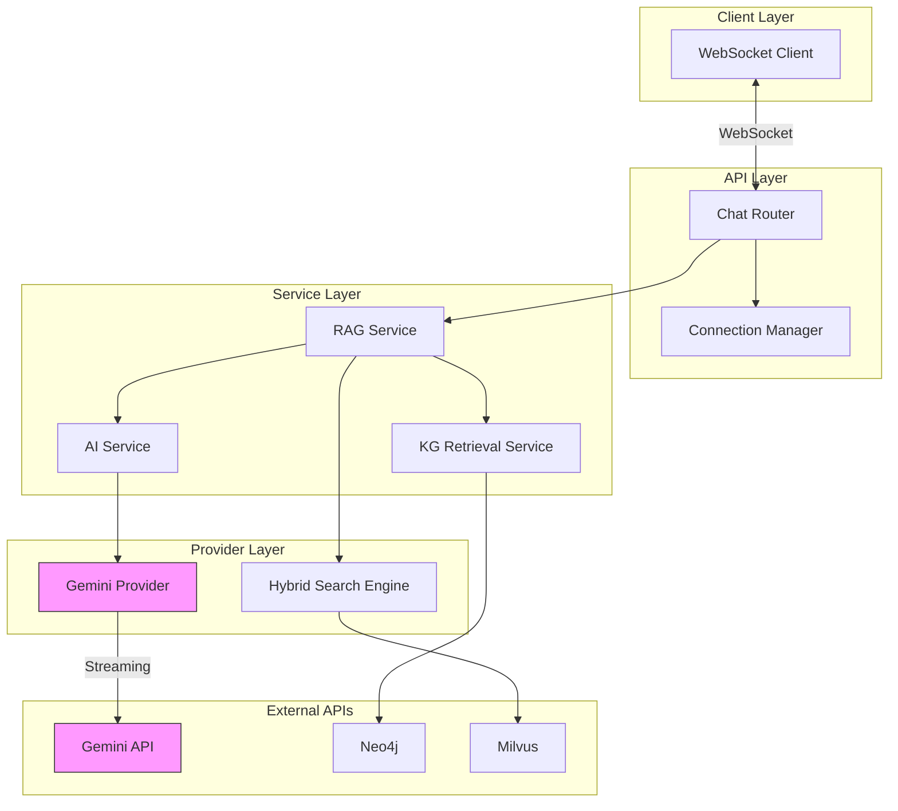
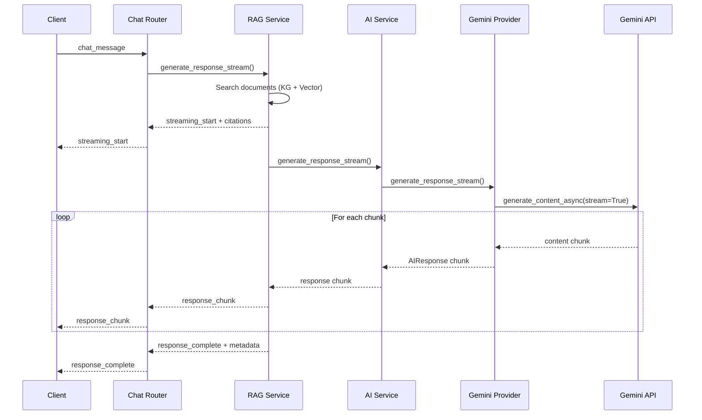

# Design Document: Gemini Performance and Streaming

## Overview

This design addresses critical performance issues with the Gemini AI API integration and implements streaming responses to improve perceived performance. The current system experiences 30-second timeouts because Gemini API calls are slow, even though the KG-guided retrieval completes quickly.

The solution involves:
1. **Performance profiling** to identify bottlenecks in Gemini API calls
2. **API optimization** through parameter tuning and context size limits
3. **Streaming responses** to show partial content immediately
4. **Hybrid search fallback** to provide keyword-based retrieval when KG fails

## Architecture



### Streaming Data Flow



## Components and Interfaces

### 1. GeminiProvider (Enhanced)

Location: `src/multimodal_librarian/services/ai_service.py`

```python
@dataclass
class StreamingChunk:
    """A chunk of streaming response."""
    content: str
    is_final: bool
    cumulative_tokens: int
    chunk_index: int
    error: Optional[str] = None

@dataclass
class PerformanceMetrics:
    """Performance metrics for Gemini API calls."""
    total_calls: int
    total_time_ms: int
    avg_time_ms: float
    p95_time_ms: float
    timeout_count: int
    error_count: int
    
class GeminiProvider:
    """Enhanced Gemini provider with streaming and performance tracking."""
    
    def __init__(
        self,
        api_key: str,
        model: str = "gemini-2.5-flash",
        timeout_seconds: float = 25.0,
        max_context_chars: int = 6000
    ):
        self.api_key = api_key
        self.model = model
        self.timeout_seconds = timeout_seconds
        self.max_context_chars = max_context_chars
        self._metrics = PerformanceMetrics(...)
        
    async def generate_response_stream(
        self,
        messages: List[Dict[str, str]],
        context: Optional[str] = None,
        temperature: float = 0.7,
        max_tokens: int = 1024
    ) -> AsyncGenerator[StreamingChunk, None]:
        """Generate streaming response using Gemini API."""
        ...
        
    def get_performance_metrics(self) -> PerformanceMetrics:
        """Get current performance metrics."""
        ...
```

### 2. AIService (Enhanced)

Location: `src/multimodal_librarian/services/ai_service.py`

```python
class AIService:
    """Enhanced AI service with streaming support."""
    
    async def generate_response_stream(
        self,
        messages: List[Dict[str, str]],
        context: Optional[str] = None,
        temperature: float = 0.7,
        max_tokens: int = 1024
    ) -> AsyncGenerator[AIResponse, None]:
        """Generate streaming AI response."""
        ...
        
    def get_performance_stats(self) -> Dict[str, Any]:
        """Get performance statistics from provider."""
        ...
```

### 3. RAGService (Enhanced)

Location: `src/multimodal_librarian/services/rag_service.py`

```python
@dataclass
class RAGStreamingChunk:
    """A chunk of RAG streaming response."""
    content: str
    is_final: bool
    citations: Optional[List[CitationSource]] = None
    metadata: Optional[Dict[str, Any]] = None

class RAGService:
    """Enhanced RAG service with streaming support."""
    
    async def generate_response_stream(
        self,
        query: str,
        user_id: str,
        conversation_context: Optional[List[Dict[str, str]]] = None
    ) -> AsyncGenerator[RAGStreamingChunk, None]:
        """Generate streaming RAG response with citations."""
        # 1. Perform document search (non-streaming)
        # 2. Yield initial chunk with citations
        # 3. Stream AI generation
        # 4. Yield final chunk with metadata
        ...
```

### 4. ConnectionManager (Enhanced)

Location: `src/multimodal_librarian/api/dependencies/services.py`

```python
class ConnectionManager:
    """Enhanced connection manager with streaming support."""
    
    async def send_streaming_message(
        self,
        message_type: str,
        content: str,
        connection_id: str,
        metadata: Optional[Dict[str, Any]] = None
    ) -> None:
        """Send a streaming message chunk to a connection."""
        ...
        
    async def send_streaming_start(
        self,
        connection_id: str,
        citations: List[Dict[str, Any]]
    ) -> None:
        """Send streaming start notification with citations."""
        ...
        
    async def send_streaming_complete(
        self,
        connection_id: str,
        metadata: Dict[str, Any]
    ) -> None:
        """Send streaming complete notification."""
        ...
```

### 5. HybridSearchEngine (Enhanced)

Location: `src/multimodal_librarian/components/vector_store/hybrid_search.py`

```python
class HybridSearchEngine:
    """Enhanced hybrid search with keyword implementation."""
    
    def __init__(self, vector_store: VectorStore, config: HybridSearchConfig):
        self.vector_store = vector_store
        self.config = config
        self._tfidf_index: Optional[TfidfIndex] = None
        self._document_cache: Dict[str, str] = {}
        
    async def _keyword_search(
        self,
        query: SearchQuery,
        source_type: Optional[SourceType] = None,
        content_type: Optional[ContentType] = None,
        source_id: Optional[str] = None
    ) -> List[SearchResult]:
        """Perform keyword-based search using TF-IDF."""
        ...
        
    async def build_keyword_index(
        self,
        documents: List[Dict[str, Any]]
    ) -> None:
        """Build TF-IDF index from documents."""
        ...
```

## Data Models

### Streaming Message Types

```python
# WebSocket message types for streaming
STREAMING_MESSAGE_TYPES = {
    "streaming_start": {
        "type": "streaming_start",
        "citations": List[CitationDict],
        "timestamp": str
    },
    "response_chunk": {
        "type": "response_chunk",
        "content": str,
        "chunk_index": int,
        "timestamp": str
    },
    "response_complete": {
        "type": "response_complete",
        "metadata": {
            "confidence_score": float,
            "processing_time_ms": int,
            "tokens_used": int,
            "search_results_count": int,
            "kg_retrieval_used": bool
        },
        "timestamp": str
    }
}
```

### Performance Tracking Data

```python
@dataclass
class APICallMetrics:
    """Metrics for a single API call."""
    call_id: str
    start_time: float
    end_time: float
    duration_ms: int
    prompt_chars: int
    prompt_tokens_estimate: int
    response_chars: int
    response_tokens: int
    success: bool
    error: Optional[str] = None
    
@dataclass
class PerformanceStats:
    """Aggregated performance statistics."""
    total_calls: int
    successful_calls: int
    failed_calls: int
    timeout_count: int
    avg_duration_ms: float
    p50_duration_ms: float
    p95_duration_ms: float
    p99_duration_ms: float
    avg_prompt_tokens: float
    avg_response_tokens: float
```

### TF-IDF Index Structure

```python
@dataclass
class TfidfIndex:
    """TF-IDF index for keyword search."""
    vectorizer: TfidfVectorizer
    document_vectors: sparse_matrix
    document_ids: List[str]
    document_metadata: Dict[str, Dict[str, Any]]
    last_updated: datetime
```

## Correctness Properties

*A property is a characteristic or behavior that should hold true across all valid executions of a system—essentially, a formal statement about what the system should do. Properties serve as the bridge between human-readable specifications and machine-verifiable correctness guarantees.*

### Property 1: API Call Metrics Capture

*For any* Gemini API call, the provider SHALL capture timing metrics including request preparation time, API call duration, and response processing time, and these metrics SHALL be accessible via the performance statistics method.

**Validates: Requirements 1.1, 1.2, 1.5**

### Property 2: Prompt Size Logging Accuracy

*For any* prompt submitted to the Gemini provider, the logged character count SHALL equal the actual prompt length, and the estimated token count SHALL be within 20% of the actual token count.

**Validates: Requirements 1.3**

### Property 3: Timeout Handling Graceful Response

*For any* Gemini API call that exceeds the configured timeout duration, the AI service SHALL return a graceful error response (not raise an exception) containing a user-friendly message.

**Validates: Requirements 2.3, 2.4**

### Property 4: Context Size Truncation

*For any* context string exceeding 6000 characters, the Gemini provider SHALL truncate it to at most 6000 characters before including it in the prompt.

**Validates: Requirements 2.5**

### Property 5: Conversation History Limiting

*For any* conversation history with more than 3 messages, the Gemini provider SHALL include only the most recent 3 messages in the prompt.

**Validates: Requirements 2.6**

### Property 6: Streaming Yields Multiple Chunks

*For any* non-trivial response (>100 characters), the streaming methods (provider and service) SHALL yield at least 2 chunks, with each chunk containing partial content and cumulative token counts.

**Validates: Requirements 3.1, 3.3, 3.4**

### Property 7: Streaming Error Graceful Termination

*For any* streaming response that encounters an error mid-stream, the AI service SHALL yield an error chunk with error information and terminate the stream without raising an unhandled exception.

**Validates: Requirements 3.5**

### Property 8: WebSocket Streaming Message Sequence

*For any* streaming chat response, the Chat Router SHALL send messages in the order: 'streaming_start' (with citations), followed by one or more 'response_chunk' messages, followed by 'response_complete' (with metadata).

**Validates: Requirements 4.3, 4.4, 4.6**

### Property 9: Streaming Cancellation on Disconnect

*For any* active streaming response, if the WebSocket connection is closed, the ongoing generation SHALL be cancelled within 1 second.

**Validates: Requirements 4.5**

### Property 10: RAG Streaming Search-First Order

*For any* RAG streaming response, document search SHALL complete before the first content chunk is yielded, and the first chunk SHALL contain citation information.

**Validates: Requirements 5.2, 5.3**

### Property 11: RAG Streaming Final Metadata

*For any* completed RAG streaming response, the final chunk SHALL contain confidence score, processing time, and search results count.

**Validates: Requirements 5.4**

### Property 12: RAG Streaming Fallback on Search Failure

*For any* RAG streaming request where document search fails, the service SHALL fall back to streaming a general AI response without raising an exception.

**Validates: Requirements 5.5**

### Property 13: KG Metadata Flow Through

*For any* successful KG retrieval, the RAG service response SHALL include KG metadata (concepts matched, retrieval source), and this metadata SHALL be present in the Chat Router response.

**Validates: Requirements 6.2, 6.3, 6.4**

### Property 14: Keyword Search Returns Matching Results

*For any* indexed document set and query containing terms present in the documents, the keyword search method SHALL return at least one result with a non-zero score.

**Validates: Requirements 7.1, 7.2**

### Property 15: Hybrid Score Weighted Combination

*For any* search result with both vector and keyword scores, the hybrid score SHALL equal (vector_weight × vector_score) + (keyword_weight × keyword_score) within floating-point tolerance.

**Validates: Requirements 7.3**

### Property 16: Keyword Fallback on Empty Vector Results

*For any* search where vector search returns no results but keyword search has matches, the hybrid search SHALL return the keyword search results.

**Validates: Requirements 7.4**

### Property 17: API Failure User-Friendly Response

*For any* Gemini API failure (network error, rate limit, invalid response), the AI service SHALL return a response containing a user-friendly error message (not a stack trace or technical error).

**Validates: Requirements 8.1**

### Property 18: Circuit Breaker State Transitions

*For any* sequence of N consecutive Gemini API failures (where N is the circuit breaker threshold), the circuit SHALL open and subsequent calls SHALL fail fast without calling the API until the reset timeout expires.

**Validates: Requirements 8.3**

### Property 19: Streaming Fallback to Non-Streaming

*For any* streaming request that fails, the Chat Router SHALL attempt a non-streaming response before returning an error to the user.

**Validates: Requirements 8.4**

### Property 20: Error Rate Streaming Disable

*For any* window where the Gemini API error rate exceeds 50%, the AI service SHALL temporarily disable streaming and use non-streaming calls until the error rate drops below the threshold.

**Validates: Requirements 8.5**

## Error Handling

### Gemini API Errors

| Error Type | Handling Strategy | User Message |
|------------|-------------------|--------------|
| Timeout | Return graceful error, log metrics | "Response is taking longer than expected. Please try again." |
| Rate Limit | Implement exponential backoff, circuit breaker | "Service is busy. Please wait a moment and try again." |
| Invalid Response | Log error, return fallback | "Unable to generate response. Please try rephrasing your question." |
| Network Error | Retry once, then fail gracefully | "Connection issue. Please check your network and try again." |
| Authentication | Log critical error, disable provider | "Service configuration error. Please contact support." |

### Streaming Errors

```python
async def handle_streaming_error(
    error: Exception,
    connection_id: str,
    manager: ConnectionManager
) -> None:
    """Handle errors during streaming response."""
    error_type = type(error).__name__
    
    # Log the error
    logger.error(f"Streaming error for {connection_id}: {error_type}: {error}")
    
    # Send error notification to client
    await manager.send_personal_message({
        'type': 'streaming_error',
        'error': 'Response generation interrupted',
        'recoverable': True,
        'timestamp': datetime.now().isoformat()
    }, connection_id)
    
    # Attempt non-streaming fallback
    try:
        fallback_response = await generate_fallback_response(...)
        await manager.send_personal_message({
            'type': 'response',
            'response': {'text_content': fallback_response},
            'metadata': {'fallback_used': True}
        }, connection_id)
    except Exception as fallback_error:
        logger.error(f"Fallback also failed: {fallback_error}")
        await manager.send_personal_message({
            'type': 'error',
            'message': 'Unable to generate response. Please try again.'
        }, connection_id)
```

### Circuit Breaker Implementation

```python
@dataclass
class CircuitBreakerConfig:
    """Configuration for circuit breaker."""
    failure_threshold: int = 5  # Failures before opening
    reset_timeout_seconds: float = 60.0  # Time before half-open
    half_open_max_calls: int = 3  # Calls allowed in half-open state

class CircuitBreaker:
    """Circuit breaker for Gemini API calls."""
    
    def __init__(self, config: CircuitBreakerConfig):
        self.config = config
        self.state = CircuitState.CLOSED
        self.failure_count = 0
        self.last_failure_time: Optional[float] = None
        self.half_open_calls = 0
        
    async def call(self, func: Callable, *args, **kwargs) -> Any:
        """Execute function with circuit breaker protection."""
        if self.state == CircuitState.OPEN:
            if self._should_attempt_reset():
                self.state = CircuitState.HALF_OPEN
                self.half_open_calls = 0
            else:
                raise CircuitOpenError("Circuit breaker is open")
        
        try:
            result = await func(*args, **kwargs)
            self._on_success()
            return result
        except Exception as e:
            self._on_failure()
            raise
```

## Testing Strategy

### Dual Testing Approach

This feature requires both unit tests and property-based tests:

- **Unit tests**: Verify specific examples, edge cases, integration points
- **Property tests**: Verify universal properties across randomized inputs

### Property-Based Testing Configuration

- **Library**: `hypothesis` for Python property-based testing
- **Minimum iterations**: 100 per property test
- **Tag format**: `Feature: gemini-performance-and-streaming, Property {N}: {description}`

### Unit Test Categories

1. **Gemini Provider Tests**
   - Test timeout handling with mocked slow responses
   - Test context truncation with various input sizes
   - Test conversation history limiting
   - Test streaming chunk generation

2. **AI Service Tests**
   - Test performance metrics aggregation
   - Test graceful error handling
   - Test streaming wrapper functionality

3. **RAG Service Tests**
   - Test streaming with citations
   - Test search-first ordering
   - Test fallback behavior

4. **WebSocket Tests**
   - Test message sequence ordering
   - Test cancellation on disconnect
   - Test error recovery

5. **Hybrid Search Tests**
   - Test keyword search implementation
   - Test score combination
   - Test fallback behavior

### Property Test Examples

```python
from hypothesis import given, strategies as st, settings

@settings(max_examples=100)
@given(context=st.text(min_size=7000, max_size=10000))
def test_context_truncation_property(context: str):
    """
    Feature: gemini-performance-and-streaming, Property 4: Context Size Truncation
    For any context exceeding 6000 chars, truncation SHALL occur.
    """
    provider = GeminiProvider(api_key="test", max_context_chars=6000)
    truncated = provider._truncate_context(context)
    assert len(truncated) <= 6000

@settings(max_examples=100)
@given(
    vector_score=st.floats(min_value=0.0, max_value=1.0),
    keyword_score=st.floats(min_value=0.0, max_value=1.0),
    vector_weight=st.floats(min_value=0.0, max_value=1.0)
)
def test_hybrid_score_combination_property(
    vector_score: float,
    keyword_score: float,
    vector_weight: float
):
    """
    Feature: gemini-performance-and-streaming, Property 15: Hybrid Score Weighted Combination
    Hybrid score SHALL equal weighted combination of vector and keyword scores.
    """
    keyword_weight = 1.0 - vector_weight
    expected = vector_weight * vector_score + keyword_weight * keyword_score
    
    result = HybridSearchResult(
        vector_score=vector_score,
        keyword_score=keyword_score
    )
    result.calculate_hybrid_score(vector_weight, keyword_weight)
    
    assert abs(result.hybrid_score - expected) < 1e-6
```

### Integration Test for KG Retrieval

```python
@pytest.mark.integration
async def test_chelsea_ai_ventures_retrieval():
    """
    Feature: gemini-performance-and-streaming, Requirement 6.1
    Verify KG-guided retrieval returns Chelsea AI Ventures quote.
    """
    kg_service = await get_kg_retrieval_service()
    result = await kg_service.retrieve("Chelsea AI Ventures")
    
    assert len(result.chunks) > 0
    assert any("Chelsea" in chunk.content for chunk in result.chunks)
    assert not result.fallback_used
```

### Mocking Strategy

All tests should use FastAPI dependency injection overrides for mocking:

```python
@pytest.fixture
def mock_gemini_api():
    """Mock Gemini API for testing."""
    with patch('google.generativeai.GenerativeModel') as mock:
        mock_instance = MagicMock()
        mock_instance.generate_content_async = AsyncMock(
            return_value=MagicMock(text="Test response")
        )
        mock.return_value = mock_instance
        yield mock_instance

@pytest.fixture
def client_with_mocks(mock_gemini_api):
    """Test client with mocked Gemini API."""
    app.dependency_overrides[get_ai_service] = lambda: AIService()
    with TestClient(app) as client:
        yield client
    app.dependency_overrides.clear()
```
