# Design Document: Graph-Native Chunk Relationships

## Overview

This design refactors the Neo4j knowledge graph schema from property-based chunk storage to graph-native `Chunk` nodes linked via `EXTRACTED_FROM` relationships. The current schema stores `source_chunks` as a comma-delimited string and `source_document` as a string property on `Concept` nodes. This is fragile, unindexable, and hits Neo4j property size limits at scale.

The target model introduces first-class `Chunk` nodes with `chunk_id` and `source_id` properties, connected to `Concept` nodes via `EXTRACTED_FROM` relationships. This makes chunk provenance traversable, indexable, and eliminates string parsing throughout the codebase.

### Key Design Decisions

1. **Chunk nodes are lightweight**: Only `chunk_id` and `source_id` properties — no content duplication from PostgreSQL/OpenSearch.
2. **MERGE-based idempotency**: All Chunk and EXTRACTED_FROM creation uses `MERGE` to safely handle re-processing.
3. **ConceptNode retains `source_chunks` in-memory**: The Python dataclass keeps the field for extraction pipeline accumulation, but it is never written to Neo4j as a property.
4. **Atomic batch operations**: Chunk + EXTRACTED_FROM creation happens in the same UNWIND transaction as concept MERGE to avoid partial states.

## Architecture

The refactor touches six layers of the system. No new services are introduced — existing services are modified to use Cypher traversal instead of property reads.

```mermaid
graph TD
    subgraph "Write Path"
        CS[CeleryService] -->|"MERGE Chunk + EXTRACTED_FROM"| Neo4j[(Neo4j)]
        CKS[ConversationKnowledgeService] -->|"MERGE Chunk + EXTRACTED_FROM"| Neo4j
    end

    subgraph "Read Path"
        KGR[KGRetrievalService] -->|"MATCH (c)-[:EXTRACTED_FROM]->(ch:Chunk)"| Neo4j
        KGQ[KnowledgeGraphQueryEngine] -->|"MATCH (ch:Chunk {source_id})<-[:EXTRACTED_FROM]-(c)"| Neo4j
        CDH[ChatDocumentHandlers] -->|"MATCH (ch:Chunk {source_id})<-[:EXTRACTED_FROM]-(c)"| Neo4j
        CSE[CompositeScoreEngine] -->|"Chunk-based traversal"| Neo4j
    end

    subgraph "Delete Path"
        PS[PrivacyService] -->|"DELETE Chunk + orphan cleanup"| Neo4j
        CKS -->|"DELETE Chunk + orphan cleanup"| Neo4j
    end

    subgraph "Cross-Document"
        ES[EnrichmentService] -->|"SAME_AS via Chunk source_id"| Neo4j
        KGS[KnowledgeGraphService] -->|"SAME_AS traversal via Chunk"| Neo4j
    end
```



### Neo4j Schema Changes

```mermaid
graph LR
    subgraph "Before"
        C1[Concept<br/>source_chunks: "c1,c2,c3"<br/>source_document: "doc-123"]
    end

    subgraph "After"
        C2[Concept<br/>no source_chunks<br/>no source_document]
        CH1[Chunk<br/>chunk_id: "c1"<br/>source_id: "doc-123"]
        CH2[Chunk<br/>chunk_id: "c2"<br/>source_id: "doc-123"]
        CH3[Chunk<br/>chunk_id: "c3"<br/>source_id: "doc-123"]
        C2 -->|EXTRACTED_FROM| CH1
        C2 -->|EXTRACTED_FROM| CH2
        C2 -->|EXTRACTED_FROM| CH3
    end
```

## Components and Interfaces

### 1. Schema Initialization (KnowledgeGraphBuilder / KnowledgeGraphService)

A one-time schema setup that creates the constraint and index on Chunk nodes. This runs during application startup or as part of the migration script.

```python
# Constraint: uniqueness on Chunk.chunk_id
"CREATE CONSTRAINT chunk_id_unique IF NOT EXISTS FOR (ch:Chunk) REQUIRE ch.chunk_id IS UNIQUE"

# Index: fast per-document lookups on Chunk.source_id
"CREATE INDEX chunk_source_id IF NOT EXISTS FOR (ch:Chunk) ON (ch.source_id)"
```

**Rationale**: The uniqueness constraint on `chunk_id` prevents duplicate Chunk nodes when re-processing. The `source_id` index enables efficient per-document queries (landing view, deletion, stats).

### 2. Write Path — CeleryService (`_update_knowledge_graph`)

Currently the celery service builds `source_chunks` as a comma-joined string and writes it as a Concept property. The new approach:

1. Collect all unique `(chunk_id, source_id)` pairs from the batch's `KnowledgeChunk` objects.
2. MERGE Chunk nodes in a single UNWIND before concept MERGE.
3. After concept MERGE returns `concept_id → node_id` mapping, MERGE EXTRACTED_FROM relationships.

```python
# Step 1: MERGE Chunk nodes
"""
UNWIND $chunk_rows AS row
MERGE (ch:Chunk {chunk_id: row.chunk_id})
ON CREATE SET ch.source_id = row.source_id, ch.created_at = row.created_at
RETURN ch.chunk_id AS chunk_id
"""

# Step 2: MERGE Concepts (existing query minus source_chunks/source_document SET clauses)

# Step 3: MERGE EXTRACTED_FROM relationships
"""
UNWIND $ef_rows AS row
MATCH (c:Concept {concept_id: row.concept_id})
MATCH (ch:Chunk {chunk_id: row.chunk_id})
MERGE (c)-[r:EXTRACTED_FROM]->(ch)
ON CREATE SET r.created_at = row.created_at
RETURN count(r) AS created
"""
```

The existing `append_rows` logic that concatenates strings (`c.source_chunks + ',' + row.new_chunks`) is removed entirely.

### 3. Write Path — ConversationKnowledgeService (`_persist_concepts`)

Same pattern as CeleryService. The `_persist_concepts` method currently writes `source_document` and `source_chunks` in its MERGE query. These SET clauses are removed and replaced with Chunk MERGE + EXTRACTED_FROM MERGE.

### 4. Read Path — KGRetrievalService

**`_retrieve_direct_chunks`**: Currently reads `concept.source_chunks` string and calls `_parse_source_chunks`. Replace with a Cypher query:

```python
"""
MATCH (c:Concept {concept_id: $concept_id})-[:EXTRACTED_FROM]->(ch:Chunk)
RETURN ch.chunk_id AS chunk_id
"""
```

**`_retrieve_related_chunks`**: Currently reads `related.source_chunks` from the traversal query result. The Cypher query in `_query_related_concepts` is updated to collect chunk IDs via EXTRACTED_FROM:

```python
f"""
MATCH (start:Concept {{concept_id: $concept_id}})
      -[r:{rel_types}]-(related:Concept)
WHERE related.concept_id <> start.concept_id
OPTIONAL MATCH (related)-[:EXTRACTED_FROM]->(ch:Chunk)
RETURN DISTINCT
    related.concept_id as concept_id,
    related.name as name,
    collect(DISTINCT ch.chunk_id) as chunk_ids,
    1 as hop_distance,
    [type(r)] as relationship_path
LIMIT 20
"""
```

The `_parse_source_chunks` method is deleted. The cache stores chunk ID lists directly (already lists, no parsing needed).

### 5. Read Path — KnowledgeGraphQueryEngine

**`_get_landing_view`**: Replace `MATCH (c:Concept {source_document: $source_id})` with:
```cypher
MATCH (ch:Chunk {source_id: $source_id})<-[:EXTRACTED_FROM]-(c:Concept)
```

**`_get_ego_graph`**: Replace `local.source_document = $source_id` filter with a subquery that checks for EXTRACTED_FROM to a Chunk with matching source_id. The `source_document` field in returned nodes is derived from Chunk traversal.

**`search_concepts_by_embedding`**: Replace `c.source_document = $source_id` filter with:
```cypher
WHERE c.embedding IS NOT NULL
  AND EXISTS { MATCH (c)-[:EXTRACTED_FROM]->(ch:Chunk {source_id: $source_id}) }
```

### 6. Read Path — ChatDocumentHandlers

Replace concept count query:
```cypher
-- Before
MATCH (c:Concept) WHERE c.source_document IN $doc_ids RETURN count(c) AS concepts

-- After
MATCH (ch:Chunk) WHERE ch.source_id IN $doc_ids
MATCH (ch)<-[:EXTRACTED_FROM]-(c:Concept)
RETURN count(DISTINCT c) AS concepts
```

Replace relationship count query:
```cypher
-- Before
MATCH (c:Concept)-[r]->() WHERE c.source_document IN $doc_ids RETURN type(r), count(r)

-- After
MATCH (ch:Chunk) WHERE ch.source_id IN $doc_ids
MATCH (ch)<-[:EXTRACTED_FROM]-(c:Concept)-[r]->()
RETURN type(r) AS rel_type, count(r) AS cnt
```

### 7. Read Path — CompositeScoreEngine

**`_discover_cross_doc_edges`**: Replace `c1.source_document` matching with Chunk traversal:
```cypher
MATCH (ch:Chunk {source_id: $doc_id})<-[:EXTRACTED_FROM]-(c1:Concept)-[r]->(c2:Concept)
WHERE NOT EXISTS { MATCH (c2)-[:EXTRACTED_FROM]->(ch2:Chunk {source_id: $doc_id}) }
  AND type(r) IN $rel_types
OPTIONAL MATCH (c1)-[:EXTRACTED_FROM]->(ch1:Chunk)
OPTIONAL MATCH (c2)-[:EXTRACTED_FROM]->(ch2b:Chunk)
RETURN c1.concept_id AS src_id,
       ch1.source_id AS src_doc,
       c1.embedding AS src_emb,
       c2.concept_id AS tgt_id,
       ch2b.source_id AS tgt_doc,
       c2.embedding AS tgt_emb,
       type(r) AS rel_type,
       r.weight AS cn_weight
```

**`_get_concept_counts`**: Replace `MATCH (c:Concept {source_document: did})` with Chunk-based traversal:
```cypher
UNWIND $doc_ids AS did
MATCH (ch:Chunk {source_id: did})<-[:EXTRACTED_FROM]-(c:Concept)
RETURN did AS doc_id, count(DISTINCT c) AS concept_count
```

### 8. Delete Path — PrivacyService

Replace the current `DETACH DELETE` on Concept nodes with a three-step process:

```python
# Step 1: Delete EXTRACTED_FROM relationships to this source's chunks
"""
MATCH (ch:Chunk {source_id: $source_id})<-[r:EXTRACTED_FROM]-(c:Concept)
DELETE r
RETURN count(r) AS deleted_rels
"""

# Step 2: Delete Chunk nodes for this source
"""
MATCH (ch:Chunk {source_id: $source_id})
DELETE ch
RETURN count(ch) AS deleted_chunks
"""

# Step 3: Delete orphaned Concepts (no remaining EXTRACTED_FROM)
"""
MATCH (c:Concept)
WHERE NOT EXISTS { MATCH (c)-[:EXTRACTED_FROM]->() }
  AND NOT EXISTS { MATCH (c)<-[:SAME_AS]-() }
DETACH DELETE c
RETURN count(c) AS deleted_concepts
"""
```

The orphan cleanup in step 3 also checks for SAME_AS relationships to avoid deleting concepts that are still cross-document linked but happen to have lost their last chunk reference from this particular source.

### 9. Delete Path — ConversationKnowledgeService (`_remove_kg_data`)

Same three-step pattern as PrivacyService. Replace the current `MATCH (c:Concept {source_document: $source_id}) DETACH DELETE c` with the Chunk-based deletion + orphan cleanup.

### 10. Cross-Document — EnrichmentService

**`create_cross_document_links`**: Currently compares `concept.source_document` with `other_document_id`. Replace with Chunk traversal to derive document IDs:

```python
query = """
MATCH (c:Concept)
WHERE c.yago_qid = $q_number AND c.concept_id <> $concept_id
OPTIONAL MATCH (c)-[:EXTRACTED_FROM]->(ch:Chunk)
RETURN c.concept_id as concept_id, collect(DISTINCT ch.source_id) as document_ids
"""
```

Then compare the concept's source_ids (from its Chunk nodes) against the current document's source_id.

### 11. Cross-Document — KnowledgeGraphService (`query_with_same_as_traversal`)

Replace `related.source_document <> start.source_document` with Chunk-based document derivation:

```cypher
MATCH (start:Concept {concept_id: $concept_id})
MATCH (start)-[:SAME_AS*1..2]-(related:Concept)
WITH start, related
MATCH (start)-[:EXTRACTED_FROM]->(sch:Chunk)
MATCH (related)-[:EXTRACTED_FROM]->(rch:Chunk)
WHERE NOT rch.source_id IN collect(DISTINCT sch.source_id)
RETURN DISTINCT
    related.concept_id as concept_id,
    related.name as name,
    collect(DISTINCT rch.source_id) as document_ids,
    related.yago_qid as q_number
```

### 11. In-Memory Model — ConceptNode

The `ConceptNode` dataclass retains `source_chunks: List[str]` and `source_document: Optional[str]` for in-memory use during extraction. The `to_dict()` method continues to include these fields for non-Neo4j consumers. The `add_source_chunk()` method is unchanged.

The key change is at the persistence boundary: when `CeleryService` or `ConversationKnowledgeService` writes to Neo4j, they translate `source_chunks` into EXTRACTED_FROM relationships instead of writing the list as a property.


## Data Models

### Neo4j Node: Chunk

| Property | Type | Constraints | Description |
|----------|------|-------------|-------------|
| `chunk_id` | string | UNIQUE constraint | Matches the chunk ID in PostgreSQL/OpenSearch |
| `source_id` | string | Indexed | Document ID or conversation thread ID |
| `created_at` | string (ISO 8601) | — | Timestamp of node creation |

### Neo4j Relationship: EXTRACTED_FROM

| Property | Type | Description |
|----------|------|-------------|
| `created_at` | string (ISO 8601) | Timestamp of relationship creation |

Direction: `(Concept)-[:EXTRACTED_FROM]->(Chunk)`

### Python Dataclass: ConceptNode (modified)

```python
@dataclass
class ConceptNode:
    concept_id: str
    concept_name: str
    concept_type: str = "ENTITY"
    aliases: List[str] = field(default_factory=list)
    confidence: float = 0.0
    source_chunks: List[str] = field(default_factory=list)  # Retained for in-memory use
    source_document: Optional[str] = None  # Retained for in-memory use
    external_ids: Dict[str, str] = field(default_factory=dict)
```

The fields `source_chunks` and `source_document` remain on the dataclass for in-memory accumulation during extraction pipelines. They are NOT written to Neo4j Concept node properties. Instead, at persistence time, they are translated into Chunk nodes and EXTRACTED_FROM relationships.

### Cypher Write Pattern (Batch)

```cypher
-- 1. MERGE Chunk nodes
UNWIND $chunk_rows AS row
MERGE (ch:Chunk {chunk_id: row.chunk_id})
ON CREATE SET ch.source_id = row.source_id, ch.created_at = row.created_at

-- 2. MERGE Concept nodes (no source_chunks/source_document SET)
UNWIND $concept_rows AS row
MERGE (c:Concept {concept_id: row.concept_id})
ON CREATE SET c.name = row.name, c.type = row.type,
              c.confidence = row.confidence,
              c.created_at = row.created_at,
              c.updated_at = row.updated_at
ON MATCH SET c.updated_at = row.updated_at

-- 3. MERGE EXTRACTED_FROM relationships
UNWIND $ef_rows AS row
MATCH (c:Concept {concept_id: row.concept_id})
MATCH (ch:Chunk {chunk_id: row.chunk_id})
MERGE (c)-[r:EXTRACTED_FROM]->(ch)
ON CREATE SET r.created_at = row.created_at
```

### Cypher Read Pattern (Per-Document Concepts)

```cypher
-- Find all concepts for a document
MATCH (ch:Chunk {source_id: $source_id})<-[:EXTRACTED_FROM]-(c:Concept)
RETURN DISTINCT c.concept_id, c.name, c.type

-- Find chunk IDs for a concept
MATCH (c:Concept {concept_id: $concept_id})-[:EXTRACTED_FROM]->(ch:Chunk)
RETURN ch.chunk_id

-- Derive document IDs for a concept
MATCH (c:Concept {concept_id: $concept_id})-[:EXTRACTED_FROM]->(ch:Chunk)
RETURN DISTINCT ch.source_id
```

### Cypher Delete Pattern (Per-Document Cleanup)

```cypher
-- Step 1: Remove EXTRACTED_FROM edges
MATCH (ch:Chunk {source_id: $source_id})<-[r:EXTRACTED_FROM]-(c:Concept)
DELETE r

-- Step 2: Remove Chunk nodes
MATCH (ch:Chunk {source_id: $source_id})
DELETE ch

-- Step 3: Remove orphaned Concepts
MATCH (c:Concept)
WHERE NOT EXISTS { MATCH (c)-[:EXTRACTED_FROM]->() }
DETACH DELETE c
```


## Correctness Properties

*A property is a characteristic or behavior that should hold true across all valid executions of a system — essentially, a formal statement about what the system should do. Properties serve as the bridge between human-readable specifications and machine-verifiable correctness guarantees.*

### Property 1: Write-path round-trip (source_chunks ↔ EXTRACTED_FROM)

*For any* ConceptNode with a non-empty `source_chunks` list and a `source_document`, after persisting to Neo4j via any write path (CeleryService or ConversationKnowledgeService), querying `MATCH (c:Concept {concept_id: $id})-[:EXTRACTED_FROM]->(ch:Chunk) RETURN ch.chunk_id` should return exactly the same set of chunk IDs as the original `source_chunks` list, and each Chunk's `source_id` should equal the original `source_document`.

**Validates: Requirements 3.1, 3.2, 4.2, 5.2, 6.1, 11.3**

### Property 2: Write-path MERGE idempotency

*For any* set of (concept, chunk) pairs, executing the write path (Chunk MERGE + Concept MERGE + EXTRACTED_FROM MERGE) twice with identical inputs should produce exactly the same number of Chunk nodes, Concept nodes, and EXTRACTED_FROM relationships as executing it once.

**Validates: Requirements 1.2, 2.2**

### Property 3: No property-based chunk storage after persistence

*For any* Concept node in Neo4j after being written by any write path (CeleryService, ConversationKnowledgeService, EnrichmentService, or migration script), the node should have no `source_chunks` property and no `source_document` property.

**Validates: Requirements 3.3, 3.4, 3.5, 3.6**

### Property 4: Chunk nodes carry correct source_id

*For any* document or conversation processing run with a known source ID, all Chunk nodes created during that run should have `source_id` equal to the document ID or thread ID, and `chunk_id` matching one of the input chunk IDs.

**Validates: Requirements 1.1, 4.1, 5.1**

### Property 5: Existing EXTRACTED_FROM relationships preserved on re-MERGE

*For any* Concept that already has N EXTRACTED_FROM relationships to Chunk nodes, persisting the same Concept with M additional source_chunks should result in the Concept having at least N + M' EXTRACTED_FROM relationships (where M' is the count of genuinely new chunk IDs), and all N original relationships should still exist.

**Validates: Requirements 4.3**

### Property 6: Per-document concept and relationship counts via Chunk traversal

*For any* source_id with known Chunk and Concept data, the query `MATCH (ch:Chunk {source_id: $sid})<-[:EXTRACTED_FROM]-(c:Concept) RETURN count(DISTINCT c)` should return the exact number of distinct concepts linked to that source's chunks, and the relationship count query should return accurate counts of outgoing relationships from those concepts.

**Validates: Requirements 7.1, 7.2, 7.3, 8.1**

### Property 7: Source deletion removes all Chunks and EXTRACTED_FROM for that source

*For any* source_id, after executing the deletion procedure, there should be zero Chunk nodes with that `source_id` and zero EXTRACTED_FROM relationships pointing to Chunk nodes that had that `source_id`.

**Validates: Requirements 9.1, 9.2, 5.3**

### Property 8: Orphan cleanup correctness

*For any* Concept node, after a source deletion: if the Concept has zero remaining EXTRACTED_FROM relationships (and no SAME_AS relationships), it should be deleted. If the Concept still has at least one EXTRACTED_FROM relationship to a Chunk from another source, it should be retained with all its other relationships intact.

**Validates: Requirements 9.3, 9.4**

### Property 9: Cross-document SAME_AS uses Chunk-derived document IDs

*For any* pair of Concepts sharing a YAGO Q-number, the cross-document check should compare document IDs derived from `(Concept)-[:EXTRACTED_FROM]->(Chunk).source_id` traversal. A SAME_AS relationship should only be created when the two concepts have no overlapping `source_id` values across their respective Chunk nodes.

**Validates: Requirements 10.1, 10.2**

### Property 10: ConceptNode in-memory accumulation round-trip

*For any* ConceptNode and any list of chunk_id strings, calling `add_source_chunk` for each chunk_id and then calling `to_dict()` should produce a dictionary where `source_chunks` contains exactly the deduplicated set of added chunk IDs.

**Validates: Requirements 11.1, 11.2, 11.4**

## Error Handling

### Write Path Failures

- **Chunk MERGE failure**: If Chunk node creation fails mid-batch, the transaction rolls back. Concepts from that sub-batch are not persisted. The next retry re-processes the entire batch (MERGE is idempotent).
- **EXTRACTED_FROM MERGE failure**: If relationship creation fails after Chunk and Concept nodes are committed, orphaned Chunk nodes may exist. These are harmless (no data loss) and will be linked on retry.
- **Partial batch failure**: The CeleryService already processes in sub-batches with try/except per sub-batch. This pattern is preserved — a failed sub-batch logs a warning and processing continues with the next sub-batch.

### Read Path Failures

- **Missing Chunk nodes**: If a Concept has no EXTRACTED_FROM relationships (e.g., pre-migration data not yet migrated), the retrieval service returns an empty chunk list for that concept. This degrades gracefully — the concept is still found by KG search but contributes no chunks to RAG retrieval.
- **Neo4j connection failure**: All read paths already handle Neo4j unavailability with try/except and return empty results. No change needed.

### Delete Path Failures

- **Partial deletion**: If step 1 (delete EXTRACTED_FROM) succeeds but step 2 (delete Chunks) fails, orphaned Chunk nodes remain. These are cleaned up on retry. If step 3 (orphan cleanup) fails, orphaned Concepts remain but are harmless.
- **Concurrent deletion**: Two concurrent deletions for different source_ids may both attempt orphan cleanup. MERGE-based operations and the WHERE clause (`NOT EXISTS { MATCH (c)-[:EXTRACTED_FROM]->() }`) ensure correctness under concurrency.

## Testing Strategy

### Property-Based Testing

Use `hypothesis` as the property-based testing library for Python. Each property test runs a minimum of 100 iterations.

All property tests use a mock Neo4j client that maintains an in-memory graph (nodes and relationships as dictionaries) to verify Cypher query correctness without requiring a running Neo4j instance.

Property tests to implement (mapped to design properties):

1. **Property 1 test**: Generate random ConceptNodes with random source_chunks lists. Persist via the write path. Query EXTRACTED_FROM traversal. Assert chunk_id sets match.
   - Tag: `Feature: graph-native-chunk-relationships, Property 1: Write-path round-trip`

2. **Property 2 test**: Generate random write inputs. Execute write path twice. Assert node/relationship counts are identical.
   - Tag: `Feature: graph-native-chunk-relationships, Property 2: Write-path MERGE idempotency`

3. **Property 3 test**: Generate random concepts, persist via any write path. Assert no Concept node has `source_chunks` or `source_document` properties.
   - Tag: `Feature: graph-native-chunk-relationships, Property 3: No property-based chunk storage`

4. **Property 4 test**: Generate random document_id and chunk list. Persist. Assert all Chunk nodes have correct source_id.
   - Tag: `Feature: graph-native-chunk-relationships, Property 4: Chunk nodes carry correct source_id`

5. **Property 5 test**: Create a concept with initial chunks. Add more chunks. Assert original relationships still exist and new ones are added.
   - Tag: `Feature: graph-native-chunk-relationships, Property 5: Existing EXTRACTED_FROM preserved`

6. **Property 6 test**: Create known graph structure. Query counts. Assert counts match expected values.
   - Tag: `Feature: graph-native-chunk-relationships, Property 6: Per-document counts via Chunk traversal`

7. **Property 7 test**: Create chunks for a source. Delete. Assert zero Chunks and zero EXTRACTED_FROM for that source.
   - Tag: `Feature: graph-native-chunk-relationships, Property 7: Source deletion removes Chunks`

8. **Property 8 test**: Create concepts linked to chunks from multiple sources. Delete one source. Assert orphans are deleted and shared concepts are retained.
   - Tag: `Feature: graph-native-chunk-relationships, Property 8: Orphan cleanup correctness`

9. **Property 9 test**: Create concepts with Chunks from different sources sharing a Q-number. Assert SAME_AS is only created when source_ids don't overlap.
   - Tag: `Feature: graph-native-chunk-relationships, Property 9: Cross-document SAME_AS via Chunk`

10. **Property 10 test**: Generate random chunk_id lists. Create ConceptNode, call add_source_chunk for each. Assert to_dict() contains deduplicated list.
    - Tag: `Feature: graph-native-chunk-relationships, Property 10: ConceptNode in-memory round-trip`

### Unit Tests

Unit tests complement property tests for specific examples and edge cases:

- **Schema initialization**: Verify constraint and index creation queries are correct (Requirements 1.3, 1.4)
- **Empty source_chunks**: Verify a concept with no source_chunks creates no EXTRACTED_FROM relationships
- **_parse_source_chunks removal**: Verify the method no longer exists on KGRetrievalService (Requirement 6.3)
- **ConceptNode.to_dict() includes source_chunks**: Verify serialization format (Requirement 11.2)
- **Deletion with no Chunk nodes**: Verify deletion is a no-op when no Chunks exist for a source_id
- **Ego graph cross-source click**: Verify ego graph works when focus concept is from a different source (Requirement 8.2)

### Integration Tests

Integration tests run against a real Neo4j instance (Docker):

- End-to-end document processing: Upload a document, verify Chunk nodes and EXTRACTED_FROM relationships in Neo4j
- End-to-end deletion: Process a document, delete it, verify clean graph state
- Cross-document linking: Process two documents with shared concepts, verify SAME_AS relationships use Chunk traversal
