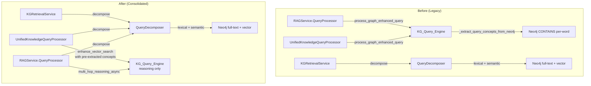

# Design Document: KG Concept Extraction Consolidation

## Overview

This feature consolidates two parallel concept extraction pipelines into one. The existing `QueryDecomposer` (already implemented by the semantic-concept-matching spec) becomes the single source of concept extraction for the entire system. The legacy `KnowledgeGraphQueryEngine.process_graph_enhanced_query()` path and its internal `_extract_query_concepts_from_neo4j` method are removed.

The changes are purely wiring and cleanup — no new matching logic is added. The `QueryDecomposer.decompose()` method already provides lexical + semantic matching. This spec:

1. Rewires `RAGService.QueryProcessor` to use `QueryDecomposer` instead of `KG_Query_Engine`
2. Rewires `UnifiedKnowledgeQueryProcessor._enhance_with_reasoning` similarly
3. Rewires `RAGService.get_knowledge_graph_insights` similarly
4. Refactors `enhance_vector_search` to accept pre-extracted concepts (no internal extraction)
5. Removes the now-dead legacy methods from `KG_Query_Engine`
6. Updates DI wiring and tests

## Architecture



### Key Design Decisions

1. **QueryProcessor takes QueryDecomposer, not KG_Query_Engine**: The `QueryProcessor.__init__` signature changes from `kg_query_engine: Optional[KnowledgeGraphQueryEngine]` to `query_decomposer: Optional[QueryDecomposer]`. Since `QueryProcessor.process_query()` only used `process_graph_enhanced_query` for concept extraction, the `QueryDecomposer` is a direct replacement.

2. **RAGService still holds KG_Query_Engine for non-extraction uses**: `RAGService` retains `kg_query_engine` for `get_knowledge_graph_insights` (which needs `multi_hop_reasoning_async` and `get_related_concepts_async`). But concept extraction in that method also switches to `QueryDecomposer`.

3. **enhance_vector_search becomes a pure re-ranker**: The method's signature changes to require `concept_names: List[str]` instead of extracting them internally. All internal calls to `_extract_query_concepts_from_neo4j` are removed. If the concept list is empty, it returns results unchanged.

4. **DI wiring reuses existing KGRetrievalService's QueryDecomposer**: The `get_rag_service` DI provider already has access to `KGRetrievalService` (which owns a `QueryDecomposer`). Rather than creating a second `QueryDecomposer` instance, we either extract it from `KGRetrievalService` or create a shared DI provider `get_query_decomposer` that both services consume.

## Components and Interfaces

### 1. QueryProcessor (modified)

**File**: `src/multimodal_librarian/services/rag_service.py`

```python
class QueryProcessor:
    """Process and enhance user queries for better retrieval."""
    
    def __init__(
        self,
        ai_service: AIService,
        query_decomposer: Optional[QueryDecomposer] = None
    ):
        self.ai_service = ai_service
        self.query_decomposer = query_decomposer
    
    async def process_query(
        self,
        query: str,
        conversation_context: Optional[List[Dict[str, str]]] = None
    ) -> Tuple[str, List[str], Dict[str, Any]]:
        """
        Returns (enhanced_query, related_concepts, kg_metadata).
        Output contract unchanged.
        """
        kg_metadata = {}
        related_concepts = []
        
        # Step 1: Extract concepts via QueryDecomposer
        if self.query_decomposer:
            try:
                decomposition = await self.query_decomposer.decompose(query)
                
                related_concepts = [
                    m.get('name', '') 
                    for m in decomposition.concept_matches[:5]
                    if m.get('name')
                ]
                
                kg_metadata = {
                    "related_concepts": len(decomposition.concept_matches),
                    "has_kg_matches": decomposition.has_kg_matches,
                    "match_types": list({
                        m.get('match_type', 'unknown')
                        for m in decomposition.concept_matches
                    }),
                    "entities": decomposition.entities[:5],
                }
            except Exception as e:
                logger.warning(f"QueryDecomposer failed: {e}")
        
        # Step 2: AI-based query enhancement (unchanged)
        enhanced_query = query
        if conversation_context and len(conversation_context) > 1:
            # ... existing AI enhancement logic unchanged ...
            pass
        
        return enhanced_query, related_concepts, kg_metadata
```

### 2. RAGService (modified constructor)

**File**: `src/multimodal_librarian/services/rag_service.py`

```python
class RAGService:
    def __init__(
        self,
        vector_client: VectorStoreClient = None,
        ai_service: AIService = None,
        kg_builder: Optional[KnowledgeGraphBuilder] = None,
        kg_query_engine: Optional[KnowledgeGraphQueryEngine] = None,
        kg_retrieval_service: Optional["KGRetrievalService"] = None,
        source_prioritization_engine: Optional["SourcePrioritizationEngine"] = None,
        query_decomposer: Optional["QueryDecomposer"] = None,  # NEW
        opensearch_client: Any = None  # Legacy
    ):
        # ... existing init ...
        
        # Store query_decomposer for QueryProcessor and get_knowledge_graph_insights
        self.query_decomposer = query_decomposer
        
        # QueryProcessor now takes query_decomposer instead of kg_query_engine
        self.query_processor = QueryProcessor(self.ai_service, self.query_decomposer)
```

### 3. enhance_vector_search (refactored)

**File**: `src/multimodal_librarian/components/knowledge_graph/kg_query_engine.py`

```python
def enhance_vector_search(
    self,
    query: str,
    vector_results: List[KnowledgeChunk],
    concept_names: List[str]  # NEW: required, no internal extraction
) -> List[KnowledgeChunk]:
    """Re-rank vector results using pre-extracted KG concepts."""
    if not vector_results or not concept_names:
        return vector_results
    
    # Find related concepts for re-ranking
    related_concepts = []
    for name in concept_names[:3]:
        try:
            related = self.get_related_concepts(
                name,
                ["RELATED_TO", "IS_A", "PART_OF"],
                max_distance=2
            )
            related_concepts.extend(related)
        except Exception:
            continue
    
    if not related_concepts:
        return vector_results
    
    return self._rerank_by_concept_relevance(vector_results, related_concepts)
```

### 4. UnifiedKnowledgeQueryProcessor (modified)

**File**: `src/multimodal_librarian/components/query_processor/query_processor.py`

```python
class UnifiedKnowledgeQueryProcessor:
    def __init__(
        self,
        search_service: SemanticSearchService,
        conversation_manager: ConversationManager,
        kg_query_engine: Optional[KnowledgeGraphQueryEngine] = None,
        query_decomposer: Optional[QueryDecomposer] = None  # NEW
    ):
        self.search_service = search_service
        self.conversation_manager = conversation_manager
        self.kg_query_engine = kg_query_engine
        self.query_decomposer = query_decomposer
    
    def _enhance_with_reasoning(self, search_result, processed_query):
        """Enhanced to use QueryDecomposer for concept extraction."""
        if not self.query_decomposer:
            return search_result
        
        try:
            # Use QueryDecomposer for concept extraction
            import asyncio
            decomposition = asyncio.run(
                self.query_decomposer.decompose(processed_query.original_query)
            )
            concept_names = decomposition.entities
            
            # Use KG_Query_Engine only for re-ranking with pre-extracted concepts
            if self.kg_query_engine and concept_names:
                enhanced_chunks = self.kg_query_engine.enhance_vector_search(
                    processed_query.original_query,
                    search_result.chunks,
                    concept_names  # Pass pre-extracted concepts
                )
                search_result.chunks = enhanced_chunks
            
            search_result.search_metadata.update({
                'kg_enhanced': True,
                'concept_count': len(concept_names),
                'has_kg_matches': decomposition.has_kg_matches,
            })
            self.query_stats['kg_enhanced_queries'] += 1
        except Exception as e:
            logger.warning(f"KG enhancement failed: {e}")
        
        return search_result
```

### 5. get_knowledge_graph_insights (modified)

**File**: `src/multimodal_librarian/services/rag_service.py`

```python
async def get_knowledge_graph_insights(self, query: str) -> Dict[str, Any]:
    """Get KG insights using QueryDecomposer + KG_Query_Engine reasoning."""
    if not self.query_decomposer:
        return {"status": "disabled", "message": "QueryDecomposer not available"}
    
    try:
        # Step 1: Extract concepts via QueryDecomposer
        decomposition = await self.query_decomposer.decompose(query)
        
        if not decomposition.has_kg_matches:
            return {
                "status": "success",
                "query": query,
                "reasoning_paths": [],
                "related_concepts": [],
                "confidence_scores": {},
                "explanation": "No recognizable concepts found in query"
            }
        
        concept_names = decomposition.entities[:5]
        
        # Step 2: Multi-hop reasoning between concepts
        reasoning_paths = []
        if len(concept_names) > 1 and self.kg_query_engine:
            reasoning_paths = await self.kg_query_engine.multi_hop_reasoning_async(
                concept_names[:len(concept_names)//2 + 1],
                concept_names[len(concept_names)//2:],
                max_hops=3
            )
        
        # Step 3: Find related concepts
        all_related = []
        if self.kg_query_engine:
            for name in concept_names[:5]:
                related = await self.kg_query_engine.get_related_concepts_async(
                    name,
                    ["RELATED_TO", "IS_A", "PART_OF", "CAUSES", "SIMILAR_TO"],
                    max_distance=2
                )
                all_related.extend(related)
        
        # Deduplicate
        seen = set()
        unique_related = []
        for rc in all_related:
            if rc.concept.concept_id not in seen:
                seen.add(rc.concept.concept_id)
                unique_related.append(rc)
        unique_related.sort(key=lambda rc: rc.relevance_score, reverse=True)
        
        # Build response (same structure as before)
        confidence_scores = self.kg_query_engine._calculate_query_confidence_scores(
            concept_names, reasoning_paths, unique_related[:20]
        ) if self.kg_query_engine else {}
        
        return {
            "status": "success",
            "query": query,
            "reasoning_paths": [...],  # Same format
            "related_concepts": [...],  # Same format
            "confidence_scores": confidence_scores,
            "explanation": f"Found {len(concept_names)} concepts via QueryDecomposer"
        }
    except Exception as e:
        logger.error(f"Knowledge graph insights failed: {e}")
        return {"status": "error", "query": query, "error": str(e)}
```

### 6. DI Provider: get_query_decomposer

**File**: `src/multimodal_librarian/api/dependencies/services.py`

```python
_query_decomposer: Optional["QueryDecomposer"] = None

async def get_query_decomposer_optional() -> Optional["QueryDecomposer"]:
    """
    DI provider for QueryDecomposer.
    Returns None if Neo4j client is unavailable.
    """
    global _query_decomposer
    if _query_decomposer is None:
        from ...components.kg_retrieval.query_decomposer import QueryDecomposer
        
        try:
            neo4j_client = await get_neo4j_client_optional()
            model_server_client = get_model_server_client_optional()
            
            _query_decomposer = QueryDecomposer(
                neo4j_client=neo4j_client,
                model_server_client=model_server_client
            )
        except Exception as e:
            logger.warning(f"QueryDecomposer init failed: {e}")
            return None
    
    return _query_decomposer
```

The `get_rag_service` provider is updated to inject `query_decomposer`:

```python
async def get_rag_service(
    vector_client = Depends(get_vector_client_optional),
    ai_service = Depends(get_ai_service),
    kg_retrieval_service = Depends(get_kg_retrieval_service_optional),
    source_prioritization_engine = Depends(get_source_prioritization_engine_optional),
    query_decomposer = Depends(get_query_decomposer_optional)  # NEW
) -> Optional["RAGService"]:
    # ... existing logic ...
    _rag_service = RAGService(
        vector_client=vector_client,
        ai_service=ai_service,
        kg_retrieval_service=kg_retrieval_service,
        source_prioritization_engine=source_prioritization_engine,
        query_decomposer=query_decomposer  # NEW
    )
```

### 7. Methods Removed from KG_Query_Engine

The following methods are deleted from `kg_query_engine.py`:

- `_extract_query_concepts_from_neo4j` (async, ~60 lines)
- `process_graph_enhanced_query_async` (async, ~60 lines)
- `process_graph_enhanced_query` (sync wrapper, ~20 lines)
- `_extract_query_concepts` (sync legacy, ~10 lines)
- `_simple_concept_extraction` (sync fallback, ~15 lines)
- `_generate_query_explanation` (helper only used by process_graph_enhanced_query_async)
- `_calculate_query_confidence_scores` (helper — evaluate if still needed by `get_knowledge_graph_insights`)

Methods retained:
- `multi_hop_reasoning_async` / `multi_hop_reasoning`
- `get_related_concepts_async` / `get_related_concepts`
- `_find_concepts_by_name`
- `_find_related_concepts_neo4j`
- `_find_paths_between_concepts`
- `enhance_vector_search` (refactored)
- `_rerank_by_concept_relevance`
- `_expand_with_related_chunks`
- `retrieve_with_reasoning`
- `explain_reasoning`
- `generate_embeddings_async`
- `_get_neo4j_client` / `_get_model_server_client`

## Data Models

No new data models are introduced. The existing models are reused:

- **`QueryDecomposition`** (from `models/kg_retrieval.py`): Already contains `entities`, `concept_matches`, `has_kg_matches`, `actions`, `subjects`. This is the output of `QueryDecomposer.decompose()`.

- **Output_Contract tuple**: `(enhanced_query: str, related_concepts: List[str], kg_metadata: Dict[str, Any])` — unchanged. The `related_concepts` list is populated from `QueryDecomposition.concept_matches[*].name` instead of from `KnowledgeGraphQueryResult.related_concepts[*].concept.concept_name`.

- **`kg_metadata` dictionary**: The keys change slightly:
  - Before: `reasoning_paths`, `related_concepts` (count), `confidence_scores`, `kg_explanation`
  - After: `related_concepts` (count), `has_kg_matches`, `match_types`, `entities`
  - The `reasoning_paths` and `confidence_scores` keys are no longer populated by `QueryProcessor` (they were from `process_graph_enhanced_query` which is removed). The confidence scoring in `_calculate_confidence_score` already handles missing keys gracefully.


## Correctness Properties

*A property is a characteristic or behavior that should hold true across all valid executions of a system — essentially, a formal statement about what the system should do. Properties serve as the bridge between human-readable specifications and machine-verifiable correctness guarantees.*

### Property 1: Concept matches map to name strings

*For any* `QueryDecomposition` with a non-empty `concept_matches` list, the `related_concepts` output from `QueryProcessor.process_query()` should be a list of strings where each string equals the `name` field of the corresponding concept match (limited to the first 5 matches).

**Validates: Requirements 1.2**

### Property 2: QueryDecomposition maps to kg_metadata keys

*For any* `QueryDecomposition` returned by `QueryDecomposer.decompose()`, the `kg_metadata` dictionary produced by `QueryProcessor.process_query()` should contain the keys `related_concepts` (integer count of concept_matches), `has_kg_matches` (boolean matching `decomposition.has_kg_matches`), `match_types` (set of match_type values from concept_matches), and `entities` (list from decomposition.entities limited to 5).

**Validates: Requirements 1.3**

### Property 3: Missing QueryDecomposer preserves search results

*For any* `UnifiedSearchResult` and `ProcessedQuery`, when `UnifiedKnowledgeQueryProcessor` has `query_decomposer=None`, calling `_enhance_with_reasoning` should return the search result with identical chunks (same order, same content).

**Validates: Requirements 4.3**

### Property 4: Empty concept list preserves vector results

*For any* list of `KnowledgeChunk` objects and any query string, calling `enhance_vector_search(query, chunks, [])` with an empty concept list should return the exact same list of chunks in the same order.

**Validates: Requirements 5.3**

### Property 5: Confidence scoring incorporates KG metadata

*For any* non-empty list of search results and non-fallback response, when `kg_metadata` contains `has_kg_matches=True` with `related_concepts > 0`, the confidence score should be greater than or equal to the score computed with empty `kg_metadata`.

**Validates: Requirements 6.4**

### Property 6: get_knowledge_graph_insights response structure

*For any* query string, the dictionary returned by `get_knowledge_graph_insights` should contain the keys `status`, `query`, `reasoning_paths`, `related_concepts`, `confidence_scores`, and `explanation` when the status is `"success"`.

**Validates: Requirements 7.3**

## Error Handling

### Graceful Degradation Chain

The system degrades gracefully at each level:

1. **QueryDecomposer unavailable** (neo4j_client or model_server_client missing):
   - `QueryProcessor.process_query()` returns `(original_query, [], {})`
   - RAG pipeline continues with pure semantic search
   - `get_knowledge_graph_insights` returns `{"status": "disabled"}`

2. **QueryDecomposer.decompose() throws**:
   - Caught in `QueryProcessor.process_query()`, logged as warning
   - Falls back to `(original_query, [], {})`

3. **KG_Query_Engine unavailable** (for reasoning/re-ranking):
   - `_enhance_with_reasoning` skips re-ranking, returns unmodified results
   - `get_knowledge_graph_insights` returns empty reasoning_paths/related_concepts

4. **Both QueryDecomposer and KGRetrievalService unavailable**:
   - RAG pipeline falls back to pure semantic search via `_semantic_search_documents`
   - No KG metadata in response, confidence scoring uses base similarity only

### Error Logging

All degradation paths log warnings (not errors) since they represent expected degradation, not system failures. Errors are reserved for unexpected exceptions.

## Testing Strategy

### Property-Based Testing

Use `hypothesis` as the property-based testing library for Python.

Each property test should run a minimum of 100 iterations and be tagged with the property it validates.

Property tests to implement:

1. **Property 1** — Generate random `QueryDecomposition` objects with varying `concept_matches` lists. Verify the mapping to `related_concepts` names.
2. **Property 2** — Generate random `QueryDecomposition` objects. Verify `kg_metadata` contains correct keys and values derived from the decomposition.
3. **Property 3** — Generate random `UnifiedSearchResult` objects. Verify `_enhance_with_reasoning` returns them unchanged when `query_decomposer` is None.
4. **Property 4** — Generate random lists of `KnowledgeChunk` objects. Verify `enhance_vector_search` with empty concepts returns them unchanged.
5. **Property 5** — Generate random search result lists and `kg_metadata` dicts. Verify confidence scoring is >= baseline when KG metadata is present.
6. **Property 6** — Generate random query strings. Verify `get_knowledge_graph_insights` response structure.

### Unit Tests

Unit tests cover specific examples and edge cases:

- `QueryProcessor` with a mock `QueryDecomposer` returning known concept matches → verify exact output
- `QueryProcessor` with `query_decomposer=None` → verify graceful degradation
- `RAGService` constructor with and without `query_decomposer` parameter
- `enhance_vector_search` with pre-extracted concepts → verify re-ranking occurs
- `enhance_vector_search` with empty concepts → verify passthrough
- `_enhance_with_reasoning` with mock `QueryDecomposer` → verify `decompose()` is called
- `get_knowledge_graph_insights` with mock `QueryDecomposer` → verify reasoning methods called
- Verify removed methods (`process_graph_enhanced_query`, `_extract_query_concepts_from_neo4j`, etc.) no longer exist on `KnowledgeGraphQueryEngine`
- DI provider `get_query_decomposer_optional` returns `QueryDecomposer` or `None`

### Integration Tests

- Full RAG pipeline with `QueryDecomposer` injected via DI overrides
- Full RAG pipeline with `QueryDecomposer` unavailable (None) — verify graceful fallback
- `get_knowledge_graph_insights` end-to-end with mocked Neo4j responses
