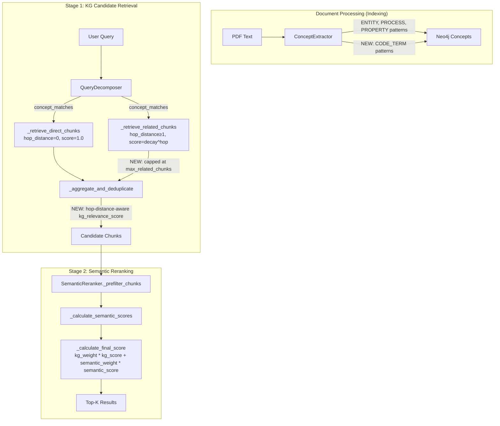

# Design Document: KG Concept Resolution Quality

## Overview

This design addresses two root causes of missing cited sources in RAG query results:

1. **Concept Extraction Gap**: The `ConceptExtractor.extract_concepts_ner()` method uses regex patterns that only match natural language patterns (proper nouns, gerunds, abstract nouns). Code-specific terms like `allow_dangerous_code`, `getData()`, and `config.settings` are never extracted, so they cannot be matched at query time.

2. **Reranking Dilution**: Relationship traversal in `KGRetrievalService._stage1_kg_retrieval()` fans out to hundreds of chunks. The `SemanticReranker` treats all chunks equally regardless of hop distance, so direct-concept chunks (hop_distance=0) get lost among loosely related traversal chunks.

The fix is surgical: add new regex patterns for code terms in `ConceptExtractor`, apply hop-distance-based decay to KG relevance scores in `KGRetrievalService`, and cap the number of related chunks passed to the reranker.

## Architecture

The changes touch three components in the existing two-stage KG retrieval pipeline:



No new services or components are introduced. All changes are modifications to existing classes.

## Components and Interfaces

### 1. ConceptExtractor (Modified)

**File**: `src/multimodal_librarian/components/knowledge_graph/kg_builder.py`

**Change**: Add a `CODE_TERM` category to `self.concept_patterns` in `__init__`.

```python
# New patterns added to self.concept_patterns
'CODE_TERM': [
    r'\b[a-z][a-z0-9]*(?:_[a-z0-9]+)+\b',                    # snake_case: allow_dangerous_code, max_retries
    r'\b[a-z][a-zA-Z0-9]*[A-Z][a-zA-Z0-9]*\b',               # camelCase: getData, processDocument
    r'\b[A-Z][a-z]+(?:[A-Z][a-z]+)+\b',                       # PascalCase: ConnectionManager, DataProcessor
    r'\b[a-zA-Z_][a-zA-Z0-9_]*=[A-Za-z0-9_]+\b',             # param assignment: allowed_dangerous_code=True
    r'\b[a-zA-Z_][a-zA-Z0-9_]*\(\)',                           # function calls: process_document(), getData()
    r'\b[a-z][a-z0-9]*(?:\.[a-z][a-z0-9_]*){1,4}\b',         # dotted: os.path.join, config.settings
]
```

**Method changes to `extract_concepts_ner()`**: None — the existing loop over `self.concept_patterns` already iterates all categories. Adding `CODE_TERM` to the dict is sufficient.

**Confidence**: Code term concepts get the same default NER confidence of `0.7`.

### 2. KGRetrievalService (Modified)

**File**: `src/multimodal_librarian/services/kg_retrieval_service.py`

**Change 1**: Add `max_related_chunks` parameter to `__init__` (default: 50).

```python
def __init__(self, ..., max_related_chunks: int = 50):
    self._max_related_chunks = max_related_chunks
```

**Change 2**: Apply hop-distance-based decay to `kg_relevance_score` when creating `RetrievedChunk` objects during aggregation. Add a `hop_distance_decay` parameter (default: 0.5).

```python
def __init__(self, ..., hop_distance_decay: float = 0.5):
    self._hop_distance_decay = hop_distance_decay
```

**Change 3**: Modify `_aggregate_and_deduplicate()` to:
- Set `kg_relevance_score = 1.0` for direct chunks
- Set `kg_relevance_score = decay ^ hop_distance` for related chunks using `ChunkSourceMapping.hop_distance`
- Cap related chunks at `_max_related_chunks`, keeping those with lowest hop_distance first

```python
def _aggregate_and_deduplicate(
    self,
    direct_chunks: List[RetrievedChunk],
    related_chunks: List[RetrievedChunk],
    source_mappings: Dict[str, ChunkSourceMapping],
) -> List[RetrievedChunk]:
    seen_ids: Set[str] = set()
    aggregated: List[RetrievedChunk] = []

    # Direct chunks: score = 1.0, always included
    for chunk in direct_chunks:
        if chunk.chunk_id not in seen_ids:
            chunk.kg_relevance_score = 1.0
            seen_ids.add(chunk.chunk_id)
            aggregated.append(chunk)

    # Related chunks: sort by hop_distance, cap at max, apply decay
    sorted_related = sorted(
        related_chunks,
        key=lambda c: source_mappings.get(c.chunk_id, ChunkSourceMapping(...)).hop_distance
    )
    related_count = 0
    for chunk in sorted_related:
        if chunk.chunk_id not in seen_ids and related_count < self._max_related_chunks:
            mapping = source_mappings.get(chunk.chunk_id)
            hop = mapping.hop_distance if mapping else 1
            chunk.kg_relevance_score = self._hop_distance_decay ** hop
            seen_ids.add(chunk.chunk_id)
            aggregated.append(chunk)
            related_count += 1

    return aggregated
```

**Change 4**: Update `_stage1_kg_retrieval()` to pass `source_mappings` to `_aggregate_and_deduplicate()`.

### 3. ChunkSourceMapping (Modified)

**File**: `src/multimodal_librarian/models/kg_retrieval.py`

**Change**: Update `get_relevance_score()` to accept a configurable decay factor instead of hardcoded `0.7`.

```python
def get_relevance_score(self, decay_factor: float = 0.5) -> float:
    if self.hop_distance == 0:
        return 1.0
    return decay_factor ** self.hop_distance
```

### 4. SemanticReranker (No Changes)

The `SemanticReranker._calculate_final_score()` already uses `kg_weight * kg_score + semantic_weight * semantic_score`. Since we now set `kg_relevance_score` correctly based on hop distance before chunks reach the reranker, no changes are needed in the reranker itself. The hop-distance signal flows through the existing `kg_relevance_score` field.

## Data Models

### Modified Fields

**RetrievedChunk** — no schema changes. The `kg_relevance_score` field already exists and will now be populated with hop-distance-aware values instead of the default `1.0`.

**ChunkSourceMapping** — no schema changes. The `hop_distance` field already exists. The `get_relevance_score()` method signature changes to accept an optional `decay_factor` parameter.

### New Configuration Parameters

| Parameter | Location | Default | Description |
|-----------|----------|---------|-------------|
| `max_related_chunks` | `KGRetrievalService.__init__` | 50 | Maximum related chunks passed to reranker |
| `hop_distance_decay` | `KGRetrievalService.__init__` | 0.5 | Decay factor per hop for KG relevance score |

### Concept Pattern Category

New `CODE_TERM` concept type added to `ConceptExtractor.concept_patterns`. Concepts extracted with this type get `concept_type="CODE_TERM"` in the `ConceptNode`.


## Correctness Properties

*A property is a characteristic or behavior that should hold true across all valid executions of a system — essentially, a formal statement about what the system should do. Properties serve as the bridge between human-readable specifications and machine-verifiable correctness guarantees.*

### Property 1: Code term extraction

*For any* text containing a code-like term (snake_case identifier, camelCase identifier, PascalCase identifier, parameter assignment, function call, or dotted identifier), calling `extract_concepts_ner()` on that text should return a concept list that includes a concept whose `concept_name` matches the code term and whose `concept_type` is `CODE_TERM`.

**Validates: Requirements 1.1, 1.2, 1.3, 1.4, 1.5, 1.6**

### Property 2: Existing pattern backward compatibility

*For any* text containing a proper noun (matching ENTITY patterns), a gerund (matching PROCESS patterns), or an abstract noun (matching PROPERTY patterns), calling `extract_concepts_ner()` on that text should return a concept list that includes a concept matching the term with the corresponding original concept type (ENTITY, PROCESS, or PROPERTY).

**Validates: Requirements 4.1, 4.2, 4.3, 4.4**

### Property 3: Hop-distance decay scoring

*For any* chunk with `hop_distance = h` and configurable `decay_factor = d`, the assigned `kg_relevance_score` should equal `d ^ h`. In particular, direct chunks (h=0) always get score 1.0 regardless of the decay factor.

**Validates: Requirements 2.1, 2.2**

### Property 4: Hop-distance tiebreaking in ranking

*For any* two chunks with equal semantic similarity scores but different hop distances, after reranking, the chunk with the lower hop distance should be ranked higher (appear earlier in the result list).

**Validates: Requirements 2.3, 2.4**

### Property 5: Related chunk capping with hop-distance priority

*For any* set of related chunks exceeding `max_related_chunks`, the aggregation output should contain at most `max_related_chunks` related chunks, and the retained related chunks should be those with the lowest hop_distance values.

**Validates: Requirements 3.1, 3.2**

### Property 6: Direct chunks always included

*For any* mix of direct chunks and related chunks, all direct chunks should appear in the aggregated output regardless of the `max_related_chunks` limit.

**Validates: Requirements 3.3**

### Property 7: ChunkSourceMapping serialization round-trip

*For any* valid `ChunkSourceMapping` instance, serializing it to a dictionary via `to_dict()` and then deserializing via `from_dict()` should produce an equivalent object with the same `hop_distance`, and calling `get_relevance_score()` on both should return the same value.

**Validates: Requirements 5.1, 5.2**

## Error Handling

### ConceptExtractor

- **Malformed regex input**: If text contains characters that cause regex catastrophic backtracking, the existing `re.finditer` call may hang. Mitigation: the new CODE_TERM patterns use possessive-style bounded repetitions (`{1,4}` for dotted identifiers) to limit backtracking. No additional error handling needed beyond existing behavior.
- **Empty or None text**: The existing `extract_concepts_ner()` handles empty strings gracefully (no matches found, returns empty list). No change needed.

### KGRetrievalService

- **No source_mappings for a chunk**: If `source_mappings.get(chunk_id)` returns `None` during aggregation, default to `hop_distance=1` and apply single-hop decay. This prevents a `KeyError` and provides a conservative score.
- **Invalid decay factor**: If `hop_distance_decay` is set to 0 or negative, clamp to a minimum of 0.1 and log a warning. A decay of 0 would make all related chunks score 0.0, which is valid but likely unintended.
- **max_related_chunks = 0**: If set to 0, no related chunks are included. This is valid behavior (direct-only retrieval mode).

### ChunkSourceMapping

- **Negative hop_distance**: The existing `validate()` method already rejects `hop_distance < 0`. No change needed.
- **decay_factor parameter**: The `get_relevance_score()` method should clamp `decay_factor` to the range (0.0, 1.0] to prevent nonsensical scores.

## Testing Strategy

### Property-Based Testing

Use **hypothesis** as the property-based testing library. Each property test runs a minimum of 100 iterations.

Property tests target pure functions and data transformations that don't require Neo4j or Milvus connections:

| Property | Test Target | Generator Strategy |
|----------|-------------|-------------------|
| Property 1 | `ConceptExtractor.extract_concepts_ner()` | Generate random code terms (snake_case, camelCase, PascalCase, param assignments, function calls, dotted identifiers) embedded in filler text |
| Property 2 | `ConceptExtractor.extract_concepts_ner()` | Generate random proper nouns, gerunds, and abstract nouns embedded in filler text |
| Property 3 | `_aggregate_and_deduplicate()` scoring logic | Generate random hop_distance (0-5) and decay_factor (0.1-1.0) |
| Property 4 | `SemanticReranker._calculate_final_score()` + sort | Generate pairs of chunks with equal semantic scores, different hop distances |
| Property 5 | `_aggregate_and_deduplicate()` capping logic | Generate lists of related chunks with random hop distances, varying max_related_chunks |
| Property 6 | `_aggregate_and_deduplicate()` direct chunk guarantee | Generate random mixes of direct and related chunks |
| Property 7 | `ChunkSourceMapping.to_dict()` / `from_dict()` | Generate random ChunkSourceMapping instances |

### Unit Tests

Unit tests complement property tests for specific examples and edge cases:

- **Code term extraction examples**: Verify `allow_dangerous_code`, `getData()`, `os.path.join`, `allowed_dangerous_code=True` are extracted from real-world text snippets
- **Edge cases**: Empty text, text with only whitespace, text with no code terms, very long identifiers, identifiers at string boundaries
- **Scoring edge cases**: hop_distance=0 always yields 1.0, hop_distance with decay=1.0 always yields 1.0, hop_distance with decay=0.5 at hop=3 yields 0.125
- **Aggregation edge cases**: Empty direct chunks list, empty related chunks list, all chunks are direct, max_related_chunks=0
- **Backward compatibility**: Run extraction on text samples that previously worked and verify same concepts are extracted

### Test File Organization

```
tests/
├── components/
│   ├── test_concept_extractor_code_terms.py      # Property 1, Property 2, unit tests
│   └── test_kg_aggregation_hop_scoring.py         # Property 3, 4, 5, 6, unit tests
└── models/
    └── test_chunk_source_mapping_roundtrip.py     # Property 7, unit tests
```

### Test Configuration

```python
from hypothesis import given, settings, strategies as st

@settings(max_examples=100)
@given(...)
def test_property_name(...):
    # Feature: kg-concept-resolution-quality, Property N: <property text>
    ...
```
