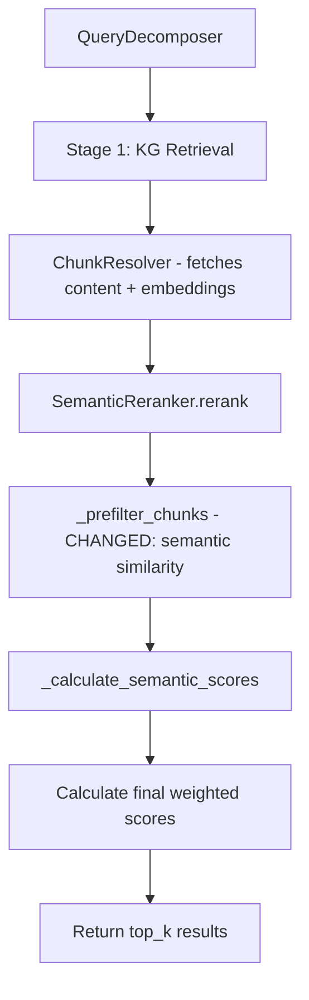

# Design Document: KG Retrieval Semantic Pre-filter

## Overview

This design addresses a critical bug in the KG-guided retrieval pipeline where the `SemanticReranker._prefilter_chunks()` method selects the top 30 chunks by `kg_relevance_score` before semantic reranking. Since all direct concept chunks receive an identical `kg_relevance_score` of 1.0 (from `ChunkSourceMapping.get_relevance_score()` at `hop_distance=0`), the pre-filter is effectively random among ~597 direct chunks, causing relevant chunks to be dropped before they can be semantically scored.

The fix replaces the KG-score-based pre-filter with a semantic-similarity-based pre-filter that leverages already-fetched chunk embeddings from Milvus, and adjusts the default reranker weights to favor semantic similarity (0.7) over KG relevance (0.3).

## Architecture

The change is scoped entirely to `SemanticReranker` in `semantic_reranker.py`. No changes are needed to `KGRetrievalService`, `ChunkResolver`, or the data models. The existing pipeline flow remains:



The key architectural change is within `_prefilter_chunks`:

**Before:** Sort by `kg_relevance_score` → take top 30 (random among 1.0-scored chunks)

**After:** Compute query embedding → compute cosine similarity against stored chunk embeddings → take top 50 by semantic similarity

## Components and Interfaces

### Modified Component: `SemanticReranker`

**File:** `src/multimodal_librarian/components/kg_retrieval/semantic_reranker.py`

#### Changed Constants

```python
# Before
DEFAULT_KG_WEIGHT = 0.6
DEFAULT_SEMANTIC_WEIGHT = 0.4
MAX_CHUNKS_FOR_RERANKING = 30

# After
DEFAULT_KG_WEIGHT = 0.3
DEFAULT_SEMANTIC_WEIGHT = 0.7
MAX_CHUNKS_FOR_RERANKING = 50
```

#### Changed Method: `_prefilter_chunks`

**Before signature:** `_prefilter_chunks(self, chunks: List[RetrievedChunk]) -> List[RetrievedChunk]`

**After signature:** `async _prefilter_chunks(self, chunks: List[RetrievedChunk], query_embedding: np.ndarray) -> List[RetrievedChunk]`

The method becomes async (though it only does numpy computation) to match the calling pattern. It now accepts the query embedding and uses vectorized cosine similarity to rank chunks.

#### Changed Method: `rerank`

The `rerank` method is restructured to:
1. Generate/retrieve the query embedding first (before pre-filtering)
2. Pass the query embedding to `_prefilter_chunks`
3. Pass the same query embedding to `_calculate_semantic_scores` (avoiding a second model server call)

The public signature `rerank(chunks, query, top_k)` remains unchanged.

#### New Method: `_batch_cosine_similarities`

```python
def _batch_cosine_similarities(
    self,
    query_embedding: np.ndarray,
    chunk_embeddings: np.ndarray,
) -> np.ndarray:
    """
    Compute cosine similarities between query and all chunks
    using vectorized numpy operations.

    Args:
        query_embedding: Shape (D,) query vector
        chunk_embeddings: Shape (N, D) matrix of chunk vectors

    Returns:
        Shape (N,) array of cosine similarities in [-1, 1]
    """
```

This replaces the per-chunk `_cosine_similarity` calls in the pre-filter with a single vectorized operation.

### Unchanged Components

- **KGRetrievalService**: No changes. Calls `self._semantic_reranker.rerank(stage1_chunks, query, effective_top_k)` as before.
- **ChunkResolver**: No changes. Already passes through embeddings from Milvus on `RetrievedChunk.embedding`.
- **Models (`kg_retrieval.py`)**: No changes. `RetrievedChunk`, `ChunkSourceMapping`, etc. remain the same.

## Data Models

No data model changes are required. The existing `RetrievedChunk` dataclass already has:
- `embedding: Optional[List[float]]` — populated by `ChunkResolver._build_retrieved_chunk()` from Milvus data
- `has_embedding() -> bool` — checks if embedding is present and non-empty
- `kg_relevance_score: float` — still used in final weighted scoring
- `semantic_score: float` — updated during full reranking
- `final_score: float` — computed as `kg_weight * kg_relevance_score + semantic_weight * semantic_score`


## Correctness Properties

*A property is a characteristic or behavior that should hold true across all valid executions of a system — essentially, a formal statement about what the system should do. Properties serve as the bridge between human-readable specifications and machine-verifiable correctness guarantees.*

### Property 1: Semantic pre-filter selects top-N by cosine similarity

*For any* query embedding and any set of chunks (each with a stored embedding) where the set size exceeds MAX_CHUNKS_FOR_RERANKING, the pre-filter output should contain exactly the top MAX_CHUNKS_FOR_RERANKING chunks ranked by cosine similarity between the query embedding and each chunk embedding. Chunks without embeddings should only appear if fewer than MAX_CHUNKS_FOR_RERANKING chunks with embeddings exist.

**Validates: Requirements 1.1, 1.2, 1.3**

### Property 2: Custom weights are respected

*For any* pair of non-negative floats (kg_w, sem_w), a SemanticReranker initialized with those weights should compute `final_score = kg_w * kg_relevance_score + sem_w * semantic_score` for every chunk it reranks.

**Validates: Requirements 2.1, 2.2, 2.3**

### Property 3: Query embedding is generated at most once per rerank call

*For any* query string and any set of chunks, calling `rerank` should invoke the model client's `generate_embeddings` at most once for the query (or zero times if cached), regardless of the number of chunks or whether pre-filtering is triggered.

**Validates: Requirements 3.1, 3.2**

### Property 4: Fallback preserves KG score ordering

*For any* set of chunks with varying `kg_relevance_score` values, when the model client is None, the reranker output should be sorted in descending order of `kg_relevance_score` and each chunk's `final_score` should equal its `kg_relevance_score`.

**Validates: Requirements 4.2**

### Property 5: Batch cosine similarity matches individual computation

*For any* query vector of dimension D and any matrix of N chunk vectors of dimension D (all non-zero), the batch cosine similarity computation should produce results equal (within floating-point tolerance) to computing cosine similarity individually for each chunk vector against the query vector.

**Validates: Requirements 5.2**

## Error Handling

The error handling strategy remains unchanged from the existing implementation:

1. **Model client unavailable**: Falls back to KG-score-only sorting (existing behavior, Requirement 4.2).
2. **Query embedding generation fails**: Falls back to KG-score-only sorting via the existing try/except in `rerank()`.
3. **Chunk without embedding during pre-filter**: Assigned a default similarity of 0.0, included only if the pool of chunks with embeddings is smaller than MAX_CHUNKS_FOR_RERANKING.
4. **Zero-norm vectors**: The existing `_cosine_similarity` method returns 0.0 for zero-norm vectors. The new `_batch_cosine_similarities` method handles this similarly by checking norms before division.
5. **Empty chunk list**: Returns empty list immediately (existing behavior).

## Testing Strategy

### Property-Based Tests (using `hypothesis`)

Each correctness property maps to a single property-based test with a minimum of 100 iterations. Tests use `hypothesis` strategies to generate:
- Random numpy vectors for query and chunk embeddings
- Random sets of `RetrievedChunk` objects with varying embeddings, KG scores, and content
- Random weight configurations

**Tag format:** `Feature: kg-retrieval-semantic-prefilter, Property N: <title>`

| Property | Test Description | Key Generators |
|----------|-----------------|----------------|
| 1 | Pre-filter selects top-N by similarity | Random embeddings, chunk sets of varying sizes |
| 2 | Custom weights produce correct final scores | Random weight pairs, chunks with known scores |
| 3 | Embedding generated at most once | Mock model client with call counter |
| 4 | Fallback sorts by KG score | Chunks with varying KG scores, no model client |
| 5 | Batch similarity matches individual | Random query + chunk embedding matrices |

### Unit Tests (using `pytest`)

Unit tests cover specific examples and edge cases:
- Default weight values are 0.3/0.7
- MAX_CHUNKS_FOR_RERANKING is 50
- Pre-filter with exactly MAX_CHUNKS_FOR_RERANKING chunks passes all through
- Pre-filter with all chunks missing embeddings returns chunks sorted by default score
- Empty chunk list returns empty result
- Rerank with empty query falls back to KG scores

### Test File Location

`tests/components/test_semantic_reranker_prefilter.py`
