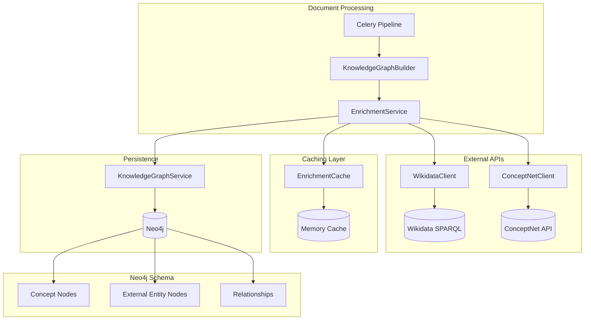

# Design Document: Knowledge Graph External Enrichment

## Overview

This design implements persistent storage of Wikidata and ConceptNet enrichment data in the Neo4j knowledge graph. The system extends the existing `ContentAnalyzer` and `KnowledgeGraphBuilder` components to persist external knowledge base data that is currently used only transiently for chunking decisions.

The architecture follows a service-oriented approach with:
- **EnrichmentService**: Orchestrates external API calls and caching
- **WikidataClient**: Handles Wikidata SPARQL queries
- **ConceptNetClient**: Handles ConceptNet REST API calls
- **EnrichmentCache**: LRU cache with TTL for API responses

The enrichment process integrates into the existing document processing pipeline via the `_update_knowledge_graph` function in `celery_service.py`.

## Architecture



### Data Flow

1. **Document Processing**: Celery task extracts concepts via `KnowledgeGraphBuilder`
2. **Enrichment Trigger**: After concept extraction, `EnrichmentService.enrich_concepts()` is called
3. **Cache Check**: Service checks `EnrichmentCache` for existing data
4. **API Calls**: On cache miss, async calls to Wikidata/ConceptNet APIs
5. **Persistence**: Enriched data stored in Neo4j via `KnowledgeGraphService`
6. **Cross-linking**: SAME_AS relationships created for shared Q-numbers

## Components and Interfaces

### EnrichmentService

```python
class EnrichmentService:
    """Orchestrates external knowledge base enrichment for concepts."""
    
    def __init__(
        self,
        wikidata_client: WikidataClient,
        conceptnet_client: ConceptNetClient,
        cache: EnrichmentCache,
        kg_service: KnowledgeGraphService
    ):
        self.wikidata = wikidata_client
        self.conceptnet = conceptnet_client
        self.cache = cache
        self.kg_service = kg_service
        self.circuit_breaker = CircuitBreaker(
            failure_threshold=5,
            recovery_timeout=300  # 5 minutes
        )
    
    async def enrich_concepts(
        self,
        concepts: List[ConceptNode],
        document_id: str
    ) -> EnrichmentResult:
        """
        Enrich a list of concepts with external knowledge.
        
        Args:
            concepts: Concepts extracted from document
            document_id: Source document identifier
            
        Returns:
            EnrichmentResult with statistics and enriched concepts
        """
        pass
    
    async def enrich_single_concept(
        self,
        concept: ConceptNode,
        document_id: str
    ) -> EnrichedConcept:
        """Enrich a single concept with Wikidata and ConceptNet data."""
        pass
    
    async def create_cross_document_links(
        self,
        concept: ConceptNode,
        q_number: str
    ) -> List[str]:
        """Create SAME_AS relationships for concepts sharing a Q-number."""
        pass
```

### WikidataClient

```python
class WikidataClient:
    """Client for Wikidata SPARQL endpoint."""
    
    SPARQL_ENDPOINT = "https://query.wikidata.org/sparql"
    REQUEST_TIMEOUT = 5.0  # seconds
    
    async def search_entity(
        self,
        concept_name: str,
        context: Optional[str] = None
    ) -> Optional[WikidataEntity]:
        """
        Search for a Wikidata entity matching the concept.
        
        Args:
            concept_name: Name of the concept to search
            context: Optional context for disambiguation
            
        Returns:
            WikidataEntity if found, None otherwise
        """
        pass
    
    async def get_instance_of(
        self,
        q_number: str
    ) -> List[WikidataClass]:
        """
        Get instance-of (P31) values for an entity.
        
        Args:
            q_number: Wikidata entity ID (e.g., "Q42")
            
        Returns:
            List of Wikidata classes this entity is an instance of
        """
        pass
    
    async def batch_search(
        self,
        concept_names: List[str]
    ) -> Dict[str, Optional[WikidataEntity]]:
        """Batch search for multiple concepts."""
        pass
```

### ConceptNetClient

```python
class ConceptNetClient:
    """Client for ConceptNet REST API."""
    
    API_ENDPOINT = "http://api.conceptnet.io"
    REQUEST_TIMEOUT = 5.0  # seconds
    
    SUPPORTED_RELATIONS = [
        "IsA", "PartOf", "UsedFor", "CapableOf", "HasProperty",
        "AtLocation", "Causes", "HasPrerequisite", "MotivatedByGoal", "RelatedTo"
    ]
    
    async def get_relationships(
        self,
        concept_name: str,
        limit: int = 20
    ) -> List[ConceptNetRelation]:
        """
        Get ConceptNet relationships for a concept.
        
        Args:
            concept_name: Concept to query
            limit: Maximum relationships to return
            
        Returns:
            List of ConceptNet relationships
        """
        pass
    
    async def batch_get_relationships(
        self,
        concept_names: List[str]
    ) -> Dict[str, List[ConceptNetRelation]]:
        """Batch get relationships for multiple concepts."""
        pass
```

### EnrichmentCache

```python
class EnrichmentCache:
    """LRU cache with TTL for enrichment data."""
    
    def __init__(
        self,
        max_size: int = 10000,
        ttl_seconds: int = 86400  # 24 hours
    ):
        self.max_size = max_size
        self.ttl = ttl_seconds
        self._wikidata_cache: OrderedDict[str, CacheEntry] = OrderedDict()
        self._conceptnet_cache: OrderedDict[str, CacheEntry] = OrderedDict()
    
    def get_wikidata(self, concept_name: str) -> Optional[WikidataEntity]:
        """Get cached Wikidata entity."""
        pass
    
    def set_wikidata(self, concept_name: str, entity: WikidataEntity) -> None:
        """Cache Wikidata entity."""
        pass
    
    def get_conceptnet(self, concept_name: str) -> Optional[List[ConceptNetRelation]]:
        """Get cached ConceptNet relationships."""
        pass
    
    def set_conceptnet(self, concept_name: str, relations: List[ConceptNetRelation]) -> None:
        """Cache ConceptNet relationships."""
        pass
    
    def clear(self) -> None:
        """Clear all caches."""
        pass
    
    def get_stats(self) -> CacheStats:
        """Get cache statistics."""
        pass
```

### CircuitBreaker

```python
class CircuitBreaker:
    """Circuit breaker for external API resilience."""
    
    def __init__(
        self,
        failure_threshold: int = 5,
        recovery_timeout: int = 300
    ):
        self.failure_threshold = failure_threshold
        self.recovery_timeout = recovery_timeout
        self.failures = 0
        self.last_failure_time: Optional[float] = None
        self.state = CircuitState.CLOSED
    
    def record_success(self) -> None:
        """Record a successful API call."""
        pass
    
    def record_failure(self) -> None:
        """Record a failed API call."""
        pass
    
    def is_open(self) -> bool:
        """Check if circuit is open (blocking calls)."""
        pass
    
    def allow_request(self) -> bool:
        """Check if a request should be allowed."""
        pass
```

## Data Models

### Neo4j Node Labels and Properties

```cypher
// Concept Node (existing, extended)
(:Concept {
    concept_id: string,           // Internal ID
    name: string,                 // Concept name
    type: string,                 // ENTITY, PROCESS, PROPERTY
    confidence: float,            // Extraction confidence
    source_document: string,      // Document ID
    source_chunks: string,        // Comma-separated chunk IDs
    // NEW: Wikidata enrichment
    wikidata_qid: string,         // Q-number (e.g., "Q42")
    wikidata_label: string,       // Wikidata label
    wikidata_description: string, // Wikidata description
    enriched_at: datetime         // When enrichment occurred
})

// External Entity Node (NEW)
(:ExternalEntity {
    q_number: string,             // Wikidata Q-number (unique)
    label: string,                // Entity label
    description: string,          // Entity description
    source: string,               // "wikidata" or "conceptnet"
    fetched_at: datetime,         // When fetched from API
    created_at: datetime,
    updated_at: datetime
})

// Indexes
CREATE INDEX concept_wikidata_idx FOR (c:Concept) ON (c.wikidata_qid)
CREATE INDEX external_entity_qnum_idx FOR (e:ExternalEntity) ON (e.q_number)
```

### Neo4j Relationship Types

```cypher
// Instance-of relationship (Concept -> ExternalEntity)
(c:Concept)-[:INSTANCE_OF {
    confidence: float,            // Match confidence
    fetched_at: datetime,         // When fetched
    source: string                // "wikidata"
}]->(e:ExternalEntity)

// Same-as relationship (Concept -> Concept)
(c1:Concept)-[:SAME_AS {
    q_number: string,             // Shared Q-number
    created_at: datetime
}]->(c2:Concept)

// ConceptNet relationships (Concept -> Concept)
(c1:Concept)-[:IS_A|PART_OF|USED_FOR|CAPABLE_OF|HAS_PROPERTY|
              AT_LOCATION|CAUSES|HAS_PREREQUISITE|MOTIVATED_BY_GOAL|RELATED_TO {
    weight: float,                // ConceptNet weight
    source_uri: string,           // ConceptNet edge URI
    fetched_at: datetime,
    source: string                // "conceptnet"
}]->(c2:Concept)
```

### Python Data Classes

```python
@dataclass
class WikidataEntity:
    """Represents a Wikidata entity."""
    q_number: str                 # e.g., "Q42"
    label: str                    # e.g., "Douglas Adams"
    description: Optional[str]    # e.g., "English writer and humorist"
    aliases: List[str]            # Alternative names
    instance_of: List[str]        # Q-numbers of classes
    confidence: float             # Match confidence (0-1)

@dataclass
class WikidataClass:
    """Represents a Wikidata class (instance-of target)."""
    q_number: str
    label: str
    description: Optional[str]

@dataclass
class ConceptNetRelation:
    """Represents a ConceptNet relationship."""
    subject: str                  # Source concept
    relation: str                 # Relationship type (e.g., "IsA")
    object: str                   # Target concept
    weight: float                 # Confidence weight
    source_uri: str               # ConceptNet edge URI

@dataclass
class EnrichedConcept:
    """A concept with enrichment data."""
    concept: ConceptNode
    wikidata_entity: Optional[WikidataEntity]
    conceptnet_relations: List[ConceptNetRelation]
    cross_document_links: List[str]  # IDs of linked concepts

@dataclass
class EnrichmentResult:
    """Result of batch enrichment."""
    concepts_processed: int
    concepts_enriched: int
    wikidata_hits: int
    conceptnet_hits: int
    cache_hits: int
    api_calls: int
    errors: List[str]
    duration_ms: float

@dataclass
class CacheEntry:
    """Cache entry with TTL."""
    data: Any
    created_at: float
    
    def is_expired(self, ttl: int) -> bool:
        return time.time() - self.created_at > ttl

@dataclass
class CacheStats:
    """Cache statistics."""
    wikidata_size: int
    conceptnet_size: int
    wikidata_hits: int
    wikidata_misses: int
    conceptnet_hits: int
    conceptnet_misses: int
    evictions: int

class CircuitState(Enum):
    """Circuit breaker states."""
    CLOSED = "closed"      # Normal operation
    OPEN = "open"          # Blocking requests
    HALF_OPEN = "half_open"  # Testing recovery
```

## Correctness Properties

*A property is a characteristic or behavior that should hold true across all valid executions of a system—essentially, a formal statement about what the system should do. Properties serve as the bridge between human-readable specifications and machine-verifiable correctness guarantees.*

### Property 1: Wikidata Q-number Storage Threshold

*For any* concept with a Wikidata entity match, if the match confidence is above 0.7, then the Q-number SHALL be stored on the Concept_Node; if confidence is 0.7 or below, the Q-number SHALL NOT be stored.

**Validates: Requirements 1.2**

### Property 2: Best Match Selection for Disambiguation

*For any* concept with multiple Wikidata entity matches, the selected match SHALL have the highest context similarity score among all candidates.

**Validates: Requirements 1.3**

### Property 3: Cache Round-Trip Consistency

*For any* concept name that has been queried against Wikidata or ConceptNet, a subsequent query for the same concept name within the TTL period SHALL return the cached value without making an API call.

**Validates: Requirements 1.6, 3.7**

### Property 4: Instance-Of Node Creation Completeness

*For any* concept with a Wikidata Q-number, the number of External_Entity_Node entries created SHALL equal the number of instance-of (P31) values retrieved from Wikidata.

**Validates: Requirements 2.2**

### Property 5: Instance-Of Relationship Creation

*For any* concept with instance-of values, there SHALL exist an INSTANCE_OF relationship from the Concept_Node to each corresponding External_Entity_Node.

**Validates: Requirements 2.3**

### Property 6: External Entity Node Deduplication

*For any* Wikidata class Q-number referenced by multiple concepts, there SHALL exist exactly one External_Entity_Node with that Q-number in the graph.

**Validates: Requirements 2.5**

### Property 7: ConceptNet Edge Type Preservation

*For any* ConceptNet relationship stored in Neo4j, the edge label SHALL match the original ConceptNet relationship type (IsA, PartOf, UsedFor, etc.).

**Validates: Requirements 3.2**

### Property 8: ConceptNet Weight Preservation

*For any* ConceptNet relationship stored in Neo4j, the edge's weight property SHALL equal the weight value from the original ConceptNet API response.

**Validates: Requirements 3.4**

### Property 9: Error Isolation for Concept Processing

*For any* batch of concepts being enriched, if enrichment fails for one concept, all other concepts in the batch SHALL still be processed and enriched (if possible).

**Validates: Requirements 4.3**

### Property 10: API Batching Efficiency

*For any* batch of N concepts being enriched, the number of API calls made SHALL be less than or equal to N (and typically much less when batching is effective).

**Validates: Requirements 4.5**

### Property 11: SAME_AS Relationship for Shared Q-Numbers

*For any* two concepts from different documents that share the same Wikidata Q-number, there SHALL exist a SAME_AS relationship between them.

**Validates: Requirements 5.1**

### Property 12: Cross-Document Query Traversal

*For any* concept query that traverses SAME_AS relationships, the results SHALL include concepts from documents other than the source document.

**Validates: Requirements 5.2**

### Property 13: Document Lookup by Wikidata Entity

*For any* Wikidata Q-number that has been used to enrich concepts, the `find_documents_by_entity` method SHALL return all document IDs containing concepts linked to that Q-number.

**Validates: Requirements 5.3**

### Property 14: Cache TTL Expiration

*For any* cached entry, after the TTL period has elapsed, the entry SHALL be considered expired and a fresh API call SHALL be made on the next query.

**Validates: Requirements 6.1, 6.2**

### Property 15: LRU Eviction When Cache Full

*For any* cache that has reached its maximum size, adding a new entry SHALL evict the least-recently-used entry, and the cache size SHALL not exceed the configured maximum.

**Validates: Requirements 6.3**

### Property 16: API Retry on Failure

*For any* failed API request (Wikidata or ConceptNet), the system SHALL retry up to 3 times before marking the request as failed.

**Validates: Requirements 7.1, 7.2**

### Property 17: Circuit Breaker State Transitions

*For any* API that experiences more than 5 failures within 1 minute, the circuit breaker SHALL transition to OPEN state, and subsequent requests SHALL be skipped for 5 minutes.

**Validates: Requirements 7.3**

### Property 18: Deferred Enrichment Marking

*For any* concept whose enrichment is skipped due to circuit breaker being open, the concept SHALL be marked with `enrichment_deferred=true` for later processing.

**Validates: Requirements 7.5**

### Property 19: Schema Validation for Nodes and Edges

*For any* External_Entity_Node, the node SHALL have properties: q_number, label, description, source, fetched_at. *For any* INSTANCE_OF relationship, it SHALL have properties: confidence, fetched_at. *For any* ConceptNet relationship edge, it SHALL have properties: weight, source_uri, fetched_at.

**Validates: Requirements 8.3, 8.4, 8.5**

## Error Handling

### API Failure Handling

```python
class EnrichmentError(Exception):
    """Base exception for enrichment errors."""
    pass

class WikidataAPIError(EnrichmentError):
    """Wikidata API request failed."""
    pass

class ConceptNetAPIError(EnrichmentError):
    """ConceptNet API request failed."""
    pass

class CircuitBreakerOpenError(EnrichmentError):
    """Circuit breaker is open, requests are blocked."""
    pass
```

### Error Recovery Strategy

1. **Transient Failures**: Retry with exponential backoff (1s, 2s, 4s)
2. **Persistent Failures**: Circuit breaker opens after 5 failures in 1 minute
3. **Circuit Recovery**: Half-open state after 5 minutes, test with single request
4. **Graceful Degradation**: Document processing continues without enrichment

### Logging Strategy

```python
# Structured logging for enrichment operations
logger.info("enrichment_started", extra={
    "document_id": document_id,
    "concept_count": len(concepts)
})

logger.warning("enrichment_api_failure", extra={
    "api": "wikidata",
    "concept": concept_name,
    "error": str(e),
    "retry_count": retry_count
})

logger.error("enrichment_circuit_open", extra={
    "api": "wikidata",
    "failure_count": failures,
    "recovery_at": recovery_time.isoformat()
})
```

## Testing Strategy

### Dual Testing Approach

This feature requires both unit tests and property-based tests for comprehensive coverage:

- **Unit tests**: Verify specific examples, edge cases, API mocking, and error conditions
- **Property tests**: Verify universal properties across generated inputs

### Property-Based Testing Configuration

- **Library**: `hypothesis` for Python property-based testing
- **Minimum iterations**: 100 per property test
- **Tag format**: `Feature: knowledge-graph-external-enrichment, Property {N}: {description}`

### Test Categories

1. **Cache Tests**
   - TTL expiration behavior
   - LRU eviction correctness
   - Cache hit/miss tracking

2. **API Client Tests**
   - Timeout handling
   - Retry behavior
   - Response parsing

3. **Circuit Breaker Tests**
   - State transitions
   - Recovery timing
   - Request blocking

4. **Integration Tests**
   - End-to-end enrichment flow
   - Neo4j persistence verification
   - Cross-document linking

### Mocking Strategy

```python
# Mock external APIs for testing
@pytest.fixture
def mock_wikidata_client():
    client = MagicMock(spec=WikidataClient)
    client.search_entity = AsyncMock(return_value=WikidataEntity(
        q_number="Q42",
        label="Douglas Adams",
        description="English writer",
        aliases=["Douglas Noel Adams"],
        instance_of=["Q5"],  # human
        confidence=0.95
    ))
    return client

@pytest.fixture
def mock_conceptnet_client():
    client = MagicMock(spec=ConceptNetClient)
    client.get_relationships = AsyncMock(return_value=[
        ConceptNetRelation(
            subject="writer",
            relation="IsA",
            object="person",
            weight=0.8,
            source_uri="/a/[/r/IsA/,/c/en/writer/,/c/en/person/]"
        )
    ])
    return client
```

### Dependency Injection for Testing

Following the project's DI architecture, enrichment services will be injectable:

```python
# In src/multimodal_librarian/api/dependencies/services.py
async def get_enrichment_service() -> EnrichmentService:
    """Get enrichment service with lazy initialization."""
    # Implementation follows DI patterns
    pass

async def get_enrichment_service_optional() -> Optional[EnrichmentService]:
    """Get enrichment service, returns None if unavailable."""
    try:
        return await get_enrichment_service()
    except Exception:
        return None
```

### Test Dependency Overrides

```python
@pytest.fixture
def client_with_mock_enrichment(mock_wikidata_client, mock_conceptnet_client):
    """Test client with mocked enrichment services."""
    mock_service = EnrichmentService(
        wikidata_client=mock_wikidata_client,
        conceptnet_client=mock_conceptnet_client,
        cache=EnrichmentCache(),
        kg_service=MagicMock()
    )
    app.dependency_overrides[get_enrichment_service] = lambda: mock_service
    
    with TestClient(app) as client:
        yield client
    
    app.dependency_overrides.clear()
```

