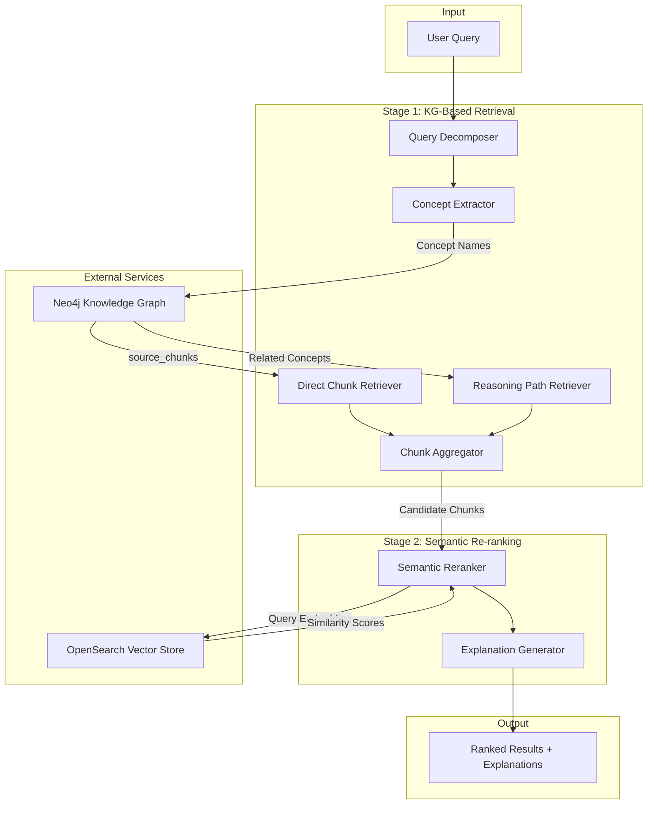
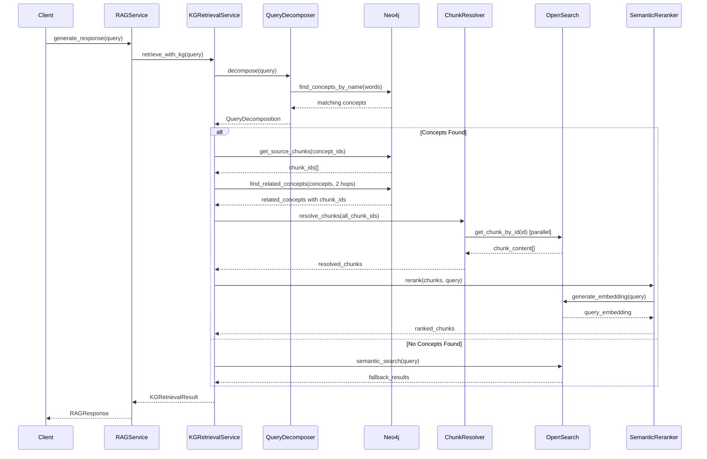

# Design Document: Knowledge Graph-Guided Retrieval

## Overview

This design document describes the architecture and implementation of the Knowledge Graph-Guided Retrieval feature, which provides an intelligent alternative to pure semantic search by leveraging the existing Neo4j knowledge graph. The system addresses the fundamental limitation of embedding-based search where named entities get diluted or truncated, causing retrieval failures for queries like "What did our team observe at Chelsea?"

The solution implements a multi-stage retrieval pipeline:
1. **Stage 1 (KG-Based)**: Extract concepts from the query, retrieve direct chunk pointers from Neo4j `source_chunks` fields, and traverse relationships to find related chunks
2. **Stage 2 (Semantic Re-ranking)**: Re-rank candidate chunks using semantic similarity for relevance ordering

This approach combines the precision of knowledge graph pointers with the relevance ranking of semantic search.

## Architecture



### Component Interaction Flow



## Components and Interfaces

### KGRetrievalService

The main orchestrator service that coordinates knowledge graph-guided retrieval.

```python
from dataclasses import dataclass, field
from typing import Any, Dict, List, Optional
from enum import Enum

class RetrievalSource(Enum):
    """Source of a retrieved chunk."""
    DIRECT_CONCEPT = "direct_concept"      # From source_chunks of matched concept
    RELATED_CONCEPT = "related_concept"    # From source_chunks of related concept
    REASONING_PATH = "reasoning_path"      # From concepts along a reasoning path
    SEMANTIC_FALLBACK = "semantic_fallback"  # From pure semantic search fallback
    SEMANTIC_AUGMENT = "semantic_augment"  # Augmented from semantic search


@dataclass
class RetrievedChunk:
    """A chunk retrieved via knowledge graph-guided retrieval."""
    chunk_id: str
    content: str
    source: RetrievalSource
    concept_name: Optional[str] = None      # Concept that provided this chunk
    relationship_path: Optional[List[str]] = None  # Path if from related concept
    kg_relevance_score: float = 1.0         # Score based on KG distance
    semantic_score: float = 0.0             # Score from semantic re-ranking
    final_score: float = 0.0                # Combined score
    metadata: Dict[str, Any] = field(default_factory=dict)


@dataclass
class QueryDecomposition:
    """Structured decomposition of a user query."""
    original_query: str
    entities: List[str]                     # Named entities found in KG
    actions: List[str]                      # Action words (observed, found, etc.)
    subjects: List[str]                     # Subject references (our team, etc.)
    concept_matches: List[Dict[str, Any]]   # Full concept match details from Neo4j
    has_kg_matches: bool = False


@dataclass
class KGRetrievalResult:
    """Result of knowledge graph-guided retrieval."""
    chunks: List[RetrievedChunk]
    query_decomposition: QueryDecomposition
    explanation: str
    fallback_used: bool = False
    retrieval_time_ms: int = 0
    stage1_chunk_count: int = 0
    stage2_chunk_count: int = 0
    cache_hits: int = 0
    metadata: Dict[str, Any] = field(default_factory=dict)


class KGRetrievalService:
    """
    Knowledge Graph-Guided Retrieval Service.
    
    Orchestrates multi-stage retrieval using Neo4j knowledge graph
    for precise chunk retrieval and semantic re-ranking for relevance.
    
    Follows FastAPI DI patterns - no connections at construction time.
    """
    
    def __init__(
        self,
        neo4j_client: Optional[Any] = None,
        opensearch_client: Optional[Any] = None,
        cache_ttl_seconds: int = 300,
        max_results: int = 15,
        max_hops: int = 2
    ):
        """
        Initialize KG Retrieval Service.
        
        Args:
            neo4j_client: Neo4j client (injected via DI)
            opensearch_client: OpenSearch client (injected via DI)
            cache_ttl_seconds: TTL for source_chunks cache (default 5 min)
            max_results: Maximum chunks to return (default 15)
            max_hops: Maximum relationship hops (default 2)
        """
        self._neo4j_client = neo4j_client
        self._opensearch_client = opensearch_client
        self._cache_ttl = cache_ttl_seconds
        self._max_results = max_results
        self._max_hops = max_hops
        self._source_chunks_cache: Dict[str, Any] = {}
        self._initialized = False
    
    async def retrieve(
        self,
        query: str,
        top_k: int = 15,
        include_explanation: bool = True
    ) -> KGRetrievalResult:
        """
        Perform knowledge graph-guided retrieval.
        
        Args:
            query: User query text
            top_k: Maximum number of chunks to return
            include_explanation: Whether to generate explanation
            
        Returns:
            KGRetrievalResult with ranked chunks and metadata
        """
        pass
    
    async def health_check(self) -> Dict[str, Any]:
        """Check health of KG retrieval service."""
        pass
    
    def get_cache_stats(self) -> Dict[str, Any]:
        """Get cache statistics."""
        pass
```

### QueryDecomposer

Extracts structured components from user queries using the knowledge graph.

```python
class QueryDecomposer:
    """
    Decomposes user queries into structured components.
    
    Uses Neo4j to identify named entities and extracts
    action words and subject references.
    """
    
    # Common action words to identify
    ACTION_WORDS = {
        'observed', 'found', 'discovered', 'noted', 'reported',
        'identified', 'analyzed', 'concluded', 'determined', 'saw',
        'mentioned', 'stated', 'described', 'explained', 'discussed'
    }
    
    # Common subject references
    SUBJECT_PATTERNS = {
        'our team', 'the team', 'we', 'the system', 'the author',
        'the researchers', 'the study', 'the analysis', 'the report'
    }
    
    def __init__(self, neo4j_client: Optional[Any] = None):
        """Initialize with Neo4j client for concept matching."""
        self._neo4j_client = neo4j_client
    
    async def decompose(self, query: str) -> QueryDecomposition:
        """
        Decompose query into entities, actions, and subjects.
        
        Args:
            query: User query text
            
        Returns:
            QueryDecomposition with extracted components
        """
        pass
    
    async def _find_entity_matches(self, words: List[str]) -> List[Dict[str, Any]]:
        """Find concept matches in Neo4j for query words."""
        pass
    
    def _extract_actions(self, query: str) -> List[str]:
        """Extract action words from query."""
        pass
    
    def _extract_subjects(self, query: str) -> List[str]:
        """Extract subject references from query."""
        pass
```

### ChunkResolver

Resolves chunk IDs to actual content from OpenSearch.

```python
class ChunkResolver:
    """
    Resolves chunk IDs from Neo4j to actual content from OpenSearch.
    
    Handles batch resolution with parallel requests and graceful
    handling of missing chunks.
    """
    
    def __init__(self, opensearch_client: Optional[Any] = None):
        """Initialize with OpenSearch client."""
        self._opensearch_client = opensearch_client
    
    async def resolve_chunks(
        self,
        chunk_ids: List[str],
        source_info: Dict[str, RetrievalSource]
    ) -> List[RetrievedChunk]:
        """
        Resolve chunk IDs to full chunk content.
        
        Args:
            chunk_ids: List of chunk IDs to resolve
            source_info: Mapping of chunk_id to RetrievalSource
            
        Returns:
            List of RetrievedChunk with content populated
        """
        pass
    
    async def _resolve_single_chunk(
        self,
        chunk_id: str,
        source: RetrievalSource
    ) -> Optional[RetrievedChunk]:
        """Resolve a single chunk ID."""
        pass
```

### SemanticReranker

Re-ranks candidate chunks using semantic similarity.

```python
class SemanticReranker:
    """
    Re-ranks candidate chunks using semantic similarity.
    
    Combines KG-based relevance scores with semantic similarity
    for final ranking.
    """
    
    def __init__(
        self,
        opensearch_client: Optional[Any] = None,
        kg_weight: float = 0.6,
        semantic_weight: float = 0.4
    ):
        """
        Initialize reranker.
        
        Args:
            opensearch_client: OpenSearch client for embeddings
            kg_weight: Weight for KG-based scores (default 0.6)
            semantic_weight: Weight for semantic scores (default 0.4)
        """
        self._opensearch_client = opensearch_client
        self._kg_weight = kg_weight
        self._semantic_weight = semantic_weight
    
    async def rerank(
        self,
        chunks: List[RetrievedChunk],
        query: str,
        top_k: int = 15
    ) -> List[RetrievedChunk]:
        """
        Re-rank chunks using semantic similarity.
        
        Args:
            chunks: Candidate chunks from Stage 1
            query: Original query for embedding
            top_k: Maximum chunks to return
            
        Returns:
            Re-ranked list of chunks
        """
        pass
    
    def _calculate_final_score(
        self,
        kg_score: float,
        semantic_score: float
    ) -> float:
        """Calculate weighted final score."""
        return (self._kg_weight * kg_score) + (self._semantic_weight * semantic_score)
```

### ExplanationGenerator

Generates human-readable explanations for retrieval results.

```python
class ExplanationGenerator:
    """
    Generates explanations for knowledge graph-guided retrieval.
    
    Produces human-readable descriptions of how chunks were found
    and why they are relevant.
    """
    
    def generate(
        self,
        result: KGRetrievalResult,
        query_decomposition: QueryDecomposition
    ) -> str:
        """
        Generate explanation for retrieval result.
        
        Args:
            result: The retrieval result
            query_decomposition: Query decomposition details
            
        Returns:
            Human-readable explanation string
        """
        pass
    
    def _explain_direct_retrieval(
        self,
        chunk: RetrievedChunk
    ) -> str:
        """Explain a directly retrieved chunk."""
        pass
    
    def _explain_relationship_retrieval(
        self,
        chunk: RetrievedChunk
    ) -> str:
        """Explain a chunk retrieved via relationships."""
        pass
```

## Data Models

### Neo4j Concept Node Schema

The existing Concept nodes in Neo4j have the following relevant fields:

```cypher
(:Concept {
    concept_id: string,           // Unique identifier
    name: string,                 // Concept name (e.g., "Chelsea AI Ventures")
    type: string,                 // ENTITY, TOPIC, ACTION, etc.
    confidence: float,            // Extraction confidence
    source_document: string,      // Document ID
    source_chunks: string,        // Comma-separated chunk IDs (KEY FIELD)
    wikidata_qid: string,         // Optional Wikidata ID
    conceptnet_uri: string        // Optional ConceptNet URI
})
```

### Chunk Resolution Mapping

```python
@dataclass
class ChunkSourceMapping:
    """Maps chunk IDs to their source concepts and retrieval paths."""
    chunk_id: str
    source_concept_id: str
    source_concept_name: str
    retrieval_source: RetrievalSource
    relationship_path: Optional[List[str]] = None
    hop_distance: int = 0
```

### Cache Entry Structure

```python
@dataclass
class SourceChunksCacheEntry:
    """Cache entry for source_chunks from a concept."""
    concept_id: str
    concept_name: str
    chunk_ids: List[str]
    cached_at: float  # timestamp
    ttl_seconds: int
    
    def is_expired(self) -> bool:
        """Check if cache entry has expired."""
        import time
        return (time.time() - self.cached_at) > self.ttl_seconds
```

## Integration with RAGService

The KGRetrievalService integrates with the existing RAGService via dependency injection:

```python
# In api/dependencies/services.py

_kg_retrieval_service: Optional["KGRetrievalService"] = None

async def get_kg_retrieval_service() -> "KGRetrievalService":
    """
    FastAPI dependency for KGRetrievalService.
    
    Lazily creates and caches the service on first use.
    """
    global _kg_retrieval_service
    
    if _kg_retrieval_service is None:
        from ...services.kg_retrieval_service import KGRetrievalService
        from ...clients.database_factory import get_database_factory
        
        try:
            factory = get_database_factory()
            neo4j_client = factory.get_graph_client()
            opensearch_client = factory.get_vector_client()
            
            _kg_retrieval_service = KGRetrievalService(
                neo4j_client=neo4j_client,
                opensearch_client=opensearch_client
            )
        except Exception as e:
            logger.warning(f"KG Retrieval Service unavailable: {e}")
            return None
    
    return _kg_retrieval_service


async def get_kg_retrieval_service_optional() -> Optional["KGRetrievalService"]:
    """Optional KG retrieval service - returns None if unavailable."""
    try:
        return await get_kg_retrieval_service()
    except Exception:
        return None
```

### Modified RAGService Integration

```python
class RAGService:
    """RAG Service with optional KG-guided retrieval."""
    
    def __init__(
        self,
        vector_client: VectorStoreClient = None,
        ai_service: AIService = None,
        kg_retrieval_service: Optional[KGRetrievalService] = None,  # NEW
        # ... existing params
    ):
        self.kg_retrieval_service = kg_retrieval_service
        self.use_kg_retrieval = kg_retrieval_service is not None
    
    async def _search_documents(
        self,
        query: str,
        user_id: str,
        document_filter: Optional[List[str]] = None,
        related_concepts: Optional[List[str]] = None
    ) -> List[DocumentChunk]:
        """Search with optional KG-guided retrieval."""
        
        # Try KG-guided retrieval first if available
        if self.use_kg_retrieval and self.kg_retrieval_service:
            try:
                kg_result = await self.kg_retrieval_service.retrieve(query)
                
                if kg_result.chunks and not kg_result.fallback_used:
                    # Convert KG results to DocumentChunks
                    return self._convert_kg_results(kg_result)
            except Exception as e:
                logger.warning(f"KG retrieval failed, falling back: {e}")
        
        # Fall back to existing semantic search
        return await self._semantic_search(query, user_id, document_filter)
```


## Correctness Properties

*A property is a characteristic or behavior that should hold true across all valid executions of a system—essentially, a formal statement about what the system should do. Properties serve as the bridge between human-readable specifications and machine-verifiable correctness guarantees.*

Based on the acceptance criteria analysis, the following properties have been identified for property-based testing:

### Property 1: Chunk Aggregation from Multiple Concepts

*For any* query containing N recognized concepts, each with their own `source_chunks` arrays, the KG_Retrieval_Service SHALL return a result containing chunks from all N concepts, with no duplicate chunk IDs.

**Validates: Requirements 1.1, 1.2, 1.3, 1.5**

### Property 2: Relationship Traversal and Chunk Collection

*For any* concept identified in a query, the Reasoning_Path_Retriever SHALL find related concepts within the configured hop distance (default 2), using only the specified relationship types (RELATED_TO, IS_A, PART_OF, CAUSES), and chunks from closer concepts SHALL have higher relevance scores than chunks from more distant concepts.

**Validates: Requirements 2.1, 2.2, 2.3, 2.4, 2.5**

### Property 3: Semantic Re-ranking Preserves Relevance Order

*For any* set of candidate chunks from Stage 1, after semantic re-ranking, chunks with higher cosine similarity to the query embedding SHALL have higher final scores than chunks with lower similarity (when KG scores are equal).

**Validates: Requirements 3.2**

### Property 4: Result Size Invariant

*For any* query processed by the KG_Retrieval_Service, the number of returned chunks SHALL be at most the configured maximum (default 15).

**Validates: Requirements 3.4**

### Property 5: Augmentation Threshold Behavior

*For any* query where Stage 1 KG retrieval returns fewer than 3 chunks, the final result SHALL include chunks from semantic search augmentation, and the total chunk count SHALL be greater than or equal to the Stage 1 count.

**Validates: Requirements 3.3**

### Property 6: Retrieval Source Metadata Completeness

*For any* chunk in the retrieval result, the chunk SHALL have a valid `source` field indicating its retrieval source (DIRECT_CONCEPT, RELATED_CONCEPT, REASONING_PATH, SEMANTIC_FALLBACK, or SEMANTIC_AUGMENT).

**Validates: Requirements 3.5**

### Property 7: Query Decomposition Completeness

*For any* query processed by the Query_Decomposer, the resulting QueryDecomposition SHALL contain: (a) entities matching concept names found in Neo4j, (b) actions matching words from the ACTION_WORDS set, and (c) subjects matching patterns from SUBJECT_PATTERNS.

**Validates: Requirements 4.1, 4.2, 4.3, 4.4**

### Property 8: Explanation Content Correctness

*For any* KG retrieval result, the explanation SHALL contain: (a) concept names for direct retrievals, (b) relationship types and path nodes for path-based retrievals, and (c) fallback indication when semantic search was used.

**Validates: Requirements 5.1, 5.2, 5.3, 5.5**

### Property 9: Fallback Trigger Conditions

*For any* of the following conditions: (a) Neo4j unavailable, (b) no concepts recognized, or (c) KG retrieval returns zero chunks, the KG_Retrieval_Service SHALL set `fallback_used=True` and return results from semantic search.

**Validates: Requirements 6.1, 6.2, 6.3, 6.5**

### Property 10: RAGService Graceful Degradation

*For any* RAGService instance where KG_Retrieval_Service is None or unavailable, the RAGService SHALL continue to function using existing semantic search without raising exceptions.

**Validates: Requirements 7.4**

### Property 11: Cache Hit on Repeated Queries

*For any* concept queried twice within the cache TTL period (default 5 minutes), the second query SHALL return cached `source_chunks` without making a Neo4j request, and the cache_hits counter SHALL increment.

**Validates: Requirements 8.2**

## Error Handling

### Neo4j Connection Errors

```python
class Neo4jConnectionError(Exception):
    """Raised when Neo4j connection fails."""
    pass

async def _safe_neo4j_query(self, query: str, params: dict) -> List[Dict]:
    """Execute Neo4j query with error handling and timeout."""
    try:
        async with asyncio.timeout(5.0):  # 5 second timeout
            return await self._neo4j_client.execute_query(query, params)
    except asyncio.TimeoutError:
        logger.warning(f"Neo4j query timeout: {query[:50]}...")
        raise Neo4jConnectionError("Query timeout")
    except Exception as e:
        logger.error(f"Neo4j query failed: {e}")
        raise Neo4jConnectionError(str(e))
```

### Chunk Resolution Errors

```python
async def resolve_chunks(self, chunk_ids: List[str], ...) -> List[RetrievedChunk]:
    """Resolve chunks with graceful handling of missing chunks."""
    resolved = []
    failed_ids = []
    
    for chunk_id in chunk_ids:
        try:
            chunk = await self._resolve_single_chunk(chunk_id, ...)
            if chunk:
                resolved.append(chunk)
            else:
                failed_ids.append(chunk_id)
        except Exception as e:
            logger.warning(f"Failed to resolve chunk {chunk_id}: {e}")
            failed_ids.append(chunk_id)
    
    if failed_ids:
        logger.warning(f"Failed to resolve {len(failed_ids)} chunks: {failed_ids[:5]}...")
    
    return resolved
```

### Fallback Chain

```python
async def retrieve(self, query: str, ...) -> KGRetrievalResult:
    """Retrieve with comprehensive fallback chain."""
    try:
        # Try KG-based retrieval
        decomposition = await self._decompose_query(query)
        
        if not decomposition.has_kg_matches:
            return await self._fallback_to_semantic(query, "no_concepts")
        
        chunks = await self._retrieve_via_kg(decomposition)
        
        if not chunks:
            return await self._fallback_to_semantic(query, "no_kg_results")
        
        # Re-rank and return
        return await self._rerank_and_return(chunks, query, decomposition)
        
    except Neo4jConnectionError as e:
        logger.warning(f"Neo4j error, falling back: {e}")
        return await self._fallback_to_semantic(query, "neo4j_error")
    except Exception as e:
        logger.error(f"Unexpected error in KG retrieval: {e}")
        return await self._fallback_to_semantic(query, "unexpected_error")
```

### Error Response Structure

```python
@dataclass
class KGRetrievalResult:
    """Result includes error information when applicable."""
    chunks: List[RetrievedChunk]
    # ... other fields
    error: Optional[str] = None
    error_details: Optional[Dict[str, Any]] = None
    
    @property
    def has_error(self) -> bool:
        return self.error is not None
```

## Testing Strategy

### Dual Testing Approach

This feature requires both unit tests and property-based tests:

- **Unit tests**: Verify specific examples, edge cases, and error conditions
- **Property tests**: Verify universal properties across all valid inputs

### Property-Based Testing Configuration

- **Library**: `hypothesis` for Python property-based testing
- **Minimum iterations**: 100 per property test
- **Tag format**: `# Feature: knowledge-graph-guided-retrieval, Property N: {property_text}`

### Test Structure

```
tests/
├── services/
│   └── test_kg_retrieval_service.py      # Unit tests for KGRetrievalService
├── components/
│   ├── test_query_decomposer.py          # Unit tests for QueryDecomposer
│   ├── test_chunk_resolver.py            # Unit tests for ChunkResolver
│   └── test_semantic_reranker.py         # Unit tests for SemanticReranker
└── properties/
    └── test_kg_retrieval_properties.py   # Property-based tests
```

### Property Test Examples

```python
from hypothesis import given, strategies as st, settings
import pytest

# Feature: knowledge-graph-guided-retrieval, Property 1: Chunk Aggregation
@settings(max_examples=100)
@given(
    concepts=st.lists(
        st.fixed_dictionaries({
            'name': st.text(min_size=1, max_size=50),
            'source_chunks': st.lists(st.uuids().map(str), min_size=0, max_size=10)
        }),
        min_size=1,
        max_size=5
    )
)
async def test_chunk_aggregation_no_duplicates(concepts, mock_neo4j, mock_opensearch):
    """Property 1: Chunks from multiple concepts are aggregated without duplicates."""
    # Setup mocks
    mock_neo4j.find_concepts.return_value = concepts
    
    service = KGRetrievalService(neo4j_client=mock_neo4j, opensearch_client=mock_opensearch)
    result = await service.retrieve("test query")
    
    # Verify no duplicate chunk IDs
    chunk_ids = [c.chunk_id for c in result.chunks]
    assert len(chunk_ids) == len(set(chunk_ids)), "Duplicate chunks found"
    
    # Verify all concept chunks are represented
    all_source_chunks = set()
    for concept in concepts:
        all_source_chunks.update(concept['source_chunks'])
    
    for chunk_id in chunk_ids:
        if result.chunks[chunk_ids.index(chunk_id)].source == RetrievalSource.DIRECT_CONCEPT:
            assert chunk_id in all_source_chunks


# Feature: knowledge-graph-guided-retrieval, Property 4: Result Size Invariant
@settings(max_examples=100)
@given(
    num_chunks=st.integers(min_value=0, max_value=100)
)
async def test_result_size_invariant(num_chunks, mock_neo4j, mock_opensearch):
    """Property 4: Result never exceeds max_results."""
    # Setup mock to return num_chunks
    mock_chunks = [{'chunk_id': str(i), 'content': f'content {i}'} for i in range(num_chunks)]
    mock_neo4j.get_source_chunks.return_value = mock_chunks
    
    service = KGRetrievalService(
        neo4j_client=mock_neo4j,
        opensearch_client=mock_opensearch,
        max_results=15
    )
    result = await service.retrieve("test query")
    
    assert len(result.chunks) <= 15, f"Got {len(result.chunks)} chunks, expected <= 15"


# Feature: knowledge-graph-guided-retrieval, Property 9: Fallback Trigger
@settings(max_examples=100)
@given(
    scenario=st.sampled_from(['neo4j_unavailable', 'no_concepts', 'zero_kg_results'])
)
async def test_fallback_triggers(scenario, mock_neo4j, mock_opensearch):
    """Property 9: Various conditions trigger fallback correctly."""
    if scenario == 'neo4j_unavailable':
        mock_neo4j.execute_query.side_effect = Exception("Connection failed")
    elif scenario == 'no_concepts':
        mock_neo4j.find_concepts.return_value = []
    elif scenario == 'zero_kg_results':
        mock_neo4j.find_concepts.return_value = [{'name': 'test', 'source_chunks': []}]
    
    # Setup semantic fallback
    mock_opensearch.semantic_search.return_value = [
        {'chunk_id': 'fallback1', 'content': 'fallback content', 'similarity_score': 0.8}
    ]
    
    service = KGRetrievalService(neo4j_client=mock_neo4j, opensearch_client=mock_opensearch)
    result = await service.retrieve("test query")
    
    assert result.fallback_used is True, f"Fallback not triggered for {scenario}"
```

### Unit Test Examples

```python
import pytest
from unittest.mock import AsyncMock, MagicMock

@pytest.fixture
def mock_neo4j():
    """Mock Neo4j client."""
    mock = MagicMock()
    mock.execute_query = AsyncMock()
    return mock

@pytest.fixture
def mock_opensearch():
    """Mock OpenSearch client."""
    mock = MagicMock()
    mock.get_chunk_by_id = AsyncMock()
    mock.semantic_search_async = AsyncMock()
    mock.generate_embedding_async = AsyncMock(return_value=[0.1] * 384)
    return mock

class TestQueryDecomposer:
    """Unit tests for QueryDecomposer."""
    
    async def test_extracts_action_words(self, mock_neo4j):
        """Test action word extraction."""
        decomposer = QueryDecomposer(neo4j_client=mock_neo4j)
        mock_neo4j.execute_query.return_value = []
        
        result = await decomposer.decompose("What did our team observe at Chelsea?")
        
        assert 'observe' in result.actions or 'observed' in result.actions
    
    async def test_extracts_subject_references(self, mock_neo4j):
        """Test subject reference extraction."""
        decomposer = QueryDecomposer(neo4j_client=mock_neo4j)
        mock_neo4j.execute_query.return_value = []
        
        result = await decomposer.decompose("What did our team observe?")
        
        assert 'our team' in result.subjects
    
    async def test_empty_decomposition_when_no_matches(self, mock_neo4j):
        """Test empty decomposition signals fallback."""
        decomposer = QueryDecomposer(neo4j_client=mock_neo4j)
        mock_neo4j.execute_query.return_value = []
        
        result = await decomposer.decompose("xyz123 nonsense query")
        
        assert result.has_kg_matches is False
        assert len(result.entities) == 0


class TestChunkResolver:
    """Unit tests for ChunkResolver."""
    
    async def test_resolves_valid_chunks(self, mock_opensearch):
        """Test successful chunk resolution."""
        resolver = ChunkResolver(opensearch_client=mock_opensearch)
        mock_opensearch.get_chunk_by_id.return_value = {
            'chunk_id': 'test-id',
            'content': 'test content'
        }
        
        result = await resolver.resolve_chunks(
            ['test-id'],
            {'test-id': RetrievalSource.DIRECT_CONCEPT}
        )
        
        assert len(result) == 1
        assert result[0].content == 'test content'
    
    async def test_handles_missing_chunks_gracefully(self, mock_opensearch):
        """Test graceful handling of missing chunks."""
        resolver = ChunkResolver(opensearch_client=mock_opensearch)
        mock_opensearch.get_chunk_by_id.side_effect = [
            {'chunk_id': 'valid', 'content': 'content'},
            None  # Missing chunk
        ]
        
        result = await resolver.resolve_chunks(
            ['valid', 'missing'],
            {'valid': RetrievalSource.DIRECT_CONCEPT, 'missing': RetrievalSource.DIRECT_CONCEPT}
        )
        
        assert len(result) == 1
        assert result[0].chunk_id == 'valid'
```

### Integration Test Example

```python
@pytest.mark.integration
async def test_chelsea_query_finds_relevant_chunk():
    """
    Integration test for the motivating use case.
    
    Query: "What did our team observe at Chelsea?"
    Expected: Find chunk containing "our team has observed that clients 
    in regulated industries particularly benefit from RAG"
    """
    # This test requires actual Neo4j and OpenSearch connections
    service = await get_kg_retrieval_service()
    
    if service is None:
        pytest.skip("KG Retrieval Service not available")
    
    result = await service.retrieve("What did our team observe at Chelsea?")
    
    # Verify we found relevant content
    assert len(result.chunks) > 0
    
    # Check if any chunk contains the expected content
    found_relevant = any(
        "observed" in chunk.content.lower() and 
        ("regulated" in chunk.content.lower() or "RAG" in chunk.content)
        for chunk in result.chunks
    )
    
    assert found_relevant, "Did not find the expected chunk about team observations"
    assert not result.fallback_used, "Should use KG retrieval, not fallback"
```
