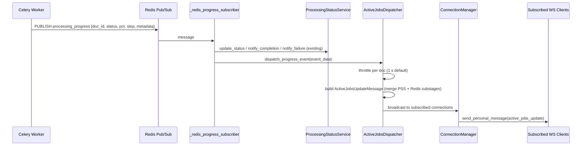

# Design Document: Live Active Jobs Report

## Overview

This feature extends the existing WebSocket progress event pipeline so that the same Redis pub/sub events that drive individual upload progress tiles also push incremental row-level updates to the Active Jobs report table. Currently, the Active Jobs table (rendered by `StatusReportService.format_human_summary`) only refreshes on page reload via a full PostgreSQL poll. After this change, any dashboard connection that subscribes to `active_jobs` will receive real-time row updates — including progress percentage, current step, substage breakdown (Bridges/KG), elapsed time, and retry count — without a page refresh.

The design adds a thin fan-out layer between the existing `_redis_progress_subscriber` → `ProcessingStatusService` path and a new set of "active jobs subscriber" connections managed by `ConnectionManager`. A per-document throttle ensures rapid Celery progress events do not overwhelm WebSocket clients.

## Architecture

The new data flow piggybacks on the existing Redis progress subscriber loop in `main.py`:



### Key design decisions

1. **Fan-out at the subscriber, not inside ProcessingStatusService.** PSS is responsible for per-upload, per-connection tracking. Active Jobs updates are a broadcast concern — a separate `ActiveJobsDispatcher` keeps responsibilities clean and avoids coupling PSS to a subscriber set it doesn't own.

2. **Throttle lives in the dispatcher, not in ConnectionManager.** The throttle is per-document, per-connection. The dispatcher accumulates the latest state and flushes on a configurable interval, so ConnectionManager stays a dumb pipe.

3. **Initial snapshot reuses `StatusReportService` query + merge logic.** On subscribe, the dispatcher calls `StatusReportService._fetch_active_jobs` + `_merge_in_memory_data` (already battle-tested) and reshapes the result into the `active_jobs_snapshot` message. No new SQL.

4. **Subscription state lives on ConnectionManager.** A `Set[str]` of connection IDs that opted in. This keeps disconnect cleanup in one place (ConnectionManager already handles it).

## Components and Interfaces

### 1. ConnectionManager extensions

New state and methods added to the existing `ConnectionManager` class:

```python
class ConnectionManager:
    # Existing state ...
    _active_jobs_subscribers: Set[str]  # connection IDs subscribed to active jobs

    def subscribe_active_jobs(self, connection_id: str) -> None
    def unsubscribe_active_jobs(self, connection_id: str) -> None
    def get_active_jobs_subscribers(self) -> Set[str]
    # disconnect() updated to also remove from _active_jobs_subscribers
```

### 2. ActiveJobsDispatcher (new service)

Lives in `src/multimodal_librarian/services/active_jobs_dispatcher.py`.

```python
class ActiveJobsDispatcher:
    """Receives progress events, throttles, and broadcasts to active-jobs subscribers."""

    def __init__(
        self,
        connection_manager: ConnectionManager,
        processing_status_service: ProcessingStatusService,
        status_report_service: Optional[StatusReportService],
        throttle_interval_ms: int = 1000,
    ): ...

    async def on_progress_event(self, event_data: dict) -> None:
        """Called by _redis_progress_subscriber for every progress message."""

    async def send_initial_snapshot(self, connection_id: str) -> None:
        """Send full active_jobs_snapshot to a newly subscribed connection."""

    async def _flush_throttled(self, document_id: str) -> None:
        """Send the latest accumulated state for a document to all subscribers."""

    def _build_job_payload(self, event_data: dict) -> dict:
        """Build the `job` object for an Active_Jobs_Update_Message."""

    async def _build_snapshot_jobs(self) -> list[dict]:
        """Query DB + in-memory data and reshape into job payloads."""
```

### 3. ActiveJobsUpdateMessage / ActiveJobsSnapshotMessage (Pydantic models)

New models in `src/multimodal_librarian/api/models/active_jobs_models.py`:

```python
class SubstageInfo(BaseModel):
    label: str          # "Bridges" or "KG"
    percentage: int     # 0–100

class ActiveJobPayload(BaseModel):
    document_id: str
    document_title: str
    status: str                          # pending | running | completed | failed
    current_step: Optional[str]
    progress_percentage: int             # 0–100
    elapsed_seconds: Optional[float]
    retry_count: int
    substages: Optional[List[SubstageInfo]]
    error_message: Optional[str] = None

class ActiveJobsUpdateMessage(BaseModel):
    type: Literal["active_jobs_update"] = "active_jobs_update"
    job: ActiveJobPayload
    timestamp: str                       # ISO 8601

class ActiveJobsSnapshotMessage(BaseModel):
    type: Literal["active_jobs_snapshot"] = "active_jobs_snapshot"
    jobs: List[ActiveJobPayload]
    timestamp: str                       # ISO 8601
    error: Optional[str] = None          # populated on degraded snapshot
```

### 4. _redis_progress_subscriber modification

After the existing `notify_processing_status_update` / `notify_processing_completion` / `notify_processing_failure` call, the subscriber also calls `dispatcher.on_progress_event(data)` to fan out to active-jobs subscribers.

### 5. WebSocket message handler extension

`handle_websocket_message` in `chat.py` gains two new branches:

```python
elif message_type == 'subscribe_active_jobs':
    manager.subscribe_active_jobs(connection_id)
    await dispatcher.send_initial_snapshot(connection_id)

elif message_type == 'unsubscribe_active_jobs':
    manager.unsubscribe_active_jobs(connection_id)
```

### 6. DI wiring

New dependency provider in `services.py`:

```python
async def get_active_jobs_dispatcher(
    connection_manager = Depends(get_connection_manager),
    processing_status_service = Depends(get_processing_status_service),
    status_report_service = Depends(get_status_report_service_optional),
) -> ActiveJobsDispatcher: ...
```

The dispatcher singleton is also stored on `app.state` so `_redis_progress_subscriber` can access it without DI (same pattern as `ProcessingStatusService`).

## Data Models

### WebSocket inbound messages (client → server)

| Message | Schema |
|---------|--------|
| Subscribe | `{"type": "subscribe_active_jobs"}` |
| Unsubscribe | `{"type": "unsubscribe_active_jobs"}` |

### WebSocket outbound messages (server → client)

#### `active_jobs_update`

```json
{
  "type": "active_jobs_update",
  "job": {
    "document_id": "uuid-string",
    "document_title": "My Document.pdf",
    "status": "running",
    "current_step": "Generating bridges & knowledge graph",
    "progress_percentage": 54,
    "elapsed_seconds": 123.4,
    "retry_count": 0,
    "substages": [
      {"label": "Bridges", "percentage": 72},
      {"label": "KG", "percentage": 36}
    ],
    "error_message": null
  },
  "timestamp": "2025-01-15T12:34:56.789Z"
}
```

#### `active_jobs_snapshot`

```json
{
  "type": "active_jobs_snapshot",
  "jobs": [ /* array of job objects, same schema as above */ ],
  "timestamp": "2025-01-15T12:34:56.789Z",
  "error": null
}
```

### Throttle state (internal to ActiveJobsDispatcher)

Per-document, per-connection:
- `_last_sent: Dict[str, Dict[str, float]]` — `{document_id: {connection_id: unix_timestamp}}`
- `_pending_state: Dict[str, dict]` — latest accumulated event data per document, flushed on next interval tick

### Redis keys read (existing, no changes)

| Key | Type | Description |
|-----|------|-------------|
| `docprog:{document_id}:bridges` | string (float 0.0–1.0) | Bridges substage fraction |
| `docprog:{document_id}:kg` | string (float 0.0–1.0) | KG substage fraction |

### PostgreSQL queries (existing, reused)

The `_fetch_active_jobs` query on `processing_jobs JOIN knowledge_sources` is reused for the initial snapshot. No new tables or columns.

### Configuration

| Env var | Default | Description |
|---------|---------|-------------|
| `ACTIVE_JOBS_UPDATE_INTERVAL_MS` | `1000` | Minimum interval between updates per document per connection |


## Correctness Properties

*A property is a characteristic or behavior that should hold true across all valid executions of a system — essentially, a formal statement about what the system should do. Properties serve as the bridge between human-readable specifications and machine-verifiable correctness guarantees.*

### Property 1: Subscribe grows the subscriber set

*For any* set of N distinct connection IDs, subscribing each of them to active jobs should result in a subscriber set of exactly size N, and each connection ID should be present in the set.

**Validates: Requirements 1.1, 1.4**

### Property 2: Unsubscribe and disconnect remove from subscriber set

*For any* connection ID that has been subscribed to active jobs, calling either `unsubscribe_active_jobs` or `disconnect` should remove that connection from the subscriber set, and the remaining subscribers should be unaffected.

**Validates: Requirements 1.2, 1.3**

### Property 3: Fan-out delivers to all subscribers

*For any* progress event and any set of subscribed connections, dispatching the event should result in every subscribed connection receiving exactly one `active_jobs_update` message (subject to throttle) with a matching `document_id`.

**Validates: Requirements 2.1**

### Property 4: Payload schema completeness

*For any* valid progress event data, the constructed `ActiveJobPayload` should contain all required fields (`document_id` as string, `document_title` as string, `status` as string, `current_step` as string or null, `progress_percentage` as integer 0–100, `elapsed_seconds` as float or null, `retry_count` as integer, `substages` as list or null) and the enclosing message should include a valid ISO 8601 `timestamp`.

**Validates: Requirements 2.2, 4.2, 5.2, 5.4**

### Property 5: Failure events carry status and error message

*For any* failure progress event with an arbitrary error string, the dispatched `ActiveJobsUpdateMessage` should have `status` equal to `"failed"` and `error_message` equal to the original error string.

**Validates: Requirements 2.4**

### Property 6: Substage inclusion when fractions are incomplete

*For any* progress event with `task_name` in `{bridges, kg}` where at least one Redis substage fraction is less than 1.0, the constructed payload should include a `substages` array with entries containing `label` (string) and `percentage` (integer 0–100) for each incomplete substage. When both fractions are ≥ 1.0, `substages` should be null.

**Validates: Requirements 3.1, 3.3**

### Property 7: Snapshot merge picks the more recent data source

*For any* pair of a PostgreSQL job row and an in-memory `ProcessingStatusTracker` for the same document, the merged result should use `progress_percentage` and `current_step` from whichever source has the more recent timestamp.

**Validates: Requirements 4.3**

### Property 8: Elapsed seconds equals time since started_at

*For any* job with a non-null `started_at` timestamp, `elapsed_seconds` should equal the difference between the current UTC time and `started_at` (within a small tolerance). When `started_at` is null, `elapsed_seconds` should be null.

**Validates: Requirements 6.1, 6.2**

### Property 9: Throttle sends latest state at most once per interval

*For any* sequence of N ≥ 1 progress events for the same document arriving within a single throttle interval, the dispatcher should send at most one `active_jobs_update` message per subscribed connection, and that message should reflect the state of the last (most recent) event in the sequence.

**Validates: Requirements 8.1, 8.2**

## Error Handling

| Scenario | Behavior |
|----------|----------|
| **PSS unavailable at snapshot time** | Build snapshot from PostgreSQL only; log warning. Include all DB fields; `progress_percentage` and `current_step` come from DB row without in-memory override. (Req 7.1) |
| **PostgreSQL unavailable at snapshot time** | Build snapshot from in-memory `ProcessingStatusService._tracking` only; log warning. Synthetic rows are created for each tracked document. (Req 7.2) |
| **Both sources unavailable** | Send `active_jobs_snapshot` with `jobs: []` and `error` field describing the issue. (Req 7.3) |
| **WebSocket send fails for a subscriber** | Catch exception, log error, remove connection from subscriber set (treat as disconnected). Do not block other subscribers. |
| **Redis substage keys missing** | Treat missing keys as fraction 0.0 (existing behavior in `_get_substage_rows`). Substages array omitted if both keys are absent. |
| **Malformed progress event from Redis** | Log error, skip event. Do not crash the subscriber loop. (Existing behavior in `_redis_progress_subscriber`.) |
| **Throttle timer callback fails** | Log error, clear pending state for that document. Next event will start a fresh throttle cycle. |

## Testing Strategy

### Property-based tests (Hypothesis, minimum 100 iterations each)

Property-based testing is appropriate here because the core logic involves pure functions (payload construction, merge logic, throttle state management, set operations) with clear input/output behavior and a large input space (arbitrary document IDs, progress percentages, timestamps, error strings).

Library: **Hypothesis** (already in use in this project — `.hypothesis/` directory exists).

Each property test will be tagged with:
`Feature: live-active-jobs-report, Property {N}: {title}`

| Property | What to generate | What to assert |
|----------|-----------------|----------------|
| P1: Subscribe grows set | Random lists of distinct connection ID strings | Subscriber set size == list length; all IDs present |
| P2: Unsubscribe/disconnect removes | Random subscriber sets + random ID to remove | Removed ID absent; others unchanged |
| P3: Fan-out to all | Random event dicts + random subscriber sets | Mock `send_personal_message` called once per subscriber |
| P4: Payload schema | Random event data (strings, ints 0–100, optional nulls) | All required fields present with correct types; timestamp parses as ISO 8601 |
| P5: Failure status + error | Random error strings | `status == "failed"`, `error_message == input_error` |
| P6: Substage inclusion | Random float pairs (0.0–1.0) for bridges/kg fractions | Substages present when any < 1.0; null when both ≥ 1.0 |
| P7: Merge recency | Random (db_timestamp, mem_timestamp, db_pct, mem_pct) tuples | Winner is the source with the later timestamp |
| P8: Elapsed seconds | Random `started_at` datetimes in the past (and None) | `elapsed_seconds ≈ now - started_at`; None when started_at is None |
| P9: Throttle latest-only | Random lists of event dicts with increasing progress | At most 1 send per interval; sent payload matches last event |

### Unit tests (example-based)

| Test | Covers |
|------|--------|
| Completion event sets status to "completed" | Req 2.3 |
| Snapshot on subscribe sends `active_jobs_snapshot` | Req 4.1 |
| Message type literals are correct | Req 5.1, 5.3 |
| `ACTIVE_JOBS_UPDATE_INTERVAL_MS` env var configures throttle | Req 8.3 |

### Integration / degradation tests (example-based)

| Test | Covers |
|------|--------|
| Snapshot with PSS=None uses DB only | Req 7.1 |
| Snapshot with DB error uses in-memory only | Req 7.2 |
| Snapshot with both unavailable returns empty + error | Req 7.3 |
| Incremental updates continue when DB is down | Req 7.4 |
