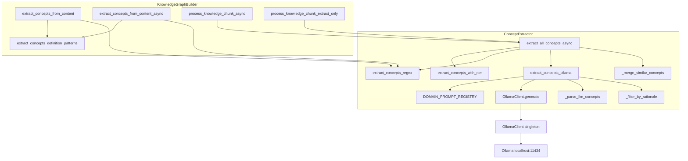

# Design Document: LLM Concept Extraction

## Overview

This design adds real LLM-based concept extraction to the knowledge graph pipeline by wiring the existing `OllamaClient` (llama3.2:3b via localhost:11434) into `ConceptExtractor`. The change introduces a domain-specific prompt registry keyed by `ContentType`, a new `extract_concepts_ollama` async method with anti-hallucination rationale filtering, and integration into the existing merge pipeline alongside regex, NER, and embedding extraction.

The existing `extract_concepts_llm` method (which is actually regex-based definition-pattern matching) is renamed to `extract_concepts_definition_patterns` to free the naming space and avoid confusion.

All changes are confined to `kg_builder.py` and its callers. No new files are created. The `OllamaClient` is used as-is from `ollama_client.py`.

## Architecture



### Data Flow

1. `extract_all_concepts_async(text, content_type)` is called with text and a `ContentType`
2. NER, regex, and Ollama extraction run concurrently (NER and Ollama are async, regex is sync)
3. Ollama extraction selects a domain prompt from `DOMAIN_PROMPT_REGISTRY`, sends it to `OllamaClient.generate()`, parses the JSON response, filters by rationale grounding, and assigns domain-aware confidence
4. All three result lists are fed into `_merge_similar_concepts` which deduplicates by normalized name, keeping the higher confidence value
5. The merged list is returned to the caller

### Graceful Degradation

When Ollama is unavailable (server down, timeout, model not loaded), `extract_concepts_ollama` returns `[]` with a warning log. The pipeline continues with NER + regex only, matching the existing NER degradation pattern.

## Components and Interfaces

### 1. Method Rename: `extract_concepts_llm` → `extract_concepts_definition_patterns`

The existing `extract_concepts_llm` method on `ConceptExtractor` is renamed to `extract_concepts_definition_patterns`. Its signature and behavior are unchanged:

```python
def extract_concepts_definition_patterns(self, text: str, chunk_id: str) -> List[ConceptNode]:
```

All callers in `KnowledgeGraphBuilder` (`extract_concepts_from_content`, `extract_concepts_from_content_async`) are updated to call the new name. The test file and script are also updated.

### 2. Domain Prompt Registry: `DOMAIN_PROMPT_REGISTRY`

A module-level dictionary mapping `ContentType` to prompt configuration dicts. Follows the same pattern as `SmartBridgeGenerator._initialize_domain_strategies()` but for concept extraction.

```python
DOMAIN_PROMPT_REGISTRY: Dict[ContentType, Dict[str, Any]] = {
    ContentType.TECHNICAL: {
        "domain_description": "technical documentation",
        "concept_types": ["API", "PROTOCOL", "ALGORITHM", "DATA_STRUCTURE", "FRAMEWORK", "DESIGN_PATTERN"],
    },
    ContentType.MEDICAL: {
        "domain_description": "medical/clinical content",
        "concept_types": ["DISEASE", "DRUG", "PROCEDURE", "ANATOMY", "LAB_TEST", "GENE", "PATHWAY"],
    },
    ContentType.LEGAL: {
        "domain_description": "legal content",
        "concept_types": ["STATUTE", "CASE_NAME", "DOCTRINE", "PARTY", "JURISDICTION", "REGULATORY_BODY"],
    },
    ContentType.ACADEMIC: {
        "domain_description": "academic/research content",
        "concept_types": ["THEORY", "METHODOLOGY", "RESEARCHER", "INSTITUTION", "DATASET", "METRIC"],
    },
    ContentType.NARRATIVE: {
        "domain_description": "narrative content",
        "concept_types": ["CHARACTER", "LOCATION", "EVENT", "THEME", "TIME_PERIOD"],
    },
    ContentType.GENERAL: {
        "domain_description": "general content",
        "concept_types": ["ENTITY", "TOPIC", "ORGANIZATION", "PERSON", "LOCATION"],
    },
}
```

A shared prompt skeleton is used across all domains:

```python
CONCEPT_EXTRACTION_PROMPT_TEMPLATE = """Extract key concepts from the following {domain_description}.

Valid concept types: {concept_types}

Return a JSON array where each element has:
- "name": the concept name (exact phrase from the text)
- "type": one of the valid concept types above
- "rationale": quote the supporting phrase from the source text

Only extract terms explicitly mentioned or directly implied.
Do not infer concepts not grounded in the text.

Source text:
{text}

JSON array:"""
```

### 3. Lazy OllamaClient on ConceptExtractor

Following the `SmartBridgeGenerator._get_ollama_client()` pattern:

```python
class ConceptExtractor:
    def __init__(self):
        # ... existing init ...
        self._ollama_client: Optional[OllamaClient] = None  # Lazy

    async def _get_ollama_client(self) -> Optional[OllamaClient]:
        if self._ollama_client is not None:
            return self._ollama_client
        from ...clients.ollama_client import get_ollama_client
        client = get_ollama_client()
        if await client.is_available():
            self._ollama_client = client
            return client
        return None
```

No import at module level. The `get_ollama_client()` singleton factory is called on first use and cached.

### 4. `extract_concepts_ollama` Method

```python
async def extract_concepts_ollama(
    self, text: str, content_type: ContentType = ContentType.GENERAL
) -> List[ConceptNode]:
```

Steps:
1. Get OllamaClient via `_get_ollama_client()`. If unavailable, return `[]`.
2. Look up prompt config from `DOMAIN_PROMPT_REGISTRY[content_type]`.
3. Format `CONCEPT_EXTRACTION_PROMPT_TEMPLATE` with domain description, concept types, and text.
4. Call `await client.generate(prompt, temperature=0.3, max_tokens=1000)`.
5. If `response.is_successful()` is False, log warning and return `[]`.
6. Parse JSON array from `response.content`. On `json.JSONDecodeError`, log warning and return `[]`.
7. For each entry with `name`, `type`, and `rationale` fields, apply rationale filter.
8. Create `ConceptNode` objects for passing entries with domain-aware confidence.
9. Return the list.

### 5. Anti-Hallucination Rationale Filter

```python
def _filter_by_rationale(
    self, candidates: List[Dict], source_text: str
) -> List[Dict]:
```

For each candidate:
- If `rationale` is empty/missing → discard, log debug
- If `rationale.lower()` is not a substring of `source_text.lower()` → discard, log debug
- Otherwise → keep

This runs after JSON parsing and before ConceptNode creation.

### 6. Domain-Aware Confidence Scoring

| ContentType | Base Confidence |
|---|---|
| GENERAL, TECHNICAL, NARRATIVE, ACADEMIC | 0.70 |
| MEDICAL, LEGAL | 0.65 |

These are below the regex seed confidence (0.85) and NER confidence (0.85), ensuring the merge pipeline prioritizes higher-certainty methods. When an LLM concept overlaps with a regex/NER concept by normalized name, `_merge_similar_concepts` keeps the higher confidence (regex/NER wins).

### 7. Integration into `extract_all_concepts_async`

The method signature gains an optional `content_type` parameter:

```python
async def extract_all_concepts_async(
    self, text: str, content_type: ContentType = ContentType.GENERAL
) -> List[ConceptNode]:
```

Inside, Ollama extraction is added alongside NER and regex:

```python
ner_concepts, ollama_concepts = await asyncio.gather(
    self.extract_concepts_with_ner(text),
    self.extract_concepts_ollama(text, content_type),
)
regex_concepts = self.extract_concepts_regex(text)

merged: Dict[str, ConceptNode] = {}
for concept in ner_concepts + regex_concepts + ollama_concepts:
    key = self._normalize_concept_name(concept.concept_name)
    existing = merged.get(key)
    if existing is None or concept.confidence > existing.confidence:
        merged[key] = concept
return list(merged.values())
```

### 8. Caller Updates in KnowledgeGraphBuilder

- `process_knowledge_chunk_async`: passes `chunk.content_type` (or `ContentType.GENERAL` if absent) to `extract_all_concepts_async`
- `process_knowledge_chunk_extract_only`: same content_type passthrough
- `extract_concepts_from_content` (sync): calls `extract_concepts_definition_patterns` instead of `extract_concepts_llm`
- `extract_concepts_from_content_async`: calls `extract_concepts_definition_patterns` instead of `extract_concepts_llm`

## Data Models

No new data models are introduced. Existing models used:

| Model | Usage |
|---|---|
| `ConceptNode` | Created by `extract_concepts_ollama` with `concept_type` from LLM response, `confidence` from domain scoring, `concept_id` from `f"{concept_type.lower()}_{normalized_name}"` |
| `ContentType` | Enum key for `DOMAIN_PROMPT_REGISTRY` lookup; passed through from `KnowledgeChunk.content_type` |
| `OllamaResponse` | Returned by `OllamaClient.generate()`; checked via `.is_successful()` and `.content` |

### Prompt Registry Entry Schema

```python
{
    "domain_description": str,      # e.g. "technical documentation"
    "concept_types": List[str],     # e.g. ["API", "PROTOCOL", ...]
}
```

### LLM Response Schema (expected JSON from Ollama)

```json
[
    {
        "name": "knowledge graph",
        "type": "DATA_STRUCTURE",
        "rationale": "builds incremental knowledge graphs"
    }
]
```


## Correctness Properties

*A property is a characteristic or behavior that should hold true across all valid executions of a system — essentially, a formal statement about what the system should do. Properties serve as the bridge between human-readable specifications and machine-verifiable correctness guarantees.*

### Property 1: Definition patterns rename preserves behavior

*For any* text string and chunk_id, calling `extract_concepts_definition_patterns(text, chunk_id)` should produce the same list of ConceptNode objects (same names, types, and confidences) as the original `extract_concepts_llm` logic would have produced.

**Validates: Requirements 1.1**

### Property 2: OllamaClient caching is idempotent

*For any* ConceptExtractor instance where Ollama is available, calling `_get_ollama_client()` multiple times should return the exact same object reference each time (i.e., `_get_ollama_client() is _get_ollama_client()`).

**Validates: Requirements 2.3**

### Property 3: Registry covers all ContentTypes

*For any* value in the `ContentType` enum, `DOMAIN_PROMPT_REGISTRY` should contain an entry with a non-empty `domain_description` string and a non-empty `concept_types` list.

**Validates: Requirements 3.1**

### Property 4: Formatted prompt contains all required elements

*For any* `ContentType` and any non-empty source text, the formatted prompt should contain: the domain-specific concept types from the registry, the JSON output field names (`name`, `type`, `rationale`), the guardrail instruction "Only extract terms explicitly mentioned or directly implied", the grounding instruction "Do not infer concepts not grounded in the text", and the source text itself.

**Validates: Requirements 3.8, 3.9, 4.2, 9.1, 9.2, 9.3, 9.4**

### Property 5: OllamaClient called with correct parameters

*For any* non-empty text and any ContentType, when `extract_concepts_ollama` invokes `OllamaClient.generate`, it should pass `temperature=0.3` and the prompt should contain the source text.

**Validates: Requirements 4.3**

### Property 6: Valid JSON response produces ConceptNodes with correct types

*For any* valid JSON array of concept entries where each entry has `name`, `type`, and `rationale` fields (and the rationale appears in the source text), parsing should produce a list of ConceptNode objects where each node's `concept_type` matches the `type` field from the corresponding JSON entry.

**Validates: Requirements 4.4, 4.5**

### Property 7: Rationale filter keeps concepts iff rationale is a substring of source text

*For any* source text and any list of candidate concept dicts, `_filter_by_rationale` should keep a candidate if and only if its `rationale` field is a non-empty string that appears as a case-insensitive substring of the source text. Candidates with empty, missing, or non-matching rationales should be discarded.

**Validates: Requirements 5.1, 5.2, 5.4**

### Property 8: Domain-aware confidence scoring

*For any* ContentType, LLM-extracted concepts should receive a base confidence of 0.70 for GENERAL, TECHNICAL, NARRATIVE, and ACADEMIC, and 0.65 for MEDICAL and LEGAL. All values should be strictly less than 0.85.

**Validates: Requirements 6.1, 6.2, 6.3**

### Property 9: Merge pipeline keeps higher confidence on overlap

*For any* two ConceptNode lists where one contains an LLM-extracted concept (confidence ≤ 0.70) and the other contains a regex or NER concept (confidence 0.85) with the same normalized name, `_merge_similar_concepts` should produce a single concept with confidence 0.85.

**Validates: Requirements 6.4**

### Property 10: Unavailable Ollama returns empty list without exception

*For any* text input and any ContentType, when OllamaClient is unavailable (is_available returns False), `extract_concepts_ollama` should return an empty list and should not raise any exception.

**Validates: Requirements 7.2**

### Property 11: Pipeline produces concepts from other methods when Ollama is down

*For any* text that contains regex-matchable concepts (e.g., multi-word terms, code terms), when Ollama is unavailable, `extract_all_concepts_async` should still return a non-empty list of concepts from the regex and/or NER extraction methods.

**Validates: Requirements 7.4**

## Error Handling

| Scenario | Behavior | Log Level |
|---|---|---|
| Ollama server unreachable | `_get_ollama_client()` returns `None`, `extract_concepts_ollama` returns `[]` | WARNING |
| Ollama model not loaded | `is_available()` returns `False`, same as unreachable | WARNING |
| Ollama request timeout | `OllamaResponse.error` is set, method returns `[]` | WARNING |
| Malformed JSON in LLM response | `json.JSONDecodeError` caught, method returns `[]` | WARNING |
| JSON array contains entries missing required fields | Entries without `name`/`type`/`rationale` are silently skipped | DEBUG |
| Rationale not found in source text | Concept discarded | DEBUG |
| Empty/missing rationale field | Concept discarded | DEBUG |
| ContentType not in chunk metadata | Defaults to `ContentType.GENERAL` | None (silent default) |
| Unexpected exception in `extract_concepts_ollama` | Caught at top level, returns `[]` | WARNING |

All error paths return empty lists rather than raising exceptions, matching the existing NER graceful degradation pattern (`extract_concepts_with_ner` returns `[]` on failure).

## Testing Strategy

### Property-Based Testing

Use **Hypothesis** (already present in the project — `.hypothesis/` directory exists) for property-based tests. Each property test runs a minimum of 100 iterations.

Each property-based test must be tagged with a comment referencing the design property:
```python
# Feature: llm-concept-extraction, Property 7: Rationale filter keeps concepts iff rationale is a substring of source text
```

Property tests focus on:
- **Property 1**: Generate random text with definition patterns ("X is a Y"), verify `extract_concepts_definition_patterns` output matches the old logic
- **Property 2**: Mock OllamaClient, call `_get_ollama_client()` N times, assert identity (`is`)
- **Property 3**: Iterate all `ContentType` values, assert registry entry structure
- **Property 4**: For random ContentType and text, format prompt and assert all required substrings present
- **Property 5**: Mock `OllamaClient.generate`, call `extract_concepts_ollama` with random text, inspect call args for temperature=0.3 and text presence
- **Property 6**: Generate random valid JSON arrays with name/type/rationale (rationale drawn from source text), verify ConceptNode types match
- **Property 7**: Generate random source texts and rationale strings (some substrings of source, some not), verify filter keeps/discards correctly
- **Property 8**: For random ContentType, verify confidence matches the scoring table
- **Property 9**: Generate pairs of ConceptNodes with same normalized name but different confidences (LLM ≤ 0.70, regex/NER = 0.85), verify merge keeps 0.85
- **Property 10**: Mock unavailable OllamaClient, call with random text, verify empty list and no exception
- **Property 11**: Mock unavailable Ollama but available NER/regex, call with text containing known patterns, verify non-empty result

### Unit Testing

Unit tests complement property tests for specific examples and edge cases:
- Specific domain prompt content checks (e.g., MEDICAL has "DISEASE", "DRUG", etc.) — validates requirements 3.2–3.7
- `extract_concepts_llm` method no longer exists on ConceptExtractor (requirement 1.3)
- `_ollama_client` is `None` after `__init__` (requirement 2.1)
- No OllamaClient import at module level (requirement 2.4)
- Malformed JSON response returns `[]` (requirement 4.6)
- Error response returns `[]` (requirement 4.7)
- Timeout returns `[]` (requirement 7.3)
- Missing content_type defaults to GENERAL (requirement 8.3)
- Integration: `process_knowledge_chunk_async` includes Ollama concepts (requirement 8.5)

### Test Configuration

- Library: `hypothesis` with `@given` decorator and `@settings(max_examples=100)`
- Mocking: `unittest.mock.AsyncMock` for `OllamaClient.generate` and `is_available`
- Async tests: `pytest-asyncio` with `@pytest.mark.asyncio`
- Each correctness property is implemented by a single property-based test function
