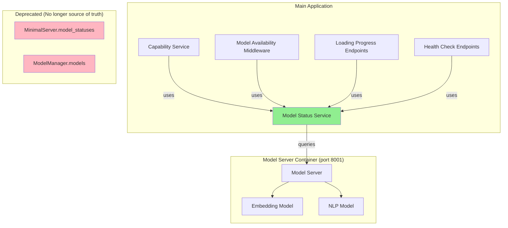

# Design Document: Model Status Unification

## Overview

This design introduces a unified Model Status Service that serves as the single source of truth for ML model availability across the application. The service queries the actual model server container (running on port 8001) and provides consistent model status information to all consumers: the Capability Service, Model Availability Middleware, and loading progress endpoints.

The key insight is that the application currently has three conflicting status sources:
1. **MinimalServer**: Maintains fake `model_statuses` that get set to "loaded" without checking real status
2. **ModelManager**: Has `ModelInstance` objects stuck in `pending` state forever
3. **Model Server**: The actual source of truth with real loaded models

This design eliminates the first two as sources of truth and establishes the Model Server as the authoritative source via a new unified service.

## Architecture



## Components and Interfaces

### Model Status Service

The core component that queries the model server and provides unified status information.

```python
from dataclasses import dataclass, field
from typing import Dict, List, Optional, Set
from enum import Enum
import asyncio
import time
import logging

logger = logging.getLogger(__name__)


class ModelServerStatus(Enum):
    """Status of the model server connection."""
    CONNECTED = "connected"
    DISCONNECTED = "disconnected"
    UNKNOWN = "unknown"


@dataclass
class ModelInfo:
    """Information about a single model from the model server."""
    name: str
    status: str  # "loaded", "loading", "error", "not_loaded"
    model_type: Optional[str] = None
    load_time_seconds: Optional[float] = None
    memory_mb: Optional[float] = None
    error_message: Optional[str] = None


@dataclass
class ModelStatusSnapshot:
    """Snapshot of model server status at a point in time."""
    server_status: ModelServerStatus
    server_ready: bool
    models: Dict[str, ModelInfo]
    timestamp: float
    capabilities: Set[str]
    error_message: Optional[str] = None


class ModelStatusService:
    """
    Unified service for querying model availability from the model server.
    
    This service is the single source of truth for model status across
    the application. It queries the model server's health endpoint and
    caches results to avoid excessive requests.
    """
    
    # Mapping from model server models to application capabilities
    MODEL_TO_CAPABILITIES: Dict[str, List[str]] = {
        "embedding": [
            "document_analysis",
            "simple_search", 
            "semantic_search",
            "document_upload",
        ],
        "nlp": [
            "basic_chat",
            "document_upload",
            "text_processing",
        ],
    }
    
    # Reverse mapping: capability -> required models
    CAPABILITY_TO_MODELS: Dict[str, List[str]] = {
        "document_analysis": ["embedding"],
        "simple_search": ["embedding"],
        "semantic_search": ["embedding"],
        "document_upload": ["embedding", "nlp"],
        "basic_chat": ["nlp"],
        "text_processing": ["nlp"],
        "advanced_chat": ["embedding", "nlp"],  # Requires both
    }
    
    def __init__(
        self,
        model_client: Optional["ModelServerClient"] = None,
        cache_ttl_seconds: float = 5.0,
        retry_delay_seconds: float = 2.0,
        max_retries: int = 3,
    ):
        """
        Initialize the Model Status Service.
        
        Args:
            model_client: The model server client (injected via DI)
            cache_ttl_seconds: How long to cache status before refreshing
            retry_delay_seconds: Delay between retries on failure
            max_retries: Maximum retry attempts for health checks
        """
        self._model_client = model_client
        self._cache_ttl = cache_ttl_seconds
        self._retry_delay = retry_delay_seconds
        self._max_retries = max_retries
        
        # Cached status
        self._cached_status: Optional[ModelStatusSnapshot] = None
        self._cache_lock = asyncio.Lock()
        
        # Background refresh task
        self._refresh_task: Optional[asyncio.Task] = None
        self._running = False
    
    async def start_background_refresh(self, interval_seconds: float = 10.0):
        """Start background task to periodically refresh status."""
        self._running = True
        self._refresh_task = asyncio.create_task(
            self._background_refresh_loop(interval_seconds)
        )
        logger.info("Model status background refresh started")
    
    async def stop_background_refresh(self):
        """Stop the background refresh task."""
        self._running = False
        if self._refresh_task:
            self._refresh_task.cancel()
            try:
                await self._refresh_task
            except asyncio.CancelledError:
                pass
        logger.info("Model status background refresh stopped")
    
    async def _background_refresh_loop(self, interval: float):
        """Background loop to refresh status periodically."""
        while self._running:
            try:
                await self.refresh_status()
            except Exception as e:
                logger.warning(f"Background status refresh failed: {e}")
            await asyncio.sleep(interval)
    
    async def get_status(self, force_refresh: bool = False) -> ModelStatusSnapshot:
        """
        Get current model status, using cache if valid.
        
        Args:
            force_refresh: If True, bypass cache and query model server
            
        Returns:
            ModelStatusSnapshot with current status
        """
        async with self._cache_lock:
            # Check if cache is valid
            if not force_refresh and self._cached_status:
                age = time.time() - self._cached_status.timestamp
                if age < self._cache_ttl:
                    return self._cached_status
            
            # Refresh status
            return await self._fetch_status()
    
    async def refresh_status(self) -> ModelStatusSnapshot:
        """Force refresh the cached status."""
        return await self.get_status(force_refresh=True)
    
    async def _fetch_status(self) -> ModelStatusSnapshot:
        """Fetch status from model server with retry logic."""
        if not self._model_client:
            return self._create_unavailable_status("Model client not initialized")
        
        last_error = None
        for attempt in range(self._max_retries):
            try:
                health_data = await self._model_client.health_check()
                status = self._parse_health_response(health_data)
                self._cached_status = status
                return status
            except Exception as e:
                last_error = e
                logger.warning(
                    f"Model server health check failed "
                    f"(attempt {attempt + 1}/{self._max_retries}): {e}"
                )
                if attempt < self._max_retries - 1:
                    await asyncio.sleep(self._retry_delay * (attempt + 1))
        
        # All retries failed
        status = self._create_unavailable_status(str(last_error))
        self._cached_status = status
        return status
    
    def _parse_health_response(self, health_data: Dict) -> ModelStatusSnapshot:
        """Parse model server health response into ModelStatusSnapshot."""
        models = {}
        available_capabilities = set()
        
        # Parse models from health response
        models_data = health_data.get("models", {})
        for model_name, model_info in models_data.items():
            models[model_name] = ModelInfo(
                name=model_name,
                status=model_info.get("status", "unknown"),
                model_type=model_info.get("name"),
                load_time_seconds=model_info.get("load_time"),
                memory_mb=model_info.get("memory_mb"),
            )
            
            # If model is loaded, add its capabilities
            if model_info.get("status") == "loaded":
                caps = self.MODEL_TO_CAPABILITIES.get(model_name, [])
                available_capabilities.update(caps)
        
        return ModelStatusSnapshot(
            server_status=ModelServerStatus.CONNECTED,
            server_ready=health_data.get("ready", False),
            models=models,
            timestamp=time.time(),
            capabilities=available_capabilities,
        )
    
    def _create_unavailable_status(self, error_message: str) -> ModelStatusSnapshot:
        """Create a status snapshot indicating server is unavailable."""
        return ModelStatusSnapshot(
            server_status=ModelServerStatus.DISCONNECTED,
            server_ready=False,
            models={},
            timestamp=time.time(),
            capabilities=set(),
            error_message=error_message,
        )
    
    # Synchronous convenience methods
    
    def get_status_sync(self) -> ModelStatusSnapshot:
        """
        Get cached status synchronously (does not refresh).
        
        Returns cached status or unavailable status if no cache exists.
        """
        if self._cached_status:
            return self._cached_status
        return self._create_unavailable_status("No cached status available")
    
    def is_capability_available(self, capability: str) -> bool:
        """Check if a capability is currently available (sync, uses cache)."""
        status = self.get_status_sync()
        return capability in status.capabilities
    
    def is_model_loaded(self, model_name: str) -> bool:
        """Check if a specific model is loaded (sync, uses cache)."""
        status = self.get_status_sync()
        model = status.models.get(model_name)
        return model is not None and model.status == "loaded"
    
    def get_available_capabilities(self) -> Set[str]:
        """Get set of currently available capabilities (sync, uses cache)."""
        return self.get_status_sync().capabilities
    
    def get_required_models(self, capability: str) -> List[str]:
        """Get list of models required for a capability."""
        return self.CAPABILITY_TO_MODELS.get(capability, [])
    
    def get_capability_status(self, capability: str) -> Dict:
        """
        Get detailed status for a capability.
        
        Returns dict compatible with existing ModelManager interface.
        """
        status = self.get_status_sync()
        required_models = self.get_required_models(capability)
        
        available_models = []
        loading_models = []
        failed_models = []
        
        for model_name in required_models:
            model = status.models.get(model_name)
            if model:
                if model.status == "loaded":
                    available_models.append(model_name)
                elif model.status == "loading":
                    loading_models.append(model_name)
                elif model.status == "error":
                    failed_models.append(model_name)
        
        return {
            "capability": capability,
            "available": capability in status.capabilities,
            "required_models": required_models,
            "available_models": available_models,
            "loading_models": loading_models,
            "failed_models": failed_models,
            "server_connected": status.server_status == ModelServerStatus.CONNECTED,
        }
    
    def get_model_statuses_dict(self) -> Dict[str, str]:
        """
        Get model statuses as a simple dict.
        
        Returns dict compatible with MinimalServer.model_statuses format.
        """
        status = self.get_status_sync()
        result = {}
        
        for model_name, model_info in status.models.items():
            result[model_name] = model_info.status
        
        return result


# Dependency injection support
_model_status_service: Optional[ModelStatusService] = None


async def get_model_status_service() -> ModelStatusService:
    """
    FastAPI dependency for getting the Model Status Service.
    
    Creates and caches a singleton instance with the model client injected.
    """
    global _model_status_service
    
    if _model_status_service is None:
        from ..clients.model_server_client import get_model_client
        model_client = get_model_client()
        _model_status_service = ModelStatusService(model_client=model_client)
    
    return _model_status_service


def get_model_status_service_sync() -> Optional[ModelStatusService]:
    """Get the cached Model Status Service instance (sync, may be None)."""
    return _model_status_service


async def cleanup_model_status_service():
    """Clean up the Model Status Service."""
    global _model_status_service
    
    if _model_status_service:
        await _model_status_service.stop_background_refresh()
        _model_status_service = None
```

### Updated Capability Service Integration

The Capability Service will be updated to use the Model Status Service:

```python
# In capability_service.py - key changes

class CapabilityService:
    def __init__(self):
        self.start_time = time.time()
        self._capability_definitions = self._define_capabilities()
        self.eta_calculator = get_eta_calculator()
        # NEW: Will use Model Status Service instead of MinimalServer
        self._model_status_service: Optional[ModelStatusService] = None
    
    def set_model_status_service(self, service: ModelStatusService):
        """Inject the Model Status Service."""
        self._model_status_service = service
    
    def get_current_capabilities(self) -> Dict[str, CapabilityInfo]:
        """Get current system capabilities with real-time status."""
        capabilities = self._capability_definitions.copy()
        
        # Use Model Status Service if available
        if self._model_status_service:
            available_caps = self._model_status_service.get_available_capabilities()
            
            for cap_name, capability in capabilities.items():
                if cap_name in available_caps:
                    capability.available = True
                    capability.estimated_ready_time = None
                else:
                    capability.available = False
                    # Calculate ETA based on model server status
                    capability.estimated_ready_time = self._calculate_ready_time_from_service(
                        capability.dependencies
                    )
        
        return capabilities
```

### Updated Model Availability Middleware Integration

```python
# In model_availability_middleware.py - key changes

class ModelAvailabilityMiddleware(BaseHTTPMiddleware):
    def __init__(self, app: ASGIApp):
        super().__init__(app)
        # NEW: Use Model Status Service instead of ModelManager
        self._model_status_service: Optional[ModelStatusService] = None
        self.fallback_service = get_fallback_service()
        self.expectation_manager = get_expectation_manager()
        # ... rest of init
    
    def set_model_status_service(self, service: ModelStatusService):
        """Inject the Model Status Service."""
        self._model_status_service = service
    
    def _check_capability_availability(self, capabilities: list[str]) -> Dict[str, Any]:
        """Check if required capabilities are available using Model Status Service."""
        if not self._model_status_service:
            # Fallback: assume unavailable if service not initialized
            return {
                "all_available": False,
                "some_available": False,
                "available_capabilities": [],
                "unavailable_capabilities": capabilities,
                "loading_capabilities": [],
            }
        
        available = []
        unavailable = []
        loading = []
        
        for capability in capabilities:
            status = self._model_status_service.get_capability_status(capability)
            
            if status["available"]:
                available.append(capability)
            elif status["loading_models"]:
                loading.append(capability)
            else:
                unavailable.append(capability)
        
        return {
            "all_available": len(unavailable) == 0 and len(loading) == 0,
            "some_available": len(available) > 0,
            "available_capabilities": available,
            "unavailable_capabilities": unavailable,
            "loading_capabilities": loading,
        }
```

## Data Models

### Model Server Health Response

The model server returns health data in this format:

```json
{
  "status": "healthy",
  "ready": true,
  "models": {
    "embedding": {
      "name": "all-MiniLM-L6-v2",
      "status": "loaded",
      "load_time": 2.5,
      "memory_mb": 256
    },
    "nlp": {
      "name": "en_core_web_sm",
      "status": "loaded",
      "load_time": 1.2,
      "memory_mb": 128
    }
  }
}
```

### Capability to Model Mapping

| Capability | Required Models | Description |
|------------|-----------------|-------------|
| `document_analysis` | `embedding` | Analyze document content semantically |
| `simple_search` | `embedding` | Basic semantic search |
| `semantic_search` | `embedding` | Advanced semantic search |
| `document_upload` | `embedding`, `nlp` | Process uploaded documents |
| `basic_chat` | `nlp` | Basic conversational responses |
| `text_processing` | `nlp` | Text tokenization, NER, etc. |
| `advanced_chat` | `embedding`, `nlp` | Full RAG-enhanced chat |


## Correctness Properties

*A property is a characteristic or behavior that should hold true across all valid executions of a system—essentially, a formal statement about what the system should do. Properties serve as the bridge between human-readable specifications and machine-verifiable correctness guarantees.*

### Property 1: Cache TTL Behavior

*For any* sequence of status requests within the cache TTL period, the Model Status Service SHALL return the same cached status without making additional health check requests to the model server.

**Validates: Requirements 1.2**

### Property 2: Force Refresh Bypasses Cache

*For any* cached status, calling `get_status(force_refresh=True)` or `refresh_status()` SHALL make a new health check request to the model server regardless of cache age.

**Validates: Requirements 1.5**

### Property 3: Unavailable Status on Connection Failure

*For any* model server connection failure (timeout, connection refused, network error), the Model Status Service SHALL return a ModelStatusSnapshot with `server_status=DISCONNECTED`, `server_ready=False`, and an empty capabilities set.

**Validates: Requirements 1.3, 8.1**

### Property 4: Model-to-Capability Mapping Correctness

*For any* model server health response indicating a model is loaded, the Model Status Service SHALL report exactly the capabilities defined in MODEL_TO_CAPABILITIES for that model as available. Specifically:
- If `embedding` is loaded → `document_analysis`, `simple_search`, `semantic_search`, `document_upload` are available
- If `nlp` is loaded → `basic_chat`, `document_upload`, `text_processing` are available

**Validates: Requirements 2.2, 2.3, 2.4**

### Property 5: Capability Service Integration

*For any* capability query to the Capability Service, the returned availability status SHALL match the availability reported by the Model Status Service for that capability.

**Validates: Requirements 3.1, 3.3**

### Property 6: Middleware Request Routing

*For any* request requiring specific capabilities:
- If Model Status Service reports the capability as available → request proceeds to handler
- If Model Status Service reports the capability as unavailable → fallback response is returned

**Validates: Requirements 4.1, 4.3, 4.4**

### Property 7: Loading Endpoints Consistency

*For any* call to loading progress endpoints (`/api/loading/models`, `/api/loading/status`), the returned model statuses and counts SHALL match the data from Model Status Service.

**Validates: Requirements 5.1, 5.2, 5.3, 5.4**

### Property 8: Health Endpoints Consistency

*For any* call to health endpoints (`/health/ready`, `/health/full`):
- If Model Status Service reports `server_ready=True` and required models loaded → endpoint returns ready
- If Model Status Service reports `server_ready=False` or server disconnected → endpoint returns not ready

**Validates: Requirements 7.1, 7.2, 7.3, 7.4**

### Property 9: Exponential Backoff on Retries

*For any* sequence of failed health check attempts, the delay between retry N and retry N+1 SHALL be greater than or equal to the delay between retry N-1 and retry N (exponential or linear backoff).

**Validates: Requirements 8.2**

### Property 10: Status Recovery After Server Available

*For any* transition of the model server from unavailable to available, the next health check by Model Status Service SHALL update the cached status to reflect the available models and capabilities.

**Validates: Requirements 8.4**

## Error Handling

### Model Server Unavailable

When the model server is unreachable:

1. **Initial Request**: Log warning, return unavailable status with error message
2. **Retry Logic**: Implement exponential backoff (1s, 2s, 4s delays)
3. **Cache Behavior**: Cache the unavailable status to avoid hammering the server
4. **Consumer Behavior**: All consumers (CapabilityService, Middleware, etc.) receive unavailable status and handle gracefully

```python
async def _fetch_status(self) -> ModelStatusSnapshot:
    """Fetch status with retry and error handling."""
    last_error = None
    
    for attempt in range(self._max_retries):
        try:
            health_data = await self._model_client.health_check()
            return self._parse_health_response(health_data)
        except Exception as e:
            last_error = e
            logger.warning(
                f"Model server health check failed "
                f"(attempt {attempt + 1}/{self._max_retries}): {e}"
            )
            if attempt < self._max_retries - 1:
                # Exponential backoff
                delay = self._retry_delay * (2 ** attempt)
                await asyncio.sleep(delay)
    
    # All retries exhausted
    logger.error(f"Model server unavailable after {self._max_retries} attempts: {last_error}")
    return self._create_unavailable_status(str(last_error))
```

### Invalid Health Response

When the model server returns unexpected data:

1. **Parse Errors**: Log error, treat as unavailable
2. **Missing Fields**: Use defaults (empty models dict, ready=False)
3. **Unknown Model Names**: Ignore unknown models, only process known mappings

### Service Initialization Failures

When Model Status Service fails to initialize:

1. **Missing Model Client**: Log warning, return unavailable status
2. **Configuration Errors**: Fail fast with clear error message
3. **Non-blocking**: Never block application startup

## Testing Strategy

### Unit Tests

Unit tests verify individual components in isolation:

1. **ModelStatusService parsing**: Test `_parse_health_response` with various inputs
2. **Capability mapping**: Test `get_required_models` and capability lookups
3. **Cache behavior**: Test TTL expiry and force refresh
4. **Error handling**: Test unavailable status creation

### Property-Based Tests

Property-based tests verify universal properties across many generated inputs using `hypothesis`:

```python
import hypothesis
from hypothesis import given, strategies as st

# Property 1: Cache TTL behavior
@given(st.floats(min_value=0.1, max_value=10.0))
def test_cache_ttl_prevents_requests(ttl):
    """For any TTL, requests within TTL should not trigger new health checks."""
    # Setup service with given TTL
    # Make initial request
    # Make second request within TTL
    # Assert only one health check was made

# Property 4: Model-to-capability mapping
@given(st.sampled_from(["embedding", "nlp"]))
def test_model_to_capability_mapping(model_name):
    """For any loaded model, correct capabilities are reported."""
    # Create health response with model loaded
    # Parse response
    # Assert expected capabilities are in available set
```

### Integration Tests

Integration tests verify component interactions:

1. **CapabilityService + ModelStatusService**: Verify capability queries use status service
2. **Middleware + ModelStatusService**: Verify request routing based on status
3. **Endpoints + ModelStatusService**: Verify endpoint responses match status

### Configuration

- **Property test iterations**: Minimum 100 per property
- **Test framework**: pytest with hypothesis for property-based testing
- **Mocking**: Use `unittest.mock` for model client mocking
- **Tag format**: `Feature: model-status-unification, Property N: {property_text}`
