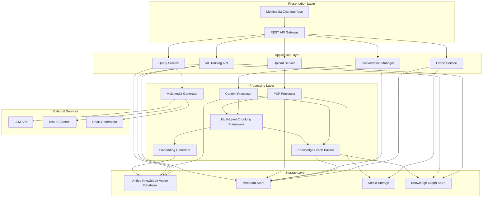

# Design Document: Multimodal Librarian

## Overview

The Multimodal Librarian is a conversational web-based knowledge management system that treats all content sources equally as valuable knowledge. The system processes PDF books and conversation history using identical adaptive chunking strategies, storing both in a unified vector database. This approach creates a comprehensive knowledge ecosystem where insights from books and conversations are seamlessly integrated and searchable.

The architecture follows a microservices approach with unified processing for all knowledge sources, ensuring that conversation insights receive the same treatment as published content. The multimedia chat interface enables natural interaction while continuously building the knowledge base through every exchange.

## Architecture

The system consists of six main layers:



## Components and Interfaces

### PDF Processing Component

**Responsibilities:**
- Extract text, images, charts, and metadata from PDF files
- Preserve document structure (chapters, sections, paragraphs)
- Handle various PDF formats and encodings
- Maintain associations between text and media elements

**Technology Stack:**
- **PyMuPDF**: Primary PDF processing library for high-performance text and image extraction
- **pdfplumber**: Secondary library for table extraction and detailed layout analysis
- **Pillow**: Image processing and format conversion
- **pytesseract**: OCR for scanned documents

**Interface:**
```python
class PDFProcessor:
    def extract_content(self, pdf_file: bytes) -> DocumentContent:
        """Extract multimodal content from PDF"""
        pass
    
    def analyze_structure(self, content: DocumentContent) -> DocumentStructure:
        """Analyze document hierarchy and organization"""
        pass
```

### Generic Multi-Level Chunking Framework Component

**Responsibilities:**
- Automatically generate content profiles using Wikidata and ConceptNet analysis
- Create and maintain domain-specific configurations with continuous optimization
- Implement multi-level adaptive chunking with primary and secondary boundary detection
- Perform conceptual gap analysis to determine bridge generation necessity
- Generate smart bridges using Gemini 2.5 Flash with cross-encoding validation
- Maintain conceptual and semantic coherence across chunks
- Preserve relationships between text and media elements
- Continuously optimize configurations based on performance metrics and user feedback

**Technology Stack:**
- **Gemini 2.5 Flash**: Primary LLM for bridge generation and content analysis
- **Wikidata SPARQL API**: Entity classification and domain ontology analysis
- **ConceptNet API**: Relationship pattern mining and semantic analysis
- **Cross-encoding models**: ms-marco-MiniLM-L-12-v2 for semantic validation, NLI models for factual consistency
- **sentence-transformers**: Embedding generation for semantic distance calculation
- **PostgreSQL**: Domain configuration storage with versioning and performance tracking

**Interface:**
```python
class GenericMultiLevelChunkingFramework:
    def __init__(self):
        self.content_analyzer = AutomatedContentAnalyzer()
        self.config_manager = DomainConfigurationManager()
        self.multi_level_chunker = MultiLevelChunker()
        self.gap_analyzer = ConceptualGapAnalyzer()
        self.bridge_generator = SmartBridgeGenerator()
        self.validator = MultiStageValidator()
        self.optimizer = ConfigurationOptimizer()
    
    def process_document(self, document: Document) -> ProcessedDocument:
        """Process document with automated profiling and adaptive chunking"""
        pass
    
    def generate_content_profile(self, document: Document) -> ContentProfile:
        """Automatically generate content profile using knowledge graphs"""
        pass
    
    def get_or_create_domain_config(self, content_profile: ContentProfile) -> DomainConfig:
        """Get existing or automatically generate domain configuration"""
        pass
    
    def chunk_with_smart_bridges(self, document: Document, config: DomainConfig) -> ChunkCollection:
        """Apply multi-level chunking with smart bridge generation"""
        pass
    
    def optimize_configuration(self, domain_name: str, performance_data: PerformanceData) -> DomainConfig:
        """Continuously optimize domain configuration based on usage"""
        pass
```

**Multi-Level Chunking Strategies:**
1. **Primary Chunking**: Semantic boundary detection at section/subsection level (300-500 tokens default, adaptive based on content profile)
2. **Secondary Chunking**: Recursive splitting on domain-specific delimiters (automatically detected from Wikidata/ConceptNet patterns)
3. **Bridge Generation**: Conceptual gap analysis determines necessity, Gemini 2.5 Flash generates contextual bridges with cross-encoding validation
4. **Fallback Strategy**: Intelligent mechanical overlap with sentence-boundary awareness when bridge validation fails

**Automated Content Profiling:**
- **Wikidata Classification**: Entity extraction and classification using SPARQL queries for domain identification
- **ConceptNet Analysis**: Relationship pattern mining for chunking strategy determination
- **LLM Enhancement**: Gemini 2.5 Flash refinement of automatically generated profiles
- **Complexity Scoring**: Automated assessment of content complexity for chunk size optimization

**Domain Configuration Generation:**
- **Ontology Mining**: Automatic extraction of domain patterns from Wikidata hierarchies
- **Relationship Analysis**: ConceptNet mining for semantic and structural patterns
- **Pattern Synthesis**: Multi-source configuration merging with conflict resolution
- **Validation Testing**: Automated configuration testing on sample documents with performance optimization

### Vector Database Component

**Responsibilities:**
- Store and index text embeddings
- Maintain metadata linking chunks to source documents
- Support semantic similarity search
- Handle concurrent read/write operations

**Technology Stack:**
- **Milvus**: Primary vector database for scalability and performance
- **sentence-transformers**: Generate embeddings for text chunks
- **PostgreSQL**: Metadata storage for document information

**Interface:**
```python
class VectorStore:
    def store_embeddings(self, chunks: List[Chunk]) -> None:
        """Store chunk embeddings with metadata"""
        pass
    
    def semantic_search(self, query: str, top_k: int = 10) -> List[SearchResult]:
        """Perform similarity search across all content"""
        pass
```

### Automated Content Analyzer Component

**Responsibilities:**
- Extract entities and concepts from documents using NLP and knowledge graph integration
- Classify content types using Wikidata entity analysis and domain ontologies
- Analyze document complexity, structure hierarchy, and cross-reference patterns
- Generate comprehensive content profiles for adaptive chunking configuration

**Interface:**
```python
class AutomatedContentAnalyzer:
    def analyze_document(self, document: Document) -> ContentProfile:
        """Generate comprehensive content profile using multiple knowledge sources"""
        pass
    
    def classify_content_type(self, document: Document) -> ContentType:
        """Classify content using Wikidata entity classification"""
        pass
    
    def extract_domain_patterns(self, document: Document) -> DomainPatterns:
        """Extract domain-specific patterns using ConceptNet analysis"""
        pass
```

### Domain Configuration Manager Component

**Responsibilities:**
- Automatically generate domain configurations using Wikidata ontology and ConceptNet patterns
- Store and version domain configurations with complete metadata and performance tracking
- Continuously optimize configurations based on usage metrics and user feedback
- Manage configuration lifecycle including refresh, archival, and rollback capabilities

**Interface:**
```python
class DomainConfigurationManager:
    def get_or_generate_config(self, content_profile: ContentProfile) -> DomainConfig:
        """Get existing or automatically generate domain configuration"""
        pass
    
    def optimize_configuration(self, domain_name: str, performance_data: PerformanceData) -> DomainConfig:
        """Automatically optimize configuration based on performance metrics"""
        pass
    
    def store_configuration(self, domain_name: str, config: DomainConfig, metadata: ConfigMetadata) -> str:
        """Store versioned configuration with metadata"""
        pass
```

### Conceptual Gap Analyzer Component

**Responsibilities:**
- Analyze semantic distance and concept overlap between adjacent chunks
- Detect cross-reference density and structural continuity patterns
- Calculate bridge necessity scores using composite metrics
- Recommend bridge generation strategies based on gap analysis

**Interface:**
```python
class ConceptualGapAnalyzer:
    def analyze_boundary_gap(self, chunk1: Chunk, chunk2: Chunk) -> GapAnalysis:
        """Determine bridge necessity using multi-factor analysis"""
        pass
    
    def calculate_semantic_distance(self, chunk1: Chunk, chunk2: Chunk) -> float:
        """Calculate semantic distance using embedding similarity"""
        pass
    
    def detect_cross_references(self, chunk1: Chunk, chunk2: Chunk) -> CrossReferenceAnalysis:
        """Detect and analyze cross-reference patterns"""
        pass
```

### Smart Bridge Generator Component

**Responsibilities:**
- Generate contextual bridges using Gemini 2.5 Flash with adaptive prompting
- Implement batch processing for cost optimization and efficiency
- Apply domain-specific bridge generation strategies based on gap analysis
- Create bridges that preserve semantic relationships and factual accuracy

**Interface:**
```python
class SmartBridgeGenerator:
    def generate_bridge(self, chunk1: Chunk, chunk2: Chunk, gap_analysis: GapAnalysis) -> BridgeChunk:
        """Generate contextual bridge using Gemini 2.5 Flash"""
        pass
    
    def batch_generate_bridges(self, boundary_pairs: List[Tuple[Chunk, Chunk]]) -> List[BridgeChunk]:
        """Batch process multiple bridges for cost optimization"""
        pass
    
    def create_adaptive_prompt(self, chunk1: Chunk, chunk2: Chunk, strategy: BridgeStrategy) -> str:
        """Create domain-specific bridge generation prompt"""
        pass
```

### Multi-Stage Validator Component

**Responsibilities:**
- Validate bridge quality using cross-encoding for semantic relevance and factual consistency
- Implement bidirectional validation to ensure bridge coherence in both directions
- Apply content-type adaptive thresholds for quality assessment
- Generate composite scores with detailed validation metrics

**Interface:**
```python
class MultiStageValidator:
    def validate_bridge(self, bridge: BridgeChunk, chunk1: Chunk, chunk2: Chunk) -> ValidationResult:
        """Comprehensive bridge validation with cross-encoding"""
        pass
    
    def cross_encode_semantic_relevance(self, bridge: BridgeChunk, source_chunk: Chunk) -> float:
        """Validate semantic relevance using cross-encoding models"""
        pass
    
    def validate_factual_consistency(self, bridge: BridgeChunk, source_chunks: List[Chunk]) -> float:
        """Validate factual consistency using NLI models"""
        pass
    
    def calculate_composite_score(self, validation_scores: Dict[str, float], content_type: ContentType) -> float:
        """Calculate composite quality score with adaptive thresholds"""
        pass
```

### Configuration Optimizer Component

**Responsibilities:**
- Monitor configuration performance through real-time metrics tracking
- Automatically generate optimization strategies based on performance analysis
- Implement A/B testing for configuration improvements
- Learn optimization patterns across domains for cross-domain application

**Interface:**
```python
class ConfigurationOptimizer:
    def track_performance(self, domain_name: str, chunking_result: ChunkingResult) -> None:
        """Track real-time performance metrics for configuration optimization"""
        pass
    
    def generate_optimization_strategies(self, performance_analysis: PerformanceAnalysis) -> List[OptimizationStrategy]:
        """Generate targeted optimization strategies based on performance issues"""
        pass
    
    def a_b_test_configurations(self, domain_name: str, candidate_configs: List[DomainConfig]) -> DomainConfig:
        """A/B test configuration candidates and select best performer"""
        pass
```

### Knowledge Graph Builder Component

**Responsibilities:**
- Extract concepts and relationships from all content types using LLM-based analysis
- Build incremental knowledge graph from books and conversations
- Bootstrap from external knowledge bases (ConceptNet, Wikidata)
- Resolve conflicts and maintain relationship confidence scores
- Support multi-hop reasoning and relationship discovery

**Interface:**
```python
class KnowledgeGraphBuilder:
    def extract_knowledge_triples(self, content: str, source_id: str) -> List[Triple]:
        """Extract (subject, predicate, object) relationships from content"""
        pass
    
    def build_incremental_kg(self, new_chunks: List[KnowledgeChunk]) -> None:
        """Add knowledge from new chunks to existing graph"""
        pass
    
    def bootstrap_from_external(self, domains: List[str]) -> None:
        """Initialize KG with external knowledge bases"""
        pass
    
    def resolve_conflicts(self, confidence_threshold: float = 0.7) -> None:
        """Resolve contradictory relationships in knowledge graph"""
        pass
```

### Knowledge Graph Query Engine Component

**Responsibilities:**
- Process multi-hop reasoning queries across knowledge graph
- Enhance vector search with graph-based relationship discovery
- Provide concept disambiguation and context understanding
- Generate reasoning paths for complex queries

**Interface:**
```python
class KnowledgeGraphQueryEngine:
    def multi_hop_reasoning(self, start_concepts: List[str], target_concepts: List[str], max_hops: int = 3) -> List[ReasoningPath]:
        """Find reasoning paths between concepts"""
        pass
    
    def enhance_vector_search(self, query: str, vector_results: List[KnowledgeChunk]) -> List[KnowledgeChunk]:
        """Re-rank and expand vector search results using KG relationships"""
        pass
    
    def get_related_concepts(self, concept: str, relationship_types: List[str], max_distance: int = 2) -> List[RelatedConcept]:
        """Find concepts related through specific relationship types"""
        pass
```

### Unified Knowledge Processing Component

**Responsibilities:**
- Apply consistent chunking strategies to all content types
- Treat conversation content as equivalent knowledge sources
- Maintain unified metadata for all knowledge chunks
- Ensure equal search priority for all knowledge sources

**Interface:**
```python
class UnifiedKnowledgeProcessor:
    def process_knowledge_source(self, content: Union[DocumentContent, ConversationThread]) -> List[KnowledgeChunk]:
        """Process any content type using unified chunking strategies"""
        pass
    
    def classify_content_complexity(self, content: str) -> ContentComplexity:
        """Apply same complexity analysis to all content types"""
        pass
```

### Conversation Management Component

**Responsibilities:**
- Maintain conversation threads and context history
- Process conversational queries with contextual understanding
- Convert conversations into knowledge chunks using book-equivalent strategies
- Handle multimedia input through chat interface

**Interface:**
```python
class ConversationManager:
    def start_conversation(self, user_id: str) -> ConversationThread:
        """Initialize new conversation thread"""
        pass
    
    def process_message(self, thread_id: str, message: Message) -> ConversationContext:
        """Process user message with conversation context"""
        pass
    
    def convert_to_knowledge_chunks(self, conversation: ConversationThread) -> List[KnowledgeChunk]:
        """Convert conversation to searchable knowledge chunks"""
        pass
```

### Context Processing Component

**Responsibilities:**
- Analyze conversation flow and semantic relationships
- Apply book-equivalent adaptive chunking to conversation history
- Maintain temporal ordering and context coherence
- Generate embeddings for conversational knowledge using same methods as books

**Interface:**
```python
class ContextProcessor:
    def analyze_conversation_flow(self, messages: List[Message]) -> ConversationFlow:
        """Analyze semantic relationships in conversation"""
        pass
    
    def chunk_conversation_as_knowledge(self, conversation: ConversationThread) -> List[KnowledgeChunk]:
        """Apply book-equivalent chunking to conversation content"""
        pass
```

### ML Training API Component

**Responsibilities:**
- Provide streaming access to chunked knowledge data
- Generate training datasets for reinforcement learning
- Support batch and real-time knowledge chunk delivery
- Include reward signals and interaction feedback

**Interface:**
```python
class MLTrainingAPI:
    def stream_knowledge_chunks(self, filters: ChunkFilters) -> AsyncIterator[TrainingChunk]:
        """Stream knowledge chunks for RL training"""
        pass
    
    def get_chunk_sequences(self, pattern: str, sequence_length: int) -> List[ChunkSequence]:
        """Get ordered sequences of related chunks"""
        pass
    
    def get_training_batch(self, batch_size: int, criteria: TrainingCriteria) -> TrainingBatch:
        """Get batch of chunks with reward signals"""
        pass
    
    def record_interaction_feedback(self, chunk_id: str, feedback: InteractionFeedback) -> None:
        """Record user interaction for reward signal generation"""
        pass
```

### Multimedia Chat Interface Component

**Responsibilities:**
- Provide conversational UI with multimedia support
- Handle file uploads and data pasting in chat
- Display conversation history with rich content
- Support real-time interaction and feedback

**Interface:**
```python
class ChatInterface:
    def accept_multimedia_input(self, input_data: MultimediaInput) -> ProcessedInput:
        """Process various input formats in chat"""
        pass
    
    def display_conversation(self, thread: ConversationThread) -> ChatDisplay:
        """Render conversation with multimedia content"""
        pass
```

### Query Processing Component

**Responsibilities:**
- Process user queries using hybrid vector search and knowledge graph reasoning
- Retrieve relevant content from all knowledge sources with graph-enhanced ranking
- Synthesize coherent responses from books, conversations, and knowledge graph insights
- Coordinate with multimedia generation and reasoning path explanation

**Interface:**
```python
class QueryProcessor:
    def process_graph_enhanced_query(self, query: str, context: ConversationContext) -> QueryResponse:
        """Process query using both vector search and knowledge graph reasoning"""
        pass
    
    def retrieve_with_reasoning(self, query_concepts: List[str], reasoning_paths: List[ReasoningPath]) -> List[KnowledgeResult]:
        """Retrieve knowledge following reasoning paths from knowledge graph"""
        pass
    
    def explain_reasoning(self, response: QueryResponse) -> ReasoningExplanation:
        """Provide explanation of how knowledge graph contributed to response"""
        pass
```

### Multimedia Generation Component

**Responsibilities:**
- Generate text responses from retrieved content
- Create charts and visualizations from data
- Synthesize audio narration
- Produce video content with visual elements

**Technology Stack:**
- **OpenAI GPT-4**: Text generation and synthesis
- **matplotlib/plotly**: Chart and graph generation
- **gTTS/pyttsx3**: Text-to-speech conversion
- **moviepy**: Video creation and editing
- **Pillow**: Image processing and manipulation

**Interface:**
```python
class MultimediaGenerator:
    def generate_text_response(self, context: List[Context], query: str) -> str:
        """Generate coherent text response"""
        pass
    
    def create_visualizations(self, data: List[DataPoint]) -> List[Image]:
        """Generate charts and graphs from extracted data"""
        pass
    
    def synthesize_audio(self, text: str) -> AudioFile:
        """Convert text to natural speech"""
        pass
    
    def create_video(self, text: str, images: List[Image], audio: AudioFile) -> VideoFile:
        """Combine elements into video presentation"""
        pass
```

### Export Component

**Responsibilities:**
- Convert multimedia responses to various formats
- Maintain formatting and layout integrity
- Handle large documents efficiently
- Preserve citations and source references

**Supported Formats:**
- **Text**: .txt with clean formatting and citations
- **Word**: .docx with embedded media and proper formatting
- **PDF**: .pdf with layout preservation and multimedia elements
- **RTF**: .rtf with rich formatting, fonts, and embedded images
- **PowerPoint**: .pptx with slides, multimedia content, and speaker notes
- **Excel**: .xlsx with structured data, charts, and tables
- **HTML**: .html for web-compatible output

**Interface:**
```python
class ExportEngine:
    def export_to_format(self, response: MultimediaResponse, format: str) -> bytes:
        """Export response to specified format"""
        pass
    
    def preserve_formatting(self, content: Content, format: str) -> FormattedContent:
        """Maintain visual integrity across formats"""
        pass
```

## Data Models

### Core Data Structures

```python
@dataclass
class ContentProfile:
    content_type: ContentType  # TECHNICAL, LEGAL, MEDICAL, NARRATIVE, ACADEMIC
    domain_categories: List[str]  # Wikidata categories
    complexity_score: float  # 0.0-1.0 content complexity
    structure_hierarchy: DocumentStructure
    domain_patterns: DomainPatterns  # ConceptNet-derived patterns
    cross_reference_density: float
    conceptual_density: float
    chunking_requirements: ChunkingRequirements

@dataclass
class DomainConfig:
    domain_name: str
    delimiters: List[DelimiterPattern]  # Auto-detected domain-specific patterns
    chunk_size_modifiers: Dict[str, float]  # Content-type specific adjustments
    preservation_patterns: List[str]  # Content that must stay together
    bridge_thresholds: Dict[str, float]  # When to generate bridges
    cross_reference_patterns: List[str]  # How to handle internal references
    generation_method: str  # wikidata, conceptnet, llm, hybrid
    confidence_score: float
    performance_baseline: Optional[PerformanceMetrics]

@dataclass
class GapAnalysis:
    necessity_score: float  # 0.0-1.0 bridge necessity
    gap_type: GapType  # CONCEPTUAL, PROCEDURAL, CROSS_REFERENCE
    bridge_strategy: BridgeStrategy  # Generation approach
    semantic_distance: float
    concept_overlap: float
    cross_reference_density: float
    structural_continuity: float
    domain_specific_gaps: Dict[str, float]

@dataclass
class BridgeChunk:
    content: str
    source_chunks: List[str]  # IDs of connected chunks
    generation_method: str  # gemini_25_flash, mechanical_fallback
    gap_analysis: GapAnalysis
    validation_result: ValidationResult
    confidence_score: float
    created_at: datetime

@dataclass
class ValidationResult:
    individual_scores: Dict[str, float]  # semantic_relevance, factual_consistency, etc.
    composite_score: float
    validation_details: ValidationDetails
    passed_validation: bool
    content_type_thresholds: Dict[str, float]

@dataclass
class StoredDomainConfig:
    domain_name: str
    config: DomainConfig
    version: int
    created_at: datetime
    generation_method: str
    source_documents: List[str]
    performance_score: Optional[float]
    optimization_history: List[OptimizationRecord]
    is_active: bool
    usage_count: int

@dataclass
class PerformanceMetrics:
    chunk_quality_score: float
    bridge_success_rate: float
    retrieval_effectiveness: float
    user_satisfaction_score: float
    processing_efficiency: float
    boundary_quality: float
    measurement_date: datetime
    document_count: int

@dataclass
class OptimizationStrategy:
    type: str  # chunk_size_adjustment, bridge_threshold_tuning, delimiter_refinement
    target_metrics: List[str]
    adjustments: Dict[str, Any]
    expected_improvement: float
    confidence: float

@dataclass
class KnowledgeChunk:
    id: str
    content: str
    embedding: np.ndarray
    source_type: SourceType  # BOOK, CONVERSATION
    source_id: str
    location_reference: str  # page_number for books, timestamp for conversations
    section: str
    content_type: ContentType
    associated_media: List[MediaElement]
    knowledge_metadata: KnowledgeMetadata

@dataclass
class DocumentContent:
    text: str
    images: List[Image]
    tables: List[Table]
    metadata: DocumentMetadata
    structure: DocumentStructure

@dataclass
class ConversationThread:
    thread_id: str
    user_id: str
    messages: List[Message]
    created_at: datetime
    last_updated: datetime
    knowledge_summary: str

@dataclass
class Message:
    message_id: str
    content: str
    multimedia_content: List[MultimediaElement]
    timestamp: datetime
    message_type: MessageType  # USER, SYSTEM, UPLOAD
    knowledge_references: List[str]

@dataclass
class MultimediaResponse:
    text_content: str
    visualizations: List[Visualization]
    audio_content: Optional[AudioFile]
    video_content: Optional[VideoFile]
    knowledge_citations: List[KnowledgeCitation]
    export_metadata: ExportMetadata

@dataclass
class KnowledgeCitation:
    source_type: SourceType
    source_title: str
    location_reference: str
    chunk_id: str
    relevance_score: float

@dataclass
class TrainingChunk:
    knowledge_chunk: KnowledgeChunk
    embedding_vector: np.ndarray
    reward_signal: float
    interaction_count: int
    complexity_score: float
    temporal_weight: float
    related_chunk_ids: List[str]

@dataclass
class ChunkSequence:
    sequence_id: str
    chunks: List[TrainingChunk]
    sequence_type: SequenceType  # TEMPORAL, SEMANTIC, CAUSAL
    coherence_score: float
    total_reward: float

@dataclass
class TrainingBatch:
    batch_id: str
    chunks: List[TrainingChunk]
    sequences: List[ChunkSequence]
    batch_metadata: BatchMetadata
    reward_distribution: Dict[str, float]

@dataclass
class InteractionFeedback:
    chunk_id: str
    user_id: str
    interaction_type: InteractionType  # VIEW, CITE, EXPORT, RATE
    feedback_score: float
    timestamp: datetime
    context_query: str

@dataclass
class Triple:
    subject: str
    predicate: str
    object: str
    confidence: float
    source_id: str
    extraction_method: str  # LLM, NER, EMBEDDING
    created_at: datetime

@dataclass
class ConceptNode:
    concept_id: str
    concept_name: str
    concept_type: str  # ENTITY, PROCESS, PROPERTY, etc.
    aliases: List[str]
    confidence: float
    source_chunks: List[str]
    external_ids: Dict[str, str]  # Wikidata, ConceptNet IDs

@dataclass
class RelationshipEdge:
    subject_concept: str
    predicate: str
    object_concept: str
    confidence: float
    evidence_chunks: List[str]
    relationship_type: RelationshipType  # CAUSAL, HIERARCHICAL, ASSOCIATIVE
    bidirectional: bool

@dataclass
class ReasoningPath:
    start_concept: str
    end_concept: str
    path_steps: List[RelationshipEdge]
    total_confidence: float
    path_length: int
    reasoning_type: str  # CAUSAL_CHAIN, HIERARCHICAL, ANALOGICAL

@dataclass
class KnowledgeGraphQueryResult:
    reasoning_paths: List[ReasoningPath]
    related_concepts: List[ConceptNode]
    enhanced_chunks: List[KnowledgeChunk]
    confidence_scores: Dict[str, float]
    explanation: str
```

### Database Schema

**Vector Database (Milvus):**
- Collection: `knowledge_chunks`
- Fields: `chunk_id`, `embedding`, `source_type`, `metadata`
- Index: HNSW for fast similarity search across all knowledge sources

**Knowledge Graph Database (Neo4j or PostgreSQL with graph extensions):**
- Nodes: `concepts` with properties (name, type, confidence, aliases)
- Edges: `relationships` with properties (predicate, confidence, evidence)
- Indexes: Concept name lookup, relationship type filtering
- Constraints: Unique concept identifiers, relationship validation

**Metadata Database (PostgreSQL):**
- `knowledge_sources`: Unified metadata for books and conversations
- `knowledge_chunks`: Chunk metadata with source type and references
- `bridge_chunks`: LLM-generated bridge chunks with validation scores and performance tracking
- `content_profiles`: Automatically generated document profiles with Wikidata/ConceptNet analysis
- `domain_configurations`: Versioned domain configurations with generation metadata and performance baselines
- `config_performance_metrics`: Real-time performance tracking for domain configurations
- `config_optimizations`: Configuration optimization history and improvement tracking
- `gap_analyses`: Conceptual gap analysis results for bridge generation decisions
- `validation_results`: Cross-encoding validation results for bridge quality assessment
- `media_elements`: Associated images, charts, and media files
- `conversations`: Conversation threads treated as knowledge sources
- `messages`: Individual messages within conversations
- `citations`: Unified citation tracking for all knowledge sources
- `interaction_feedback`: User interaction data for reward signal generation
- `training_sessions`: ML training session metadata and performance metrics
- `concept_extractions`: Tracking of concept extraction from chunks
- `kg_confidence_scores`: Confidence tracking for knowledge graph elements

## Correctness Properties

*A property is a characteristic or behavior that should hold true across all valid executions of a system—essentially, a formal statement about what the system should do. Properties serve as the bridge between human-readable specifications and machine-verifiable correctness guarantees.*

Based on the prework analysis, the following properties validate the system's correctness:

### PDF Processing Properties

**Property 1: File size validation**
*For any* uploaded file, files under 100MB should be accepted and files over 100MB should be rejected with appropriate error messages.
**Validates: Requirements 1.1**

**Property 2: Multimodal content extraction**
*For any* valid PDF document, the extraction process should successfully identify and extract all content types (text, images, charts, graphs) present in the document.
**Validates: Requirements 1.2**

**Property 3: Document structure preservation**
*For any* PDF document with hierarchical structure, the extracted content should maintain the original document organization including chapters, sections, and paragraph relationships.
**Validates: Requirements 1.3**

**Property 4: Text-media association preservation**
*For any* PDF containing both text and media elements, the associations between related text and media should be maintained after extraction.
**Validates: Requirements 1.4**

**Property 5: Corrupted file handling**
*For any* corrupted or unreadable PDF file, the system should reject the upload and return a descriptive error message.
**Validates: Requirements 1.5**

### Multi-Level Chunking Framework Properties

**Property 54: Automated content profile generation**
*For any* document processed by the system, the content analyzer should automatically generate a comprehensive content profile including content type, domain categories, and chunking requirements without manual configuration.
**Validates: Requirements 2.1**

**Property 55: Domain configuration automation**
*For any* content profile generated, the system should automatically create or retrieve appropriate domain configurations using Wikidata ontology analysis and ConceptNet relationship patterns.
**Validates: Requirements 2.2**

**Property 56: Multi-level chunking consistency**
*For any* document processed with the multi-level framework, primary chunking should respect semantic boundaries and secondary chunking should apply domain-specific patterns consistently.
**Validates: Requirements 2.3, 2.4**

**Property 57: Conceptual gap analysis accuracy**
*For any* pair of adjacent chunks, the gap analyzer should accurately assess bridge necessity using semantic distance, concept overlap, and cross-reference density with consistent scoring.
**Validates: Requirements 2.5**

**Property 58: Smart bridge generation quality**
*For any* bridge generated using Gemini 2.5 Flash, the bridge should maintain semantic relevance to both source chunks and preserve factual consistency.
**Validates: Requirements 2.6**

**Property 59: Cross-encoding validation reliability**
*For any* generated bridge, the multi-stage validator should provide consistent quality assessment using semantic relevance, factual consistency, and bidirectional validation scores.
**Validates: Requirements 2.7**

**Property 60: Adaptive threshold application**
*For any* content type, the validation system should apply appropriate quality thresholds that reflect the specific accuracy and coherence requirements of that domain.
**Validates: Requirements 2.7**

**Property 61: Intelligent fallback consistency**
*For any* bridge that fails validation, the system should consistently fall back to mechanical overlap with sentence-boundary awareness appropriate to the content type.
**Validates: Requirements 2.8**

**Property 62: Configuration performance tracking**
*For any* domain configuration in use, the system should continuously track performance metrics including chunk quality, bridge success rates, and user satisfaction scores.
**Validates: Requirements 2.9, 13.3**

**Property 63: Automated configuration optimization**
*For any* domain configuration showing performance degradation, the system should automatically generate and test optimization strategies to improve performance.
**Validates: Requirements 2.10, 13.4**

**Property 64: Configuration versioning and rollback**
*For any* domain configuration update, the system should maintain complete version history and support rollback to previous configurations when needed.
**Validates: Requirements 13.2, 13.8**

**Property 65: Cross-domain learning effectiveness**
*For any* successful optimization pattern identified in one domain, the system should evaluate and apply applicable patterns to other domains where appropriate.
**Validates: Requirements 13.6**

**Property 66: Knowledge graph integration for configuration**
*For any* domain configuration, updates to relevant Wikidata or ConceptNet knowledge should trigger appropriate configuration refresh and optimization.
**Validates: Requirements 13.7**

### Dynamic Chunking Properties

**Property 6: Structural boundary respect**
*For any* document with logical structure, the chunking algorithm should create chunk boundaries that respect document sections, chapters, and other structural elements.
**Validates: Requirements 2.1**

**Property 7: Adaptive chunk sizing**
*For any* pair of technical and narrative content sections, technical content should consistently produce smaller chunks than narrative content of similar length.
**Validates: Requirements 2.2, 2.3, 2.4**

**Property 8: Media association preservation during chunking**
*For any* content section containing both text and associated media, the chunking process should ensure related elements remain associated within the same chunk or maintain explicit relationships.
**Validates: Requirements 2.5**

### Vector Store Properties

**Property 9: Embedding completeness**
*For any* set of text chunks, the vector store should generate exactly one embedding per chunk with no missing or duplicate embeddings.
**Validates: Requirements 3.1**

**Property 10: Metadata preservation**
*For any* stored embedding, the associated metadata should contain complete source information including book title, page number, and section location.
**Validates: Requirements 3.2**

**Property 11: Semantic search functionality**
*For any* query submitted to the vector store, the search should return results ranked by semantic similarity across all stored content.
**Validates: Requirements 3.4**

**Property 12: Data integrity maintenance**
*For any* embedding stored in the vector database, retrieving it should return the exact same vector values without corruption.
**Validates: Requirements 3.5**

### Query Processing Properties

**Property 13: Comprehensive search coverage**
*For any* user query, the search should examine all vectorized content in the knowledge base, not just a subset.
**Validates: Requirements 4.1**

**Property 14: Multi-source response synthesis**
*For any* query with relevant information from multiple sources, the generated response should incorporate content from at least two different source documents when available.
**Validates: Requirements 4.2**

**Property 15: Relevant media inclusion**
*For any* query response where relevant charts, graphs, or images exist in the source material, these media elements should be included in the response.
**Validates: Requirements 4.3**

**Property 16: Visualization generation for data-rich content**
*For any* response containing numerical data or statistical information, the system should generate appropriate visualizations to illustrate the concepts.
**Validates: Requirements 4.4**

**Property 17: Complete citation provision**
*For any* information included in a response, the system should provide source citations including book title and page number.
**Validates: Requirements 4.8**

### Conversational Knowledge Properties

**Property 18: Unified knowledge treatment**
*For any* conversation content, the system should apply the same chunking, embedding, and storage strategies used for book content.
**Validates: Requirements 10.1, 10.3**

**Property 19: Equal search priority**
*For any* query, the system should search conversation knowledge and book knowledge with equal priority and ranking.
**Validates: Requirements 10.2, 4.1**

**Property 20: Knowledge source citation parity**
*For any* response that includes information from conversations, the citations should provide the same level of detail as book citations.
**Validates: Requirements 10.5, 4.8**

**Property 21: Conversation knowledge export**
*For any* conversation marked for preservation, the system should support exporting conversation knowledge using all available formats.
**Validates: Requirements 10.7**

### Machine Learning Integration Properties

**Property 22: Knowledge stream consistency**
*For any* ML training request, the system should provide consistent chunk data with embeddings, metadata, and reward signals.
**Validates: Requirements 11.1, 11.2**

**Property 23: Training data filtering**
*For any* specified filter criteria, the knowledge stream should return only chunks that match all specified parameters.
**Validates: Requirements 11.3**

**Property 24: Reward signal accuracy**
*For any* chunk with user interaction history, the reward signal should accurately reflect the cumulative user feedback and engagement.
**Validates: Requirements 11.4**

**Property 25: Chunk sequence coherence**
*For any* requested chunk sequence, the returned chunks should maintain semantic or temporal relationships as specified.
**Validates: Requirements 11.5**

**Property 26: API rate limiting enforcement**
*For any* ML training API request that exceeds rate limits, the system should enforce limits and provide appropriate error responses.
**Validates: Requirements 11.7**

### Knowledge Graph Properties

**Property 27: Concept extraction consistency**
*For any* content processed multiple times, the system should extract the same core concepts with consistent confidence scores.
**Validates: Requirements 12.1**

**Property 28: Relationship extraction accuracy**
*For any* extracted relationship triple, the system should maintain confidence scores that reflect the strength of evidence from source content.
**Validates: Requirements 12.2**

**Property 29: Multi-hop reasoning completeness**
*For any* query requiring multi-hop reasoning, the system should find all valid reasoning paths within the specified hop limit.
**Validates: Requirements 12.3, 12.7**

**Property 30: Knowledge graph bootstrapping**
*For any* external knowledge base integration, the system should successfully import concepts and relationships while maintaining source attribution.
**Validates: Requirements 12.4**

**Property 31: User feedback integration**
*For any* user interaction that validates or contradicts knowledge graph relationships, the system should appropriately adjust confidence scores.
**Validates: Requirements 12.5**

**Property 32: Conflict resolution consistency**
*For any* contradictory relationships in the knowledge graph, the system should resolve conflicts using consistent confidence-based rules.
**Validates: Requirements 12.6**

### Multimedia Generation Properties

**Property 33: Chart data accuracy**
*For any* generated chart or graph, the data values should exactly match the numerical information extracted from the source materials.
**Validates: Requirements 5.2**

**Property 34: Image captioning completeness**
*For any* image included in a response, the image should have an associated caption that describes its content and relevance.
**Validates: Requirements 5.3**

**Property 35: Audio-text correspondence**
*For any* generated audio content, the spoken words should exactly match the text content of the response.
**Validates: Requirements 5.4**

**Property 36: Video component integration**
*For any* generated video content, the output should contain both visual elements and synchronized audio narration.
**Validates: Requirements 5.5**

### Export Properties

**Property 37: Format support completeness**
*For any* export request, the system should successfully generate output in all required formats (.txt, .docx, .pdf, .rtf, .pptx, .xlsx) without errors.
**Validates: Requirements 6.1**

**Property 38: Word document preservation**
*For any* response exported to .docx format, all formatting, images, and embedded media from the original response should be preserved in the exported document.
**Validates: Requirements 6.2**

**Property 39: PDF export completeness**
*For any* response exported to PDF format, all multimedia elements and layout formatting should be maintained in the exported file.
**Validates: Requirements 6.3**

**Property 40: RTF export formatting**
*For any* response exported to .rtf format, all rich formatting, fonts, and embedded images should be preserved in the exported file.
**Validates: Requirements 6.5**

**Property 41: PowerPoint export structure**
*For any* response exported to .pptx format, the content should be organized into logical slides with multimedia elements and speaker notes containing detailed information.
**Validates: Requirements 6.6**

**Property 42: Excel export organization**
*For any* response exported to .xlsx format, data should be structured into appropriate worksheets with charts, tables, and proper formatting.
**Validates: Requirements 6.7**

**Property 43: Text export cleanliness**
*For any* response exported to .txt format, the output should contain clean, readable text with all citations properly formatted.
**Validates: Requirements 6.4**

### Chat Interface Properties

**Property 44: Multimedia input acceptance**
*For any* content pasted or uploaded through the chat interface, the system should successfully process text, images, documents, and data in various formats.
**Validates: Requirements 7.2**

**Property 45: Conversation history display**
*For any* conversation thread, the chat interface should display the complete context of previous exchanges with proper formatting.
**Validates: Requirements 7.3**

**Property 46: Chat upload progress feedback**
*For any* file upload operation through the chat interface, the system should provide continuous progress indicators and status updates.
**Validates: Requirements 7.6**

**Property 47: Chat query processing feedback**
*For any* submitted query through the chat interface, the system should provide real-time status updates during processing.
**Validates: Requirements 7.4**

**Property 48: Chat accessibility support**
*For any* chat interface element, the system should support both keyboard navigation and screen reader compatibility.
**Validates: Requirements 7.7**

### Security Properties

**Property 49: Data encryption enforcement**
*For any* data stored or transmitted by the system, encryption should be applied both in transit and at rest.
**Validates: Requirements 9.1**

**Property 50: Access control enforcement**
*For any* attempt to access user data without proper authorization, the system should block the access and log the attempt.
**Validates: Requirements 9.2**

**Property 51: Conversation privacy protection**
*For any* user conversation processed by the system, sensitive conversation content should not be persisted inappropriately in system logs or storage.
**Validates: Requirements 9.3**

**Property 52: Complete data deletion**
*For any* book or conversation deletion request, all associated data including chunks, embeddings, and media should be completely removed from all system components.
**Validates: Requirements 9.4**

**Property 53: Audit trail generation**
*For any* data access operation, the system should create audit log entries with timestamp, user, and operation details.
**Validates: Requirements 9.5**

<function_calls>
<invoke name="prework">
<parameter name="featureName">multimodal-librarian

## Error Handling

The system implements comprehensive error handling across all components:

### PDF Processing Errors
- **Invalid file format**: Return HTTP 400 with specific format requirements
- **File size exceeded**: Return HTTP 413 with size limit information
- **Corrupted PDF**: Return HTTP 422 with corruption details
- **Extraction failures**: Log error details and return partial results when possible

### Vector Database Errors
- **Connection failures**: Implement retry logic with exponential backoff
- **Storage capacity**: Monitor disk usage and implement cleanup policies
- **Embedding generation failures**: Queue failed chunks for retry processing
- **Search timeouts**: Return partial results with timeout notification

### Query Processing Errors
- **Empty results**: Provide suggestions for query refinement
- **LLM API failures**: Fallback to cached responses or simplified text generation
- **Context overflow**: Implement intelligent context truncation strategies
- **Rate limiting**: Queue requests and provide estimated wait times

### Multimedia Generation Errors
- **Chart generation failures**: Fallback to tabular data presentation
- **Audio synthesis errors**: Provide text-only responses with error notification
- **Video creation failures**: Return static images with audio narration
- **Format conversion errors**: Offer alternative export formats

### Export Errors
- **Format conversion failures**: Retry with simplified formatting
- **File size limitations**: Implement content pagination for large exports
- **Permission errors**: Provide clear instructions for file access resolution
- **Network interruptions**: Resume interrupted downloads when possible

## Testing Strategy

The testing strategy employs a dual approach combining unit tests for specific scenarios and property-based tests for comprehensive validation:

### Unit Testing Approach
- **Component isolation**: Test individual components with mocked dependencies
- **Edge case coverage**: Focus on boundary conditions and error scenarios
- **Integration points**: Verify correct interaction between system components
- **Performance benchmarks**: Establish baseline performance metrics for critical operations

### Property-Based Testing Configuration
- **Testing framework**: Use Hypothesis for Python-based property testing
- **Iteration count**: Minimum 100 iterations per property test for statistical confidence
- **Test data generation**: Smart generators that create realistic PDF content, queries, and user interactions
- **Shrinking strategy**: Automatic reduction of failing test cases to minimal examples

### Property Test Implementation
Each correctness property will be implemented as a separate property-based test with the following structure:

```python
@given(pdf_content=pdf_generator())
def test_property_2_multimodal_extraction(pdf_content):
    """
    Feature: multimodal-librarian, Property 2: Multimodal content extraction
    For any valid PDF document, the extraction process should successfully 
    identify and extract all content types present in the document.
    """
    result = pdf_processor.extract_content(pdf_content)
    
    # Verify all expected content types are extracted
    assert result.has_text or result.has_images or result.has_charts
    assert all(element.is_valid() for element in result.all_elements)
```

### Test Data Generators
- **PDF generators**: Create valid PDFs with varying content types and structures
- **Query generators**: Generate realistic user queries across different domains
- **Content generators**: Produce text with different complexity levels and subject matters
- **Media generators**: Create test images, charts, and multimedia content

### Continuous Integration
- **Automated testing**: Run full test suite on every commit
- **Performance monitoring**: Track response times and resource usage
- **Property test reporting**: Generate detailed reports on property violations
- **Coverage analysis**: Ensure comprehensive test coverage across all components

### Testing Environment
- **Isolated test database**: Separate vector database instance for testing
- **Mock external services**: Stub LLM APIs and multimedia generation services
- **Resource constraints**: Test under limited memory and processing conditions
- **Concurrent testing**: Validate system behavior under multiple simultaneous users

The combination of unit tests and property-based tests ensures both specific functionality correctness and general system reliability across all possible inputs and scenarios.