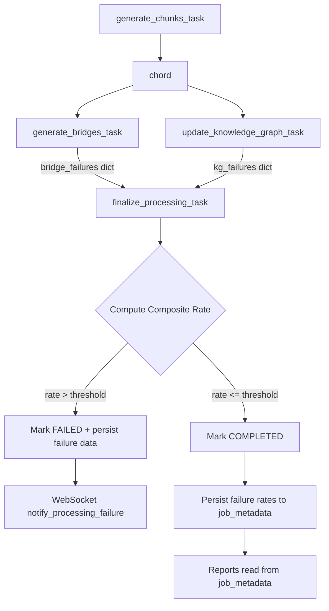

# Design Document: NER Quality Gate

## Overview

This feature introduces a quality gate into the document processing pipeline that tracks per-document failure rates for each extraction model (NER/spaCy, Ollama LLM, Gemini bridge failover), computes a weighted composite failure rate, and hard-fails documents that exceed domain-specific thresholds. The failure data is persisted in `job_metadata` and surfaced in the throughput report, active jobs report, enrichment report, progress tile, and a clickable breakdown popup.

The processing pipeline currently runs KG extraction (`update_knowledge_graph_task`) and bridge generation (`generate_bridges_task`) in parallel via a Celery chord, with `finalize_processing_task` as the callback. The quality gate decision is made in `finalize_processing_task` after both parallel tasks report their failure counts. If the composite rate exceeds the domain threshold, finalize marks the document as FAILED instead of COMPLETED.

### Key Design Decisions

1. **Failure counting is per-chunk/per-bridge, accumulated in task return values** — not in shared state. Each parallel task returns its failure counters in its result dict, and `finalize_processing_task` combines them. This avoids race conditions and Redis coordination overhead.

2. **Composite formula uses `max(NER, LLM)` not `sum`** — because NER and LLM extract from the same chunks. If both fail on the same chunk, that's one chunk of lost quality, not two. The `max` captures the worst-case extraction degradation.

3. **Bridge failures use Ollama+Gemini failover** — a bridge only counts as failed if both providers fail. For KG extraction, Gemini failover is currently disabled (commented out in `extract_concepts_ollama`), so an Ollama failure = LLM failure.

4. **Exponential backoff in ModelServerClient** — changes `_request` retry delay from linear `retry_delay * (attempt + 1)` to exponential `2^attempt` seconds, and bumps `max_retries` default from 3 to 5.

5. **Quality gate runs in finalize, not in KG task** — because the composite formula requires bridge failure data, which is only available after both parallel tasks complete.

## Architecture



### Data Flow

1. **KG Task** (`_update_knowledge_graph`): For each chunk, calls `extract_concepts_with_ner()` and `extract_concepts_ollama()` via `extract_all_concepts_async()`. Catches failures from each and increments per-document counters. Returns `{ner_failures, llm_failures, total_chunks}` in the task result dict.

2. **Bridge Task** (`generate_bridges_task`): Calls `SmartBridgeGenerator.batch_generate_bridges()`. The generator already tracks `failed_generations` in `BatchGenerationStats`. The task extracts this count and returns `{bridge_failures, total_bridges}` in its result dict.

3. **Finalize Task**: Receives `parallel_results = [bridge_result, kg_result]` from the chord. Computes NER/LLM/bridge rates, composite rate, looks up domain threshold, and decides pass/fail. Persists all rates + threshold to `job_metadata`.

## Components and Interfaces

### 1. ModelServerClient Retry Enhancement

**File:** `src/multimodal_librarian/clients/model_server_client.py`

Change the `__init__` default for `max_retries` from 3 to 5. Change the retry delay computation in `_request` from `self.retry_delay * (attempt + 1)` to `min(2 ** attempt, 16)` seconds (exponential backoff capped at 16s).

```python
# Before:
await asyncio.sleep(self.retry_delay * (attempt + 1))

# After:
await asyncio.sleep(min(2 ** attempt, 16))
```

### 2. Failure Tracking in KG Extraction

**File:** `src/multimodal_librarian/services/celery_service.py` — `_update_knowledge_graph()`

Add counters at the top of the function:

```python
ner_failure_count = 0
llm_failure_count = 0
```

Currently, `extract_all_concepts_async()` in `kg_builder.py` calls `extract_concepts_with_ner()` and `extract_concepts_ollama()` concurrently via `asyncio.gather()` and merges results. To track failures independently, we need to instrument at the call site.

**Approach:** Replace the single `extract_all_concepts_async()` call in the per-chunk loop with separate calls to `extract_concepts_with_ner()` and `extract_concepts_ollama()`, then merge. This lets us detect when each returns `[]` due to failure vs. genuinely finding no entities.

However, distinguishing "no entities found" from "model server error" requires the extraction methods to signal failure explicitly. We'll modify `extract_concepts_with_ner()` and `extract_concepts_ollama()` to raise a specific exception on model failure (or return a sentinel). The cleaner approach: have them return a `(concepts, failed: bool)` tuple.

**Modified signatures:**

```python
# kg_builder.py
async def extract_concepts_with_ner(self, text: str) -> Tuple[List[ConceptNode], bool]:
    """Returns (concepts, ner_failed). ner_failed=True when model server error."""

async def extract_concepts_ollama(self, text: str, content_type) -> Tuple[List[ConceptNode], bool]:
    """Returns (concepts, llm_failed). llm_failed=True when Ollama fails (and Gemini disabled/fails)."""
```

In `_update_knowledge_graph`, after processing all chunks, return failure data in the task result:

```python
return {
    'status': 'completed',
    'document_id': document_id,
    'kg_failures': {
        'ner_failures': ner_failure_count,
        'llm_failures': llm_failure_count,
        'total_chunks': total_chunks,
    }
}
```

### 3. Failure Tracking in Bridge Generation

**File:** `src/multimodal_librarian/services/celery_service.py` — `generate_bridges_task()`

The `SmartBridgeGenerator.batch_generate_bridges()` already tracks `batch_stats.failed_generations` and `batch_stats.total_requests`. We need to expose these from the method return value.

**Approach:** Modify `batch_generate_bridges()` to return `(bridges, stats)` tuple instead of just `bridges`. Then in `generate_bridges_task`, include failure data in the return dict:

```python
return {
    'status': 'completed',
    'document_id': document_id,
    'bridges_generated': len(bridges),
    'bridge_failures': {
        'failed_bridges': stats.failed_generations,
        'total_bridges': stats.total_requests,
    }
}
```

### 4. Quality Gate in Finalize Task

**File:** `src/multimodal_librarian/services/celery_service.py` — `finalize_processing_task()`

New function `_compute_quality_gate()`:

```python
def _compute_quality_gate(
    parallel_results: List[Dict],
    content_type: ContentType
) -> Dict[str, Any]:
    """Compute composite failure rate and quality gate decision.
    
    Args:
        parallel_results: [bridge_result, kg_result] from chord
        content_type: Document content type for threshold lookup
    
    Returns:
        Dict with rates, threshold, passed, worst_model, error_message
    """
```

This function:
1. Extracts `kg_failures` and `bridge_failures` from `parallel_results`
2. Computes `ner_rate = ner_failures / total_chunks` (0 if no chunks)
3. Computes `llm_rate = llm_failures / total_chunks`
4. Computes `bridge_rate = failed_bridges / total_bridges` (0 if no bridges)
5. Computes `composite = max(ner_rate, llm_rate) * 0.7 + bridge_rate * 0.3`
6. Looks up threshold for `content_type` (with env var override)
7. Returns pass/fail decision with all rates

### 5. Domain Threshold Configuration

**File:** `src/multimodal_librarian/services/celery_service.py` (or a new `quality_gate.py` module)

```python
import os

DEFAULT_THRESHOLDS = {
    ContentType.MEDICAL: 0.05,
    ContentType.LEGAL: 0.10,
    ContentType.TECHNICAL: 0.15,
    ContentType.ACADEMIC: 0.15,
    ContentType.NARRATIVE: 0.25,
    ContentType.GENERAL: 0.20,
}

def get_quality_threshold(content_type: ContentType) -> float:
    """Get composite failure rate threshold for a content type.
    
    Checks MODEL_FAIL_THRESHOLD_{TYPE} env var first, falls back to default.
    """
    env_key = f"MODEL_FAIL_THRESHOLD_{content_type.value.upper()}"
    env_val = os.environ.get(env_key)
    if env_val is not None:
        try:
            return int(env_val) / 100.0
        except ValueError:
            pass
    return DEFAULT_THRESHOLDS.get(content_type, 0.20)
```

### 6. job_metadata Schema for Failure Rates

**Persisted in:** `processing_jobs.job_metadata` (JSONB column)

After quality gate computation, `finalize_processing_task` persists:

```json
{
    "stage_timings": { "...existing..." },
    "failed_stage": "update_knowledge_graph",
    "quality_gate": {
        "composite_rate": 0.35,
        "threshold": 0.05,
        "passed": false,
        "content_type": "medical",
        "ner_rate": 0.35,
        "llm_rate": 0.02,
        "bridge_rate": 0.05,
        "ner_failures": 78,
        "ner_total": 223,
        "llm_failures": 4,
        "llm_total": 223,
        "bridge_failures": 9,
        "bridge_total": 181,
        "worst_model": "ner"
    }
}
```

This is written via a single `jsonb_set` call in `_update_job_status_sync` or a dedicated helper.

### 7. Report Column Additions

**Throughput Report** (`generate_throughput_report`):
- Add "Model" column after "KG" column
- Format: `"2%/5%"` (composite/threshold) or `"⚠ 35%/5% (FAIL)"` when exceeded
- Display `"—"` when `quality_gate` key is absent from `job_metadata`

**Enrichment Report** (`generate_enrichment_report`):
- Add "Model Fail %" column
- Show composite rate as percentage, or `"—"` if unavailable
- Show `"FAILED (QG)"` in State column when quality gate failed

**Active Jobs Report** (`format_human_summary`):
- Add substage row `"↳ Model 3%/5%"` when KG task is running and failure data is available in the in-memory progress metadata

### 8. Frontend Popup Component

**File:** `src/multimodal_librarian/static/js/` (new or existing)

The popup is a lightweight HTML/CSS bubble anchored to the composite rate value in the throughput report table. Data comes from `job_metadata.quality_gate` served via the existing API.

**Popup content:**
```
NER (spaCy):     35% (78/223 chunks)
LLM (Ollama):     2% (4/223 chunks)
Bridges (Ollama→Gemini): 5% (9/181 bridges)
─────────────────────────────
KG (NER/LLM) × 70% + Bridges × 30% = 25.2%
```

Dismissible via click-outside or Escape key.

## Data Models

### QualityGateResult (dataclass)

```python
@dataclass
class QualityGateResult:
    """Result of quality gate evaluation for a document."""
    composite_rate: float        # 0.0–1.0
    threshold: float             # 0.0–1.0
    passed: bool
    content_type: str            # ContentType.value
    ner_rate: float
    llm_rate: float
    bridge_rate: float
    ner_failures: int
    ner_total: int
    llm_failures: int
    llm_total: int
    bridge_failures: int
    bridge_total: int
    worst_model: str             # "ner", "llm", or "bridge"

    def to_dict(self) -> Dict[str, Any]:
        """Serialize for job_metadata persistence."""
        return asdict(self)

    def error_message(self) -> str:
        """Human-readable error for failed gate."""
        pct = f"{self.composite_rate * 100:.0f}%"
        limit = f"{self.threshold * 100:.0f}%"
        worst_pct = f"{max(self.ner_rate, self.llm_rate, self.bridge_rate) * 100:.0f}%"
        return (
            f"Model quality below threshold: {pct} failed "
            f"(limit: {limit} for {self.content_type.upper()}, "
            f"worst: {self.worst_model.upper()} at {worst_pct})"
        )
```

### KG Task Failure Counters (in-flight, not persisted separately)

```python
# Inside _update_knowledge_graph, accumulated per-chunk:
ner_failure_count: int = 0
llm_failure_count: int = 0
total_chunks: int = len(knowledge_chunks)
```

### Bridge Task Failure Counters (from BatchGenerationStats)

```python
# Already tracked by SmartBridgeGenerator:
batch_stats.failed_generations: int
batch_stats.total_requests: int
```

### job_metadata JSONB Schema Extension

The `quality_gate` key is added to the existing `job_metadata` JSONB column on `processing_jobs`. No schema migration needed — JSONB is schemaless.


## Correctness Properties

*A property is a characteristic or behavior that should hold true across all valid executions of a system — essentially, a formal statement about what the system should do. Properties serve as the bridge between human-readable specifications and machine-verifiable correctness guarantees.*

### Property 1: Exponential backoff delay formula

*For any* retry attempt number `n` in `[0, max_retries - 2]`, the delay before the next attempt should equal `min(2^n, 16)` seconds.

**Validates: Requirements 1.2**

### Property 2: Retry exhaustion attempts

*For any* `max_retries` value and a request that always fails, the client should make exactly `max_retries` attempts before raising `ModelServerUnavailable`.

**Validates: Requirements 1.3**

### Property 3: Failure counter accuracy

*For any* set of chunks with a random boolean failure pattern for NER and LLM extraction, and any set of bridge attempts with a random boolean dual-failure pattern, the NER failure counter should equal the count of NER-failed chunks, the LLM failure counter should equal the count of LLM-failed chunks, and the bridge failure counter should equal the count of dual-failed bridge attempts (Ollama fail AND Gemini fail). Bridge attempts where Ollama fails but Gemini succeeds should NOT be counted.

**Validates: Requirements 2.1, 2.2, 2.3, 2.4**

### Property 4: Failure rate computation

*For any* pair `(failures, total)` where `total > 0` and `0 <= failures <= total`, the computed failure rate should equal `failures / total`. When `total == 0`, the rate should be `0.0`.

**Validates: Requirements 2.5, 2.6**

### Property 5: Composite formula correctness

*For any* triple of failure rates `(ner_rate, llm_rate, bridge_rate)` each in `[0.0, 1.0]`, the composite model failure rate should equal `max(ner_rate, llm_rate) * 0.7 + bridge_rate * 0.3`.

**Validates: Requirements 2.7**

### Property 6: Environment variable threshold override

*For any* `ContentType` and any integer value `v` in `[0, 100]`, when the environment variable `MODEL_FAIL_THRESHOLD_{TYPE}` is set to `str(v)`, `get_quality_threshold(content_type)` should return `v / 100.0`. When the env var is unset, it should return the hardcoded default for that type.

**Validates: Requirements 3.3, 3.4**

### Property 7: Quality gate pass/fail decision

*For any* composite rate `r` in `[0.0, 1.0]` and threshold `t` in `(0.0, 1.0]`, the quality gate should return `passed=True` when `r <= t` and `passed=False` when `r > t`.

**Validates: Requirements 4.1**

### Property 8: Error message contains diagnostic info

*For any* `QualityGateResult` where `passed=False`, the `error_message()` output should contain the composite rate as a percentage, the threshold as a percentage, and the `worst_model` name.

**Validates: Requirements 4.5**

### Property 9: QualityGateResult serialization round-trip

*For any* valid `QualityGateResult` instance, calling `to_dict()` and reconstructing from the resulting dict should produce an equivalent object with all fields preserved.

**Validates: Requirements 7.5**

### Property 10: Report warning indicator for threshold breach

*For any* quality gate data dict where `passed=False`, the formatted "Model" column string should contain a warning indicator (e.g., `"⚠"` or `"(FAIL)"`). When `passed=True`, it should not contain the warning indicator.

**Validates: Requirements 7.2**

## Error Handling

### Model Server Unavailable During NER
- `extract_concepts_with_ner()` catches `ModelServerUnavailable` and connection errors, returns `([], True)` to signal failure.
- The chunk is still processed by regex and Ollama extractors — NER failure is partial, not total.
- The NER failure counter increments but processing continues.

### Ollama Unavailable During KG Extraction
- `extract_concepts_ollama()` catches pool exhaustion and Ollama errors, returns `([], True)`.
- Gemini failover is currently disabled for KG. If re-enabled, a chunk only counts as LLM-failed if both fail.
- Regex extraction still provides baseline concepts.

### Bridge Generation Dual Failure
- `SmartBridgeGenerator._generate_single_bridge()` tries Ollama → Gemini → mechanical fallback.
- Mechanical fallback always succeeds (string concatenation), so `is_successful()` returns True.
- A bridge counts as "failed" only when both Ollama and Gemini fail AND the result falls back to mechanical. We track this via `generation_method == "mechanical_fallback"` combined with the error field.
- **Refinement:** Since mechanical fallback always produces content, we define bridge failure as `generation_method == "mechanical_fallback"` to capture quality degradation even though content exists.

### Quality Gate Failure
- `finalize_processing_task` catches the quality gate failure, sets `failed_stage='update_knowledge_graph'`, persists the `quality_gate` data to `job_metadata`, marks document as FAILED, and sends WebSocket failure notification.
- The error message includes composite rate, threshold, content type, and worst model for operator diagnosis.

### Missing Failure Data (Backward Compatibility)
- Documents processed before this feature have no `quality_gate` key in `job_metadata`.
- Reports check for the key's presence and display `"—"` when absent.
- No migration needed — JSONB is schemaless.

### Zero Chunks / Zero Bridges
- If `total_chunks == 0`, NER and LLM rates default to `0.0` (no extraction attempted).
- If `total_bridges == 0` (no bridges needed), bridge rate defaults to `0.0`.
- Composite rate is `0.0` in both cases — document passes the quality gate.

## Testing Strategy

### Property-Based Testing

Use **Hypothesis** (already in the project's `.hypothesis/` directory) for property-based tests. Each property test runs a minimum of 100 iterations.

**Test file:** `tests/components/test_quality_gate_properties.py`

Each test is tagged with a comment referencing the design property:
```python
# Feature: ner-quality-gate, Property 5: Composite formula correctness
```

Property tests cover:
- Properties 1–10 as defined above
- Generators for: retry attempt numbers, chunk failure patterns (list of bools), rate triples (floats 0–1), ContentType enum values, QualityGateResult instances

### Unit Tests

**Test file:** `tests/components/test_quality_gate.py`

Unit tests cover specific examples and edge cases:
- Default `max_retries=5` (Req 1.1)
- Default timeout unchanged at 120s (Req 1.4)
- Default thresholds for each ContentType (Req 3.1)
- Unknown/None ContentType defaults to 20% (Req 3.2)
- Backward compatibility: missing `quality_gate` key → `"—"` in reports (Req 6.3, 7.4)
- Integration: quality gate failure → job status FAILED (Req 4.2, 4.3)
- Integration: failed_stage set to `update_knowledge_graph` (Req 4.4)
- Report formatting examples for throughput, enrichment, and active jobs reports (Req 6.1, 6.2, 7.1, 7.3)

### Test Configuration

```python
from hypothesis import given, settings, strategies as st

@settings(max_examples=200)
@given(
    ner_rate=st.floats(min_value=0.0, max_value=1.0),
    llm_rate=st.floats(min_value=0.0, max_value=1.0),
    bridge_rate=st.floats(min_value=0.0, max_value=1.0),
)
def test_composite_formula(ner_rate, llm_rate, bridge_rate):
    # Feature: ner-quality-gate, Property 5: Composite formula correctness
    ...
```
