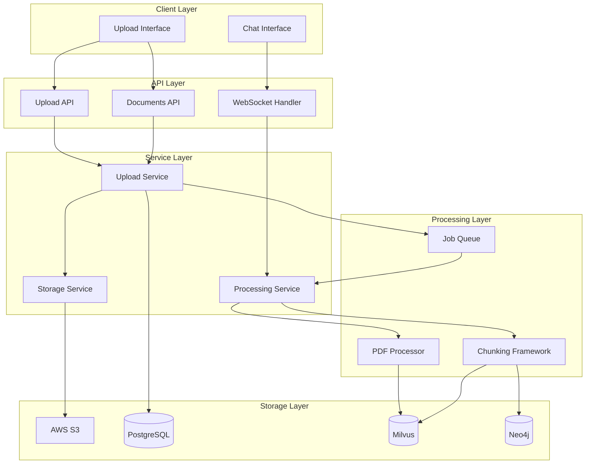
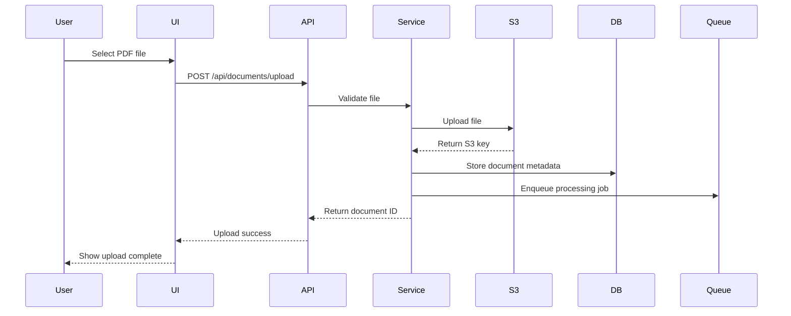
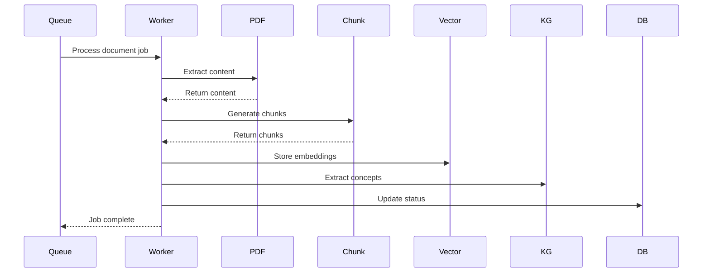

# PDF Upload Implementation Design Document

## Overview

This design document outlines the technical architecture and implementation approach for adding PDF upload functionality to "The Librarian" application. The system will integrate with existing components (PDF processor, vector store, knowledge graph, and AI chat interface) to provide a seamless document upload and processing experience.

## Architecture

### System Architecture Diagram



### Data Flow Architecture

#### Upload Flow


#### Processing Flow


## Components and Interfaces

### 1. Upload Service

**Purpose**: Handle file uploads and document lifecycle management

**Interface**:
```python
class UploadService:
    async def upload_document(
        self, 
        file: UploadFile, 
        user_id: str,
        title: Optional[str] = None,
        description: Optional[str] = None
    ) -> Document
    
    async def get_document(self, document_id: str, user_id: str) -> Document
    
    async def list_documents(
        self, 
        user_id: str,
        status: Optional[str] = None,
        limit: int = 50,
        offset: int = 0
    ) -> List[Document]
    
    async def delete_document(self, document_id: str, user_id: str) -> bool
    
    async def get_upload_progress(self, document_id: str) -> UploadProgress
```

**Key Responsibilities**:
- File validation (size, format, integrity)
- S3 upload coordination
- Document metadata management
- User authorization
- Progress tracking

### 2. Storage Service

**Purpose**: Abstract S3 operations and provide secure file access

**Interface**:
```python
class StorageService:
    async def upload_file(
        self, 
        file: UploadFile, 
        key: str,
        metadata: Dict[str, str] = None
    ) -> str
    
    async def download_file(self, key: str) -> bytes
    
    async def get_presigned_url(
        self, 
        key: str, 
        expiration: int = 3600
    ) -> str
    
    async def delete_file(self, key: str) -> bool
    
    async def file_exists(self, key: str) -> bool
```

**Key Responsibilities**:
- S3 bucket operations
- Presigned URL generation
- File encryption/decryption
- Error handling and retries

### 3. Processing Service

**Purpose**: Orchestrate document processing pipeline

**Interface**:
```python
class ProcessingService:
    async def process_document(self, document_id: str) -> ProcessingResult
    
    async def get_processing_status(self, document_id: str) -> ProcessingStatus
    
    async def retry_processing(self, document_id: str) -> bool
    
    async def cancel_processing(self, document_id: str) -> bool
```

**Key Responsibilities**:
- Job queue management
- PDF processing coordination
- Chunking framework integration
- Vector store updates
- Knowledge graph updates
- Status tracking and error handling

### 4. Document Manager

**Purpose**: Coordinate document lifecycle and integrations

**Interface**:
```python
class DocumentManager:
    async def create_document(self, metadata: DocumentMetadata) -> Document
    
    async def update_processing_status(
        self, 
        document_id: str, 
        status: ProcessingStatus
    ) -> bool
    
    async def associate_chunks(
        self, 
        document_id: str, 
        chunks: List[DocumentChunk]
    ) -> bool
    
    async def get_document_chunks(self, document_id: str) -> List[DocumentChunk]
```

## Data Models

### Core Models

```python
from pydantic import BaseModel, Field
from typing import Optional, List, Dict, Any
from datetime import datetime
from enum import Enum

class DocumentStatus(str, Enum):
    UPLOADED = "uploaded"
    PROCESSING = "processing"
    COMPLETED = "completed"
    FAILED = "failed"

class ChunkType(str, Enum):
    TEXT = "text"
    IMAGE = "image"
    TABLE = "table"
    CHART = "chart"

class Document(BaseModel):
    id: str = Field(..., description="Unique document identifier")
    user_id: str = Field(..., description="Owner user ID")
    title: str = Field(..., description="Document title")
    description: Optional[str] = Field(None, description="Document description")
    filename: str = Field(..., description="Original filename")
    file_size: int = Field(..., description="File size in bytes")
    mime_type: str = Field(..., description="MIME type")
    s3_key: str = Field(..., description="S3 storage key")
    status: DocumentStatus = Field(..., description="Processing status")
    processing_error: Optional[str] = Field(None, description="Error message if failed")
    upload_timestamp: datetime = Field(..., description="Upload time")
    processing_started_at: Optional[datetime] = Field(None, description="Processing start time")
    processing_completed_at: Optional[datetime] = Field(None, description="Processing completion time")
    page_count: Optional[int] = Field(None, description="Number of pages")
    chunk_count: Optional[int] = Field(None, description="Number of chunks generated")
    metadata: Dict[str, Any] = Field(default_factory=dict, description="Additional metadata")

class DocumentChunk(BaseModel):
    id: str = Field(..., description="Unique chunk identifier")
    document_id: str = Field(..., description="Parent document ID")
    chunk_index: int = Field(..., description="Chunk order index")
    content: str = Field(..., description="Chunk content")
    page_number: Optional[int] = Field(None, description="Source page number")
    section_title: Optional[str] = Field(None, description="Section title")
    chunk_type: ChunkType = Field(..., description="Type of chunk")
    metadata: Dict[str, Any] = Field(default_factory=dict, description="Chunk metadata")
    created_at: datetime = Field(..., description="Creation timestamp")

class DocumentUploadRequest(BaseModel):
    title: Optional[str] = Field(None, description="Document title")
    description: Optional[str] = Field(None, description="Document description")

class DocumentUploadResponse(BaseModel):
    document_id: str = Field(..., description="Created document ID")
    title: str = Field(..., description="Document title")
    status: DocumentStatus = Field(..., description="Current status")
    file_size: int = Field(..., description="File size in bytes")
    upload_timestamp: datetime = Field(..., description="Upload timestamp")

class ProcessingStatus(BaseModel):
    document_id: str = Field(..., description="Document ID")
    status: DocumentStatus = Field(..., description="Current status")
    progress_percentage: float = Field(..., description="Processing progress (0-100)")
    current_step: str = Field(..., description="Current processing step")
    error_message: Optional[str] = Field(None, description="Error message if failed")
    estimated_completion: Optional[datetime] = Field(None, description="Estimated completion time")
```

### Database Schema

```sql
-- Documents table
CREATE TABLE documents (
    id UUID PRIMARY KEY DEFAULT gen_random_uuid(),
    user_id UUID NOT NULL,
    title VARCHAR(255) NOT NULL,
    description TEXT,
    filename VARCHAR(255) NOT NULL,
    file_size BIGINT NOT NULL,
    mime_type VARCHAR(100) NOT NULL,
    s3_key VARCHAR(500) NOT NULL UNIQUE,
    status VARCHAR(50) NOT NULL DEFAULT 'uploaded',
    processing_error TEXT,
    upload_timestamp TIMESTAMP WITH TIME ZONE NOT NULL DEFAULT NOW(),
    processing_started_at TIMESTAMP WITH TIME ZONE,
    processing_completed_at TIMESTAMP WITH TIME ZONE,
    page_count INTEGER,
    chunk_count INTEGER,
    metadata JSONB DEFAULT '{}',
    
    CONSTRAINT valid_status CHECK (status IN ('uploaded', 'processing', 'completed', 'failed')),
    CONSTRAINT positive_file_size CHECK (file_size > 0),
    CONSTRAINT positive_page_count CHECK (page_count IS NULL OR page_count > 0),
    CONSTRAINT positive_chunk_count CHECK (chunk_count IS NULL OR chunk_count >= 0)
);

-- Document chunks table
CREATE TABLE document_chunks (
    id UUID PRIMARY KEY DEFAULT gen_random_uuid(),
    document_id UUID NOT NULL REFERENCES documents(id) ON DELETE CASCADE,
    chunk_index INTEGER NOT NULL,
    content TEXT NOT NULL,
    page_number INTEGER,
    section_title VARCHAR(255),
    chunk_type VARCHAR(50) NOT NULL DEFAULT 'text',
    metadata JSONB DEFAULT '{}',
    created_at TIMESTAMP WITH TIME ZONE NOT NULL DEFAULT NOW(),
    
    CONSTRAINT valid_chunk_type CHECK (chunk_type IN ('text', 'image', 'table', 'chart')),
    CONSTRAINT positive_chunk_index CHECK (chunk_index >= 0),
    CONSTRAINT positive_page_number CHECK (page_number IS NULL OR page_number > 0),
    UNIQUE(document_id, chunk_index)
);

-- Indexes for performance
CREATE INDEX idx_documents_user_id ON documents(user_id);
CREATE INDEX idx_documents_status ON documents(status);
CREATE INDEX idx_documents_upload_timestamp ON documents(upload_timestamp DESC);
CREATE INDEX idx_document_chunks_document_id ON document_chunks(document_id);
CREATE INDEX idx_document_chunks_type ON document_chunks(chunk_type);
CREATE INDEX idx_document_chunks_page ON document_chunks(page_number);
```

## Correctness Properties

*A property is a characteristic or behavior that should hold true across all valid executions of a system-essentially, a formal statement about what the system should do. Properties serve as the bridge between human-readable specifications and machine-verifiable correctness guarantees.*

### Property 1: Upload File Size Validation
*For any* PDF file upload request, if the file size exceeds 100MB, then the upload should be rejected with an appropriate error message.
**Validates: Requirements 1.1**

### Property 2: File Format Validation
*For any* file upload request, if the file is not a valid PDF format, then the upload should be rejected with a format error message.
**Validates: Requirements 1.1**

### Property 3: Document ID Uniqueness
*For any* successful document upload, the returned document ID should be unique across all documents in the system.
**Validates: Requirements 1.1**

### Property 4: Processing Status Consistency
*For any* document in the system, the processing status should follow the valid state transitions: uploaded → processing → (completed | failed).
**Validates: Requirements 2.2**

### Property 5: Document Deletion Completeness
*For any* document deletion request, all associated data (S3 file, database records, vector embeddings, knowledge graph entries) should be completely removed.
**Validates: Requirements 3.3**

### Property 6: User Authorization
*For any* document operation (view, delete, process), the requesting user should only be able to access documents they own.
**Validates: Requirements 5.2**

### Property 7: Processing Idempotency
*For any* document, processing the same document multiple times should produce equivalent results in the vector store and knowledge graph.
**Validates: Requirements 2.2**

### Property 8: Chunk Document Association
*For any* generated document chunk, it should maintain a valid reference to its source document and be retrievable through document queries.
**Validates: Requirements 2.3**

### Property 9: Search Result Attribution
*For any* chat query that returns document-based results, the response should include accurate citations with document name and page numbers.
**Validates: Requirements 4.2**

### Property 10: Storage Consistency
*For any* uploaded document, the file should be accessible from S3 using the stored S3 key until the document is deleted.
**Validates: Requirements 5.1**

## Error Handling

### Upload Errors

**File Size Exceeded**:
- Error Code: `FILE_TOO_LARGE`
- HTTP Status: 413 Payload Too Large
- Message: "File size exceeds maximum limit of 100MB"
- Recovery: User must compress or split the file

**Invalid File Format**:
- Error Code: `INVALID_FILE_FORMAT`
- HTTP Status: 400 Bad Request
- Message: "File must be a valid PDF document"
- Recovery: User must provide a valid PDF file

**Storage Failure**:
- Error Code: `STORAGE_ERROR`
- HTTP Status: 500 Internal Server Error
- Message: "Failed to store file. Please try again."
- Recovery: Automatic retry with exponential backoff

### Processing Errors

**PDF Corruption**:
- Error Code: `CORRUPTED_PDF`
- Status: Failed
- Message: "PDF file is corrupted and cannot be processed"
- Recovery: User must provide a valid PDF file

**Processing Timeout**:
- Error Code: `PROCESSING_TIMEOUT`
- Status: Failed
- Message: "Document processing timed out"
- Recovery: Automatic retry with increased timeout

**Insufficient Resources**:
- Error Code: `RESOURCE_EXHAUSTED`
- Status: Failed
- Message: "Processing resources temporarily unavailable"
- Recovery: Automatic retry when resources available

### Integration Errors

**Vector Store Failure**:
- Error Code: `VECTOR_STORE_ERROR`
- Status: Failed
- Message: "Failed to store document embeddings"
- Recovery: Retry processing with vector store health check

**Knowledge Graph Failure**:
- Error Code: `KNOWLEDGE_GRAPH_ERROR`
- Status: Completed (with warning)
- Message: "Document processed but knowledge extraction failed"
- Recovery: Continue with vector search only

## Testing Strategy

### Unit Testing Approach

**Upload Service Tests**:
- Test file validation logic with various file types and sizes
- Test S3 integration with mocked AWS services
- Test error handling for various failure scenarios
- Test user authorization and access controls

**Processing Service Tests**:
- Test job queue integration with mocked queue
- Test PDF processor integration with sample documents
- Test chunking framework integration
- Test status tracking and error reporting

**API Endpoint Tests**:
- Test all HTTP endpoints with valid and invalid inputs
- Test authentication and authorization
- Test error response formats
- Test concurrent upload scenarios

### Property-Based Testing

Each correctness property will be implemented as a property-based test using Hypothesis:

**Property Test Configuration**:
- Minimum 100 iterations per property test
- Each test tagged with: **Feature: pdf-upload-implementation, Property {number}: {property_text}**

**Example Property Test**:
```python
from hypothesis import given, strategies as st
import pytest

@given(file_size=st.integers(min_value=100_000_001))  # > 100MB
def test_file_size_validation_property(file_size):
    """
    Feature: pdf-upload-implementation, Property 1: Upload File Size Validation
    For any PDF file upload request, if the file size exceeds 100MB, 
    then the upload should be rejected with an appropriate error message.
    """
    # Create mock file with given size
    mock_file = create_mock_file(size=file_size)
    
    # Attempt upload
    with pytest.raises(FileTooLargeError) as exc_info:
        upload_service.upload_document(mock_file, user_id="test")
    
    # Verify error message
    assert "exceeds maximum limit" in str(exc_info.value)
    assert "100MB" in str(exc_info.value)
```

### Integration Testing

**End-to-End Workflow Tests**:
- Upload → Process → Search → Chat integration
- Error recovery and retry scenarios
- Concurrent user operations
- Performance under load

**Database Integration Tests**:
- Schema validation and constraints
- Transaction consistency
- Index performance
- Data migration scenarios

**AWS Integration Tests**:
- S3 upload/download operations
- Presigned URL generation and expiration
- IAM permissions and security
- Error handling for AWS service failures

## Performance Considerations

### Upload Performance

**Streaming Uploads**:
- Use FastAPI's streaming upload for large files
- Implement progress tracking with WebSocket updates
- Chunk uploads for better error recovery

**Concurrent Uploads**:
- Support 50+ concurrent uploads
- Rate limiting per user (5 uploads/minute)
- Queue management for processing jobs

### Processing Performance

**Parallel Processing**:
- Use Celery workers for background processing
- Implement document chunking for parallel embedding generation
- Optimize PDF extraction for speed vs. quality trade-offs

**Resource Management**:
- Memory-efficient streaming for large documents
- Temporary file cleanup after processing
- Connection pooling for database and external services

### Storage Performance

**S3 Optimization**:
- Use multipart uploads for files > 5MB
- Implement S3 Transfer Acceleration
- Configure appropriate storage classes

**Database Optimization**:
- Proper indexing for common queries
- Connection pooling and query optimization
- Pagination for large result sets

## Security Implementation

### File Security

**Upload Validation**:
- MIME type verification
- File signature validation
- Virus scanning integration
- Content sanitization

**Storage Security**:
- S3 server-side encryption (SSE-S3)
- Bucket policies for access control
- Presigned URLs with short expiration
- Audit logging for all file operations

### API Security

**Authentication**:
- JWT token validation
- User session management
- Rate limiting and throttling
- CORS configuration

**Authorization**:
- User-based document access control
- Role-based permissions
- API key management for service access
- Audit trails for sensitive operations

### Data Privacy

**Personal Data Protection**:
- Document content encryption at rest
- Secure deletion procedures
- Data retention policies
- GDPR compliance measures

## Deployment Architecture

### Infrastructure Components

**Application Tier**:
- FastAPI application with Gunicorn
- Celery workers for background processing
- Redis for job queue and caching
- Load balancer for high availability

**Storage Tier**:
- PostgreSQL for metadata and relationships
- Milvus for vector embeddings
- Neo4j for knowledge graph
- AWS S3 for file storage

**Monitoring Tier**:
- CloudWatch for AWS metrics
- Application performance monitoring
- Error tracking and alerting
- Usage analytics and reporting

### Scalability Design

**Horizontal Scaling**:
- Stateless application design
- Database read replicas
- Distributed job processing
- CDN for static assets

**Vertical Scaling**:
- Auto-scaling groups for compute
- Database connection pooling
- Memory optimization
- CPU-intensive task optimization

This design provides a robust, scalable, and secure foundation for implementing PDF upload functionality while integrating seamlessly with the existing "The Librarian" architecture.