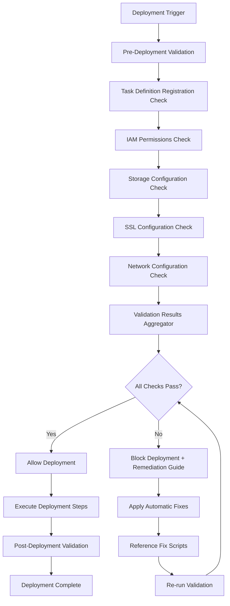

# Design Document

## Overview

The Production Deployment Checklist system provides automated validation of the critical deployment steps that have been repeatedly rediscovered during production deployments. Based on real-world deployment debugging experience, the system implements a comprehensive validation framework that checks IAM permissions, ephemeral storage configuration, HTTPS/SSL setup, network configuration, and task definition registration before allowing production deployments to proceed.

The system learned from actual deployment failures including:
- VPC mismatches between load balancers and target groups causing traffic routing failures
- IAM policy version limits (5 max) blocking permission updates
- Task definition validation timing issues (validating old vs. new configurations)
- Network configuration mismatches preventing successful deployments
- Integration challenges between validation and deployment workflows

## Architecture

The system follows a validation pipeline architecture:



## Components and Interfaces

### 1. Checklist Validator

**Purpose**: Orchestrates the validation of all critical deployment requirements

**Interface**:
```python
class ChecklistValidator:
    def validate_deployment_readiness(self, deployment_config: DeploymentConfig) -> ValidationResult
    def get_validation_report(self) -> ValidationReport
```

**Responsibilities**:
- Coordinate execution of all validation checks
- Aggregate validation results
- Generate comprehensive validation reports

### 2. IAM Permissions Validator

**Purpose**: Validates ECS task IAM role permissions for Secrets Manager access with policy version management

**Interface**:
```python
class IAMPermissionsValidator:
    def validate_secrets_manager_access(self, role_arn: str) -> ValidationResult
    def test_secret_retrieval(self, role_arn: str, secret_name: str) -> bool
    def get_required_permissions(self) -> List[str]
    def check_policy_version_limits(self, policy_arn: str) -> bool
    def cleanup_old_policy_versions(self, policy_arn: str) -> bool
```

**Validation Logic**:
- Check if IAM role has `secretsmanager:GetSecretValue` permission
- Attempt test retrieval of database credentials
- Attempt test retrieval of API keys
- Check IAM policy version count and clean up if at limit (5 versions)
- Provide specific permission requirements if validation fails

### 3. Storage Configuration Validator

**Purpose**: Validates ECS task definition ephemeral storage allocation

**Interface**:
```python
class StorageConfigValidator:
    def validate_ephemeral_storage(self, task_definition: dict) -> ValidationResult
    def get_minimum_storage_requirement(self) -> int
    def check_storage_allocation(self, task_definition: dict) -> int
```

**Validation Logic**:
- Parse ECS task definition JSON
- Extract ephemeral storage configuration
- Verify allocation is >= 30GB
- Provide task definition update guidance if insufficient

### 4. SSL Configuration Validator

**Purpose**: Validates HTTPS/SSL setup for production security

**Interface**:
```python
class SSLConfigValidator:
    def validate_load_balancer_ssl(self, lb_arn: str) -> ValidationResult
    def check_certificate_validity(self, certificate_arn: str) -> bool
    def validate_security_headers(self, endpoint_url: str) -> ValidationResult
```

**Validation Logic**:
- Verify load balancer has SSL listener configured
- Check SSL certificate validity and expiration
- Test HTTPS redirect functionality
- Validate security headers in responses

### 5. Network Configuration Validator

**Purpose**: Validates VPC, subnet, and load balancer configuration compatibility discovered during debugging

**Interface**:
```python
class NetworkConfigValidator:
    def validate_vpc_compatibility(self, lb_arn: str, service_config: dict) -> ValidationResult
    def validate_target_group_mapping(self, lb_arn: str, service_name: str) -> ValidationResult
    def validate_subnet_configuration(self, lb_arn: str, service_subnets: List[str]) -> ValidationResult
    def find_compatible_subnets(self, vpc_id: str, availability_zones: List[str]) -> List[str]
    def validate_security_group_rules(self, security_groups: List[str], required_port: int) -> ValidationResult
```

**Validation Logic**:
- Verify load balancer and ECS service are in the same VPC
- Check that target groups match load balancer listener configuration
- Validate subnet compatibility between load balancer AZs and ECS service subnets
- Ensure security groups allow required port access (8000)
- Provide specific VPC and subnet mapping corrections

### 6. Task Definition Registration Validator

**Purpose**: Validates task definition registration timing and configuration discovered during debugging

**Interface**:
```python
class TaskDefinitionValidator:
    def validate_registration_status(self, task_def_arn: str) -> ValidationResult
    def ensure_latest_revision_used(self, family: str) -> str
    def validate_storage_in_registered_definition(self, task_def_arn: str) -> ValidationResult
    def register_task_definition_if_needed(self, task_def_config: dict) -> str
```

**Validation Logic**:
- Ensure task definition is registered before validation
- Verify validation uses the latest registered revision
- Check storage configuration in the actual registered task definition
- Handle task definition registration failures with specific error details

### 7. Fix Script Reference Manager

**Purpose**: Maintains references to fix scripts and provides remediation guidance

**Interface**:
```python
class FixScriptManager:
    def get_iam_fix_scripts(self) -> List[ScriptReference]
    def get_storage_fix_scripts(self) -> List[ScriptReference]
    def get_ssl_fix_scripts(self) -> List[ScriptReference]
    def get_network_fix_scripts(self) -> List[ScriptReference]
    def generate_remediation_guide(self, failed_checks: List[str]) -> RemediationGuide
```

**Script References**:
- IAM: `scripts/fix-iam-secrets-permissions.py`, `scripts/fix-iam-secrets-permissions-correct.py`
- Storage: `task-definition-update.json`, task definition update scripts
- SSL: `scripts/add-https-ssl-support.py`, `scripts/add-https-ssl-support-fixed.py`
- Network: `scripts/fix-subnet-mismatch.py`, `scripts/fix-vpc-security-group-mismatch.py`, `scripts/comprehensive-networking-fix.py`

## Data Models

### ValidationResult
```python
@dataclass
class ValidationResult:
    check_name: str
    passed: bool
    message: str
    remediation_steps: Optional[List[str]]
    fix_scripts: Optional[List[str]]
    details: Optional[Dict[str, Any]]
```

### DeploymentConfig
```python
@dataclass
class DeploymentConfig:
    task_definition_arn: str
    iam_role_arn: str
    load_balancer_arn: str
    target_environment: str
    ssl_certificate_arn: Optional[str]
    vpc_id: Optional[str]
    service_subnets: Optional[List[str]]
    security_groups: Optional[List[str]]
    cluster_name: Optional[str]
    service_name: Optional[str]
```

### NetworkConfiguration
```python
@dataclass
class NetworkConfiguration:
    vpc_id: str
    load_balancer_subnets: List[str]
    service_subnets: List[str]
    security_groups: List[str]
    availability_zones: List[str]
    target_group_arn: Optional[str]
```

### ValidationReport
```python
@dataclass
class ValidationReport:
    overall_status: bool
    timestamp: datetime
    checks_performed: List[ValidationResult]
    deployment_config: DeploymentConfig
    remediation_summary: Optional[str]
```

## Correctness Properties

*A property is a characteristic or behavior that should hold true across all valid executions of a system-essentially, a formal statement about what the system should do. Properties serve as the bridge between human-readable specifications and machine-verifiable correctness guarantees.*

### Property Reflection

After analyzing all acceptance criteria, several properties can be consolidated:
- Properties 1.2 and 1.3 (database credentials and API keys retrieval) can be combined into one comprehensive secret retrieval property
- Properties 5.1, 5.2, and 5.3 (script references) can be combined into one comprehensive script reference property
- Properties 1.4, 2.5, and 3.5 (remediation guidance) can be combined into one comprehensive remediation property

### Core Properties

**Property 1: IAM Permission Validation**
*For any* IAM role configuration, the validator should correctly identify whether the role has the required secretsmanager:GetSecretValue permission
**Validates: Requirements 1.1**

**Property 2: Secret Retrieval Validation**
*For any* valid IAM role and secret configuration, the validator should successfully test retrieval of both database credentials and API keys from Secrets Manager
**Validates: Requirements 1.2, 1.3**

**Property 3: Storage Configuration Validation**
*For any* ECS task definition, the validator should correctly identify whether ephemeral storage is set to 30GB or higher
**Validates: Requirements 2.1, 2.2**

**Property 4: SSL Configuration Validation**
*For any* load balancer and certificate configuration, the validator should correctly identify HTTPS redirect setup, certificate validity, and security headers
**Validates: Requirements 3.1, 3.2, 3.3**

**Property 5: Comprehensive Validation Orchestration**
*For any* deployment configuration, the validation system should execute all three critical checks (IAM, storage, SSL) and aggregate results appropriately
**Validates: Requirements 4.1**

**Property 6: Validation Failure Handling**
*For any* failed validation check, the system should halt deployment and provide specific remediation steps with script references
**Validates: Requirements 1.4, 2.5, 3.5, 4.2, 4.4**

**Property 7: Validation Success Logging**
*For any* successful validation run, the system should log results and maintain audit records
**Validates: Requirements 4.3, 4.5**

**Property 8: Fix Script Reference Management**
*For any* validation failure type, the system should provide correct references to the appropriate fix scripts
**Validates: Requirements 5.1, 5.2, 5.3, 5.4**

**Property 10: Network Configuration Validation**
*For any* load balancer and ECS service configuration, the validator should correctly identify VPC mismatches, subnet incompatibilities, and target group mapping issues
**Validates: Requirements 4.1, 4.2, 4.3, 4.4**

**Property 11: Task Definition Registration Validation**
*For any* task definition configuration, the validator should ensure the latest revision is registered and used for validation
**Validates: Requirements 5.1, 5.2, 5.3, 5.4, 5.5**

**Property 12: Policy Version Management**
*For any* IAM policy update, the validator should check version limits and clean up old versions when necessary
**Validates: Requirements 1.4, 1.5**

## Error Handling

The system implements comprehensive error handling for each validation component:

### IAM Validation Errors
- **Permission Denied**: Provide specific IAM policy requirements
- **Role Not Found**: Guide user to verify role ARN
- **Secret Access Failed**: Reference IAM fix scripts and provide step-by-step remediation

### Storage Validation Errors
- **Invalid Task Definition**: Provide JSON schema validation errors
- **Insufficient Storage**: Reference task definition update scripts and provide configuration examples
- **Missing Storage Config**: Guide user through ephemeral storage configuration

### SSL Validation Errors
- **Certificate Expired/Invalid**: Provide certificate renewal guidance
- **Missing HTTPS Listener**: Reference SSL setup scripts
- **Security Headers Missing**: Provide header configuration examples

### Network Configuration Errors
- **VPC Mismatch**: Provide specific VPC mapping corrections and compatible subnet identification
- **Target Group Mapping Issues**: Reference network fix scripts and provide listener configuration updates
- **Subnet Incompatibility**: Guide user through subnet selection in matching availability zones
- **Security Group Rules**: Provide port access configuration and security group creation guidance

### Task Definition Registration Errors
- **Registration Timing Issues**: Ensure task definition is registered before validation
- **Revision Mismatch**: Guide user to use latest registered revision for validation
- **Storage Configuration Mismatch**: Validate storage in the actual registered task definition rather than local files

### System Errors
- **AWS API Failures**: Implement retry logic with exponential backoff
- **Network Connectivity**: Provide troubleshooting guidance
- **Configuration File Errors**: Validate input schemas and provide clear error messages

## Testing Strategy

### Unit Testing
- Test each validator component independently
- Mock AWS API calls for consistent testing
- Test error conditions and edge cases
- Verify remediation guidance content

### Property-Based Testing
- Use Hypothesis (Python) for property-based testing
- Generate random AWS configurations to test validation logic
- Test with minimum 100 iterations per property
- Each property test references its design document property

**Property Test Configuration**:
- **Feature: production-deployment-checklist, Property 1**: IAM Permission Validation
- **Feature: production-deployment-checklist, Property 2**: Secret Retrieval Validation
- **Feature: production-deployment-checklist, Property 3**: Storage Configuration Validation
- **Feature: production-deployment-checklist, Property 4**: SSL Configuration Validation
- **Feature: production-deployment-checklist, Property 5**: Comprehensive Validation Orchestration
- **Feature: production-deployment-checklist, Property 6**: Validation Failure Handling
- **Feature: production-deployment-checklist, Property 7**: Validation Success Logging
- **Feature: production-deployment-checklist, Property 8**: Fix Script Reference Management
- **Feature: production-deployment-checklist, Property 9**: Post-Fix Validation
- **Feature: production-deployment-checklist, Property 10**: Network Configuration Validation
- **Feature: production-deployment-checklist, Property 11**: Task Definition Registration Validation
- **Feature: production-deployment-checklist, Property 12**: Policy Version Management

### Integration Testing
- Test end-to-end validation workflows
- Test integration with existing deployment scripts
- Validate against real AWS resources in test environment
- Test remediation script execution

<function_calls>
<invoke name="prework">
<parameter name="featureName">production-deployment-checklist