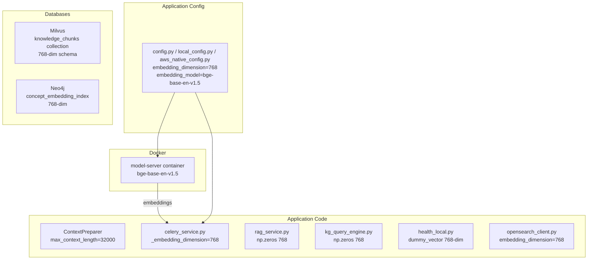

# Design Document: RAG Retrieval Quality Improvement

## Overview

This design covers two targeted changes to improve RAG retrieval quality:

1. **Context window increase**: Change `ContextPreparer.max_context_length` from 8,000 to 32,000 characters so more ranked chunks reach the LLM.
2. **Embedding model swap**: Replace `all-MiniLM-L6-v2` (384-dim) with `bge-base-en-v1.5` (768-dim) across the entire embedding pipeline — model server, Milvus, Neo4j, config defaults, and all hardcoded dimension references.

The context window change is a single constant update. The embedding model swap is a coordinated change across multiple layers: Docker configuration, database schemas, application config, and all hardcoded dimension references. After the swap, the operator will re-upload all documents through the normal upload pipeline (no automated migration script).

### Design Decisions

- **Why bge-base-en-v1.5?** It ranks higher on MTEB benchmarks than all-MiniLM-L6-v2 for retrieval tasks, supports 512 tokens (matching our existing `max_embedding_tokens`), and produces 768-dim vectors — a good balance between quality and memory/compute cost.
- **Why 32,000 characters?** The current 8,000-char budget silently drops chunks ranked 5+ in most queries. 32,000 characters accommodates ~15–20 chunks at typical chunk sizes, aligning with modern LLM context windows (GPT-4, Claude, Gemini all support 100k+ tokens).
- **No migration script**: The operator will re-upload all documents through the normal upload pipeline after the model swap. This avoids a separate migration tool and reuses the existing, well-tested ingestion path.
- **ConceptNet validation is unaffected**: ConceptNet enrichment uses string-based exact matching on `ConceptNetConcept` nodes, not embedding similarity — no changes needed there.

## Architecture

The change touches these layers:



### Change Scope Summary

| Layer | File(s) | Change |
|-------|---------|--------|
| Context window | `rag_service.py` | `max_context_length` 8000 → 32000 |
| Model server | `docker-compose.yml`, `Dockerfile.model-server` | `EMBEDDING_MODEL=bge-base-en-v1.5`, pre-download new model |
| App config | `config/config.py`, `local_config.py`, `aws_native_config.py` | Default dimension 384 → 768, model name updated, model-dimension mapping updated |
| Model server config | `src/model_server/config.py` | Default `embedding_model` → `bge-base-en-v1.5` |
| Milvus client | `milvus_client.py` | Hardcoded 384 refs in comments/defaults → 768 |
| Neo4j client | `neo4j_client.py` | `ensure_indexes` vector index dimension 384 → 768 |
| Celery service | `celery_service.py` | `_embedding_dimension` 384 → 768 (two locations) |
| RAG service | `rag_service.py` | Placeholder `np.zeros(384)` → `np.zeros(768)` |
| KG query engine | `kg_query_engine.py` | Placeholder `np.zeros(384)` → `np.zeros(768)` (two locations) |
| OpenSearch client | `opensearch_client.py` | Default `embedding_dimension` 384 → 768 |
| Health check | `health_local.py` | Dummy vector `[0.1] * 384` → `[0.1] * 768` |
| Protocols | `protocols.py` | Doc comments referencing 384 → 768 |
| Docker Compose | `docker-compose.yml` | `EMBEDDING_MODEL` env var for model-server, app, celery-worker |

## Components and Interfaces

### 1. ContextPreparer (rag_service.py)

Single-line change: `max_context_length` default from 8000 to 32000.

```python
class ContextPreparer:
    def __init__(self, max_context_length: int = 32000):
        self.max_context_length = max_context_length
```

No interface changes. The `_select_chunks_by_length` method already respects `self.max_context_length` as the budget — it will simply include more chunks before hitting the limit.

### 2. Model Server Container

The `Dockerfile.model-server` pre-downloads the model at build time. Update the `RUN` line:

```dockerfile
RUN python -c "from sentence_transformers import SentenceTransformer; SentenceTransformer('BAAI/bge-base-en-v1.5')" \
    && python -c "import spacy; spacy.cli.download('en_core_web_sm')"
```

The `docker-compose.yml` environment variable changes from `all-MiniLM-L6-v2` to `bge-base-en-v1.5` for all three services (model-server, app, celery-worker).

The `src/model_server/config.py` default changes to `bge-base-en-v1.5`.

### 3. Configuration Layer

All three config classes (`Settings`, `LocalSettings`, `AWSNativeSettings`) update:
- `embedding_dimension` default: 384 → 768
- `embedding_model` default: references to `all-MiniLM-L6-v2` → `bge-base-en-v1.5`
- `target_embedding_tokens` description: reference `bge-base-en-v1.5` instead of `all-MiniLM-L6-v2`

The `local_config.py` model-dimension mapping adds the new model:

```python
model_dimensions = {
    'sentence-transformers/all-MiniLM-L6-v2': 384,
    'sentence-transformers/all-mpnet-base-v2': 768,
    'sentence-transformers/all-distilroberta-v1': 768,
    'sentence-transformers/paraphrase-MiniLM-L6-v2': 384,
    'BAAI/bge-base-en-v1.5': 768,
    'bge-base-en-v1.5': 768,
}
```

### 4. Neo4j Client (ensure_indexes)

The vector index creation statement changes dimension from 384 to 768:

```python
vector_index_statement = (
    "CALL db.index.vector.createNodeIndex("
    "'concept_embedding_index', 'Concept', 'embedding', 768, 'cosine')"
)
```

For existing deployments, the operator drops the old index manually, then `ensure_indexes` recreates it at 768 on application startup.

### 5. Milvus Client

No schema code changes needed — `create_collection` already accepts `dimension` as a parameter. The hardcoded 384 references in `_load_embedding_model` and `_ensure_embedding_model` (where `_embedding_dimension` is set to 384 as a default for the model server path) change to 768.

### 6. Hardcoded Dimension References

All remaining hardcoded 384 references across the codebase change to 768:

- `celery_service.py`: `_embedding_dimension = 768` (two locations)
- `rag_service.py`: `np.zeros(768)` placeholder embeddings
- `kg_query_engine.py`: `np.zeros(768)` placeholder embeddings (two locations)
- `opensearch_client.py`: default `embedding_dimension = 768`
- `health_local.py`: dummy vector `[0.1] * 768`
- `protocols.py`: doc comments referencing dimension updated

## Data Models

### Affected Data Stores

**Milvus `knowledge_chunks` collection schema** (before → after):

| Field | Type | Before | After |
|-------|------|--------|-------|
| id | VARCHAR(512) | unchanged | unchanged |
| vector | FLOAT_VECTOR | dim=384 | dim=768 |
| metadata | JSON | unchanged | unchanged |

The collection must be dropped and recreated because Milvus does not support altering vector dimensions on an existing collection.

**Neo4j `concept_embedding_index`** (before → after):

| Property | Before | After |
|----------|--------|-------|
| Index name | `concept_embedding_index` | `concept_embedding_index` |
| Label | `Concept` | `Concept` |
| Property | `embedding` | `embedding` |
| Dimensions | 384 | 768 |
| Similarity | cosine | cosine |

The index must be dropped and recreated. The `Concept.embedding` property values will be regenerated when documents are re-uploaded through the normal pipeline.

**PostgreSQL tables** — no schema changes. The `knowledge_chunks` and `bridge_chunks` tables store text content but do not store embedding vectors. The `knowledge_sources` table tracks documents.


## Correctness Properties

*A property is a characteristic or behavior that should hold true across all valid executions of a system — essentially, a formal statement about what the system should do. Properties serve as the bridge between human-readable specifications and machine-verifiable correctness guarantees.*

### Property 1: Context budget selects the maximal fitting prefix

*For any* list of ranked document chunks (each with non-empty content), the chunks selected by `ContextPreparer._select_chunks_by_length` should be exactly the longest prefix of the input list such that the cumulative formatted length (content length + 100 overhead per chunk) does not exceed `max_context_length`. No additional chunk from the remaining list should fit within the remaining budget.

**Validates: Requirements 1.2, 1.3**

## Error Handling

### Application Runtime Errors

| Error Condition | Handling |
|----------------|----------|
| Dimension mismatch on Milvus insert | Milvus returns a schema error. Existing error handling in `MilvusClient.store_embeddings` propagates this. (Req 4.3) |
| Old 384-dim vectors in Milvus/Neo4j after model swap | Operator must drop old collections/indexes and re-upload all documents. The application's `ensure_indexes` and collection creation logic will recreate schemas at 768 dimensions on startup. |
| Config env var override to old model | The model-dimension mapping will resolve correctly if the operator also sets the dimension. A mismatch triggers a validation warning in `local_config.py`. |

### Operational Procedure

1. Stop the application and celery worker (`docker compose down`)
2. Rebuild Docker images with new model (`docker compose build model-server app`)
3. Drop existing Milvus collection and Neo4j vector index (old 384-dim data is incompatible)
4. Start all services (`docker compose up -d`)
5. Wait for model-server health check to pass — the app will recreate Milvus collections and Neo4j indexes at 768 dimensions on startup
6. Re-upload all documents through the normal upload pipeline

## Testing Strategy

### Property-Based Tests

Use `hypothesis` (Python property-based testing library) for all property tests. Each test runs a minimum of 100 iterations.

| Property | Test Description | Library |
|----------|-----------------|---------|
| Property 1 | Generate random chunk lists with varying content lengths, verify `_select_chunks_by_length` returns the maximal fitting prefix | hypothesis |

Each property test must be tagged with a comment:
```python
# Feature: rag-retrieval-quality-improvement, Property 1: Context budget selects the maximal fitting prefix
```

### Unit Tests (Examples and Edge Cases)

| Test | What it verifies | Requirement |
|------|-----------------|-------------|
| `test_context_preparer_default_32000` | `ContextPreparer()` has `max_context_length == 32000` | 1.1 |
| `test_config_default_dimension_768` | `Settings().embedding_dimension == 768` | 3.1 |
| `test_config_default_model_bge` | `Settings().embedding_model` contains `bge-base-en-v1.5` | 3.2 |
| `test_config_model_dimension_mapping` | `bge-base-en-v1.5` maps to 768 in `model_dimensions` | 3.3 |
| `test_config_env_var_resolution` | Setting `EMBEDDING_MODEL=bge-base-en-v1.5` resolves dimension to 768 | 3.4 |
| `test_neo4j_ensure_indexes_768` | `ensure_indexes` Cypher statement contains `768` | 5.1 |
| `test_celery_embedding_dimension_768` | Celery worker sets `_embedding_dimension = 768` | 6.1 |
| `test_rag_placeholder_768` | Placeholder embedding in `rag_service.py` is `np.zeros(768)` | 6.2 |
| `test_kg_placeholder_768` | Placeholder embedding in `kg_query_engine.py` is `np.zeros(768)` | 6.3 |
| `test_opensearch_default_dimension_768` | `OpenSearchClient.embedding_dimension == 768` | 6.4 |
| `test_health_check_dummy_vector_768` | Health check dummy vector has 768 elements | 6.5 |
| `test_empty_chunk_list_returns_empty` | `_select_chunks_by_length([])` returns `[]` | Edge case |

### Integration Tests

| Test | What it verifies |
|------|-----------------|
| `test_milvus_collection_768_schema` | Creating a collection with dim=768 and inserting/searching 768-dim vectors works end-to-end |
| `test_neo4j_vector_index_768` | Creating the concept_embedding_index at 768 dims and querying it works |

### Test Configuration

- Property-based testing library: `hypothesis`
- Minimum iterations per property test: 100 (`@settings(max_examples=100)`)
- Test location: `tests/components/test_rag_retrieval_quality.py` (unit + property tests), `tests/integration/test_rag_retrieval_quality_integration.py` (integration)
- Mock strategy: Mock the model server HTTP client to return deterministic 768-dim vectors for property tests
