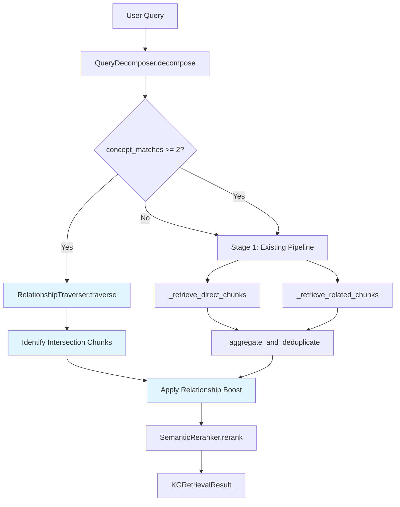

# Design Document: Relationship-Aware Retrieval

## Overview

This feature adds a relationship-traversal layer to the existing KG-guided retrieval pipeline in `KGRetrievalService`. When a user query contains multiple medical/scientific concepts (e.g., "fever, productive cough, and right lower lobe crackles"), the system currently matches each concept independently and retrieves all chunks linked via `EXTRACTED_FROM` edges. This ignores the rich inter-concept relationships already stored in Neo4j (e.g., `(pneumococcus)-[:CAUSES]->(pneumonia)-[:PRESENTS_WITH]->(fever)`), returning chunks that mention individual concepts in unrelated contexts.

The solution introduces a `RelationshipTraverser` component that:
1. Detects multi-concept queries (≥2 matched concepts) from the existing `QueryDecomposer` output
2. Finds bounded paths (1–2 hops) between concept pairs via clinically relevant relationships
3. Collects chunk IDs from concepts along those paths
4. Identifies intersection chunks (reachable from ≥2 query concepts)
5. Applies a configurable boost to intersection chunks' `kg_relevance_score`

The boost is applied **after** `_aggregate_and_deduplicate()` and **before** the `SemanticReranker.rerank()` call, slotting cleanly into the existing pipeline without modifying the semantic reranker, the fallback path, or the existing concept-coverage scoring.

## Architecture



The new components (blue) run in parallel with the existing Stage 1 pipeline. The `RelationshipTraverser` executes its Cypher query concurrently with `_retrieve_direct_chunks` and `_retrieve_related_chunks`. After aggregation, the boost step modifies `kg_relevance_score` on intersection chunks before handing off to the semantic reranker.

### Integration Point

Inside `_stage1_kg_retrieval()`, after `_aggregate_and_deduplicate()` returns the scored chunk list:

```python
# Existing: aggregate direct + related chunks
chunks = self._aggregate_and_deduplicate(direct_chunks, related_chunks, ...)

# NEW: Apply relationship boost if multi-concept query
if len(decomposition.concept_matches) >= 2:
    traversal_result = await self._relationship_traverser.traverse(
        decomposition.concept_matches
    )
    chunks = self._apply_relationship_boost(chunks, traversal_result)
```

The `retrieve()` method and `SemanticReranker` remain untouched.

## Components and Interfaces

### 1. RelationshipTraverser

**Location:** `src/multimodal_librarian/components/kg_retrieval/relationship_traverser.py`

**Responsibility:** Execute bounded Cypher queries to find paths between concept pairs and collect chunk IDs from path concepts.

```python
@dataclass
class TraversalResult:
    """Result of relationship traversal between concept pairs."""
    # chunk_id -> set of concept_ids that reach it via relationship paths
    chunk_concept_connections: Dict[str, Set[str]]
    # Number of paths found across all concept pairs
    total_paths_found: int
    # Duration of traversal in milliseconds
    traversal_duration_ms: int
    # Whether traversal completed (vs timed out)
    completed: bool

class RelationshipTraverser:
    """Traverses inter-concept relationships to find intersection chunks."""
    
    CLINICALLY_RELEVANT_RELATIONSHIPS: List[str] = [
        "CAUSES", "PRESENTS_WITH", "TREATED_BY", "TREATS",
        "IS_A", "PART_OF", "RELATED_TO", "SIMILAR_TO",
        "IsA", "PartOf", "RelatedTo", "Causes", "SimilarTo",
        "HasProperty", "UsedFor", "HasA", "HasPrerequisite",
        "Entails", "MadeOf",
    ]
    
    def __init__(
        self,
        neo4j_client: Optional[Any] = None,
        hop_limit: int = 2,
        timeout_seconds: float = 3.0,
        max_paths_per_pair: int = 50,
    ): ...
    
    async def traverse(
        self,
        concept_matches: List[Dict[str, Any]],
    ) -> TraversalResult:
        """
        Find paths between all pairs of matched concepts.
        
        Generates C(n,2) concept pairs from the matched concepts,
        executes a bounded Cypher query for each pair, and collects
        chunk IDs from concepts along the discovered paths.
        
        Returns TraversalResult with chunk-to-concept-set mapping.
        """
        ...
    
    def _build_pair_cypher(
        self,
        concept_id_a: str,
        concept_id_b: str,
    ) -> Tuple[str, Dict[str, Any]]:
        """
        Build a Cypher query finding paths between two concepts.
        
        Returns (cypher_string, parameters) tuple.
        The query:
        - Uses only CLINICALLY_RELEVANT_RELATIONSHIPS
        - Limits path length to hop_limit
        - Collects chunk IDs via EXTRACTED_FROM from all path nodes
        - Limits results to max_paths_per_pair
        """
        ...
```

**Cypher Query Pattern:**

```cypher
MATCH path = (a:Concept {concept_id: $concept_id_a})
      -[r:CAUSES|PRESENTS_WITH|TREATED_BY|TREATS|IS_A|PART_OF|...
        *1..2]-(b:Concept {concept_id: $concept_id_b})
WITH path, nodes(path) AS path_nodes
LIMIT $max_paths
UNWIND path_nodes AS n
OPTIONAL MATCH (n)-[:EXTRACTED_FROM]->(ch:Chunk)
RETURN DISTINCT ch.chunk_id AS chunk_id,
       n.concept_id AS via_concept_id,
       $concept_id_a AS source_concept_a,
       $concept_id_b AS source_concept_b
```

### 2. Boost Application (in KGRetrievalService)

**New private method:** `_apply_relationship_boost()`

```python
def _apply_relationship_boost(
    self,
    chunks: List[RetrievedChunk],
    traversal_result: TraversalResult,
    boost_factor: float = 1.5,
) -> List[RetrievedChunk]:
    """
    Apply relationship boost to intersection chunks.
    
    For each chunk reachable from >= 2 query concepts via relationship
    paths, multiply its kg_relevance_score by a scaled boost factor
    and cap at 1.0.
    
    Scaling: boost = boost_factor * (1 + 0.1 * (num_concepts - 2))
    - 2 concepts: boost_factor * 1.0
    - 3 concepts: boost_factor * 1.1
    - 4 concepts: boost_factor * 1.2
    """
    ...
```

### 3. Configuration (in Settings)

**New fields in `Settings` class:**

```python
# Relationship-aware retrieval settings
relationship_boost: float = Field(
    default=1.5,
    description="Boost multiplier for intersection chunks"
)
relationship_hop_limit: int = Field(
    default=2,
    description="Maximum hops between concept pairs"
)
relationship_traversal_timeout: float = Field(
    default=3.0,
    description="Timeout in seconds for relationship traversal queries"
)
relationship_max_paths_per_pair: int = Field(
    default=50,
    description="Maximum paths explored per concept pair"
)
```

## Data Models

### TraversalResult

```python
@dataclass
class TraversalResult:
    """Result of inter-concept relationship traversal."""
    # Maps chunk_id -> set of concept_ids that connect to it via paths
    chunk_concept_connections: Dict[str, Set[str]] = field(default_factory=dict)
    # Total relationship paths found
    total_paths_found: int = 0
    # Traversal duration in milliseconds
    traversal_duration_ms: int = 0
    # Whether traversal completed without timeout
    completed: bool = True
    
    @property
    def intersection_chunk_ids(self) -> Set[str]:
        """Chunk IDs reachable from >= 2 query concepts."""
        return {
            cid for cid, concepts in self.chunk_concept_connections.items()
            if len(concepts) >= 2
        }
    
    def concept_count_for_chunk(self, chunk_id: str) -> int:
        """Number of distinct query concepts connecting to a chunk."""
        return len(self.chunk_concept_connections.get(chunk_id, set()))
    
    @staticmethod
    def empty() -> 'TraversalResult':
        """Return an empty result (for fallback/timeout cases)."""
        return TraversalResult(completed=False)
```

### Extended KGRetrievalResult Metadata

The existing `metadata: Dict[str, Any]` field on `KGRetrievalResult` will include new keys when relationship-aware mode activates:

```python
metadata = {
    # Existing fields...
    "concepts_matched": 3,
    # New relationship-aware fields
    "relationship_aware_activated": True,
    "intersection_chunks_found": 5,
    "relationship_paths_traversed": 12,
    "relationship_traversal_duration_ms": 45,
}
```

### Extended RetrievedChunk Metadata

Intersection chunks will have boost info in their `metadata` dict:

```python
chunk.metadata["relationship_boost_applied"] = 1.5
chunk.metadata["connecting_concept_count"] = 3
```

## Correctness Properties

*A property is a characteristic or behavior that should hold true across all valid executions of a system — essentially, a formal statement about what the system should do. Properties serve as the bridge between human-readable specifications and machine-verifiable correctness guarantees.*

### Property 1: Multi-concept classification threshold

*For any* `QueryDecomposition` with N concept matches, the query is classified as a `Multi_Concept_Query` if and only if N >= 2. Equivalently, for N < 2, relationship traversal is never invoked.

**Validates: Requirements 1.1, 1.2**

### Property 2: Intersection chunk identification

*For any* mapping of concept_id → set of chunk_ids produced by relationship traversal, a chunk is identified as an intersection chunk if and only if it appears in the chunk sets of 2 or more distinct query concepts. The reported concept count for each chunk equals the number of distinct concepts whose traversal reached it.

**Validates: Requirements 3.1, 3.2, 3.3**

### Property 3: Boost scaling and score cap

*For any* intersection chunk with base `kg_relevance_score` in [0, 1] and any positive `relationship_boost` factor, the boosted score shall be monotonically non-decreasing with the number of connecting concepts, and the final `kg_relevance_score` shall never exceed 1.0.

**Validates: Requirements 4.1, 4.3, 4.4**

### Property 4: Boost identity at 1.0

*For any* set of chunks and any `TraversalResult`, applying a `relationship_boost` of 1.0 shall produce `kg_relevance_score` values identical to the unmodified scores — effectively a no-op.

**Validates: Requirements 4.5**

### Property 5: Traversal uses only clinically relevant relationships with hop limit

*For any* pair of concept IDs and any configured `hop_limit`, the Cypher query generated by `RelationshipTraverser._build_pair_cypher()` shall reference only relationship types in `CLINICALLY_RELEVANT_RELATIONSHIPS` and constrain path length to at most `hop_limit` hops.

**Validates: Requirements 2.1, 2.2, 2.5**

### Property 6: Traversal collects all path-concept chunk IDs

*For any* set of relationship paths returned by Neo4j, the `RelationshipTraverser` shall collect chunk IDs from every concept node along every path via `EXTRACTED_FROM` edges, with no chunk IDs omitted or duplicated in the final `chunk_concept_connections` mapping.

**Validates: Requirements 2.3**

### Property 7: Cypher queries are read-only

*For any* Cypher query string generated by `RelationshipTraverser`, the query shall not contain write operations (`CREATE`, `MERGE`, `DELETE`, `SET`, `REMOVE`, `DETACH`).

**Validates: Requirements 9.1, 9.2**

### Property 8: Result metadata completeness for multi-concept queries

*For any* query classified as a `Multi_Concept_Query`, the `KGRetrievalResult.metadata` shall contain the keys `relationship_aware_activated`, `intersection_chunks_found`, `relationship_paths_traversed`, and `relationship_traversal_duration_ms`.

**Validates: Requirements 1.4, 8.1**

### Property 9: Chunk metadata contains boost value

*For any* intersection chunk that receives a relationship boost, the chunk's `metadata` dict shall contain the key `relationship_boost_applied` with the boost value that was applied, and `connecting_concept_count` with the number of connecting concepts.

**Validates: Requirements 8.4**

### Property 10: Path limit enforcement

*For any* Cypher query generated by `RelationshipTraverser`, the query shall include a `LIMIT` clause with a value equal to the configured `max_paths_per_pair`.

**Validates: Requirements 6.3**

## Error Handling

| Scenario | Behavior | Log Level |
|---|---|---|
| Relationship traversal Cypher query times out | Cancel traversal, proceed with existing pipeline results (no boost applied) | WARNING |
| Neo4j connection error during traversal | Return empty `TraversalResult`, proceed with fallback | WARNING |
| Exception during traversal | Log error, return empty `TraversalResult`, proceed with fallback | WARNING |
| No relationship paths found between any concept pair | Return empty `TraversalResult`, no boost applied, pipeline continues normally | DEBUG |
| No intersection chunks found (all chunks from single concepts) | No boost applied, pipeline continues with existing scores | DEBUG |
| Boost would exceed 1.0 | Cap at 1.0 | N/A (by design) |

All error handling follows the existing pattern in `_retrieve_related_chunks()`: catch exceptions, log at WARNING, and fall back gracefully. The relationship traversal is purely additive — its failure never degrades the existing pipeline.

## Testing Strategy

### Property-Based Tests (Hypothesis)

Each correctness property maps to a property-based test with minimum 100 iterations. Tests use `hypothesis` (already in the project's `.hypothesis/` directory).

- **Test file:** `tests/components/test_relationship_traverser.py`
- **Library:** `hypothesis` with `@given` decorator
- **Iteration count:** `@settings(max_examples=100)`
- **Tag format:** `# Feature: relationship-aware-retrieval, Property N: <title>`

Properties 1–4 test pure functions (classification, intersection identification, boost math) and are ideal for PBT — they have clear input/output behavior, large input spaces, and are cheap to run.

Properties 5, 7, 10 test Cypher query generation (string output from inputs) — also pure functions suitable for PBT.

Property 6 tests traversal result processing with mock Neo4j responses.

Properties 8–9 test metadata inclusion and are best covered by example-based tests integrated with the property tests for Properties 2–3.

### Unit Tests

- **Test file:** `tests/components/test_relationship_traverser.py`
- Timeout handling (mock slow Neo4j, verify fallback)
- Configuration defaults and overrides
- Empty traversal results → no boost
- Single-concept query → traverser not invoked
- Logging verification (DEBUG paths, WARNING errors)
- Integration with `_stage1_kg_retrieval()` flow

### Integration Tests

- **Test file:** `tests/integration/test_relationship_aware_retrieval.py`
- End-to-end multi-concept query with mock Neo4j graph containing known paths
- Verify intersection chunks rank higher than single-concept chunks after reranking
- Verify single-concept queries produce identical results to baseline
