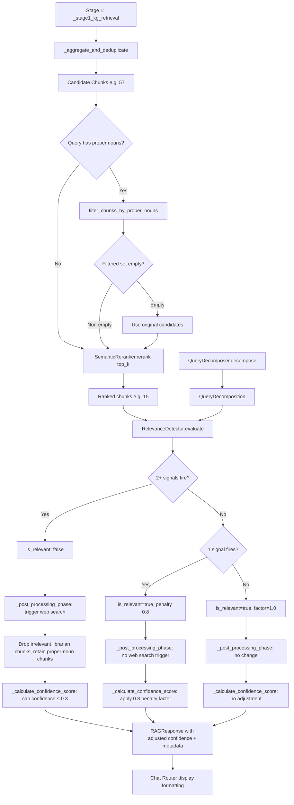

# Design Document: Retrieval Relevance Detection

## Overview

This feature adds a `RelevanceDetector` component to the KG retrieval pipeline that identifies "no relevant results" scenarios using two complementary signals:

1. **Score Distribution Analysis** — Detects when all top-N chunks have uniformly similar `final_score` values (low variance/spread), indicating nothing stands out as particularly relevant.
2. **Concept Specificity Analysis** — Detects when matched KG concepts are generic dictionary words rather than domain-specific terms, indicating the query is likely off-topic for the corpus.

When both signals agree the results are irrelevant, the system:
- Triggers a supplementary web search (even when the chunk count and scores look "fine" on the surface)
- Adjusts the confidence score downward
- Communicates uncertainty to the user

When only one signal fires, a partial penalty is applied. This addresses the current problem where generic queries like "how's the weather today" produce 100% confidence scores because generic words match generic concepts in Neo4j, and no web search is triggered because the inflated scores exceed the existing `relevance_confidence_threshold`.

The component is a pure in-memory statistical analyzer — no database calls, no network I/O, no ML models. It operates on data already retrieved by the pipeline (the list of `RetrievedChunk` objects and the `QueryDecomposition`), keeping latency under 5ms.

Additionally, the `RelevanceDetector` exposes a **proper-noun-based chunk filter** (`filter_chunks_by_proper_nouns`) that operates as a pre-reranking step inside `KGRetrievalService.retrieve()`. When a user query contains proper nouns (e.g. "Venezuela"), the KG may match concepts derived from conversations (e.g. `gpe_venezuela`) that link to hundreds of chunk IDs. After chunk resolution and deduplication, the candidate set is dominated by book chunks about generic related concepts (e.g. "president") that do not contain the proper noun. The `SemanticReranker`'s `top_k` cutoff then eliminates the few chunks that actually contain the proper noun because those chunks score lower on semantic similarity to the broader query. The proper-noun chunk filter runs *before* the reranker's `top_k` cutoff, keeping only chunks whose content contains at least one of the query's proper nouns. This ensures that conversation chunks (or any chunks) that genuinely contain the queried proper noun survive reranking and appear in the final citation list alongside supplementary web search results.

The filter is a no-op for queries without proper nouns (like "What is Chelsea?" where "Chelsea" is a domain concept, not a proper-noun gap scenario — spaCy NER determines this). It reuses the spaCy model already loaded by the `RelevanceDetector`, adding no new model loading overhead and no more than 2ms of latency.

### Design Rationale

The two-signal approach was chosen over a single threshold because:
- Score distribution alone can't distinguish "all results are equally good" from "all results are equally bad"
- Concept specificity alone can't detect cases where specific concepts matched but the chunks themselves are irrelevant
- Requiring both signals to agree for a full "irrelevant" verdict minimizes false positives

The proper-noun chunk filter is placed *before* the reranker rather than after because the reranker's `top_k` cutoff is the mechanism that eliminates proper-noun-containing chunks. By the time the post-processing phase runs, those chunks are already gone. Filtering before `top_k` ensures the reranker only sees chunks that are relevant to the query's named entities, so its `top_k` window is spent on genuinely relevant candidates.

## Architecture

The `RelevanceDetector` lives in `src/multimodal_librarian/components/kg_retrieval/relevance_detector.py` alongside the existing `SemanticReranker` and `QueryDecomposer`. It is invoked at three points in the retrieval pipeline:

1. **`KGRetrievalService.retrieve`** — Pre-reranking invocation. The `filter_chunks_by_proper_nouns` method filters candidate chunks between `_aggregate_and_deduplicate` and `SemanticReranker.rerank`, ensuring proper-noun-containing chunks survive the `top_k` cutoff.

2. **`RAGService._post_processing_phase`** — Post-retrieval invocation. The `evaluate` method produces a `RelevanceVerdict` before the web search decision. When the verdict is `is_relevant=False`, this triggers a supplementary web search. If web results are returned and the verdict is irrelevant, the librarian chunks are dropped (same as the existing `librarian_results_irrelevant` behavior). The selective drop logic also retains any proper-noun-containing chunks that survived reranking (Requirement 7.10).

3. **`RAGService._calculate_confidence_score`** — Late invocation, after the AI response is generated. Applies the confidence adjustment factor from the verdict to the computed confidence score.

The verdict is computed once in `_post_processing_phase` and cached on the `RAGService` instance (`self._last_relevance_verdict`) so that `_calculate_confidence_score` can reuse it without re-evaluating.



### Integration Point 0: Pre-Reranking Chunk Filter (KGRetrievalService)

The `RelevanceDetector.filter_chunks_by_proper_nouns` method is called inside `KGRetrievalService.retrieve()`, between the `_aggregate_and_deduplicate` step (which produces the full candidate set) and the `SemanticReranker.rerank` call (which applies the `top_k` cutoff).

The `KGRetrievalService` receives the `RelevanceDetector` instance via constructor injection. Since `KGRetrievalService` currently has no reference to the `RelevanceDetector`, a new optional `relevance_detector` parameter is added to its `__init__`. The DI provider that constructs `KGRetrievalService` passes the same `RelevanceDetector` instance that is also passed to `RAGService`.

```python
# In KGRetrievalService.retrieve(), after _aggregate_and_deduplicate
# and before SemanticReranker.rerank:

# Step 3.5: Pre-reranking proper-noun filter (Requirement 7)
chunks_for_reranking = stage1_chunks
if self._relevance_detector is not None:
    try:
        filtered = self._relevance_detector.filter_chunks_by_proper_nouns(
            stage1_chunks, query
        )
        if filtered is not None:
            chunks_for_reranking = filtered
    except Exception as e:
        logger.warning(f"Proper-noun chunk filter failed: {e}")
        # Fall back to unfiltered candidates

# Step 4: Stage 2 - Semantic re-ranking
ranked_chunks = await self._semantic_reranker.rerank(
    chunks_for_reranking, query, effective_top_k
)
```

The filter returns `None` when the query has no proper nouns (skip filtering) or when the filtered set is empty (fall back to unfiltered). This keeps the calling code simple: if the return is `None`, use the original candidates.

### Integration Point 1: Post-Processing Phase (Web Search Trigger)

The `RelevanceDetector` is called at the start of `_post_processing_phase`, before the existing web search decision logic. The verdict becomes a third trigger condition alongside the existing `librarian_results_thin` and `librarian_results_irrelevant`:

```python
# Existing triggers
librarian_results_thin = len(librarian_chunks) < self.web_search_result_count_threshold
librarian_results_irrelevant = best_librarian_score < self.relevance_confidence_threshold

# NEW: Relevance detection trigger
try:
    verdict = self.relevance_detector.evaluate(kg_chunks, query_decomposition)
    self._last_relevance_verdict = verdict
    relevance_detected_irrelevant = not verdict.is_relevant
except Exception as e:
    logger.warning(f"Relevance detection failed: {e}")
    self._last_relevance_verdict = None
    relevance_detected_irrelevant = False

if (
    (librarian_results_thin or librarian_results_irrelevant or relevance_detected_irrelevant)
    and self.searxng_client is not None
    and self.searxng_enabled
):
    # Trigger web search...
```

When `relevance_detected_irrelevant` is True and web results are returned, the existing logic to drop irrelevant librarian chunks applies. The drop condition is extended to also retain any proper-noun-containing chunks that survived reranking (Requirement 7.10):

```python
if web_chunks and (librarian_results_irrelevant or relevance_detected_irrelevant):
    # Retain chunks that contain proper nouns from the query
    # (these survived the pre-reranking filter and are genuinely relevant)
    if (verdict is not None
            and verdict.query_term_coverage.proper_nouns):
        proper_nouns_lower = [
            pn.lower()
            for pn in verdict.query_term_coverage.proper_nouns
        ]
        retained = [
            c for c in librarian_chunks
            if any(pn in (c.get("content", "") or "").lower()
                   for pn in proper_nouns_lower)
        ]
        librarian_chunks = retained  # may be empty
    else:
        librarian_chunks = []
```

This ensures that when the Relevance_Detector detects a proper-noun gap in the post-processing phase, any chunks that genuinely contain the queried proper noun (and survived the pre-reranking filter + reranker `top_k`) appear in the final response alongside web search results.

Note: `_post_processing_phase` currently receives only `query` and `librarian_chunks`. To pass the `QueryDecomposition` for the concept specificity analysis, the method signature is extended to accept an optional `query_decomposition` parameter. The caller (`_retrieval_phase` or `query`) passes it through from the decomposition step.

### Integration Point 2: Confidence Score Calculation

The `_calculate_confidence_score` method reuses the cached verdict from `_post_processing_phase` rather than re-evaluating:

```python
# Existing confidence computation...
confidence = <existing logic>

# NEW: Apply relevance detection adjustment
verdict = self._last_relevance_verdict
if verdict is not None:
    if not verdict.is_relevant:
        confidence = min(confidence, 0.3)
    else:
        confidence *= verdict.confidence_adjustment_factor

return max(0.1, min(1.0, confidence))
```

## Components and Interfaces

### RelevanceDetector

The main component that orchestrates both analysis signals and produces a verdict. Also exposes the pre-reranking proper-noun chunk filter.

```python
class RelevanceDetector:
    """Evaluates retrieval result quality using score distribution
    and concept specificity signals. Also provides a pre-reranking
    proper-noun chunk filter."""
    
    def __init__(
        self,
        spread_threshold: float = 0.05,
        variance_threshold: float = 0.001,
        specificity_threshold: float = 0.3,
        spacy_nlp: Optional[Any] = None,
    ):
        """Initialize with configurable thresholds.
        
        Args:
            spread_threshold: Minimum spread (max-min) of final_scores
                to consider results as having meaningful separation.
            variance_threshold: Minimum variance of final_scores
                to consider results as having meaningful separation.
            specificity_threshold: Minimum concept specificity score
                for a concept to be considered domain-specific.
            spacy_nlp: Pre-loaded spaCy Language model for NER.
                Injected via DI — no model loading happens here.
        """
        ...
    
    def evaluate(
        self,
        chunks: List[RetrievedChunk],
        query_decomposition: QueryDecomposition,
    ) -> RelevanceVerdict:
        """Produce a relevance verdict from chunks and query decomposition.
        
        Args:
            chunks: Ranked list of RetrievedChunk from SemanticReranker.
            query_decomposition: Decomposed query with concept_matches.
            
        Returns:
            RelevanceVerdict with is_relevant, confidence_adjustment_factor,
            and diagnostic metadata.
        """
        ...
    
    def filter_chunks_by_proper_nouns(
        self,
        chunks: List[RetrievedChunk],
        query: str,
    ) -> Optional[List[RetrievedChunk]]:
        """Pre-reranking filter: keep only chunks containing
        the query's proper nouns.
        
        Uses spaCy NER to extract named entities from the query,
        then filters chunks by case-insensitive substring match
        of each proper noun against chunk content.
        
        Args:
            chunks: Full set of candidate chunks from
                _aggregate_and_deduplicate (before reranking).
            query: Original user query text.
            
        Returns:
            Filtered list of chunks if proper nouns were found
            and the filtered set is non-empty. Returns None if:
            - spaCy model is not available
            - Query contains no proper nouns (NER extracts zero entities)
            - Filtered set is empty (all chunks lack proper nouns)
            
            Returning None signals the caller to use the original
            unfiltered candidate set.
        
        Requirements: 7.1, 7.2, 7.3, 7.4, 7.5, 7.6, 7.7, 7.9
        """
        ...
```

#### `filter_chunks_by_proper_nouns` Logic

```python
def filter_chunks_by_proper_nouns(
    self,
    chunks: List[RetrievedChunk],
    query: str,
) -> Optional[List[RetrievedChunk]]:
    if self.spacy_nlp is None or not query:
        return None  # No spaCy → skip filtering

    doc = self.spacy_nlp(query)
    proper_nouns = list({ent.text for ent in doc.ents})

    if not proper_nouns:
        return None  # No proper nouns → skip filtering (Req 7.4)

    proper_nouns_lower = [pn.lower() for pn in proper_nouns]
    before_count = len(chunks)

    filtered = [
        c for c in chunks
        if any(
            pn in (c.content or "").lower()
            for pn in proper_nouns_lower
        )
    ]

    after_count = len(filtered)
    retained_ids = [c.chunk_id for c in filtered]

    logger.info(
        "Proper-noun chunk filter: %d → %d chunks "
        "(proper_nouns=%s, retained_ids=%s)",
        before_count,
        after_count,
        proper_nouns,
        retained_ids,
    )

    if not filtered:
        return None  # Empty filtered set → fall back (Req 7.3)

    return filtered
```

Key design decisions:
- **Returns `None` instead of empty list** — This makes the calling code in `KGRetrievalService` simpler: `if filtered is not None: use filtered`. No need to check for empty lists separately.
- **Reuses `self.spacy_nlp`** — The same spaCy model instance used by `analyze_query_term_coverage` in the `evaluate` method. No new model loading (Requirement 7.7).
- **Case-insensitive substring match** — Uses `.lower()` on both the proper noun and chunk content. This handles variations like "venezuela" vs "Venezuela" (Requirement 7.1).
- **Logs before/after counts, proper nouns, and retained chunk IDs** — Full diagnostic logging per Requirement 7.6.

### ScoreDistributionAnalyzer

Pure function (or static method) that computes statistics on `final_score` values.

```python
def analyze_score_distribution(
    chunks: List[RetrievedChunk],
    spread_threshold: float,
    variance_threshold: float,
) -> ScoreDistributionResult:
    """Analyze the distribution of final_score values across chunks.
    
    Args:
        chunks: List of RetrievedChunk with final_score set.
        spread_threshold: Threshold below which spread indicates semantic floor.
        variance_threshold: Threshold below which variance indicates semantic floor.
        
    Returns:
        ScoreDistributionResult with variance, spread, is_semantic_floor,
        and chunk_count.
    """
    ...
```

Logic:
- If `len(chunks) < 3`: return indeterminate (is_semantic_floor=False, but flagged as indeterminate in metadata)
- Compute `scores = [c.final_score for c in chunks]`
- `spread = max(scores) - min(scores)`
- `variance = sum((s - mean)^2 for s in scores) / len(scores)`
- `is_semantic_floor = spread < spread_threshold OR variance < variance_threshold`

### ConceptSpecificityAnalyzer

Pure function that scores each matched concept for domain specificity.

```python
def analyze_concept_specificity(
    concept_matches: List[Dict[str, Any]],
    specificity_threshold: float,
) -> ConceptSpecificityResult:
    """Analyze the specificity of matched KG concepts.
    
    Args:
        concept_matches: List of concept match dicts from QueryDecomposition.
            Each dict has 'name', 'type', 'is_proper_noun_match', 'match_score',
            'word_coverage', etc.
        specificity_threshold: Score below which a concept is low-specificity.
        
    Returns:
        ConceptSpecificityResult with per_concept_scores, average_specificity,
        is_low_specificity, high_specificity_count, low_specificity_count.
    """
    ...
```

Specificity scoring heuristics for each concept:
- Start at 0.5 (neutral)
- **+0.3** if `is_proper_noun_match` is True
- **+0.2** if name contains underscore, hyphen, or is multi-word (len(name.split()) > 1)
- **+0.1** if name length ≥ 5 characters
- **-0.3** if name is a single common English word shorter than 5 characters and appears in a built-in generic words set
- **-0.1** if `word_coverage` < 0.5 (weak partial match)
- Clamp to [0.0, 1.0]

The generic words set is a hardcoded frozenset of ~50-100 common English words (e.g., "world", "today", "going", "make", "take", "good", "time", "work", "find", "give", "tell", "come", "want", "look", "use", "day", "way", "man", "new", "get", "has", "him", "how", "its", "may", "old", "see", "now", "just", "than", "them", "been", "have", "from", "this", "that", "with", "will", "each", "about", "many", "then", "some", "her", "like", "long", "very", "when", "what", "your", "said"). This avoids any external dependency or file I/O.

### Verdict Logic

```
both_fire = score_dist.is_semantic_floor AND concept_spec.is_low_specificity
one_fires = score_dist.is_semantic_floor XOR concept_spec.is_low_specificity

if both_fire:
    is_relevant = False
    confidence_adjustment_factor = 0.3  # Will be used to cap, not multiply
elif one_fires:
    is_relevant = True
    # Penalty proportional to how strongly the single signal fired
    confidence_adjustment_factor = 0.8  # Middle of 0.7-0.9 range
else:
    is_relevant = True
    confidence_adjustment_factor = 1.0
```

When `one_fires`, the penalty factor is fixed at 0.8 (center of the 0.7-0.9 range specified in Requirement 3.2). This keeps the logic simple and deterministic. Future iterations could make this proportional to the signal strength.

## Data Models

All models are defined in `src/multimodal_librarian/components/kg_retrieval/relevance_detector.py` as dataclasses, consistent with the existing `RetrievedChunk` and `QueryDecomposition` pattern.

### ScoreDistributionResult

```python
@dataclass
class ScoreDistributionResult:
    """Result of score distribution analysis."""
    variance: float
    spread: float
    is_semantic_floor: bool
    chunk_count: int
    is_indeterminate: bool = False  # True when < 3 chunks
```

### ConceptSpecificityResult

```python
@dataclass
class ConceptSpecificityResult:
    """Result of concept specificity analysis."""
    per_concept_scores: Dict[str, float]  # concept_name -> specificity_score
    average_specificity: float
    is_low_specificity: bool
    high_specificity_count: int
    low_specificity_count: int
```

### RelevanceVerdict

```python
@dataclass
class RelevanceVerdict:
    """Combined relevance detection verdict."""
    is_relevant: bool
    confidence_adjustment_factor: float  # 0.3 when irrelevant, 0.7-0.9 partial, 1.0 full
    score_distribution: ScoreDistributionResult
    concept_specificity: ConceptSpecificityResult
    reasoning: str  # Human-readable explanation of the verdict
```

### Configuration

New fields added to the `Settings` class in `config/config.py`:

```python
# Relevance detection thresholds
relevance_spread_threshold: float = Field(
    default=0.05,
    description="Minimum final_score spread to avoid semantic floor detection"
)
relevance_variance_threshold: float = Field(
    default=0.001,
    description="Minimum final_score variance to avoid semantic floor detection"
)
relevance_specificity_threshold: float = Field(
    default=0.3,
    description="Minimum concept specificity score to be considered domain-specific"
)
```

These are read by the DI provider when constructing the `RelevanceDetector` instance.

### KGRetrievalService Constructor Extension

The `KGRetrievalService.__init__` receives an optional `relevance_detector` parameter:

```python
def __init__(
    self,
    neo4j_client: Optional[Any] = None,
    vector_client: Optional[Any] = None,
    model_client: Optional[Any] = None,
    relevance_detector: Optional["RelevanceDetector"] = None,
    # ... existing params ...
):
    # ... existing init ...
    self._relevance_detector = relevance_detector
```

The DI provider that constructs `KGRetrievalService` passes the same `RelevanceDetector` instance that is also passed to `RAGService`. This follows the existing DI pattern — the `RelevanceDetector` is a stateless analyzer with no mutable state, so sharing a single instance is safe.


## Correctness Properties

*A property is a characteristic or behavior that should hold true across all valid executions of a system — essentially, a formal statement about what the system should do. Properties serve as the bridge between human-readable specifications and machine-verifiable correctness guarantees.*

The following properties were derived from the acceptance criteria through prework analysis. Criteria about UI formatting (5.1–5.3), configuration wiring (6.1–6.3), logging (6.4, 7.6), performance (4.5, 7.9), architectural constraints (7.5, 7.7), integration plumbing (4.1, 4.3, 4.4, 7.2, 7.8), and API shape (3.5) are tested via unit/example tests rather than property-based tests.

After reflection, several related criteria were consolidated:
- Criteria 1.1, 1.2, 1.3 → Property 1 (semantic floor classification)
- Criteria 1.5 structural checks folded into Property 1
- Criteria 2.1, 2.3, 2.4 → Property 2 (concept specificity scoring and classification)
- Criteria 2.6 structural checks folded into Property 2
- Criteria 3.1, 3.2, 3.3, 3.4 → Property 3 (verdict logic)
- Criteria 4.5 → Property 4 (confidence cap)
- Criteria 7.1 → Property 5 (proper-noun chunk filter correctness)
- Criteria 7.3, 7.4 → Property 6 (filter no-op conditions, combined because both test "returns None")
- Criteria 7.10 → Property 7 (selective drop retains proper-noun chunks)

### Property 1: Semantic floor classification correctness

*For any* list of 3 or more `RetrievedChunk` objects with `final_score` values in [0, 1], and any positive `spread_threshold` and `variance_threshold`, the `ScoreDistributionAnalyzer` SHALL return `is_semantic_floor = True` if and only if the spread (max - min) of the scores is below `spread_threshold` OR the population variance of the scores is below `variance_threshold`. The result SHALL also contain the correct computed `variance`, `spread`, and `chunk_count` values.

**Validates: Requirements 1.1, 1.2, 1.3, 1.5**

### Property 2: Concept specificity scoring and classification

*For any* list of concept match dictionaries (each with `name`, `type`, `is_proper_noun_match`, `word_coverage` fields) and any `specificity_threshold` in (0, 1), the `ConceptSpecificityAnalyzer` SHALL:
- Assign each concept a score in [0.0, 1.0]
- Score concepts with `is_proper_noun_match=True` or multi-word names above 0.7
- Return `is_low_specificity = True` if and only if ALL per-concept scores are below `specificity_threshold`
- Return correct `high_specificity_count` and `low_specificity_count` that sum to the total number of concepts

**Validates: Requirements 2.1, 2.3, 2.4, 2.6**

### Property 3: Verdict logic correctness

*For any* `ScoreDistributionResult` and `ConceptSpecificityResult`, the `RelevanceDetector` verdict SHALL satisfy:
- If `is_semantic_floor=True` AND `is_low_specificity=True`: `is_relevant=False`
- If exactly one of `is_semantic_floor` or `is_low_specificity` is True: `is_relevant=True` AND `confidence_adjustment_factor` in [0.7, 0.9]
- If neither is True: `is_relevant=True` AND `confidence_adjustment_factor=1.0`
- The verdict SHALL always contain non-None `score_distribution`, `concept_specificity`, and a non-empty `reasoning` string

**Validates: Requirements 3.1, 3.2, 3.3, 3.4**

### Property 4: Confidence cap when irrelevant

*For any* base confidence score in [0.1, 1.0] and a `RelevanceVerdict` with `is_relevant=False`, applying the relevance adjustment SHALL produce a final confidence score no higher than 0.3.

**Validates: Requirements 4.5**

### Property 5: Proper-noun chunk filter correctness

*For any* list of `RetrievedChunk` objects with non-empty `content` fields and any query string containing one or more proper nouns (as identified by spaCy NER), `filter_chunks_by_proper_nouns` SHALL return exactly those chunks whose content contains at least one of the query's proper nouns as a case-insensitive substring. The returned list SHALL be a subset of the input list, and every chunk in the returned list SHALL contain at least one proper noun from the query in its content.

**Validates: Requirements 7.1**

### Property 6: Proper-noun filter no-op conditions

*For any* list of `RetrievedChunk` objects and any query string, `filter_chunks_by_proper_nouns` SHALL return `None` if the query contains no proper nouns (spaCy NER extracts zero named entities) OR if no chunks in the input list contain any of the query's proper nouns. When the filter returns `None`, the caller uses the original unfiltered candidate set.

**Validates: Requirements 7.3, 7.4**

### Property 7: Selective drop retains proper-noun chunks

*For any* list of librarian chunks (dicts with a `content` field) and any non-empty list of proper nouns, the selective drop logic SHALL retain exactly those chunks whose content contains at least one of the proper nouns as a case-insensitive substring, and SHALL discard all other chunks.

**Validates: Requirements 7.10**

## Error Handling

### RelevanceDetector Exceptions

The `RelevanceDetector.evaluate` method performs only in-memory arithmetic. The main failure modes are:

1. **Invalid input data** — A `RetrievedChunk` with `final_score` outside [0, 1] or `None`. The analyzer clamps scores to [0, 1] defensively rather than raising.

2. **Empty chunks list** — Treated the same as < 3 chunks: `ScoreDistributionResult` returns indeterminate, and the verdict defaults to `is_relevant=True, factor=1.0` (no penalty when we can't determine).

3. **Malformed concept_matches** — Missing keys in concept match dicts. The specificity analyzer uses `.get()` with defaults for all fields, so missing keys produce neutral scores (0.5) rather than exceptions.

### Proper-Noun Chunk Filter Error Handling

The `filter_chunks_by_proper_nouns` method performs in-memory string matching. Failure modes:

1. **spaCy model unavailable** — `self.spacy_nlp is None`. Returns `None` (skip filtering). No exception raised.

2. **spaCy NER failure** — The spaCy `nlp(query)` call raises an exception. This is caught by the try/except in `KGRetrievalService.retrieve()` (Requirement 7.8), which falls back to unfiltered candidates.

3. **Chunk with None content** — The filter uses `(c.content or "").lower()`, so `None` content is treated as empty string and the chunk is excluded from the filtered set (it doesn't contain any proper noun).

4. **Empty chunks list** — Returns `None` (no chunks to filter → empty filtered set → fall back).

### KGRetrievalService Integration Error Handling

The `filter_chunks_by_proper_nouns` call is wrapped in try/except in `KGRetrievalService.retrieve()` (Requirement 7.8):

```python
# In KGRetrievalService.retrieve()
chunks_for_reranking = stage1_chunks
if self._relevance_detector is not None:
    try:
        filtered = self._relevance_detector.filter_chunks_by_proper_nouns(
            stage1_chunks, query
        )
        if filtered is not None:
            chunks_for_reranking = filtered
    except Exception as e:
        logger.warning(f"Proper-noun chunk filter failed: {e}")
        # Fall back to unfiltered candidates
```

When `self._relevance_detector is None` (detector not injected), the filter is skipped entirely — the original candidates pass through to the reranker unchanged.

### RAG Service Integration Error Handling

The `RelevanceDetector` is wrapped in try/except at both integration points:

**In `_post_processing_phase`** (Requirement 4.4): If the detector fails, `relevance_detected_irrelevant` defaults to `False` and the existing web search triggers operate unchanged. The cached verdict is set to `None`.

**In `_calculate_confidence_score`**: If the cached verdict is `None` (detector failed or was not invoked), no adjustment is applied and the original confidence score is returned.

```python
# _post_processing_phase
try:
    verdict = self.relevance_detector.evaluate(kg_chunks, query_decomposition)
    self._last_relevance_verdict = verdict
    relevance_detected_irrelevant = not verdict.is_relevant
except Exception as e:
    logger.warning(f"Relevance detection failed, using original logic: {e}")
    self._last_relevance_verdict = None
    relevance_detected_irrelevant = False

# _calculate_confidence_score
verdict = self._last_relevance_verdict
if verdict is not None:
    if not verdict.is_relevant:
        confidence = min(confidence, 0.3)
    else:
        confidence *= verdict.confidence_adjustment_factor
```

This ensures the existing pipeline behavior is preserved if the detector fails for any reason.

The `RelevanceDetector` instance is passed to both `RAGService` and `KGRetrievalService` via constructor injection, following the existing DI pattern. A `get_relevance_detector` dependency provider is added to `services.py`. The same instance is shared between both services since the `RelevanceDetector` is a stateless analyzer.

### Chat Router Error Handling

The chat router checks for the presence of `relevance_detection` metadata before modifying display formatting. If the key is missing (detector was disabled or failed), the existing display format is used unchanged.

## Testing Strategy

### Property-Based Testing

Property-based tests use **Hypothesis** (the standard PBT library for Python). Each property test runs a minimum of 100 iterations.

Each property from the Correctness Properties section maps to exactly one property-based test:

| Property | Test | Description |
|----------|------|-------------|
| Property 1 | `test_semantic_floor_classification` | Generate random score lists (≥3 items, values in [0,1]) and random thresholds; verify is_semantic_floor matches spread/variance conditions |
| Property 2 | `test_concept_specificity_scoring` | Generate random concept match dicts with varied names, proper noun flags, word coverage; verify score bounds, classification, and counts |
| Property 3 | `test_verdict_logic` | Generate random ScoreDistributionResult and ConceptSpecificityResult; verify verdict fields match the three-case logic |
| Property 4 | `test_confidence_cap` | Generate random base confidence in [0.1, 1.0] and apply irrelevant verdict; verify result ≤ 0.3 |
| Property 5 | `test_proper_noun_filter_correctness` | Generate random chunks with known content and queries with known proper nouns; verify returned chunks are exactly those containing at least one proper noun (case-insensitive) |
| Property 6 | `test_proper_noun_filter_noop` | Generate random chunks and queries with no proper nouns (or where no chunks match); verify filter returns None |
| Property 7 | `test_selective_drop_retains_proper_noun_chunks` | Generate random librarian chunk dicts and proper noun lists; verify retained chunks are exactly those containing at least one proper noun |

Each test is tagged with a comment:
```python
# Feature: retrieval-relevance-detection, Property 1: Semantic floor classification correctness
```

### Unit Tests

Unit tests cover specific examples, edge cases, and integration points:

- **Edge cases from prework** (Req 1.4): Score distribution with 0, 1, 2 chunks returns indeterminate
- **Edge cases from prework** (Req 2.2): Known generic words ("world", "go", "day") score below 0.3
- **Edge cases from prework** (Req 2.5): Empty concept_matches → is_low_specificity=True
- **Integration** (Req 4.1): RAGService calls RelevanceDetector and applies factor
- **Integration** (Req 4.3): RAGResponse metadata contains "relevance_detection" key
- **Error handling** (Req 4.4): RelevanceDetector exception → original confidence preserved
- **Display** (Req 5.1): Chat router shows "low confidence" label when is_relevant=False
- **Display** (Req 5.2): Chat router appends disclaimer when confidence < 0.3
- **Display** (Req 5.3): Chat router uses existing format when is_relevant=True
- **Config** (Req 6.1, 6.2, 6.3): Default thresholds are correct; env var overrides work
- **Integration** (Req 7.2): KGRetrievalService passes filtered set to reranker when filter returns non-None
- **Integration** (Req 7.5): Filter is called after _aggregate_and_deduplicate and before rerank (verified via mock call order)
- **Logging** (Req 7.6): Filter logs before/after counts, proper nouns, and retained chunk IDs
- **Error handling** (Req 7.8): filter_chunks_by_proper_nouns exception → KGRetrievalService falls back to unfiltered candidates
- **Integration** (Req 7.10): RAGService selective drop retains proper-noun chunks alongside web results

### Test File Location

```
tests/components/test_relevance_detector.py       # Property + unit tests for the component
tests/integration/test_relevance_detection_rag.py  # Integration tests with RAGService
tests/integration/test_proper_noun_filter_kg.py    # Integration tests for filter in KGRetrievalService
```

### Hypothesis Configuration

```python
from hypothesis import given, settings, strategies as st

@settings(max_examples=200)
@given(
    scores=st.lists(st.floats(min_value=0.0, max_value=1.0), min_size=3, max_size=20),
    spread_threshold=st.floats(min_value=0.001, max_value=0.5),
    variance_threshold=st.floats(min_value=0.0001, max_value=0.1),
)
def test_semantic_floor_classification(scores, spread_threshold, variance_threshold):
    # Feature: retrieval-relevance-detection, Property 1: Semantic floor classification correctness
    ...
```

For the proper-noun filter property tests, Hypothesis generates random chunk content and proper noun lists. Since spaCy NER is an external dependency, the tests mock `self.spacy_nlp` to return controlled entity lists, isolating the filter's substring-matching logic:

```python
@settings(max_examples=200)
@given(
    proper_nouns=st.lists(st.text(min_size=2, max_size=20), min_size=1, max_size=5),
    chunk_contents=st.lists(st.text(min_size=0, max_size=200), min_size=1, max_size=30),
)
def test_proper_noun_filter_correctness(proper_nouns, chunk_contents):
    # Feature: retrieval-relevance-detection, Property 5: Proper-noun chunk filter correctness
    ...
```
