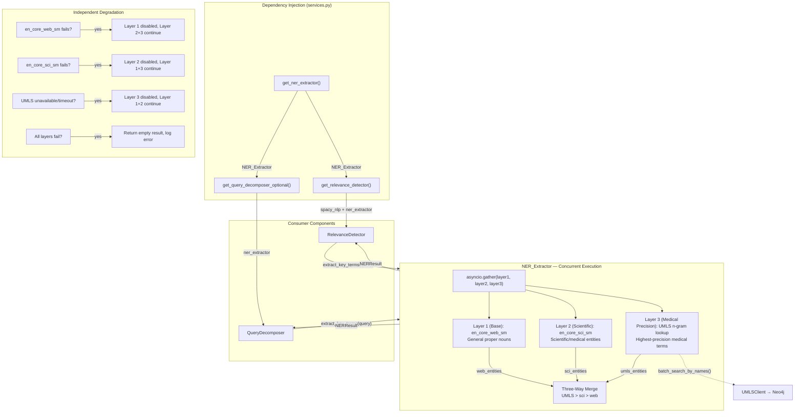

# Design Document: Three-Layer Concurrent Scientific/Medical NER for Query Term Extraction

## Overview

This design introduces a three-layer concurrent Named Entity Recognition (NER) extraction system that replaces the current fragmented entity extraction with a unified, domain-aware pipeline. The system is encapsulated in a new `NER_Extractor` class at `src/multimodal_librarian/components/kg_retrieval/ner_extractor.py`, injected via the existing DI framework into both `RelevanceDetector` and `QueryDecomposer`.

**Layer 1 (Base)** uses spaCy's general-purpose `en_core_web_sm` model to extract general proper nouns — people, places, organizations, and dates.

**Layer 2 (Scientific)** uses scispaCy's `en_core_sci_sm` model, trained on biomedical corpora, to recognize multi-word scientific/medical entities (e.g., "hepatitis B", "surface antigen", "healthcare worker").

**Layer 3 (Medical Precision)** adds a UMLS-enhanced n-gram lookup step. It generates candidate n-grams (up to 5 tokens) from the original query text, batch-queries the existing 1.6M UMLSConcept nodes in Neo4j via `UMLSClient.batch_search_by_names()`, and returns the highest-precision medical terms (e.g., "hepatitis B surface antigen"). A 200ms timeout ensures the UMLS lookup never blocks query processing.

All three layers run **concurrently** via `asyncio.gather` for performance — total extraction latency is bounded by the slowest layer, not the sum. Results are merged with a **priority hierarchy**: UMLS (Layer 3) > en_core_sci_sm (Layer 2) > en_core_web_sm (Layer 1). UMLS terms override shorter sci terms when they fully contain them; sci terms override shorter web terms when they fully contain them; non-overlapping terms from all three layers are preserved.

Each layer degrades **independently**: if the sci model fails, web + UMLS still work; if UMLS is unavailable, web + sci still work; if the web model fails, sci + UMLS still work.

### Design Decisions

1. **scispaCy `en_core_sci_sm` over `en_core_sci_lg`**: The small model (~100MB) provides adequate biomedical NER while keeping the Docker image lightweight. The large model (~800MB) would add significant build time and memory for marginal accuracy gains on our query-length inputs.

2. **Both `en_core_web_sm` AND `en_core_sci_sm`**: Rather than replacing web_sm with sci_sm, we run both concurrently. The web model excels at general proper nouns (people, places, organizations) that the sci model may miss, while the sci model excels at multi-word scientific terms that the web model fragments. Running both and merging gives the best of both worlds.

3. **N-gram generation over scispaCy entity linker**: scispaCy's built-in UMLS entity linker (`scispacy.linking`) downloads a ~3GB knowledge base and runs expensive approximate nearest-neighbor lookups. Our approach reuses the existing 1.6M UMLS concepts already indexed in Neo4j, avoiding duplicate data and leveraging the existing `UMLSClient` cache.

4. **Batch lookup over per-entity lookup**: `UMLSClient.batch_search_by_names()` uses `UNWIND` to query all n-grams in a single Neo4j transaction, which is significantly faster than individual `search_by_name()` calls for typical queries with 10-30 candidate n-grams.

5. **200ms timeout**: Based on observed `UMLSClient` latencies (p50 ~15ms, p99 ~80ms for batch queries), 200ms provides a generous safety margin while preventing degraded Neo4j performance from blocking the query pipeline.

6. **Concurrent execution via asyncio.gather**: All three layers run in parallel. Layer 1 and Layer 2 are CPU-bound spaCy calls wrapped in the event loop, while Layer 3 is an async Neo4j query. This ensures total latency ≈ max(layer1, layer2, layer3) rather than sum.

7. **NER_Extractor as a standalone class (not a spaCy component)**: Keeping the extractor as a plain Python class with DI-injected dependencies makes it testable without loading spaCy models and follows the project's existing component patterns.

## Architecture



### Data Flow

1. **Initialization**: `get_ner_extractor()` loads both `en_core_web_sm` and `en_core_sci_sm` (each independently, with fallback to None), accepts an optional `UMLSClient`, and caches the singleton.
2. **Injection**: `get_relevance_detector()` and `get_query_decomposer_optional()` receive the `NER_Extractor` instance and use it for entity extraction.
3. **Extraction**: When `extract_key_terms(query)` is called:
   - All three layers run **concurrently** via `asyncio.gather`:
     - Layer 1 runs `en_core_web_sm` on the query, extracts general proper nouns and named entities.
     - Layer 2 runs `en_core_sci_sm` on the query, extracts scientific/medical multi-word entities.
     - Layer 3 generates n-grams from the query, batch-queries UMLS, and returns matched medical terms.
   - The three-way merge step applies the priority hierarchy: UMLS terms override shorter sci terms; sci terms override shorter web terms; non-overlapping terms from all layers are preserved.
4. **Result**: An `NERResult` dataclass is returned containing `web_entities`, `sci_entities`, `umls_entities`, and the merged `key_terms` set.

## Components and Interfaces

### NER_Extractor Class

```python
# src/multimodal_librarian/components/kg_retrieval/ner_extractor.py

from dataclasses import dataclass, field, asdict
from typing import List, Set, Optional, Any
import logging
import time
import asyncio
import re

logger = logging.getLogger(__name__)


@dataclass
class NERResult:
    """Structured result from three-layer concurrent NER extraction."""
    web_entities: List[str] = field(default_factory=list)    # Layer 1: en_core_web_sm
    sci_entities: List[str] = field(default_factory=list)    # Layer 2: en_core_sci_sm
    umls_entities: List[str] = field(default_factory=list)   # Layer 3: UMLS lookup
    key_terms: Set[str] = field(default_factory=set)         # Merged result

    def to_dict(self) -> dict:
        """Serialize to dict for round-trip testing."""
        return {
            "web_entities": sorted(self.web_entities),
            "sci_entities": sorted(self.sci_entities),
            "umls_entities": sorted(self.umls_entities),
            "key_terms": sorted(self.key_terms),
        }

    @classmethod
    def from_dict(cls, data: dict) -> "NERResult":
        """Deserialize from dict."""
        return cls(
            web_entities=data.get("web_entities", []),
            sci_entities=data.get("sci_entities", []),
            umls_entities=data.get("umls_entities", []),
            key_terms=set(data.get("key_terms", [])),
        )


class NER_Extractor:
    """Three-layer concurrent NER extraction for scientific/medical queries.

    Layer 1 (Base): en_core_web_sm — general proper nouns
    Layer 2 (Scientific): en_core_sci_sm — scientific/medical entities
    Layer 3 (Medical Precision): UMLS n-gram lookup via UMLSClient

    All three layers run concurrently via asyncio.gather.
    Merge hierarchy (override priority): UMLS > sci > web.
    Each layer degrades independently.

    Parameters:
        spacy_web_nlp: Pre-loaded en_core_web_sm model (or None).
        spacy_sci_nlp: Pre-loaded en_core_sci_sm model (or None).
        umls_client: Optional UMLSClient for Layer 3 refinement.
        umls_timeout_ms: Timeout for UMLS lookup in milliseconds.
        max_ngram_size: Maximum n-gram token count for UMLS candidates.
    """

    # Labels to filter out from spaCy entities
    FILTERED_LABELS = frozenset({
        "CARDINAL", "ORDINAL", "QUANTITY",
        "DATE", "TIME", "PERCENT", "MONEY",
    })

    _AGE_PATTERN = re.compile(r"^\d+-year-old$", re.IGNORECASE)
    _NUMERIC_PATTERN = re.compile(r"^\d+[\d\s.,%/:-]*$")

    def __init__(
        self,
        spacy_web_nlp: Optional[Any] = None,
        spacy_sci_nlp: Optional[Any] = None,
        umls_client: Optional[Any] = None,
        umls_timeout_ms: int = 200,
        max_ngram_size: int = 5,
    ) -> None:
        self.spacy_web_nlp = spacy_web_nlp
        self.spacy_sci_nlp = spacy_sci_nlp
        self.umls_client = umls_client
        self.umls_timeout_ms = umls_timeout_ms
        self.max_ngram_size = max_ngram_size

        logger.info(
            "NER_Extractor initialized — web_model=%s, sci_model=%s, "
            "umls=%s, timeout=%dms, max_ngram=%d",
            type(spacy_web_nlp).__name__ if spacy_web_nlp else "None",
            type(spacy_sci_nlp).__name__ if spacy_sci_nlp else "None",
            "available" if umls_client else "None",
            umls_timeout_ms,
            max_ngram_size,
        )

    async def extract_key_terms(self, query: str) -> NERResult:
        """Extract named entities and key terms from a query.

        Runs all three layers concurrently via asyncio.gather,
        then merges results with priority hierarchy:
        UMLS > en_core_sci_sm > en_core_web_sm.
        """
        if not query or not query.strip():
            return NERResult()

        # Run all three layers concurrently
        web_entities, sci_entities, umls_entities = await asyncio.gather(
            self._extract_layer1_web(query),
            self._extract_layer2_sci(query),
            self._extract_layer3_umls(query),
        )

        # Three-way merge with priority hierarchy
        key_terms = self._merge_entities(
            web_entities, sci_entities, umls_entities
        )

        return NERResult(
            web_entities=web_entities,
            sci_entities=sci_entities,
            umls_entities=umls_entities,
            key_terms=key_terms,
        )

    async def _extract_layer1_web(self, query: str) -> List[str]:
        """Layer 1 (Base): Extract entities using en_core_web_sm."""
        if self.spacy_web_nlp is None:
            return []
        try:
            return self._run_spacy_extraction(self.spacy_web_nlp, query)
        except Exception as e:
            logger.warning(
                "Layer 1 (en_core_web_sm) failed: %s, "
                "continuing with Layer 2+3",
                e,
            )
            return []

    async def _extract_layer2_sci(self, query: str) -> List[str]:
        """Layer 2 (Scientific): Extract entities using en_core_sci_sm."""
        if self.spacy_sci_nlp is None:
            return []
        try:
            return self._run_spacy_extraction(self.spacy_sci_nlp, query)
        except Exception as e:
            logger.warning(
                "Layer 2 (en_core_sci_sm) failed: %s, "
                "continuing with Layer 1+3",
                e,
            )
            return []

    def _run_spacy_extraction(
        self, nlp: Any, query: str
    ) -> List[str]:
        """Shared spaCy extraction logic for Layer 1 and Layer 2."""
        doc = nlp(query)
        terms: set = set()

        # Named entities (filtered)
        for ent in doc.ents:
            text = ent.text.strip()
            if (
                not self._AGE_PATTERN.match(text)
                and not self._NUMERIC_PATTERN.match(text)
                and ent.label_ not in self.FILTERED_LABELS
            ):
                terms.add(ent.text)

        # PROPN tokens and capitalized NOUNs from noun chunks
        for nc in doc.noun_chunks:
            for tok in nc:
                if tok.pos_ == "PROPN" and len(tok.text) > 2:
                    terms.add(tok.text)
                elif (
                    tok.pos_ == "NOUN"
                    and tok.text[0:1].isupper()
                    and len(tok.text) > 2
                ):
                    terms.add(tok.text)

        return sorted(terms)

    async def _extract_layer3_umls(self, query: str) -> List[str]:
        """Layer 3 (Medical Precision): UMLS n-gram lookup with timeout."""
        if self.umls_client is None:
            return []

        # Generate candidate n-grams
        candidates = self._generate_ngrams(query)
        if not candidates:
            return []

        start = time.monotonic()
        try:
            result = await asyncio.wait_for(
                self.umls_client.batch_search_by_names(candidates),
                timeout=self.umls_timeout_ms / 1000.0,
            )
        except asyncio.TimeoutError:
            elapsed = (time.monotonic() - start) * 1000
            logger.warning(
                "Layer 3 UMLS lookup timed out after %.1fms "
                "(limit=%dms), continuing with Layer 1+2 only",
                elapsed,
                self.umls_timeout_ms,
            )
            return []
        except Exception as e:
            logger.warning(
                "Layer 3 UMLS lookup failed: %s, "
                "continuing with Layer 1+2 only",
                e,
            )
            return []

        if not result:
            return []

        # Return matched UMLS terms (original casing from candidates)
        matched = [name for name in candidates if name in result]
        elapsed = (time.monotonic() - start) * 1000
        logger.debug(
            "Layer 3 UMLS: %d candidates → %d matches in %.1fms",
            len(candidates),
            len(matched),
            elapsed,
        )
        return matched

    def _generate_ngrams(self, query: str) -> List[str]:
        """Generate candidate n-grams (2 to max_ngram_size tokens)."""
        words = query.split()
        candidates: list = []
        for n in range(2, min(self.max_ngram_size + 1, len(words) + 1)):
            for i in range(len(words) - n + 1):
                gram = " ".join(words[i : i + n])
                # Strip trailing punctuation from the n-gram
                gram = gram.strip("?.,!\"';:()[]{}").strip()
                if gram:
                    candidates.append(gram)
        return candidates

    def _merge_entities(
        self,
        web_entities: List[str],
        sci_entities: List[str],
        umls_overrides: List[str],
    ) -> Set[str]:
        """Three-way merge with priority hierarchy.

        Override priority: UMLS > sci > web.
        - UMLS terms override shorter sci terms when they fully contain them.
        - Sci terms override shorter web terms when they fully contain them.
        - Non-overlapping terms from all three layers are preserved.
        - Longest match wins when multiple terms overlap.
        """
        merged: set = set()
        subsumed_sci: set = set()
        subsumed_web: set = set()

        # Step 1: UMLS overrides subsume shorter sci entities
        sorted_umls = sorted(umls_overrides, key=len, reverse=True)
        for umls_term in sorted_umls:
            umls_lower = umls_term.lower()
            for sci_ent in sci_entities:
                if (
                    sci_ent.lower() in umls_lower
                    and len(umls_term) > len(sci_ent)
                ):
                    subsumed_sci.add(sci_ent)
            merged.add(umls_term)

        # Step 2: Remaining sci entities subsume shorter web entities
        remaining_sci = [e for e in sci_entities if e not in subsumed_sci]
        sorted_sci = sorted(remaining_sci, key=len, reverse=True)
        for sci_term in sorted_sci:
            sci_lower = sci_term.lower()
            for web_ent in web_entities:
                if (
                    web_ent.lower() in sci_lower
                    and len(sci_term) > len(web_ent)
                ):
                    subsumed_web.add(web_ent)
            merged.add(sci_term)

        # Step 3: Also check if UMLS terms subsume web entities directly
        for umls_term in sorted_umls:
            umls_lower = umls_term.lower()
            for web_ent in web_entities:
                if (
                    web_ent.lower() in umls_lower
                    and len(umls_term) > len(web_ent)
                ):
                    subsumed_web.add(web_ent)

        # Step 4: Add non-subsumed web entities
        for web_ent in web_entities:
            if web_ent not in subsumed_web:
                merged.add(web_ent)

        return merged
```

### DI Provider Functions

```python
# Added to src/multimodal_librarian/api/dependencies/services.py

_ner_extractor: Optional["NER_Extractor"] = None

async def get_ner_extractor(
    umls_client: Optional[Any] = Depends(get_umls_client_optional),
) -> Optional["NER_Extractor"]:
    """
    FastAPI dependency for NER_Extractor.

    Lazily creates and caches the NER_Extractor with:
    - en_core_web_sm for Layer 1 (Base)
    - en_core_sci_sm for Layer 2 (Scientific)
    - Optional UMLSClient for Layer 3 (Medical Precision)

    Each model loads independently — failure of one does not
    prevent the others from loading.

    Returns NER_Extractor instance (may have None for failed models).
    """
    global _ner_extractor

    if _ner_extractor is not None:
        return _ner_extractor

    from ...components.kg_retrieval.ner_extractor import NER_Extractor

    # Load en_core_web_sm (Layer 1)
    spacy_web_nlp = None
    try:
        import spacy
        spacy_web_nlp = spacy.load("en_core_web_sm")
        logger.info("Layer 1: en_core_web_sm loaded for NER_Extractor")
    except Exception as web_err:
        logger.warning(
            "Layer 1: en_core_web_sm unavailable (%s), "
            "Layer 1 disabled",
            web_err,
        )

    # Load en_core_sci_sm (Layer 2) — independent of Layer 1
    spacy_sci_nlp = None
    try:
        import spacy
        spacy_sci_nlp = spacy.load("en_core_sci_sm")
        logger.info("Layer 2: en_core_sci_sm loaded for NER_Extractor")
    except Exception as sci_err:
        logger.warning(
            "Layer 2: en_core_sci_sm unavailable (%s), "
            "Layer 2 disabled",
            sci_err,
        )

    if spacy_web_nlp is None and spacy_sci_nlp is None:
        logger.error(
            "Both en_core_web_sm and en_core_sci_sm failed to load. "
            "Only UMLS Layer 3 available (if configured)."
        )

    _ner_extractor = NER_Extractor(
        spacy_web_nlp=spacy_web_nlp,
        spacy_sci_nlp=spacy_sci_nlp,
        umls_client=umls_client,
    )
    return _ner_extractor
```

### Modified `get_relevance_detector()`

The existing `get_relevance_detector()` is updated to receive the `NER_Extractor` and pass its spaCy model to `RelevanceDetector`, while also storing the extractor reference for `filter_chunks_by_proper_nouns` to use:

```python
async def get_relevance_detector(
    ner_extractor: Optional["NER_Extractor"] = Depends(get_ner_extractor),
) -> "RelevanceDetector":
    # ... existing code ...
    # Use NER_Extractor's web model for backward compatibility
    spacy_nlp = ner_extractor.spacy_web_nlp if ner_extractor else None
    
    _relevance_detector = RelevanceDetector(
        # ... existing params ...
        spacy_nlp=spacy_nlp,
        ner_extractor=ner_extractor,  # new parameter
    )
```

### Modified `RelevanceDetector.__init__()`

```python
def __init__(
    self,
    # ... existing params ...
    ner_extractor: Optional[Any] = None,
) -> None:
    # ... existing assignments ...
    self.ner_extractor = ner_extractor
```

### Modified `filter_chunks_by_proper_nouns()`

The method is updated to use `NER_Extractor.extract_key_terms()` when available, falling back to the existing inline spaCy logic:

```python
async def filter_chunks_by_proper_nouns(self, chunks, query, adaptive_threshold=1.0):
    if self.ner_extractor is not None:
        ner_result = await self.ner_extractor.extract_key_terms(query)
        key_terms = ner_result.key_terms
    else:
        # Existing inline spaCy extraction (unchanged fallback)
        key_terms = self._extract_key_terms_inline(query)
    
    if not key_terms:
        return None
    
    # ... existing three-tier filter logic (unchanged) ...
```

Note: `filter_chunks_by_proper_nouns` changes from sync to async to support the async `extract_key_terms()` call. Callers already `await` this method in the pipeline.

### Modified `QueryDecomposer._find_entity_matches()`

The method is updated to include multi-word NER entities as additional search terms:

```python
async def _find_entity_matches(self, query: str) -> List[Dict[str, Any]]:
    # ... existing tokenization ...
    
    # If NER_Extractor is available, add multi-word entities as search terms
    if self.ner_extractor is not None:
        ner_result = await self.ner_extractor.extract_key_terms(query)
        for term in ner_result.key_terms:
            if " " in term:  # Multi-word entities
                all_words.append(term.lower())
    
    # ... existing Neo4j query logic ...
```

## Data Models

### NERResult Dataclass

| Field | Type | Description |
|-------|------|-------------|
| `web_entities` | `List[str]` | Layer 1 entities from en_core_web_sm (general proper nouns) |
| `sci_entities` | `List[str]` | Layer 2 entities from en_core_sci_sm (scientific/medical terms) |
| `umls_entities` | `List[str]` | Layer 3 UMLS-matched terms (highest precision medical terms) |
| `key_terms` | `Set[str]` | Merged set after three-way merge with priority hierarchy |

### Serialization Format (for round-trip property)

```json
{
    "web_entities": ["Chelsea", "Venezuela"],
    "sci_entities": ["hepatitis B", "surface antigen", "healthcare worker"],
    "umls_entities": ["hepatitis B surface antigen"],
    "key_terms": ["Chelsea", "Venezuela", "healthcare worker", "hepatitis B surface antigen"]
}
```

The `to_dict()` method sorts all lists for deterministic serialization. `from_dict()` reconstructs the dataclass. The round-trip property ensures `NERResult.from_dict(result.to_dict()) == result` for all valid results.

### Docker Changes

**Dockerfile.app** — add after the existing `en_core_web_sm` download (keep `en_core_web_sm` for Layer 1):

```dockerfile
# Install scispaCy and biomedical NER model for Layer 2 scientific entity extraction
RUN pip install scispacy>=0.5.0,<0.6.0 && \
    pip install https://s3-us-west-2.amazonaws.com/ai2-s2-scispacy/releases/v0.5.4/en_core_sci_sm-0.5.4.tar.gz
```

**requirements-app.txt** — add:

```
# scispaCy for biomedical NER (Layer 2 — Scientific)
scispacy>=0.5.0,<0.6.0
```

The `en_core_web_sm` model is already installed in the Dockerfile (used for Layer 1). The `en_core_sci_sm` model is installed via URL in the Dockerfile rather than listed in requirements because it's a spaCy model package, not a standard PyPI dependency.

## Correctness Properties

*A property is a characteristic or behavior that should hold true across all valid executions of a system — essentially, a formal statement about what the system should do. Properties serve as the bridge between human-readable specifications and machine-verifiable correctness guarantees.*

### Property 1: Filtered labels are excluded from key_terms

*For any* query string that produces spaCy entities with labels in {CARDINAL, ORDINAL, QUANTITY, DATE, TIME, PERCENT, MONEY}, or entities matching age-descriptor patterns (e.g., "72-year-old") or numeric-only patterns, none of those entities shall appear in the returned `key_terms` set — regardless of which layer (web or sci) produced them.

**Validates: Requirements 2.3, 3.3**

### Property 2: Proper nouns and capitalized nouns are preserved in key_terms

*For any* query string, all tokens with POS tag PROPN (length > 2) found in noun chunks, and all capitalized NOUN tokens (length > 2) found in noun chunks, shall appear in the returned `key_terms` set (from either Layer 1 or Layer 2, unless subsumed by a longer term from a higher-priority layer).

**Validates: Requirements 2.2, 2.4, 9.1, 9.3**

### Property 3: N-gram generation produces all adjacent word combinations

*For any* query string with N words (N ≥ 2), the `_generate_ngrams()` method shall produce candidate n-grams for every contiguous subsequence of 2 to min(5, N) adjacent words. The total count of generated n-grams shall equal the sum of (N - k + 1) for k in range(2, min(6, N + 1)).

**Validates: Requirements 4.1**

### Property 4: Three-way merge correctness — priority hierarchy is respected

*For any* list of Layer 1 (web) entities, Layer 2 (sci) entities, and Layer 3 (UMLS) terms, the merged `key_terms` set shall: (a) contain every UMLS term, (b) contain every sci entity that is NOT a case-insensitive substring of any longer UMLS term, (c) contain every web entity that is NOT a case-insensitive substring of any longer sci or UMLS term, and (d) NOT contain any entity that is subsumed by a longer term from a higher-priority layer.

**Validates: Requirements 5.1, 5.2, 5.3, 5.4, 5.5**

### Property 5: extract_key_terms returns a well-formed NERResult

*For any* non-empty query string, calling `extract_key_terms()` shall return an `NERResult` where: (a) `web_entities` is a list of strings, (b) `sci_entities` is a list of strings, (c) `umls_entities` is a list of strings, (d) `key_terms` is a set of strings, and (e) every element in `key_terms` is in `web_entities`, `sci_entities`, or `umls_entities`.

**Validates: Requirements 10.2**

### Property 6: NERResult serialization round-trip

*For any* valid `NERResult` instance, calling `NERResult.from_dict(result.to_dict())` shall produce an `NERResult` with identical `web_entities`, `sci_entities`, `umls_entities`, and `key_terms` fields.

**Validates: Requirements 10.4**

### Property 7: Independent layer degradation preserves other layers' results

*For any* query string, if one layer returns an empty list (simulating failure), the results from the other two layers shall still appear in `key_terms` (subject to the merge hierarchy). Specifically: if Layer 1 fails, sci + UMLS results are preserved; if Layer 2 fails, web + UMLS results are preserved; if Layer 3 fails, web + sci results are preserved.

**Validates: Requirements 6.1, 6.2, 6.3**

## Error Handling

### Layer 1 Failures

| Scenario | Behavior | Log Level |
|----------|----------|-----------|
| `en_core_web_sm` import fails | Layer 1 disabled, Layer 2+3 continue | WARNING |
| spaCy web model loaded but `doc.ents` raises | Return empty list for Layer 1, Layer 2+3 continue | WARNING |

### Layer 2 Failures

| Scenario | Behavior | Log Level |
|----------|----------|-----------|
| `en_core_sci_sm` import fails | Layer 2 disabled, Layer 1+3 continue | WARNING |
| spaCy sci model loaded but `doc.ents` raises | Return empty list for Layer 2, Layer 1+3 continue | WARNING |

### Layer 3 Failures

| Scenario | Behavior | Log Level |
|----------|----------|-----------|
| `umls_client` is `None` | Skip Layer 3, merge Layer 1+2 only | — (expected) |
| `batch_search_by_names()` raises | Return empty list for Layer 3, merge Layer 1+2 | WARNING |
| UMLS lookup exceeds 200ms | `asyncio.TimeoutError` caught, return empty for Layer 3 | WARNING (includes elapsed time) |
| `batch_search_by_names()` returns `None` | Treat as no matches, return empty for Layer 3 | DEBUG |

### DI Initialization Failures

| Scenario | Behavior | Log Level |
|----------|----------|-----------|
| Both spaCy models fail to load | NER_Extractor created with both as None, only UMLS available | ERROR |
| All three layers unavailable | NER_Extractor returns empty NERResult | ERROR |
| `get_umls_client_optional()` returns `None` | NER_Extractor created without UMLS (Layer 1+2 only) | INFO |

### Error Propagation Rules

1. **NER_Extractor never raises exceptions to callers.** All errors are caught internally, logged, and result in graceful degradation (returning partial or empty results).
2. **DI provider never raises HTTPException for NER.** Unlike `get_relevance_detector()` which raises 503, `get_ner_extractor()` returns the NER_Extractor even with failed models since NER is an enhancement, not a critical path.
3. **Timeout uses `asyncio.wait_for()`** with `self.umls_timeout_ms / 1000.0` seconds. The timeout cancels the underlying coroutine cleanly.
4. **asyncio.gather uses `return_exceptions=False`** — each layer handles its own exceptions internally and returns an empty list on failure, so gather never propagates exceptions.

## Testing Strategy

### Property-Based Tests (Hypothesis)

The project already uses Hypothesis (`.hypothesis/` directory present). Each correctness property maps to a property-based test with minimum 100 iterations.

**Library**: `hypothesis` (already in use)
**Configuration**: `@settings(max_examples=100)`
**Tag format**: `# Feature: scientific-medical-ner-extraction, Property {N}: {title}`

| Property | Test Description | Generator Strategy |
|----------|------------------|--------------------|
| Property 1 | Filtered labels excluded | Generate random strings, mock spaCy doc with entities having filtered labels |
| Property 2 | Proper nouns preserved | Generate random capitalized words, construct mock spaCy doc with PROPN/NOUN tokens |
| Property 3 | N-gram completeness | Generate random word lists (1-20 words), verify n-gram count formula |
| Property 4 | Three-way merge correctness | Generate random entity lists for all three layers with substring relationships |
| Property 5 | Well-formed NERResult | Generate random query strings, mock all three layers, verify result structure |
| Property 6 | Serialization round-trip | Generate random NERResult instances via `builds()` strategy |
| Property 7 | Independent degradation | Generate random queries, disable one layer at a time, verify other layers preserved |

### Unit Tests (pytest)

| Test | Validates | Description |
|------|-----------|-------------|
| `test_layer1_general_nouns` | 2.2 | Verify "Chelsea", "Venezuela" extracted by en_core_web_sm |
| `test_layer2_medical_terms` | 3.2 | Verify "hepatitis B", "surface antigen" extracted by en_core_sci_sm |
| `test_concurrent_execution` | 3.4, 4.6 | Verify all three layers run via asyncio.gather |
| `test_web_model_failure` | 6.1 | Mock en_core_web_sm failure, verify Layer 2+3 still work |
| `test_sci_model_failure` | 6.2 | Mock en_core_sci_sm failure, verify Layer 1+3 still work |
| `test_umls_unavailable` | 6.3 | Set umls_client=None, verify Layer 1+2 results |
| `test_umls_timeout` | 6.4 | Mock slow UMLS client, verify timeout and Layer 1+2 fallback |
| `test_all_layers_fail` | 6.5 | Mock all layers failing, verify empty NERResult |
| `test_degradation_logging` | 6.6 | Verify log messages contain layer name, model name, error, remaining layers |
| `test_empty_query` | edge | Verify empty/whitespace queries return empty NERResult |
| `test_non_medical_query_no_umls` | 9.2 | Mock UMLS returning empty, verify umls_entities is empty |
| `test_merge_umls_overrides_sci` | 5.2 | Verify UMLS terms subsume shorter sci entities |
| `test_merge_sci_overrides_web` | 5.3 | Verify sci terms subsume shorter web entities |
| `test_merge_preserves_non_overlapping` | 5.4 | Verify non-overlapping terms from all layers preserved |

### Integration Tests

| Test | Validates | Description |
|------|-----------|-------------|
| `test_di_wiring` | 7.1 | Verify get_ner_extractor() loads both models and caches correctly |
| `test_relevance_detector_uses_ner` | 7.2, 7.4 | Verify filter_chunks_by_proper_nouns uses NER_Extractor key_terms |
| `test_coverage_uses_ner` | 7.3 | Verify analyze_query_term_coverage uses NER_Extractor |
| `test_query_decomposer_multi_word` | 8.2 | Verify _find_entity_matches includes multi-word NER entities |
| `test_umls_batch_called` | 4.2 | Verify batch_search_by_names called with generated n-grams |

### Test File Location

```
tests/components/test_ner_extractor.py          # Unit + property tests
tests/integration/test_ner_integration.py        # Integration tests
```
