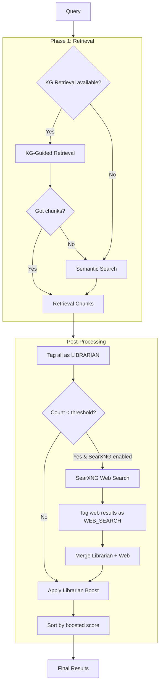

# Design Document: Search Pipeline Restructure

## Overview

This design restructures `RAGService._search_documents` from a flawed priority chain into a clean two-phase pipeline, and adds SearXNG web search as a supplementary source.

**Current flow (broken):**
```
_search_documents
  → Source Prioritization (semantic search + boost) — runs first, short-circuits everything
  → KG Retrieval — only if Source Prioritization unavailable
  → Semantic Search fallback — only if KG Retrieval also unavailable
```

**New flow:**
```
_search_documents
  Phase 1: Retrieval
    → KG Retrieval (primary) — graph traversal via Neo4j
    → Semantic Search (fallback) — plain vector search if KG returns nothing
  Phase 2: Post-Processing
    → Tag all results as LIBRARIAN
    → If results < threshold → fetch SearXNG web results, tag as WEB_SEARCH
    → Apply Librarian boost to LIBRARIAN results
    → Merge and sort by boosted score (LIBRARIAN wins ties)
    → Return final ranked results
```

Source Prioritization becomes a pure reranking/tagging layer. It no longer does its own vector search — it operates on whatever the Retrieval Phase produced.

## Architecture



## Components and Interfaces

### Modified: `RAGService._search_documents`

The method is restructured into two clear phases. The `source_prioritization_engine` is no longer used as a search strategy — it's refactored into a post-processing utility.

```python
async def _search_documents(
    self,
    query: str,
    user_id: str,
    document_filter: Optional[List[str]] = None,
    related_concepts: Optional[List[str]] = None,
    kg_metadata: Optional[Dict[str, Any]] = None
) -> List[DocumentChunk]:
    # Phase 1: Retrieval
    chunks = await self._retrieval_phase(query, user_id, document_filter, related_concepts, kg_metadata)
    
    # Phase 2: Post-Processing (tag, supplement, boost, rank)
    chunks = await self._post_processing_phase(query, chunks)
    
    return chunks
```

### New: `RAGService._retrieval_phase`

Encapsulates the KG-first-then-semantic-fallback logic. Extracted from the current `_search_documents` but with the source prioritization branch removed.

```python
async def _retrieval_phase(
    self,
    query: str,
    user_id: str,
    document_filter: Optional[List[str]] = None,
    related_concepts: Optional[List[str]] = None,
    kg_metadata: Optional[Dict[str, Any]] = None
) -> List[DocumentChunk]:
    # Try KG retrieval first
    if self.use_kg_retrieval and self.kg_retrieval_service:
        try:
            precomputed_decomposition = (kg_metadata or {}).get('_decomposition')
            kg_result = await self.kg_retrieval_service.retrieve(
                query, top_k=self.max_search_results,
                precomputed_decomposition=precomputed_decomposition
            )
            if kg_result.chunks and not kg_result.fallback_used:
                chunks = self._convert_kg_results(kg_result)
                if document_filter:
                    chunks = [c for c in chunks if c.document_id in document_filter]
                if chunks:
                    return chunks
        except Exception as e:
            logger.warning(f"KG retrieval failed, falling back to semantic: {e}")
    
    # Fallback to semantic search
    return await self._semantic_search_documents(query, user_id, document_filter, related_concepts)
```

### New: `RAGService._post_processing_phase`

Applies source tagging, optional web search supplementation, Librarian boost, and final ranking. This replaces the old pattern where `source_prioritization_engine.search_with_prioritization` was called as a search strategy.

```python
async def _post_processing_phase(
    self,
    query: str,
    librarian_chunks: List[DocumentChunk]
) -> List[DocumentChunk]:
    # Tag all retrieval-phase results as LIBRARIAN
    for chunk in librarian_chunks:
        chunk.source_type = SearchSourceType.LIBRARIAN.value
    
    web_chunks: List[DocumentChunk] = []
    
    # Supplement with web search if Librarian results are thin
    if (len(librarian_chunks) < self.web_search_result_count_threshold
            and self.searxng_client is not None
            and self.searxng_enabled):
        try:
            web_results = await self.searxng_client.search(query, max_results=self.searxng_max_results)
            web_chunks = self._convert_web_results(web_results)
        except Exception as e:
            logger.warning(f"SearXNG web search failed: {e}")
    
    # Apply Librarian boost
    for chunk in librarian_chunks:
        chunk.similarity_score = min(1.0, chunk.similarity_score * self.librarian_boost_factor)
        chunk.metadata['librarian_boost_applied'] = True
    
    # Merge and sort — Librarian wins ties via stable sort + ordering
    all_chunks = librarian_chunks + web_chunks
    all_chunks.sort(key=lambda c: (c.similarity_score, c.source_type == SearchSourceType.LIBRARIAN.value), reverse=True)
    
    return all_chunks[:self.max_search_results]
```

### Modified: `SourcePrioritizationEngine`

The engine's `search_with_prioritization` method is no longer called from `_search_documents`. The engine is refactored so its boost/tag/merge logic can be used as utility functions by the post-processing phase. The existing `_apply_librarian_boost` and `_merge_and_rank_results` methods are already suitable for this — the change is that `search_with_prioritization` is no longer the entry point from `_search_documents`.

In practice, the post-processing logic is simple enough to live directly in `RAGService._post_processing_phase` without delegating to the engine. The engine remains available for any callers that still want the combined search+prioritize behavior, but `_search_documents` no longer uses it.

### New: `SearXNGClient`

Located at `src/multimodal_librarian/clients/searxng_client.py`.

```python
class SearXNGClient:
    """Async client for SearXNG JSON API."""
    
    def __init__(self, host: str, port: int, timeout: float = 10.0):
        self.base_url = f"http://{host}:{port}"
        self.timeout = timeout
        self._session: Optional[aiohttp.ClientSession] = None
    
    async def _get_session(self) -> aiohttp.ClientSession:
        """Lazy session creation — no connections at instantiation time."""
        if self._session is None or self._session.closed:
            self._session = aiohttp.ClientSession(
                timeout=aiohttp.ClientTimeout(total=self.timeout)
            )
        return self._session
    
    async def search(self, query: str, max_results: int = 5) -> List[SearXNGResult]:
        """Search via SearXNG JSON API."""
        session = await self._get_session()
        params = {
            "q": query,
            "format": "json",
            "categories": "general",
        }
        async with session.get(f"{self.base_url}/search", params=params) as resp:
            resp.raise_for_status()
            data = await resp.json()
            results = data.get("results", [])[:max_results]
            return [
                SearXNGResult(
                    title=r.get("title", ""),
                    url=r.get("url", ""),
                    content=r.get("content", ""),
                    score=r.get("score", 0.5),
                    engine=r.get("engine", "unknown"),
                )
                for r in results
            ]
    
    async def close(self):
        if self._session and not self._session.closed:
            await self._session.close()
```

### New: `SearXNGResult` Data Class

```python
@dataclass
class SearXNGResult:
    title: str
    url: str
    content: str
    score: float
    engine: str
```

### New: `RAGService._convert_web_results`

Converts `SearXNGResult` objects into `DocumentChunk` objects tagged as `WEB_SEARCH`.

```python
def _convert_web_results(self, web_results: List[SearXNGResult]) -> List[DocumentChunk]:
    chunks = []
    for result in web_results:
        chunk = DocumentChunk(
            chunk_id=f"web_{hash(result.url)}",
            document_id=f"web_{result.engine}",
            document_title=result.title,
            content=result.content,
            similarity_score=result.score,
            source_type=SearchSourceType.WEB_SEARCH.value,
            metadata={
                'url': result.url,
                'engine': result.engine,
                'source_type': 'web_search',
            }
        )
        chunks.append(chunk)
    return chunks
```

### Modified: DI Providers in `services.py`

New providers following existing patterns:

```python
_searxng_client: Optional["SearXNGClient"] = None

async def get_searxng_client() -> "SearXNGClient":
    global _searxng_client
    if _searxng_client is None:
        from ...clients.searxng_client import SearXNGClient
        settings = get_settings()
        if not settings.searxng_enabled:
            raise HTTPException(status_code=503, detail="SearXNG is disabled")
        _searxng_client = SearXNGClient(
            host=settings.searxng_host,
            port=settings.searxng_port,
            timeout=settings.searxng_timeout,
        )
    return _searxng_client

async def get_searxng_client_optional() -> Optional["SearXNGClient"]:
    try:
        return await get_searxng_client()
    except (HTTPException, Exception):
        return None
```

The `get_rag_service` provider is updated to inject `searxng_client` into `RAGService`.

### Modified: `RAGService.__init__`

New parameters:

```python
def __init__(
    self,
    ...,
    searxng_client: Optional["SearXNGClient"] = None,
):
    ...
    self.searxng_client = searxng_client
    self.searxng_enabled = searxng_client is not None
    
    settings = get_settings()
    self.librarian_boost_factor = 1.5  # Could also come from settings
    self.web_search_result_count_threshold = settings.web_search_result_count_threshold
    self.searxng_max_results = settings.searxng_max_results
```

### Modified: `Settings` in `config.py`

New fields:

```python
# SearXNG web search settings
searxng_host: str = Field(default="searxng", description="SearXNG service hostname")
searxng_port: int = Field(default=8080, description="SearXNG service port")
searxng_timeout: float = Field(default=10.0, description="SearXNG request timeout in seconds")
searxng_enabled: bool = Field(default=False, description="Enable SearXNG web search")
searxng_max_results: int = Field(default=5, description="Maximum web search results to fetch")

# Search pipeline settings
web_search_result_count_threshold: int = Field(
    default=3,
    description="Minimum Librarian results before web search is triggered"
)
```

### Modified: `docker-compose.yml`

New service:

```yaml
searxng:
  image: searxng/searxng:latest
  environment:
    - SEARXNG_BASE_URL=http://searxng:8080/
  volumes:
    - ./searxng-settings.yml:/etc/searxng/settings.yml:ro
  ports:
    - "8888:8080"
  restart: unless-stopped
  networks:
    - app-network
  profiles:
    - web-search
```

The `profiles: [web-search]` means SearXNG only starts when explicitly requested (`docker compose --profile web-search up`), keeping it optional. The app container's `SEARXNG_ENABLED` defaults to `false`.

### New: `searxng-settings.yml`

Minimal SearXNG configuration to enable JSON output:

```yaml
use_default_settings: true
server:
  secret_key: "dev-searxng-secret"
  bind_address: "0.0.0.0"
  port: 8080
search:
  formats:
    - html
    - json
```

## Data Models

### Existing: `DocumentChunk` (modified)

The `source_type` field already exists on `DocumentChunk` as an optional string. The post-processing phase sets it to `"librarian"` or `"web_search"`. No schema change needed.

### Existing: `SearchSourceType` enum

Already defined in `source_prioritization_engine.py`:
```python
class SearchSourceType(Enum):
    LIBRARIAN = "librarian"
    WEB_SEARCH = "web_search"
    LLM_FALLBACK = "llm_fallback"
```

No changes needed. The post-processing phase uses these values.

### New: `SearXNGResult`

```python
@dataclass
class SearXNGResult:
    title: str
    url: str
    content: str
    score: float  # 0.0 to 1.0, normalized from SearXNG
    engine: str   # which search engine provided this result
```

### Existing: `PrioritizedSearchResult` / `PrioritizedSearchResults`

These models remain in `source_prioritization_engine.py` for backward compatibility but are no longer used by `_search_documents`. The post-processing phase works directly with `DocumentChunk` objects.


## Correctness Properties

*A property is a characteristic or behavior that should hold true across all valid executions of a system — essentially, a formal statement about what the system should do. Properties serve as the bridge between human-readable specifications and machine-verifiable correctness guarantees.*

### Property 1: KG results bypass semantic search

*For any* query where KG Retrieval returns non-empty chunks that pass document filtering, the Retrieval Phase should use those chunks and Semantic Search should not be invoked.

**Validates: Requirements 1.2**

### Property 2: KG failure triggers semantic fallback

*For any* query where KG Retrieval is unavailable, returns empty results, or raises an exception, the Retrieval Phase should return results from Semantic Search.

**Validates: Requirements 1.3, 1.4**

### Property 3: Post-processing runs on all retrieval output

*For any* result set produced by the Retrieval Phase (whether from KG Retrieval or Semantic Search), the Post-Processing Phase should be applied before results are returned.

**Validates: Requirements 1.5, 2.1**

### Property 4: Retrieval-phase chunks tagged as LIBRARIAN

*For any* set of chunks produced by the Retrieval Phase, after post-processing, every chunk originating from the retrieval phase should have `source_type` set to `"librarian"`.

**Validates: Requirements 2.2**

### Property 5: Librarian boost correctness

*For any* chunk with original score `s` and any boost factor `f >= 1.0`, the boosted score should equal `min(1.0, s * f)`.

**Validates: Requirements 2.3**

### Property 6: Output sorted by score with LIBRARIAN tiebreaker

*For any* mixed list of LIBRARIAN and WEB_SEARCH results after post-processing, the output should be sorted by boosted score in descending order, and when two results have equal boosted scores, the LIBRARIAN result should appear before the WEB_SEARCH result.

**Validates: Requirements 2.4, 2.5**

### Property 7: Web search triggered below threshold

*For any* Retrieval Phase result count below the configurable `web_search_result_count_threshold`, when SearXNG is enabled and available, the Post-Processing Phase should invoke the SearXNG client.

**Validates: Requirements 3.1**

### Property 8: Web search skipped when disabled

*For any* Retrieval Phase result count (including zero), when `searxng_enabled` is `false` or the SearXNG client is `None`, the Post-Processing Phase should not invoke web search.

**Validates: Requirements 3.2, 6.5**

### Property 9: SearXNG results tagged as WEB_SEARCH

*For any* valid SearXNG API response, every converted result should have `source_type` set to `"web_search"`.

**Validates: Requirements 3.4**

### Property 10: Client instantiation creates no connections

*For any* valid configuration, instantiating `SearXNGClient` should not create an HTTP session or establish any network connections. The session should only be created on the first call to `search()`.

**Validates: Requirements 5.6**

### Property 11: Graceful degradation with semantic search

*For any* query where KG Retrieval is unavailable, the Search Pipeline should return Semantic Search results with post-processing applied (tagging, boosting, sorting).

**Validates: Requirements 7.1, 7.2**

### Property 12: Exception isolation across stages

*For any* stage in the Search Pipeline that raises an exception, the pipeline should catch the exception, log it, and continue to the next stage without propagating the error to the caller.

**Validates: Requirements 7.4**

## Error Handling

| Scenario | Behavior |
|---|---|
| KG Retrieval raises exception | Log warning, fall back to Semantic Search |
| Semantic Search raises exception | Log error, return empty result set |
| SearXNG client request fails/times out | Log warning, proceed with Librarian-only results |
| SearXNG returns malformed JSON | Log warning, proceed with Librarian-only results |
| SearXNG disabled via config | Skip web search silently, no error |
| Both KG and Semantic unavailable | Return empty list, no exception raised |
| Librarian boost produces score > 1.0 | Cap at 1.0 |
| aiohttp session creation fails | SearXNG client returns empty results, logs error |

All error handling follows the existing pattern in `_search_documents`: `try/except` with `logger.warning` or `logger.error`, then continue to the next fallback stage.

## Testing Strategy

### Property-Based Testing

Use **Hypothesis** for property-based testing. Each property test runs a minimum of 100 iterations.

Property tests focus on:
- The boost calculation (Property 5) — generate random scores and boost factors
- Sort ordering with tiebreaker (Property 6) — generate random mixed result lists
- Web search trigger threshold (Properties 7, 8) — generate random result counts and thresholds
- Source tagging (Properties 4, 9) — generate random chunk sets and verify tagging
- Exception isolation (Property 12) — generate random exception types and verify containment

Each property test is tagged with: **Feature: search-pipeline-restructure, Property {N}: {title}**

### Unit Testing

Unit tests complement property tests for specific examples and edge cases:
- KG retrieval returns results → semantic search not called (Property 1, example)
- KG retrieval raises `ConnectionError` → semantic search called, no propagation (Property 2, edge case)
- Empty retrieval results + SearXNG failure → returns empty list (edge case from 3.5, 7.3)
- `SearXNGClient` instantiation doesn't open session (Property 10, example)
- DI provider returns `None` when disabled (example from 5.5)
- Settings fields have correct defaults (examples from 6.1-6.3)

### Integration Testing

- End-to-end `_search_documents` with mocked KG service and vector client
- SearXNG client against a mock HTTP server (aiohttp test server)
- DI provider chain: `get_rag_service` → `get_searxng_client_optional` → `RAGService` with SearXNG injected

### Test Library

- **Hypothesis** for property-based tests (already in the Python ecosystem, pairs well with pytest)
- **pytest** for unit and integration tests
- **pytest-asyncio** for async test support
- **aioresponses** for mocking aiohttp requests in SearXNG client tests
