# Design Document: Semantic Concept Matching

## Overview

This feature augments the QueryDecomposer's lexical concept matching with semantic similarity search. The approach has two parts:

1. **Ingestion-time**: When concepts are persisted to Neo4j during document processing, compute a 384-dim embedding vector for each concept name and store it as a node property. A Neo4j vector index enables fast approximate nearest-neighbor (ANN) queries.

2. **Query-time**: The QueryDecomposer embeds the user query, runs a vector similarity search against the index, filters by a configurable threshold, merges results with lexical matches (deduplicating by `concept_id`), and returns a unified `concept_matches` list.

The existing KG retrieval pipeline (KGRetrievalService → chunk resolution → relationship traversal) consumes `concept_matches` without changes. The knowledge graph will be rebuilt from scratch with embeddings included.

## Architecture

```mermaid
flowchart TD
    subgraph "Document Processing (Ingestion)"
        A[KG_Builder extracts concepts] --> B[Batch concept names]
        B --> C[Model_Server_Client.generate_embeddings]
        C --> D[Store Concept node + embedding property in Neo4j]
    end

    subgraph "Query Time"
        E[User Query] --> F[QueryDecomposer.decompose]
        F --> G[Lexical matching<br/>full-text index + CONTAINS]
        F --> H[Semantic matching<br/>embed query → vector index search]
        G --> I[Merge & deduplicate<br/>by concept_id]
        H --> I
        I --> J[QueryDecomposition.concept_matches]
        J --> K[KGRetrievalService<br/>unchanged]
    end

    subgraph "Index Setup (startup)"
        L[Neo4j_Client.ensure_indexes] --> M[CREATE VECTOR INDEX<br/>concept_embedding_index]
    end
```



## Components and Interfaces

### 1. Neo4j Vector Index Setup (`Neo4jClient.ensure_indexes`)

Add a vector index creation statement to the existing `ensure_indexes` method:

```python
# Added to index_statements list in ensure_indexes()
"CALL db.index.vector.createNodeIndex("
"  'concept_embedding_index', 'Concept', 'embedding', 384, 'cosine'"
") "
```

This is idempotent — Neo4j ignores the call if the index already exists. The index is created alongside existing full-text and B-tree indexes during startup.

### 2. Embedding Generation During Concept Persistence

Two code paths persist concepts to Neo4j:

- `celery_service.py` — async document processing pipeline (primary path)
- `conversations.py` — conversation-based document upload

Both paths create Concept nodes with a properties dict. The change: before persisting, batch all concept names, call `ModelServerClient.generate_embeddings()`, and add the resulting vector as an `embedding` property on each node.

```python
# Pseudocode for the embedding addition in celery_service.py
concept_names = [c.concept_name for c in all_concepts]
try:
    embeddings = await model_server_client.generate_embeddings(concept_names)
except Exception:
    embeddings = [None] * len(concept_names)
    logger.warning("Model server unavailable, concepts will lack embeddings")

for concept, embedding in zip(all_concepts, embeddings):
    properties = {
        'concept_id': concept.concept_id,
        'name': concept.concept_name,
        'type': concept.concept_type,
        'confidence': concept.confidence,
        'source_document': document_id,
        'source_chunks': ','.join(concept.source_chunks) if concept.source_chunks else ''
    }
    if embedding is not None:
        properties['embedding'] = embedding
    await kg_service.create_node(label='Concept', properties=properties, merge_on=['concept_id'])
```

### 3. Semantic Search in QueryDecomposer

Add a new method `_find_semantic_matches` to `QueryDecomposer`:

```python
async def _find_semantic_matches(self, query: str) -> List[Dict[str, Any]]:
    """Find concepts via vector similarity search."""
    if not self._model_server_client or not self._semantic_enabled:
        return []

    embeddings = await self._model_server_client.generate_embeddings([query])
    if not embeddings:
        return []

    query_embedding = embeddings[0]

    cypher = """
    CALL db.index.vector.queryNodes('concept_embedding_index', $top_k, $embedding)
    YIELD node, score
    WHERE score >= $threshold
    RETURN node.concept_id AS concept_id,
           node.name AS name,
           node.type AS type,
           node.confidence AS confidence,
           node.source_document AS source_document,
           node.source_chunks AS source_chunks,
           score AS similarity_score
    """
    results = await self._neo4j_client.execute_query(cypher, {
        'embedding': query_embedding,
        'top_k': self._semantic_max_results,
        'threshold': self._similarity_threshold,
    })
    return [
        {**record, 'match_type': 'semantic'}
        for record in (results or [])
    ]
```

### 4. Merge Logic in `QueryDecomposer.decompose`

After both `_find_entity_matches` (lexical) and `_find_semantic_matches` run concurrently:

```python
# Annotate lexical matches
for match in lexical_matches:
    match['match_type'] = 'lexical'

# Merge: deduplicate by concept_id, prefer higher score
merged = {}
for match in lexical_matches + semantic_matches:
    cid = match['concept_id']
    if cid in merged:
        existing = merged[cid]
        existing_score = existing.get('similarity_score') or existing.get('match_score', 0)
        new_score = match.get('similarity_score') or match.get('match_score', 0)
        if new_score > existing_score:
            match['match_type'] = 'both'
            merged[cid] = match
        else:
            existing['match_type'] = 'both'
    else:
        merged[cid] = match

concept_matches = list(merged.values())
```

### 5. Configuration Parameters

Added to `QueryDecomposer.__init__`:

| Parameter | Type | Default | Description |
|-----------|------|---------|-------------|
| `similarity_threshold` | float | 0.7 | Minimum cosine similarity for semantic matches |
| `semantic_max_results` | int | 10 | Max concepts returned from vector search |
| `semantic_enabled` | bool | True | Toggle semantic matching on/off |
| `model_server_client` | Optional | None | Injected Model_Server_Client instance |

### 6. QueryDecomposition Model Update

Add `match_type` to the concept match dict contract. The `to_dict` / `from_dict` methods already serialize `concept_matches` as a list of dicts, so `match_type` is preserved automatically as a dict key. No schema change needed — just a new key in the dict.

### 7. Dependency Injection

The `QueryDecomposer` already receives `neo4j_client` via its constructor. The `model_server_client` will be added the same way:

```python
def __init__(
    self,
    neo4j_client: Optional[Any] = None,
    model_server_client: Optional[Any] = None,
    similarity_threshold: float = 0.7,
    semantic_max_results: int = 10,
    semantic_enabled: bool = True,
):
```

The DI provider that creates the `QueryDecomposer` (or the `KGRetrievalService` that owns it) will inject the model server client. When `model_server_client` is `None`, semantic matching is silently skipped.

## Data Models

### Concept Node Properties (Neo4j)

| Property | Type | Existing | Description |
|----------|------|----------|-------------|
| `concept_id` | string | ✓ | Unique identifier |
| `name` | string | ✓ | Concept name |
| `type` | string | ✓ | ENTITY, TOPIC, etc. |
| `confidence` | float | ✓ | Extraction confidence |
| `source_document` | string | ✓ | Document ID |
| `source_chunks` | string | ✓ | Comma-separated chunk IDs |
| `embedding` | float[] | **new** | 384-dim embedding vector |

### Neo4j Indexes

| Index Name | Type | Existing | Target |
|------------|------|----------|--------|
| `concept_name_fulltext` | Full-text | ✓ | `Concept.name` |
| `concept_id_index` | B-tree | ✓ | `Concept.concept_id` |
| `concept_embedding_index` | Vector | **new** | `Concept.embedding` (384-dim, cosine) |

### Concept Match Dict (in `concept_matches`)

```python
{
    "concept_id": str,
    "name": str,
    "type": str,
    "confidence": float,
    "source_document": str,
    "source_chunks": str,
    "match_type": str,        # "lexical", "semantic", or "both" (new field)
    "similarity_score": float  # cosine similarity (semantic matches only)
}
```


## Correctness Properties

*A property is a characteristic or behavior that should hold true across all valid executions of a system — essentially, a formal statement about what the system should do. Properties serve as the bridge between human-readable specifications and machine-verifiable correctness guarantees.*

### Property 1: Persisted concepts include embeddings

*For any* concept name string, when the concept is persisted to Neo4j with the model server available, the resulting node properties SHALL contain an `embedding` key whose value is a list of exactly 384 floats.

**Validates: Requirements 1.1**

### Property 2: Embedding requests are batched

*For any* batch of N concepts (N > 1) persisted in a single processing run, the Model_Server_Client SHALL receive at most ceil(N / batch_size) embedding calls, not N individual calls.

**Validates: Requirements 1.3**

### Property 3: Threshold filtering removes low-score matches

*For any* list of semantic match results and any similarity threshold T, all matches in the filtered output SHALL have a similarity_score >= T, and no match with similarity_score >= T from the input SHALL be absent from the output.

**Validates: Requirements 2.2**

### Property 4: Merge deduplicates by concept_id and prefers higher score

*For any* two lists of concept matches (lexical and semantic) with potentially overlapping concept_ids, the merged result SHALL contain exactly one entry per unique concept_id, and for each concept_id present in both lists, the entry with the higher score SHALL be retained with match_type set to "both".

**Validates: Requirements 2.3**

### Property 5: Concept matches have valid format and match_type

*For any* concept match dict in the merged `concept_matches` list, the dict SHALL contain keys `concept_id`, `name`, `source_chunks`, and `match_type`, where `match_type` is one of `"lexical"`, `"semantic"`, or `"both"`.

**Validates: Requirements 2.5, 4.1**

### Property 6: Semantic unavailability yields lexical-only results

*For any* query string, when semantic matching is unavailable (either `semantic_enabled=False` or `model_server_client=None`), the QueryDecomposer SHALL return only matches with `match_type="lexical"` and SHALL NOT invoke the Model_Server_Client.

**Validates: Requirements 3.4, 5.2**

### Property 7: QueryDecomposition round-trip serialization

*For any* valid QueryDecomposition object whose `concept_matches` contain `match_type` annotations, calling `to_dict()` then `from_dict()` SHALL produce an equivalent object with all `match_type` values preserved.

**Validates: Requirements 4.3**

## Error Handling

| Scenario | Behavior |
|----------|----------|
| Model server unavailable during ingestion | Concept created without `embedding` property; warning logged. KG is still usable for lexical matching. |
| Model server unavailable at query time | `_find_semantic_matches` returns empty list; lexical matches used alone. Warning logged. |
| Vector index does not exist at query time | Neo4j raises an error on `db.index.vector.queryNodes`; caught in `_find_semantic_matches`, returns empty list, falls back to lexical. |
| Embedding dimension mismatch | Neo4j rejects the vector on write; caught per-concept, warning logged, concept created without embedding. |
| Neo4j connection lost during vector search | Existing reconnection logic in `_find_entity_matches` applies; `_find_semantic_matches` catches the exception and returns empty list. |
| Empty query string | `_find_semantic_matches` returns empty list (model server returns empty for empty input). |

## Testing Strategy

### Unit Tests

- Verify `ensure_indexes` includes the vector index creation statement.
- Verify `QueryDecomposer.__init__` defaults: `similarity_threshold=0.7`, `semantic_max_results=10`, `semantic_enabled=True`.
- Verify graceful degradation when model server is unavailable (ingestion and query time).
- Verify that `KGRetrievalService._stage1_kg_retrieval` processes semantic matches identically to lexical matches (integration example).

### Property-Based Tests (Hypothesis)

Each correctness property above maps to a Hypothesis property test. The test suite uses `hypothesis` with a minimum of 100 examples per property.

- **Property 3 (threshold filtering)**: Generate random lists of `{concept_id, similarity_score}` dicts and random thresholds in [0.0, 1.0]. Apply the filter function. Assert all outputs have score >= threshold and no valid inputs are dropped.
  - Tag: `Feature: semantic-concept-matching, Property 3: Threshold filtering removes low-score matches`

- **Property 4 (merge dedup)**: Generate two random lists of concept match dicts with overlapping concept_ids and random scores. Apply the merge function. Assert unique concept_ids, correct score preference, and `match_type="both"` for overlaps.
  - Tag: `Feature: semantic-concept-matching, Property 4: Merge deduplicates by concept_id and prefers higher score`

- **Property 5 (format validity)**: Generate random concept match dicts from the merge function. Assert required keys and valid `match_type` values.
  - Tag: `Feature: semantic-concept-matching, Property 5: Concept matches have valid format and match_type`

- **Property 7 (round-trip serialization)**: Generate random QueryDecomposition objects with `match_type` annotations. Assert `from_dict(to_dict(obj))` produces equivalent data.
  - Tag: `Feature: semantic-concept-matching, Property 7: QueryDecomposition round-trip serialization`

Properties 1, 2, and 6 are best tested as unit/integration tests since they require mocking external services (model server, Neo4j) and verifying call patterns rather than pure data transformations.
