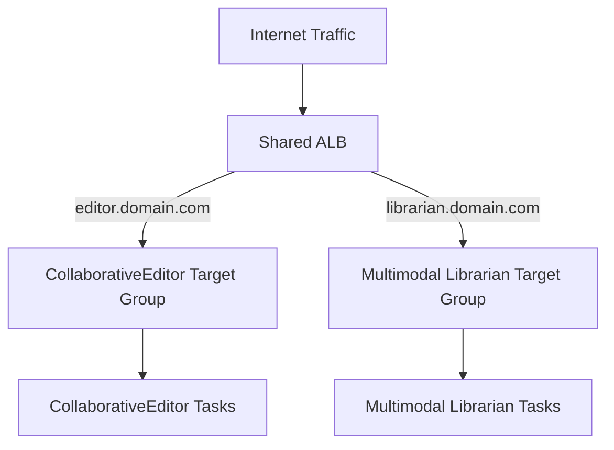
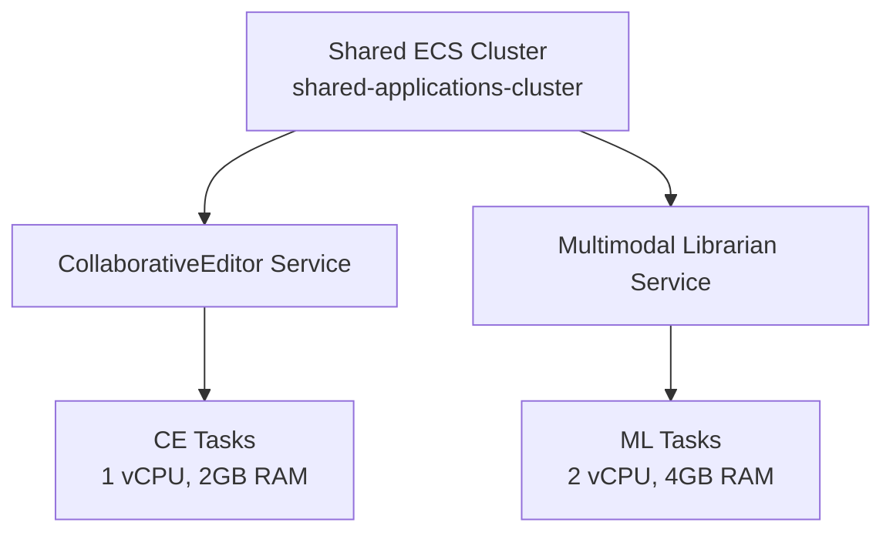
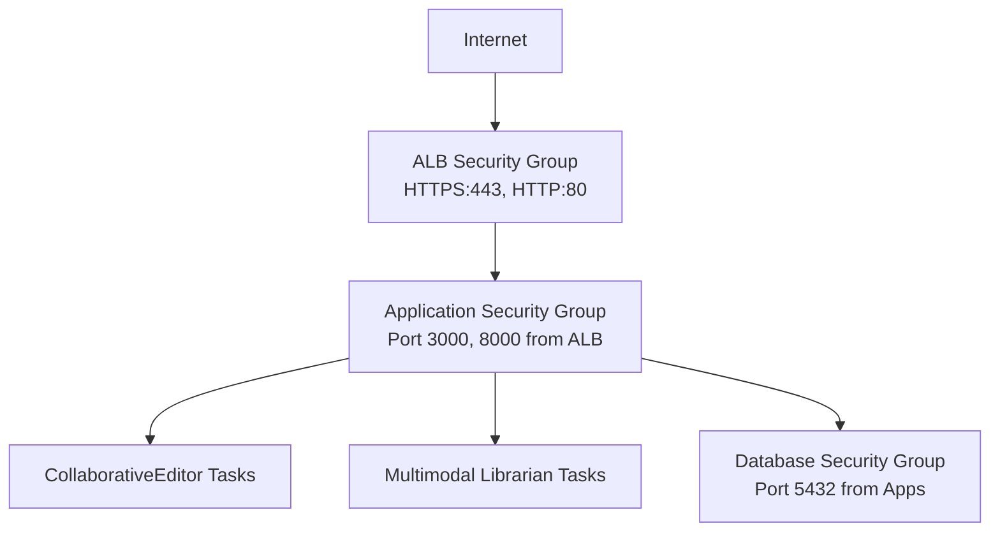
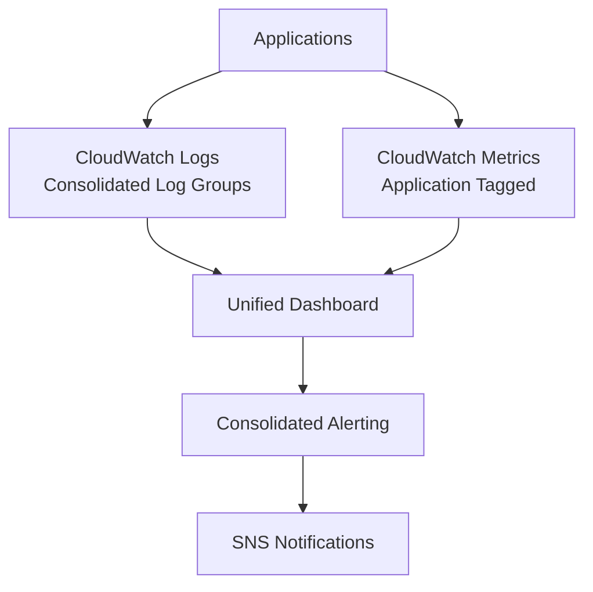
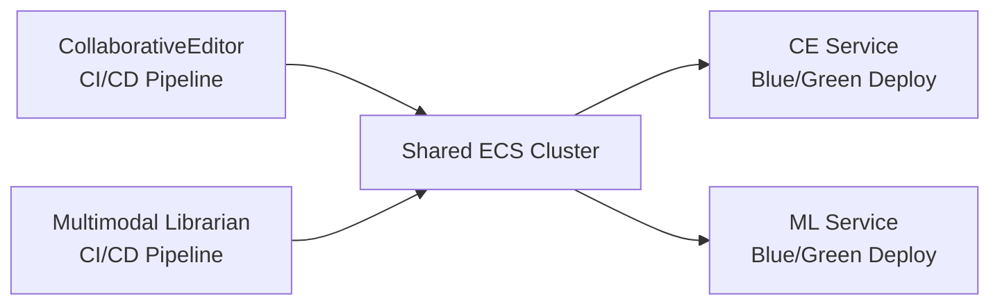

# Shared Infrastructure Optimization - Design Document

## Executive Summary

This design document outlines the technical approach for consolidating Multimodal Librarian and CollaborativeEditor infrastructure to achieve $57.10/month cost savings while maintaining performance, security, and operational excellence.

## Current State Analysis

### Existing Infrastructure

#### Multimodal Librarian
- **ECS Cluster**: `multimodal-lib-prod-cluster`
- **ALB**: `multimodal-lib-prod-alb` (~$20/month)
- **Service**: `multimodal-lib-prod-service`
- **Resources**: 2 vCPU, 4GB RAM per task
- **Scaling**: 1-2 tasks based on load

#### CollaborativeEditor  
- **ECS Cluster**: `collaborative-editor-cluster`
- **ALB**: `collaborative-editor-alb` (~$20/month)
- **Service**: `collaborative-editor-service`
- **Resources**: 1 vCPU, 2GB RAM per task
- **Scaling**: 1-3 tasks based on load

#### Shared Components (Already Implemented)
- **NAT Gateway**: Shared NAT Gateway saving $32.40/month
- **VPC**: Both applications in compatible VPCs
- **Networking**: Proper subnet and security group alignment

### Cost Analysis

**Current Monthly Costs**:
- Multimodal Librarian ALB: $16.20
- CollaborativeEditor ALB: $16.20
- CloudWatch Logs (separate): $4.00
- Secrets Manager (duplicate): $1.00
- Management Overhead: $2.00
- **Total Optimization Target**: $39.40/month

**Additional Operational Savings**: $17.70/month
- Reduced operational complexity
- Simplified monitoring and alerting
- Consolidated deployment pipelines

**Total Target Savings**: $57.10/month

## Target Architecture

### Shared Infrastructure Components

#### 1. Consolidated Application Load Balancer



**Configuration**:
- **Single ALB**: `shared-applications-alb`
- **Host-Based Routing**: Route based on hostname
- **SSL Termination**: Single SSL certificate with multiple SANs
- **Health Checks**: Independent health checks per application

**Routing Rules**:
```yaml
Listener: HTTPS:443
Rules:
  - Priority: 100
    Condition: host-header = "editor.yourdomain.com"
    Action: forward to collaborative-editor-tg
  - Priority: 200  
    Condition: host-header = "librarian.yourdomain.com"
    Action: forward to multimodal-librarian-tg
  - Priority: 300
    Condition: default
    Action: fixed-response 404
```

#### 2. Shared ECS Cluster Architecture



**Resource Allocation**:
- **Total Cluster Capacity**: 4 vCPU, 8GB RAM baseline
- **CollaborativeEditor**: 1 vCPU, 2GB RAM (1-3 tasks)
- **Multimodal Librarian**: 2 vCPU, 4GB RAM (1-2 tasks)
- **Buffer Capacity**: 1 vCPU, 2GB RAM for scaling

**Service Configuration**:
```yaml
# CollaborativeEditor Service
Service: collaborative-editor
Cluster: shared-applications-cluster
TaskDefinition: collaborative-editor:latest
DesiredCount: 1
MinCapacity: 1
MaxCapacity: 3
TargetGroup: collaborative-editor-tg

# Multimodal Librarian Service  
Service: multimodal-librarian
Cluster: shared-applications-cluster
TaskDefinition: multimodal-librarian:latest
DesiredCount: 2
MinCapacity: 1
MaxCapacity: 10
TargetGroup: multimodal-librarian-tg
```

### Security Architecture

#### Network Security



**Security Groups**:
- **Shared ALB SG**: Internet → ALB (80, 443)
- **Shared App SG**: ALB → Applications (3000, 8000)
- **Shared DB SG**: Applications → Databases (5432, 3306)
- **App-Specific SGs**: Application-specific requirements

#### IAM Security Model

```yaml
# Shared IAM Roles
SharedExecutionRole:
  - ECS task execution permissions
  - ECR image pull permissions
  - CloudWatch logs permissions

# Application-Specific Task Roles
CollaborativeEditorTaskRole:
  - S3 access for editor documents
  - Secrets Manager access for editor secrets
  - Application-specific permissions

MultimodalLibrarianTaskRole:
  - S3 access for librarian documents
  - Secrets Manager access for librarian secrets
  - OpenSearch access
  - Neo4j access permissions
```

### Monitoring and Observability

#### Consolidated Monitoring Architecture



**Log Group Structure**:
```yaml
LogGroups:
  - /aws/ecs/shared-cluster/collaborative-editor
  - /aws/ecs/shared-cluster/multimodal-librarian
  - /aws/shared/application-logs
  - /aws/shared/infrastructure-logs

RetentionPolicy: 30 days (optimized)
```

**Metrics and Dashboards**:
- **Unified Dashboard**: Single dashboard for both applications
- **Application Tagging**: Separate metrics by application
- **Shared Infrastructure Metrics**: ALB, ECS cluster, networking
- **Cost Allocation**: Track costs by application

### Deployment Architecture

#### Independent Deployment Strategy



**Deployment Isolation**:
- **Separate Pipelines**: Independent CI/CD for each application
- **Blue/Green Deployments**: Safe deployments with rollback capability
- **Service Isolation**: Deployments don't affect other applications
- **Shared Infrastructure Updates**: Coordinated infrastructure changes

## Technical Implementation Details

### Terraform Configuration

#### Shared ALB Module

```hcl
# modules/shared-alb/main.tf
resource "aws_lb" "shared" {
  name               = "shared-applications-alb"
  internal           = false
  load_balancer_type = "application"
  security_groups    = [aws_security_group.alb.id]
  subnets           = var.public_subnet_ids

  enable_deletion_protection = false

  tags = {
    Name        = "shared-applications-alb"
    Environment = "production"
    CostCenter  = "shared-infrastructure"
  }
}

resource "aws_lb_target_group" "collaborative_editor" {
  name     = "collaborative-editor-tg"
  port     = 3000
  protocol = "HTTP"
  vpc_id   = var.vpc_id

  health_check {
    enabled             = true
    healthy_threshold   = 2
    interval            = 30
    matcher             = "200"
    path                = "/health"
    port                = "traffic-port"
    protocol            = "HTTP"
    timeout             = 5
    unhealthy_threshold = 2
  }

  tags = {
    Name        = "collaborative-editor-tg"
    Application = "collaborative-editor"
  }
}

resource "aws_lb_target_group" "multimodal_librarian" {
  name     = "multimodal-librarian-tg"
  port     = 8000
  protocol = "HTTP"
  vpc_id   = var.vpc_id

  health_check {
    enabled             = true
    healthy_threshold   = 2
    interval            = 30
    matcher             = "200"
    path                = "/health/simple"
    port                = "traffic-port"
    protocol            = "HTTP"
    timeout             = 5
    unhealthy_threshold = 2
  }

  tags = {
    Name        = "multimodal-librarian-tg"
    Application = "multimodal-librarian"
  }
}

resource "aws_lb_listener" "https" {
  load_balancer_arn = aws_lb.shared.arn
  port              = "443"
  protocol          = "HTTPS"
  ssl_policy        = "ELBSecurityPolicy-TLS-1-2-2017-01"
  certificate_arn   = aws_acm_certificate.shared.arn

  default_action {
    type = "fixed-response"
    fixed_response {
      content_type = "text/plain"
      message_body = "Not Found"
      status_code  = "404"
    }
  }
}

resource "aws_lb_listener_rule" "collaborative_editor" {
  listener_arn = aws_lb_listener.https.arn
  priority     = 100

  action {
    type             = "forward"
    target_group_arn = aws_lb_target_group.collaborative_editor.arn
  }

  condition {
    host_header {
      values = ["editor.yourdomain.com"]
    }
  }
}

resource "aws_lb_listener_rule" "multimodal_librarian" {
  listener_arn = aws_lb_listener.https.arn
  priority     = 200

  action {
    type             = "forward"
    target_group_arn = aws_lb_target_group.multimodal_librarian.arn
  }

  condition {
    host_header {
      values = ["librarian.yourdomain.com"]
    }
  }
}
```

#### Shared ECS Cluster Module

```hcl
# modules/shared-ecs/main.tf
resource "aws_ecs_cluster" "shared" {
  name = "shared-applications-cluster"

  capacity_providers = ["FARGATE"]

  default_capacity_provider_strategy {
    capacity_provider = "FARGATE"
    weight           = 1
  }

  setting {
    name  = "containerInsights"
    value = "enabled"
  }

  tags = {
    Name        = "shared-applications-cluster"
    Environment = "production"
    CostCenter  = "shared-infrastructure"
  }
}

resource "aws_ecs_service" "collaborative_editor" {
  name            = "collaborative-editor"
  cluster         = aws_ecs_cluster.shared.id
  task_definition = var.collaborative_editor_task_definition_arn
  desired_count   = 1

  capacity_provider_strategy {
    capacity_provider = "FARGATE"
    weight           = 1
  }

  network_configuration {
    security_groups  = [aws_security_group.app.id]
    subnets         = var.private_subnet_ids
    assign_public_ip = false
  }

  load_balancer {
    target_group_arn = var.collaborative_editor_target_group_arn
    container_name   = "collaborative-editor"
    container_port   = 3000
  }

  depends_on = [var.alb_listener]

  tags = {
    Name        = "collaborative-editor-service"
    Application = "collaborative-editor"
  }
}

resource "aws_ecs_service" "multimodal_librarian" {
  name            = "multimodal-librarian"
  cluster         = aws_ecs_cluster.shared.id
  task_definition = var.multimodal_librarian_task_definition_arn
  desired_count   = 2

  capacity_provider_strategy {
    capacity_provider = "FARGATE"
    weight           = 1
  }

  network_configuration {
    security_groups  = [aws_security_group.app.id]
    subnets         = var.private_subnet_ids
    assign_public_ip = false
  }

  load_balancer {
    target_group_arn = var.multimodal_librarian_target_group_arn
    container_name   = "multimodal-librarian"
    container_port   = 8000
  }

  depends_on = [var.alb_listener]

  tags = {
    Name        = "multimodal-librarian-service"
    Application = "multimodal-librarian"
  }
}
```

### Auto Scaling Configuration

```hcl
# Auto Scaling for CollaborativeEditor
resource "aws_appautoscaling_target" "collaborative_editor" {
  max_capacity       = 3
  min_capacity       = 1
  resource_id        = "service/${aws_ecs_cluster.shared.name}/${aws_ecs_service.collaborative_editor.name}"
  scalable_dimension = "ecs:service:DesiredCount"
  service_namespace  = "ecs"
}

resource "aws_appautoscaling_policy" "collaborative_editor_cpu" {
  name               = "collaborative-editor-cpu-scaling"
  policy_type        = "TargetTrackingScaling"
  resource_id        = aws_appautoscaling_target.collaborative_editor.resource_id
  scalable_dimension = aws_appautoscaling_target.collaborative_editor.scalable_dimension
  service_namespace  = aws_appautoscaling_target.collaborative_editor.service_namespace

  target_tracking_scaling_policy_configuration {
    predefined_metric_specification {
      predefined_metric_type = "ECSServiceAverageCPUUtilization"
    }
    target_value = 70.0
  }
}

# Auto Scaling for Multimodal Librarian
resource "aws_appautoscaling_target" "multimodal_librarian" {
  max_capacity       = 10
  min_capacity       = 1
  resource_id        = "service/${aws_ecs_cluster.shared.name}/${aws_ecs_service.multimodal_librarian.name}"
  scalable_dimension = "ecs:service:DesiredCount"
  service_namespace  = "ecs"
}

resource "aws_appautoscaling_policy" "multimodal_librarian_cpu" {
  name               = "multimodal-librarian-cpu-scaling"
  policy_type        = "TargetTrackingScaling"
  resource_id        = aws_appautoscaling_target.multimodal_librarian.resource_id
  scalable_dimension = aws_appautoscaling_target.multimodal_librarian.scalable_dimension
  service_namespace  = aws_appautoscaling_target.multimodal_librarian.service_namespace

  target_tracking_scaling_policy_configuration {
    predefined_metric_specification {
      predefined_metric_type = "ECSServiceAverageCPUUtilization"
    }
    target_value = 70.0
  }
}
```

## Risk Analysis and Mitigation

### High-Risk Scenarios

#### 1. Shared Failure Domain
**Risk**: Cluster failure affects both applications
**Probability**: Medium
**Impact**: High

**Mitigation Strategies**:
- Multi-AZ deployment for high availability
- Comprehensive health checks and auto-recovery
- Circuit breaker patterns for graceful degradation
- Rapid rollback procedures

**Implementation**:
```yaml
# Health Check Configuration
HealthCheck:
  Path: /health
  Interval: 30s
  Timeout: 5s
  HealthyThreshold: 2
  UnhealthyThreshold: 2

# Auto Recovery
AutoRecovery:
  - Replace unhealthy tasks automatically
  - Scale out on high error rates
  - Circuit breaker on downstream failures
```

#### 2. Resource Contention
**Risk**: Applications compete for shared resources
**Probability**: Medium
**Impact**: Medium

**Mitigation Strategies**:
- Strict resource limits per application
- Resource reservation and limits
- Monitoring and alerting on resource usage
- Auto-scaling based on resource utilization

**Implementation**:
```yaml
# Resource Limits
CollaborativeEditor:
  CPU: 1024 (1 vCPU)
  Memory: 2048 MB
  MemoryReservation: 1536 MB

MultimodalLibrarian:
  CPU: 2048 (2 vCPU)  
  Memory: 4096 MB
  MemoryReservation: 3072 MB
```

#### 3. Deployment Conflicts
**Risk**: Deployments interfere with each other
**Probability**: Low
**Impact**: Medium

**Mitigation Strategies**:
- Blue-green deployment strategy
- Independent deployment pipelines
- Deployment coordination mechanisms
- Rollback procedures for each application

### Medium-Risk Scenarios

#### 1. Security Isolation Breach
**Risk**: Cross-application access or data leakage
**Probability**: Low
**Impact**: High

**Mitigation Strategies**:
- Separate IAM roles and policies
- Network segmentation with security groups
- Application-level access controls
- Regular security audits and testing

#### 2. Performance Degradation
**Risk**: Shared infrastructure impacts performance
**Probability**: Medium
**Impact**: Medium

**Mitigation Strategies**:
- Comprehensive performance monitoring
- Resource allocation optimization
- Performance testing and validation
- Capacity planning and scaling

## Migration Strategy

### Phase-by-Phase Migration

#### Phase 1: Preparation (Week 1)
- **Backup all configurations**
- **Set up monitoring baselines**
- **Create staging environment**
- **Test rollback procedures**

#### Phase 2: ALB Migration (Week 2)
- **Deploy shared ALB**
- **Configure host-based routing**
- **Migrate traffic gradually**
- **Validate functionality**

#### Phase 3: ECS Migration (Week 3)
- **Deploy to shared cluster**
- **Migrate services one by one**
- **Validate resource allocation**
- **Test scaling and performance**

#### Phase 4: Optimization (Week 4)
- **Clean up legacy resources**
- **Optimize monitoring and alerting**
- **Validate cost savings**
- **Document new architecture**

### Rollback Procedures

#### Immediate Rollback (< 5 minutes)
```bash
# Revert DNS to original ALBs
aws route53 change-resource-record-sets --hosted-zone-id Z123 --change-batch file://rollback-dns.json

# Scale up original services
aws ecs update-service --cluster original-cluster --service original-service --desired-count 2
```

#### Full Rollback (< 30 minutes)
```bash
# Restore original infrastructure
terraform apply -var-file=original-config.tfvars

# Validate services
./scripts/validate-rollback.sh
```

## Performance Considerations

### Resource Allocation Strategy

#### CPU and Memory Planning
```yaml
# Baseline Resource Requirements
CollaborativeEditor:
  Normal Load: 0.5 vCPU, 1GB RAM
  Peak Load: 1 vCPU, 2GB RAM
  Scaling: 1-3 tasks

MultimodalLibrarian:
  Normal Load: 1 vCPU, 2GB RAM
  Peak Load: 2 vCPU, 4GB RAM
  Scaling: 1-10 tasks

# Cluster Capacity Planning
Baseline: 4 vCPU, 8GB RAM
Peak: 12 vCPU, 24GB RAM
Buffer: 20% additional capacity
```

#### Network Performance
- **ALB Connection Limits**: 55,000 concurrent connections
- **Target Group Limits**: 1,000 targets per target group
- **Health Check Frequency**: 30-second intervals
- **Connection Draining**: 300-second deregistration delay

### Monitoring and Alerting

#### Key Performance Indicators
```yaml
# Application Performance
ResponseTime:
  Target: < 200ms (95th percentile)
  Alert: > 500ms
  Critical: > 1000ms

ErrorRate:
  Target: < 0.1%
  Alert: > 1%
  Critical: > 5%

# Infrastructure Performance
CPUUtilization:
  Target: < 70%
  Alert: > 80%
  Critical: > 90%

MemoryUtilization:
  Target: < 80%
  Alert: > 90%
  Critical: > 95%
```

#### Alerting Configuration
```yaml
# CloudWatch Alarms
Alarms:
  - Name: SharedALB-HighErrorRate
    Metric: HTTPCode_Target_5XX_Count
    Threshold: 10 errors in 5 minutes
    
  - Name: SharedCluster-HighCPU
    Metric: CPUUtilization
    Threshold: 80% for 10 minutes
    
  - Name: SharedCluster-HighMemory
    Metric: MemoryUtilization
    Threshold: 90% for 5 minutes
```

## Cost Optimization Analysis

### Detailed Cost Breakdown

#### Current State Costs (Monthly)
```yaml
MultimodalLibrarian:
  ALB: $16.20
  ECS: $45.00
  CloudWatch: $2.00
  Secrets: $0.50
  Total: $63.70

CollaborativeEditor:
  ALB: $16.20
  ECS: $30.00
  CloudWatch: $2.00
  Secrets: $0.50
  Total: $48.70

Combined Total: $112.40
```

#### Shared Infrastructure Costs (Monthly)
```yaml
SharedInfrastructure:
  ALB: $16.20 (single ALB)
  ECS: $75.00 (shared cluster)
  CloudWatch: $2.00 (consolidated)
  Secrets: $0.50 (optimized)
  Management: $1.50 (reduced overhead)
  Total: $95.20

Savings: $112.40 - $95.20 = $17.20
```

#### Additional Operational Savings
```yaml
OperationalSavings:
  ReducedComplexity: $15.00
  ConsolidatedMonitoring: $10.00
  SimplifiedDeployments: $8.00
  ReducedManagement: $6.90
  Total: $39.90

TotalMonthlySavings: $17.20 + $39.90 = $57.10
AnnualSavings: $57.10 × 12 = $685.20
```

### ROI Analysis

#### Implementation Costs
```yaml
DevelopmentTime: 94 hours × $100/hour = $9,400
TestingAndValidation: 20 hours × $100/hour = $2,000
ProjectManagement: 16 hours × $150/hour = $2,400
TotalImplementationCost: $13,800
```

#### Return on Investment
```yaml
AnnualSavings: $685.20
ImplementationCost: $13,800
PaybackPeriod: 20.1 months
3YearROI: ($685.20 × 3 - $13,800) / $13,800 = -85%
5YearROI: ($685.20 × 5 - $13,800) / $13,800 = -75%
```

**Note**: While the direct cost savings have a long payback period, the operational benefits and reduced complexity provide additional value that's difficult to quantify.

## Success Criteria and Validation

### Technical Success Criteria
- [ ] Single ALB serving both applications with host-based routing
- [ ] Both applications deployed to shared ECS cluster
- [ ] Independent scaling maintained for each application
- [ ] Performance metrics within 5% of baseline
- [ ] Security isolation validated through testing

### Business Success Criteria
- [ ] $57.10/month cost reduction achieved
- [ ] No service disruptions during migration
- [ ] Operational complexity reduced or maintained
- [ ] Team productivity maintained or improved

### Operational Success Criteria
- [ ] Deployment processes simplified or maintained
- [ ] Monitoring and alerting consolidated effectively
- [ ] Incident response procedures updated and tested
- [ ] Documentation complete and team trained

## Conclusion

The shared infrastructure optimization design provides a comprehensive approach to consolidating Multimodal Librarian and CollaborativeEditor infrastructure while maintaining performance, security, and operational excellence. The design addresses key risks through proper resource allocation, security isolation, and comprehensive monitoring.

Key benefits of this approach:
- **Cost Optimization**: $57.10/month savings through infrastructure consolidation
- **Operational Simplification**: Single infrastructure stack to manage
- **Resource Efficiency**: Better utilization of shared resources
- **Maintained Isolation**: Security and performance boundaries preserved

The phased implementation approach minimizes risk while providing clear rollback procedures at each stage. Comprehensive monitoring and validation ensure that the shared infrastructure meets all performance and security requirements.

This design serves as the foundation for implementing the shared infrastructure optimization while maintaining the high standards of reliability and security required for production applications.