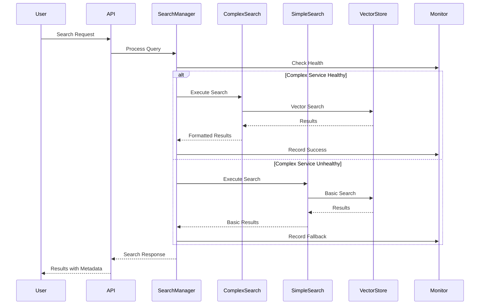
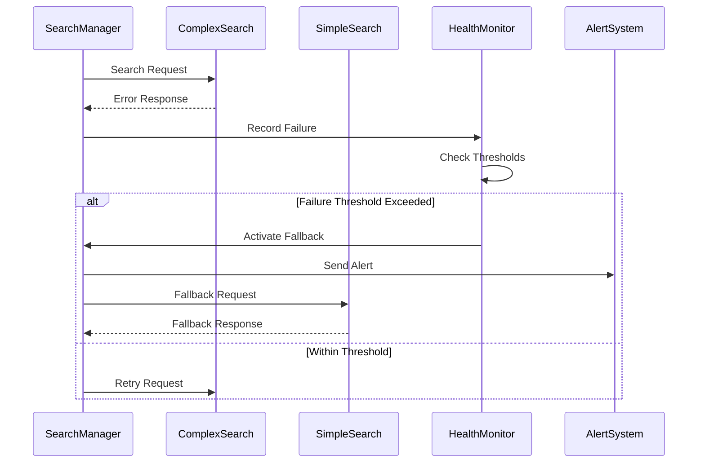
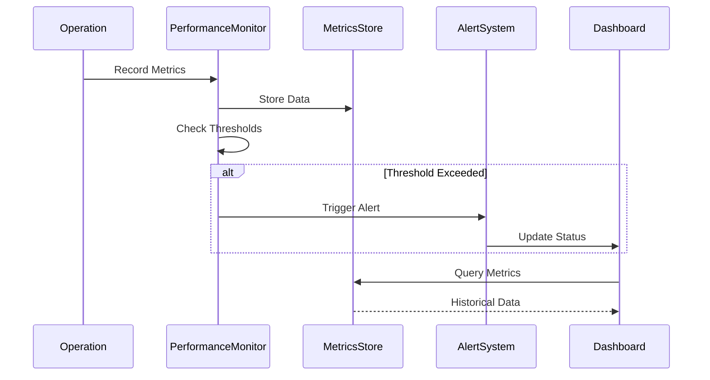

# System Integration and Stability Design Document

## Overview

This design document outlines the technical architecture and implementation approach for ensuring system integration and stability following the successful resolution of circular import issues in the vector store components. The design focuses on robust component interactions, performance optimization, and production readiness.

## Architecture Overview

### Current System State

After the circular import resolution, the system now has:

```
src/multimodal_librarian/
├── models/
│   ├── search_types.py          # ✅ Shared search types (NEW)
│   ├── search.py                # ✅ Updated with compatibility layer
│   └── core.py                  # ✅ Core data models
├── components/
│   └── vector_store/
│       ├── search_service.py           # ✅ Complex search with fallback
│       ├── search_service_simple.py   # ✅ Simple fallback service (NEW)
│       ├── search_service_complex.py  # ✅ Backup of original (NEW)
│       └── hybrid_search.py           # ✅ Updated imports
└── api/
    └── routers/
        └── documents.py         # ✅ Now loads successfully
```

### Design Principles

1. **Separation of Concerns**: Clear boundaries between components
2. **Graceful Degradation**: System continues operating when components fail
3. **Performance First**: Optimize for speed and efficiency
4. **Observability**: Comprehensive monitoring and logging
5. **Resilience**: Automatic recovery from failures

## Component Architecture

### 1. Search Service Manager

The search service manager provides a unified interface with automatic fallback capabilities:

```python
class SearchServiceManager:
    """
    Manages search service selection and fallback logic.
    
    This component ensures search operations continue even when
    complex services fail, providing seamless user experience.
    """
    
    def __init__(self, vector_store: VectorStore):
        self.vector_store = vector_store
        self.complex_service = None
        self.simple_service = SimpleSemanticSearchService(vector_store)
        self.fallback_active = False
        self.health_monitor = ServiceHealthMonitor()
        
        # Try to initialize complex service
        try:
            from .search_service_complex import ComplexSemanticSearchService
            self.complex_service = ComplexSemanticSearchService(vector_store)
            logger.info("Complex search service initialized successfully")
        except ImportError as e:
            logger.warning(f"Complex search service unavailable: {e}")
            self.fallback_active = True
    
    async def search(self, query: SearchQuery) -> SearchResponse:
        """
        Perform search with automatic fallback.
        
        Args:
            query: Search query with parameters
            
        Returns:
            Search response with results and metadata
        """
        start_time = time.time()
        
        # Try complex service first if available and healthy
        if self.complex_service and not self.fallback_active:
            try:
                result = await self.complex_service.search(query)
                
                # Update health status on success
                self.health_monitor.record_success('complex_search')
                return result
                
            except Exception as e:
                logger.warning(f"Complex search failed: {e}")
                
                # Record failure and activate fallback
                self.health_monitor.record_failure('complex_search')
                if self.health_monitor.should_fallback('complex_search'):
                    self.fallback_active = True
                    logger.info("Activating fallback mode due to repeated failures")
        
        # Use simple service as fallback
        try:
            result = await self.simple_service.search(query)
            self.health_monitor.record_success('simple_search')
            
            # Add fallback indicator to response
            if hasattr(result, 'metadata'):
                result.metadata['fallback_used'] = self.fallback_active
            
            return result
            
        except Exception as e:
            logger.error(f"Both search services failed: {e}")
            self.health_monitor.record_failure('simple_search')
            
            # Return empty response with error information
            return SearchResponse(
                results=[],
                total_results=0,
                query=query,
                execution_time_ms=(time.time() - start_time) * 1000,
                error=str(e)
            )
    
    async def health_check(self) -> Dict[str, Any]:
        """Get health status of all search services."""
        return {
            'complex_service': {
                'available': self.complex_service is not None,
                'healthy': not self.fallback_active,
                'stats': self.health_monitor.get_stats('complex_search')
            },
            'simple_service': {
                'available': True,
                'healthy': True,
                'stats': self.health_monitor.get_stats('simple_search')
            },
            'fallback_active': self.fallback_active
        }
```

### 2. Service Health Monitor

Monitors service health and makes fallback decisions:

```python
class ServiceHealthMonitor:
    """
    Monitors service health and manages fallback decisions.
    
    Uses circuit breaker pattern to prevent cascading failures
    and enable automatic recovery.
    """
    
    def __init__(self):
        self.stats = defaultdict(lambda: {
            'success_count': 0,
            'failure_count': 0,
            'last_success': None,
            'last_failure': None,
            'consecutive_failures': 0
        })
        self.thresholds = {
            'failure_rate': 0.5,      # 50% failure rate triggers fallback
            'consecutive_failures': 3,  # 3 consecutive failures trigger fallback
            'recovery_time': 300       # 5 minutes before retry
        }
    
    def record_success(self, service_name: str):
        """Record successful service operation."""
        stats = self.stats[service_name]
        stats['success_count'] += 1
        stats['last_success'] = datetime.now()
        stats['consecutive_failures'] = 0
    
    def record_failure(self, service_name: str):
        """Record failed service operation."""
        stats = self.stats[service_name]
        stats['failure_count'] += 1
        stats['last_failure'] = datetime.now()
        stats['consecutive_failures'] += 1
    
    def should_fallback(self, service_name: str) -> bool:
        """Determine if service should fallback based on health metrics."""
        stats = self.stats[service_name]
        
        # Check consecutive failures
        if stats['consecutive_failures'] >= self.thresholds['consecutive_failures']:
            return True
        
        # Check failure rate
        total_operations = stats['success_count'] + stats['failure_count']
        if total_operations >= 10:  # Minimum operations for rate calculation
            failure_rate = stats['failure_count'] / total_operations
            if failure_rate >= self.thresholds['failure_rate']:
                return True
        
        return False
    
    def can_retry(self, service_name: str) -> bool:
        """Check if enough time has passed to retry failed service."""
        stats = self.stats[service_name]
        if not stats['last_failure']:
            return True
        
        time_since_failure = (datetime.now() - stats['last_failure']).total_seconds()
        return time_since_failure >= self.thresholds['recovery_time']
```

### 3. Performance Monitor

Tracks system performance and identifies bottlenecks:

```python
class PerformanceMonitor:
    """
    Monitors system performance and provides optimization insights.
    
    Tracks response times, resource usage, and user patterns
    to identify performance bottlenecks and optimization opportunities.
    """
    
    def __init__(self):
        self.metrics = {
            'search_latency': deque(maxlen=1000),
            'memory_usage': deque(maxlen=100),
            'cpu_usage': deque(maxlen=100),
            'cache_hits': 0,
            'cache_misses': 0,
            'concurrent_users': 0
        }
        self.thresholds = {
            'search_latency_p95': 500,  # 500ms
            'memory_usage_max': 2048,   # 2GB
            'cpu_usage_max': 80,        # 80%
            'cache_hit_rate_min': 0.7   # 70%
        }
    
    def record_search_latency(self, latency_ms: float):
        """Record search operation latency."""
        self.metrics['search_latency'].append(latency_ms)
    
    def record_cache_hit(self):
        """Record cache hit."""
        self.metrics['cache_hits'] += 1
    
    def record_cache_miss(self):
        """Record cache miss."""
        self.metrics['cache_misses'] += 1
    
    def get_performance_summary(self) -> Dict[str, Any]:
        """Get current performance metrics summary."""
        search_latencies = list(self.metrics['search_latency'])
        
        return {
            'search_performance': {
                'avg_latency_ms': np.mean(search_latencies) if search_latencies else 0,
                'p95_latency_ms': np.percentile(search_latencies, 95) if search_latencies else 0,
                'p99_latency_ms': np.percentile(search_latencies, 99) if search_latencies else 0
            },
            'cache_performance': {
                'hit_rate': self.get_cache_hit_rate(),
                'total_hits': self.metrics['cache_hits'],
                'total_misses': self.metrics['cache_misses']
            },
            'resource_usage': {
                'memory_mb': self.get_current_memory_usage(),
                'cpu_percent': self.get_current_cpu_usage()
            },
            'user_activity': {
                'concurrent_users': self.metrics['concurrent_users']
            }
        }
    
    def check_performance_alerts(self) -> List[Dict[str, Any]]:
        """Check for performance threshold violations."""
        alerts = []
        
        # Check search latency
        if self.metrics['search_latency']:
            p95_latency = np.percentile(list(self.metrics['search_latency']), 95)
            if p95_latency > self.thresholds['search_latency_p95']:
                alerts.append({
                    'type': 'search_latency_high',
                    'value': p95_latency,
                    'threshold': self.thresholds['search_latency_p95'],
                    'severity': 'warning'
                })
        
        # Check cache hit rate
        hit_rate = self.get_cache_hit_rate()
        if hit_rate < self.thresholds['cache_hit_rate_min']:
            alerts.append({
                'type': 'cache_hit_rate_low',
                'value': hit_rate,
                'threshold': self.thresholds['cache_hit_rate_min'],
                'severity': 'warning'
            })
        
        return alerts
```

### 4. Integration Test Framework

Comprehensive testing framework for component interactions:

```python
class IntegrationTestFramework:
    """
    Framework for testing component interactions and system integration.
    
    Provides utilities for testing complete workflows, error scenarios,
    and performance characteristics.
    """
    
    def __init__(self, app):
        self.app = app
        self.test_data = TestDataManager()
        self.performance_tracker = PerformanceTracker()
    
    async def test_startup_sequence(self) -> TestResult:
        """Test complete system startup sequence."""
        test_result = TestResult("startup_sequence")
        
        try:
            # Test component loading
            test_result.add_step("load_models", await self._test_model_loading())
            test_result.add_step("load_services", await self._test_service_loading())
            test_result.add_step("health_checks", await self._test_health_checks())
            
            test_result.success = all(step.success for step in test_result.steps)
            
        except Exception as e:
            test_result.error = str(e)
            test_result.success = False
        
        return test_result
    
    async def test_document_pipeline(self) -> TestResult:
        """Test complete document processing pipeline."""
        test_result = TestResult("document_pipeline")
        
        try:
            # Create test document
            test_doc = self.test_data.create_test_pdf()
            
            # Test upload
            upload_result = await self._test_document_upload(test_doc)
            test_result.add_step("upload", upload_result)
            
            # Test processing
            process_result = await self._test_document_processing(test_doc.id)
            test_result.add_step("processing", process_result)
            
            # Test indexing
            index_result = await self._test_document_indexing(test_doc.id)
            test_result.add_step("indexing", index_result)
            
            # Test search
            search_result = await self._test_document_search(test_doc.content)
            test_result.add_step("search", search_result)
            
            test_result.success = all(step.success for step in test_result.steps)
            
        except Exception as e:
            test_result.error = str(e)
            test_result.success = False
        finally:
            # Cleanup test data
            await self.test_data.cleanup()
        
        return test_result
    
    async def test_error_scenarios(self) -> List[TestResult]:
        """Test various error scenarios and recovery mechanisms."""
        error_tests = [
            self._test_database_failure(),
            self._test_vector_store_failure(),
            self._test_ai_service_failure(),
            self._test_memory_exhaustion(),
            self._test_network_timeout()
        ]
        
        results = []
        for test in error_tests:
            try:
                result = await test
                results.append(result)
            except Exception as e:
                error_result = TestResult(test.__name__)
                error_result.error = str(e)
                error_result.success = False
                results.append(error_result)
        
        return results
    
    async def test_performance_benchmarks(self) -> TestResult:
        """Test system performance against benchmarks."""
        test_result = TestResult("performance_benchmarks")
        
        # Search latency test
        latency_result = await self._test_search_latency()
        test_result.add_step("search_latency", latency_result)
        
        # Concurrent user test
        concurrent_result = await self._test_concurrent_users()
        test_result.add_step("concurrent_users", concurrent_result)
        
        # Memory usage test
        memory_result = await self._test_memory_usage()
        test_result.add_step("memory_usage", memory_result)
        
        # Throughput test
        throughput_result = await self._test_search_throughput()
        test_result.add_step("throughput", throughput_result)
        
        test_result.success = all(step.success for step in test_result.steps)
        return test_result
```

## Data Flow Architecture

### 1. Normal Operation Flow



### 2. Error Recovery Flow



### 3. Performance Monitoring Flow



## Caching Strategy

### 1. Multi-Level Caching Architecture

```python
class CacheManager:
    """
    Multi-level caching system for optimal performance.
    
    Implements L1 (memory), L2 (Redis), and L3 (database) caching
    with intelligent cache warming and invalidation.
    """
    
    def __init__(self):
        self.l1_cache = LRUCache(maxsize=1000)  # Memory cache
        self.l2_cache = RedisCache()            # Distributed cache
        self.l3_cache = DatabaseCache()         # Persistent cache
        
        self.cache_stats = CacheStats()
        self.warming_scheduler = CacheWarmingScheduler()
    
    async def get(self, key: str) -> Optional[Any]:
        """Get value from cache with fallback through levels."""
        # Try L1 cache first
        value = self.l1_cache.get(key)
        if value is not None:
            self.cache_stats.record_hit('l1')
            return value
        
        # Try L2 cache
        value = await self.l2_cache.get(key)
        if value is not None:
            self.cache_stats.record_hit('l2')
            # Promote to L1
            self.l1_cache.set(key, value)
            return value
        
        # Try L3 cache
        value = await self.l3_cache.get(key)
        if value is not None:
            self.cache_stats.record_hit('l3')
            # Promote to L2 and L1
            await self.l2_cache.set(key, value)
            self.l1_cache.set(key, value)
            return value
        
        self.cache_stats.record_miss()
        return None
    
    async def set(self, key: str, value: Any, ttl: int = 3600):
        """Set value in all cache levels."""
        # Set in all levels
        self.l1_cache.set(key, value)
        await self.l2_cache.set(key, value, ttl)
        await self.l3_cache.set(key, value, ttl)
    
    async def warm_cache(self, patterns: List[str]):
        """Warm cache with frequently accessed data."""
        for pattern in patterns:
            await self.warming_scheduler.schedule_warming(pattern)
```

### 2. Search Result Caching

```python
class SearchResultCache:
    """
    Specialized caching for search results with semantic awareness.
    
    Caches search results based on query similarity and provides
    intelligent cache invalidation when documents are updated.
    """
    
    def __init__(self, cache_manager: CacheManager):
        self.cache_manager = cache_manager
        self.query_embeddings = {}
        self.similarity_threshold = 0.95
    
    async def get_cached_results(self, query: SearchQuery) -> Optional[SearchResponse]:
        """Get cached results for similar queries."""
        # Generate query embedding
        query_embedding = await self._get_query_embedding(query.query_text)
        
        # Find similar cached queries
        similar_query = await self._find_similar_query(query_embedding)
        if similar_query:
            cache_key = self._generate_cache_key(similar_query)
            return await self.cache_manager.get(cache_key)
        
        return None
    
    async def cache_results(self, query: SearchQuery, response: SearchResponse):
        """Cache search results with semantic indexing."""
        # Generate cache key
        cache_key = self._generate_cache_key(query)
        
        # Store query embedding for similarity matching
        query_embedding = await self._get_query_embedding(query.query_text)
        self.query_embeddings[cache_key] = query_embedding
        
        # Cache the results
        await self.cache_manager.set(cache_key, response, ttl=1800)  # 30 minutes
    
    async def invalidate_document_cache(self, document_id: str):
        """Invalidate cache entries related to a document."""
        # Find and remove cache entries that include results from this document
        keys_to_remove = []
        
        async for cache_key in self.cache_manager.get_keys_pattern("search:*"):
            cached_response = await self.cache_manager.get(cache_key)
            if cached_response and self._contains_document(cached_response, document_id):
                keys_to_remove.append(cache_key)
        
        # Remove invalidated entries
        for key in keys_to_remove:
            await self.cache_manager.delete(key)
```

## Monitoring and Observability

### 1. Health Check System

```python
class HealthCheckSystem:
    """
    Comprehensive health checking for all system components.
    
    Provides detailed health status and enables proactive
    issue detection and resolution.
    """
    
    def __init__(self):
        self.checks = {
            'database': DatabaseHealthCheck(),
            'vector_store': VectorStoreHealthCheck(),
            'search_service': SearchServiceHealthCheck(),
            'ai_services': AIServiceHealthCheck(),
            'cache': CacheHealthCheck()
        }
        self.overall_status = HealthStatus.UNKNOWN
    
    async def run_all_checks(self) -> HealthReport:
        """Run all health checks and generate report."""
        report = HealthReport()
        
        for name, check in self.checks.items():
            try:
                result = await check.run()
                report.add_check_result(name, result)
            except Exception as e:
                report.add_check_result(name, HealthCheckResult(
                    status=HealthStatus.CRITICAL,
                    message=f"Health check failed: {e}",
                    details={'error': str(e)}
                ))
        
        # Determine overall status
        self.overall_status = report.get_overall_status()
        return report
    
    async def get_readiness_status(self) -> bool:
        """Check if system is ready to serve requests."""
        critical_checks = ['database', 'vector_store', 'search_service']
        
        for check_name in critical_checks:
            result = await self.checks[check_name].run()
            if result.status in [HealthStatus.CRITICAL, HealthStatus.DOWN]:
                return False
        
        return True
    
    async def get_liveness_status(self) -> bool:
        """Check if system is alive and responding."""
        try:
            # Basic connectivity test
            await self.checks['database'].ping()
            return True
        except Exception:
            return False
```

### 2. Metrics Collection

```python
class MetricsCollector:
    """
    Collects and aggregates system metrics for monitoring and alerting.
    
    Provides real-time metrics and historical data for performance
    analysis and capacity planning.
    """
    
    def __init__(self):
        self.metrics_store = MetricsStore()
        self.collectors = {
            'performance': PerformanceMetricsCollector(),
            'business': BusinessMetricsCollector(),
            'system': SystemMetricsCollector(),
            'error': ErrorMetricsCollector()
        }
    
    async def collect_all_metrics(self) -> MetricsSnapshot:
        """Collect metrics from all collectors."""
        snapshot = MetricsSnapshot(timestamp=datetime.now())
        
        for name, collector in self.collectors.items():
            try:
                metrics = await collector.collect()
                snapshot.add_metrics(name, metrics)
            except Exception as e:
                logger.error(f"Failed to collect {name} metrics: {e}")
        
        # Store snapshot
        await self.metrics_store.store(snapshot)
        return snapshot
    
    def get_metric_trends(self, metric_name: str, duration: timedelta) -> MetricTrend:
        """Get trend analysis for a specific metric."""
        return self.metrics_store.get_trend(metric_name, duration)
    
    def create_alert_rules(self) -> List[AlertRule]:
        """Create alert rules based on metric thresholds."""
        return [
            AlertRule(
                name="high_search_latency",
                condition="search_latency_p95 > 500",
                severity=AlertSeverity.WARNING,
                duration=timedelta(minutes=5)
            ),
            AlertRule(
                name="low_cache_hit_rate",
                condition="cache_hit_rate < 0.7",
                severity=AlertSeverity.WARNING,
                duration=timedelta(minutes=10)
            ),
            AlertRule(
                name="high_error_rate",
                condition="error_rate > 0.05",
                severity=AlertSeverity.CRITICAL,
                duration=timedelta(minutes=2)
            )
        ]
```

## Deployment Strategy

### 1. Blue-Green Deployment

```python
class BlueGreenDeployment:
    """
    Blue-green deployment strategy for zero-downtime updates.
    
    Maintains two identical production environments and switches
    traffic between them for seamless deployments.
    """
    
    def __init__(self):
        self.environments = {
            'blue': DeploymentEnvironment('blue'),
            'green': DeploymentEnvironment('green')
        }
        self.active_environment = 'blue'
        self.load_balancer = LoadBalancerController()
    
    async def deploy(self, version: str) -> DeploymentResult:
        """Deploy new version using blue-green strategy."""
        inactive_env = 'green' if self.active_environment == 'blue' else 'blue'
        
        try:
            # Deploy to inactive environment
            await self.environments[inactive_env].deploy(version)
            
            # Run health checks
            health_ok = await self.environments[inactive_env].health_check()
            if not health_ok:
                raise DeploymentError("Health checks failed")
            
            # Run integration tests
            test_results = await self.environments[inactive_env].run_tests()
            if not test_results.all_passed():
                raise DeploymentError("Integration tests failed")
            
            # Switch traffic
            await self.load_balancer.switch_traffic(inactive_env)
            self.active_environment = inactive_env
            
            return DeploymentResult(
                success=True,
                version=version,
                environment=inactive_env,
                switch_time=datetime.now()
            )
            
        except Exception as e:
            # Rollback on failure
            await self.rollback()
            return DeploymentResult(
                success=False,
                error=str(e),
                rollback_performed=True
            )
    
    async def rollback(self) -> bool:
        """Rollback to previous environment."""
        previous_env = 'green' if self.active_environment == 'blue' else 'blue'
        
        try:
            await self.load_balancer.switch_traffic(previous_env)
            self.active_environment = previous_env
            return True
        except Exception as e:
            logger.error(f"Rollback failed: {e}")
            return False
```

### 2. Canary Deployment

```python
class CanaryDeployment:
    """
    Canary deployment strategy for gradual rollouts.
    
    Gradually increases traffic to new version while monitoring
    performance and error rates.
    """
    
    def __init__(self):
        self.traffic_controller = TrafficController()
        self.metrics_monitor = MetricsMonitor()
        self.canary_thresholds = {
            'error_rate': 0.01,      # 1% error rate
            'latency_p95': 1000,     # 1 second
            'success_rate': 0.99     # 99% success rate
        }
    
    async def deploy_canary(self, version: str) -> CanaryDeploymentResult:
        """Deploy new version using canary strategy."""
        stages = [1, 5, 10, 25, 50, 100]  # Traffic percentage stages
        
        for stage in stages:
            try:
                # Update traffic split
                await self.traffic_controller.set_canary_traffic(stage)
                
                # Monitor for specified duration
                await self._monitor_canary_stage(stage, duration=300)  # 5 minutes
                
                # Check if metrics are within thresholds
                if not await self._validate_canary_metrics():
                    await self._rollback_canary()
                    return CanaryDeploymentResult(
                        success=False,
                        failed_at_stage=stage,
                        reason="Metrics threshold exceeded"
                    )
                
            except Exception as e:
                await self._rollback_canary()
                return CanaryDeploymentResult(
                    success=False,
                    failed_at_stage=stage,
                    error=str(e)
                )
        
        return CanaryDeploymentResult(success=True, version=version)
```

This comprehensive design ensures the system is robust, performant, and production-ready following the successful resolution of the circular import issues. The architecture provides clear separation of concerns, graceful degradation, comprehensive monitoring, and reliable deployment strategies.

## Documentation References

### Architecture Documentation
- **System Architecture**: `docs/architecture/system-architecture.md`
  - Complete system overview with component diagrams
  - Data flow architecture and deployment patterns
  - Performance characteristics and scalability metrics
  - Security architecture and monitoring strategies

- **Component Relationships**: `docs/architecture/component-relationships.md`
  - Detailed component dependency analysis
  - Circular import resolution strategies
  - Service integration patterns and communication flows
  - Testing strategies for component interactions

### API Documentation
- **Complete API Reference**: `docs/api/api-documentation.md`
  - All REST endpoints with request/response examples
  - WebSocket API for real-time chat functionality
  - Authentication and authorization patterns
  - Error handling and rate limiting details
  - SDK examples for Python and JavaScript

### Troubleshooting Guides
- **System Troubleshooting**: `docs/troubleshooting/system-troubleshooting-guide.md`
  - Common issues and diagnostic procedures
  - Database, search, and performance problem resolution
  - Emergency procedures and recovery workflows
  - Monitoring and alerting configuration

- **Search Performance Troubleshooting**: `docs/troubleshooting/search-performance-troubleshooting.md`
  - Search service fallback mechanisms and optimization
  - Performance benchmarking and memory optimization
  - Cache management and auto-optimization features
  - Load testing and regression testing procedures

### Implementation Guidelines
These documentation resources provide comprehensive guidance for:
- **System Maintenance**: Health monitoring, performance optimization, and troubleshooting
- **Development**: Component architecture understanding and integration patterns
- **Operations**: Deployment procedures, monitoring setup, and emergency response
- **API Integration**: Complete reference for client application development

The documentation is maintained alongside the codebase and updated with each architectural change to ensure accuracy and completeness.