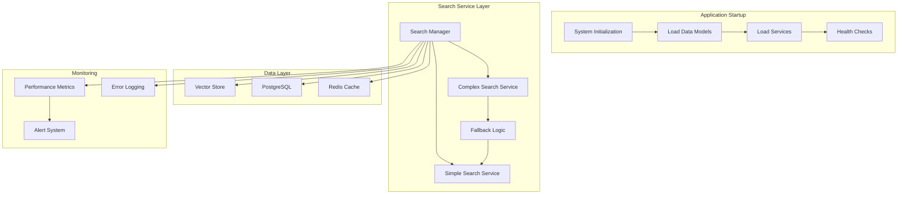
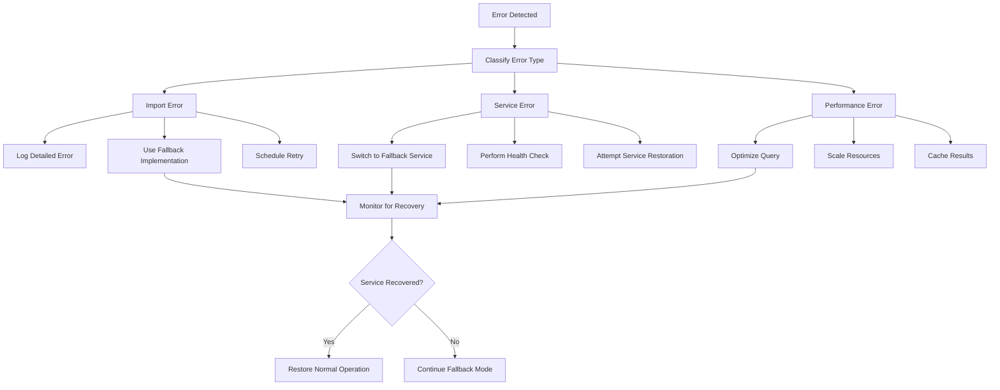

# System Integration and Stability Requirements

## Overview

Following the successful resolution of circular import issues in the vector store components, this specification defines the requirements for ensuring complete system integration, stability, and production readiness. The focus is on validating that all components work together seamlessly and addressing any remaining integration gaps.

## Current State Analysis

### What's Working ✅
- **Circular Import Resolution**: Vector store components now load without circular dependencies
- **Search Service Architecture**: Fallback pattern implemented with simple and complex search services
- **Component Isolation**: Search types properly separated to avoid import conflicts
- **Backward Compatibility**: Legacy interfaces maintained during refactoring

### What Needs Validation 🔍
- **End-to-End Integration**: Complete workflow from document upload to search results
- **Component Interactions**: All services working together without conflicts
- **Performance Impact**: Ensuring refactoring didn't degrade performance
- **Error Handling**: Robust error recovery across all components

### What's Missing ❌
- **Integration Testing**: Comprehensive tests for component interactions
- **Performance Validation**: Benchmarks for search service performance
- **Production Readiness**: Final validation for deployment stability
- **Documentation Updates**: Reflecting the new architecture

## User Experience Vision

### Complete Workflow Validation
1. **Document Upload**: User uploads PDF → Processing → Vector storage → Search availability
2. **Search Operations**: User queries → Vector search → Results with citations
3. **Chat Integration**: AI chat → Document context retrieval → Response generation
4. **Error Recovery**: System handles failures gracefully without cascading issues

### Key Success Criteria
- **Zero Import Errors**: All components load successfully on startup
- **Consistent Performance**: Search operations maintain sub-second response times
- **Reliable Integration**: All services communicate without failures
- **Graceful Degradation**: System continues operating when individual components fail

## Requirements

### Requirement 1: Component Integration Validation

**User Story:** As a system administrator, I want to ensure all components work together seamlessly after the circular import fix, so that the system operates reliably in production.

#### Acceptance Criteria
1. WHEN the system starts up, ALL components SHALL load without import errors
2. WHEN documents are uploaded, THE vector store SHALL successfully index content
3. WHEN searches are performed, THE search service SHALL return accurate results
4. WHEN AI chat is used, THE system SHALL retrieve relevant document context
5. WHEN errors occur, THE system SHALL handle them gracefully without cascading failures

#### Technical Specifications
```python
# Integration Test Coverage
INTEGRATION_TESTS = {
    "startup_sequence": "Validate all components load correctly",
    "document_pipeline": "Upload → Process → Index → Search workflow",
    "search_operations": "Vector search, hybrid search, filtered search",
    "chat_integration": "AI chat with document context retrieval",
    "error_scenarios": "Component failures and recovery"
}

# Performance Benchmarks
PERFORMANCE_TARGETS = {
    "startup_time": "< 30 seconds for complete system initialization",
    "search_latency": "< 500ms for vector search operations",
    "document_processing": "< 2 minutes per MB for PDF processing",
    "memory_usage": "< 2GB baseline memory consumption"
}
```

### Requirement 2: Search Service Stability

**User Story:** As a user, I want search operations to be fast and reliable, so that I can quickly find relevant information from my documents.

#### Acceptance Criteria
1. WHEN performing vector searches, THE system SHALL return results within 500ms
2. WHEN the complex search service fails, THE system SHALL fallback to simple search
3. WHEN handling concurrent searches, THE system SHALL maintain performance
4. WHEN search results are returned, THEY SHALL include proper citations and metadata
5. THE search service SHALL handle malformed queries gracefully

#### Search Service Architecture
```python
class SearchServiceManager:
    """Manages search service selection and fallback logic."""
    
    def __init__(self):
        self.complex_service = None
        self.simple_service = SimpleSemanticSearchService()
        self.fallback_active = False
    
    async def search(self, query: SearchQuery) -> SearchResponse:
        """Perform search with automatic fallback."""
        try:
            if self.complex_service and not self.fallback_active:
                return await self.complex_service.search(query)
        except Exception as e:
            logger.warning(f"Complex search failed, falling back: {e}")
            self.fallback_active = True
        
        # Use simple service as fallback
        return await self.simple_service.search(query)
```

### Requirement 3: Error Handling and Recovery

**User Story:** As a system operator, I want the system to handle errors gracefully and recover automatically, so that users experience minimal disruption.

#### Acceptance Criteria
1. WHEN import errors occur, THE system SHALL log detailed error information
2. WHEN services fail, THE system SHALL attempt automatic recovery
3. WHEN fallback services are used, THE system SHALL notify administrators
4. WHEN errors are resolved, THE system SHALL automatically resume normal operation
5. THE system SHALL maintain service availability during component failures

#### Error Handling Strategy
```python
# Error Categories and Responses
ERROR_HANDLING = {
    "import_errors": {
        "detection": "Module import failure during startup",
        "response": "Log error, use fallback implementation",
        "recovery": "Retry import after dependency resolution"
    },
    "service_failures": {
        "detection": "Service method exceptions",
        "response": "Switch to fallback service",
        "recovery": "Health check and service restoration"
    },
    "performance_degradation": {
        "detection": "Response time threshold exceeded",
        "response": "Scale resources or optimize queries",
        "recovery": "Performance monitoring and tuning"
    }
}
```

### Requirement 4: Performance Optimization

**User Story:** As a user, I want the system to perform efficiently even with large document collections, so that search and chat operations remain responsive.

#### Acceptance Criteria
1. WHEN the system has 1000+ documents, SEARCH operations SHALL complete within 1 second
2. WHEN multiple users search simultaneously, THE system SHALL maintain response times
3. WHEN memory usage exceeds thresholds, THE system SHALL optimize resource usage
4. WHEN processing large documents, THE system SHALL provide progress feedback
5. THE system SHALL cache frequently accessed data to improve performance

#### Performance Monitoring
```python
# Performance Metrics Collection
PERFORMANCE_METRICS = {
    "search_latency": "Track search response times",
    "memory_usage": "Monitor system memory consumption",
    "cpu_utilization": "Track processing resource usage",
    "cache_hit_rate": "Measure caching effectiveness",
    "concurrent_users": "Monitor simultaneous user sessions"
}

# Optimization Strategies
OPTIMIZATION_STRATEGIES = {
    "result_caching": "Cache frequent search results",
    "connection_pooling": "Reuse database connections",
    "batch_processing": "Group operations for efficiency",
    "lazy_loading": "Load components on demand",
    "resource_scaling": "Auto-scale based on load"
}
```

### Requirement 5: Production Readiness Validation

**User Story:** As a deployment engineer, I want to validate that the system is ready for production deployment, so that users have a reliable and stable experience.

#### Acceptance Criteria
1. WHEN deployed to production, THE system SHALL start successfully within 60 seconds
2. WHEN under production load, THE system SHALL maintain 99.9% uptime
3. WHEN errors occur, THE system SHALL provide detailed logging for troubleshooting
4. WHEN scaling is needed, THE system SHALL support horizontal scaling
5. THE system SHALL pass all integration and performance tests

#### Production Validation Checklist
```python
# Production Readiness Criteria
PRODUCTION_CHECKLIST = {
    "startup_validation": [
        "All services start without errors",
        "Database connections established",
        "Vector store accessible",
        "AI services responding"
    ],
    "performance_validation": [
        "Search latency under 500ms",
        "Document processing under 2min/MB",
        "Memory usage under 2GB baseline",
        "CPU usage under 70% average"
    ],
    "reliability_validation": [
        "Error handling working correctly",
        "Fallback services functional",
        "Recovery mechanisms tested",
        "Monitoring and alerting active"
    ],
    "security_validation": [
        "Authentication working",
        "Data encryption enabled",
        "Access controls enforced",
        "Audit logging active"
    ]
}
```

### Requirement 6: Documentation and Monitoring

**User Story:** As a system administrator, I want comprehensive documentation and monitoring, so that I can maintain and troubleshoot the system effectively.

#### Acceptance Criteria
1. WHEN components are updated, THE documentation SHALL reflect the changes
2. WHEN the system is running, MONITORING SHALL provide real-time status information
3. WHEN issues occur, THE logs SHALL contain sufficient information for diagnosis
4. WHEN performance degrades, THE system SHALL alert administrators
5. THE system SHALL provide health check endpoints for all major components

#### Monitoring and Documentation
```python
# Health Check Endpoints
HEALTH_CHECKS = {
    "/health/startup": "Overall system startup status",
    "/health/search": "Search service availability",
    "/health/vector-store": "Vector database connectivity",
    "/health/ai-services": "AI service responsiveness",
    "/health/performance": "Performance metrics summary"
}

# Documentation Requirements
DOCUMENTATION_UPDATES = {
    "architecture_diagrams": "Updated component relationships",
    "api_documentation": "Search service API changes",
    "deployment_guides": "Production deployment procedures",
    "troubleshooting_guides": "Common issues and solutions",
    "performance_tuning": "Optimization recommendations"
}
```

## Technical Architecture

### Component Integration Flow


### Error Recovery Flow


## Success Metrics

### Integration Metrics
- **Startup Success Rate**: 100% successful system initialization
- **Component Load Time**: < 30 seconds for all components
- **Integration Test Pass Rate**: 100% of integration tests passing
- **Error Recovery Rate**: > 95% automatic recovery from failures

### Performance Metrics
- **Search Latency**: < 500ms average response time
- **Document Processing Speed**: < 2 minutes per MB
- **Memory Efficiency**: < 2GB baseline memory usage
- **Concurrent User Support**: 50+ simultaneous users

### Reliability Metrics
- **System Uptime**: > 99.9% availability
- **Error Rate**: < 0.1% of operations result in errors
- **Fallback Activation**: < 1% of searches require fallback
- **Recovery Time**: < 5 minutes average recovery from failures

## Implementation Phases

### Phase 1: Integration Testing (Week 1)
- Implement comprehensive integration tests
- Validate component interactions
- Test error scenarios and recovery
- Performance baseline establishment

### Phase 2: Performance Optimization (Week 2)
- Optimize search service performance
- Implement caching strategies
- Resource usage optimization
- Load testing and tuning

### Phase 3: Error Handling Enhancement (Week 3)
- Robust error detection and classification
- Automatic recovery mechanisms
- Fallback service improvements
- Monitoring and alerting setup

### Phase 4: Production Validation (Week 4)
- Production deployment testing
- Stress testing and validation
- Documentation updates
- Final performance verification

### Phase 5: Monitoring and Maintenance (Week 5)
- Comprehensive monitoring setup
- Performance dashboard creation
- Maintenance procedures documentation
- Long-term stability validation

## Risk Mitigation

### Technical Risks
- **Performance Regression**: Continuous performance monitoring and benchmarking
- **Integration Failures**: Comprehensive testing and gradual rollout
- **Resource Exhaustion**: Resource monitoring and automatic scaling
- **Service Dependencies**: Fallback services and graceful degradation

### Operational Risks
- **Deployment Issues**: Staged deployment with rollback capabilities
- **Monitoring Gaps**: Comprehensive health checks and alerting
- **Documentation Lag**: Automated documentation generation
- **Maintenance Complexity**: Simplified operational procedures

This specification ensures that the system is fully integrated, stable, and ready for production use following the successful resolution of the circular import issues.