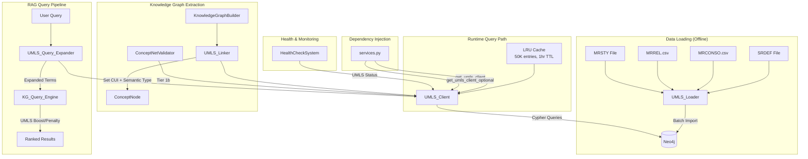
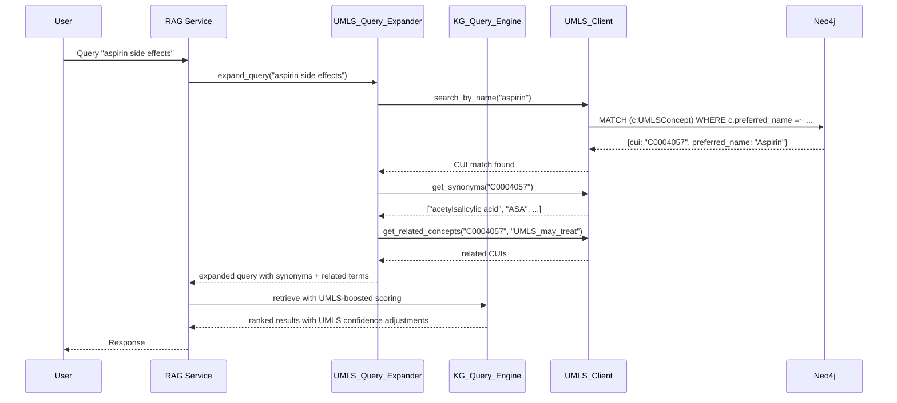

# Design Document: UMLS Knowledge Graph Integration

## Overview

This design integrates the UMLS (Unified Medical Language System) into the Multimodal Librarian's existing Neo4j knowledge graph. The integration follows a tiered approach:

- **Lite Tier**: Loads 127 semantic types and 54 relationship types from the UMLS Semantic Network (SRDEF file). Negligible memory footprint. Enables semantic type classification and validation.
- **Full Tier**: Loads concept nodes from MRCONSO and relationships from MRREL. Default subset mode loads SNOMEDCT_US + MeSH + RXNORM (~500K-800K nodes) to fit within the current Docker memory budget (Neo4j has 1G initial heap, 2G max heap, 1G pagecache within a 12.35GB Docker Desktop allocation).

The system introduces four new components:
1. **UMLS_Loader** — CLI/script-based tool for preprocessing and bulk-loading UMLS data files into Neo4j
2. **UMLS_Client** — Async query client for UMLS data in Neo4j, following the ConceptNetClient/YagoLocalClient pattern
3. **UMLS_Linker** — Links document-extracted concepts to UMLS CUIs during knowledge graph extraction
4. **UMLS_Query_Expander** — Expands RAG queries using UMLS synonyms and related concepts

All UMLS data in Neo4j is namespaced with `UMLS` prefixes (`UMLSSemanticType`, `UMLSConcept`, `UMLS_*` relationships) to isolate from document concepts, ConceptNet, and YAGO data. The system degrades gracefully when UMLS data is not loaded — all query methods return `None`, linking is skipped, and query expansion passes through unchanged.

## Architecture



### Component Interaction Flow



## Components and Interfaces

### 1. UMLS_Loader (`src/multimodal_librarian/components/knowledge_graph/umls_loader.py`)

Offline data loading tool. Not part of the runtime request path.

```python
class UMLSLoader:
    def __init__(self, neo4j_client: Any) -> None: ...

    # Lite Tier
    async def load_semantic_network(self, srdef_path: str) -> LoadResult: ...

    # Full Tier
    async def load_concepts(
        self, mrconso_path: str, mrsty_path: str,
        source_vocabs: Optional[List[str]] = None,
        batch_size: int = 5000,
        memory_limit_mb: Optional[int] = None,
    ) -> LoadResult: ...

    async def load_relationships(
        self, mrrel_path: str,
        source_vocabs: Optional[List[str]] = None,
        batch_size: int = 10000,
    ) -> LoadResult: ...

    # Dry Run
    async def dry_run(
        self, mrconso_path: str, mrrel_path: str,
        source_vocabs: Optional[List[str]] = None,
    ) -> DryRunResult: ...

    # Management
    async def create_indexes(self) -> None: ...
    async def remove_all_umls_data(self) -> None: ...
    async def get_umls_stats(self) -> UMLSStats: ...
    async def resume_import(self, mrconso_path: str, **kwargs) -> LoadResult: ...
```

**LoadResult** and **DryRunResult** are dataclasses returned by the loader:

```python
@dataclass
class LoadResult:
    nodes_created: int
    relationships_created: int
    batches_completed: int
    batches_failed: int
    elapsed_seconds: float
    resumed_from_batch: Optional[int] = None

@dataclass
class DryRunResult:
    estimated_nodes: int
    estimated_relationships: int
    estimated_memory_mb: float
    recommended_vocabs: Optional[List[str]] = None
    fits_in_budget: bool = True

@dataclass
class UMLSStats:
    concept_count: int
    semantic_type_count: int
    relationship_count: int
    loaded_tier: str  # "none", "lite", "full"
    umls_version: Optional[str] = None
    load_timestamp: Optional[str] = None
```

### 2. UMLS_Client (`src/multimodal_librarian/components/knowledge_graph/umls_client.py`)

Async query client following the ConceptNetClient pattern. Registered in DI.

```python
class UMLSClient:
    def __init__(self, neo4j_client: Any, cache_ttl: int = 3600, cache_max_size: int = 50000) -> None: ...

    async def initialize(self) -> None: ...
    async def is_available(self) -> bool: ...
    async def get_loaded_tier(self) -> str: ...

    # Core lookups
    async def lookup_by_cui(self, cui: str) -> Optional[Dict[str, Any]]: ...
    async def search_by_name(self, name: str) -> Optional[List[Dict[str, Any]]]: ...
    async def get_synonyms(self, cui: str) -> Optional[List[str]]: ...
    async def get_semantic_types(self, cui: str) -> Optional[List[str]]: ...
    async def get_related_concepts(
        self, cui: str, relationship_type: Optional[str] = None, limit: int = 20,
    ) -> Optional[List[Dict[str, Any]]]: ...
    async def batch_search_by_names(self, names: List[str]) -> Optional[Dict[str, str]]: ...
```

All methods return `None` when Neo4j is unavailable or UMLS data is not loaded. Query latency is logged via `structlog`.

### 3. UMLS_Linker (`src/multimodal_librarian/components/knowledge_graph/umls_linker.py`)

Integrates into the `KnowledgeGraphBuilder.process_knowledge_chunk_async` pipeline.

```python
class UMLSLinker:
    def __init__(self, umls_client: Optional["UMLSClient"]) -> None: ...

    async def link_concepts(
        self, concepts: List[ConceptNode], document_context: Optional[str] = None,
    ) -> List[ConceptNode]: ...
```

When `umls_client` is `None` or unavailable, `link_concepts` returns the input list unchanged.

### 4. UMLS_Query_Expander (`src/multimodal_librarian/components/knowledge_graph/umls_query_expander.py`)

Integrates into the RAG query pipeline.

```python
@dataclass
class ExpandedTerm:
    term: str
    weight: float  # 0.3 to 0.8
    source: str    # "synonym" or "related"
    cui: Optional[str] = None

class UMLSQueryExpander:
    def __init__(self, umls_client: Optional["UMLSClient"]) -> None: ...

    async def expand_query(
        self, query_terms: List[str], max_synonyms: int = 5,
    ) -> List[ExpandedTerm]: ...
```

When `umls_client` is `None`, returns an empty list (no expansion).

### 5. Modifications to Existing Components

**ConceptNetValidator** — Add Tier 1b (UMLS) between Tier 1 (ConceptNet) and Tier 2 (NER):
- Add `umls_client` as an optional constructor parameter
- Add `kept_by_umls: int = 0` field to `ValidationResult`
- In `validate_concepts`, after ConceptNet batch lookup, check unmatched concepts against UMLS via `batch_search_by_names`

**KG_Query_Engine** — Add UMLS semantic type boosting:
- Accept optional `umls_client` via DI
- In `_rerank_by_concept_relevance`, apply 1.2x multiplier for UMLS-grounded concepts matching query domain
- Apply 0.7x penalty for semantic type contradictions

**Dependency Injection (services.py)** — Add:
- `get_umls_client()` — required variant, raises if unavailable
- `get_umls_client_optional()` — returns `None` if unavailable

**Health Check** — Register a UMLS health check that reports loaded tier, concept count, and relationship count.

## Data Models

### Neo4j Node Labels and Relationships

```mermaid
graph LR
    subgraph "UMLS Namespace"
        ST[UMLSSemanticType<br/>type_id, type_name,<br/>definition, tree_number]
        C[UMLSConcept<br/>cui, preferred_name,<br/>synonyms, source_vocabulary,<br/>suppressed]
        M[UMLSMetadata<br/>umls_version, load_timestamp,<br/>loaded_tier, last_batch_number,<br/>import_status]
    end

    C -->|HAS_SEMANTIC_TYPE| ST
    ST -->|UMLS_SEMANTIC_REL<br/>relation_name, relation_inverse,<br/>definition| ST
    C -->|UMLS_{rel_type}<br/>rel_type, rela_type,<br/>source_vocabulary, cui_pair| C
```

### Neo4j Schema Details

**UMLSSemanticType Node:**
| Property | Type | Description |
|----------|------|-------------|
| `type_id` | String | e.g., "T121" |
| `type_name` | String | e.g., "Pharmacologic Substance" |
| `definition` | String | Semantic type definition |
| `tree_number` | String | Hierarchy position |

**UMLSConcept Node:**
| Property | Type | Description |
|----------|------|-------------|
| `cui` | String | Concept Unique Identifier, e.g., "C0004057" |
| `preferred_name` | String | Preferred term (TS=P, STT=PF) |
| `synonyms` | List[String] | Additional names for this CUI |
| `source_vocabulary` | String | Primary SAB |
| `suppressed` | Boolean | UMLS suppression flag |

**UMLSMetadata Singleton Node:**
| Property | Type | Description |
|----------|------|-------------|
| `umls_version` | String | e.g., "2024AA" |
| `load_timestamp` | String | ISO 8601 timestamp |
| `loaded_tier` | String | "none", "lite", "full" |
| `last_batch_number` | Integer | For resume support |
| `import_status` | String | "complete", "in_progress", "failed" |

**UMLS_SEMANTIC_REL Edge (between UMLSSemanticType nodes):**
| Property | Type | Description |
|----------|------|-------------|
| `relation_name` | String | e.g., "treats" |
| `relation_inverse` | String | e.g., "treated_by" |
| `definition` | String | Relationship definition |

**UMLS_{rel_type} Edge (between UMLSConcept nodes):**
| Property | Type | Description |
|----------|------|-------------|
| `rel_type` | String | REL field value |
| `rela_type` | String | RELA field value |
| `source_vocabulary` | String | SAB |
| `cui_pair` | String | "C0004057-C0015967" |

**HAS_SEMANTIC_TYPE Edge (UMLSConcept → UMLSSemanticType):**
No additional properties.

### Neo4j Indexes

Created before data import:
- `CREATE INDEX umls_concept_cui FOR (c:UMLSConcept) ON (c.cui)`
- `CREATE INDEX umls_concept_name FOR (c:UMLSConcept) ON (c.preferred_name)`
- `CREATE INDEX umls_semtype_id FOR (s:UMLSSemanticType) ON (s.type_id)`

### Python Dataclass Extensions

**ValidationResult** — Add field:
```python
kept_by_umls: int = 0
```

**ExpandedTerm** — New dataclass (shown in Components section above).

**LoadResult, DryRunResult, UMLSStats** — New dataclasses (shown in Components section above).

### Existing Model Usage

The `ConceptNode.external_ids` dictionary gains a new key `"umls_cui"` storing the matched CUI string. The `ConceptNode.concept_type` field may be updated from `"ENTITY"` to a UMLS semantic type name (e.g., `"Pharmacologic Substance"`) when a UMLS match is found and the current type is the default.

### LRU Cache Structure

The `UMLSClient` maintains an in-memory LRU cache:
- Key: `(method_name, *args)` tuple
- Value: query result
- Max size: 50,000 entries (configurable)
- TTL: 1 hour (configurable)
- Eviction: LRU when size exceeded

Python's `functools.lru_cache` is not suitable for async methods with TTL. Use `cachetools.TTLCache` with a wrapper, or a simple dict-based LRU with timestamp tracking.


## Correctness Properties

*A property is a characteristic or behavior that should hold true across all valid executions of a system — essentially, a formal statement about what the system should do. Properties serve as the bridge between human-readable specifications and machine-verifiable correctness guarantees.*

### Property 1: Semantic Network Loading Round-Trip

*For any* valid SRDEF input containing semantic type definitions and relationship definitions, loading the data into Neo4j and then querying back all `UMLSSemanticType` nodes and `UMLS_SEMANTIC_REL` edges should produce records with all required properties (`type_id`, `type_name`, `definition`, `tree_number` for types; `relation_name`, `relation_inverse`, `definition` for relationships), all using UMLS-prefixed labels.

**Validates: Requirements 1.1, 1.2, 1.3, 1.4, 1.6**

### Property 2: Concept Loading Round-Trip

*For any* valid MRCONSO input with English-language entries, loading the data into Neo4j and then querying back `UMLSConcept` nodes should produce records containing all required properties (`cui`, `preferred_name`, `source_vocabulary`, `suppressed`) matching the input data.

**Validates: Requirements 2.1, 2.3**

### Property 3: Concept Loading Filters Only English Terms from Specified Vocabularies

*For any* MRCONSO input containing a mix of English and non-English entries across multiple source vocabularies, loading with a specified vocabulary subset should produce only `UMLSConcept` nodes whose `source_vocabulary` is in the specified set, and no nodes from non-English (LAT ≠ ENG) entries should be present.

**Validates: Requirements 2.2, 2.6**

### Property 4: Synonym Aggregation Under Same CUI

*For any* CUI that has multiple MRCONSO rows with different names, after loading, the `UMLSConcept` node for that CUI should have the preferred term (TS=P, STT=PF) as `preferred_name` and all other names in the `synonyms` list.

**Validates: Requirements 2.4**

### Property 5: Batch Size Does Not Affect Final State

*For any* valid MRCONSO/MRREL input and any two different batch sizes, loading the same data with each batch size should produce identical sets of nodes and relationships in Neo4j.

**Validates: Requirements 2.5, 3.4**

### Property 6: Relationship Loading Round-Trip with Semantic Type Mapping

*For any* valid MRREL input and MRSTY input where source and target CUIs exist in the loaded concept set, loading relationships and semantic type mappings into Neo4j and querying back should produce edges with all required properties (`rel_type`, `rela_type`, `source_vocabulary`, `cui_pair`) using `UMLS_` prefixed edge types, and `HAS_SEMANTIC_TYPE` edges matching the MRSTY mappings.

**Validates: Requirements 2.7, 3.1, 3.3, 3.5**

### Property 7: Dangling Relationships Are Skipped

*For any* MRREL entry where both the source CUI and target CUI are absent from the loaded concept set, no corresponding edge should exist in Neo4j after loading.

**Validates: Requirements 3.6**

### Property 8: Client Query Round-Trip

*For any* loaded `UMLSConcept` with known CUI, preferred name, synonyms, semantic types, and relationships, calling `lookup_by_cui`, `search_by_name` (case-insensitive), `get_synonyms`, `get_semantic_types`, and `get_related_concepts` should each return data consistent with what was loaded.

**Validates: Requirements 4.1, 4.2, 4.3, 4.4, 4.5**

### Property 9: Batch Search Consistency

*For any* set of concept names that exist in the loaded UMLS data, `batch_search_by_names(names)` should return the same CUI mapping as calling `search_by_name` individually for each name.

**Validates: Requirements 4.6**

### Property 10: Graceful Degradation — All Components Return Passthrough When UMLS Unavailable

*For any* query input, when the UMLS client is unavailable (Neo4j down or UMLS not loaded): `UMLSClient` methods return `None`, `UMLSLinker.link_concepts` returns the input list unchanged, `UMLSQueryExpander.expand_query` returns an empty expansion list, and `KG_Query_Engine` scoring is identical to non-UMLS behavior.

**Validates: Requirements 4.7, 5.6, 7.5, 8.4, 9.2, 9.3, 9.4**

### Property 11: Linker Sets CUI and Updates Semantic Type for Default-Typed Concepts

*For any* list of `ConceptNode` objects where some names match loaded UMLS concepts, after `link_concepts`: matched concepts should have `external_ids["umls_cui"]` set to the correct CUI, and concepts with `concept_type == "ENTITY"` should have `concept_type` updated to the UMLS semantic type name. Concepts with non-default `concept_type` should retain their original type.

**Validates: Requirements 5.2, 5.3**

### Property 12: UMLS Validation Tier Counts Are Consistent

*For any* set of candidate concepts where some match UMLS but not ConceptNet, after `validate_concepts`: those concepts should appear in `validated_concepts`, and `kept_by_umls` should equal the count of concepts validated exclusively by UMLS matching (not by ConceptNet, NER, or pattern).

**Validates: Requirements 6.1, 6.2, 6.4**

### Property 13: Query Expansion Invariants

*For any* query term that matches a loaded UMLS concept, `expand_query` should return `ExpandedTerm` entries where: synonym-sourced terms number at most 5, all term weights are in the range [0.3, 0.8], and the result includes both synonym and related-concept expansions when available.

**Validates: Requirements 7.1, 7.2, 7.3, 7.4**

### Property 14: UMLS Semantic Type Scoring Adjustments

*For any* biomedical query and set of retrieved concepts with UMLS semantic types, concepts whose semantic type matches the query domain should have confidence multiplied by 1.2, and concepts whose semantic type contradicts the query domain should have confidence multiplied by 0.7, relative to their base score.

**Validates: Requirements 8.1, 8.2, 8.3**

### Property 15: Dry-Run Estimates Are Non-Negative and Proportional

*For any* valid MRCONSO/MRREL input files, `dry_run` should return non-negative estimates for nodes, relationships, and memory. When estimated memory exceeds the configured limit, `fits_in_budget` should be `False` and `recommended_vocabs` should be non-empty.

**Validates: Requirements 10.1, 10.2, 10.5**

### Property 16: Remove All Clears UMLS Data Completely

*For any* Neo4j state containing loaded UMLS data, after calling `remove_all_umls_data`, querying for `UMLSConcept` nodes, `UMLSSemanticType` nodes, and `UMLS_*` relationships should all return zero results.

**Validates: Requirements 11.1**

### Property 17: Version Replacement Removes Previous Data

*For any* two distinct UMLS versions loaded sequentially, after loading version B, only version B's data and metadata should exist in Neo4j — no nodes or relationships from version A should remain.

**Validates: Requirements 11.4**

### Property 18: Resume Produces Same Final State as Uninterrupted Load

*For any* valid input, loading N batches, simulating interruption, then resuming should produce the same final set of nodes and relationships as an uninterrupted load of the same input. The `UMLSMetadata.last_batch_number` should reflect the most recently completed batch.

**Validates: Requirements 11.5, 12.3, 12.4**

### Property 19: Malformed Rows and Failed Batches Do Not Block Valid Data

*For any* input containing a mix of valid and malformed rows, after loading, all valid rows should be present as nodes/relationships in Neo4j, and malformed rows should be skipped without stopping the import.

**Validates: Requirements 12.2, 12.5**

### Property 20: Cache Size Never Exceeds Maximum and Returns Consistent Results

*For any* sequence of `UMLSClient` lookups, the internal cache size should never exceed `cache_max_size`. Repeated lookups for the same CUI within the TTL window should return the same result as the first lookup.

**Validates: Requirements 13.3, 13.4**

## Error Handling

### UMLS_Loader Errors

| Error Scenario | Handling |
|---|---|
| SRDEF/MRCONSO/MRREL file not found | Raise `FileNotFoundError` with descriptive message including expected path |
| Malformed CSV row | Log warning with row number and content, skip row, continue processing |
| Neo4j connection failure during batch | Retry up to 3 times with exponential backoff (1s, 2s, 4s). After 3 failures, log error with batch number, record the last successful batch in `UMLSMetadata`, continue to next batch |
| Memory limit exceeded (dry-run) | Return `DryRunResult` with `fits_in_budget=False` and `recommended_vocabs` populated. Do not proceed with import |
| Duplicate CUI in MRCONSO | Merge into existing node — append to synonyms list, do not create duplicate |
| Neo4j transaction timeout | Reduce batch size by 50% and retry the batch |

### UMLS_Client Errors

| Error Scenario | Handling |
|---|---|
| Neo4j unavailable | Return `None` for all query methods. Log warning once (not per-call) |
| UMLS data not loaded | Return `None`. Detected via absence of `UMLSMetadata` node |
| Query timeout | Return `None`, log warning with query details and latency |
| Cache corruption | Clear cache, re-execute query against Neo4j |

### UMLS_Linker Errors

| Error Scenario | Handling |
|---|---|
| UMLS_Client is None | Return input concepts unchanged (passthrough) |
| batch_search_by_names returns None | Skip UMLS linking for this chunk, return concepts unchanged |
| Disambiguation failure (multiple matches, no clear winner) | Use first match by CUI sort order, log info-level message |

### UMLS_Query_Expander Errors

| Error Scenario | Handling |
|---|---|
| UMLS_Client is None | Return empty expansion list |
| get_synonyms returns None | Skip synonym expansion for this term |
| get_related_concepts returns None | Skip related concept expansion for this term |

### Integration Errors

| Error Scenario | Handling |
|---|---|
| DI resolution failure for UMLS_Client | `get_umls_client()` raises, `get_umls_client_optional()` returns `None` |
| Health check cannot reach Neo4j | Report UMLS tier as "none", status as "degraded" |

## Testing Strategy

### Property-Based Testing

Use **Hypothesis** (Python PBT library) for all correctness properties. Each property test runs a minimum of 100 iterations.

Each test is tagged with a comment referencing the design property:
```python
# Feature: umls-knowledge-graph-integration, Property 1: Semantic Network Loading Round-Trip
```

**Generators needed:**
- `srdef_entries()` — generates synthetic SRDEF rows with random type_id, type_name, definition, tree_number
- `mrconso_entries()` — generates synthetic MRCONSO rows with random CUI, names, LAT, TS, STT, SAB
- `mrrel_entries(concept_cuis)` — generates synthetic MRREL rows referencing provided CUIs
- `mrsty_entries(concept_cuis, type_ids)` — generates synthetic MRSTY rows mapping CUIs to type IDs
- `concept_nodes()` — generates `ConceptNode` instances with random names and types
- `query_terms(loaded_names)` — generates query terms, some matching loaded UMLS names

**Neo4j test fixture:** Use a dedicated test Neo4j instance (or testcontainers) that is reset between test runs. For unit-level property tests of the client and linker, mock the Neo4j client.

### Unit Testing

Unit tests cover specific examples, edge cases, and error conditions:

- **Loader**: Empty SRDEF file, MRCONSO with only non-English rows, MRREL with dangling CUIs, malformed rows, resume after interruption
- **Client**: CUI not found, case-insensitive name search, empty synonyms list, unavailable Neo4j
- **Linker**: All concepts match, no concepts match, mixed match/no-match, concept_type already set (non-ENTITY)
- **Query Expander**: No UMLS matches in query, term with no synonyms, term with >5 synonyms (verify truncation)
- **Validator**: Concept passes ConceptNet but not UMLS, passes UMLS but not ConceptNet, passes both, passes neither
- **Scoring**: Biomedical query with matching semantic types, contradicting semantic types, non-biomedical query (no UMLS adjustment)
- **Cache**: TTL expiration, LRU eviction at max size, cache miss

### Integration Testing

- Full load pipeline: SRDEF → MRCONSO → MRSTY → MRREL → verify graph integrity
- End-to-end query: Load subset, extract concepts from a medical PDF chunk, verify CUI linking, run RAG query with expansion
- Graceful degradation: Start system without UMLS data, verify all endpoints work
- Health check: Verify UMLS status reported correctly for none/lite/full tiers

### Test File Organization

```
tests/
├── components/
│   ├── test_umls_loader.py           # Loader unit + property tests
│   ├── test_umls_client.py           # Client unit + property tests
│   ├── test_umls_linker.py           # Linker unit + property tests
│   ├── test_umls_query_expander.py   # Expander unit + property tests
│   └── test_umls_validation.py       # Validator UMLS tier tests
├── integration/
│   └── test_umls_integration.py      # End-to-end integration tests
```
