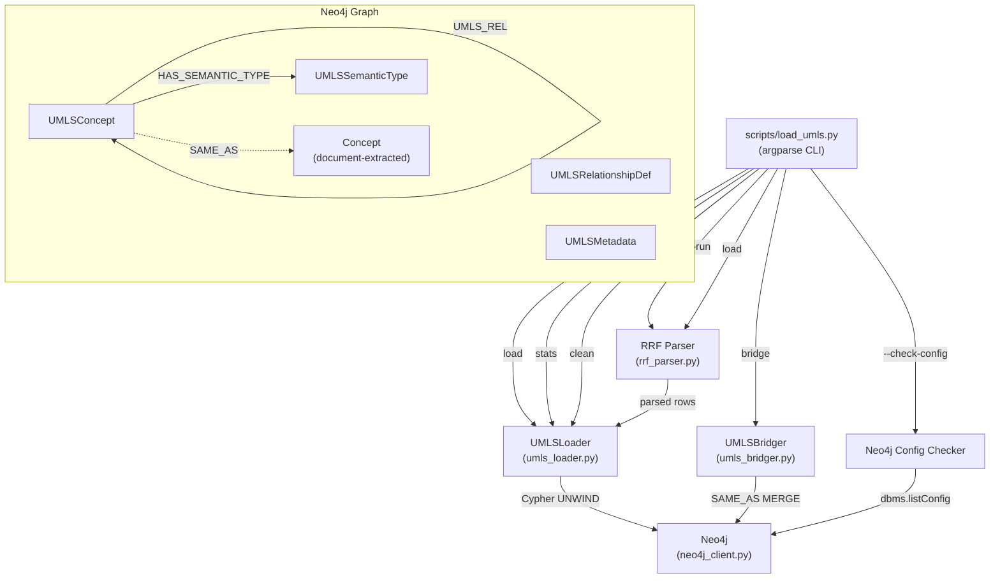
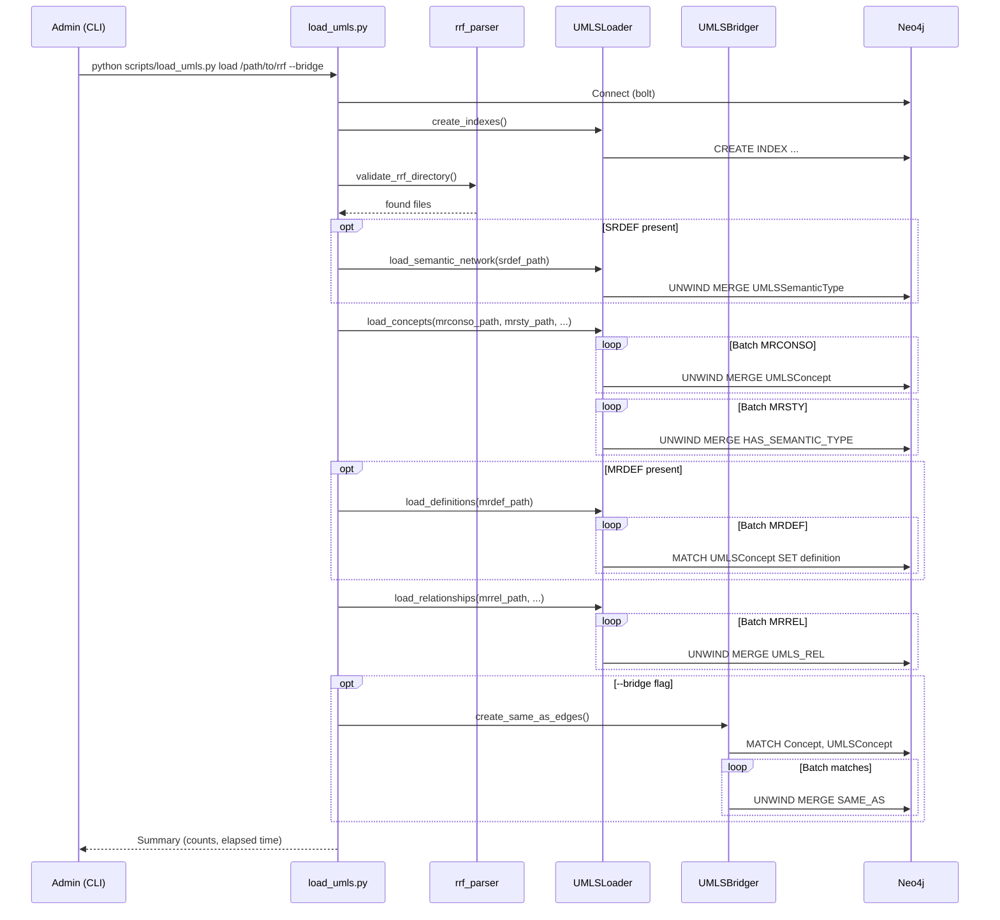

# Design Document: UMLS Knowledge Graph Loader

## Overview

The UMLS Knowledge Graph Loader extends the existing `UMLSLoader` component and introduces a new CLI script (`scripts/load_umls.py`) and a `UMLSBridger` module to provide a production-grade pipeline for ingesting UMLS Metathesaurus data into Neo4j. The pipeline parses RRF files (MRCONSO.RRF, MRREL.RRF, MRSTY.RRF, MRDEF.RRF, SRDEF) extracted by MetamorphoSys, filters to a targeted vocabulary set (SNOMEDCT_US, MSH, ICD10CM, RXNORM, LNC, HPO), batch-loads UMLSConcept nodes and UMLS_REL relationships, and creates SAME_AS bridge edges to document-extracted Concept nodes. The system supports progress tracking with resume-after-interruption, resource-aware operation on a 32 GB RAM machine, and a full cleanup path for re-import.

The existing codebase already contains:
- `UMLSLoader` in `src/multimodal_librarian/components/knowledge_graph/umls_loader.py` — batch Neo4j writes for concepts, relationships, semantic network, dry-run, stats, cleanup, and resume.
- `UMLSClient` in `src/multimodal_librarian/components/knowledge_graph/umls_client.py` — query interface with caching for lookups, synonym retrieval, and batch name search.
- `UMLSLinker` in `src/multimodal_librarian/components/knowledge_graph/umls_linker.py` — links document-extracted ConceptNode instances to UMLS CUIs at extraction time.
- `UMLSQueryExpander` in `src/multimodal_librarian/components/knowledge_graph/umls_query_expander.py` — expands RAG queries using UMLS synonyms.
- `Neo4jClient` in `src/multimodal_librarian/clients/neo4j_client.py` — async Neo4j driver wrapper with `execute_query` and `execute_write_query`.

This design focuses on the gaps: the CLI orchestration layer, RRF parsing refinements (MRDEF support, line-number logging for malformed rows), the SAME_AS bridging module, `--check-config` for Neo4j memory validation, enhanced stats (SAME_AS count), and the `clean` subcommand with confirmation and per-category deletion counts.

## Architecture



### Data Flow

1. **dry-run**: CLI → RRF Parser scans MRCONSO.RRF and MRREL.RRF → reports estimated counts and memory usage.
2. **load**: CLI → RRF Parser streams each file line-by-line → UMLSLoader batches records into Cypher UNWIND MERGE queries → Neo4j. Order: indexes → SRDEF → MRCONSO → MRSTY → MRDEF → MRREL. Optional `--bridge` flag triggers bridging after relationships.
3. **bridge**: CLI → UMLSBridger queries all Concept and UMLSConcept nodes → case-insensitive name matching → SAME_AS MERGE edges.
4. **stats**: CLI → UMLSLoader.get_umls_stats queries Neo4j counts.
5. **clean**: CLI → UMLSLoader.remove_all_umls_data deletes relationships then nodes, with per-category counts.

### Key Design Decisions

1. **Standalone CLI script, not a FastAPI endpoint.** The import is a long-running batch operation (potentially hours). Running it as a CLI script avoids request timeouts, allows direct terminal progress output, and lets the admin run it independently of the application lifecycle.

2. **Extend existing UMLSLoader rather than replace it.** The current implementation already handles concept loading, relationship loading, semantic network, dry-run, stats, cleanup, and resume. We add MRDEF parsing, enhanced stats, per-category deletion counts, and `--check-config` to the existing class.

3. **Separate UMLSBridger module.** SAME_AS bridging is conceptually distinct from RRF loading — it operates on the intersection of UMLS and document-extracted data. A separate module keeps responsibilities clear and allows independent invocation.

4. **Streaming RRF parsing.** All RRF files are read line-by-line to keep memory usage bounded. The only in-memory aggregation is the CUI→concept dict during MRCONSO parsing, which for the targeted 6-vocabulary set is ~500K–800K entries (~1.5 GB peak).

5. **MERGE-based idempotency.** All Cypher writes use MERGE (not CREATE) so re-running any step is safe and produces the same result.

## Components and Interfaces

### 1. CLI Script (`scripts/load_umls.py`)

The entry point uses `argparse` with subcommands. It instantiates a `Neo4jClient` directly (not via FastAPI DI, since this is a standalone script) and delegates to `UMLSLoader` and `UMLSBridger`.

```python
# scripts/load_umls.py — public interface

def main():
    """CLI entry point with subcommands: dry-run, load, bridge, stats, clean."""

# Subcommand handlers:
async def cmd_dry_run(args) -> None
async def cmd_load(args) -> None
async def cmd_bridge(args) -> None
async def cmd_stats(args) -> None
async def cmd_clean(args) -> None
async def cmd_check_config(neo4j_client) -> None
```

**Arguments (load subcommand):**
| Argument | Type | Default | Description |
|---|---|---|---|
| `rrf_dir` | positional str | required | Path to directory containing RRF files |
| `--vocabs` | list[str] | Targeted_Vocabulary_Set | Source vocabularies to include |
| `--batch-size` | int | 5000 | Batch size for concept loading |
| `--rel-batch-size` | int | 10000 | Batch size for relationship loading |
| `--memory-limit` | int | None | Memory limit in MB |
| `--resume` | flag | False | Resume from last checkpoint |
| `--bridge` | flag | False | Run SAME_AS bridging after load |
| `--neo4j-uri` | str | env `NEO4J_URI` | Neo4j bolt URI |
| `--neo4j-user` | str | env `NEO4J_USER` | Neo4j username |
| `--neo4j-password` | str | env `NEO4J_PASSWORD` | Neo4j password |
| `--check-config` | flag | False | Check Neo4j memory configuration |

### 2. RRF Parser (`src/multimodal_librarian/components/knowledge_graph/rrf_parser.py`)

A new module providing pure-function generators for streaming RRF file parsing. Each parser yields typed dicts and handles malformed-row logging with line numbers.

```python
@dataclass
class MRCONSORow:
    cui: str
    lat: str
    ts: str
    stt: str
    sab: str
    str_name: str
    suppress: str

@dataclass
class MRRELRow:
    cui1: str
    rel: str
    cui2: str
    rela: str
    sab: str

@dataclass
class MRSTYRow:
    cui: str
    tui: str

@dataclass
class MRDEFRow:
    cui: str
    sab: str
    definition: str

def parse_mrconso(path: str, source_vocabs: Optional[Set[str]] = None) -> Iterator[MRCONSORow]:
    """Stream MRCONSO.RRF rows, filtering to English and optional vocab set."""

def parse_mrrel(path: str, source_vocabs: Optional[Set[str]] = None) -> Iterator[MRRELRow]:
    """Stream MRREL.RRF rows, filtering to optional vocab set."""

def parse_mrsty(path: str) -> Iterator[MRSTYRow]:
    """Stream MRSTY.RRF rows."""

def parse_mrdef(path: str, source_vocabs: Optional[Set[str]] = None) -> Iterator[MRDEFRow]:
    """Stream MRDEF.RRF rows, filtering to optional vocab set."""

def validate_rrf_directory(rrf_dir: str) -> Tuple[Dict[str, str], List[str]]:
    """Check for required/optional RRF files. Returns (found_files, missing_required)."""
```

### 3. UMLSLoader Extensions (`src/multimodal_librarian/components/knowledge_graph/umls_loader.py`)

Existing class extended with:

```python
class UMLSLoader:
    # Existing methods (unchanged):
    async def create_indexes(self) -> None
    async def load_semantic_network(self, srdef_path: str) -> LoadResult
    async def load_concepts(self, mrconso_path, mrsty_path, ...) -> LoadResult
    async def load_relationships(self, mrrel_path, ...) -> LoadResult
    async def dry_run(self, mrconso_path, mrrel_path, ...) -> DryRunResult
    async def remove_all_umls_data(self) -> None
    async def get_umls_stats(self) -> UMLSStats
    async def resume_import(self, ...) -> LoadResult

    # New/modified methods:
    async def load_definitions(self, mrdef_path: str, source_vocabs: Optional[List[str]] = None, batch_size: int = 5000) -> LoadResult:
        """Load definitions from MRDEF.RRF onto existing UMLSConcept nodes."""

    async def remove_all_umls_data_with_counts(self, include_same_as: bool = True) -> Dict[str, int]:
        """Enhanced cleanup returning per-category deletion counts. Includes SAME_AS edges."""

    async def check_neo4j_config(self) -> Dict[str, Any]:
        """Query Neo4j for heap, page cache, store size. Return config assessment."""
```

**UMLSStats extended:**
```python
@dataclass
class UMLSStats:
    concept_count: int
    semantic_type_count: int
    relationship_count: int
    same_as_count: int          # NEW
    loaded_tier: str
    umls_version: Optional[str] = None
    load_timestamp: Optional[str] = None
```

### 4. UMLSBridger (`src/multimodal_librarian/components/knowledge_graph/umls_bridger.py`)

New module for SAME_AS edge creation.

```python
@dataclass
class BridgeResult:
    concepts_matched: int
    same_as_edges_created: int
    unmatched_concepts: int
    elapsed_seconds: float

class UMLSBridger:
    def __init__(self, neo4j_client: Any) -> None: ...

    async def create_same_as_edges(self, batch_size: int = 1000) -> BridgeResult:
        """Create SAME_AS edges between Concept and UMLSConcept nodes.
        
        1. Query all Concept nodes (concept_name).
        2. Query all UMLSConcept nodes (preferred_name, synonyms).
        3. Case-insensitive exact match on preferred_name and synonyms.
        4. Batch MERGE SAME_AS edges with match_type and created_at properties.
        5. Idempotent via MERGE.
        """
```

### 5. Component Interaction Diagram



## Data Models

### Neo4j Node Labels

| Label | Key Properties | Description |
|---|---|---|
| `UMLSConcept` | `cui` (indexed), `preferred_name` (indexed), `synonyms`, `source_vocabulary`, `suppressed`, `definition` | UMLS Metathesaurus concept |
| `UMLSSemanticType` | `type_id` (indexed), `type_name`, `definition`, `tree_number` | UMLS Semantic Network type |
| `UMLSRelationshipDef` | `rel_id`, `relation_name`, `relation_inverse`, `definition`, `tree_number` | UMLS relationship definition from SRDEF RL records |
| `UMLSMetadata` | `singleton: true`, `loaded_tier`, `load_timestamp`, `umls_version`, `import_status`, `last_batch_number`, `relationship_count` | Singleton tracking node |
| `Concept` | `concept_id`, `concept_name`, `concept_type`, `aliases`, `confidence` | Document-extracted concept (existing) |

### Neo4j Relationship Types

| Type | Source → Target | Properties | Description |
|---|---|---|---|
| `UMLS_REL` | UMLSConcept → UMLSConcept | `rel_type`, `rela_type`, `source_vocabulary`, `edge_type`, `cui_pair` | Clinical relationship from MRREL |
| `HAS_SEMANTIC_TYPE` | UMLSConcept → UMLSSemanticType | — | Concept-to-semantic-type assignment |
| `UMLS_SEMANTIC_REL` | UMLSSemanticType → UMLSSemanticType | `relation_name`, `relation_inverse`, `definition` | Semantic network hierarchy |
| `SAME_AS` | Concept → UMLSConcept | `match_type` ("preferred_name" \| "synonym"), `created_at` | Bridge between document and UMLS concepts |

### Neo4j Indexes

| Index | Target | Purpose |
|---|---|---|
| `UMLSConcept.cui` | Node property | Fast CUI lookups for relationship loading and client queries |
| `UMLSConcept.preferred_name` | Node property | Fast name matching for SAME_AS bridging and search |
| `UMLSSemanticType.type_id` | Node property | Fast TUI lookups for HAS_SEMANTIC_TYPE creation |

### RRF Field Mappings

**MRCONSO.RRF** (18 fields, pipe-delimited):
| Index | Field | Used |
|---|---|---|
| 0 | CUI | ✓ |
| 1 | LAT | ✓ (filter ENG) |
| 2 | TS | ✓ (preferred: P) |
| 4 | STT | ✓ (preferred: PF) |
| 11 | SAB | ✓ (vocab filter) |
| 14 | STR | ✓ (concept name) |
| 16 | SUPPRESS | ✓ |

**MRREL.RRF** (16 fields):
| Index | Field | Used |
|---|---|---|
| 0 | CUI1 | ✓ |
| 3 | REL | ✓ |
| 4 | CUI2 | ✓ |
| 7 | RELA | ✓ |
| 10 | SAB | ✓ (vocab filter) |

**MRSTY.RRF** (6 fields):
| Index | Field | Used |
|---|---|---|
| 0 | CUI | ✓ |
| 1 | TUI | ✓ |

**MRDEF.RRF** (6 fields):
| Index | Field | Used |
|---|---|---|
| 0 | CUI | ✓ |
| 4 | SAB | ✓ (vocab filter) |
| 5 | DEF | ✓ |

### Python Data Classes

```python
# rrf_parser.py
@dataclass
class MRCONSORow:
    cui: str
    lat: str
    ts: str
    stt: str
    sab: str
    str_name: str
    suppress: str

@dataclass
class MRRELRow:
    cui1: str
    rel: str
    cui2: str
    rela: str
    sab: str

@dataclass
class MRSTYRow:
    cui: str
    tui: str

@dataclass
class MRDEFRow:
    cui: str
    sab: str
    definition: str

# umls_bridger.py
@dataclass
class BridgeResult:
    concepts_matched: int
    same_as_edges_created: int
    unmatched_concepts: int
    elapsed_seconds: float

# umls_loader.py (existing, extended)
@dataclass
class LoadResult:
    nodes_created: int
    relationships_created: int
    batches_completed: int
    batches_failed: int
    elapsed_seconds: float
    resumed_from_batch: Optional[int] = None

@dataclass
class DryRunResult:
    estimated_nodes: int
    estimated_relationships: int
    estimated_memory_mb: float
    recommended_vocabs: Optional[List[str]] = None
    fits_in_budget: bool = True

@dataclass
class UMLSStats:
    concept_count: int
    semantic_type_count: int
    relationship_count: int
    same_as_count: int  # NEW
    loaded_tier: str
    umls_version: Optional[str] = None
    load_timestamp: Optional[str] = None
```


## Correctness Properties

*A property is a characteristic or behavior that should hold true across all valid executions of a system — essentially, a formal statement about what the system should do. Properties serve as the bridge between human-readable specifications and machine-verifiable correctness guarantees.*

### Property 1: RRF parsing round trip

*For any* valid RRF row dataclass (MRCONSORow, MRRELRow, MRSTYRow, MRDEFRow), serializing it to a pipe-delimited string with the correct field positions and then parsing that string with the corresponding parser should yield a row with identical field values.

**Validates: Requirements 2.1, 2.4, 2.5, 2.6**

### Property 2: MRCONSO filter invariant

*For any* set of MRCONSO.RRF lines and any source vocabulary filter set, every row yielded by `parse_mrconso` should satisfy LAT = "ENG" AND (SAB ∈ filter set, when a filter is provided). No row violating these conditions should appear in the output.

**Validates: Requirements 2.2, 2.3**

### Property 3: MRREL filter invariant

*For any* set of MRREL.RRF lines and any source vocabulary filter set, every row yielded by `parse_mrrel` should have SAB ∈ filter set when a filter is provided.

**Validates: Requirements 4.3**

### Property 4: Malformed rows are skipped

*For any* RRF file containing a mix of well-formed and malformed rows (fewer fields than expected), the parser should yield exactly the well-formed rows. The count of yielded rows should equal the count of input rows with sufficient fields.

**Validates: Requirements 2.8**

### Property 5: Missing required files raise FileNotFoundError

*For any* directory path that does not contain MRCONSO.RRF or MRREL.RRF, calling `validate_rrf_directory` should report those files as missing, and calling `load_concepts` or `load_relationships` with a non-existent path should raise `FileNotFoundError`.

**Validates: Requirements 2.7**

### Property 6: CUI aggregation selects correct preferred name

*For any* set of MRCONSO rows sharing a CUI where exactly one row has TS="P" and STT="PF", the aggregated concept's `preferred_name` should equal that row's STR value, and all other distinct STR values should appear in `synonyms`.

**Validates: Requirements 3.1**

### Property 7: Loaded UMLSConcept nodes have all required properties

*For any* UMLSConcept node created by `load_concepts`, the node should have non-null `cui`, `preferred_name`, `source_vocabulary`, and `suppressed` properties, and `synonyms` should be a list. The number of UMLSConcept nodes should equal the number of unique CUIs in the filtered input.

**Validates: Requirements 3.2, 3.3**

### Property 8: Definitions are stored on matching concepts

*For any* CUI that has at least one definition row in MRDEF.RRF (after vocab filtering), the corresponding UMLSConcept node should have a non-empty `definition` property after `load_definitions` completes.

**Validates: Requirements 3.4**

### Property 9: No dangling UMLS_REL relationships

*For any* UMLS_REL relationship in the graph, both the source and target nodes should be existing UMLSConcept nodes. No UMLS_REL edge should reference a CUI that was not loaded.

**Validates: Requirements 4.4**

### Property 10: Edge type derivation

*For any* MRREL row, if the RELA field is non-empty, the resulting UMLS_REL edge's `edge_type` property should equal `UMLS_{RELA}`; if RELA is empty, it should equal `UMLS_{REL}`. Additionally, every UMLS_REL edge should have non-null `rel_type`, `rela_type`, `source_vocabulary`, and `edge_type` properties.

**Validates: Requirements 4.5, 4.1, 4.2**

### Property 11: SAME_AS bridging completeness

*For any* Concept node whose `concept_name` case-insensitively matches a UMLSConcept's `preferred_name` or any entry in its `synonyms` list, a SAME_AS edge should exist between them. Each SAME_AS edge should have `match_type` ∈ {"preferred_name", "synonym"} and a non-null `created_at` timestamp.

**Validates: Requirements 5.2, 5.3, 5.5**

### Property 12: SAME_AS bridging idempotence

*For any* graph state, running `create_same_as_edges` twice should produce the same number of SAME_AS edges as running it once. Formally: count(SAME_AS after bridge) = count(SAME_AS after bridge→bridge).

**Validates: Requirements 5.7**

### Property 13: Dry-run produces no side effects

*For any* valid RRF directory, running `dry_run` should not change the count of any node label or relationship type in Neo4j. The returned `DryRunResult` should have `estimated_nodes >= 0` and `estimated_relationships >= 0`.

**Validates: Requirements 1.3**

### Property 14: Memory limit aborts before writing

*For any* RRF dataset whose estimated memory exceeds the provided `--memory-limit`, the loader should return a `LoadResult` with `nodes_created = 0` and should not create any UMLSConcept nodes.

**Validates: Requirements 7.1**

### Property 15: Over-budget dry-run recommends reduced vocabs

*For any* dry-run where `estimated_memory_mb > memory_budget_mb`, the returned `DryRunResult` should have `fits_in_budget = False` and `recommended_vocabs` should be a non-empty list that is a subset of the targeted vocabulary set.

**Validates: Requirements 7.5**

### Property 16: Clean removes all UMLS data

*For any* Neo4j graph state containing UMLS nodes and relationships, after `remove_all_umls_data_with_counts` completes, the counts of UMLSConcept, UMLSSemanticType, UMLSRelationshipDef, UMLSMetadata nodes and UMLS_REL, HAS_SEMANTIC_TYPE, UMLS_SEMANTIC_REL, SAME_AS relationships should all be zero.

**Validates: Requirements 9.1, 1.6**

### Property 17: Batch retry and fault tolerance

*For any* batch sequence where a batch fails transiently, the loader should retry up to 3 times with exponential backoff (1s, 2s, 4s). If all retries are exhausted, the loader should increment `batches_failed`, log the error, and continue processing subsequent batches. The sum of `batches_completed + batches_failed` should equal the total number of batches.

**Validates: Requirements 6.5, 6.6**

### Property 18: Resume skips completed batches

*For any* import interrupted at batch N (with `last_batch_number = N` in UMLSMetadata), resuming should skip the first N batches and process only the remaining batches. The final graph state should be equivalent to a complete fresh import.

**Validates: Requirements 6.3**

### Property 19: Progress checkpoint monotonically increases

*For any* sequence of successful batch writes, the `last_batch_number` on the UMLSMetadata node should monotonically increase, reaching the total batch count upon completion.

**Validates: Requirements 6.1**

### Property 20: Missing SRDEF does not abort import

*For any* RRF directory that contains MRCONSO.RRF and MRREL.RRF but not SRDEF, the `load` subcommand should complete successfully without raising an exception. The semantic network loading step should be skipped.

**Validates: Requirements 10.4**

## Error Handling

### RRF Parsing Errors

| Error Condition | Handling | Recovery |
|---|---|---|
| Required file missing (MRCONSO.RRF, MRREL.RRF) | `FileNotFoundError` raised with file path | User must provide correct RRF directory |
| Optional file missing (MRDEF.RRF, MRSTY.RRF, SRDEF) | Warning logged, step skipped | Import continues without that data |
| Malformed row (fewer fields than expected) | Warning logged with line number, row skipped | Parser continues to next row |
| Empty file | Zero rows yielded, warning logged | Import continues with zero records for that step |

### Neo4j Errors

| Error Condition | Handling | Recovery |
|---|---|---|
| Connection failure at startup | Script exits with error message including URI | User checks Neo4j is running and URI is correct |
| Batch write failure (transient) | Retry up to 3 times with exponential backoff (1s, 2s, 4s) | Batch succeeds on retry |
| Batch write failure (persistent) | Log batch number and error, increment `batches_failed`, continue | Failed batch data is not loaded; user can re-run with `--resume` |
| Transaction timeout | Caught by retry mechanism | Reduce `--batch-size` if persistent |
| Insufficient heap/page cache | `--check-config` warns before import | User adjusts Neo4j memory settings |

### Memory Errors

| Error Condition | Handling | Recovery |
|---|---|---|
| Estimated memory exceeds `--memory-limit` | Import aborted before writing, `import_status` set to `memory_limit_exceeded` | User reduces vocabulary set or increases limit |
| Dry-run exceeds budget | `fits_in_budget = False`, `recommended_vocabs` suggested | User runs with recommended vocabs |
| OOM during MRCONSO aggregation | Python MemoryError (unhandled — streaming mitigates this) | User reduces vocabulary set |

### CLI Errors

| Error Condition | Handling | Recovery |
|---|---|---|
| Unknown subcommand | argparse prints usage and exits | User corrects command |
| Missing required argument (rrf_dir) | argparse prints error and exits | User provides argument |
| `clean` without `--confirm` | Interactive prompt; abort if user declines | User re-runs with `--confirm` or confirms interactively |

## Testing Strategy

### Property-Based Testing

Property-based tests use `hypothesis` (Python's standard PBT library) with a minimum of 100 iterations per property. Each test references its design document property.

**RRF Parser Properties (rrf_parser.py):**
- Property 1: Round-trip parsing — generate random valid RRF row dataclasses, serialize to pipe-delimited, parse back, assert equality.
- Property 2: MRCONSO filter invariant — generate random MRCONSO lines with mixed LAT/SAB values, parse with filters, assert all output rows satisfy filters.
- Property 3: MRREL filter invariant — same pattern for MRREL.
- Property 4: Malformed row skipping — generate files with mixed valid/invalid rows, assert output count equals valid row count.
- Property 5: Missing file errors — generate random non-existent paths, assert FileNotFoundError.

**UMLSLoader Properties (umls_loader.py):**
- Property 6: CUI aggregation — generate random MRCONSO row groups per CUI with one TS=P/STT=PF row, assert preferred_name selection.
- Property 10: Edge type derivation — generate random MRREL rows with/without RELA, assert edge_type format.
- Property 17: Batch retry — mock Neo4j to fail N times then succeed, assert retry count and backoff delays.
- Property 19: Progress checkpoint — mock Neo4j, run batches, assert last_batch_number increases monotonically.

**UMLSBridger Properties (umls_bridger.py):**
- Property 11: Bridging completeness — generate random Concept/UMLSConcept name sets with known overlaps, assert SAME_AS edges for all matches.
- Property 12: Bridging idempotence — run bridge twice, assert same edge count.

**Tag format:** `Feature: umls-knowledge-graph-loader, Property {N}: {title}`

### Unit Tests

Unit tests cover specific examples, edge cases, and integration points. Use `pytest` with `unittest.mock` for Neo4j mocking (consistent with existing `tests/components/test_umls_loader.py` patterns).

**CLI tests:**
- Verify argparse accepts all 5 subcommands (Req 1.1)
- Verify `load` accepts all documented arguments (Req 1.2)
- Verify default vocabulary set is Targeted_Vocabulary_Set (Req 1.7)
- Verify `--neo4j-uri` overrides environment variable (Req 1.8)
- Verify `--check-config` output format (Req 8.1, 8.2)
- Verify `clean` prompts without `--confirm` (Req 9.3)
- Verify load execution order via mock call sequence (Req 10.1)
- Verify `--bridge` flag triggers bridging after load (Req 10.3)

**Loader unit tests (extending existing test_umls_loader.py):**
- `load_definitions` stores definition on matching CUI (Req 3.4)
- `load_definitions` skips CUIs not in loaded set
- `create_indexes` creates all 3 indexes (Req 3.6)
- `get_umls_stats` returns `same_as_count` (Req 1.5)
- `remove_all_umls_data_with_counts` returns per-category counts (Req 9.4)
- `remove_all_umls_data_with_counts` deletes relationships before nodes (Req 9.2)
- `check_neo4j_config` returns heap/page-cache assessment (Req 8.1)
- Default batch sizes: 5000 concepts, 10000 relationships (Req 7.2)
- `import_status` transitions: in_progress → complete (Req 6.2)
- Supported RELA types list (Req 4.6)

**Bridger unit tests:**
- Case-insensitive matching ("Diabetes" matches "diabetes") (Req 5.2)
- Synonym matching (Req 5.3)
- `BridgeResult` contains matched/unmatched/edge counts (Req 5.6)
- No duplicate edges on re-run (Req 5.7)

**Edge cases:**
- Empty RRF files (zero rows)
- CUI with no TS=P/STT=PF row (fallback to first synonym)
- All rows malformed (zero output)
- MRREL with all dangling CUIs (zero edges)
- No Concept nodes in graph (zero SAME_AS edges)
- SRDEF missing (warning, skip, continue)

### Test Configuration

```python
# conftest.py additions
import pytest
from hypothesis import settings

# Register hypothesis profile for CI
settings.register_profile("ci", max_examples=200, deadline=None)
settings.register_profile("dev", max_examples=100, deadline=5000)
settings.load_profile("dev")
```

### Test File Organization

```
tests/
├── components/
│   ├── test_umls_loader.py          # Existing + new unit tests
│   ├── test_umls_bridger.py         # New: UMLSBridger unit tests
│   ├── test_rrf_parser.py           # New: RRF parser unit + property tests
│   └── test_rrf_parser_props.py     # New: RRF parser property-based tests
├── scripts/
│   └── test_load_umls_cli.py        # New: CLI argument parsing tests
```
