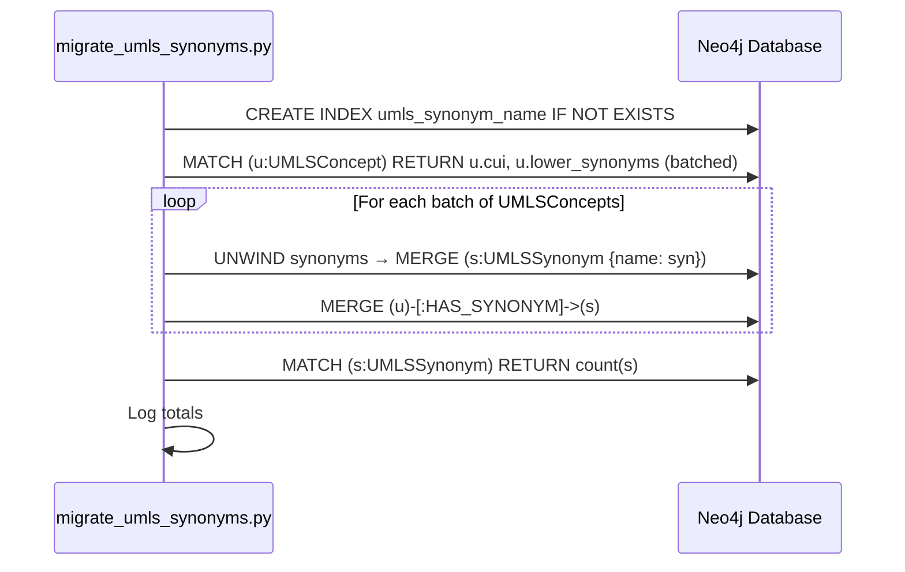

# Design Document: UMLS Synonym Index Optimization

## Overview

The UMLS synonym matching step is the primary bottleneck in the document upload pipeline. The current query `WHERE name IN u.lower_synonyms` performs a full scan of all 1.6M UMLSConcept nodes because Neo4j RANGE indexes cannot index into list properties. This design introduces a separate `UMLSSynonym` node model with a RANGE-indexed `name` property, linked to `UMLSConcept` via `HAS_SYNONYM` relationships. Synonym lookups become index-backed equality matches (`WHERE s.name = name`), reducing UMLS bridging time from ~63 minutes to seconds.

### Key Design Decision: Separate Node vs. Full-Text Index

Two approaches were considered:

1. **Separate UMLSSynonym nodes** (chosen): Create ~2.4M UMLSSynonym nodes with a RANGE-indexed scalar `name` property. Synonym lookups become `MATCH (s:UMLSSynonym {name: name})<-[:HAS_SYNONYM]-(u:UMLSConcept)` — a standard index-backed traversal.

2. **Full-text index on lower_synonyms**: Neo4j full-text indexes can index list properties, but they use Lucene tokenization which breaks multi-word medical terms (e.g., "type 2 diabetes mellitus" would match "type" or "diabetes" individually). Exact synonym matching requires exact string equality, which RANGE indexes provide but full-text indexes do not.

The separate node approach was chosen because it provides exact equality matching via RANGE index, which is the correct semantic for synonym resolution.

## Architecture

```mermaid
graph TD
    subgraph "Current Architecture (slow)"
        A1[Concept Names] -->|UNWIND| B1[UMLSConcept nodes]
        B1 -->|"WHERE name IN u.lower_synonyms<br/>(full scan O(n))"| C1[Matched CUIs]
    end

    subgraph "New Architecture (fast)"
        A2[Concept Names] -->|UNWIND| B2[UMLSSynonym nodes]
        B2 -->|"WHERE s.name = name<br/>(RANGE index O(log n))"| D2[UMLSSynonym match]
        D2 -->|"HAS_SYNONYM traversal"| E2[UMLSConcept]
        E2 --> C2[Matched CUIs]
    end
```



### Affected Components

| Component | File | Change |
|-----------|------|--------|
| UMLSBridger | `umls_bridger.py` | Rewrite synonym query in `_match_concepts_batch` |
| UMLSClient | `umls_client.py` | Rewrite synonym queries in `search_by_name` and `batch_search_by_names` |
| UMLSLoader | `umls_loader.py` | Add UMLSSynonym creation in `create_indexes` and `load_concepts`; add migration method |
| Neo4jClient | `neo4j_client.py` | Add `umls_synonym_name` index in `ensure_indexes` |
| Migration Script | `scripts/migrate_umls_synonyms.py` | New script to create UMLSSynonym nodes from existing data |

### Data Flow: Migration



## Components and Interfaces

### 1. UMLSLoader Changes

**`create_indexes()`** — Add one new index statement:

```python
"CREATE INDEX umls_synonym_name IF NOT EXISTS FOR (s:UMLSSynonym) ON (s.name)"
```

**`load_concepts()`** — After creating UMLSConcept nodes (Pass 2), add a new Pass 2b that creates UMLSSynonym nodes and HAS_SYNONYM relationships from the in-memory `concepts` dict:

```cypher
UNWIND $items AS item
MATCH (u:UMLSConcept {cui: item.cui})
UNWIND item.lower_synonyms AS syn
MERGE (s:UMLSSynonym {name: syn})
MERGE (u)-[:HAS_SYNONYM]->(s)
```

**`migrate_synonyms(batch_size: int = 5000) -> LoadResult`** — New method that reads existing `lower_synonyms` from UMLSConcept nodes and creates UMLSSynonym nodes + HAS_SYNONYM relationships. Uses MERGE for idempotency. Logs counts on completion. Skips failed batches and continues.

### 2. UMLSBridger Changes

**`_match_concepts_batch()`** — Replace the synonym query:

Current:
```cypher
UNWIND $names AS name
MATCH (u:UMLSConcept) WHERE name IN u.lower_synonyms
RETURN name, u.cui AS cui
```

New:
```cypher
UNWIND $names AS name
MATCH (s:UMLSSynonym {name: name})<-[:HAS_SYNONYM]-(u:UMLSConcept)
RETURN name, u.cui AS cui
```

The preferred_name query remains unchanged (already indexed via `lower_name`). The result structure (`concept_name`, `cui`, `match_type`, `created_at`) and deduplication logic remain identical.

### 3. UMLSClient Changes

**`search_by_name()`** — Replace the single combined query:

Current:
```cypher
MATCH (c:UMLSConcept)
WHERE c.lower_name = $lower_name OR $lower_name IN c.lower_synonyms
RETURN c.cui AS cui, c.preferred_name AS preferred_name
```

New (two-phase, both indexed):
```cypher
MATCH (c:UMLSConcept) WHERE c.lower_name = $lower_name
RETURN c.cui AS cui, c.preferred_name AS preferred_name
UNION
MATCH (s:UMLSSynonym {name: $lower_name})<-[:HAS_SYNONYM]-(c:UMLSConcept)
RETURN c.cui AS cui, c.preferred_name AS preferred_name
```

**`batch_search_by_names()`** — Replace Phase 2 synonym query:

Current:
```cypher
UNWIND $names AS name
MATCH (c:UMLSConcept) WHERE name IN c.lower_synonyms
RETURN name, c.cui AS cui
```

New:
```cypher
UNWIND $names AS name
MATCH (s:UMLSSynonym {name: name})<-[:HAS_SYNONYM]-(c:UMLSConcept)
RETURN name, c.cui AS cui
```

### 4. Neo4jClient Changes

**`ensure_indexes()`** — Add one statement to `index_statements`:

```python
"CREATE INDEX umls_synonym_name IF NOT EXISTS FOR (s:UMLSSynonym) ON (s.name)",
```

### 5. Migration Script

**`scripts/migrate_umls_synonyms.py`** — Standalone async script that:
1. Connects to Neo4j using the existing `Neo4jClient`
2. Calls `UMLSLoader.create_indexes()` to ensure the new index exists
3. Calls `UMLSLoader.migrate_synonyms()` to create UMLSSynonym nodes from existing data
4. Logs summary statistics

Can be run via: `python scripts/migrate_umls_synonyms.py` or via docker compose:
```bash
docker compose exec app python scripts/migrate_umls_synonyms.py
```

### 6. _remove_concept_data Changes

The existing `_remove_concept_data()` method in UMLSLoader must also delete UMLSSynonym nodes and HAS_SYNONYM relationships when replacing concept data. Add:

```python
("MATCH ()-[r:HAS_SYNONYM]->() DELETE r", "has_synonym_relationships"),
("MATCH (n:UMLSSynonym) DETACH DELETE n", "umls_synonym_nodes"),
```

Similarly, `remove_all_umls_data()` needs the same additions.

## Data Models

### UMLSSynonym Node

| Property | Type | Indexed | Description |
|----------|------|---------|-------------|
| `name` | String | RANGE (`umls_synonym_name`) | Lowercased synonym string |

### HAS_SYNONYM Relationship

| Direction | From | To | Properties |
|-----------|------|----|------------|
| Outgoing | `UMLSConcept` | `UMLSSynonym` | None |

### Node Cardinality Estimates

- **UMLSConcept nodes**: ~1.6M (unchanged)
- **UMLSSynonym nodes**: ~2.4M (avg ~1.5 synonyms per concept, with MERGE deduplication for shared synonyms)
- **HAS_SYNONYM relationships**: ~2.4M (one per concept-synonym pair)

### Existing Properties Retained

The `synonyms` and `lower_synonyms` list properties on UMLSConcept are retained for backward compatibility. They are not removed by this optimization. Future work may deprecate them once all consumers are confirmed migrated.


## Correctness Properties

*A property is a characteristic or behavior that should hold true across all valid executions of a system — essentially, a formal statement about what the system should do. Properties serve as the bridge between human-readable specifications and machine-verifiable correctness guarantees.*

### Property 1: Synonym Node Completeness

*For any* set of UMLSConcept data with lowercased synonyms, after loading (via `load_concepts`) or migration (via `migrate_synonyms`), every unique lowercased synonym string in the input SHALL have a corresponding `UMLSSynonym` node with `name` equal to that string, and a `HAS_SYNONYM` relationship from the originating `UMLSConcept` to that `UMLSSynonym` node.

**Validates: Requirements 1.1, 1.2, 4.1**

### Property 2: Shared Synonym Deduplication

*For any* two or more UMLSConcept nodes that share the same lowercased synonym string, there SHALL exist exactly one `UMLSSynonym` node with that `name` value, and each sharing UMLSConcept SHALL have its own `HAS_SYNONYM` relationship to that single shared node.

**Validates: Requirements 1.4**

### Property 3: Backward Compatibility of List Properties

*For any* UMLSConcept node, after loading concepts with the new synonym node creation, the `synonyms` and `lower_synonyms` list properties SHALL still be present and contain the same values as the input data.

**Validates: Requirements 1.5**

### Property 4: Query Result Equivalence

*For any* set of concept names and any database state containing UMLSConcept nodes with both `lower_synonyms` list properties and corresponding `UMLSSynonym` nodes, the optimized synonym lookup queries (in `_match_concepts_batch`, `search_by_name`, and `batch_search_by_names`) SHALL return the same set of (name, CUI) pairs as the original list-scanning queries.

**Validates: Requirements 2.2, 3.3, 6.1, 6.2**

### Property 5: Migration Idempotency

*For any* database state, running `migrate_synonyms` twice SHALL produce the same set of `UMLSSynonym` nodes and `HAS_SYNONYM` relationships as running it once. The count of nodes and relationships after the second run SHALL equal the count after the first run.

**Validates: Requirements 4.2**

### Property 6: Migration Count Accuracy

*For any* migration execution, the `LoadResult` returned by `migrate_synonyms` SHALL report `nodes_created` and `relationships_created` counts that match the actual number of `UMLSSynonym` nodes and `HAS_SYNONYM` relationships in the database after migration.

**Validates: Requirements 4.3**

## Error Handling

### Migration Batch Failures (Requirement 4.4)

When a batch fails during `migrate_synonyms`:
- Log the error with batch number and exception details via structlog
- Increment `batches_failed` counter in `LoadResult`
- Continue processing remaining batches
- Return `LoadResult` with accurate `batches_completed` and `batches_failed` counts

This matches the existing pattern in `load_concepts` which already handles batch failures this way.

### Query Failures in Bridger and Client

The existing error handling patterns in `_match_concepts_batch`, `search_by_name`, and `batch_search_by_names` are preserved:
- Each query is wrapped in try/except
- Failures are logged with structlog warnings
- The bridger returns partial results (matches from preferred_name even if synonym query fails)
- The client returns `None` on total failure, partial results otherwise

No changes to error handling behavior — only the Cypher queries inside the try blocks change.

### Index Creation Failures

Both `create_indexes` and `ensure_indexes` use `IF NOT EXISTS` for idempotency. If index creation fails:
- `create_indexes` (UMLSLoader): Exception propagates — this is called before data import, so failure should halt the import
- `ensure_indexes` (Neo4jClient): Logs warning but does not raise — the application can still function with slower queries

### _remove_concept_data Cleanup

When replacing concept data (version upgrade), the new `HAS_SYNONYM` relationships and `UMLSSynonym` nodes must be deleted before `UMLSConcept` nodes. The deletion order is:
1. `HAS_SYNONYM` relationships
2. `UMLSSynonym` nodes (DETACH DELETE)
3. Existing deletions (UMLS_REL, HAS_SEMANTIC_TYPE, SAME_AS, UMLSConcept)

## Testing Strategy

### Property-Based Testing

Use **Hypothesis** (already in the project — `.hypothesis/` directory exists) for property-based testing. Each property test runs a minimum of 100 iterations.

Property tests focus on:
- Generating random concept data (CUIs, preferred names, synonym lists)
- Verifying the six correctness properties above against a mock or in-memory representation of the synonym node model

Each test is tagged with: `# Feature: umls-synonym-index-optimization, Property {N}: {title}`

| Property | Test Description | Pattern |
|----------|-----------------|---------|
| P1: Synonym Node Completeness | Generate random concepts with synonyms, run creation logic, verify all synonyms have nodes + relationships | Invariant |
| P2: Shared Synonym Deduplication | Generate concepts with overlapping synonyms, verify exactly one UMLSSynonym per unique name | Invariant |
| P3: Backward Compatibility | Generate concepts, run load, verify list properties unchanged | Invariant |
| P4: Query Result Equivalence | Generate concepts + query names, compare old vs new query results | Model-based |
| P5: Migration Idempotency | Generate concepts, run migration twice, compare counts | Idempotence (f(x) = f(f(x))) |
| P6: Migration Count Accuracy | Generate concepts, run migration, compare LoadResult counts to actual DB counts | Invariant |

### Unit Tests

Unit tests complement property tests for specific examples and edge cases:

- **Index creation**: Verify `create_indexes` includes the `umls_synonym_name` index statement
- **Index in ensure_indexes**: Verify `ensure_indexes` includes the `umls_synonym_name` index statement
- **Empty synonym list**: Concept with no synonyms creates no UMLSSynonym nodes
- **Batch failure resilience**: Simulate a Neo4j error mid-migration, verify remaining batches complete
- **Preferred name + synonym overlap**: Name matches both preferred_name and synonym on different concepts — both returned, deduplicated
- **Query structure**: Verify the new Cypher queries use `UMLSSynonym` pattern instead of `lower_synonyms` list scan
- **_remove_concept_data cleanup**: Verify HAS_SYNONYM and UMLSSynonym deletion is included

### Integration Tests

Integration tests require a running Neo4j instance (via docker compose):

- **End-to-end migration**: Load sample UMLS data, run migration, verify synonym nodes created
- **Query performance**: Verify synonym lookup completes within expected time bounds on sample data
- **Full bridge_concepts flow**: Load concepts, create synonym nodes, run bridge_concepts, verify SAME_AS edges created correctly
