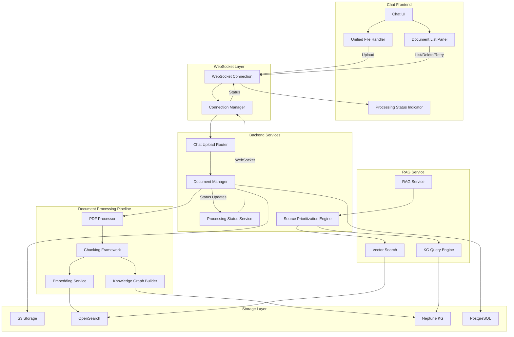

# Design Document: Unified Chat Document Upload

## Overview

This design integrates document upload functionality directly into the chat interface, eliminating the need for a separate Document Library panel. Users can drag-and-drop, paste, or click to upload PDFs within the chat, with real-time processing status displayed as chat messages. The RAG retrieval system is enhanced with source prioritization to ensure Librarian documents are searched first, with optional web search as a secondary source and LLM fallback as tertiary.

The design leverages the existing document processing pipeline, WebSocket infrastructure, and dependency injection architecture while adding new components for chat-integrated upload handling and source prioritization.

## Architecture



## Components and Interfaces

### 1. Unified File Handler (Frontend)

Extends the existing `FileHandler` class to handle chat-integrated document uploads with processing status tracking.

```python
# Frontend: chat-upload-handler.js
class ChatUploadHandler extends FileHandler:
    """
    Handles file uploads within the chat interface.
    Extends FileHandler to add chat-specific behavior.
    """
    
    def __init__(self, wsManager: WebSocketManager, chatApp: ChatApp):
        """
        Initialize with WebSocket manager and chat app reference.
        
        Args:
            wsManager: WebSocket manager for sending upload messages
            chatApp: Chat application instance for UI updates
        """
        pass
    
    def handleChatUpload(self, files: FileList) -> None:
        """
        Handle files uploaded via chat interface.
        Validates files and initiates upload via WebSocket.
        
        Args:
            files: FileList from drag-drop, paste, or file input
        """
        pass
    
    def showUploadProgress(self, file: File, progress: number) -> void:
        """
        Display upload progress in chat UI.
        
        Args:
            file: File being uploaded
            progress: Upload progress percentage (0-100)
        """
        pass
    
    def showProcessingStatus(self, status: ProcessingStatusMessage) -> void:
        """
        Display document processing status in chat UI.
        
        Args:
            status: Processing status message from WebSocket
        """
        pass
```

### 2. Processing Status Service (Backend)

New service that tracks document processing and sends WebSocket updates.

```python
# Backend: processing_status_service.py
class ProcessingStatusService:
    """
    Tracks document processing progress and sends WebSocket updates.
    Uses dependency injection for connection manager access.
    """
    
    def __init__(self, connection_manager: ConnectionManager):
        """
        Initialize with injected connection manager.
        
        Args:
            connection_manager: WebSocket connection manager for sending updates
        """
        pass
    
    async def register_upload(
        self, 
        document_id: UUID, 
        connection_id: str,
        filename: str
    ) -> None:
        """
        Register a document upload for status tracking.
        
        Args:
            document_id: Unique document identifier
            connection_id: WebSocket connection that initiated upload
            filename: Original filename for display
        """
        pass
    
    async def update_status(
        self,
        document_id: UUID,
        status: ProcessingStatus,
        progress_percentage: int,
        current_stage: str,
        metadata: Optional[Dict[str, Any]] = None
    ) -> None:
        """
        Update processing status and send WebSocket message.
        
        Args:
            document_id: Document being processed
            status: Current processing status
            progress_percentage: Progress (0-100)
            current_stage: Human-readable stage name
            metadata: Optional additional metadata
        """
        pass
    
    async def notify_completion(
        self,
        document_id: UUID,
        summary: DocumentSummary
    ) -> None:
        """
        Notify that processing completed successfully.
        
        Args:
            document_id: Completed document
            summary: Processing summary with chunk count, etc.
        """
        pass
    
    async def notify_failure(
        self,
        document_id: UUID,
        error: str,
        retry_available: bool
    ) -> None:
        """
        Notify that processing failed.
        
        Args:
            document_id: Failed document
            error: Error message
            retry_available: Whether retry is possible
        """
        pass
```

### 3. Source Prioritization Engine (Backend)

New component that manages search source prioritization in RAG retrieval.

```python
# Backend: source_prioritization_engine.py
class SourceType(Enum):
    """Source types for search results."""
    LIBRARIAN = "librarian"
    WEB_SEARCH = "web_search"
    LLM_FALLBACK = "llm_fallback"

class SourcePrioritizationEngine:
    """
    Manages search source prioritization for RAG retrieval.
    Ensures Librarian documents are searched first.
    """
    
    def __init__(
        self,
        vector_client: VectorStoreClient,
        kg_query_engine: Optional[KnowledgeGraphQueryEngine] = None,
        web_search_client: Optional[WebSearchClient] = None,
        librarian_boost_factor: float = 1.5
    ):
        """
        Initialize with search clients and configuration.
        
        Args:
            vector_client: Vector store for Librarian document search
            kg_query_engine: Knowledge graph query engine
            web_search_client: Optional web search integration
            librarian_boost_factor: Score boost for Librarian results
        """
        pass
    
    async def search_with_prioritization(
        self,
        query: str,
        user_id: str,
        min_confidence: float = 0.35,
        max_results: int = 10,
        enable_web_search: bool = False
    ) -> PrioritizedSearchResults:
        """
        Search with source prioritization.
        
        Args:
            query: Search query
            user_id: User identifier for filtering
            min_confidence: Minimum confidence threshold
            max_results: Maximum results to return
            enable_web_search: Whether to use web search as fallback
            
        Returns:
            PrioritizedSearchResults with source-tagged results
        """
        pass
    
    def _apply_librarian_boost(
        self,
        results: List[SearchResult]
    ) -> List[SearchResult]:
        """
        Apply boost factor to Librarian document scores.
        
        Args:
            results: Search results to boost
            
        Returns:
            Results with boosted scores
        """
        pass
    
    def _merge_and_rank_results(
        self,
        librarian_results: List[SearchResult],
        web_results: List[SearchResult]
    ) -> List[SearchResult]:
        """
        Merge results from multiple sources, maintaining priority.
        
        Args:
            librarian_results: Results from Librarian documents
            web_results: Results from web search
            
        Returns:
            Merged and ranked results
        """
        pass
```

### 4. Chat Upload Router (Backend)

New WebSocket message handlers for chat-integrated uploads.

```python
# Backend: chat.py (additions to existing router)

async def handle_chat_document_upload(
    message_data: dict,
    connection_id: str,
    manager: ConnectionManager,
    document_manager: DocumentManager = Depends(get_document_manager),
    processing_status_service: ProcessingStatusService = Depends(get_processing_status_service)
) -> None:
    """
    Handle document upload initiated from chat interface.
    
    Args:
        message_data: Upload message with file data
        connection_id: WebSocket connection ID
        manager: Connection manager
        document_manager: Injected document manager
        processing_status_service: Injected status service
    """
    pass

async def handle_document_list_request(
    message_data: dict,
    connection_id: str,
    manager: ConnectionManager,
    document_manager: DocumentManager = Depends(get_document_manager)
) -> None:
    """
    Handle request to list user's documents.
    
    Args:
        message_data: Request message
        connection_id: WebSocket connection ID
        manager: Connection manager
        document_manager: Injected document manager
    """
    pass

async def handle_document_delete_request(
    message_data: dict,
    connection_id: str,
    manager: ConnectionManager,
    document_manager: DocumentManager = Depends(get_document_manager)
) -> None:
    """
    Handle request to delete a document.
    
    Args:
        message_data: Delete request with document_id
        connection_id: WebSocket connection ID
        manager: Connection manager
        document_manager: Injected document manager
    """
    pass

async def handle_document_retry_request(
    message_data: dict,
    connection_id: str,
    manager: ConnectionManager,
    document_manager: DocumentManager = Depends(get_document_manager)
) -> None:
    """
    Handle request to retry failed document processing.
    
    Args:
        message_data: Retry request with document_id
        connection_id: WebSocket connection ID
        manager: Connection manager
        document_manager: Injected document manager
    """
    pass
```

### 5. Document List Panel (Frontend)

New UI component for viewing and managing documents within chat.

```python
# Frontend: document-list-panel.js
class DocumentListPanel:
    """
    Compact panel for viewing and managing documents within chat.
    Displayed as a dropdown from the upload button.
    """
    
    def __init__(self, wsManager: WebSocketManager):
        """
        Initialize with WebSocket manager.
        
        Args:
            wsManager: WebSocket manager for document operations
        """
        pass
    
    def show(self) -> void:
        """Show the document list panel."""
        pass
    
    def hide(self) -> void:
        """Hide the document list panel."""
        pass
    
    def updateDocumentList(self, documents: List[DocumentInfo]) -> void:
        """
        Update the displayed document list.
        
        Args:
            documents: List of document information
        """
        pass
    
    def handleDelete(self, documentId: string) -> void:
        """
        Handle delete button click.
        
        Args:
            documentId: Document to delete
        """
        pass
    
    def handleRetry(self, documentId: string) -> void:
        """
        Handle retry button click for failed documents.
        
        Args:
            documentId: Document to retry
        """
        pass
```

## Data Models

### WebSocket Message Types

```python
# Processing Status Message (Server → Client)
class ProcessingStatusMessage(BaseModel):
    """WebSocket message for document processing status updates."""
    type: Literal["document_processing_status"] = "document_processing_status"
    document_id: str
    filename: str
    status: Literal["queued", "extracting", "chunking", "embedding", "kg_extraction", "completed", "failed"]
    progress_percentage: int = Field(ge=0, le=100)
    current_stage: str
    estimated_time_remaining: Optional[int] = None  # seconds
    error_message: Optional[str] = None
    retry_available: Optional[bool] = None
    summary: Optional[DocumentProcessingSummary] = None

class DocumentProcessingSummary(BaseModel):
    """Summary of completed document processing."""
    title: str
    page_count: int
    chunk_count: int
    concept_count: int
    processing_time_ms: int

# Document List Message (Server → Client)
class DocumentListMessage(BaseModel):
    """WebSocket message containing document list."""
    type: Literal["document_list"] = "document_list"
    documents: List[DocumentInfo]
    total_count: int

class DocumentInfo(BaseModel):
    """Document information for list display."""
    document_id: str
    title: str
    filename: str
    status: Literal["uploaded", "processing", "completed", "failed"]
    upload_timestamp: datetime
    file_size: int
    chunk_count: Optional[int] = None
    error_message: Optional[str] = None

# Upload Request Message (Client → Server)
class ChatUploadMessage(BaseModel):
    """WebSocket message for chat document upload."""
    type: Literal["chat_document_upload"] = "chat_document_upload"
    filename: str
    file_size: int
    content_type: str
    file_data: str  # Base64 encoded

# Document Action Messages (Client → Server)
class DocumentListRequest(BaseModel):
    """Request to list documents."""
    type: Literal["document_list_request"] = "document_list_request"

class DocumentDeleteRequest(BaseModel):
    """Request to delete a document."""
    type: Literal["document_delete_request"] = "document_delete_request"
    document_id: str

class DocumentRetryRequest(BaseModel):
    """Request to retry failed document processing."""
    type: Literal["document_retry_request"] = "document_retry_request"
    document_id: str
```

### Search Result Models

```python
class PrioritizedSearchResult(BaseModel):
    """Search result with source type annotation."""
    chunk_id: str
    document_id: str
    content: str
    score: float
    original_score: float  # Score before boost
    source_type: SourceType
    metadata: Dict[str, Any]

class PrioritizedSearchResults(BaseModel):
    """Collection of prioritized search results."""
    results: List[PrioritizedSearchResult]
    librarian_count: int
    web_count: int
    total_count: int
    search_time_ms: int
```

### Processing Status Tracking

```python
class ProcessingStatusTracker(BaseModel):
    """Internal tracking for document processing status."""
    document_id: UUID
    connection_id: str
    filename: str
    status: ProcessingStatus
    progress_percentage: int
    current_stage: str
    started_at: datetime
    last_updated: datetime
    error_message: Optional[str] = None
```


## Correctness Properties

*A property is a characteristic or behavior that should hold true across all valid executions of a system—essentially, a formal statement about what the system should do. Properties serve as the bridge between human-readable specifications and machine-verifiable correctness guarantees.*

### Property 1: PDF Acceptance

*For any* valid PDF file (correct MIME type and extension), when provided to the Chat_Upload_Handler through any input method (drag-drop, button click, or paste), the handler SHALL accept the file and initiate the upload process.

**Validates: Requirements 1.1, 1.2, 1.3**

### Property 2: Non-PDF Rejection

*For any* file that is not a PDF (incorrect MIME type or extension), when provided to the Chat_Upload_Handler, the handler SHALL reject the file and return an error indicating only PDFs are supported.

**Validates: Requirements 1.4**

### Property 3: File Size Validation

*For any* file with size greater than 100MB, when provided to the Chat_Upload_Handler, the handler SHALL reject the file and return an error indicating the size limit.

**Validates: Requirements 1.5**

### Property 4: Multi-File Queue Processing

*For any* list of N valid PDF files uploaded simultaneously, the Chat_Upload_Handler SHALL queue all N files, and each file SHALL receive individual status updates during processing.

**Validates: Requirements 1.6**

### Property 5: Document Processing Round-Trip

*For any* valid PDF document uploaded via the chat interface, after processing completes, the document's chunks SHALL be retrievable from the vector store and the document's concepts SHALL be queryable from the knowledge graph.

**Validates: Requirements 2.1, 2.2, 2.3, 2.4**

### Property 6: Duplicate Document Detection

*For any* PDF document with the same content hash as an existing document in the system, the Document_Processing_Pipeline SHALL detect the duplicate and notify the user before proceeding.

**Validates: Requirements 2.5**

### Property 7: Processing Status Message Format

*For any* processing status message sent by the Processing_Status_Service, the message SHALL contain: document_id (non-empty string), status (one of: "queued", "extracting", "chunking", "embedding", "kg_extraction", "completed", "failed"), progress_percentage (integer 0-100), and current_stage (non-empty string).

**Validates: Requirements 6.1, 6.2**

### Property 8: Status Message Routing

*For any* document processing status update, the Processing_Status_Service SHALL send the message only to the WebSocket connection that initiated the upload, and no other connections SHALL receive the message.

**Validates: Requirements 6.4**

### Property 9: Search Source Prioritization

*For any* search query, the Source_Prioritization_Engine SHALL search Librarian documents first, and Librarian results SHALL have their scores boosted by the configured boost factor before being merged with any external results.

**Validates: Requirements 5.1, 5.6**

### Property 10: Source Type Labeling

*For any* search result returned by the RAG_Service, the result SHALL include a source_type field indicating whether it came from Librarian documents, web search, or LLM fallback.

**Validates: Requirements 5.5**

### Property 11: Document Deletion Completeness

*For any* document deleted through the chat interface, the document SHALL be removed from: file storage (S3), vector store (OpenSearch), knowledge graph (Neptune), and metadata database (PostgreSQL).

**Validates: Requirements 8.3**

### Property 12: Failed Document Retry

*For any* document in "failed" status, when retry is requested, the Document_Processing_Pipeline SHALL restart processing and the document status SHALL transition from "failed" to "processing".

**Validates: Requirements 8.4**

## Error Handling

### Upload Errors

| Error Condition | Response | User Message |
|-----------------|----------|--------------|
| Invalid file type | Reject upload | "Only PDF files are supported for document cataloging" |
| File too large | Reject upload | "File exceeds 100MB limit. Please upload a smaller file." |
| Upload network failure | Retry with backoff | "Upload failed. Retrying..." |
| Duplicate detected | Prompt user | "This document already exists. Upload anyway?" |

### Processing Errors

| Error Condition | Response | User Message |
|-----------------|----------|--------------|
| PDF extraction failure | Mark failed, offer retry | "Failed to extract content from PDF. Click to retry." |
| Chunking failure | Mark failed, offer retry | "Failed to process document content. Click to retry." |
| Embedding failure | Mark failed, offer retry | "Failed to generate embeddings. Click to retry." |
| KG extraction failure | Continue (non-critical) | "Document processed. Knowledge graph extraction skipped." |
| Storage failure | Mark failed, offer retry | "Failed to store document. Click to retry." |

### WebSocket Errors

| Error Condition | Response | Recovery |
|-----------------|----------|----------|
| Connection lost during upload | Queue status updates | Deliver on reconnection |
| Connection lost during processing | Continue processing | Deliver final status on reconnection |
| Invalid message format | Log error | Send error response to client |

### Search Errors

| Error Condition | Response | Fallback |
|-----------------|----------|----------|
| Vector store unavailable | Skip Librarian search | Use LLM fallback |
| KG query failure | Skip KG enhancement | Use vector-only results |
| Web search failure | Skip web results | Use Librarian + LLM fallback |
| All sources fail | Use pure LLM | Generate response without context |

## Testing Strategy

### Unit Tests

Unit tests focus on specific examples and edge cases:

1. **File Validation Tests**
   - Test PDF detection with various MIME types
   - Test size limit boundary (99MB, 100MB, 101MB)
   - Test empty file handling
   - Test corrupted PDF handling

2. **Message Format Tests**
   - Test status message serialization
   - Test all status enum values
   - Test progress percentage boundaries

3. **Source Prioritization Tests**
   - Test boost factor application
   - Test result merging order
   - Test empty result handling

### Property-Based Tests

Property-based tests verify universal properties across many generated inputs. Each test runs minimum 100 iterations.

**Testing Framework**: `hypothesis` (Python property-based testing library)

1. **Property 1 Test: PDF Acceptance**
   - Generate random valid PDF metadata (size < 100MB, PDF MIME type)
   - Verify handler accepts and initiates upload
   - **Tag: Feature: unified-chat-document-upload, Property 1: PDF Acceptance**

2. **Property 2 Test: Non-PDF Rejection**
   - Generate random non-PDF file metadata (various MIME types excluding PDF)
   - Verify handler rejects with appropriate error
   - **Tag: Feature: unified-chat-document-upload, Property 2: Non-PDF Rejection**

3. **Property 3 Test: File Size Validation**
   - Generate random file sizes above 100MB
   - Verify handler rejects with size error
   - **Tag: Feature: unified-chat-document-upload, Property 3: File Size Validation**

4. **Property 7 Test: Status Message Format**
   - Generate random status updates
   - Verify all messages contain required fields with valid values
   - **Tag: Feature: unified-chat-document-upload, Property 7: Processing Status Message Format**

5. **Property 9 Test: Search Source Prioritization**
   - Generate random search queries and result sets
   - Verify Librarian results are boosted and ranked first
   - **Tag: Feature: unified-chat-document-upload, Property 9: Search Source Prioritization**

6. **Property 10 Test: Source Type Labeling**
   - Generate random search results from mixed sources
   - Verify all results have source_type field
   - **Tag: Feature: unified-chat-document-upload, Property 10: Source Type Labeling**

### Integration Tests

1. **End-to-End Upload Flow**
   - Upload PDF via WebSocket
   - Verify status messages received
   - Verify document appears in list
   - Verify document searchable via RAG

2. **Document Management Flow**
   - Upload document
   - List documents
   - Delete document
   - Verify removal from all stores

3. **Search Prioritization Flow**
   - Upload Librarian document
   - Query with matching content
   - Verify Librarian result ranked first

### Test Configuration

```python
# pytest configuration for property tests
import hypothesis
hypothesis.settings.register_profile(
    "ci",
    max_examples=100,
    deadline=None
)
hypothesis.settings.load_profile("ci")
```
