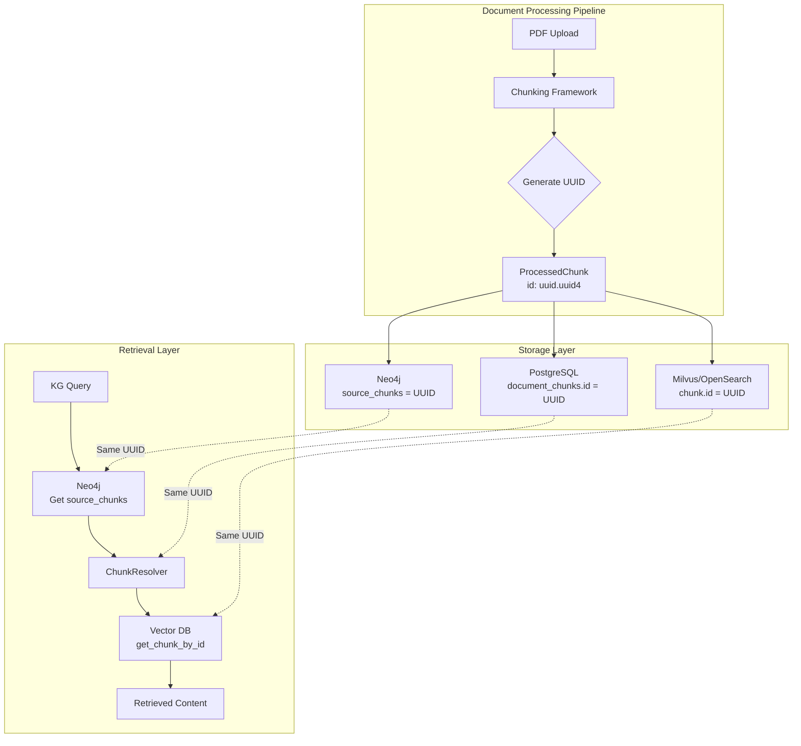

# Design Document: Unified Chunk ID Architecture

## Overview

This design addresses the chunk ID mismatch between Neo4j (knowledge graph), Milvus/OpenSearch (vector database), and PostgreSQL (relational database). The root cause is that the document processing pipeline correctly generates UUIDs, but legacy seeding scripts and sample data use non-UUID formats like `chunk_0`, `chunk_1`.

The solution ensures:
1. All chunk IDs are generated as UUIDs at creation time using `uuid.uuid4()`
2. The same UUID propagates unchanged to all three databases
3. Validation fails fast on invalid chunk IDs
4. A purge script cleans existing inconsistent data
5. All seeding scripts use UUID format

## Architecture



## Components and Interfaces

### 1. ProcessedChunk (Existing - Enhanced Validation)

Location: `src/multimodal_librarian/components/chunking_framework/framework.py`

```python
@dataclass
class ProcessedChunk:
    """A processed chunk with UUID-based identifier."""
    id: str  # Must be valid UUID
    content: str
    start_position: int
    end_position: int
    chunk_type: str = "content"
    metadata: Dict[str, Any] = None
    
    def __post_init__(self) -> None:
        if self.metadata is None:
            self.metadata = {}
        # Validate UUID format - fail fast on invalid IDs
        try:
            uuid.UUID(self.id)
        except (ValueError, TypeError):
            raise ValueError(
                f"ProcessedChunk id must be a valid UUID, got: {self.id}"
            )
```

### 2. Chunk Storage Functions (Existing - Validation Added)

Location: `src/multimodal_librarian/services/celery_service.py`

```python
async def _store_chunks_in_database(document_id: str, chunks: List[Dict]):
    """Store chunks in PostgreSQL with UUID validation."""
    for chunk in chunks:
        chunk_id = chunk.get('id')
        try:
            uuid.UUID(chunk_id)
        except (ValueError, TypeError):
            raise ValueError(f"Chunk ID must be valid UUID, got: {chunk_id}")
        # Store with existing UUID unchanged
        await conn.execute(
            "INSERT INTO document_chunks (id, ...) VALUES ($1::uuid, ...)",
            chunk_id, ...
        )

async def _store_embeddings_in_vector_db(document_id: str, chunks: List[Dict]):
    """Store embeddings in Milvus/OpenSearch with UUID validation."""
    for chunk in chunks:
        chunk_id = chunk.get('id')
        try:
            uuid.UUID(chunk_id)
        except (ValueError, TypeError):
            raise ValueError(f"Chunk ID must be valid UUID, got: {chunk_id}")
        # Store with existing UUID unchanged
        vector_chunk = {'id': chunk_id, 'content': chunk['content'], ...}
```

### 3. Knowledge Graph Builder (Existing - UUID Propagation)

Location: `src/multimodal_librarian/components/knowledge_graph/kg_builder.py`

The KG builder already receives chunks with UUIDs from the processing pipeline. The `source_chunks` field on ConceptNode stores these UUIDs:

```python
concept = ConceptNode(
    concept_id=concept_id,
    concept_name=concept_name,
    concept_type="ENTITY",
    confidence=0.8,
    source_chunks=[chunk.id]  # UUID from ProcessedChunk
)
```

### 4. ChunkResolver (Existing - No Changes Needed)

Location: `src/multimodal_librarian/components/kg_retrieval/chunk_resolver.py`

The ChunkResolver already handles UUID-based lookups correctly. Once Neo4j contains valid UUIDs in `source_chunks`, resolution will work:

```python
async def _resolve_single_chunk(self, chunk_id: str, ...):
    """Resolve chunk ID to content from vector store."""
    chunk_data = await self._vector_client.get_chunk_by_id(chunk_id)
    # Returns content if UUID exists in vector DB
```

### 5. Database Purge Script (New)

Location: `scripts/purge-chunk-data.py`

```python
class ChunkDataPurger:
    """Purges all chunk data from PostgreSQL, Milvus/OpenSearch, and Neo4j."""
    
    async def purge_all(self) -> PurgeResult:
        """Purge chunk data from all databases."""
        pg_deleted = await self._purge_postgresql()
        vector_deleted = await self._purge_vector_db()
        neo4j_deleted = await self._purge_neo4j()
        
        return PurgeResult(
            postgresql_chunks=pg_deleted,
            vector_chunks=vector_deleted,
            neo4j_chunks=neo4j_deleted,
            neo4j_concepts=neo4j_concepts_cleaned
        )
    
    async def _purge_postgresql(self) -> int:
        """Delete all rows from document_chunks table."""
        result = await conn.execute("DELETE FROM document_chunks")
        return result.rowcount
    
    async def _purge_vector_db(self) -> int:
        """Delete all chunks from Milvus/OpenSearch."""
        # Drop and recreate collection for clean state
        await vector_client.drop_collection("knowledge_chunks")
        await vector_client.create_collection("knowledge_chunks")
        return deleted_count
    
    async def _purge_neo4j(self) -> Tuple[int, int]:
        """Delete Chunk nodes and clean source_chunks references."""
        # Delete all Chunk nodes
        await neo4j.execute("MATCH (c:Chunk) DETACH DELETE c")
        # Clear source_chunks on all Concept nodes
        await neo4j.execute(
            "MATCH (c:Concept) SET c.source_chunks = ''"
        )
        return (chunks_deleted, concepts_cleaned)
```

### 6. Updated Seeding Scripts

All seeding scripts must use UUID format:

```python
# BEFORE (wrong)
chunk_props = {"id": "chunk_001", "content": "..."}

# AFTER (correct)
chunk_props = {"id": str(uuid.uuid4()), "content": "..."}
```

Files to update:
- `database/neo4j/init/03_sample_data.cypher`
- `scripts/seed-document-concept-associations.py`
- `scripts/seed-sample-knowledge-graph.py`
- `examples/vector_store_example.py`
- Test files using mock chunk IDs

## Data Models

### ProcessedChunk (Enhanced)

```python
@dataclass
class ProcessedChunk:
    id: str           # UUID string, validated in __post_init__
    content: str      # Chunk text content
    start_position: int
    end_position: int
    chunk_type: str   # "content", "bridge", "fallback"
    metadata: Dict[str, Any]
```

### ConceptNode (Existing)

```python
@dataclass
class ConceptNode:
    concept_id: str
    concept_name: str
    concept_type: str
    aliases: List[str]
    confidence: float
    source_chunks: List[str]  # List of UUID strings
    source_document: Optional[str]
    external_ids: Dict[str, str]
```

### PurgeResult (New)

```python
@dataclass
class PurgeResult:
    postgresql_chunks: int      # Rows deleted from document_chunks
    vector_chunks: int          # Chunks deleted from Milvus/OpenSearch
    neo4j_chunks: int           # Chunk nodes deleted from Neo4j
    neo4j_concepts_cleaned: int # Concept nodes with source_chunks cleared
    errors: List[str]           # Any errors encountered
```


## Correctness Properties

*A property is a characteristic or behavior that should hold true across all valid executions of a system—essentially, a formal statement about what the system should do. Properties serve as the bridge between human-readable specifications and machine-verifiable correctness guarantees.*

### Property 1: UUID Round-Trip Consistency

*For any* chunk created by the Chunking Framework and stored via the document processing pipeline, retrieving the chunk from PostgreSQL, Milvus/OpenSearch, or Neo4j (via source_chunks) SHALL return the exact same UUID that was generated at creation time.

**Validates: Requirements 1.1, 2.1, 3.1, 4.1, 4.3**

### Property 2: Invalid ID Rejection

*For any* string that is not a valid UUID (e.g., "chunk_0", "invalid", "", "123", "not-a-uuid"), attempting to create a ProcessedChunk or store a chunk SHALL raise a ValueError, and the error message SHALL contain the invalid ID value.

**Validates: Requirements 1.3, 2.2, 3.2, 8.1, 8.4**

### Property 3: Chunk Resolvability

*For any* chunk stored via the document processing pipeline, the ChunkResolver SHALL successfully resolve the chunk ID to content from the vector database. The resolved chunk SHALL have non-empty content matching the original chunk.

**Validates: Requirements 5.1, 5.3, 5.4**

### Property 4: Reprocessing Isolation

*For any* document that is reprocessed, the old chunk IDs SHALL NOT exist in PostgreSQL, Milvus/OpenSearch, or Neo4j after reprocessing completes. The new chunks SHALL have different UUIDs than the old chunks.

**Validates: Requirements 2.4, 3.4, 4.4**

### Property 5: Sub-Chunk UUID Uniqueness

*For any* chunk that is split into sub-chunks, each sub-chunk SHALL have a unique valid UUID that is different from the parent chunk's UUID and different from all sibling sub-chunks.

**Validates: Requirements 1.5**

## Error Handling

### Invalid Chunk ID Errors

When an invalid chunk ID is detected, the system raises `ValueError` with a descriptive message:

```python
# At ProcessedChunk creation
ValueError("ProcessedChunk id must be a valid UUID, got: chunk_0")

# At PostgreSQL storage
ValueError("Chunk ID must be a valid UUID, got: chunk_0")

# At Vector DB storage
ValueError("Chunk ID must be a valid UUID, got: chunk_0")
```

### Missing Chunk Handling

When ChunkResolver cannot find a chunk ID in the vector database:

```python
# Log warning but continue with remaining chunks
logger.warning(f"Chunk not found: {chunk_id}")
# Return None for this chunk, continue processing others
```

### Purge Script Errors

The purge script handles errors gracefully:

```python
@dataclass
class PurgeResult:
    postgresql_chunks: int
    vector_chunks: int
    neo4j_chunks: int
    neo4j_concepts_cleaned: int
    errors: List[str]  # Collect errors without failing entire purge
```

## Testing Strategy

### Property-Based Tests

Property-based tests will use `hypothesis` library to generate random inputs and verify properties hold across all cases.

```python
from hypothesis import given, strategies as st
import uuid

# Property 1: UUID Round-Trip Consistency
@given(st.text(min_size=1, max_size=1000))
def test_uuid_round_trip_consistency(content: str):
    """
    Feature: unified-chunk-id-architecture
    Property 1: UUID Round-Trip Consistency
    """
    # Create chunk with generated UUID
    chunk = ProcessedChunk(
        id=str(uuid.uuid4()),
        content=content,
        start_position=0,
        end_position=len(content)
    )
    
    # Store and retrieve from each database
    stored_pg = store_in_postgresql(chunk)
    stored_vector = store_in_vector_db(chunk)
    stored_neo4j = store_in_neo4j(chunk)
    
    # Verify UUID unchanged
    assert stored_pg['id'] == chunk.id
    assert stored_vector['id'] == chunk.id
    assert chunk.id in stored_neo4j['source_chunks']

# Property 2: Invalid ID Rejection
@given(st.text().filter(lambda x: not is_valid_uuid(x)))
def test_invalid_id_rejection(invalid_id: str):
    """
    Feature: unified-chunk-id-architecture
    Property 2: Invalid ID Rejection
    """
    with pytest.raises(ValueError) as exc_info:
        ProcessedChunk(
            id=invalid_id,
            content="test",
            start_position=0,
            end_position=4
        )
    assert invalid_id in str(exc_info.value)
```

### Unit Tests

Unit tests cover specific examples and edge cases:

1. **Valid UUID acceptance**: Verify ProcessedChunk accepts valid UUIDs
2. **Empty string rejection**: Verify empty string raises ValueError
3. **Whitespace rejection**: Verify whitespace-only strings raise ValueError
4. **Old format rejection**: Verify "chunk_0", "chunk_001" formats raise ValueError
5. **Purge script completeness**: Verify all databases are emptied after purge

### Integration Tests

Integration tests verify end-to-end behavior:

1. **Document processing pipeline**: Upload document, verify UUIDs consistent across all DBs
2. **KG-guided retrieval**: Query Neo4j, resolve chunks, verify content retrieved
3. **Reprocessing**: Upload, reprocess, verify old chunks removed

### Test Configuration

- Property tests: Minimum 100 iterations per property
- Use `hypothesis` for property-based testing
- Tag format: `Feature: unified-chunk-id-architecture, Property N: <property_text>`
