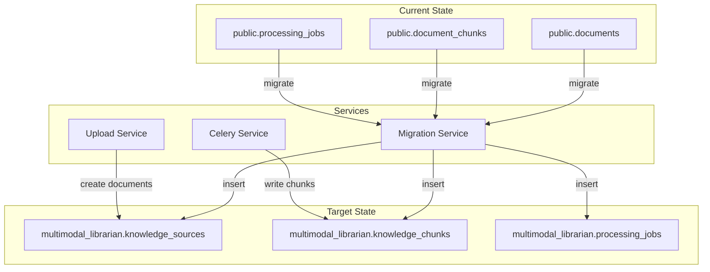

# Design Document: Unified Schema Migration

## Overview

This design document describes the migration from the current dual-schema PostgreSQL architecture to a unified `multimodal_librarian` schema. The migration consolidates `public.documents` and `public.document_chunks` into `multimodal_librarian.knowledge_sources` and `multimodal_librarian.knowledge_chunks`, enabling the original vision of treating books and conversations as equivalent knowledge sources.

The migration follows a phased approach:
1. Create migration service with field mapping logic
2. Migrate existing data with verification
3. Update application services to use unified schema
4. Clean up deprecated public schema tables

## Architecture



## Components and Interfaces

### Migration Service

The `MigrationService` class orchestrates the schema migration process.

```python
class MigrationService:
    """Service for migrating data from public schema to unified schema."""
    
    async def migrate(self, dry_run: bool = False) -> MigrationResult:
        """
        Execute the migration from public to unified schema.
        
        Args:
            dry_run: If True, report what would be migrated without making changes
            
        Returns:
            MigrationResult with counts and status
        """
        pass
    
    async def verify_migration(self) -> VerificationResult:
        """
        Verify that migration completed successfully.
        
        Returns:
            VerificationResult with row counts and discrepancies
        """
        pass
    
    async def cleanup_public_schema(self) -> CleanupResult:
        """
        Drop deprecated public schema tables after successful migration.
        
        Returns:
            CleanupResult with dropped tables and status
        """
        pass
```

### Field Mapper

The `FieldMapper` class handles field mapping between schemas.

```python
class FieldMapper:
    """Maps fields between public and unified schema structures."""
    
    def map_document_to_knowledge_source(
        self, 
        document: Dict[str, Any]
    ) -> Dict[str, Any]:
        """
        Map public.documents row to knowledge_sources row.
        
        Field mappings:
        - id -> id (preserved)
        - user_id -> user_id (preserved)
        - title -> title (preserved)
        - filename -> file_path (preserved)
        - file_size -> file_size (preserved)
        - status -> processing_status (enum conversion)
        - doc_metadata -> metadata (preserved)
        - source_type = 'UPLOAD' (new field)
        """
        pass
    
    def map_chunk_to_knowledge_chunk(
        self, 
        chunk: Dict[str, Any],
        source_type: str = 'BOOK'
    ) -> Dict[str, Any]:
        """
        Map public.document_chunks row to knowledge_chunks row.
        
        Field mappings:
        - id -> id (preserved)
        - document_id -> source_id (renamed)
        - chunk_index -> chunk_index (preserved)
        - content -> content (preserved)
        - content -> content_hash (computed SHA-256)
        - page_number -> location_reference (string conversion)
        - section_title -> section (renamed)
        - chunk_type -> content_type (enum conversion)
        - metadata -> metadata (preserved)
        - source_type = source_type (new field)
        """
        pass
    
    @staticmethod
    def compute_content_hash(content: str) -> str:
        """Compute SHA-256 hash of content for deduplication."""
        import hashlib
        return hashlib.sha256(content.encode('utf-8')).hexdigest()
    
    @staticmethod
    def map_chunk_type_to_content_type(chunk_type: str) -> str:
        """
        Map chunk_type enum to content_type enum.
        
        Mappings:
        - 'text' -> 'GENERAL'
        - 'image' -> 'TECHNICAL'
        - 'table' -> 'TECHNICAL'
        - 'chart' -> 'TECHNICAL'
        """
        mapping = {
            'text': 'GENERAL',
            'image': 'TECHNICAL',
            'table': 'TECHNICAL',
            'chart': 'TECHNICAL'
        }
        return mapping.get(chunk_type, 'GENERAL')
```

### Updated Celery Service Interface

The `_store_chunks_in_database` function will be updated to use the unified schema:

```python
async def _store_chunks_in_database(document_id: str, chunks: List[Dict[str, Any]]):
    """
    Store chunks in unified schema using the chunk's existing UUID.
    
    Changes from current implementation:
    - Insert into multimodal_librarian.knowledge_chunks instead of public.document_chunks
    - Set source_type to 'BOOK' for all chunks
    - Compute and store content_hash for each chunk
    - Map fields according to unified schema structure
    """
    pass

async def _delete_document_chunks(document_id: str) -> int:
    """
    Delete existing chunks from unified schema.
    
    Changes from current implementation:
    - Delete from multimodal_librarian.knowledge_chunks instead of public.document_chunks
    """
    pass
```

### Updated Upload Service Interface

The `UploadService` class will be updated to use the unified schema:

```python
class UploadService:
    async def _store_document_in_db(
        self, 
        document: Document, 
        content_hash: Optional[str] = None
    ) -> None:
        """
        Store document record in unified schema.
        
        Changes from current implementation:
        - Insert into multimodal_librarian.knowledge_sources instead of public.documents
        - Set source_type to 'UPLOAD'
        - Map fields according to unified schema structure
        """
        pass
    
    async def get_document(self, document_id: UUID) -> Optional[Document]:
        """
        Get document from unified schema.
        
        Changes from current implementation:
        - Query multimodal_librarian.knowledge_sources instead of public.documents
        """
        pass
    
    async def list_documents(self, ...) -> List[Document]:
        """
        List documents from unified schema.
        
        Changes from current implementation:
        - Query multimodal_librarian.knowledge_sources instead of public.documents
        """
        pass
    
    async def delete_document(self, document_id: UUID) -> bool:
        """
        Delete document from unified schema.
        
        Changes from current implementation:
        - Delete from multimodal_librarian.knowledge_sources (cascades to knowledge_chunks)
        """
        pass
```

## Data Models

### Schema Comparison

| Public Schema Field | Unified Schema Field | Transformation |
|---------------------|---------------------|----------------|
| `documents.id` | `knowledge_sources.id` | Direct copy |
| `documents.user_id` | `knowledge_sources.user_id` | Direct copy |
| `documents.title` | `knowledge_sources.title` | Direct copy |
| `documents.filename` | `knowledge_sources.file_path` | Direct copy |
| `documents.file_size` | `knowledge_sources.file_size` | Direct copy |
| `documents.status` | `knowledge_sources.processing_status` | Enum conversion |
| `documents.doc_metadata` | `knowledge_sources.metadata` | Direct copy |
| N/A | `knowledge_sources.source_type` | Set to 'UPLOAD' |
| `document_chunks.id` | `knowledge_chunks.id` | Direct copy |
| `document_chunks.document_id` | `knowledge_chunks.source_id` | Rename |
| `document_chunks.chunk_index` | `knowledge_chunks.chunk_index` | Direct copy |
| `document_chunks.content` | `knowledge_chunks.content` | Direct copy |
| N/A | `knowledge_chunks.content_hash` | Computed SHA-256 |
| `document_chunks.page_number` | `knowledge_chunks.location_reference` | String conversion |
| `document_chunks.section_title` | `knowledge_chunks.section` | Rename |
| `document_chunks.chunk_type` | `knowledge_chunks.content_type` | Enum mapping |
| `document_chunks.metadata` | `knowledge_chunks.metadata` | Direct copy |
| N/A | `knowledge_chunks.source_type` | Set to 'BOOK' |

### Migration Result Models

```python
@dataclass
class MigrationResult:
    """Result of migration operation."""
    success: bool
    documents_migrated: int
    chunks_migrated: int
    processing_jobs_migrated: int
    errors: List[str]
    dry_run: bool
    duration_seconds: float

@dataclass
class VerificationResult:
    """Result of migration verification."""
    success: bool
    source_document_count: int
    target_document_count: int
    source_chunk_count: int
    target_chunk_count: int
    discrepancies: List[str]

@dataclass
class CleanupResult:
    """Result of public schema cleanup."""
    success: bool
    tables_dropped: List[str]
    errors: List[str]
```

## Correctness Properties

*A property is a characteristic or behavior that should hold true across all valid executions of a system—essentially, a formal statement about what the system should do. Properties serve as the bridge between human-readable specifications and machine-verifiable correctness guarantees.*

### Property 1: Migration Data Preservation

*For any* document and its associated chunks in the public schema, after migration, the unified schema SHALL contain equivalent data with all fields correctly mapped according to the field mapping rules.

**Validates: Requirements 1.1, 1.2, 1.3, 1.4, 1.6, 1.7, 1.8, 1.9**

### Property 2: Content Hash Computation

*For any* chunk content string, the computed content_hash SHALL be the SHA-256 hexadecimal digest of the UTF-8 encoded content, and this hash SHALL be consistent across migration and new chunk storage operations.

**Validates: Requirements 1.5, 2.3**

### Property 3: Chunk Storage Source Type

*For any* chunk stored via the Celery service after PDF processing, the source_type field SHALL be set to 'BOOK'.

**Validates: Requirements 2.2**

### Property 4: Upload Source Type Assignment

*For any* document created via the Upload service, the source_type field SHALL be set to 'UPLOAD'.

**Validates: Requirements 3.2**

### Property 5: Cascade Delete Behavior

*For any* knowledge source that is deleted, all associated knowledge chunks with matching source_id SHALL also be deleted.

**Validates: Requirements 3.6, 5.3**

### Property 6: Schema Constraint Enforcement

*For any* attempt to insert a knowledge chunk, the database SHALL enforce:
- Referential integrity (source_id must reference existing knowledge_source)
- Uniqueness constraint on (source_id, source_type, content_hash)
- Valid source_type values ('BOOK', 'CONVERSATION', 'UPLOAD')

**Validates: Requirements 5.1, 5.2, 5.4**

### Property 7: Migration Safety - Dry Run

*For any* migration executed in dry-run mode, the source and target tables SHALL have identical row counts before and after the operation.

**Validates: Requirements 6.3**

### Property 8: Migration Verification

*For any* successful migration, the row count in the target tables SHALL equal the row count in the source tables.

**Validates: Requirements 6.4**

### Property 9: Data Preservation Until Cleanup

*For any* migration that completes successfully, the public schema tables SHALL remain intact until explicit cleanup is requested.

**Validates: Requirements 6.5**

## Error Handling

### Migration Errors

| Error Condition | Handling Strategy |
|-----------------|-------------------|
| Target schema missing | Abort migration with clear error message |
| Duplicate content_hash | Skip duplicate, log warning |
| Foreign key violation | Rollback transaction, report error |
| Connection failure | Retry with exponential backoff (max 3 attempts) |
| Partial migration | Rollback entire transaction |

### Service Update Errors

| Error Condition | Handling Strategy |
|-----------------|-------------------|
| Schema not migrated | Fall back to public schema with deprecation warning |
| Invalid source_type | Use default 'GENERAL' with warning |
| Hash computation failure | Log error, use empty hash |

### Cleanup Errors

| Error Condition | Handling Strategy |
|-----------------|-------------------|
| Unmigrated data detected | Abort cleanup, report discrepancy |
| Table drop failure | Log error, continue with remaining tables |
| Foreign key constraint | Drop dependent tables first |

## Testing Strategy

### Unit Tests

Unit tests will verify:
- Field mapping logic correctness
- Content hash computation
- Enum conversion mappings
- Error handling for edge cases

### Property-Based Tests

Property-based tests will use `hypothesis` library to verify:
- Migration data preservation across random documents and chunks
- Content hash consistency
- Schema constraint enforcement
- Cascade delete behavior

Configuration:
- Minimum 100 iterations per property test
- Tag format: **Feature: unified-schema-migration, Property {number}: {property_text}**

### Integration Tests

Integration tests will verify:
- End-to-end migration workflow
- Service updates work with unified schema
- Cleanup removes correct tables
- Backward compatibility during transition

### Test Data Generation

```python
from hypothesis import given, strategies as st

# Strategy for generating valid document data
document_strategy = st.fixed_dictionaries({
    'id': st.uuids(),
    'user_id': st.text(min_size=1, max_size=100),
    'title': st.text(min_size=1, max_size=500),
    'filename': st.text(min_size=1, max_size=255),
    'file_size': st.integers(min_value=1, max_value=10**9),
    'status': st.sampled_from(['uploaded', 'processing', 'completed', 'failed']),
    'doc_metadata': st.dictionaries(st.text(), st.text())
})

# Strategy for generating valid chunk data
chunk_strategy = st.fixed_dictionaries({
    'id': st.uuids(),
    'document_id': st.uuids(),
    'chunk_index': st.integers(min_value=0, max_value=10000),
    'content': st.text(min_size=1, max_size=10000),
    'page_number': st.integers(min_value=1, max_value=1000) | st.none(),
    'section_title': st.text(max_size=255) | st.none(),
    'chunk_type': st.sampled_from(['text', 'image', 'table', 'chart']),
    'metadata': st.dictionaries(st.text(), st.text())
})
```
