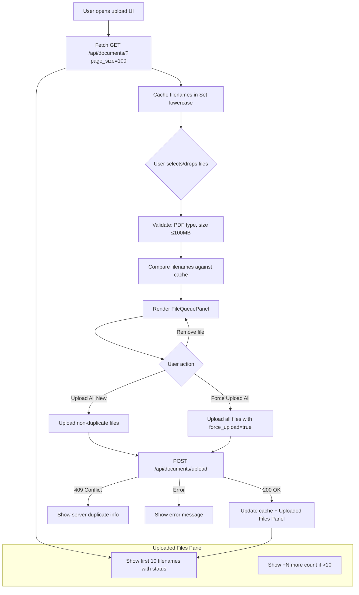
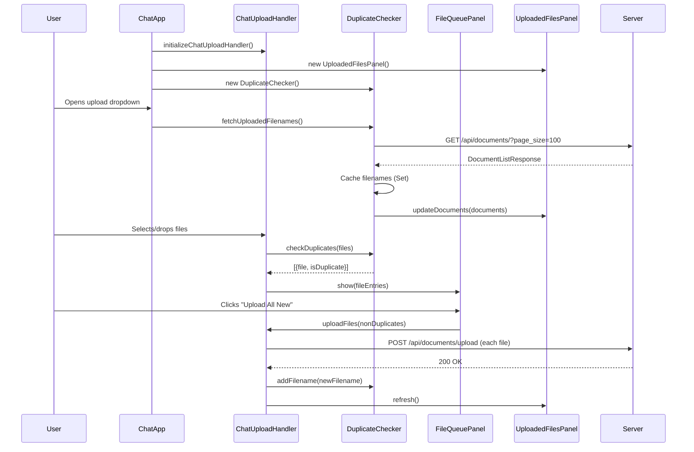

# Design Document: Upload Duplicate Filter

## Overview

This feature adds client-side duplicate detection and multi-file management to the Multimodal Librarian upload UI. When users open the upload interface, the system fetches the current document list from the server and caches filenames locally. Files selected via file picker or drag-and-drop are compared against this cache, and duplicates are visually flagged. A file queue lets users review, remove, and selectively upload files. An uploaded files panel near the upload controls shows what's already on the server.

All changes are client-side (vanilla JavaScript), extending the existing `FileHandler` and `ChatUploadHandler` classes. The backend already returns 409 Conflict for content-hash duplicates; this feature adds a faster, filename-based pre-check layer on the client.

### Key Design Decisions

1. **Filename-based matching (not content hash)**: Client-side duplicate detection uses case-insensitive filename comparison. This is a fast heuristic — the server's content-hash check remains the authoritative duplicate gate. Rationale: computing content hashes client-side would require reading entire files before upload, adding latency and complexity for marginal benefit.

2. **Extend existing classes rather than replace**: `ChatUploadHandler` already extends `FileHandler`. We add a `DuplicateFilterMixin` pattern (composed into `ChatUploadHandler`) to keep changes isolated and testable.

3. **Fetch document list via REST, not WebSocket**: The `GET /api/documents/` endpoint already exists with pagination. We use it directly on upload UI open rather than adding a new WebSocket message type. This avoids coupling the duplicate check to WebSocket connection state.

4. **File queue as a new UI component**: Rather than modifying the existing upload progress bar, we introduce a `FileQueuePanel` that renders between file selection and upload initiation. This gives users explicit review control.

## Architecture



### Component Interaction



## Components and Interfaces

### 1. DuplicateChecker

Responsible for fetching, caching, and querying uploaded filenames.

```javascript
class DuplicateChecker {
    constructor() {
        this.cachedFilenames = new Set();  // lowercase filenames
        this.documents = [];                // full document objects for panel
        this.loaded = false;
        this.loading = false;
    }

    /**
     * Fetch document list from server and cache filenames.
     * @returns {Promise<void>}
     */
    async fetchUploadedFilenames() { }

    /**
     * Check if a filename already exists (case-insensitive).
     * @param {string} filename
     * @returns {boolean}
     */
    isDuplicate(filename) { }

    /**
     * Check multiple files and return annotated results.
     * @param {File[]} files
     * @returns {{file: File, isDuplicate: boolean}[]}
     */
    checkFiles(files) { }

    /**
     * Add a filename to the cache after successful upload.
     * @param {string} filename
     * @param {Object} document - Document metadata from server response
     */
    addUploadedDocument(filename, document) { }

    /**
     * Get cached documents for the uploaded files panel.
     * @returns {Object[]}
     */
    getDocuments() { }
}
```

### 2. FileQueuePanel

Renders the file queue between selection and upload, showing duplicate indicators and action buttons.

```javascript
class FileQueuePanel {
    constructor(containerElement) {
        this.container = containerElement;
        this.entries = [];          // [{file, isDuplicate, id}]
        this.onUploadNew = null;    // callback
        this.onForceUploadAll = null; // callback
        this.onRemoveFile = null;   // callback
    }

    /**
     * Show the queue with file entries.
     * @param {{file: File, isDuplicate: boolean}[]} fileEntries
     */
    show(fileEntries) { }

    /**
     * Remove a file entry by id.
     * @param {string} entryId
     */
    removeEntry(entryId) { }

    /**
     * Hide and clear the queue.
     */
    hide() { }

    /**
     * Get count of new (non-duplicate) files.
     * @returns {number}
     */
    getNewFileCount() { }

    /**
     * Get count of duplicate files.
     * @returns {number}
     */
    getDuplicateCount() { }

    /**
     * Render the panel HTML.
     * @private
     */
    _render() { }
}
```

### 3. UploadedFilesPanel

Displays the list of already-uploaded documents near the upload controls.

```javascript
class UploadedFilesPanel {
    constructor(containerElement) {
        this.container = containerElement;
        this.documents = [];
        this.maxVisible = 10;
    }

    /**
     * Update the panel with document data.
     * @param {Object[]} documents - Array of document objects from API
     */
    updateDocuments(documents) { }

    /**
     * Add a single document after successful upload.
     * @param {Object} document
     */
    addDocument(document) { }

    /**
     * Render the panel.
     * @private
     */
    _render() { }
}
```

### 4. Modified ChatUploadHandler

The existing `ChatUploadHandler` is extended to integrate duplicate checking and the file queue.

Key changes:
- `handleChatUpload(files)` — after validation, runs `DuplicateChecker.checkFiles()` and shows `FileQueuePanel` instead of immediately uploading
- `uploadFiles(files, forceUpload)` — new method that handles the actual upload with optional `force_upload` parameter
- `handleUploadSuccess(filename, response)` — updates `DuplicateChecker` cache and `UploadedFilesPanel`
- Upload lock (`this.isUploading`) to prevent concurrent uploads

### 5. CSS Additions

New styles added to `chat.css` for:
- `.file-queue-panel` — container for the file queue
- `.file-queue-entry` — individual file row
- `.file-queue-entry.duplicate` — duplicate file styling (amber/warning color)
- `.duplicate-indicator` — badge/icon on duplicate entries
- `.file-queue-actions` — upload action buttons
- `.uploaded-files-panel` — container for the uploaded files list
- `.uploaded-file-entry` — individual uploaded file row
- `.status-badge` — processing status indicator
- `.drop-zone-active` — drag-over visual feedback

## Data Models

### Client-Side Models

```javascript
// File queue entry (used by FileQueuePanel)
{
    id: "fq-1234",              // unique entry ID
    file: File,                  // browser File object
    filename: "document.pdf",    // file.name
    fileSize: 1048576,           // file.size in bytes
    isDuplicate: true,           // result of duplicate check
    status: "pending"            // "pending" | "uploading" | "uploaded" | "error"
}

// Cached document (used by DuplicateChecker and UploadedFilesPanel)
{
    id: "uuid-string",
    filename: "document.pdf",
    title: "Document Title",
    status: "completed",         // "uploaded" | "processing" | "completed" | "failed"
    fileSize: 1048576
}
```

### API Models (Existing, No Changes)

The feature uses existing API endpoints and models:

- **GET /api/documents/** → `DocumentListResponse` with `documents[]` containing `Document` objects (id, filename, title, status, file_size, etc.)
- **POST /api/documents/upload** → `DocumentUploadResponse` with document_id, title, status
- **409 Conflict response** → `{detail, message, existing_document: {id, title, url}, action_required}`

No backend model changes are required. The `force_upload` form parameter already exists on the upload endpoint.


## Correctness Properties

*A property is a characteristic or behavior that should hold true across all valid executions of a system — essentially, a formal statement about what the system should do. Properties serve as the bridge between human-readable specifications and machine-verifiable correctness guarantees.*

### Property 1: Cache population from API response

*For any* `DocumentListResponse` containing a list of documents, after `fetchUploadedFilenames()` processes the response, the cached filename set should contain the lowercase version of every document's filename from the response.

**Validates: Requirements 1.1, 1.2**

### Property 2: Case-insensitive duplicate detection

*For any* set of cached filenames and any file, `isDuplicate(file.name)` should return `true` if and only if the lowercase version of `file.name` exists in the cached filename set. Furthermore, `isDuplicate(name)` should return the same result for any case variation of the same filename.

**Validates: Requirements 2.1, 2.5, 3.3**

### Property 3: File queue entry rendering completeness

*For any* file queue entry (with a file name, file size, and duplicate status), the rendered HTML for that entry should contain: the file's name, a human-readable file size, a duplicate indicator element if and only if `isDuplicate` is true, and a remove button.

**Validates: Requirements 2.2, 2.3, 3.4, 4.1, 4.2**

### Property 4: Queue summary counts and upload button state

*For any* file queue with N total entries where D are duplicates, the summary should report exactly (N - D) new files and D duplicate files. The "Upload All New" action should be disabled if and only if (N - D) equals 0.

**Validates: Requirements 2.4, 3.5**

### Property 5: File removal preserves queue integrity

*For any* file queue with N entries (N > 0) and any valid entry index, removing that entry should result in a queue of length N - 1, and the removed file should not appear in the resulting queue.

**Validates: Requirements 3.6, 4.3**

### Property 6: Upload All New filters out duplicates

*For any* file queue, the "Upload All New" action should produce an upload list containing exactly the files where `isDuplicate` is false, preserving their original order.

**Validates: Requirements 4.5**

### Property 7: Force Upload All includes all files

*For any* file queue, the "Force Upload All" action should produce an upload list containing all files in the queue regardless of duplicate status, and each upload request should include `force_upload=true`.

**Validates: Requirements 4.6**

### Property 8: Uploaded files panel rendering

*For any* document object with a filename and status, the rendered panel entry should contain both the filename text and a status indicator matching the document's processing status.

**Validates: Requirements 5.2, 5.3**

### Property 9: Panel truncation at threshold

*For any* document list with N documents where N > 10, the uploaded files panel should render exactly 10 document entries and display a remaining count of (N - 10).

**Validates: Requirements 5.4**

### Property 10: Cache update round-trip after upload

*For any* filename, after calling `addUploadedDocument(filename, document)`, `isDuplicate(filename)` should return `true`.

**Validates: Requirements 6.2**

### Property 11: Upload lock prevents concurrent uploads

*For any* state where `isUploading` is `true`, attempting to initiate a new upload should be rejected (no new upload starts), and the lock should only be released after the current upload batch completes or fails.

**Validates: Requirements 6.5**

### Property 12: File validation rejects invalid files

*For any* file, `validateChatFile(file)` should return `{valid: true}` if and only if the file has a PDF MIME type or `.pdf` extension AND the file size is greater than 0 AND the file size is at most 100MB.

**Validates: Requirements 3.2**

## Error Handling

| Scenario | Behavior |
|----------|----------|
| `GET /api/documents/` fails (network error, 5xx) | Log error to console. Set `DuplicateChecker.loaded = false`. Allow uploads without duplicate checking — `isDuplicate()` returns `false` for all files. |
| `GET /api/documents/` returns empty list | `DuplicateChecker` cache is empty. No duplicates flagged. `UploadedFilesPanel` shows "No documents uploaded yet." |
| File validation fails (non-PDF, too large, empty) | Show error message per file. Exclude from file queue. Valid files still proceed. |
| All selected files are duplicates | Disable "Upload All New" button. Show message: "All selected files are already uploaded." "Force Upload All" remains enabled. |
| `POST /api/documents/upload` returns 409 Conflict | Display server-provided message with existing document title. Do not add to cache (it's already there). |
| `POST /api/documents/upload` returns 4xx/5xx | Show error message for that file. Continue uploading remaining files in queue. Mark failed entry in queue. |
| WebSocket disconnected during upload | Show connection error. Queue remains intact for retry when reconnected. |
| User removes all files from queue | Disable both upload buttons. Show empty queue state. |

## Testing Strategy

### Property-Based Testing

Use **fast-check** (JavaScript property-based testing library) for all correctness properties.

Each property test must:
- Run a minimum of 100 iterations
- Reference its design document property in a comment tag
- Use `fc.assert(fc.property(...))` pattern

Tag format: `Feature: upload-duplicate-filter, Property {N}: {title}`

Property tests focus on the pure logic components:
- `DuplicateChecker`: cache population, duplicate detection, case-insensitive matching, cache updates
- `FileQueuePanel`: entry rendering, removal, count calculations, button state
- `UploadedFilesPanel`: rendering, truncation
- File validation logic

### Unit Testing

Unit tests complement property tests for specific examples and edge cases:
- API fetch failure graceful degradation (Requirement 1.3)
- 409 Conflict response handling (Requirement 6.3)
- Empty document list panel state (Requirement 5.6)
- Empty file queue disables upload (Requirement 4.4)
- WebSocket upload path integration with duplicate checker

### Test File Organization

```
tests/
  static/
    js/
      test_duplicate_checker.js      # Property tests for DuplicateChecker
      test_file_queue_panel.js       # Property tests for FileQueuePanel
      test_uploaded_files_panel.js   # Property tests for UploadedFilesPanel
      test_upload_integration.js     # Unit tests for integration scenarios
```

### Testing Configuration

- Library: `fast-check` (npm package)
- Runner: Can be run with any JS test runner (Jest, Mocha, or standalone)
- Minimum iterations: 100 per property
- Generators needed:
  - Random filenames (with various cases, extensions, unicode)
  - Random document lists (varying lengths, statuses)
  - Random file objects (mock File with name, size, type)
  - Random queue states (mix of duplicate and non-duplicate entries)
