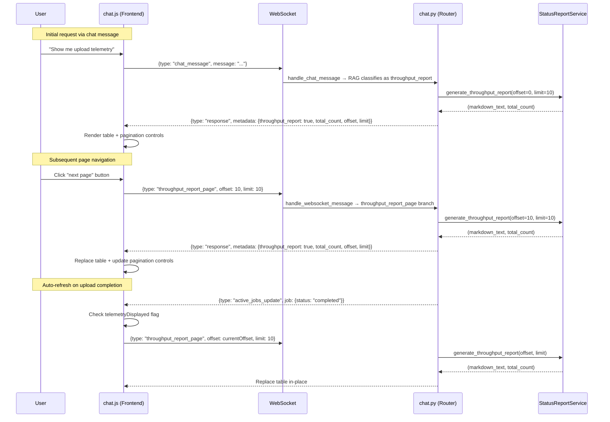

# Design Document: Upload Telemetry Enhancements

## Overview

This feature makes three targeted changes to the existing Upload Throughput Report:

1. **Rename** the user-facing label from "Upload Throughput Report" to "Upload Telemetry" (display name, heading, RAG prompt examples) while preserving all internal identifiers (`THROUGHPUT_REPORT`, `_handle_throughput_report`, `metadata.throughput_report`).
2. **Add server-side pagination** (default 10 rows/page) to `StatusReportService.generate_throughput_report()` and expose pagination metadata in the WebSocket response so the frontend can render first/prev/page-info/next/last controls matching the existing `DocumentListPanel` pattern.
3. **Auto-refresh** the telemetry table in-place when a WebSocket `active_jobs_update` completion event arrives while the report is displayed.

No new database tables, no new services, no new DI providers. The changes touch `StatusReportService`, `chat.py` (router + handler), `rag_service.py` (prompt text), `chat.js` (rendering + pagination + auto-refresh), and a small CSS addition for pagination styling.

## Architecture

The data flow for a paginated telemetry request follows the existing `document_list_request` pattern:



### Key design decisions

1. **Reuse `generate_throughput_report` with optional params.** Adding `offset`/`limit` parameters with defaults preserves backward compatibility. The return type changes from `str` to `Tuple[str, int]`, requiring a single caller update in `_handle_throughput_report`.

2. **New `throughput_report_page` message type for pagination.** Follows the same pattern as `document_list_request` — a dedicated message type with offset/limit fields, routed in `handle_websocket_message`. The initial request still goes through the chat intent pipeline; only subsequent page navigations use the new message type.

3. **In-place replacement for auto-refresh.** The frontend tracks the DOM element of the last telemetry message and replaces its content rather than appending a new message. This keeps the chat history clean and avoids scroll disruption.

4. **Frontend state tracking with a simple flag + element reference.** `telemetryDisplayed` (boolean), `telemetryMessageElement` (DOM ref), and `telemetryCurrentPage` (int) are added to `ChatApp`. The flag is set on telemetry render and cleared when a non-telemetry response is rendered.

5. **COUNT query runs alongside the paginated query.** A single additional `SELECT COUNT(*)` with the same WHERE clause. The cost is negligible since the `processing_jobs` table is small (completed uploads only).

## Components and Interfaces

### 1. StatusReportService changes

```python
# Updated signature
async def generate_throughput_report(
    self, offset: int = 0, limit: int = 10
) -> Tuple[str, int]:
    """Returns (markdown_text, total_count)."""
```

- The existing SQL query gets `OFFSET {offset} LIMIT {limit}` appended.
- A new `SELECT COUNT(*)` query with the same `WHERE` clause runs first (or in parallel).
- The heading changes from `**Upload Throughput**` to `**Upload Telemetry**`.
- On error, returns `("error message string", 0)`.
- `last_throughput_quality_data` continues to be populated for the current page's rows only.

### 2. chat.py router changes

**`_handle_throughput_report` update:**
```python
async def _handle_throughput_report(
    connection_id: str, manager: ConnectionManager,
    offset: int = 0, limit: int = 10
):
    # ...
    text, total_count = await svc.generate_throughput_report(offset=offset, limit=limit)
    # Include pagination metadata in response
    metadata = {
        'throughput_report': True,
        'quality_gate_data': quality_data,
        'total_count': total_count,
        'offset': offset,
        'limit': limit,
    }
```

**New `throughput_report_page` branch in `handle_websocket_message`:**
```python
elif message_type == 'throughput_report_page':
    offset = message_data.get('offset', 0)
    limit = message_data.get('limit', 10)
    # Validate: offset >= 0, 0 < limit <= 100
    if not (isinstance(offset, int) and offset >= 0):
        # send error
    if not (isinstance(limit, int) and 0 < limit <= 100):
        # send error
    await _handle_throughput_report(connection_id, manager, offset=offset, limit=limit)
```

**System commands list update:**
```python
("Upload Telemetry", "Show me upload telemetry"),
```

### 3. rag_service.py prompt update

Replace `"show me throughput for uploads"` and related example phrases with `"upload telemetry"`, `"Show me upload telemetry"`, `"upload telemetry stats"`. Keep the `THROUGHPUT_REPORT` keyword unchanged.

### 4. chat.js frontend changes

**New state on ChatApp:**
```javascript
this.telemetryDisplayed = false;       // is telemetry report currently shown?
this.telemetryMessageElement = null;   // DOM ref to the telemetry message
this.telemetryCurrentPage = 1;         // current page number
this.telemetryTotalCount = 0;          // total rows from server
this.telemetryLimit = 10;              // rows per page
```

**`handleChatResponse` update:**
- When `metadata.throughput_report` is true: set `telemetryDisplayed = true`, store element ref, extract `total_count`/`offset`/`limit` from metadata, render pagination controls, compute page state.
- When `metadata.throughput_report` is falsy: set `telemetryDisplayed = false`, clear element ref.

**Pagination controls rendering:**
- Appended after the telemetry table inside the message element.
- HTML structure matches `DocumentListPanel.mountInline`: `«` `‹` `{current}/{total}` `›` `»`.
- Click handlers send `{type: "throughput_report_page", offset: newOffset, limit: 10}`.

**Auto-refresh handler (in `setupWebSocketHandlers`):**
```javascript
this.wsManager.on('active_jobs_update', (data) => {
    if (data.job && data.job.status === 'completed' && this.telemetryDisplayed) {
        // Re-request current page
        this.wsManager.send({
            type: 'throughput_report_page',
            offset: (this.telemetryCurrentPage - 1) * this.telemetryLimit,
            limit: this.telemetryLimit
        });
    }
});
```

**In-place replacement:**
- When a telemetry response arrives and `telemetryMessageElement` exists, replace the inner HTML of that element instead of appending a new message.

**Page clamping on auto-refresh:**
- After receiving updated `total_count`, compute `newTotalPages = Math.ceil(total_count / limit)`. If `telemetryCurrentPage > newTotalPages`, clamp to `newTotalPages` (or 1 if 0).

## Data Models

### WebSocket inbound messages (client → server)

| Message | Schema |
|---------|--------|
| Paginated telemetry request | `{"type": "throughput_report_page", "offset": 0, "limit": 10}` |

### WebSocket outbound messages (server → client)

#### Telemetry response (existing `response` type, enhanced metadata)

```json
{
  "type": "response",
  "response": {
    "text_content": "**Upload Telemetry**\n\n| Document | Size | ...",
    "visualizations": [],
    "knowledge_citations": []
  },
  "metadata": {
    "throughput_report": true,
    "quality_gate_data": [null, {"model": "...", "fail_pct": 2.1}, ...],
    "total_count": 47,
    "offset": 0,
    "limit": 10
  }
}
```

### Validation constraints

| Field | Type | Constraint |
|-------|------|------------|
| `offset` | int | `>= 0` |
| `limit` | int | `> 0` and `<= 100` |

### Frontend state model (ChatApp instance properties)

| Property | Type | Default | Description |
|----------|------|---------|-------------|
| `telemetryDisplayed` | boolean | `false` | Whether telemetry report is currently shown |
| `telemetryMessageElement` | HTMLElement \| null | `null` | DOM reference to the telemetry message |
| `telemetryCurrentPage` | number | `1` | Current page number |
| `telemetryTotalCount` | number | `0` | Total row count from server |
| `telemetryLimit` | number | `10` | Rows per page |


## Correctness Properties

*A property is a characteristic or behavior that should hold true across all valid executions of a system — essentially, a formal statement about what the system should do. Properties serve as the bridge between human-readable specifications and machine-verifiable correctness guarantees.*

### Property 1: Paginated row count invariant

*For any* set of completed uploads of size N, and *for any* valid `offset` (0 ≤ offset) and `limit` (0 < limit ≤ 100), the number of data rows in the returned markdown table should equal `min(limit, max(0, N - offset))`.

**Validates: Requirements 2.2, 2.5**

### Property 2: Total count is independent of pagination parameters

*For any* set of completed uploads of size N, and *for any* valid `offset` and `limit`, the `total_count` returned by `generate_throughput_report(offset, limit)` should equal N.

**Validates: Requirements 2.3, 2.4**

### Property 3: Pagination button disabled states

*For any* `currentPage` ≥ 1 and `totalPages` ≥ 1, the first-page and previous-page buttons should be disabled if and only if `currentPage == 1`, and the next-page and last-page buttons should be disabled if and only if `currentPage == totalPages`.

**Validates: Requirements 3.3, 3.4**

### Property 4: Pagination offset and total pages computation

*For any* non-negative integer `totalCount` and positive integer `limit`, `totalPages` should equal `ceil(totalCount / limit)`. *For any* `currentPage` in `[1, totalPages]` and button action in `{first, prev, next, last}`, the resulting `offset` sent to the server should equal `(targetPage - 1) * limit` where `targetPage` is computed correctly for the action.

**Validates: Requirements 3.5, 3.6**

### Property 5: Input validation rejects invalid offset and limit

*For any* `offset` that is negative or non-integer, or *for any* `limit` that is ≤ 0, > 100, or non-integer, the `throughput_report_page` handler should return an error response and not call `generate_throughput_report`.

**Validates: Requirements 4.3, 4.4**

### Property 6: Auto-refresh triggers if and only if telemetry is displayed and job completed

*For any* combination of `telemetryDisplayed` (boolean) and `job.status` (string), a telemetry re-request should be sent if and only if `telemetryDisplayed == true` AND `job.status == "completed"`.

**Validates: Requirements 5.1, 5.2**

### Property 7: Telemetry display flag tracks response metadata

*For any* sequence of WebSocket responses with varying `metadata.throughput_report` values, the `telemetryDisplayed` flag should equal the `throughput_report` value of the most recently rendered response (true if present and truthy, false otherwise).

**Validates: Requirements 5.3**

### Property 8: Page clamping on auto-refresh

*For any* `currentPage` ≥ 1 and `newTotalPages` ≥ 1, after auto-refresh the displayed page should equal `min(currentPage, newTotalPages)`. When `newTotalPages` is 0 (no data), the displayed page should be 1.

**Validates: Requirements 5.5**

## Error Handling

| Scenario | Behavior |
|----------|----------|
| **Database query fails in `generate_throughput_report`** | Return `("Throughput data is temporarily unavailable.", 0)`. Existing behavior preserved, now returns tuple. (Req 2.6) |
| **Invalid `offset`/`limit` in `throughput_report_page`** | Return `{type: "error", message: "..."}` with descriptive validation error. Do not call `generate_throughput_report`. (Req 4.3, 4.4) |
| **`StatusReportService` unavailable** | `_handle_throughput_report` catches the exception and sends a fallback error message, same as current behavior. (Existing pattern) |
| **`offset` exceeds total rows** | Return empty table body (heading + column headers only) with correct `total_count`. Frontend computes `totalPages` and clamps `currentPage`. (Req 2.5) |
| **Auto-refresh WebSocket send fails** | Frontend silently ignores the failure. The user can manually re-request. No retry loop to avoid flooding. |
| **`total_count` is 0 (no completed uploads)** | Frontend renders "No completed uploads found." message without pagination controls. `totalPages` computes to 0, pagination hidden. |

## Testing Strategy

### Property-based tests (Hypothesis, minimum 100 iterations each)

Property-based testing is appropriate here because the core logic involves pure functions (pagination arithmetic, row slicing, input validation, state flag management) with clear input/output behavior and a meaningful input space.

Library: **Hypothesis** (already in use — `.hypothesis/` directory exists).

Each property test will be tagged with:
`Feature: upload-telemetry-enhancements, Property {N}: {title}`

| Property | What to generate | What to assert |
|----------|-----------------|----------------|
| P1: Paginated row count | Random lists of upload row dicts (0–200 items), random offset (0–250), random limit (1–100) | Count of data rows in markdown == `min(limit, max(0, len(rows) - offset))` |
| P2: Total count independence | Same as P1 | `total_count` == `len(rows)` regardless of offset/limit |
| P3: Button disabled states | Random `currentPage` (1–100), random `totalPages` (1–100) | first/prev disabled iff page==1; next/last disabled iff page==totalPages |
| P4: Pagination arithmetic | Random `totalCount` (0–500), random `limit` (1–100), random `currentPage`, random action | `totalPages == ceil(totalCount/limit)`; offset == `(targetPage-1)*limit` |
| P5: Input validation | Random invalid offsets (negative ints, floats, strings), random invalid limits (0, negatives, >100, floats, strings) | Error response returned; `generate_throughput_report` not called |
| P6: Auto-refresh trigger | Random booleans for `telemetryDisplayed`, random strings for `job.status` | Re-request sent iff both conditions met |
| P7: Flag tracking | Random sequences of response metadata dicts with varying `throughput_report` values | Flag matches last response's value |
| P8: Page clamping | Random `currentPage` (1–100), random `newTotalPages` (0–100) | Result == `min(currentPage, max(1, newTotalPages))` |

### Unit tests (example-based)

| Test | Covers |
|------|--------|
| System commands list contains `("Upload Telemetry", "Show me upload telemetry")` | Req 1.1 |
| `generate_throughput_report` output starts with `**Upload Telemetry**` | Req 1.2 |
| Internal identifiers unchanged (`THROUGHPUT_REPORT`, `_handle_throughput_report`, `throughput_report` metadata key) | Req 1.4 |
| Database error returns `("...unavailable.", 0)` | Req 2.6 |
| Response metadata includes `total_count`, `offset`, `limit` keys | Req 3.7 |
| `throughput_report_page` message type is handled without error | Req 4.1 |
| Handler calls `generate_throughput_report` with correct offset/limit | Req 4.2 |
| RAG prompt contains "upload telemetry" and "THROUGHPUT_REPORT" | Req 6.1, 6.2 |

### Integration tests (example-based)

| Test | Covers |
|------|--------|
| "Show me upload telemetry" classifies as `throughput_report` intent | Req 1.3, 6.3 |
| End-to-end pagination: request page 1, then page 2, verify different rows | Req 2.2, 4.2 |
| Auto-refresh replaces DOM content in-place (frontend integration) | Req 5.4 |
| Pagination controls render with correct structure (5 elements in order) | Req 3.1, 3.2 |
